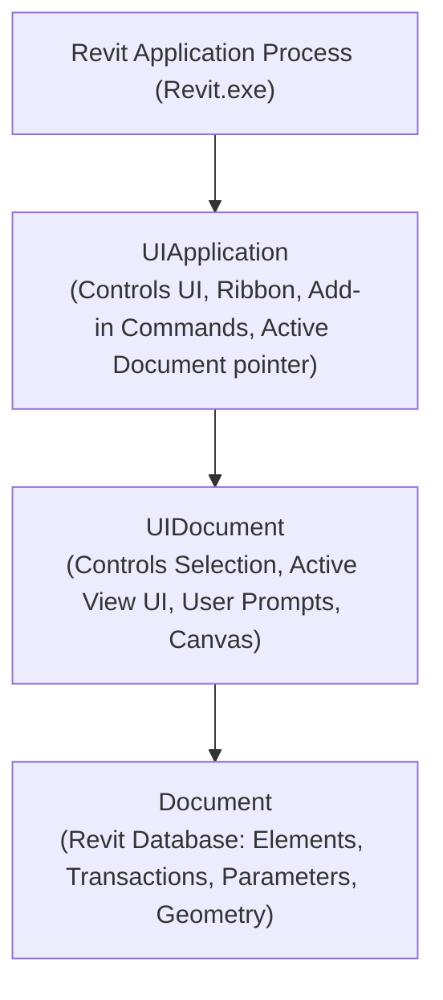
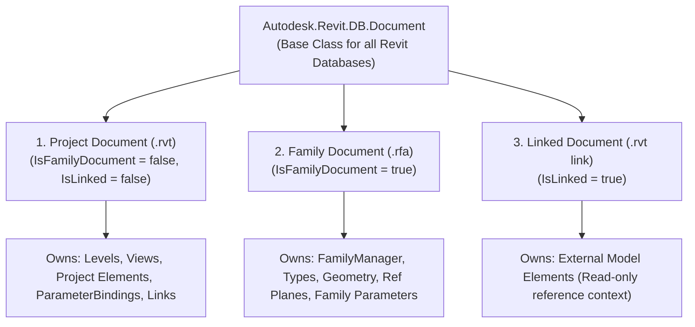
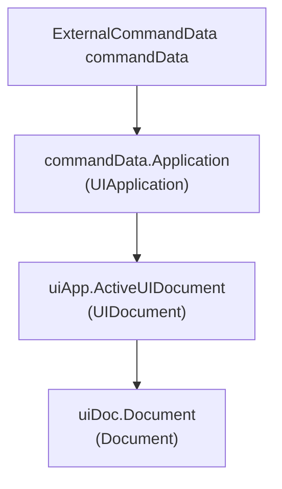
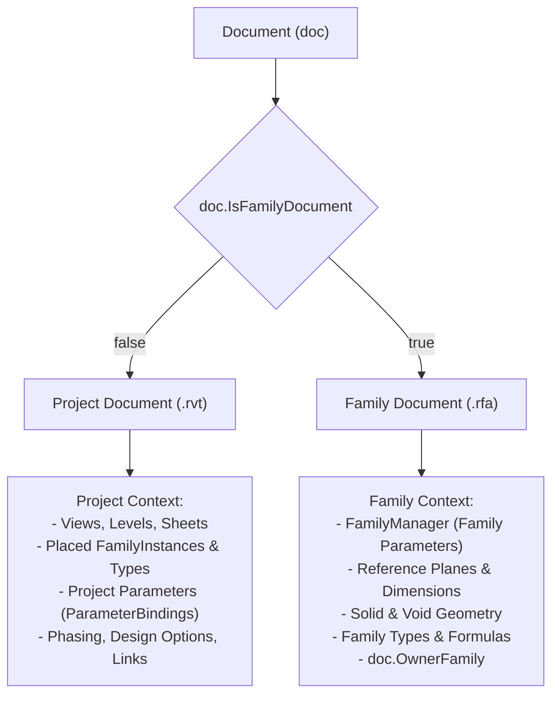
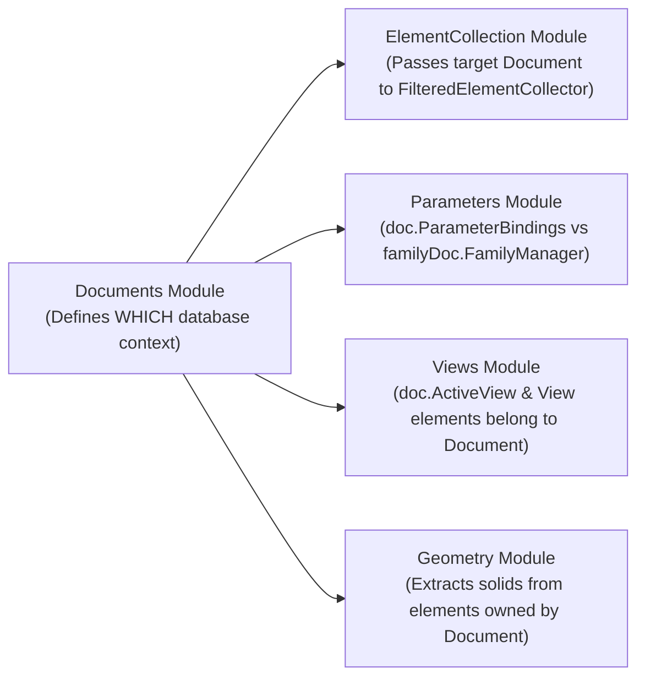
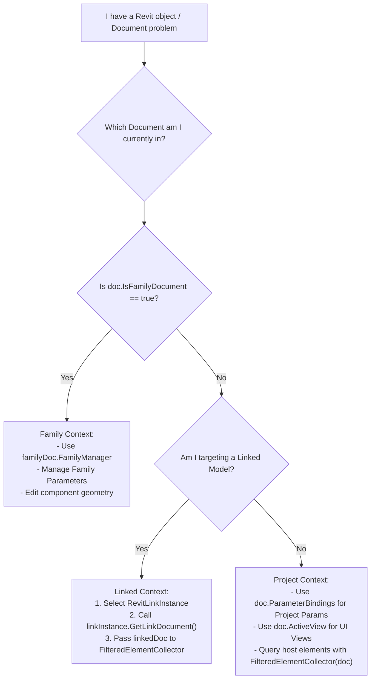
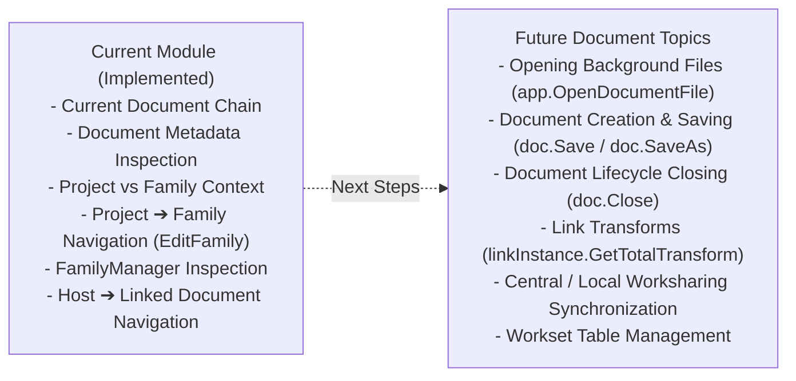

# Documents Module — Revit API Educational Guide

Welcome to the **Documents Module** educational documentation. In Autodesk Revit, the entire Building Information Model—its geometry, parameters, types, views, links, and system settings—is housed within a **Document**.

This guide teaches you **the Revit API mental model behind Documents**: how the Revit application manages active sessions, how to navigate between different document contexts (Project, Family, and Linked Documents), which document owns which BIM objects, and how to avoid document context boundary bugs.

---

## 1. Module Purpose & Core Mental Model

### What is a Document in the Revit API?

To understand how Revit organizes data, you must understand the four-tier architectural hierarchy of the Revit API:

```
Revit Application (Process / Revit Session)
       │
       ▼
  UIApplication (UI Context & Ribbon)
       │
       ▼
   UIDocument (Active UI Drawing Window)
       │
       ▼
    Document (Database & Data Model)
```

### The Three API Layers Explained



| Layer | Type | Responsibility & Purpose |
| :--- | :--- | :--- |
| **`UIApplication`** | `Autodesk.Revit.UI.UIApplication` | Represents the **Revit application session**. Provides access to top-level application events, add-in ribbon tabs, and the pointer to the currently focused UI document (`uiApp.ActiveUIDocument`). |
| **`UIDocument`** | `Autodesk.Revit.UI.UIDocument` | Represents the **UI wrapper** of an open document in the graphical canvas. Handles user interaction, interactive graphical selection (`uiDoc.Selection.PickObject`), and view navigation. |
| **`Document`** | `Autodesk.Revit.DB.Document` | Represents the **Revit database**. Contains all elements, parameters, categories, types, and geometries. This is the primary object used to read, query, create, and modify BIM data inside transactions. |

> [!NOTE]
> `UIDocument` and `Document` are **not interchangeable**:
> - If you need user input or selection, you need `UIDocument`.
> - If you need to query database elements (`GetElement`), start transactions, or inspect parameters, you need `Document`.

---

## 2. Document Contexts

In the Revit API, the single class `Autodesk.Revit.DB.Document` represents three fundamentally distinct **Document Contexts**:



```
Document
│
├── Project Document (.rvt)  ──► Contains project elements, views, levels, parameter bindings
│
├── Family Document (.rfa)   ──► Contains family geometry, family types, FamilyManager
│
└── Linked Document (.rvt)   ──► External model loaded as a reference into the host project
```

Even though all three are instances of `Autodesk.Revit.DB.Document`, **the operations, APIs, and elements available to each context differ completely**.

---

## 3. Sample Index

The following table lists the **6 educational Commands** currently implemented in the Documents Module ([`Samples/Documents/Commands/`](file:///f:/02-programming/06-%20Revit%20API/projects/RevitApiSamples/RevitApiSamples/Samples/Documents/Commands/)):

| # | Command File | Main Concept | Important APIs | Learning Objective |
| :-: | :--- | :--- | :--- | :--- |
| **01** | [`GetCurrentDocumentCommand.cs`](file:///f:/02-programming/06-%20Revit%20API/projects/RevitApiSamples/RevitApiSamples/Samples/Documents/Commands/GetCurrentDocumentCommand.cs) | Current Document Access Chain | `commandData.Application`, `uiApp.ActiveUIDocument`, `uiDoc.Document` | Understand the entry point chain from `ExternalCommandData` down to the database `Document`. |
| **02** | [`GetDocumentInformationCommand.cs`](file:///f:/02-programming/06-%20Revit%20API/projects/RevitApiSamples/RevitApiSamples/Samples/Documents/Commands/GetDocumentInformationCommand.cs) | Document Metadata Inspection | `doc.Title`, `doc.PathName`, `doc.IsWorkshared`, `doc.IsLinked`, `doc.Application` | How to inspect document metadata, storage paths, worksharing status, and Revit version. |
| **03** | [`ProjectVsFamilyDocumentCommand.cs`](file:///f:/02-programming/06-%20Revit%20API/projects/RevitApiSamples/RevitApiSamples/Samples/Documents/Commands/ProjectVsFamilyDocumentCommand.cs) | Project vs. Family Context | `doc.IsFamilyDocument`, `doc.OwnerFamily` | How to determine whether a document is a Project or a Family and what functionality belongs to each. |
| **04** | [`OpenFamilyDocumentCommand.cs`](file:///f:/02-programming/06-%20Revit%20API/projects/RevitApiSamples/RevitApiSamples/Samples/Documents/Commands/OpenFamilyDocumentCommand.cs) | Project $\rightarrow$ Family Navigation | `familyInstance.Symbol.Family`, `projectDoc.EditFamily(family)` | How to transition from a placed family instance in a project to its underlying `FamilyDocument`. |
| **05** | [`AccessFamilyManagerCommand.cs`](file:///f:/02-programming/06-%20Revit%20API/projects/RevitApiSamples/RevitApiSamples/Samples/Documents/Commands/AccessFamilyManagerCommand.cs) | Family Parameter Management | `familyDoc.FamilyManager`, `familyManager.Parameters` | How to access `FamilyManager` inside a family document to inspect family parameters. |
| **06** | [`GetLinkedDocumentCommand.cs`](file:///f:/02-programming/06-%20Revit%20API/projects/RevitApiSamples/RevitApiSamples/Samples/Documents/Commands/GetLinkedDocumentCommand.cs) | Host $\rightarrow$ Linked Document Navigation | `RevitLinkInstance`, `linkInstance.GetLinkDocument()` | How to navigate from a host link instance to the external linked `Document` context. |

---

## 4. Command 01 — Current Document Access Chain

**File:** [`GetCurrentDocumentCommand.cs`](file:///f:/02-programming/06-%20Revit%20API/projects/RevitApiSamples/RevitApiSamples/Samples/Documents/Commands/GetCurrentDocumentCommand.cs)

### The Navigation Chain

When an `IExternalCommand` is triggered in Revit, the entry point receives `ExternalCommandData commandData`. From this parameter, you traverse down to the active database document:



```csharp
// 1. Retrieve UIApplication (Application Context)
UIApplication uiApp = commandData.Application;

// 2. Retrieve UIDocument (UI Context)
UIDocument uiDoc = uiApp.ActiveUIDocument;
if (uiDoc == null)
{
    TaskDialog.Show("Document", "No active UIDocument was found.");
    return Result.Failed;
}

// 3. Retrieve Document (Database Context)
Document doc = uiDoc.Document;
if (doc == null)
{
    TaskDialog.Show("Document", "No active Document was found.");
    return Result.Failed;
}
```

### Why This Chain Exists

1. **`commandData.Application`**: Gives access to the entire Revit process session (`UIApplication`).
2. **`uiApp.ActiveUIDocument`**: In Revit, multiple documents can be open simultaneously in separate tabs or floating windows. `ActiveUIDocument` identifies the specific document window currently receiving keyboard and mouse focus.
3. **`uiDoc.Document`**: Extracts the underlying database instance (`Document`) from the active UI window so your code can read and write model data.

---

## 5. Command 02 — Document Information & Metadata

**File:** [`GetDocumentInformationCommand.cs`](file:///f:/02-programming/06-%20Revit%20API/projects/RevitApiSamples/RevitApiSamples/Samples/Documents/Commands/GetDocumentInformationCommand.cs)

`GetDocumentInformationCommand` inspects the core metadata describing the document's state, identity, and storage location:

```csharp
Document doc = uiDoc.Document;

string title = doc.Title;
string path = string.IsNullOrEmpty(doc.PathName) ? "Not saved / No path" : doc.PathName;
bool isFamily = doc.IsFamilyDocument;
bool isWorkshared = doc.IsWorkshared;
bool isLinked = doc.IsLinked;
string appVersionName = doc.Application.VersionName;
string appVersionNumber = doc.Application.VersionNumber;
```

### Metadata Properties Breakdown

| Property | Return Type | Question It Answers | Why It Is Useful |
| :--- | :--- | :--- | :--- |
| **`Title`** | `string` | "What is the display name of this document?" | Displays document title in dialogs, logs, and exports (e.g., `"Project1"` or `"Single-Flush"`). |
| **`PathName`** | `string` | "Where is the file saved on disk / network?" | Checking if the document is saved on disk; generating export file paths. Returns empty string `""` for unsaved new documents. |
| **`IsFamilyDocument`** | `bool` | "Is this a Family (`.rfa`) or a Project (`.rvt`)?" | Branching logic between project workflows and family editing workflows. |
| **`IsWorkshared`** | `bool` | "Is multi-user worksharing enabled?" | Determining whether worksets, checkout statuses, and central models exist. |
| **`IsLinked`** | `bool` | "Is this document acting as a link inside another host?" | Guarding against modifying external read-only linked documents. |
| **`Application`** | `Application` | "Which Revit DB Application instance owns this document?" | Accessing application-wide utilities, unit systems, and version information. |
| **`Application.VersionName`** | `string` | "What is the marketing name of the running Revit version?" | E.g., `"Autodesk Revit 2025"`. |
| **`Application.VersionNumber`**| `string` | "What is the major build year of the Revit engine?" | E.g., `"2025"`. Used for feature-availability checks. |

### Important Distinction: `IsWorkshared` vs `PathName`

A common beginner mistake is confusing the **storage location** (`PathName`) with the **worksharing state** (`IsWorkshared`):

```
doc.IsWorkshared ──► Answers: "Is worksharing enabled for multi-user collaboration?"
doc.PathName     ──► Answers: "Where is this specific file stored on disk?"
```

> [!IMPORTANT]
> `PathName` returns the path to the currently open file (the local copy in a workshared project, or the standalone file in a non-workshared project). `IsWorkshared` indicates whether worksets and central synchronizing mechanisms exist. Checking `IsWorkshared` does not change what `PathName` returns.

---

## 6. Command 03 — Project Document vs. Family Document

**File:** [`ProjectVsFamilyDocumentCommand.cs`](file:///f:/02-programming/06-%20Revit%20API/projects/RevitApiSamples/RevitApiSamples/Samples/Documents/Commands/ProjectVsFamilyDocumentCommand.cs)

### The Architectural Distinction



```csharp
if (doc.IsFamilyDocument)
{
    // Family Document Context
    string familyName = doc.OwnerFamily?.Name ?? "Unknown";
    // Accessible: doc.FamilyManager
}
else
{
    // Project Document Context
    // Accessible: doc.ParameterBindings, Views, Levels, Model Elements
}
```

### Context Capability Matrix

| Capability / Concept | Project Document (`.rvt`) | Family Document (`.rfa`) |
| :--- | :---: | :---: |
| **`doc.IsFamilyDocument`** | `false` | `true` |
| **`doc.FamilyManager`** | ❌ (Throws / Invalid) | ✔ (Manages Family Parameters & Types) |
| **`doc.ParameterBindings`** | ✔ (Project Parameter Bindings) | ❌ (Not applicable) |
| **Levels (`Level`) & Sheets (`ViewSheet`)**| ✔ | ❌ |
| **Placed Model Instances (`FamilyInstance`)**| ✔ | ❌ (Contains component geometry, not instances) |
| **Revit Links (`RevitLinkInstance`)** | ✔ | ❌ |

---

## 7. Important Distinction — Family vs. Family Document

One of the most important architectural rules in the Revit API is:

> **A `Family` loaded into a project is NOT a `Family Document`.**

```mermaid
flowchart TD
    subgraph ProjectContext["Project Document Context (.rvt)"]
        Proj["Project Document"] --> Inst["FamilyInstance\n(Physical placed door on Level 1)"]
        Inst --> Sym["FamilySymbol\n(Type: '36x84')"]
        Sym --> Fam["Family Element\n(Definition: 'Single-Flush')"]
    end
    
    subgraph Transition["API Transition Method"]
        Fam -->|projectDoc.EditFamily(fam)| EditFam["EditFamily()"]
    end
    
    subgraph FamilyContext["Family Document Context (.rfa)"]
        EditFam --> FamDoc["Family Document\n(Separate DB Context in Memory)"]
        FamDoc --> FM["FamilyManager\n(Parameters: Width, Height, Material)"]
        FamDoc --> Geo["Family Geometry\n(Extrusions, Blends, Sweeps)"]
    end
```

### Why They Are Different

1. **Inside the Project Document**:
   - `Family` is an `Element` in the project database acting as a container for `FamilySymbol` (types).
   - You **cannot** query reference planes, create family formulas, or modify family geometry directly through the `Family` element in the project.
2. **Inside the Family Document**:
   - Calling `projectDoc.EditFamily(family)` generates a new, independent `Document` object in memory representing the family's `.rfa` database.
   - Only inside this `familyDoc` does the `FamilyManager` and internal family geometry exist.

---

## 8. Command 04 — Open Family Document

**File:** [`OpenFamilyDocumentCommand.cs`](file:///f:/02-programming/06-%20Revit%20API/projects/RevitApiSamples/RevitApiSamples/Samples/Documents/Commands/OpenFamilyDocumentCommand.cs)

### Workflow

```
Project Document
       │
       ▼
Select FamilyInstance (PickObject)
       │
       ▼
Get FamilySymbol (instance.Symbol)
       │
       ▼
Get Family (symbol.Family)
       │
       ▼
Open Family Document (projectDoc.EditFamily(family))
       │
       ▼
Family Document (Separate Context in Memory)
```

### Implementation

```csharp
// 1. Pick a FamilyInstance in the project UI
Reference reference = uiDoc.Selection.PickObject(ObjectType.Element, "Select a Family Instance");
Element element = projectDoc.GetElement(reference);
FamilyInstance familyInstance = element as FamilyInstance;

// 2. Traverse from Instance -> Symbol -> Family
Family family = familyInstance.Symbol.Family;

// 3. Open the Family Document using EditFamily
Document familyDoc = projectDoc.EditFamily(family);

if (familyDoc == null)
{
    TaskDialog.Show("Family Document", "The Family Document could not be opened.");
    return Result.Failed;
}

// 4. Verify the new document context
TaskDialog.Show(
    "Family Document",
    $"Family: {family.Name}\n" +
    $"Project: {projectDoc.Title}\n" +
    $"Family Document: {familyDoc.Title}\n" +
    $"IsFamilyDocument: {familyDoc.IsFamilyDocument}");
```

### Conceptual Change After `EditFamily()`

| State | Available Documents | Description |
| :--- | :--- | :--- |
| **Before `EditFamily()`** | `projectDoc` | Only the main project database is accessible. |
| **After `EditFamily()`** | `projectDoc` + `familyDoc` | You now hold **two distinct `Document` references**. Operations on `familyDoc` modify the family definition in memory without immediately altering the host project. |

---

## 9. Command 05 — Access Family Manager

**File:** [`AccessFamilyManagerCommand.cs`](file:///f:/02-programming/06-%20Revit%20API/projects/RevitApiSamples/RevitApiSamples/Samples/Documents/Commands/AccessFamilyManagerCommand.cs)

### The Purpose of `FamilyManager`

`FamilyManager` is the specialized manager class used exclusively within **Family Documents** to create, inspect, and modify **Family Parameters** and **Family Types**.

```mermaid
flowchart TD
    ProjDoc["Project Document"] -->|EditFamily(fam)| FamDoc["Family Document"]
    FamDoc --> FM["familyDoc.FamilyManager"]
    FM --> Params["familyManager.Parameters"]
    
    Params --> P1["Parameter 1 (Name, IsInstance, IsShared)"]
    Params --> P2["Parameter 2 (Name, IsInstance, IsShared)"]
    Params --> P3["Parameter 3 (Name, IsInstance, IsShared)"]
```

```csharp
// 1. Obtain Family Document
Document familyDoc = projectDoc.EditFamily(family);

// 2. Access FamilyManager
FamilyManager familyManager = familyDoc.FamilyManager;
if (familyManager == null)
{
    TaskDialog.Show("Family Manager", "FamilyManager could not be accessed.");
    return Result.Failed;
}

// 3. Inspect Family Parameters
IList<FamilyParameter> parameters = familyManager.Parameters
    .Cast<FamilyParameter>()
    .ToList();

foreach (FamilyParameter parameter in parameters)
{
    string name = parameter.Definition.Name;
    bool isInstance = parameter.IsInstance;
    bool isShared = parameter.IsShared;
}
```

### Connecting to the Parameters Module: Project vs. Family Parameters

In the [Parameters Module](file:///f:/02-programming/06-%20Revit%20API/projects/RevitApiSamples/RevitApiSamples/Samples/Parameters/ParameterModule.md), we learned how parameters store BIM data. The **Document context** determines how parameter definitions are managed:

```
Project Parameter Management:
Project Document (.rvt)  ──►  doc.ParameterBindings  ──►  InstanceBinding / TypeBinding

Family Parameter Management:
Family Document (.rfa)   ──►  familyDoc.FamilyManager  ──►  FamilyParameter (IsInstance / IsShared)
```

> [!WARNING]
> Calling `doc.FamilyManager` on a Project Document will throw an exception or return `null`. `FamilyManager` is strictly a **Family Document context** API.

---

## 10. Command 06 — Linked Documents

**File:** [`GetLinkedDocumentCommand.cs`](file:///f:/02-programming/06-%20Revit%20API/projects/RevitApiSamples/RevitApiSamples/Samples/Documents/Commands/GetLinkedDocumentCommand.cs)

### Understanding Revit Links

When a project links another Revit model (e.g., a Structural model linked into an Architectural model):
1. **`RevitLinkInstance`**: The link placement element that lives inside the **Host Project Document**. It defines where the linked model sits in 3D space (translation, rotation, coordinates).
2. **`Linked Document`**: The actual external database (`Document`) containing the linked model's walls, beams, columns, and levels.

```mermaid
flowchart TD
    Host["Host Project Document (e.g., 'Architectural.rvt')"]
    
    Host --> HostWalls["Host Wall #1001"]
    Host --> HostColumns["Host Column #1002"]
    Host --> LinkInst["RevitLinkInstance #2001\n(Belongs to Host Document)"]
    
    LinkInst -->|linkInstance.GetLinkDocument()| LinkedDoc["Linked Document\n(e.g., 'Structural.rvt')\n(IsLinked = true)"]
    
    LinkedDoc --> LinkedFraming["Linked Framing #5001"]
    LinkedDoc --> LinkedColumns["Linked Column #5002"]
    LinkedDoc --> LinkedFoundations["Linked Foundation #5003"]
```

### Implementation

```csharp
// 1. Pick a Revit Link in the Host UI
Reference reference = uiDoc.Selection.PickObject(ObjectType.Element, "Select a Revit Link");
Element element = hostDoc.GetElement(reference);
RevitLinkInstance linkInstance = element as RevitLinkInstance;

if (linkInstance == null)
{
    TaskDialog.Show("Linked Document", "The selected element is not a Revit Link.");
    return Result.Failed;
}

// 2. Access the Linked Document
Document linkedDoc = linkInstance.GetLinkDocument();

if (linkedDoc == null)
{
    TaskDialog.Show("Linked Document", "The Linked Document could not be accessed (Link may be unloaded).");
    return Result.Failed;
}

// 3. Inspect Linked Document info
TaskDialog.Show(
    "Linked Document",
    $"Host Document: {hostDoc.Title}\n" +
    $"Link Instance: {linkInstance.Name}\n" +
    $"Linked Document: {linkedDoc.Title}\n" +
    $"Is Linked: {linkedDoc.IsLinked}\n" +
    $"Path: {linkedDoc.PathName}");
```

---

## 11. Host Document vs. Linked Document Element Ownership

A fundamental rule of Revit API development is:

> **An element inside a linked model is NOT owned by the Host Document.**

```
hostDoc.GetElement(elementId)    ──► Queries ONLY elements owned by Host Document
linkedDoc.GetElement(elementId)  ──► Queries elements owned by Linked Document
```

### Cross-Module Connection: Element Collection in Linked Documents

As established in the [Element Collection Module](file:///f:/02-programming/06-%20Revit%20API/projects/RevitApiSamples/RevitApiSamples/Samples/ElementCollection/ElementCollection.md), `FilteredElementCollector` searches the database of whichever `Document` is passed to its constructor:

```csharp
// Querying Host Walls:
List<Wall> hostWalls = new FilteredElementCollector(hostDoc)
    .OfCategory(BuiltInCategory.OST_Walls)
    .WhereElementIsNotElementType()
    .Cast<Wall>()
    .ToList();

// Querying Linked Structural Columns:
List<FamilyInstance> linkedColumns = new FilteredElementCollector(linkedDoc)
    .OfCategory(BuiltInCategory.OST_StructuralColumns)
    .WhereElementIsNotElementType()
    .Cast<FamilyInstance>()
    .ToList();
```

> [!IMPORTANT]
> If you pass `hostDoc` into the collector, you will **never** find elements that exist inside the linked file. You must first obtain `linkedDoc = linkInstance.GetLinkDocument()` and pass `linkedDoc` into the `FilteredElementCollector`.

---

## 12. Document Navigation Pathways

The following master diagram illustrates the **three core navigation pathways** demonstrated across this module:

```mermaid
flowchart TD
    subgraph PathA["PATH A: Current Project Access"]
        UIAppA["UIApplication (commandData.Application)"] --> UIDocA["UIDocument (uiApp.ActiveUIDocument)"]
        UIDocA --> DocA["Document (uiDoc.Document)"]
    end

    subgraph PathB["PATH B: Project ➔ Family Navigation"]
        DocB["Project Document"] --> PickInst["FamilyInstance"]
        PickInst --> SymB["FamilySymbol"]
        SymB --> FamB["Family"]
        FamB -->|projectDoc.EditFamily(family)| FamDocB["Family Document"]
        FamDocB --> FMB["familyDoc.FamilyManager"]
    end

    subgraph PathC["PATH C: Host ➔ Linked Document Navigation"]
        DocC["Host Document"] --> PickLink["RevitLinkInstance"]
        PickLink -->|linkInstance.GetLinkDocument()| LinkDocC["Linked Document"]
        LinkDocC --> LinkedFEC["FilteredElementCollector(linkedDoc)"]
    end
```

---

## 13. Comparison: Project vs. Family vs. Linked Document

| Comparison Factor | Project Document (`.rvt`) | Family Document (`.rfa`) | Linked Document (`.rvt Link`) |
| :--- | :--- | :--- | :--- |
| **Context Role** | Active design & construction model | Component geometry & parameter definition | Referenced external model |
| **How You Reach It** | `uiApp.ActiveUIDocument.Document` | `projectDoc.EditFamily(family)` | `linkInstance.GetLinkDocument()` |
| **`IsFamilyDocument`** | `false` | `true` | `false` |
| **`IsLinked`** | `false` | `false` | `true` |
| **Primary Parameter API**| `doc.ParameterBindings` | `familyDoc.FamilyManager` | Read-only parameter inspection on elements |
| **Contained Objects** | Views, Levels, Sheets, Model Instances, Links | Ref Planes, Solid Geometries, Formulas, Types | External model elements |
| **Can Modify Elements?**| Yes (inside Transaction) | Yes (inside Transaction) | No (Read-only in host session) |
| **Relationship to Host** | Is the Host Document itself | Child definition loaded into host | External database referenced by host |

---

## 14. Document Ownership Mental Model

Always ask: **"Which Document owns the object I am trying to inspect or modify?"**

```
BIM Object                              Owning Document Context
─────────────────────────────────────────────────────────────────────────────
FamilyInstance (Placed Door)       ──►  Project Document
Family Element (Door Family)       ──►  Project Document
Family Geometry (Extrusions)       ──►  Family Document (via EditFamily)
FamilyParameter (Door Width)       ──►  Family Document (via FamilyManager)
RevitLinkInstance (Link Marker)    ──►  Host Project Document
Wall inside Linked Model           ──►  Linked Document (via GetLinkDocument)
```

> [!TIP]
> Never pass an `ElementId` from a Linked Document into `hostDoc.GetElement(id)`—Revit will either return `null` or retrieve an entirely unrelated host element that coincidentally shares the same integer ID.

---

## 15. Common Mistakes & Wrong Mental Models

### Mistake 1: Confusing `UIDocument` with `Document`
- ❌ **Wrong:** Trying to call `uiDoc.GetElement(id)` or `new FilteredElementCollector(uiDoc)`.
- ✔ **Correct:** `UIDocument` manages UI and selections; `Document` manages the database.
- 🛠️ **API Approach:** Use `uiDoc.Document.GetElement(id)`.

### Mistake 2: Assuming `Family` == `Family Document`
- ❌ **Wrong:** Attempting to query reference planes or family formulas from a `Family` element in the project.
- ✔ **Correct:** `Family` is just a project container element. The `.rfa` database only exists inside a `Family Document`.
- 🛠️ **API Approach:** Use `projectDoc.EditFamily(family)` to open the `Family Document`.

### Mistake 3: Trying to Access `FamilyManager` from a Project Document
- ❌ **Wrong:** Calling `doc.FamilyManager` in a project add-in.
- ✔ **Correct:** `FamilyManager` only exists when `doc.IsFamilyDocument == true`.
- 🛠️ **API Approach:** Open the family with `EditFamily()` first, then access `familyDoc.FamilyManager`.

### Mistake 4: Trying to Use `ParameterBindings` for Family Parameters
- ❌ **Wrong:** Querying `familyDoc.ParameterBindings` to inspect family parameters.
- ✔ **Correct:** `ParameterBindings` is for Project Parameters in project files. Family parameters are managed via `FamilyManager`.
- 🛠️ **API Approach:** Inspect `familyDoc.FamilyManager.Parameters`.

### Mistake 5: Assuming `RevitLinkInstance` is the Linked Document
- ❌ **Wrong:** Casting `RevitLinkInstance` to `Document` or querying linked walls directly from `linkInstance`.
- ✔ **Correct:** `RevitLinkInstance` is an element in the host document pointing to the link.
- 🛠️ **API Approach:** Call `linkInstance.GetLinkDocument()` to obtain the actual `Document`.

### Mistake 6: Trying to Retrieve Linked Elements Directly from the Host Document
- ❌ **Wrong:** Running `new FilteredElementCollector(hostDoc).OfCategory(OST_Walls)` expecting to find linked walls.
- ✔ **Correct:** Linked elements belong exclusively to the `Linked Document` database.
- 🛠️ **API Approach:** Pass `linkedDoc` to the collector: `new FilteredElementCollector(linkedDoc)`.

### Mistake 7: Assuming `IsWorkshared` Determines the File Path
- ❌ **Wrong:** Writing branching code expecting `doc.PathName` to be invalid if `doc.IsWorkshared` is true.
- ✔ **Correct:** `IsWorkshared` describes worksets/collaboration; `PathName` returns the disk path of the local or standalone file.
- 🛠️ **API Approach:** Treat `doc.IsWorkshared` and `doc.PathName` as independent properties.

### Mistake 8: Assuming Every Document is a Project Document
- ❌ **Wrong:** Writing commands that blindly assume `doc.ActiveView` or `doc.Levels` exist without checking if the user opened an `.rfa` file.
- ✔ **Correct:** A command can be run while a family file is open.
- 🛠️ **API Approach:** Check `if (doc.IsFamilyDocument)` before executing project-only logic.

### Mistake 9: Assuming the Linked Document is the Same Object as the Host Document
- ❌ **Wrong:** Modifying elements in `linkedDoc` expecting changes to save into `hostDoc`.
- ✔ **Correct:** `linkedDoc` is an external file context. Modifying it requires editing the source file directly.
- 🛠️ **API Approach:** Treat linked documents in host sessions as read-only reference data.

### Mistake 10: Forgetting that One `Document` Class Represents Multiple Contexts
- ❌ **Wrong:** Expecting separate classes like `ProjectDocument`, `FamilyDocument`, `LinkedDocument`.
- ✔ **Correct:** The Revit API uses the single class `Autodesk.Revit.DB.Document` for all contexts.
- 🛠️ **API Approach:** Inspect contextual flags (`doc.IsFamilyDocument`, `doc.IsLinked`).

---

## 16. Cross-Module Relationships



1. **[Element Collection Module](file:///f:/02-programming/06-%20Revit%20API/projects/RevitApiSamples/RevitApiSamples/Samples/ElementCollection/ElementCollection.md)**:
   - Every `FilteredElementCollector` requires a target `Document`. The document context determines whether you are searching host elements, linked elements, or family components.
2. **[Parameters Module](file:///f:/02-programming/06-%20Revit%20API/projects/RevitApiSamples/RevitApiSamples/Samples/Parameters/ParameterModule.md)**:
   - Project Parameter bindings belong to `projectDoc.ParameterBindings`. Family Parameter definitions belong to `familyDoc.FamilyManager`.
3. **[Views Module](file:///f:/02-programming/06-%20Revit%20API/projects/RevitApiSamples/RevitApiSamples/Samples/Views/Views.md)**:
   - `doc.ActiveView` retrieves the active view of that specific document. Project Documents contain graphical plan and section views; Family Documents contain ref plane and 3D preview views.
4. **[Geometry Module](file:///f:/02-programming/06-%20Revit%20API/projects/RevitApiSamples/RevitApiSamples/Samples/Geometry/Geometry.md)**:
   - Geometry extracted from elements is expressed in the internal coordinate system of the owning document.

---

## 17. Practical Scenarios & Code Examples

### Scenario 1: Retrieve and Validate the Current Project Document
**Reasoning:** You want to ensure the command is running in a saved Project Document before running project-wide batch tools.
```csharp
UIApplication uiApp = commandData.Application;
UIDocument uiDoc = uiApp.ActiveUIDocument;
if (uiDoc == null) return Result.Failed;

Document doc = uiDoc.Document;

if (doc.IsFamilyDocument)
{
    TaskDialog.Show("Error", "This tool can only be run inside a Project Document (.rvt).");
    return Result.Failed;
}

if (string.IsNullOrEmpty(doc.PathName))
{
    TaskDialog.Show("Warning", "Please save the project before running this tool.");
}
```

---

### Scenario 2: Inspect Parameters of a Family from a Placed Instance
**Reasoning:** The user selected a door in the project, and you need to inspect all Family Parameters defined inside that door's family definition.
```csharp
Reference r = uiDoc.Selection.PickObject(ObjectType.Element, "Select a Family Instance");
FamilyInstance instance = doc.GetElement(r) as FamilyInstance;

if (instance != null)
{
    Family family = instance.Symbol.Family;
    Document familyDoc = doc.EditFamily(family);
    
    if (familyDoc != null)
    {
        FamilyManager fm = familyDoc.FamilyManager;
        foreach (FamilyParameter fp in fm.Parameters)
        {
            // Inspect parameter: fp.Definition.Name, fp.IsInstance, fp.IsShared
        }
    }
}
```

---

### Scenario 3: Collect All Structural Columns from a Linked Model
**Reasoning:** You need to analyze structural columns that are modeled inside a linked structural model.
```csharp
Reference r = uiDoc.Selection.PickObject(ObjectType.Element, "Select a Revit Link");
RevitLinkInstance linkInstance = doc.GetElement(r) as RevitLinkInstance;

if (linkInstance != null)
{
    Document linkedDoc = linkInstance.GetLinkDocument();
    if (linkedDoc != null)
    {
        List<FamilyInstance> linkedColumns = new FilteredElementCollector(linkedDoc)
            .OfCategory(BuiltInCategory.OST_StructuralColumns)
            .WhereElementIsNotElementType()
            .Cast<FamilyInstance>()
            .ToList();
            
        TaskDialog.Show("Linked Columns", $"Found {linkedColumns.Count} columns in {linkedDoc.Title}.");
    }
}
```

---

### Scenario 4: Determine the Exact Context of the Open Document
**Reasoning:** A multi-purpose add-in needs to branch its behavior depending on whether it is running in a project, family, or linked file.
```csharp
Document doc = uiDoc.Document;

if (doc.IsFamilyDocument)
{
    // Execute Family editor workflows (FamilyManager, Ref Planes)
}
else if (doc.IsLinked)
{
    // Execute Linked read-only workflows
}
else
{
    // Execute Standard Project workflows (ParameterBindings, Sheets, Views)
}
```

---

## 18. Final Document Mental Model

```mermaid
flowchart TD
    RevitProcess["Revit Application (Process)"]
    
    RevitProcess --> UIApp["UIApplication (commandData.Application)"]
    UIApp --> UIDoc["UIDocument (uiApp.ActiveUIDocument)"]
    UIDoc --> Doc["Document (uiDoc.Document)"]
    
    Doc --> Branch{"Document Context Branch"}
    
    Branch -- "IsFamilyDocument = false" --> ProjDoc["Project Document (.rvt)"]
    Branch -- "IsFamilyDocument = true" --> FamDoc["Family Document (.rfa)"]
    
    ProjDoc --> ProjData["Project Data:\n- Elements (Walls, Floors)\n- Views & Levels\n- ParameterBindings"]
    ProjDoc --> LinkInst["RevitLinkInstance"]
    
    LinkInst -->|GetLinkDocument()| LinkDoc["Linked Document (.rvt)\n(IsLinked = true)"]
    LinkDoc --> LinkData["Linked Elements\n(External Model Data)"]
    
    FamDoc --> FamData["Family Data:\n- FamilyManager (Family Parameters)\n- Solid / Void Geometry\n- Reference Planes & Dimensions"]
```

---

## 19. Learning Decision Tree



---

## 20. Future / Not Implemented Yet

> [!NOTE]
> The following topics represent advanced document lifecycle and management capabilities in the Revit API. They are **Future / Not Implemented Yet** in this sample repository.



### Advanced Roadmap Concepts *(Future / Not Implemented Yet)*:
1. **Background Document Loading & Saving**:
   - `app.OpenDocumentFile(filePath)` — Opening models in memory without displaying them in the UI.
   - `doc.Save()`, `doc.SaveAs(saveAsOptions)`, and `doc.Close(saveModified)`.
2. **Linked Document Coordinate Transformations**:
   - `linkInstance.GetTotalTransform()` — Converting coordinates from linked model space to host project space.
3. **Worksharing & Central Model Operations**:
   - `WorksharingUtils`, `SynchronizeWithCentralOptions`, `RelinquishOwnershipOptions`.
   - Managing `WorksetTable` and `WorksetId`.

---

## 21. Sample-to-Concept Map

| Command | Implemented File | Concept Learned | Why It Matters in Real Projects |
| :--- | :--- | :--- | :--- |
| **01** | [`GetCurrentDocumentCommand.cs`](file:///f:/02-programming/06-%20Revit%20API/projects/RevitApiSamples/RevitApiSamples/Samples/Documents/Commands/GetCurrentDocumentCommand.cs) | `UIApplication` $\rightarrow$ `UIDocument` $\rightarrow$ `Document` | Establishes the correct entry-point chain to reach the database model. |
| **02** | [`GetDocumentInformationCommand.cs`](file:///f:/02-programming/06-%20Revit%20API/projects/RevitApiSamples/RevitApiSamples/Samples/Documents/Commands/GetDocumentInformationCommand.cs) | Document Metadata & State | Enables safe environment validation (version, saved path, worksharing state). |
| **03** | [`ProjectVsFamilyDocumentCommand.cs`](file:///f:/02-programming/06-%20Revit%20API/projects/RevitApiSamples/RevitApiSamples/Samples/Documents/Commands/ProjectVsFamilyDocumentCommand.cs) | Project vs. Family Context | Prevents attempting project-only operations inside family documents and vice versa. |
| **04** | [`OpenFamilyDocumentCommand.cs`](file:///f:/02-programming/06-%20Revit%20API/projects/RevitApiSamples/RevitApiSamples/Samples/Documents/Commands/OpenFamilyDocumentCommand.cs) | `EditFamily(family)` Navigation | Enables programmatic transitions from project instances into family `.rfa` databases. |
| **05** | [`AccessFamilyManagerCommand.cs`](file:///f:/02-programming/06-%20Revit%20API/projects/RevitApiSamples/RevitApiSamples/Samples/Documents/Commands/AccessFamilyManagerCommand.cs) | `FamilyManager` & Family Parameters | Teaches how family parameters and types are inspected inside family documents. |
| **06** | [`GetLinkedDocumentCommand.cs`](file:///f:/02-programming/06-%20Revit%20API/projects/RevitApiSamples/RevitApiSamples/Samples/Documents/Commands/GetLinkedDocumentCommand.cs) | `RevitLinkInstance.GetLinkDocument()` | Teaches how to cross the document boundary into external referenced models. |

---

## 22. Final Cheat Sheet

| Task / Question | API / Syntax |
| :--- | :--- |
| **Get active `UIDocument`** | `UIDocument uiDoc = commandData.Application.ActiveUIDocument;` |
| **Get current `Document`** | `Document doc = uiDoc.Document;` |
| **Check if Family Document** | `bool isFamily = doc.IsFamilyDocument;` |
| **Check if Linked Document** | `bool isLinked = doc.IsLinked;` |
| **Check if Workshared** | `bool isWorkshared = doc.IsWorkshared;` |
| **Get document title** | `string title = doc.Title;` |
| **Get document file path** | `string path = doc.PathName;` |
| **Get Revit version name** | `string ver = doc.Application.VersionName;` |
| **Get `Family` from `FamilyInstance`** | `Family family = familyInstance.Symbol.Family;` |
| **Open `FamilyDocument` from Project**| `Document familyDoc = projectDoc.EditFamily(family);` |
| **Access `FamilyManager`** | `FamilyManager fm = familyDoc.FamilyManager;` |
| **Get `LinkedDocument` from Link** | `Document linkedDoc = linkInstance.GetLinkDocument();` |
| **Collect elements in Linked Model** | `new FilteredElementCollector(linkedDoc)...` |

---

## 23. Final Learning Summary

### The Developer's Core Mindset

> *"I should not start by asking: Which Document method should I call?*
>
> *I should first ask:*
> 1. **What object am I holding?**
> 2. **Which Document owns it?**
> 3. **What Document context am I currently in (Project, Family, or Linked)?**
> 4. **Do I need to navigate across document boundaries (`EditFamily` or `GetLinkDocument`)?**
> 5. **Once I have the correct Document, which APIs belong specifically to that context?**"

### The Three Master Navigation Pathways

```
1. Current Project:
   UIApplication ──► UIDocument ──► Document

2. Family Workflow:
   Project Document ──► FamilyInstance ──► Family ──► EditFamily() ──► Family Document ──► FamilyManager

3. Link Workflow:
   Host Document ──► RevitLinkInstance ──► GetLinkDocument() ──► Linked Document ──► Linked Elements
```
