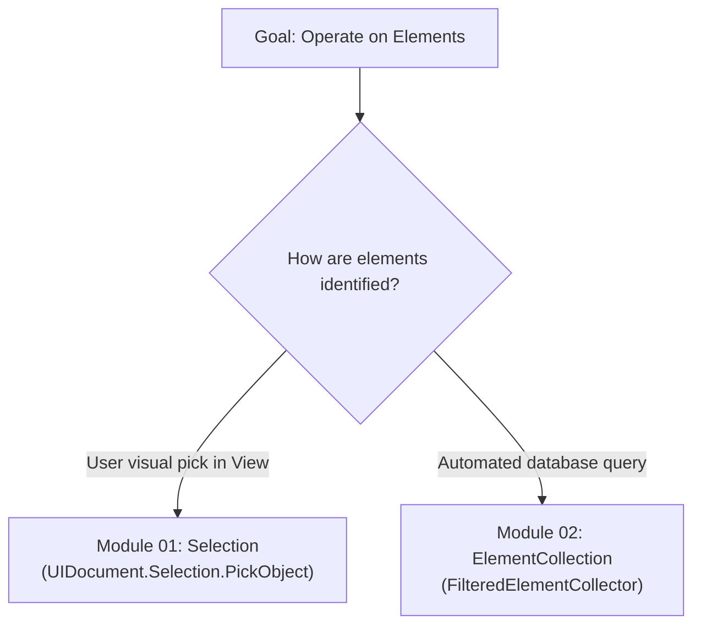
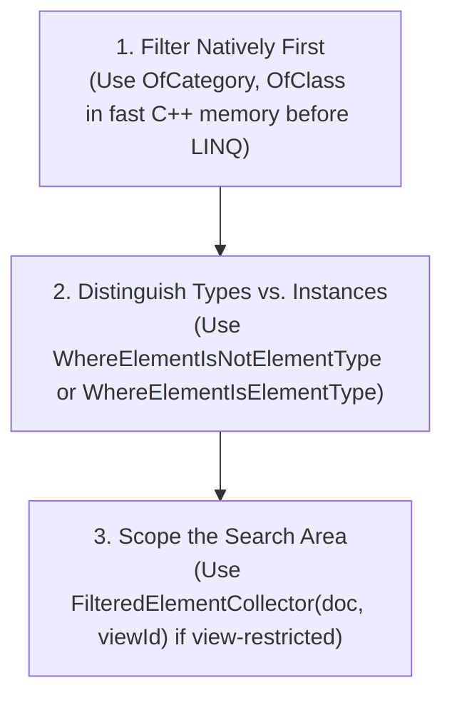
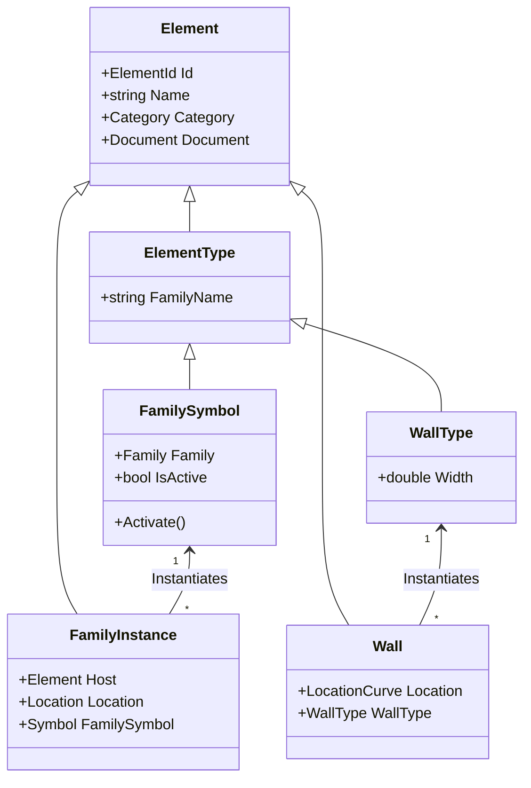
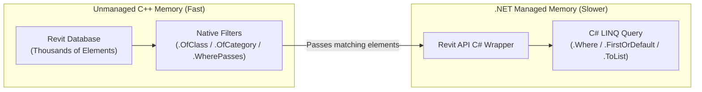
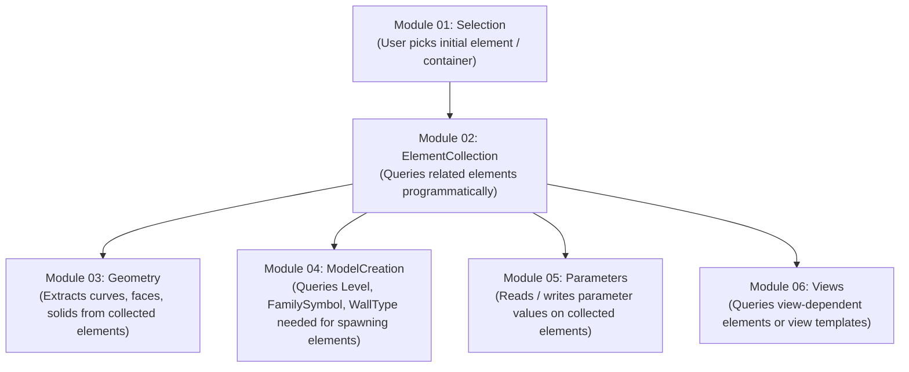
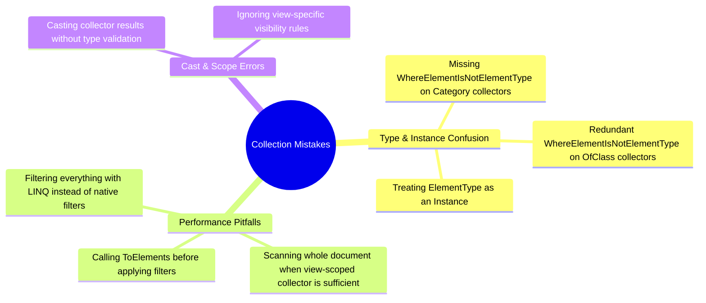
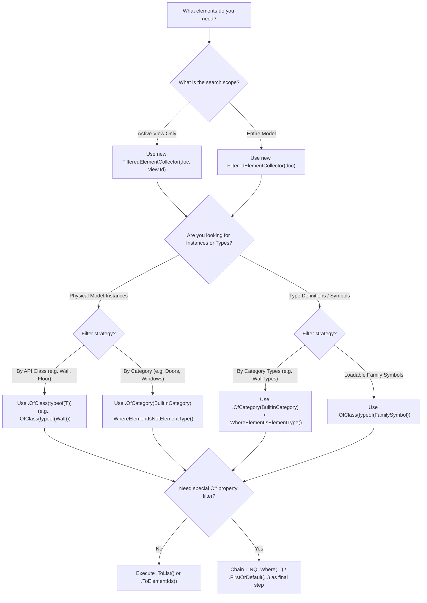

# Module 02 — Element Collection

## 1. Element Collection Mental Model

The **Element Collection API** in Revit provides the primary programmatic mechanism for querying, filtering, and retrieving elements from the Revit database (`Autodesk.Revit.DB`). The main entry point is the `FilteredElementCollector` class.

### Interactive Selection vs. Programmatic Collection

Revit add-ins acquire target elements through two fundamentally different strategies:

| Approach | Module | Mechanism | Primary Use Case |
|---|---|---|---|
| **Interactive Selection** | **Module 01 — Selection** | `UIDocument.Selection` (`PickObject`, `PickObjects`, etc.) | When the user must visually pick specific elements, faces, edges, or points in a view. |
| **Programmatic Collection** | **Module 02 — ElementCollection** | `FilteredElementCollector(doc)` | When the add-in searches the database automatically based on category, class, view scope, or rules. |



### The Three Golden Rules of Element Collection



1. **Filter Early at Native API Level**: Always apply native Revit filters (`.OfCategory()`, `.OfClass()`, `.WherePasses()`) before converting results to C# LINQ (`.Where()`). Native Revit filters execute in fast unmanaged C++ memory; LINQ queries run in managed .NET memory.
2. **Distinguish Physical Instances vs. Type Definitions**: Revit separates placed physical model elements (`Wall`, `FamilyInstance`) from their type definitions (`WallType`, `FamilySymbol`). Always specify whether you are querying instances or types.
3. **Limit Your Search Scope**: If an operation only affects elements visible in a specific view, pass the `View.Id` to the collector constructor (`new FilteredElementCollector(doc, viewId)`) to avoid scanning the entire project database.

---

## 2. Revit Element Hierarchy & Taxonomy

Before constructing queries, you must understand how Revit categorizes objects in the database.



### 1. `Element`
The base class for almost everything stored in a Revit database. Model elements, views, levels, parameters, materials, and family symbols all derive from `Element`.

### 2. `ElementType`
Represents the **definition or specification** of an element (a "Type"). `ElementType` defines shared properties (such as thickness, material layers, or manufacturer data) common to all instances of that type.
- Example: `WallType` `"Generic - 8\" Masonry"`

### 3. `FamilySymbol`
A specialized subclass of `ElementType` used specifically by **Loadable Families** (e.g., doors, windows, columns, furniture, mechanical equipment).
- Example: `FamilySymbol` `"36\" x 84\""` inside the `"Single-Flush"` door family.

### 4. `FamilyInstance`
Represents a physical, placed instance of a **Loadable Family** in 3D space.
- Example: A specific door instance placed on Level 1 at coordinates `(10, 15, 0)`.

### Why `WhereElementIsNotElementType()` Is Essential

By default, calling `new FilteredElementCollector(doc)` scans **every record** in the document database — including physical instances, system type definitions, loadable family symbols, and non-geometric data.

- `.WhereElementIsNotElementType()` excludes types, returning only placed physical instances.
- `.WhereElementIsElementType()` excludes physical instances, returning only type definitions (`WallType`, `FamilySymbol`, etc.).

---

## 3. Collector Search Scopes

The `FilteredElementCollector` constructor accepts two primary search scopes:

### 1. Document-Wide Scope

Scans the entire database across all views and worksets:

```csharp
// Document-wide scope
FilteredElementCollector collector = new FilteredElementCollector(doc);
```

### 2. View-Scoped Collection

Scans **only elements currently visible** in a specified view:

```csharp
// Scope restricted strictly to elements visible in the active view
View activeView = doc.ActiveView;
FilteredElementCollector viewCollector = new FilteredElementCollector(doc, activeView.Id);
```

> [!TIP]
> View-scoped collectors automatically respect view crop boundaries, view range settings, workset visibility, and visibility/graphics overrides.

---

## 4. Implemented Commands & Collection Techniques

The `Samples/ElementCollection/Commands/` folder contains 7 verified commands demonstrating distinct collection strategies:

| # | Command File | Class Name | Main API / Technique | What It Teaches |
|---|---|---|---|---|
| 01 | [`CollectAllElementsCommand.cs`](Commands/CollectAllElementsCommand.cs) | `CollectAllElementsCommand` | `new FilteredElementCollector(doc).ToElements()` | Broadest document collection without any filters. |
| 02 | [`CollectElementWithClassCommand.cs`](Commands/CollectElementWithClassCommand.cs) | `CollectElementWithClassCommand` | `.OfClass(typeof(Wall)).Cast<Wall>()` | Filtering elements by C# wrapper class type (`typeof(Wall)`). |
| 03 | [`CollectElementWithCategoryCommand.cs`](Commands/CollectElementWithCategoryCommand.cs) | `CollectElementWithCategoryCommand` | `.OfCategory(BuiltInCategory.OST_Walls)` | Filtering elements by Revit category (`OST_Walls`) + `WhereElementIsNotElementType()`. |
| 04 | [`CollectElementTypeOrInstanceCommand.cs`](Commands/CollectElementTypeOrInstanceCommand.cs) | `CollectElementTypeOrInstanceCommand` | `WhereElementIsElementType()` vs `WhereElementIsNotElementType()` | Explicitly separating type definitions (`WallType`) from model instances (`Wall`). |
| 05 | [`CollectElementsInViewCommand.cs`](Commands/CollectElementsInViewCommand.cs) | `CollectElementsInViewCommand` | `new FilteredElementCollector(doc, activeView.Id)` | Scoping element queries to a specific view (`doc.ActiveView`). |
| 06 | [`CollectElementWithFilterCommand.cs`](Commands/CollectElementWithFilterCommand.cs) | `CollectElementWithFilterCommand` | `.WherePasses(ElementFilter)` | Passing explicit filter objects (`ElementCategoryFilter`, `ElementClassFilter`) to `.WherePasses()`. |
| 07 | [`CollectFamilySymbolsByPlacementTypeCommand.cs`](Commands/CollectFamilySymbolsByPlacementTypeCommand.cs) | `CollectFamilySymbolsByPlacementTypeCommand` | Native `.OfClass()` + LINQ `.FirstOrDefault()` | Hybrid query: combining native API filter with LINQ for deep property evaluation (`FamilyPlacementType.WorkPlaneBased`). |

---

### Command 01: Broad Unfiltered Collection

> [`CollectAllElementsCommand.cs`](Commands/CollectAllElementsCommand.cs)

Demonstrates retrieving all database records in the document:

```csharp
// Collects all database elements in the document without filtering
FilteredElementCollector collector = new FilteredElementCollector(doc);
List<Element> allElements = collector.ToElements().ToList();
```

> [!NOTE]
> This command demonstrates the raw, unfiltered capacity of `FilteredElementCollector`. It returns all physical instances, type definitions, views, levels, and system settings.

---

### Command 02: Class Filtering (`OfClass`)

> [`CollectElementWithClassCommand.cs`](Commands/CollectElementWithClassCommand.cs)

Demonstrates filtering by C# class type (`typeof(Wall)`):

```csharp
FilteredElementCollector collector = new FilteredElementCollector(doc);

List<Wall> walls = collector
    .OfClass(typeof(Wall))
    .Cast<Wall>()
    .ToList();
```

> [!IMPORTANT]
> Calling `.OfClass(typeof(Wall))` automatically excludes `WallType` definitions because `WallType` does not derive from `Wall`. Therefore, calling `.WhereElementIsNotElementType()` is redundant when using `.OfClass(typeof(Wall))`.

Common classes used with `.OfClass()`:
- `typeof(Wall)` — Model walls
- `typeof(Level)` — Building levels
- `typeof(View)` — Project views
- `typeof(Grid)` — Grid lines
- `typeof(Family)` — Loaded family definitions
- `typeof(RevitLinkInstance)` — Linked Revit models

---

### Command 03: Category Filtering (`OfCategory`)

> [`CollectElementWithCategoryCommand.cs`](Commands/CollectElementWithCategoryCommand.cs)

Demonstrates filtering by `BuiltInCategory`:

```csharp
FilteredElementCollector collector = new FilteredElementCollector(doc);

List<Element> walls = collector
    .OfCategory(BuiltInCategory.OST_Walls)
    .WhereElementIsNotElementType()
    .ToList();
```

> [!IMPORTANT]
> Unlike `.OfClass()`, `.OfCategory(BuiltInCategory.OST_Walls)` returns **both** `Wall` instances and `WallType` definitions because both share the `OST_Walls` category. You **must** call `.WhereElementIsNotElementType()` to get instances only!

Common categories used with `.OfCategory()`:
- `BuiltInCategory.OST_Walls`
- `BuiltInCategory.OST_Doors`
- `BuiltInCategory.OST_Windows`
- `BuiltInCategory.OST_Furniture`
- `BuiltInCategory.OST_GenericModel`
- `BuiltInCategory.OST_MechanicalEquipment`

---

### Command 04: Separating Types and Instances

> [`CollectElementTypeOrInstanceCommand.cs`](Commands/CollectElementTypeOrInstanceCommand.cs)

Demonstrates explicit separation of type definitions (`ElementType`) and placed physical instances (`Element` / `Wall`):

```csharp
// 1. Collect Element Types (Definitions)
FilteredElementCollector typeCollector = new FilteredElementCollector(doc);
List<ElementType> wallTypes = typeCollector
    .OfCategory(BuiltInCategory.OST_Walls)
    .WhereElementIsElementType() // Get only element types
    .Cast<ElementType>()
    .ToList();

// 2. Collect Element Instances (Placed Model Objects)
FilteredElementCollector instanceCollector = new FilteredElementCollector(doc);
List<Wall> walls = instanceCollector
    .OfClass(typeof(Wall))
    .WhereElementIsNotElementType() // Get only element instances
    .Cast<Wall>()
    .ToList();
```

---

### Command 05: View-Scoped Collection

> [`CollectElementsInViewCommand.cs`](Commands/CollectElementsInViewCommand.cs)

Demonstrates scoping element collection strictly to elements visible within the active view:

```csharp
// Get active view (e.g. Level 1 Floor Plan)
View activeView = doc.ActiveView;

// Collect elements visible in the active view only
List<Element> elementsInView = new FilteredElementCollector(doc, activeView.Id)
    .WhereElementIsNotElementType()
    .ToList();
```

---

### Command 06: Filtering with `WherePasses()`

> [`CollectElementWithFilterCommand.cs`](Commands/CollectElementWithFilterCommand.cs)

Demonstrates using `.WherePasses()` with explicit `ElementFilter` subclasses (`ElementCategoryFilter` and `ElementClassFilter`):

```csharp
// 1. Using ElementCategoryFilter
ElementCategoryFilter wallCategoryFilter = new ElementCategoryFilter(BuiltInCategory.OST_Walls);
List<Element> wallsWithCategoryFilter = new FilteredElementCollector(doc)
    .WherePasses(wallCategoryFilter)
    .WhereElementIsNotElementType()
    .ToList();

// 2. Using ElementClassFilter
ElementClassFilter wallClassFilter = new ElementClassFilter(typeof(Wall));
List<Element> wallsWithClassFilter = new FilteredElementCollector(doc)
    .WherePasses(wallClassFilter)
    .WhereElementIsNotElementType()
    .ToList();
```

> [!NOTE]
> `.OfCategory()` and `.OfClass()` are convenient shortcut methods that internally instantiate `ElementCategoryFilter` and `ElementClassFilter` and pass them to `.WherePasses()`.

---

### Command 07: Hybrid Native API + LINQ Filtering

> [`CollectFamilySymbolsByPlacementTypeCommand.cs`](Commands/CollectFamilySymbolsByPlacementTypeCommand.cs)

Demonstrates combining fast native Revit API filters with C# LINQ queries for deep properties that are not indexed natively by `ElementFilter`:

```csharp
// Native API filter (.OfClass) reduces thousands of elements to FamilySymbols in C++ memory first,
// then LINQ (.FirstOrDefault) inspects the FamilyPlacementType property in C# memory.
FamilySymbol familySymbol = new FilteredElementCollector(doc)
    .OfClass(typeof(FamilySymbol))
    .Cast<FamilySymbol>()
    .FirstOrDefault(symbol => 
        symbol.Family.FamilyPlacementType == FamilyPlacementType.WorkPlaneBased);
```

---

## 5. Native C++ Filtering vs. Managed .NET LINQ Filtering

Understanding the internal execution architecture of `FilteredElementCollector` is critical for building high-performance add-ins.



### Why Native Filters Are 10x–100x Faster

- **Native Filters (`OfCategory`, `OfClass`, `WherePasses`)**: Run inside Revit's native C++ engine. They operate directly on indexed C++ pointers without instantiating C# managed objects.
- **LINQ Queries (`.Where()`, `.Select()`)**: Require marshaling elements across the C++/C# boundary, instantiating C# `Element` wrapper objects, and allocating managed memory.

### Performance Comparison

| Query Approach | Execution Environment | Objects Marshaled | Relative Speed |
|---|---|---|---|
| `collector.OfClass(typeof(Wall)).ToList()` | **Native C++** | Only matching Wall instances | ⚡ **Fastest (1x)** |
| `collector.OfCategory(OST_Walls).WhereElementIsNotElementType().ToList()` | **Native C++** | Only matching Wall instances | ⚡ **Fastest (1x)** |
| `collector.ToElements().Where(e => e is Wall).ToList()` | **Managed C#** | **Every element in the database** | 🐢 **Slowest (50x–100x slower)** |

---

## 6. Cross-Module Relationships

The `ElementCollection` module acts as the data retrieval engine for the entire Revit API ecosystem:



- **Selection → ElementCollection**: Selection obtains initial user seeds (e.g., picking a single wall); `ElementCollection` uses that seed to find all connected walls or hosted doors programmatically.
- **ElementCollection → Geometry**: Once elements are collected (e.g., walls), `Location` or `get_Geometry()` is called to extract curves, solids, and faces.
- **ElementCollection → ModelCreation**: Creation methods require valid host types (`Level`, `WallType`, `FamilySymbol`). `ElementCollection` locates these prerequisite symbols before calling creation methods (`ItemFactoryBase.NewFamilyInstance`).
- **ElementCollection → Parameters**: Collected elements are passed to parameter readers/writers for batch parameter manipulation.

---

## 7. Common Element Collection Mistakes



1. **Missing `WhereElementIsNotElementType()` on Category Collectors**: `new FilteredElementCollector(doc).OfCategory(BuiltInCategory.OST_Walls)` returns both `Wall` instances and `WallType` definitions. Always specify instance vs. type!
2. **Redundant `WhereElementIsNotElementType()` with `OfClass(typeof(Wall))`**: `OfClass(typeof(Wall))` only matches `Wall` instances. Adding `WhereElementIsNotElementType()` is harmless but redundant.
3. **Filtering Everything with LINQ**: Calling `doc.FilteredElementCollector().ToList().Where(...)` forces Revit to unbox thousands of elements across the C++/C# boundary. Always filter natively first!
4. **Scanning Document-Wide When View Scope Is Sufficient**: Scanning the entire document database to find elements in the active view is wasteful. Use `new FilteredElementCollector(doc, activeView.Id)` instead.
5. **Calling `ToElements()` Before Applying Filters**: `collector.ToElements().OfClass(typeof(Wall))` applies the filter in managed C# memory after fetching all elements. Always chain native filters **before** calling `.ToElements()`, `.ToElementIds()`, or `.ToList()`.

---

## 8. Practical Decision-Making Guide & Reasoning Tree

When constructing an element query, follow this decision tree:



---

## 9. Element Collection API Cheat Sheet

| API Method / Symbol | Return Type | Description | Code Example |
|---|---|---|---|
| `FilteredElementCollector(doc)` | `FilteredElementCollector` | Constructor for document-wide database search. | `var col = new FilteredElementCollector(doc);` |
| `FilteredElementCollector(doc, viewId)` | `FilteredElementCollector` | Constructor for view-scoped database search. | `var col = new FilteredElementCollector(doc, view.Id);` |
| `.OfCategory(BuiltInCategory)` | `FilteredElementCollector` | Native filter by Revit built-in category. | `col.OfCategory(BuiltInCategory.OST_Walls)` |
| `.OfClass(Type)` | `FilteredElementCollector` | Native filter by .NET wrapper class type. | `col.OfClass(typeof(Wall))` |
| `.WhereElementIsNotElementType()` | `FilteredElementCollector` | Native filter restricting results to model instances. | `col.WhereElementIsNotElementType()` |
| `.WhereElementIsElementType()` | `FilteredElementCollector` | Native filter restricting results to type definitions. | `col.WhereElementIsElementType()` |
| `.WherePasses(ElementFilter)` | `FilteredElementCollector` | Passes a specific `ElementFilter` instance. | `col.WherePasses(new ElementCategoryFilter(OST_Doors))` |
| `.ToElements()` | `IList<Element>` | Evaluates collector and returns matching elements. | `IList<Element> elems = col.ToElements();` |
| `.ToElementIds()` | `ICollection<ElementId>` | Evaluates collector and returns matching element IDs (faster). | `ICollection<ElementId> ids = col.ToElementIds();` |
| `ElementCategoryFilter` | Class | Quick filter testing category membership. | `new ElementCategoryFilter(BuiltInCategory.OST_Walls)` |
| `ElementClassFilter` | Class | Quick filter testing class membership. | `new ElementClassFilter(typeof(Wall))` |

---

## 10. Final Mental Model Checklist

Before writing element collection code in Revit API, answer these 10 questions:

1. **What is the search scope?** (Entire document vs. active view scope?)
2. **Am I searching for physical instances or type definitions?** (`WhereElementIsNotElementType()` vs `WhereElementIsElementType()`)
3. **Can I filter by .NET class type?** (`OfClass(typeof(Wall))` — excludes types automatically)
4. **Can I filter by BuiltInCategory?** (`OfCategory(BuiltInCategory.OST_Walls)` — requires `WhereElementIsNotElementType()`)
5. **Am I applying native filters before LINQ?** (Always chain `.OfClass()` / `.OfCategory()` before `.Where()`)
6. **Do I need element objects or just element IDs?** (Use `.ToElementIds()` if you only need IDs for performance)
7. **Is the query returning expected results in all view types?** (View-scoped collectors depend on view visibility settings)
8. **Am I instantiating a new collector for each separate query?** (Collectors are single-use iterators; do not re-use a collector instance for multiple queries)
9. **Is the target category shared between multiple classes?** (e.g. `FamilyInstance` vs `Wall`)
10. **Am I handling empty query results gracefully?** (Check `.Any()` or `.Count == 0` before operating on returned collections)
