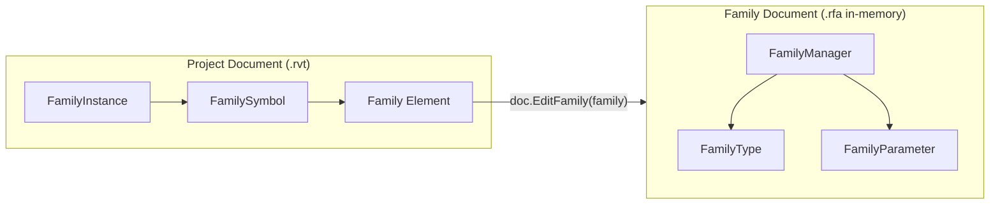

# Module 09 — Families

## 1. Families Mental Model

The **Family API** in Revit provides the structural hierarchy for object-oriented BIM modeling. Located in `Autodesk.Revit.DB`, families define the geometric templates, parameters, and behaviors of parametric building components.

### Interactive Family Hierarchy

```mermaid
flowchart TD
    Family["Family (.rfa Definition / Family Element)<br/>(e.g., Single-Flush Door)"] --> Symbol["FamilySymbol (Type Definition)<br/>(e.g., 36\" x 84\")"]
    Symbol --> Instance["FamilyInstance (Placed 3D Object)<br/>(e.g., Door placed on Level 1 at X,Y,Z)"]
```

- **`Family`**: The overall component template (`.rfa` file or family definition element).
- **`FamilySymbol`**: A specific **Type** definition containing shared type parameter values.
- **`FamilyInstance`**: The physical, 3D placed object instantiated in a project view.

---

## 2. Document Contexts: Project Document vs. Family Document

Understanding the boundary between Project Document and Family Document is crucial:



| Aspect | Project Document (`doc`) | Family Document (`familyDoc`) |
|---|---|---|
| **Document Property** | `doc.IsFamilyDocument == false` | `familyDoc.IsFamilyDocument == true` |
| **Type Representation** | `FamilySymbol` | `FamilyType` inside `FamilyManager.Types` |
| **Parameter Engine** | `doc.ParameterBindings` (`BindingMap`) | `familyDoc.FamilyManager.Parameters` |
| **Opening API** | `uiApp.OpenAndActivateDocument()` | `doc.EditFamily(family)` |

---

## 3. Learning Progression (Commands 01–12)

The `Families` module follows a 12-command progressive learning journey:

| # | Command File | Class Name | Main API / Workflow | What It Teaches |
|---|---|---|---|---|
| 01 | [`AnalyzeFamilyInstanceCommand.cs`](Commands/AnalyzeFamilyInstanceCommand.cs) | `AnalyzeFamilyInstanceCommand` | `FamilyInstance` → `.Symbol` → `.Family` | Traversing from a placed 3D instance up to its type symbol and family template. |
| 02 | [`CollectFamilySymbolsCommand.cs`](Commands/CollectFamilySymbolsCommand.cs) | `CollectFamilySymbolsCommand` | `new FilteredElementCollector(doc).OfClass(typeof(FamilySymbol))` | Collecting all loaded family symbols (types) document-wide. |
| 03 | [`GetFamilySymbolsFromFamilyCommand.cs`](Commands/GetFamilySymbolsFromFamilyCommand.cs) | `GetFamilySymbolsFromFamilyCommand` | `family.GetFamilySymbolIds()` | Querying all type IDs defined within a specific `Family`. |
| 04 | [`FamilySymbolActivationCommand.cs`](Commands/FamilySymbolActivationCommand.cs) | `FamilySymbolActivationCommand` | `symbol.IsActive` → `symbol.Activate()` → `doc.Regenerate()` | Checking symbol activation state and activating inactive symbols before placement. |
| 05 | [`LoadFamilyCommand.cs`](Commands/LoadFamilyCommand.cs) | `LoadFamilyCommand` | `FileOpenDialog` → `doc.LoadFamily()` | Interactively picking an `.rfa` file and loading it into the project document inside a `Transaction`. |
| 06 | [`EditFamilyCommand.cs`](Commands/EditFamilyCommand.cs) | `EditFamilyCommand` | `family.IsEditable` → `doc.EditFamily(family)` | Opening the in-memory Family Document from a host project family. |
| 07 | [`FamilyManagerInspectionCommand.cs`](Commands/FamilyManagerInspectionCommand.cs) | `FamilyManagerInspectionCommand` | `familyDoc.FamilyManager` | Accessing `FamilyManager`, `CurrentType`, `Types`, and `Parameters`. |
| 08 | [`FamilyParameterInspectionCommand.cs`](Commands/FamilyParameterInspectionCommand.cs) | `FamilyParameterInspectionCommand` | `familyMgr.Parameters` → `FamilyParameter` | Inspecting family parameter definitions (`IsInstance`, `IsShared`, `IsReadOnly`, `Formula`). |
| 09 | [`FamilyParameterVsProjectParameterCommand.cs`](Commands/FamilyParameterVsProjectParameterCommand.cs) | `FamilyParameterVsProjectParameterCommand` | `FamilyManager` vs `doc.ParameterBindings` | Comparing Family Parameters (`.rfa`), Project Parameters (`.rvt`), and Shared Parameters (`.txt`). |
| 10 | [`FamilyTypeManagementCommand.cs`](Commands/FamilyTypeManagementCommand.cs) | `FamilyTypeManagementCommand` | `familyMgr.Types` & `familyMgr.CurrentType` | Managing family types and switching active `CurrentType` in the Family Document. |
| 11 | [`FamilyPlacementTypeCommand.cs`](Commands/FamilyPlacementTypeCommand.cs) | `FamilyPlacementTypeCommand` | `family.FamilyPlacementType` | Inspecting placement behavior (`OneLevelBased`, `TwoLevelsBased`, `WorkPlaneBased`, `ViewBased`, `CurveBased`). |
| 12 | [`CreateFamilyInstanceCommand.cs`](Commands/CreateFamilyInstanceCommand.cs) | `CreateFamilyInstanceCommand` | `symbol.Activate()` → `doc.Create.NewFamilyInstance()` | Complete creation workflow connecting Family API with ModelCreation API. |

---

## 4. Key Workflows & API Patterns

### 1. Symbol Activation Pattern

Before instantiating a `FamilySymbol` with `NewFamilyInstance()`, Revit requires that the symbol be active. Placing an inactive symbol throws an exception.

```csharp
if (!symbol.IsActive)
{
    using (Transaction t = new Transaction(doc, "Activate Symbol"))
    {
        t.Start();
        symbol.Activate();
        doc.Regenerate();
        t.Commit();
    }
}
```

### 2. Family Loading Pattern

```csharp
FileOpenDialog dialog = new FileOpenDialog("Revit Family Files (*.rfa)|*.rfa");
dialog.Title = "Select Revit Family";

if (dialog.Show() == ItemSelectionDialogResult.Confirmed)
{
    ModelPath modelPath = dialog.GetSelectedModelPath();
    string path = ModelPathUtils.ConvertModelPathToUserVisiblePath(modelPath);

    using (Transaction t = new Transaction(doc, "Load Family"))
    {
        t.Start();
        bool loaded = doc.LoadFamily(path, out Family loadedFamily);
        t.Commit();
    }
}
```

### 3. Family Document Editing Pattern

```csharp
if (family.IsEditable)
{
    Document familyDoc = doc.EditFamily(family);
    try
    {
        FamilyManager familyMgr = familyDoc.FamilyManager;
        // Inspect or modify FamilyManager state...
    }
    finally
    {
        familyDoc.Close(false); // Cleanly close without saving changes to disk
    }
}
```

---

## 5. Parameter Architecture Reconciliation

```
FAMILY SIDE
-------------------------
FamilyDocument
    ↓
FamilyManager
    ↓
FamilyParameter (Defined in .rfa; applies strictly to elements of this family)

PROJECT SIDE
-------------------------
Project Document
    ↓
ParameterBindings (BindingMap)
    ↓
Category Binding (Defined in .rvt; applies to ALL elements of bound categories)

SHARED PARAMETERS
-------------------------
External .txt File with unique GUIDs.
Can be added to FamilyManager OR BindingMap.
Enables scheduling and tagging across project views.
```

---

## 6. Common Mistakes to Avoid

1. **Placing Inactive Symbols**: Attempting to call `NewFamilyInstance()` on a `FamilySymbol` where `IsActive == false`. Always check and call `.Activate()` + `doc.Regenerate()`.
2. **Confusing `FamilySymbol` and `FamilyType`**: `FamilySymbol` exists in the Project Document; `FamilyType` exists inside `FamilyManager` within the Family Document.
3. **Attempting to Edit Non-Editable Families**: Calling `EditFamily()` on system families (Walls, Floors) or corrupted families. Always verify `family.IsEditable`.
4. **Forgetting to Close Family Documents**: Leaving in-memory `familyDoc` instances open causes memory leaks. Always wrap in `try/finally` and call `familyDoc.Close(false)`.
5. **Using Wrong `NewFamilyInstance` Overload for Placement Type**: Calling a single-level overload for a `WorkPlaneBased` or `TwoLevelsBased` family. Always inspect `family.FamilyPlacementType` first.

---

## 7. Families API Cheat Sheet

| API Symbol / Method | Description | Code Example |
|---|---|---|
| `familyInstance.Symbol` | Property on `FamilyInstance` returning its `FamilySymbol` (Type). | `FamilySymbol sym = instance.Symbol;` |
| `symbol.Family` | Property on `FamilySymbol` returning its parent `Family`. | `Family fam = symbol.Family;` |
| `family.GetFamilySymbolIds()` | Returns `ISet<ElementId>` of all type IDs in the family. | `ISet<ElementId> ids = fam.GetFamilySymbolIds();` |
| `symbol.IsActive` | Indicates whether the family symbol is active in document memory. | `bool active = symbol.IsActive;` |
| `symbol.Activate()` | Activates an inactive family symbol inside a `Transaction`. | `symbol.Activate(); doc.Regenerate();` |
| `doc.LoadFamily(path, out family)` | Loads an `.rfa` file into the project document. | `doc.LoadFamily(path, out Family f);` |
| `doc.EditFamily(family)` | Opens an in-memory `Document` for editing the family definition. | `Document famDoc = doc.EditFamily(family);` |
| `familyDoc.FamilyManager` | Gateway property for managing family types and parameters. | `FamilyManager mgr = famDoc.FamilyManager;` |
| `familyMgr.CurrentType` | Gets or sets the active `FamilyType` in the Family Document. | `FamilyType curr = familyMgr.CurrentType;` |
| `familyMgr.Parameters` | Returns `FamilyParameterSet` of parameters defined in the family. | `FamilyParameterSet params = familyMgr.Parameters;` |
| `family.FamilyPlacementType` | Enum declaring how instances are placed in 3D space. | `FamilyPlacementType type = family.FamilyPlacementType;` |
| `doc.Create.NewFamilyInstance()` | Spawns a new placed `FamilyInstance` in the model. | `doc.Create.NewFamilyInstance(pt, symbol, level, StructuralType.NonStructural);` |
