# Module 09 — Families

## 1. Families Mental Model

The **Family API** in Revit provides the structural hierarchy for object-oriented BIM modeling. Located in `Autodesk.Revit.DB`, families define the geometric templates, parameters, and behaviors of parametric building components.

### Interactive Family Hierarchy

```mermaid
flowchart TD
    Family["Family (.rfa Definition / Family Element)<br/>(e.g., Single-Flush Door)"] --> Symbol["FamilySymbol (Type Definition)<br/>(e.g., 36\" x 84\")"]
    Symbol --> Instance["FamilyInstance (Placed 3D Object)<br/>(e.g., Door placed on Level 1 at X,Y,Z)"]
```

- **`Family`**: The overall component template (`.rfa` file or family definition element).
- **`FamilySymbol`**: A specific **Type** definition containing shared type parameter values.
- **`FamilyInstance`**: The physical, 3D placed object instantiated in a project view.

---

## 2. Document Contexts: Project Document vs. Family Document

Understanding the boundary between Project Document and Family Document is crucial:

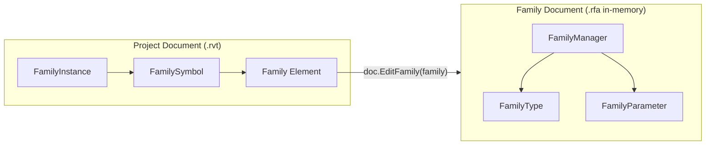

| Aspect | Project Document (`doc`) | Family Document (`familyDoc`) |
|---|---|---|
| **Document Property** | `doc.IsFamilyDocument == false` | `familyDoc.IsFamilyDocument == true` |
| **Type Representation** | `FamilySymbol` | `FamilyType` inside `FamilyManager.Types` |
| **Parameter Engine** | `doc.ParameterBindings` (`BindingMap`) | `familyDoc.FamilyManager.Parameters` |
| **Opening API** | `uiApp.OpenAndActivateDocument()` | `doc.EditFamily(family)` |

---

## 3. Learning Progression (Commands 01–12)

The `Families` module follows a 12-command progressive learning journey:

| # | Command File | Class Name | Main API / Workflow | What It Teaches |
|---|---|---|---|---|
| 01 | [`AnalyzeFamilyInstanceCommand.cs`](Commands/AnalyzeFamilyInstanceCommand.cs) | `AnalyzeFamilyInstanceCommand` | `FamilyInstance` → `.Symbol` → `.Family` | Traversing from a placed 3D instance up to its type symbol and family template. |
| 02 | [`CollectFamilySymbolsCommand.cs`](Commands/CollectFamilySymbolsCommand.cs) | `CollectFamilySymbolsCommand` | `new FilteredElementCollector(doc).OfClass(typeof(FamilySymbol))` | Collecting all loaded family symbols (types) document-wide. |
| 03 | [`GetFamilySymbolsFromFamilyCommand.cs`](Commands/GetFamilySymbolsFromFamilyCommand.cs) | `GetFamilySymbolsFromFamilyCommand` | `family.GetFamilySymbolIds()` | Querying all type IDs defined within a specific `Family`. |
| 04 | [`FamilySymbolActivationCommand.cs`](Commands/FamilySymbolActivationCommand.cs) | `FamilySymbolActivationCommand` | `symbol.IsActive` → `symbol.Activate()` → `doc.Regenerate()` | Checking symbol activation state and activating inactive symbols before placement. |
| 05 | [`LoadFamilyCommand.cs`](Commands/LoadFamilyCommand.cs) | `LoadFamilyCommand` | `FileOpenDialog` → `doc.LoadFamily()` | Interactively picking an `.rfa` file and loading it into the project document inside a `Transaction`. |
| 06 | [`EditFamilyCommand.cs`](Commands/EditFamilyCommand.cs) | `EditFamilyCommand` | `family.IsEditable` → `doc.EditFamily(family)` | Opening the in-memory Family Document from a host project family. |
| 07 | [`FamilyManagerInspectionCommand.cs`](Commands/FamilyManagerInspectionCommand.cs) | `FamilyManagerInspectionCommand` | `familyDoc.FamilyManager` | Accessing `FamilyManager`, `CurrentType`, `Types`, and `Parameters`. |
| 08 | [`FamilyParameterInspectionCommand.cs`](Commands/FamilyParameterInspectionCommand.cs) | `FamilyParameterInspectionCommand` | `familyMgr.Parameters` → `FamilyParameter` | Inspecting family parameter definitions (`IsInstance`, `IsShared`, `IsReadOnly`, `Formula`). |
| 09 | [`FamilyParameterVsProjectParameterCommand.cs`](Commands/FamilyParameterVsProjectParameterCommand.cs) | `FamilyParameterVsProjectParameterCommand` | `FamilyManager` vs `doc.ParameterBindings` | Comparing Family Parameters (`.rfa`), Project Parameters (`.rvt`), and Shared Parameters (`.txt`). |
| 10 | [`FamilyTypeManagementCommand.cs`](Commands/FamilyTypeManagementCommand.cs) | `FamilyTypeManagementCommand` | `familyMgr.Types` & `familyMgr.CurrentType` | Managing family types and switching active `CurrentType` in the Family Document. |
| 11 | [`FamilyPlacementTypeCommand.cs`](Commands/FamilyPlacementTypeCommand.cs) | `FamilyPlacementTypeCommand` | `family.FamilyPlacementType` | Inspecting placement behavior (`OneLevelBased`, `TwoLevelsBased`, `WorkPlaneBased`, `ViewBased`, `CurveBased`). |
| 12 | [`CreateFamilyInstanceCommand.cs`](Commands/CreateFamilyInstanceCommand.cs) | `CreateFamilyInstanceCommand` | `symbol.Activate()` → `doc.Create.NewFamilyInstance()` | Complete creation workflow connecting Family API with ModelCreation API. |

---

## 4. Key Workflows & API Patterns

### 1. Symbol Activation Pattern

Before instantiating a `FamilySymbol` with `NewFamilyInstance()`, Revit requires that the symbol be active. Placing an inactive symbol throws an exception.

```csharp
if (!symbol.IsActive)
{
    using (Transaction t = new Transaction(doc, "Activate Symbol"))
    {
        t.Start();
        symbol.Activate();
        doc.Regenerate();
        t.Commit();
    }
}
```

### 2. Family Loading Pattern

```csharp
FileOpenDialog dialog = new FileOpenDialog("Revit Family Files (*.rfa)|*.rfa");
dialog.Title = "Select Revit Family";

if (dialog.Show() == ItemSelectionDialogResult.Confirmed)
{
    ModelPath modelPath = dialog.GetSelectedModelPath();
    string path = ModelPathUtils.ConvertModelPathToUserVisiblePath(modelPath);

    using (Transaction t = new Transaction(doc, "Load Family"))
    {
        t.Start();
        bool loaded = doc.LoadFamily(path, out Family loadedFamily);
        t.Commit();
    }
}
```

### 3. Family Document Editing Pattern

```csharp
if (family.IsEditable)
{
    Document familyDoc = doc.EditFamily(family);
    try
    {
        FamilyManager familyMgr = familyDoc.FamilyManager;
        // Inspect or modify FamilyManager state...
    }
    finally
    {
        familyDoc.Close(false); // Cleanly close without saving changes to disk
    }
}
```

---

## 5. Parameter Architecture Reconciliation

```
FAMILY SIDE
-------------------------
FamilyDocument
    ↓
FamilyManager
    ↓
FamilyParameter (Defined in .rfa; applies strictly to elements of this family)

PROJECT SIDE
-------------------------
Project Document
    ↓
ParameterBindings (BindingMap)
    ↓
Category Binding (Defined in .rvt; applies to ALL elements of bound categories)

SHARED PARAMETERS
-------------------------
External .txt File with unique GUIDs.
Can be added to FamilyManager OR BindingMap.
Enables scheduling and tagging across project views.
```

---

## 6. Common Mistakes to Avoid

1. **Placing Inactive Symbols**: Attempting to call `NewFamilyInstance()` on a `FamilySymbol` where `IsActive == false`. Always check and call `.Activate()` + `doc.Regenerate()`.
2. **Confusing `FamilySymbol` and `FamilyType`**: `FamilySymbol` exists in the Project Document; `FamilyType` exists inside `FamilyManager` within the Family Document.
3. **Attempting to Edit Non-Editable Families**: Calling `EditFamily()` on system families (Walls, Floors) or corrupted families. Always verify `family.IsEditable`.
4. **Forgetting to Close Family Documents**: Leaving in-memory `familyDoc` instances open causes memory leaks. Always wrap in `try/finally` and call `familyDoc.Close(false)`.
5. **Using Wrong `NewFamilyInstance` Overload for Placement Type**: Calling a single-level overload for a `WorkPlaneBased` or `TwoLevelsBased` family. Always inspect `family.FamilyPlacementType` first.

---

## 7. Families API Cheat Sheet

| API Symbol / Method | Description | Code Example |
|---|---|---|
| `familyInstance.Symbol` | Property on `FamilyInstance` returning its `FamilySymbol` (Type). | `FamilySymbol sym = instance.Symbol;` |
| `symbol.Family` | Property on `FamilySymbol` returning its parent `Family`. | `Family fam = symbol.Family;` |
| `family.GetFamilySymbolIds()` | Returns `ISet<ElementId>` of all type IDs in the family. | `ISet<ElementId> ids = fam.GetFamilySymbolIds();` |
| `symbol.IsActive` | Indicates whether the family symbol is active in document memory. | `bool active = symbol.IsActive;` |
| `symbol.Activate()` | Activates an inactive family symbol inside a `Transaction`. | `symbol.Activate(); doc.Regenerate();` |
| `doc.LoadFamily(path, out family)` | Loads an `.rfa` file into the project document. | `doc.LoadFamily(path, out Family f);` |
| `doc.EditFamily(family)` | Opens an in-memory `Document` for editing the family definition. | `Document famDoc = doc.EditFamily(family);` |
| `familyDoc.FamilyManager` | Gateway property for managing family types and parameters. | `FamilyManager mgr = famDoc.FamilyManager;` |
| `familyMgr.CurrentType` | Gets or sets the active `FamilyType` in the Family Document. | `FamilyType curr = familyMgr.CurrentType;` |
| `familyMgr.Parameters` | Returns `FamilyParameterSet` of parameters defined in the family. | `FamilyParameterSet params = familyMgr.Parameters;` |
| `family.FamilyPlacementType` | Enum declaring how instances are placed in 3D space. | `FamilyPlacementType type = family.FamilyPlacementType;` |
| `doc.Create.NewFamilyInstance()` | Spawns a new placed `FamilyInstance` in the model. | `doc.Create.NewFamilyInstance(pt, symbol, level, StructuralType.NonStructural);` |

---

## 8. Per-Command Reasoning (Commands 01–12)

This section explains the architectural reasoning behind each command — *why it exists*, *what concept it unlocks*, and *how it connects to the Families mental model*.

---

### Command 01 — AnalyzeFamilyInstanceCommand

**Why this command exists**: The very first step in the Families module is learning to *navigate upward* through the Family hierarchy. A `FamilyInstance` is what you see in the 3D model. But to understand *what type it is* and *which family defines it*, you must traverse `FamilyInstance → FamilySymbol → Family`. This traversal pattern underpins almost every other command in this module.

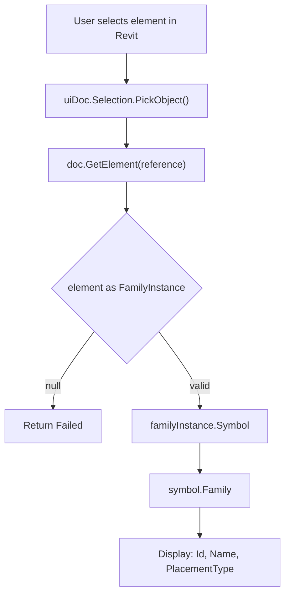

**Architectural unlock**: Establishes the three-tier hierarchy: Instance → Symbol → Family. All subsequent commands depend on being able to navigate this chain.

---

### Command 02 — CollectFamilySymbolsCommand

**Why this command exists**: Rather than starting from a specific placed instance, this command collects *all* `FamilySymbol` elements in the entire project document. This is the **document-wide inventory** approach — critical for scenarios where you need to enumerate available types before creating instances, building a type-picker UI, or auditing what is loaded in the project.

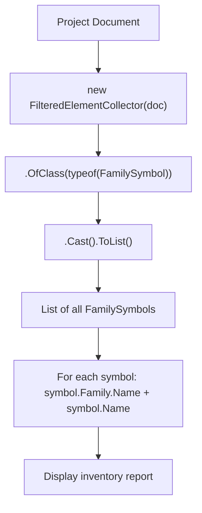

**Architectural unlock**: Establishes that `FamilySymbol` is a first-class element in the Revit database and can be collected independently — without starting from a placed instance.

---

### Command 03 — GetFamilySymbolsFromFamilyCommand

**Why this command exists**: While Command 02 collects symbols project-wide, this command approaches the question from the *Family side* — given a specific `Family` element, what types does it define? The key API is `family.GetFamilySymbolIds()`. This is the canonical way to enumerate all types within a known family, rather than filtering by family name.

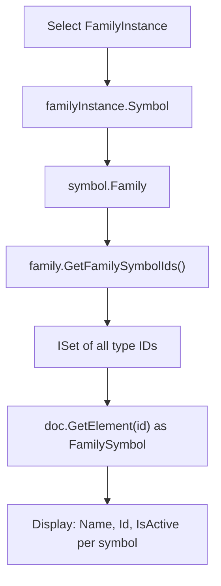

**Architectural unlock**: Shows that `Family.GetFamilySymbolIds()` is the *authoritative* query path for type discovery within a single family. One Family → Many Symbols.

---

### Command 04 — FamilySymbolActivationCommand

**Why this command exists**: Revit uses a **lazy activation** model — a `FamilySymbol` can be loaded into the project without being fully activated in document memory. Calling `NewFamilyInstance()` on an inactive symbol throws an `InvalidOperationException`. This command teaches the mandatory pre-flight check: inspect `IsActive` before every placement operation, and call `Activate()` + `doc.Regenerate()` inside a `Transaction` if needed.

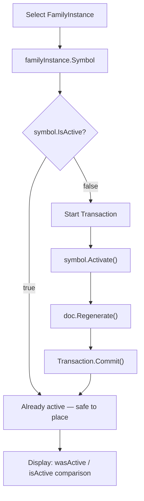

**Architectural unlock**: This is the *mandatory guard pattern* before any `NewFamilyInstance()` call. Missing it causes a runtime exception that is confusing for beginners.

---

### Command 05 — LoadFamilyCommand

**Why this command exists**: A family must be **loaded into the project document** before it can be used. This command teaches the workflow for bringing an external `.rfa` file into the project using `doc.LoadFamily()`. Crucially, this operation modifies the document (adds elements) and must therefore run inside a `Transaction`. The command uses Revit's own `FileOpenDialog` to keep the interaction native to the Revit environment.

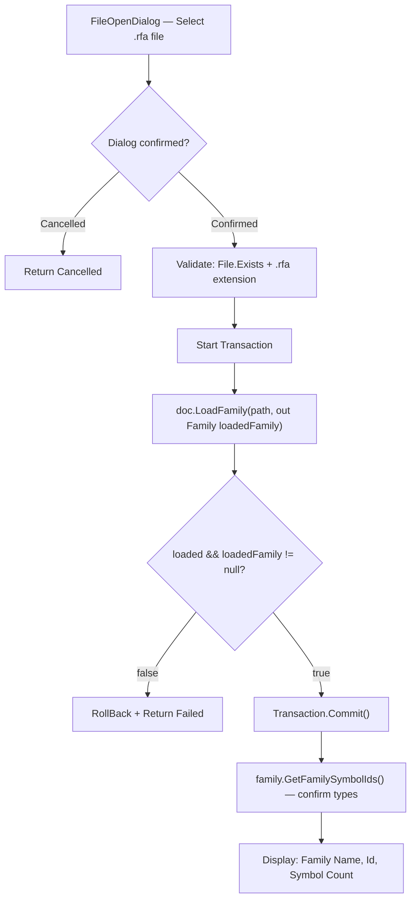

**Architectural unlock**: Separates the concept of *loading* (bringing the family into the project database) from *activating* (preparing a symbol for placement) and *instantiating* (placing a 3D instance).

---

### Command 06 — EditFamilyCommand

**Why this command exists**: The Project Document and the Family Document are **fundamentally different contexts**. A `Family` element in the project document is just a reference to the family definition. To inspect or modify the actual definition, you must open a separate in-memory Family Document via `doc.EditFamily(family)`. This command teaches that boundary and demonstrates `family.IsEditable` as a required pre-check (system families like Walls cannot be opened this way).

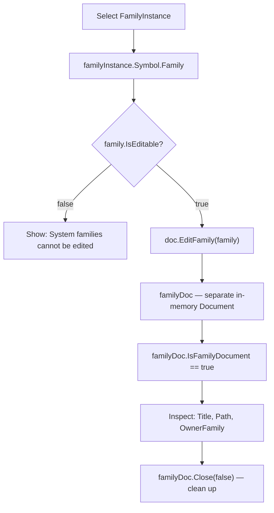

**Architectural unlock**: Establishes the **two-document boundary**. Everything inside `FamilyManager` only exists in the Family Document context. This is the gateway for Commands 07–10.

---

### Command 07 — FamilyManagerInspectionCommand

**Why this command exists**: Once inside the Family Document, the **gateway for all family editing** is `familyDoc.FamilyManager`. This command teaches what `FamilyManager` exposes: `CurrentType`, `Types` (collection of `FamilyType`), and `Parameters` (collection of `FamilyParameter`). Understanding this property is prerequisite to Commands 08, 09, and 10.

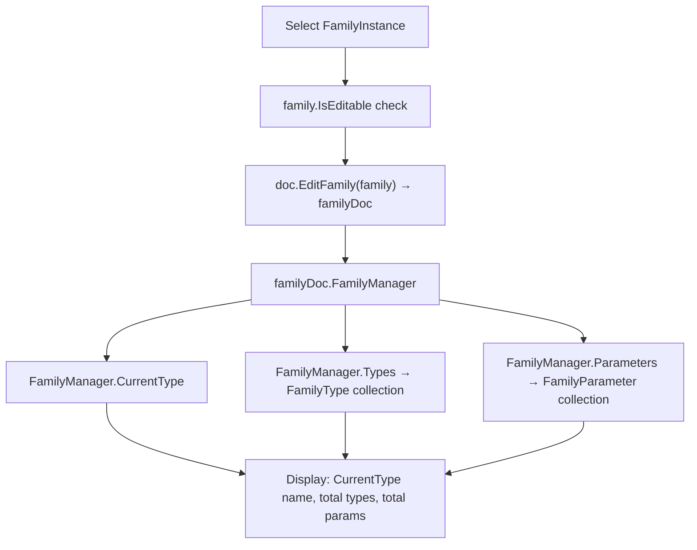

**Architectural unlock**: `FamilyManager` is the *single entry point* for all type and parameter management inside a family definition. Without understanding this property, Commands 08–10 are opaque.

---

### Command 08 — FamilyParameterInspectionCommand

**Why this command exists**: A `FamilyParameter` is not the same as a `Parameter`. A `FamilyParameter` is a *definition* object that lives inside the Family Document — it defines *which parameters the family exposes*, their scope (instance vs. type), whether they drive formulas, and whether they are shared. This command teaches the inspection of those properties, which is critical before creating or modifying parameters programmatically.

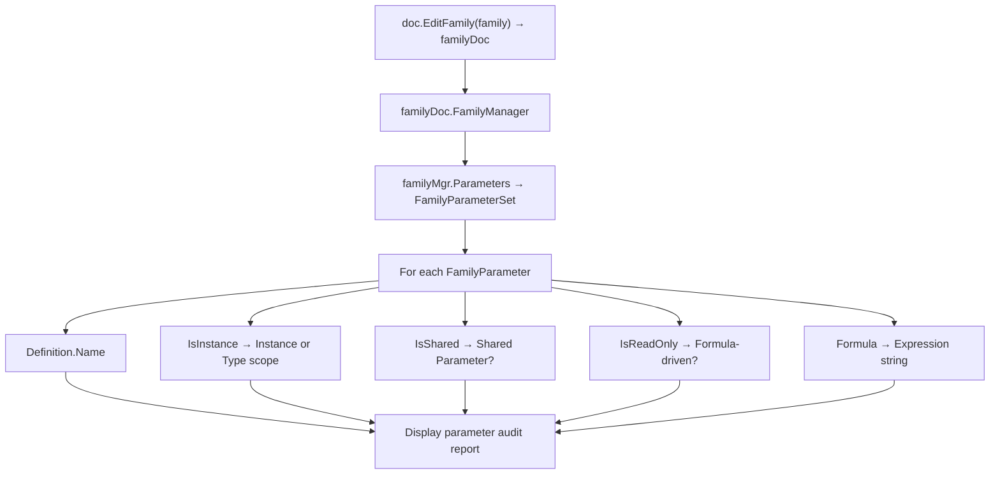

**Architectural unlock**: Bridges the gap between the visual parameter editor in the Revit family editor UI and the programmatic `FamilyParameter` object that represents the same data.

---

### Command 09 — FamilyParameterVsProjectParameterCommand

**Why this command exists**: Revit has *three different parameter systems* that beginners frequently confuse. This command demonstrates all three side-by-side with real data from the open document:
1. **Family Parameters** — defined inside `.rfa`, apply only to instances of that family.
2. **Project Parameters** — defined in `.rvt` via `ParameterBindings`, apply to all elements of bound categories.
3. **Shared Parameters** — external `.txt` GUIDs; can be added to either side; required for scheduling and tagging.

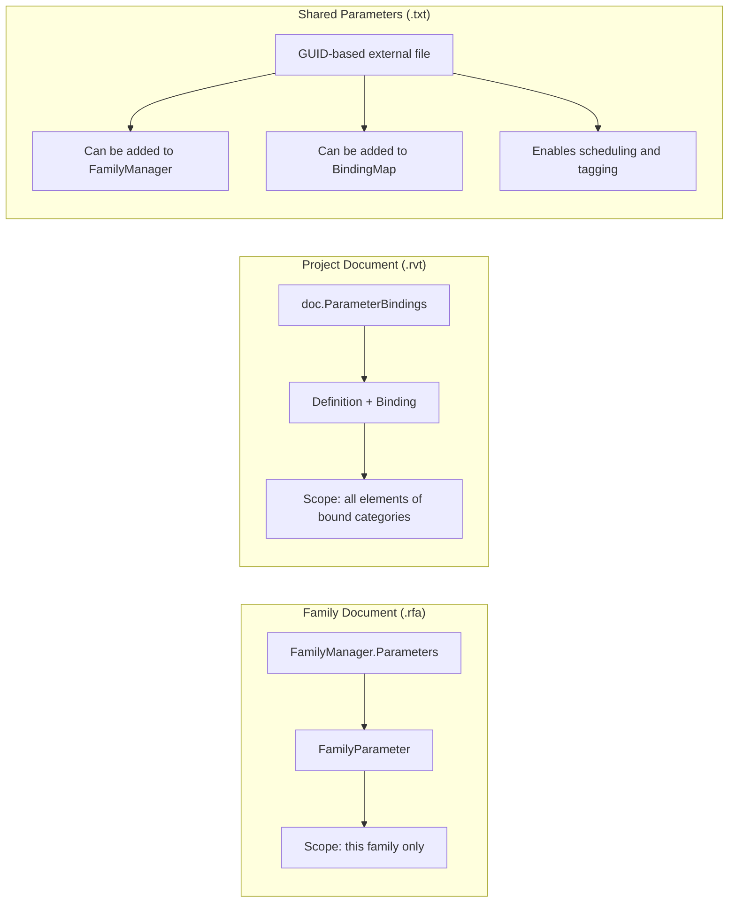

**Architectural unlock**: This is the conceptual map that prevents the most common parameter confusion in Revit API development.

---

### Command 10 — FamilyTypeManagementCommand

**Why this command exists**: Inside a Family Document, types are represented by `FamilyType` objects managed by `FamilyManager`. Inside the Project Document, the same types appear as `FamilySymbol` elements. This command demonstrates the Family Document side — iterating `FamilyManager.Types`, reading `CurrentType`, and switching `CurrentType` programmatically — teaching that the family editor's active type state is accessible through the API.

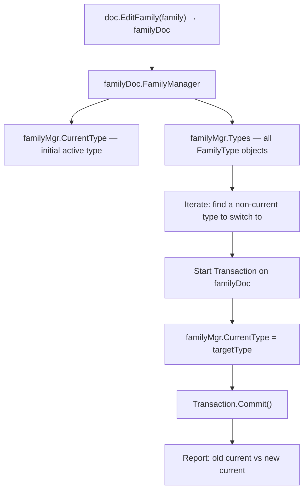

**Architectural unlock**: Demonstrates that `FamilyType` (family-side) and `FamilySymbol` (project-side) represent the same concept from different document perspectives.

---

### Command 11 — FamilyPlacementTypeCommand

**Why this command exists**: Calling `doc.Create.NewFamilyInstance()` with the wrong overload for a given family's placement requirements throws an `InvalidOperationException`. The `family.FamilyPlacementType` enum encodes *exactly* how a family expects to be placed in 3D space. This command teaches developers to always inspect this enum before choosing a `NewFamilyInstance()` overload.

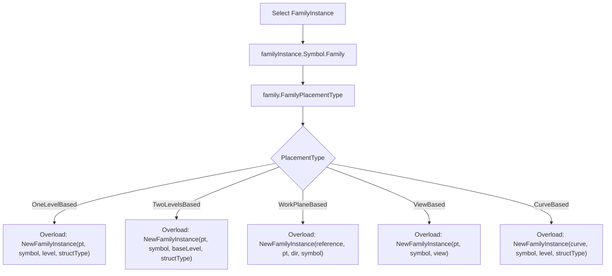

**Architectural unlock**: The `FamilyPlacementType` enum is the *decision tree* that determines which `NewFamilyInstance()` overload to use. This prevents a very common runtime error.

---

### Command 12 — CreateFamilyInstanceCommand

**Why this command exists**: This is the **capstone command** of the Families module. It connects every preceding concept into a single end-to-end workflow: navigate to a symbol, check activation, pick an insertion point, resolve the level, and call `doc.Create.NewFamilyInstance()`. It also bridges to the ModelCreation module by using `Document.Create` — demonstrating that family placement is, at its core, a model creation operation.

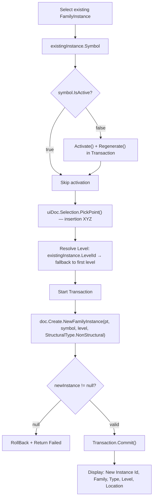

**Architectural unlock**: Demonstrates that `Document.Create.NewFamilyInstance()` is the convergence point of: *Family API* (symbol + activation) + *ModelCreation API* (point + level) + *Transaction API* (safe model modification).
