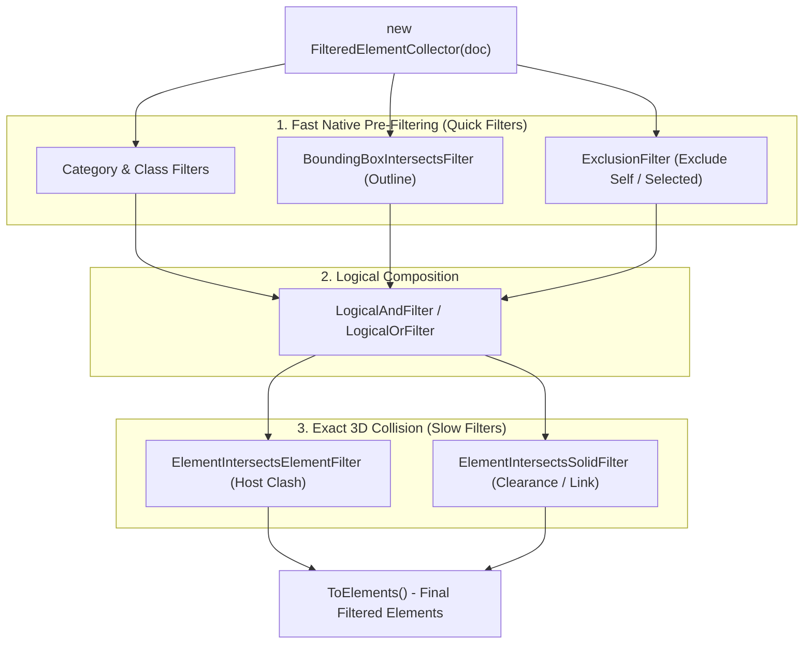
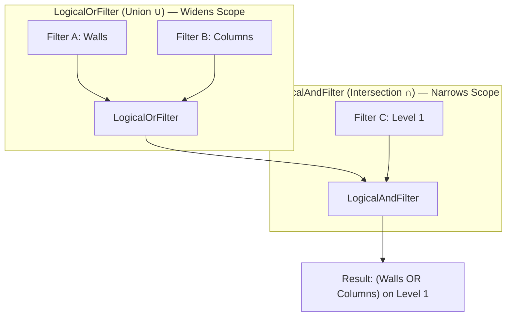
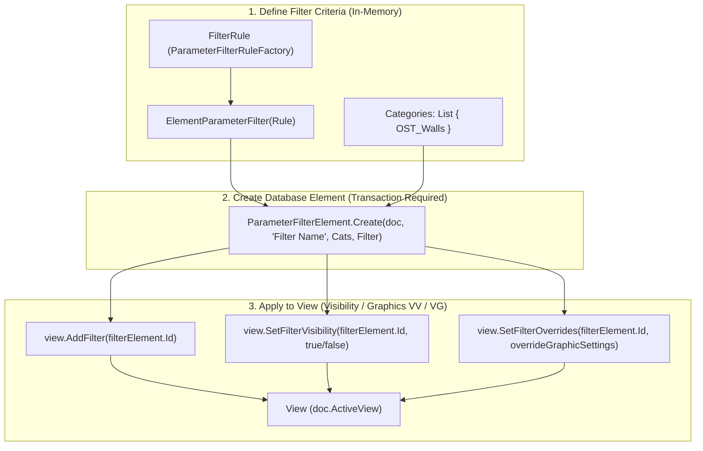
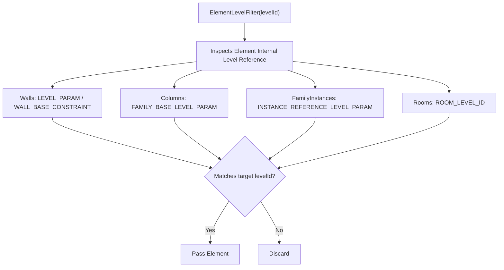
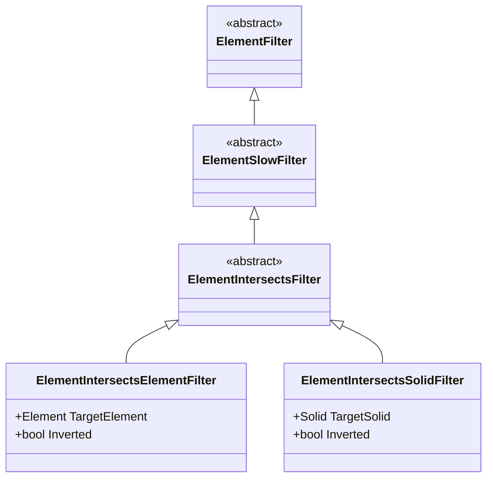
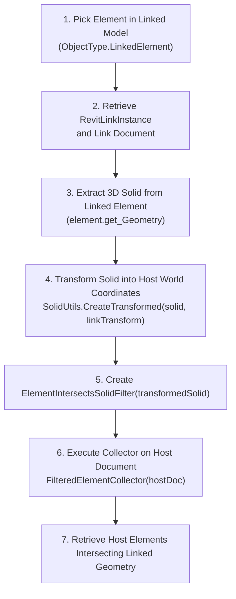
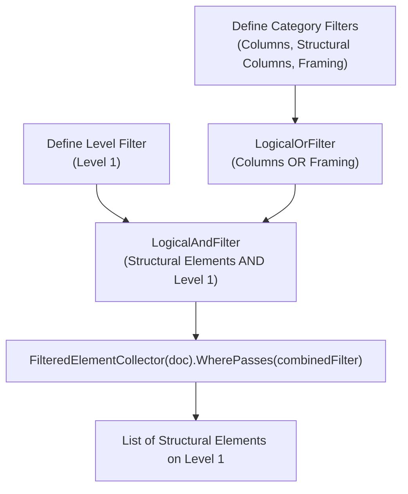
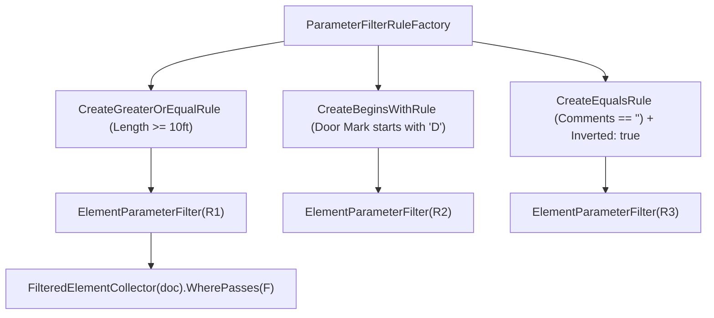
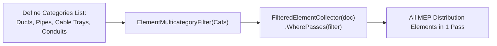

# Module 15 — Filters & Advanced Collection

Welcome to the **Filters & Advanced Collection Module** educational documentation for the Revit API. In Autodesk Revit, models can contain hundreds of thousands of elements. While **Module 02 (ElementCollection)** introduces basic database queries (`OfCategory`, `OfClass`, `WhereElementIsNotElementType`), **Module 15** teaches you how to build **high-performance search pipelines, complex boolean logic trees, rule-based parameter filters, true 3D physical collision detection, and persistent View Filters (`ParameterFilterElement`)**.

---

## 1. Module Purpose & Core Mental Model

### Unmanaged C++ Database Querying vs. In-Memory LINQ

To build high-performance Revit add-ins, you must understand where code executes:

```
Revit Document (Unmanaged C++ Core)
       │
       ▼  Native Filters (Quick & Slow) execute in C++ before objects enter .NET
FilteredElementCollector
       │
       ▼  Only matching elements are allocated into CLR Memory
C# Managed Application Memory (.NET 8.0)
```



### Why Advanced Filtering is Critical for BIM Automation
1. **Performance at Scale:** Evaluating criteria natively in unmanaged C++ memory is **10x to 50x faster** than retrieving elements into C# and filtering with LINQ `.Where()`.
2. **Memory Efficiency:** Avoids creating thousands of short-lived managed proxy objects, eliminating UI lag and garbage collection pressure.
3. **Multi-Criteria Querying:** Combines diverse requirements (e.g. *Walls on Level 1 AND Length >= 10ft AND Fire Rating > 60min*) in a single native pass.
4. **Physical 3D Clash Detection:** Detects true solid geometric collisions between architectural, structural, and MEP services without third-party clash software.
5. **View Graphics Automation:** Automatically creates and applies persistent View Filters (`ParameterFilterElement`) to style drawing sheets.

---

## 2. Current Sample Index

The following table lists the **9 educational Commands** implemented in Module 15 (`Samples/FiltersAndAdvancedCollection/Commands/`):

| # | Command File | Main Concept | Important APIs | What the Learner Should Understand |
| :-: | :--- | :--- | :--- | :--- |
| **01** | [`LogicalFiltersCommand.cs`](Commands/LogicalFiltersCommand.cs) | Boolean Query Composition | `LogicalAndFilter`, `LogicalOrFilter`, `ElementLevelFilter` | How to combine multiple search rules into Boolean trees evaluated in native memory. |
| **02** | [`ParameterRuleFilterCommand.cs`](Commands/ParameterRuleFilterCommand.cs) | Native Parameter Rules | `ElementParameterFilter`, `ParameterFilterRuleFactory` | How to filter by string, numeric, and inverted parameter conditions without loading elements into C#. |
| **03** | [`MultiCategoryFilterCommand.cs`](Commands/MultiCategoryFilterCommand.cs) | Multi-Category Querying | `ElementMulticategoryFilter` | How to query multiple element categories simultaneously in one single database scan. |
| **04** | [`ExclusionFilterCommand.cs`](Commands/ExclusionFilterCommand.cs) | ID Exclusion Filtering | `ExclusionFilter` | How to natively exclude specific element IDs (e.g. selected elements or template objects). |
| **05** | [`BoundingBoxSpatialFilterCommand.cs`](Commands/BoundingBoxSpatialFilterCommand.cs) | AABB Spatial Filtering | `BoundingBoxIntersectsFilter`, `BoundingBoxIsInsideFilter`, `Outline` | How to use fast Axis-Aligned Bounding Box tests to pre-filter candidate clash sets. |
| **06** | [`ElementIntersectsElementCommand.cs`](Commands/ElementIntersectsElementCommand.cs) | 3D Solid Collision | `ElementIntersectsElementFilter` | How to detect true physical 3D solid clashes against a selected host element. |
| **07** | [`ElementIntersectsSolidCommand.cs`](Commands/ElementIntersectsSolidCommand.cs) | Clearance Buffer Envelope | `ElementIntersectsSolidFilter`, `GeometryCreationUtilities` | How to generate custom 3D clearance solids (+50mm offset) and check buffer violations. |
| **08** | [`LinkedModelIntersectionCommand.cs`](Commands/LinkedModelIntersectionCommand.cs) | Cross-Model Clash Detection | `ElementIntersectsSolidFilter`, `RevitLinkInstance`, `SolidUtils` | How to transform linked model solids into host world space for cross-document clash detection. |
| **09** | [`CreateViewFilterCommand.cs`](Commands/CreateViewFilterCommand.cs) | Persistent View Filters | `ParameterFilterElement.Create`, `View.AddFilter`, `View.SetFilterOverrides` | How to create persistent database View Filters and apply color overrides in Visibility/Graphics (VV/VG). |

---

## 3. Conceptual Foundations & Core Distinctions

### 3.1 Quick Filters vs. Slow Filters

In the Revit API, every filter inherits from the abstract base class `ElementFilter`. Understanding whether a filter is **Quick** or **Slow** is vital for writing performant add-ins:

| Filter Type | Base Class | Performance | Execution Mechanism | Examples |
| :--- | :--- | :--- | :--- | :--- |
| **Quick Filter** | `ElementQuickFilter` | ⚡ **Ultra Fast** (Microseconds) | Evaluates memory-cached headers in native Revit database without expanding the full element record. | `ElementCategoryFilter`, `ElementClassFilter`, `BoundingBoxIntersectsFilter`, `ExclusionFilter`, `ElementMulticategoryFilter`. |
| **Slow Filter** | `ElementSlowFilter` | 🐢 **Heavy / Precise** (Milliseconds) | Expands the full element definition, reads non-indexed parameters, or extracts 3D solid geometry for Boolean tests. | `ElementParameterFilter`, `ElementIntersectsElementFilter`, `ElementIntersectsSolidFilter`, `ElementLevelFilter`. |

> [!TIP]
> **Golden Rule of Collector Chaining:**
> Always apply **Quick Filters FIRST** to aggressively eliminate 90%+ of irrelevant elements before applying a **Slow 3D Geometry Filter**.

---

### 3.2 `LogicalAndFilter` vs. `LogicalOrFilter`

Revit allows you to build complex Boolean query trees in unmanaged C++ memory:



| Feature | `LogicalAndFilter` | `LogicalOrFilter` |
| :--- | :--- | :--- |
| **Set Theory Operation** | **Intersection ($\cap$)** — Must satisfy all criteria | **Union ($\cup$)** — Must satisfy at least one criteria |
| **C# Equivalent** | `conditionA && conditionB` | `conditionA \|\| conditionB` |
| **Effect on Result Count** | **Narrows / Reduces** candidate element count | **Widens / Increases** candidate element count |
| **Constructor Overloads** | 1. `new LogicalAndFilter(filterA, filterB)`<br/>2. `new LogicalAndFilter(IList<ElementFilter>)` | 1. `new LogicalOrFilter(filterA, filterB)`<br/>2. `new LogicalOrFilter(IList<ElementFilter>)` |
| **Collector Chaining** | Calling `.WherePasses(F1).WherePasses(F2)` implicitly acts as an **AND** | Chaining multiple `.WherePasses()` cannot do OR; you **must** use `LogicalOrFilter` |

---

### 3.3 The Parameter Filter Bridge: Module 05 vs. Module 15

> [!IMPORTANT]
> **Key Architectural Insight: Identifier vs. Live Data Container**
> 
> Does `ElementId lengthParamId = new ElementId(BuiltInParameter.CURVE_ELEM_LENGTH);` get you a `Parameter` object like `element.get_Parameter()` or `element.LookupParameter()` from Module 05?
>
> **NO!** `ElementId` is merely the **Key / Address** of the parameter definition in the Revit database schema. It holds **no value** and belongs to **no element instance**.

```mermaid
flowchart TD
    subgraph M15 ["Module 15: Database Search (Before you have the elements)"]
        BIP["BuiltInParameter.CURVE_ELEM_LENGTH"]
        EID["new ElementId(BIP)"]
        BIP --> EID
        EID --> Rule["ParameterFilterRuleFactory.CreateGreaterOrEqualRule(EID, 10.0)"]
        Rule --> Query["Revit C++ Engine: Scan database for all matching elements"]
    end

    subgraph M05 ["Module 05: Element Property Access (After you have a specific element)"]
        Elem["Wall Instance (Element #12345)"]
        Elem --> GetParam["element.get_Parameter(BIP)"]
        GetParam --> LiveParam["Parameter Object"]
        LiveParam --> Val["val = parameter.AsDouble(); (e.g. 14.5 ft)"]
    end
```



| Method / Expression | Return Type | What It Represents | Lifecycle Stage |
| :--- | :--- | :--- | :--- |
| **`new ElementId(BuiltInParameter.XYZ)`** | `ElementId` | **Schema Address / Column Key** for database indexing. | **Query Phase (Module 15):** You don't have the elements yet; you tell Revit *which parameter column* to inspect. |
| **`element.get_Parameter(BuiltInParameter.XYZ)`** | `Parameter` | **Live Data Container** holding values (`.AsDouble()`, `.Set()`). | **Execution Phase (Module 05):** You have the element in hand and want to read or write its value. |
| **`element.LookupParameter(string name)`** | `Parameter` | **Live Data Container** found by searching human string names. | **Execution Phase (Module 05):** Name-based lookup on a specific element. |
| **`element.Parameters`** | `ParameterSet` | **Collection of all live containers** on the element. | **Inspection Phase (Module 05):** Iterating through all parameters on an element. |

---

### 3.4 Transient Query Filters vs. Persistent View Filters



| Aspect | `ElementParameterFilter` | `ParameterFilterElement` |
| :--- | :--- | :--- |
| **What It Is** | In-memory query filter object (`ElementSlowFilter`). | A **Revit Database Element** (`Autodesk.Revit.DB.Element`). |
| **Storage** | Lives only in RAM during command execution. | **Persisted permanently** in the `.rvt` file with an `ElementId`. |
| **Transaction Required?** | ❌ No (Read-only query). | ✔ **Yes** (`TransactionMode.Manual` required to create/edit). |
| **Where You See It** | Inside C# code with `FilteredElementCollector`. | Inside the Revit UI under **Visibility/Graphic Overrides (VV/VG) $\rightarrow$ Filters tab**. |
| **Primary Capabilities** | Filtering collector elements. | Overriding colors, projection lines, cut patterns, transparency, and turning visibility on/off per view. |

---

## 4. Comprehensive Master Reference Table: All Revit Filter Classes

### 🔹 A. Logical Composition Filters (`ElementLogicalFilter`)

| Class Name | Type | Main Objective | Constructor Inputs | Real-World Use Cases |
| :--- | :--- | :--- | :--- | :--- |
| **`LogicalAndFilter`** | Logical | Evaluates if an element satisfies **ALL** contained filters. | `(ElementFilter, ElementFilter)` or `(IList<ElementFilter>)` | Querying elements meeting multiple independent criteria (e.g., Walls on Level 1 with Fire Rating > 60 min). |
| **`LogicalOrFilter`** | Logical | Evaluates if an element satisfies **ANY** contained filter. | `(ElementFilter, ElementFilter)` or `(IList<ElementFilter>)` | Gathering multiple categories or alternative parameter conditions in a single query. |

---

### 🔹 B. Quick Filters (`ElementQuickFilter` — Microsecond Evaluation)

| Class Name | Type | Main Objective | Constructor Inputs | Real-World Use Cases |
| :--- | :--- | :--- | :--- | :--- |
| **`ElementCategoryFilter`** | Quick | Filters elements matching a specific category. | `(BuiltInCategory category, bool inverted = false)` | Primary collector step (e.g., `.OfCategory(OST_Walls)`). |
| **`ElementClassFilter`** | Quick | Filters elements matching a specific C# .NET Type. | `(Type type, bool inverted = false)` | Filtering by concrete class (e.g., `typeof(Wall)`, `typeof(Level)`). |
| **`ElementMulticategoryFilter`** | Quick | Filters elements matching any category in a collection in one native pass. | `(ICollection<BuiltInCategory>)` or `(ICollection<ElementId>)` | Querying entire discipline systems (e.g., all MEP ducts + pipes + conduits together). |
| **`ElementIsElementTypeFilter`** | Quick | Passes only Type definitions (`ElementType`, `FamilySymbol`, `WallType`). | *(None / inverted flag)* | Retrieving family symbols, wall types, or pipe types for batch property inspection. |
| **`ElementIsNotElementTypeFilter`** | Quick | Passes only physical model instances, excluding types. | *(None / inverted flag)* | Primary collector step to eliminate type definitions when counting or editing placed model elements. |
| **`ExclusionFilter`** | Quick | Excludes a given set of `ElementId`s from collector results. | `(ICollection<ElementId> idsToExclude)` | Excluding currently selected elements, template elements, or already processed elements in batch loops. |
| **`ElementIdSetFilter`** | Quick | Passes only elements whose `ElementId` is in the provided collection. | `(ICollection<ElementId> idsToInclude)` | Converting an ID collection back into live `Element` objects efficiently. |
| **`BoundingBoxIntersectsFilter`** | Quick | Tests if an element's Axis-Aligned Bounding Box (AABB) overlaps an `Outline`. | `(Outline outline, bool inverted = false)` | Fast spatial pre-filtering to narrow down candidate elements before expensive 3D solid collision tests. |
| **`BoundingBoxIsInsideFilter`** | Quick | Tests if an element's AABB is strictly enclosed inside an `Outline`. | `(Outline outline, bool inverted = false)` | Selecting elements strictly contained inside a rectangular spatial zone or level slice. |
| **`BoundingBoxContainsPointFilter`** | Quick | Tests if an element's AABB contains a given 3D XYZ point. | `(XYZ point, bool inverted = false)` | Finding model elements located at or enclosing a specific 3D coordinate. |
| **`FamilySymbolFilter`** | Quick | Finds all `FamilySymbol` types belonging to a specific `Family`. | `(ElementId familyId, bool inverted = false)` | Listing all available types within a specific loaded family (e.g. all sizes of a single door family). |
| **`ElementWorksetFilter`** | Quick | Passes elements assigned to a specific Workset ID. | `(WorksetId worksetId, bool inverted = false)` | Worksharing add-ins, auditing elements on incorrect worksets, or workset-based batch processing. |
| **`ElementDesignOptionFilter`** | Quick | Passes elements belonging to a specific Design Option. | `(ElementId designOptionId, bool inverted = false)` | Auditing or isolating elements in specific design alternatives. |
| **`ElementPhaseStatusFilter`** | Quick | Filters elements based on their status in a specific Phase (Existing, New, Demolished, Temporary). | `(ElementId phaseId, ElementOnPhaseStatus status)` | Quantity takeoff per construction phase, demolition schedules, and phase validation. |
| **`ElementOwnerViewFilter`** | Quick | Passes view-specific elements owned by a given view (e.g., detail lines, text notes, dimensions). | `(ElementId viewId, bool inverted = false)` | Cleaning up or copying 2D drafting annotations and dimensions from a specific sheet or view. |
| **`VisibleInViewFilter`** | Quick | Passes elements currently visible in a specific view. | `(Document doc, ElementId viewId, bool inverted = false)` | View-dependent export, batch drafting automation, and visible clash checks. |
| **`ElementStructuralTypeFilter`** | Quick | Filters structural elements by their `StructuralType` (Beam, Column, Footing, NonStructural). | `(StructuralType type, bool inverted = false)` | Structural engineering add-ins isolating load-bearing elements. |

---

### 🔹 C. Slow Filters (`ElementSlowFilter` — Deep Record & 3D Geometry Evaluation)

| Class Name | Type | Main Objective | Constructor Inputs | Real-World Use Cases |
| :--- | :--- | :--- | :--- | :--- |
| **`ElementLevelFilter`** | Slow | Finds elements associated with a specific Level. | `(ElementId levelId, bool inverted = false)` | Grouping or scheduling elements by level (Walls, Columns, Beams, Floors, Family Instances). *(See Deep Dive below)*. |
| **`ElementParameterFilter`** | Slow | Evaluates element parameters against rule criteria natively at C++ level. | `(FilterRule rule)` or `(IList<FilterRule> rules)` | Querying elements by parameter values (e.g. `Comments != ""`, `Length >= 10ft`, `Fire Rating == 2hr`). |
| **`ElementIntersectsFilter`** | Slow | **Abstract base class** for 3D solid geometry collision filters. | *(Abstract — Cannot be instantiated)* | Polymorphic base for `ElementIntersectsElementFilter` and `ElementIntersectsSolidFilter`. |
| **`ElementIntersectsElementFilter`** | Slow | Tests for true physical 3D solid geometry collision against a live host model element. | `(Element targetElement, bool inverted = false)` | Automated clash detection (e.g. Pipe vs Beam, Duct vs Wall) in the host document. |
| **`ElementIntersectsSolidFilter`** | Slow | Tests for true 3D intersection against an explicit in-memory `Solid`. | `(Solid targetSolid, bool inverted = false)` | Clearance zone buffer violation (+50mm offset around pipes), room solid containment, and cross-model linked clashes. |
| **`RoomFilter`** | Slow | Passes all Room elements in the model. | *(None / inverted flag)* | Architecture and energy analysis add-ins collecting all spatial rooms. |
| **`SpaceFilter`** | Slow | Passes all MEP Space elements in the model. | *(None / inverted flag)* | MEP HVAC airflow and load calculation add-ins. |
| **`AreaFilter`** | Slow | Passes all Area elements in Gross or Rentable Area schemes. | *(None / inverted flag)* | BOMA rentable area and gross building area calculations. |
| **`RoomTagFilter` / `SpaceTagFilter`** | Slow | Passes all Room or Space tag annotation elements. | *(None / inverted flag)* | Automated room tagging QA/QC (finding untagged rooms or orphan tags). |
| **`FamilyInstanceFilter`** | Slow | Finds instances placed from a specific `FamilySymbol`. | `(Document doc, ElementId familySymbolId)` | Finding all placed instances of a specific equipment or furniture type in the model. |
| **`CurveElementFilter`** | Slow | Filters curve-based elements by `CurveElementType` (ModelCurve, DetailCurve, SymbolicCurve). | `(CurveElementType type, bool inverted = false)` | Cleaning CAD imports, finding 2D symbolic lines vs 3D model curves. |
| **`PrimaryDesignOptionMemberFilter`** | Slow | Passes elements belonging to the Primary design option. | *(None / inverted flag)* | Main model export and default design option validation. |

---

### 🔹 D. Spotlight: Why is `ElementLevelFilter` a Slow Filter?



* Unlike Category or Class (which are indexed in memory-cached header tables), an element's **Level** is stored differently across different Revit element kinds:
  * For **Walls**, it is stored in `BuiltInParameter.WALL_BASE_CONSTRAINT`.
  * For **Structural Columns**, it is stored in `BuiltInParameter.FAMILY_BASE_LEVEL_PARAM`.
  * For **Generic Family Instances**, it is stored in `BuiltInParameter.INSTANCE_REFERENCE_LEVEL_PARAM`.
  * For **Rooms**, it is stored in `BuiltInParameter.ROOM_LEVEL_ID`.
* To determine if an element belongs to a level, Revit must expand the element's parameter map and evaluate its internal level binding.
* **Best Practice:** Combine `ElementLevelFilter` with a quick category filter (`OfCategory`) or quick class filter (`OfClass`) first so Revit only evaluates levels for the target category!

---

## 5. Spatial & 3D Geometry Clash Detection Guide



### The 4 Intersection Classes
1. **`ElementIntersectsFilter`**: The **abstract base class** for 3D geometry filters. It cannot be instantiated directly; it serves as the common polymorphic parent.
2. **`ElementIntersectsElementFilter`**: Evaluates physical 3D solid collisions against an active model element in the same document.
3. **`ElementIntersectsSolidFilter`**: Evaluates physical 3D collisions against an explicit in-memory `Solid` (ideal for clearance zones and transformed linked solids).
4. **`ElementIntersection`**: Geometric intersection result evaluation / classification helper.

### Cross-Model Linked Clash Detection Workflow:



---

## 6. Master Comparison Matrices & Decision Trees

### 1. Category Filtering Approaches

| Method | API Class | Performance | When to Use |
| :--- | :--- | :--- | :--- |
| **Single Category** | `.OfCategory(BuiltInCategory)` | ⚡ Ultra Fast | When you only need elements of one category. |
| **Multiple Categories (Native)** | `new ElementMulticategoryFilter(categoriesList)` | ⚡ Ultra Fast | **Recommended:** When querying multiple categories in one single database scan. |
| **Multiple Categories (Composite)** | `new LogicalOrFilter(categoryFilterList)` | ⚡ Fast | Functional equivalent to `ElementMulticategoryFilter`, but slightly more verbose to construct. |
| **LINQ Merge (Anti-Pattern)** | Multiple collectors merged with `.Union()` in C# | 🐢 Slow | Avoid: Loads all objects across multiple passes into .NET memory. |

---

### 2. Spatial & Collision Checking Approaches

| Approach | Main API | Precision | Performance | Best Use Case |
| :--- | :--- | :--- | :--- | :--- |
| **Bounding Box Overlap** | `BoundingBoxIntersectsFilter` | 🔲 Coarse (AABB box) | ⚡ Fast (Quick) | Pre-filtering candidate clash sets before 3D solid checks. |
| **Strict Bounding Box Containment** | `BoundingBoxIsInsideFilter` | 🔲 Coarse (AABB box) | ⚡ Fast (Quick) | Checking if an element is completely inside a rectangular room/zone. |
| **Point in Bounding Box** | `BoundingBoxContainsPointFilter` | 📍 Point vs. Box | ⚡ Fast (Quick) | Finding elements whose bounding box encompasses a given 3D coordinate. |
| **Host Element 3D Collision** | `ElementIntersectsElementFilter` | 🧊 Exact (3D Solid) | 🐢 Heavy (Slow) | True physical clash check against a live element in the host model. |
| **Custom Solid / Clearance** | `ElementIntersectsSolidFilter` | 🧊 Exact (3D Solid) | 🐢 Heavy (Slow) | Clearance buffers (+50mm offset envelope) or non-standard 3D volumes. |
| **Linked Model Collision** | `ElementIntersectsSolidFilter` + `SolidUtils.CreateTransformed` | 🧊 Exact (3D Solid) | 🐢 Heavy (Slow) | Checking clashes between host elements and linked model elements across coordinate spaces. |

---

### 3. Database Parameter Filtering vs. C# LINQ

| Aspect | `ElementParameterFilter` (Native) | C# LINQ `.Where(e => ...)` (Managed) |
| :--- | :--- | :--- |
| **Execution Layer** | Native unmanaged C++ Revit core | Managed .NET CLR runtime |
| **Memory Allocation** | Zero .NET object allocations for non-matching elements | Creates a managed `Element` proxy for **every** element in the database |
| **Speed on Large Models** | Up to **10x – 50x faster** | Noticeable UI lag / high garbage collection overhead |
| **Verdict** | Always use for initial database querying | Use only for complex business logic after native filtering |

---

## 7. Command 01 — Logical Filters

**File:** [`LogicalFiltersCommand.cs`](Commands/LogicalFiltersCommand.cs)

### Workflow & Architecture



### Complete Code Recipe

```csharp
[Transaction(TransactionMode.ReadOnly)]
public class LogicalFiltersCommand : IExternalCommand
{
    public Result Execute(ExternalCommandData commandData, ref string message, ElementSet elements)
    {
        var doc = commandData.Application.ActiveUIDocument.Document;

        // 1. Create Category Filters
        ElementCategoryFilter colFilter = new ElementCategoryFilter(BuiltInCategory.OST_Columns);
        ElementCategoryFilter structColFilter = new ElementCategoryFilter(BuiltInCategory.OST_StructuralColumns);
        ElementCategoryFilter framingFilter = new ElementCategoryFilter(BuiltInCategory.OST_StructuralFraming);

        // 2. Combine with LogicalOrFilter (Columns OR Framing)
        LogicalOrFilter structuralElementsFilter = new LogicalOrFilter(new List<ElementFilter> 
        { 
            colFilter, 
            structColFilter, 
            framingFilter 
        });

        // 3. Get target Level and create Level Filter
        Level targetLevel = new FilteredElementCollector(doc).OfClass(typeof(Level)).Cast<Level>().FirstOrDefault();
        ElementLevelFilter levelFilter = new ElementLevelFilter(targetLevel.Id);

        // 4. Combine with LogicalAndFilter: (Columns OR Framing) AND (On Level 1)
        LogicalAndFilter combinedFilter = new LogicalAndFilter(structuralElementsFilter, levelFilter);

        // 5. Query Native Collector
        IList<Element> results = new FilteredElementCollector(doc)
            .WherePasses(combinedFilter)
            .WhereElementIsNotElementType()
            .ToElements();

        TaskDialog.Show("Logical Filters", $"Found {results.Count} structural elements on '{targetLevel.Name}'.");
        return Result.Succeeded;
    }
}
```

---

## 8. Command 02 — Parameter Rule Filters

**File:** [`ParameterRuleFilterCommand.cs`](Commands/ParameterRuleFilterCommand.cs)

### Workflow & Architecture



### Complete Code Recipe

```csharp
[Transaction(TransactionMode.ReadOnly)]
public class ParameterRuleFilterCommand : IExternalCommand
{
    public Result Execute(ExternalCommandData commandData, ref string message, ElementSet elements)
    {
        var doc = commandData.Application.ActiveUIDocument.Document;

        // 1. Numeric Rule: Walls with Length >= 10.0 ft
        ElementId lengthParamId = new ElementId(BuiltInParameter.CURVE_ELEM_LENGTH);
        FilterRule lengthRule = ParameterFilterRuleFactory.CreateGreaterOrEqualRule(lengthParamId, 10.0, 0.001);
        ElementParameterFilter wallLengthFilter = new ElementParameterFilter(lengthRule);

        IList<Element> longWalls = new FilteredElementCollector(doc)
            .OfCategory(BuiltInCategory.OST_Walls)
            .WhereElementIsNotElementType()
            .WherePasses(wallLengthFilter)
            .ToElements();

        // 2. String Rule: Doors with Mark beginning with "D"
        ElementId markParamId = new ElementId(BuiltInParameter.DOOR_NUMBER);
        FilterRule markRule = ParameterFilterRuleFactory.CreateBeginsWithRule(markParamId, "D", caseSensitive: false);
        ElementParameterFilter doorMarkFilter = new ElementParameterFilter(markRule);

        // 3. Inverted Rule: Elements where Comments is NOT empty ("")
        ElementId commentsParamId = new ElementId(BuiltInParameter.ALL_MODEL_INSTANCE_COMMENTS);
        FilterRule emptyRule = ParameterFilterRuleFactory.CreateEqualsRule(commentsParamId, string.Empty, false);
        ElementParameterFilter hasCommentsFilter = new ElementParameterFilter(emptyRule, inverted: true);

        TaskDialog.Show("Parameter Rules", $"Found {longWalls.Count} walls with length >= 10 ft.");
        return Result.Succeeded;
    }
}
```

---

## 9. Command 03 — Multi-Category Queries

**File:** [`MultiCategoryFilterCommand.cs`](Commands/MultiCategoryFilterCommand.cs)

### Workflow & Architecture



### Complete Code Recipe

```csharp
[Transaction(TransactionMode.ReadOnly)]
public class MultiCategoryFilterCommand : IExternalCommand
{
    public Result Execute(ExternalCommandData commandData, ref string message, ElementSet elements)
    {
        var doc = commandData.Application.ActiveUIDocument.Document;

        // Define multi-category collection
        ICollection<BuiltInCategory> mepCategories = new List<BuiltInCategory>
        {
            BuiltInCategory.OST_DuctCurves,
            BuiltInCategory.OST_PipeCurves,
            BuiltInCategory.OST_CableTray,
            BuiltInCategory.OST_Conduit
        };

        ElementMulticategoryFilter multiCatFilter = new ElementMulticategoryFilter(mepCategories);

        IList<Element> mepElements = new FilteredElementCollector(doc)
            .WherePasses(multiCatFilter)
            .WhereElementIsNotElementType()
            .ToElements();

        TaskDialog.Show("MultiCategory Filter", $"Found {mepElements.Count} total MEP curve elements.");
        return Result.Succeeded;
    }
}
```

---

## 10. Command 04 — Exclusion Filter

**File:** [`ExclusionFilterCommand.cs`](Commands/ExclusionFilterCommand.cs)

### Complete Code Recipe

```csharp
[Transaction(TransactionMode.ReadOnly)]
public class ExclusionFilterCommand : IExternalCommand
{
    public Result Execute(ExternalCommandData commandData, ref string message, ElementSet elements)
    {
        var uiDoc = commandData.Application.ActiveUIDocument;
        var doc = uiDoc.Document;

        ICollection<ElementId> selectedIds = uiDoc.Selection.GetElementIds();
        if (selectedIds.Count == 0)
        {
            TaskDialog.Show("Exclusion Filter", "Please select one or more walls first.");
            return Result.Cancelled;
        }

        // Apply ExclusionFilter directly inside WherePasses
        ExclusionFilter exclusionFilter = new ExclusionFilter(selectedIds);

        IList<Element> remainingWalls = new FilteredElementCollector(doc)
            .OfCategory(BuiltInCategory.OST_Walls)
            .WhereElementIsNotElementType()
            .WherePasses(exclusionFilter)
            .ToElements();

        TaskDialog.Show("Exclusion Filter", $"Remaining unselected walls: {remainingWalls.Count}");
        return Result.Succeeded;
    }
}
```

---

## 11. Command 05 — Bounding Box Spatial Filters

**File:** [`BoundingBoxSpatialFilterCommand.cs`](Commands/BoundingBoxSpatialFilterCommand.cs)

### Complete Code Recipe

```csharp
[Transaction(TransactionMode.ReadOnly)]
public class BoundingBoxSpatialFilterCommand : IExternalCommand
{
    public Result Execute(ExternalCommandData commandData, ref string message, ElementSet elements)
    {
        var uiDoc = commandData.Application.ActiveUIDocument;
        var doc = uiDoc.Document;

        Reference pickedRef = uiDoc.Selection.PickObject(ObjectType.Element, "Pick target element for spatial query");
        Element targetElement = doc.GetElement(pickedRef);
        BoundingBoxXYZ bbox = targetElement.get_BoundingBox(null);

        // 1. Define 3D Search Outline (+2.0 ft expansion)
        XYZ min = new XYZ(bbox.Min.X - 2.0, bbox.Min.Y - 2.0, bbox.Min.Z - 2.0);
        XYZ max = new XYZ(bbox.Max.X + 2.0, bbox.Max.Y + 2.0, bbox.Max.Z + 2.0);
        Outline searchOutline = new Outline(min, max);

        // 2. BoundingBoxIntersectsFilter (Touches / Overlaps region)
        BoundingBoxIntersectsFilter intersectsFilter = new BoundingBoxIntersectsFilter(searchOutline);

        // 3. Exclude self
        ExclusionFilter selfExclusion = new ExclusionFilter(new List<ElementId> { targetElement.Id });

        IList<Element> nearbyElements = new FilteredElementCollector(doc)
            .WherePasses(intersectsFilter)
            .WherePasses(selfExclusion)
            .WhereElementIsNotElementType()
            .ToElements();

        TaskDialog.Show("Bounding Box Filter", $"Found {nearbyElements.Count} elements within 2ft bounding box.");
        return Result.Succeeded;
    }
}
```

---

## 12. Command 06 — 3D Element Collision Detection

**File:** [`ElementIntersectsElementCommand.cs`](Commands/ElementIntersectsElementCommand.cs)

### Complete Code Recipe

```csharp
[Transaction(TransactionMode.ReadOnly)]
public class ElementIntersectsElementCommand : IExternalCommand
{
    public Result Execute(ExternalCommandData commandData, ref string message, ElementSet elements)
    {
        var uiDoc = commandData.Application.ActiveUIDocument;
        var doc = uiDoc.Document;

        Reference pickedRef = uiDoc.Selection.PickObject(ObjectType.Element, "Pick host element for 3D clash check");
        Element targetElement = doc.GetElement(pickedRef);
        BoundingBoxXYZ targetBbox = targetElement.get_BoundingBox(null);

        // Step 1: Quick Bounding Box Pre-Filter (AABB)
        Outline outline = new Outline(targetBbox.Min, targetBbox.Max);
        BoundingBoxIntersectsFilter bboxFilter = new BoundingBoxIntersectsFilter(outline);

        // Step 2: Exclude target element itself (prevent self-clash)
        ExclusionFilter selfExclusion = new ExclusionFilter(new List<ElementId> { targetElement.Id });

        // Step 3: Exact 3D Solid Geometry Collision Filter
        ElementIntersectsElementFilter solidCollisionFilter = new ElementIntersectsElementFilter(targetElement);

        // Chaining: Quick -> Exclusion -> Slow 3D Solid
        IList<Element> clashingElements = new FilteredElementCollector(doc)
            .WherePasses(bboxFilter)            // 1. Quick AABB filter
            .WherePasses(selfExclusion)         // 2. Exclude self
            .WherePasses(solidCollisionFilter)  // 3. Precise 3D boolean check
            .WhereElementIsNotElementType()
            .ToElements();

        TaskDialog.Show("3D Clash Result", $"Found {clashingElements.Count} elements clashing with {targetElement.Name}.");
        return Result.Succeeded;
    }
}
```

---

## 13. Command 07 — Clearance Envelope & Solid Intersection

**File:** [`ElementIntersectsSolidCommand.cs`](Commands/ElementIntersectsSolidCommand.cs)

### Complete Code Recipe

```csharp
[Transaction(TransactionMode.ReadOnly)]
public class ElementIntersectsSolidCommand : IExternalCommand
{
    public Result Execute(ExternalCommandData commandData, ref string message, ElementSet elements)
    {
        var uiDoc = commandData.Application.ActiveUIDocument;
        var doc = uiDoc.Document;

        Reference pickedRef = uiDoc.Selection.PickObject(ObjectType.Element, "Pick element to test clearance envelope");
        Element hostElement = doc.GetElement(pickedRef);
        BoundingBoxXYZ bbox = hostElement.get_BoundingBox(null);

        // 1. Build profile CurveLoop from expanded bounding coordinates (+0.5 ft clearance buffer)
        double offset = 0.5;
        XYZ p0 = new XYZ(bbox.Min.X - offset, bbox.Min.Y - offset, bbox.Min.Z - offset);
        XYZ p1 = new XYZ(bbox.Max.X + offset, bbox.Min.Y - offset, bbox.Min.Z - offset);
        XYZ p2 = new XYZ(bbox.Max.X + offset, bbox.Max.Y + offset, bbox.Min.Z - offset);
        XYZ p3 = new XYZ(bbox.Min.X - offset, bbox.Max.Y + offset, bbox.Min.Z - offset);

        CurveLoop profile = new CurveLoop();
        profile.Append(Line.CreateBound(p0, p1));
        profile.Append(Line.CreateBound(p1, p2));
        profile.Append(Line.CreateBound(p2, p3));
        profile.Append(Line.CreateBound(p3, p0));

        double height = (bbox.Max.Z - bbox.Min.Z) + (offset * 2);

        // 2. Create in-memory clearance Solid
        Solid clearanceSolid = GeometryCreationUtilities.CreateExtrusionGeometry(
            new List<CurveLoop> { profile },
            XYZ.BasisZ,
            height);

        // 3. Query elements penetrating this 3D clearance solid
        ElementIntersectsSolidFilter solidFilter = new ElementIntersectsSolidFilter(clearanceSolid);

        IList<Element> clearanceViolations = new FilteredElementCollector(doc)
            .WherePasses(new ExclusionFilter(new List<ElementId> { hostElement.Id }))
            .WherePasses(solidFilter)
            .WhereElementIsNotElementType()
            .ToElements();

        TaskDialog.Show("Clearance Violations", $"Found {clearanceViolations.Count} objects violating the 0.5ft clearance buffer.");
        return Result.Succeeded;
    }
}
```

---

## 14. Command 08 — Cross-Model Linked Clash Detection

**File:** [`LinkedModelIntersectionCommand.cs`](Commands/LinkedModelIntersectionCommand.cs)

### Complete Code Recipe

```csharp
[Transaction(TransactionMode.ReadOnly)]
public class LinkedModelIntersectionCommand : IExternalCommand
{
    public Result Execute(ExternalCommandData commandData, ref string message, ElementSet elements)
    {
        var uiDoc = commandData.Application.ActiveUIDocument;
        var hostDoc = uiDoc.Document;

        // 1. Pick element from Linked Model
        Reference linkedRef = uiDoc.Selection.PickObject(ObjectType.LinkedElement, "Pick an element from a Linked Model");
        RevitLinkInstance linkInstance = hostDoc.GetElement(linkedRef) as RevitLinkInstance;
        Document linkDoc = linkInstance.GetLinkDocument();
        Element linkedElement = linkDoc.GetElement(linkedRef.LinkedElementId);

        // 2. Extract 3D Solid from linked element
        Solid linkedSolid = ExtractSolid(linkedElement);
        if (linkedSolid == null)
        {
            TaskDialog.Show("Error", "Could not extract solid geometry from linked element.");
            return Result.Failed;
        }

        // 3. Transform Solid to Host World Coordinates
        Autodesk.Revit.DB.Transform linkTransform = linkInstance.GetTotalTransform();
        Solid transformedSolid = SolidUtils.CreateTransformed(linkedSolid, linkTransform);

        // 4. Query Host Document elements clashing with the transformed solid
        ElementIntersectsSolidFilter linkSolidFilter = new ElementIntersectsSolidFilter(transformedSolid);

        IList<Element> hostClashes = new FilteredElementCollector(hostDoc)
            .WherePasses(linkSolidFilter)
            .WhereElementIsNotElementType()
            .ToElements();

        TaskDialog.Show("Cross-Model Clash", $"Found {hostClashes.Count} host elements clashing with linked {linkedElement.Name}.");
        return Result.Succeeded;
    }

    private Solid ExtractSolid(Element element)
    {
        Options opt = new Options { DetailLevel = ViewDetailLevel.Fine, ComputeReferences = false };
        GeometryElement geomElem = element.get_Geometry(opt);
        if (geomElem == null) return null;

        foreach (GeometryObject obj in geomElem)
        {
            if (obj is Solid s && s.Volume > 0.0001) return s;
            if (obj is GeometryInstance inst)
            {
                foreach (GeometryObject instObj in inst.GetInstanceGeometry())
                {
                    if (instObj is Solid instSolid && instSolid.Volume > 0.0001) return instSolid;
                }
            }
        }
        return null;
    }
}
```

---

## 15. Command 09 — Persistent View Filter Creation & Overrides

**File:** [`CreateViewFilterCommand.cs`](Commands/CreateViewFilterCommand.cs)

### Complete Code Recipe

```csharp
[Transaction(TransactionMode.Manual)]
public class CreateViewFilterCommand : IExternalCommand
{
    public Result Execute(ExternalCommandData commandData, ref string message, ElementSet elements)
    {
        var doc = commandData.Application.ActiveUIDocument.Document;
        var activeView = doc.ActiveView;

        if (!activeView.AreGraphicsOverridesAllowed())
        {
            TaskDialog.Show("Error", "Active view does not support graphic overrides.");
            return Result.Cancelled;
        }

        // 1. Define target categories
        ICollection<ElementId> targetCategories = new List<ElementId>
        {
            new ElementId(BuiltInCategory.OST_Walls)
        };

        // 2. Build Rule Criteria: Walls where Comments contains 'Fire'
        ElementId commentsParamId = new ElementId(BuiltInParameter.ALL_MODEL_INSTANCE_COMMENTS);
        FilterRule rule = ParameterFilterRuleFactory.CreateContainsRule(commentsParamId, "Fire", false);
        ElementParameterFilter criteria = new ElementParameterFilter(rule);

        // 3. Create persistent ParameterFilterElement in database
        using (Transaction t = new Transaction(doc, "Create and Apply View Filter"))
        {
            t.Start();

            ParameterFilterElement filterElement = ParameterFilterElement.Create(
                doc, 
                "Walls - Fire Safety Check", 
                targetCategories, 
                criteria);

            // 4. Add Filter to Active View
            if (!activeView.IsFilterApplied(filterElement.Id))
            {
                activeView.AddFilter(filterElement.Id);
            }

            // 5. Apply Red Line Graphic Overrides
            OverrideGraphicSettings overrideSettings = new OverrideGraphicSettings();
            overrideSettings.SetProjectionLineColor(new Color(255, 0, 0));
            overrideSettings.SetProjectionLineWeight(5);

            activeView.SetFilterOverrides(filterElement.Id, overrideSettings);
            activeView.SetFilterVisibility(filterElement.Id, true);

            t.Commit();
        }

        TaskDialog.Show("Success", "View Filter 'Walls - Fire Safety Check' created and applied with Red lines.");
        return Result.Succeeded;
    }
}
```

---

## 16. Common Mistakes & Wrong Mental Models

### Mistake 1: Filtering via C# LINQ Instead of Native Database Rules
- ❌ **Wrong:** Retrieving all walls into memory with `collector.ToElements()` and filtering with `.Where(w => w.LookupParameter("Length").AsDouble() >= 10)`.
- ✔ **Correct:** Use `ParameterFilterRuleFactory` and `ElementParameterFilter` to evaluate the rule in native C++ memory.
- 🛠️ **API Approach:** Pass `ElementParameterFilter` into `collector.WherePasses(ruleFilter)`.

### Mistake 2: Forgetting to Exclude the Target Element in Collision Tests
- ❌ **Wrong:** Applying `ElementIntersectsElementFilter(targetWall)` without an `ExclusionFilter`.
- ✔ **Correct:** The target element will intersect its own 3D solid geometry and falsely report a clash with itself.
- 🛠️ **API Approach:** Chain `.WherePasses(new ExclusionFilter(new List<ElementId> { targetWall.Id }))`.

### Mistake 3: Passing Un-Transformed Solids from Linked Models
- ❌ **Wrong:** Passing raw solid extracted from a linked element directly into `ElementIntersectsSolidFilter` in the host model.
- ✔ **Correct:** Linked elements live in their own local coordinate space. The solid must be transformed to host coordinates.
- 🛠️ **API Approach:** Apply `SolidUtils.CreateTransformed(linkedSolid, linkInstance.GetTotalTransform())`.

### Mistake 4: Missing Quick Filter Pre-Pass Before 3D Solid Clash Checks
- ❌ **Wrong:** Applying `ElementIntersectsSolidFilter` directly on a collector of all elements in the project.
- ✔ **Correct:** 3D Solid tests are slow filters. They will freeze large models if executed across 100,000+ elements.
- 🛠️ **API Approach:** Always chain a `BoundingBoxIntersectsFilter` first to eliminate non-proximate objects.

### Mistake 5: Assuming `ElementId(BuiltInParameter.XYZ)` Returns a `Parameter`
- ❌ **Wrong:** Expecting `new ElementId(BuiltInParameter.CURVE_ELEM_LENGTH)` to hold the length value of a wall.
- ✔ **Correct:** `ElementId` is only the column address for database rules. To read values, use `element.get_Parameter(BuiltInParameter.XYZ)`.
- 🛠️ **API Approach:** Use `ElementId` for rules, and `Parameter` objects for instance inspection.

---

## 17. Real-World BIM Recipes & Practical Scenarios

### Scenario 1: Pre-Filtering MEP Clashes Against Structural Beams
```csharp
// 1. Quick Category Filter
ElementCategoryFilter beamFilter = new ElementCategoryFilter(BuiltInCategory.OST_StructuralFraming);

// 2. Quick AABB Bounding Box Filter around target Duct
Outline ductOutline = new Outline(ductBbox.Min, ductBbox.Max);
BoundingBoxIntersectsFilter bboxFilter = new BoundingBoxIntersectsFilter(ductOutline);

// 3. Exact 3D Solid Clash Filter
ElementIntersectsElementFilter clashFilter = new ElementIntersectsElementFilter(targetDuct);

// Execute Chained Query
IList<Element> clashingBeams = new FilteredElementCollector(doc)
    .WherePasses(beamFilter)            // 1. Quick Category
    .WherePasses(bboxFilter)            // 2. Quick Bounding Box
    .WherePasses(clashFilter)           // 3. Precise 3D Collision
    .WhereElementIsNotElementType()
    .ToElements();
```

---

### Scenario 2: Finding Non-Compliant Fire-Rated Walls
```csharp
ElementId fireRatingParamId = new ElementId(BuiltInParameter.WALL_ATTR_FIRE_RATING);
FilterRule noFireRatingRule = ParameterFilterRuleFactory.CreateEqualsRule(fireRatingParamId, string.Empty, false);

IList<Element> unratedWalls = new FilteredElementCollector(doc)
    .OfCategory(BuiltInCategory.OST_Walls)
    .WhereElementIsNotElementType()
    .WherePasses(new ElementParameterFilter(noFireRatingRule))
    .ToElements();
```

---

## 18. Final Cheat Sheet & Developer's Mindset

| Goal / Query | API Class / Method | Performance |
| :--- | :--- | :--- |
| **Filter by Category** | `.OfCategory(BuiltInCategory.OST_Walls)` | ⚡ Ultra Fast (Quick) |
| **Filter by C# Class** | `.OfClass(typeof(Wall))` | ⚡ Ultra Fast (Quick) |
| **Filter Multiple Categories** | `new ElementMulticategoryFilter(categoriesList)` | ⚡ Ultra Fast (Quick) |
| **Exclude IDs** | `new ExclusionFilter(idsToExclude)` | ⚡ Ultra Fast (Quick) |
| **Bounding Box Spatial Query** | `new BoundingBoxIntersectsFilter(outline)` | ⚡ Fast (Quick) |
| **Evaluate Parameter Condition** | `new ElementParameterFilter(rule)` | 🐢 Heavy (Slow) |
| **Filter by Level** | `new ElementLevelFilter(levelId)` | 🐢 Heavy (Slow) |
| **3D Physical Clash (Host)** | `new ElementIntersectsElementFilter(targetElement)` | 🧊 Exact Solid (Slow) |
| **3D Clearance / Transformed Clash** | `new ElementIntersectsSolidFilter(solid)` | 🧊 Exact Solid (Slow) |
| **Create Persistent View Filter** | `ParameterFilterElement.Create(doc, name, cats, filter)` | ✔ Database Element (`Transaction`) |

### The Developer's Core Mindset
```
1. What am I searching for? (Categories / Classes)
       │
       ▼
2. Narrow the search space with Quick Filters (Bounding Box / Exclusion)
       │
       ▼
3. Compose rules with LogicalAnd / LogicalOr in unmanaged C++ memory
       │
       ▼
4. Execute Slow Filters (Parameter Rules / 3D Solid Geometry) on candidate set
       │
       ▼
5. Output final matching elements into .NET memory
```
