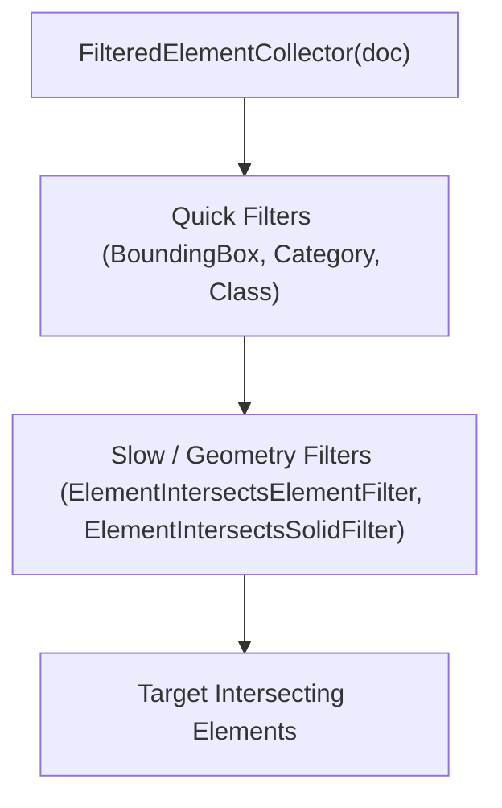

# Module 15 — Filters & Advanced Collection

> [!IMPORTANT]
> **Implementation Note / Reminder for Module 15:**
> When implementing the commands for this module, ensure comprehensive coverage of the **Spatial & 3D Geometry Intersection Filters**:
> 1. `ElementIntersectsFilter` — Abstract base class for 3D geometry intersection filters.
> 2. `ElementIntersectsElementFilter` — Slow filter checking physical 3D solid collision against a target Revit `Element`.
> 3. `ElementIntersectsSolidFilter` — Slow filter checking 3D intersection against an in-memory or transformed `Solid` (crucial for clearance zones and linked models).
> 4. `ElementIntersection` — Geometry / intersection evaluation utilities.

---

## 1. Module Overview & Mental Model

While **Module 02 (ElementCollection)** covers foundational queries using quick filters (`OfCategory`, `OfClass`, `WhereElementIsNotElementType`), **Module 15 (Filters & Advanced Collection)** focuses on high-performance advanced filtering:
* **Logical Filters**: `LogicalAndFilter`, `LogicalOrFilter`
* **Rule-based & Parameter Filters**: `ElementParameterFilter`, `FilterRule`, `ParameterFilterRuleFactory`
* **Bounding Box / Spatial Filters**: `BoundingBoxIntersectsFilter`, `BoundingBoxIsInsideFilter`, `BoundingBoxContainsPointFilter`
* **3D Solid / Geometry Intersection Filters**: `ElementIntersectsElementFilter`, `ElementIntersectsSolidFilter`

---

## 2. Key Intersection Filter Classes Reference

| Class Name | Type | Description & Primary Use Case |
| :--- | :--- | :--- |
| **`ElementIntersectsFilter`** | `ElementSlowFilter` (Abstract) | Base class for geometry intersection filters. |
| **`ElementIntersectsElementFilter`** | `ElementSlowFilter` | Checks physical 3D collision against an existing host document element directly. |
| **`ElementIntersectsSolidFilter`** | `ElementSlowFilter` | Checks 3D intersection against a specific `Solid` geometry (supports clearance buffers and transformed solids from `RevitLinkInstance`). |
| **`ElementIntersection`** | Geometry / Helper | Geometric intersection analysis. |

---

## 3. Planned Commands (To be updated upon implementation)

* [ ] `01` — **LogicalFiltersCommand**: Combining filters with `LogicalAndFilter` and `LogicalOrFilter`.
* [ ] `02` — **ParameterRuleFilterCommand**: Complex multi-parameter criteria via `ParameterFilterRuleFactory`.
* [ ] `03` — **BoundingBoxSpatialFilterCommand**: Fast bounding box pre-filtering (`BoundingBoxIntersectsFilter`).
* [ ] `04` — **ElementIntersectsElementCommand**: Finding physical clashes/intersections against a selected host element.
* [ ] `05` — **ElementIntersectsSolidCommand**: Checking intersections using custom solids / clearance envelopes / linked model geometry.
