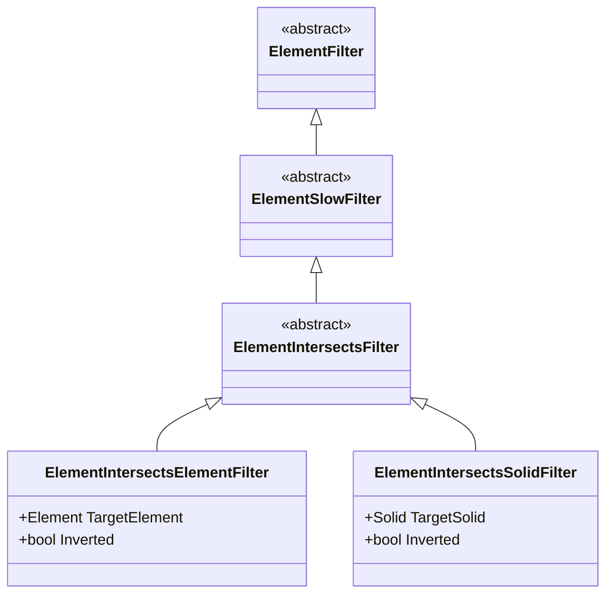

# Module 15 — Filters & Advanced Collection

## 1. Mental Model & Architecture

While **Module 02 (ElementCollection)** introduces basic collection queries (`OfCategory`, `OfClass`, `WhereElementIsNotElementType`), **Module 15 (Filters & Advanced Collection)** focuses on high-performance database filtering, complex boolean composition, parameter rule factories, and **true 3D physical collision detection**.

```mermaid
flowchart TD
    subgraph Revit Database Engine (Unmanaged C++)
        Collector["new FilteredElementCollector(doc)"]
        
        subgraph Stage 1: Quick Filters (Microseconds)
            Q1["ElementCategoryFilter / OfCategory()"]
            Q2["ElementClassFilter / OfClass()"]
            Q3["BoundingBoxIntersectsFilter / Outline"]
            Q4["ExclusionFilter(excludedIds)"]
        end
        
        subgraph Stage 2: Logical Combination
            L1["LogicalAndFilter(F1, F2)"]
            L2["LogicalOrFilter(F1, F2)"]
        end
        
        subgraph Stage 3: Slow & 3D Geometry Filters
            S1["ElementParameterFilter (Rule-based)"]
            S2["ElementIntersectsElementFilter (3D Clash)"]
            S3["ElementIntersectsSolidFilter (3D Volume/Clearance)"]
        end
        
        Collector --> Stage 1
        Stage 1 --> Stage 2
        Stage 2 --> Stage 3
    end
    
    subgraph Managed .NET Memory (C# CLR)
        Stage 3 --> Results["IList&lt;Element&gt; ToElements()"]
        Results --> LINQ["C# LINQ Operations (.Where, .GroupBy)"]
    end
```

---

## 2. Quick Filters vs. Slow Filters

In the Revit API, every filter inherits from the abstract base class `ElementFilter`. Understanding whether a filter is **Quick** or **Slow** is vital for writing performant add-ins on large enterprise models:

| Filter Type | Base Class | Performance | Execution Mechanism | Examples |
| :--- | :--- | :--- | :--- | :--- |
| **Quick Filter** | `ElementQuickFilter` | ⚡ **Ultra Fast** (Microseconds) | Evaluates memory-cached headers in native Revit database without expanding the full element record. | `ElementCategoryFilter`, `ElementClassFilter`, `BoundingBoxIntersectsFilter`, `ExclusionFilter`, `ElementMulticategoryFilter`. |
| **Slow Filter** | `ElementSlowFilter` | 🐢 **Heavy / Precise** (Milliseconds) | Expands the full element definition, reads non-indexed parameters, or extracts 3D solid geometry for Boolean tests. | `ElementParameterFilter`, `ElementIntersectsElementFilter`, `ElementIntersectsSolidFilter`, `ElementLevelFilter`. |

> [!TIP]
> **Golden Rule of Collector Chaining:**
> Always apply **Quick Filters FIRST** to aggressively eliminate 90%+ of irrelevant elements before applying a **Slow 3D Geometry Filter**.

---

## 3. Deep Dive: 3D Geometry Intersection Filters

Revit provides specialized native filters for geometric clash detection and spatial boundaries:



### The 4 Intersection Classes

1. **`ElementIntersectsFilter`**
   * **Role:** The **abstract base class** for 3D geometry filters. It cannot be instantiated directly; it serves as the common polymorphic parent.
2. **`ElementIntersectsElementFilter`**
   * **Role:** Evaluates physical 3D solid collisions against an active model element in the same document.
   * **Best used for:** Direct intra-document interference checks (e.g., Pipe vs. Duct, Beam vs. Wall).
3. **`ElementIntersectsSolidFilter`**
   * **Role:** Evaluates physical 3D collisions against an explicit in-memory `Solid`.
   * **Best used for:** 
     * **Clearance Zones:** Enlarged buffer envelopes (e.g. +50mm around MEP services).
     * **Cross-Model Linked Clashes:** Solids extracted from a `RevitLinkInstance` and transformed into host world space.
     * **Virtual Spaces:** Room solids, corridor bounds, or construction zones.
4. **`ElementIntersection`**
   * **Role:** Geometric intersection result evaluation / classification helper.

---

## 4. Learning Progression (Commands 01–08)

| # | Command File | Class Name | Main API | What It Teaches |
| :--- | :--- | :--- | :--- | :--- |
| **01** | [LogicalFiltersCommand.cs](Commands/LogicalFiltersCommand.cs) | `LogicalFiltersCommand` | `LogicalAndFilter`, `LogicalOrFilter` | Combining multiple search rules using boolean logic trees in native C++ memory. |
| **02** | [ParameterRuleFilterCommand.cs](Commands/ParameterRuleFilterCommand.cs) | `ParameterRuleFilterCommand` | `ElementParameterFilter`, `ParameterFilterRuleFactory` | Evaluating string, numeric, and inverted parameter conditions without loading elements into C#. |
| **03** | [MultiCategoryFilterCommand.cs](Commands/MultiCategoryFilterCommand.cs) | `MultiCategoryFilterCommand` | `ElementMulticategoryFilter` | Querying multiple categories simultaneously in a single native collector pass. |
| **04** | [ExclusionFilterCommand.cs](Commands/ExclusionFilterCommand.cs) | `ExclusionFilterCommand` | `ExclusionFilter` | Natively excluding specific element IDs (e.g., selected or already processed elements). |
| **05** | [BoundingBoxSpatialFilterCommand.cs](Commands/BoundingBoxSpatialFilterCommand.cs) | `BoundingBoxSpatialFilterCommand` | `BoundingBoxIntersectsFilter`, `Outline` | Fast Axis-Aligned Bounding Box (AABB) spatial queries for pre-filtering candidate clash sets. |
| **06** | [ElementIntersectsElementCommand.cs](Commands/ElementIntersectsElementCommand.cs) | `ElementIntersectsElementCommand` | `ElementIntersectsElementFilter` | 3D solid collision detection against a selected host element. |
| **07** | [ElementIntersectsSolidCommand.cs](Commands/ElementIntersectsSolidCommand.cs) | `ElementIntersectsSolidCommand` | `ElementIntersectsSolidFilter`, `GeometryCreationUtilities` | Clearance envelope creation and custom 3D solid interference testing. |
| **08** | [LinkedModelIntersectionCommand.cs](Commands/LinkedModelIntersectionCommand.cs) | `LinkedModelIntersectionCommand` | `ElementIntersectsSolidFilter`, `RevitLinkInstance`, `SolidUtils` | Cross-model clash detection: Transforming linked element solids to host world space for collision querying. |

---

## 5. Architectural Guide: Cross-Model Clash Detection

In multi-discipline BIM environments, elements to be checked often reside in **Revit Links** (e.g., Structural Model linked into MEP Model).

### The Coordinate Challenge:
`ElementIntersectsElementFilter` cannot directly query across different documents because each linked model has its own local coordinate system and `Document` instance.

### The Standard Solution Workflow:

```mermaid
sequenceDiagram
    autonumber
    actor User
    participant Link as RevitLinkInstance
    participant Solid as Solid Geometry
    participant HostCollector as FilteredElementCollector (Host Doc)
    
    User->>Link: Pick element in Link (LinkedElementId)
    Link->>Solid: Extract 3D Solid (fine detail)
    Link->>Solid: SolidUtils.CreateTransformed(solid, link.GetTotalTransform())
    Solid->>HostCollector: Pass transformed Solid to ElementIntersectsSolidFilter
    HostCollector-->>User: Returns all Host Elements intersecting the Linked Solid!
```

---

## 6. Summary of Best Practices

1. **Avoid LINQ for Base Filtering:** Always prefer `ElementParameterFilter` or `ParameterFilterRuleFactory` over `.Where(x => x.LookupParameter(...))` whenever possible.
2. **Exclude Self:** When checking clashes against a target element, always pass an `ExclusionFilter([target.Id])` to prevent the element from reporting a collision with itself.
3. **Bounding Box Pre-Pass:** Before applying `ElementIntersectsElementFilter` or `ElementIntersectsSolidFilter`, always apply a `BoundingBoxIntersectsFilter` with the target's bounding box `Outline` to discard non-proximate elements instantly.
