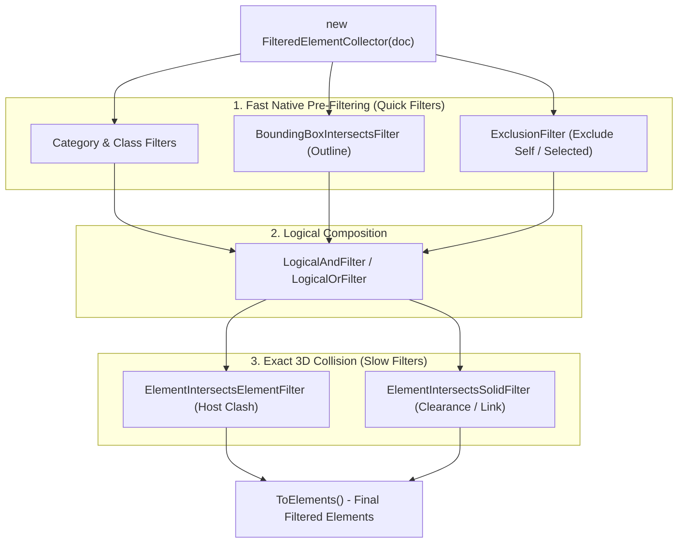
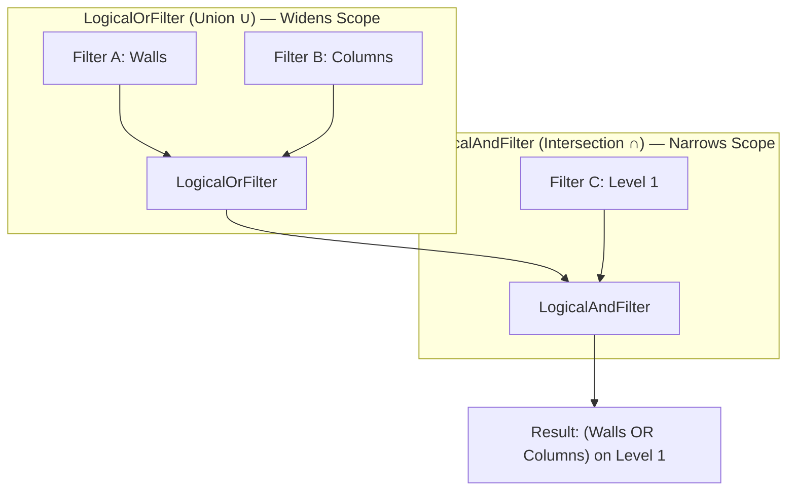
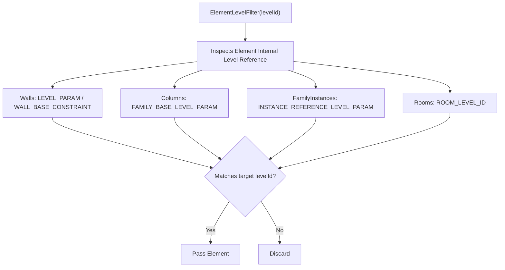
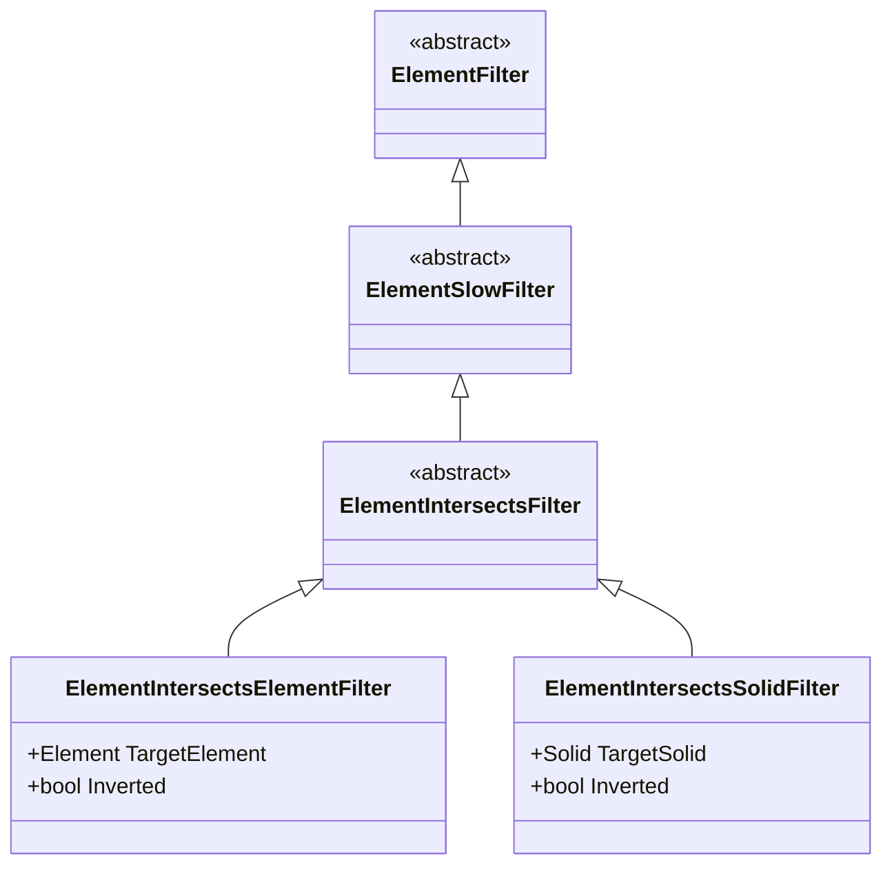
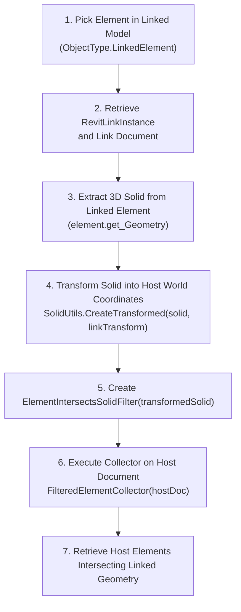

# Module 15 — Filters & Advanced Collection

## 1. Mental Model & Architecture

While **Module 02 (ElementCollection)** introduces basic collection queries (`OfCategory`, `OfClass`, `WhereElementIsNotElementType`), **Module 15 (Filters & Advanced Collection)** focuses on high-performance database filtering, complex boolean composition, parameter rule factories, and **true 3D physical collision detection**.

---

## 2. Quick Filters vs. Slow Filters

In the Revit API, every filter inherits from the abstract base class `ElementFilter`. Understanding whether a filter is **Quick** or **Slow** is vital for writing performant add-ins on large enterprise models:

| Filter Type | Base Class | Performance | Execution Mechanism | Examples |
| :--- | :--- | :--- | :--- | :--- |
| **Quick Filter** | `ElementQuickFilter` | ⚡ **Ultra Fast** (Microseconds) | Evaluates memory-cached headers in native Revit database without expanding the full element record. | `ElementCategoryFilter`, `ElementClassFilter`, `BoundingBoxIntersectsFilter`, `ExclusionFilter`, `ElementMulticategoryFilter`. |
| **Slow Filter** | `ElementSlowFilter` | 🐢 **Heavy / Precise** (Milliseconds) | Expands the full element definition, reads non-indexed parameters, or extracts 3D solid geometry for Boolean tests. | `ElementParameterFilter`, `ElementIntersectsElementFilter`, `ElementIntersectsSolidFilter`, `ElementLevelFilter`. |

> [!TIP]
> **Golden Rule of Collector Chaining:**
> Always apply **Quick Filters FIRST** to aggressively eliminate 90%+ of irrelevant elements before applying a **Slow 3D Geometry Filter**.

---

## 3. Deep Dive: `LogicalAndFilter` vs. `LogicalOrFilter`

Revit allows you to build complex Boolean query trees in unmanaged C++ memory using `LogicalAndFilter` and `LogicalOrFilter`.

### Conceptual Comparison

### Direct Feature Comparison

| Feature | `LogicalAndFilter` | `LogicalOrFilter` |
| :--- | :--- | :--- |
| **Set Theory Operation** | **Intersection ($\cap$)** — Must satisfy all criteria | **Union ($\cup$)** — Must satisfy at least one criteria |
| **C# Equivalent** | `conditionA && conditionB` | `conditionA \|\| conditionB` |
| **Effect on Result Count** | **Narrows / Reduces** candidate element count | **Widens / Increases** candidate element count |
| **Constructor Overloads** | 1. `new LogicalAndFilter(filterA, filterB)` 2. `new LogicalAndFilter(IList<ElementFilter>)` | 1. `new LogicalOrFilter(filterA, filterB)` 2. `new LogicalOrFilter(IList<ElementFilter>)` |
| **Collector Chaining** | Calling `.WherePasses(F1).WherePasses(F2)` implicitly acts as an **AND** | Chaining multiple `.WherePasses()` cannot do OR; you **must** use `LogicalOrFilter` |
| **Primary Use Case** | Combining different criteria types (e.g., `Category == Wall` **AND** `Length >= 10ft`) | Grouping multiple alternatives (e.g., `Category == Ducts` **OR** `Category == Pipes`) |

---

## 4. Comprehensive Master Reference Table: All Revit Filter Classes

Below is the complete reference catalog of all filter classes in `Autodesk.Revit.DB`, categorized by their execution mechanism and real-world BIM objectives:

### 🔹 A. Logical Composition Filters (`ElementLogicalFilter`)

| Class Name | Type | Main Objective | Constructor Inputs | Real-World Use Cases |
| :--- | :--- | :--- | :--- | :--- |
| **`LogicalAndFilter`** | Logical | Evaluates if an element satisfies **ALL** contained filters. | `(ElementFilter, ElementFilter)` or `(IList<ElementFilter>)` | Querying elements meeting multiple independent criteria (e.g., Walls on Level 1 with Fire Rating > 60 min). |
| **`LogicalOrFilter`** | Logical | Evaluates if an element satisfies **ANY** contained filter. | `(ElementFilter, ElementFilter)` or `(IList<ElementFilter>)` | Gathering multiple categories or alternative parameter conditions in a single query. |

---

### 🔹 B. Quick Filters (`ElementQuickFilter` — Microsecond Evaluation)

| Class Name | Type | Main Objective | Constructor Inputs | Real-World Use Cases |
| :--- | :--- | :--- | :--- | :--- |
| **`ElementCategoryFilter`** | Quick | Filters elements matching a specific category. | `(BuiltInCategory category, bool inverted = false)` | Primary collector step (e.g., `.OfCategory(OST_Walls)`). |
| **`ElementClassFilter`** | Quick | Filters elements matching a specific C# .NET Type. | `(Type type, bool inverted = false)` | Filtering by concrete class (e.g., `typeof(Wall)`, `typeof(Level)`). |
| **`ElementMulticategoryFilter`** | Quick | Filters elements matching any category in a collection in one native pass. | `(ICollection<BuiltInCategory>)` or `(ICollection<ElementId>)` | Querying entire discipline systems (e.g., all MEP ducts + pipes + conduits together). |
| **`ElementIsElementTypeFilter`** | Quick | Passes only Type definitions (`ElementType`, `FamilySymbol`, `WallType`). | *(None / inverted flag)* | Retrieving family symbols, wall types, or pipe types for batch property inspection. |
| **`ElementIsNotElementTypeFilter`** | Quick | Passes only physical model instances, excluding types. | *(None / inverted flag)* | Primary collector step to eliminate type definitions when counting or editing placed model elements. |
| **`ExclusionFilter`** | Quick | Excludes a given set of `ElementId`s from collector results. | `(ICollection<ElementId> idsToExclude)` | Excluding currently selected elements, template elements, or already processed elements in batch loops. |
| **`ElementIdSetFilter`** | Quick | Passes only elements whose `ElementId` is in the provided collection. | `(ICollection<ElementId> idsToInclude)` | Converting an ID collection back into live `Element` objects efficiently. |
| **`BoundingBoxIntersectsFilter`** | Quick | Tests if an element's Axis-Aligned Bounding Box (AABB) overlaps an `Outline`. | `(Outline outline, bool inverted = false)` | Fast spatial pre-filtering to narrow down candidate elements before expensive 3D solid collision tests. |
| **`BoundingBoxIsInsideFilter`** | Quick | Tests if an element's AABB is strictly enclosed inside an `Outline`. | `(Outline outline, bool inverted = false)` | Selecting elements strictly contained inside a rectangular spatial zone or level slice. |
| **`BoundingBoxContainsPointFilter`** | Quick | Tests if an element's AABB contains a given 3D XYZ point. | `(XYZ point, bool inverted = false)` | Finding model elements located at or enclosing a specific 3D coordinate. |
| **`FamilySymbolFilter`** | Quick | Finds all `FamilySymbol` types belonging to a specific `Family`. | `(ElementId familyId, bool inverted = false)` | Listing all available types within a specific loaded family (e.g. all sizes of a single door family). |
| **`ElementWorksetFilter`** | Quick | Passes elements assigned to a specific Workset ID. | `(WorksetId worksetId, bool inverted = false)` | Worksharing add-ins, auditing elements on incorrect worksets, or workset-based batch processing. |
| **`ElementDesignOptionFilter`** | Quick | Passes elements belonging to a specific Design Option. | `(ElementId designOptionId, bool inverted = false)` | Auditing or isolating elements in specific design alternatives. |
| **`ElementPhaseStatusFilter`** | Quick | Filters elements based on their status in a specific Phase (Existing, New, Demolished, Temporary). | `(ElementId phaseId, ElementOnPhaseStatus status)` | Quantity takeoff per construction phase, demolition schedules, and phase validation. |
| **`ElementOwnerViewFilter`** | Quick | Passes view-specific elements owned by a given view (e.g., detail lines, text notes, dimensions). | `(ElementId viewId, bool inverted = false)` | Cleaning up or copying 2D drafting annotations and dimensions from a specific sheet or view. |
| **`VisibleInViewFilter`** | Quick | Passes elements currently visible in a specific view. | `(Document doc, ElementId viewId, bool inverted = false)` | View-dependent export, batch drafting automation, and visible clash checks. |
| **`ElementStructuralTypeFilter`** | Quick | Filters structural elements by their `StructuralType` (Beam, Column, Footing, NonStructural). | `(StructuralType type, bool inverted = false)` | Structural engineering add-ins isolating load-bearing elements. |

---

### 🔹 C. Slow Filters (`ElementSlowFilter` — Deep Record & 3D Geometry Evaluation)

| Class Name | Type | Main Objective | Constructor Inputs | Real-World Use Cases |
| :--- | :--- | :--- | :--- | :--- |
| **`ElementLevelFilter`** | Slow | Finds elements associated with a specific Level. | `(ElementId levelId, bool inverted = false)` | Grouping or scheduling elements by level (Walls, Columns, Beams, Floors, Family Instances). *(See Deep Dive below)*. |
| **`ElementParameterFilter`** | Slow | Evaluates element parameters against rule criteria natively at C++ level. | `(FilterRule rule)` or `(IList<FilterRule> rules)` | Querying elements by parameter values (e.g. `Comments != ""`, `Length >= 10ft`, `Fire Rating == 2hr`). |
| **`ElementIntersectsFilter`** | Slow | **Abstract base class** for 3D solid geometry collision filters. | *(Abstract — Cannot be instantiated)* | Polymorphic base for `ElementIntersectsElementFilter` and `ElementIntersectsSolidFilter`. |
| **`ElementIntersectsElementFilter`** | Slow | Tests for true physical 3D solid geometry collision against a live host model element. | `(Element targetElement, bool inverted = false)` | Automated clash detection (e.g. Pipe vs Beam, Duct vs Wall) in the host document. |
| **`ElementIntersectsSolidFilter`** | Slow | Tests for true 3D intersection against an explicit in-memory `Solid`. | `(Solid targetSolid, bool inverted = false)` | Clearance zone buffer violation (+50mm offset around pipes), room solid containment, and cross-model linked clashes. |
| **`RoomFilter`** | Slow | Passes all Room elements in the model. | *(None / inverted flag)* | Architecture and energy analysis add-ins collecting all spatial rooms. |
| **`SpaceFilter`** | Slow | Passes all MEP Space elements in the model. | *(None / inverted flag)* | MEP HVAC airflow and load calculation add-ins. |
| **`AreaFilter`** | Slow | Passes all Area elements in Gross or Rentable Area schemes. | *(None / inverted flag)* | BOMA rentable area and gross building area calculations. |
| **`RoomTagFilter` / `SpaceTagFilter`** | Slow | Passes all Room or Space tag annotation elements. | *(None / inverted flag)* | Automated room tagging QA/QC (finding untagged rooms or orphan tags). |
| **`FamilyInstanceFilter`** | Slow | Finds instances placed from a specific `FamilySymbol`. | `(Document doc, ElementId familySymbolId)` | Finding all placed instances of a specific equipment or furniture type in the model. |
| **`CurveElementFilter`** | Slow | Filters curve-based elements by `CurveElementType` (ModelCurve, DetailCurve, SymbolicCurve). | `(CurveElementType type, bool inverted = false)` | Cleaning CAD imports, finding 2D symbolic lines vs 3D model curves. |
| **`PrimaryDesignOptionMemberFilter`** | Slow | Passes elements belonging to the Primary design option. | *(None / inverted flag)* | Main model export and default design option validation. |

---

## 5. Spotlight: Why is `ElementLevelFilter` a Slow Filter?

### Why `ElementLevelFilter` is classified as a Slow Filter:
* Unlike Category or Class (which are indexed in memory-cached header tables), an element's **Level** is stored differently across different Revit element kinds:
  * For **Walls**, it is stored in `BuiltInParameter.WALL_BASE_CONSTRAINT`.
  * For **Structural Columns**, it is stored in `BuiltInParameter.FAMILY_BASE_LEVEL_PARAM`.
  * For **Generic Family Instances**, it is stored in `BuiltInParameter.INSTANCE_REFERENCE_LEVEL_PARAM`.
  * For **Rooms**, it is stored in `BuiltInParameter.ROOM_LEVEL_ID`.
* To determine if an element belongs to a level, Revit must expand the element's parameter map and evaluate its internal level binding.
* **Best Practice:** Combine `ElementLevelFilter` with a quick category filter (`OfCategory`) or quick class filter (`OfClass`) first so Revit only evaluates levels for the target category!

---

## 6. Master Comparison Matrix: Similar Functions & When to Use Which

To help you decide which filter or query API to choose in different scenarios:

### 1. Category Filtering Approaches

| Method | API Class | Performance | When to Use |
| :--- | :--- | :--- | :--- |
| **Single Category** | `.OfCategory(BuiltInCategory)` | ⚡ Ultra Fast | When you only need elements of one category. |
| **Multiple Categories (Native)** | `new ElementMulticategoryFilter(categoriesList)` | ⚡ Ultra Fast | **Recommended:** When querying multiple categories in one single database scan. |
| **Multiple Categories (Composite)** | `new LogicalOrFilter(categoryFilterList)` | ⚡ Fast | Functional equivalent to `ElementMulticategoryFilter`, but slightly more verbose to construct. |
| **LINQ Merge (Anti-Pattern)** | Multiple collectors merged with `.Union()` in C# | 🐢 Slow | Avoid: Loads all objects across multiple passes into .NET memory. |

---

### 2. Spatial & Collision Checking Approaches

| Approach | Main API | Precision | Performance | Best Use Case |
| :--- | :--- | :--- | :--- | :--- |
| **Bounding Box Overlap** | `BoundingBoxIntersectsFilter` | 🔲 Coarse (AABB box) | ⚡ Fast (Quick) | Pre-filtering candidate clash sets before 3D solid checks. |
| **Strict Bounding Box Containment** | `BoundingBoxIsInsideFilter` | 🔲 Coarse (AABB box) | ⚡ Fast (Quick) | Checking if an element is completely inside a rectangular room/zone. |
| **Point in Bounding Box** | `BoundingBoxContainsPointFilter` | 📍 Point vs. Box | ⚡ Fast (Quick) | Finding elements whose bounding box encompasses a given 3D coordinate. |
| **Host Element 3D Collision** | `ElementIntersectsElementFilter` | 🧊 Exact (3D Solid) | 🐢 Heavy (Slow) | True physical clash check against a live element in the host model. |
| **Custom Solid / Clearance** | `ElementIntersectsSolidFilter` | 🧊 Exact (3D Solid) | 🐢 Heavy (Slow) | Clearance buffers (+50mm offset envelope) or non-standard 3D volumes. |
| **Linked Model Collision** | `ElementIntersectsSolidFilter` + `SolidUtils.CreateTransformed` | 🧊 Exact (3D Solid) | 🐢 Heavy (Slow) | Checking clashes between host elements and linked model elements across coordinate spaces. |

---

### 3. Database Parameter Filtering vs. C# LINQ

| Aspect | `ElementParameterFilter` (Native) | C# LINQ `.Where(e => ...)` (Managed) |
| :--- | :--- | :--- |
| **Execution Layer** | Native unmanaged C++ Revit core | Managed .NET CLR runtime |
| **Memory Allocation** | Zero .NET object allocations for non-matching elements | Creates a managed `Element` proxy for **every** element in the database |
| **Speed on Large Models** | Up to **10x – 50x faster** | Noticeable UI lag / high garbage collection overhead |
| **Verdict** | Always use for initial database querying | Use only for complex business logic after native filtering |

---

## 7. Deep Dive: 3D Geometry Intersection Filters

### The 4 Intersection Classes

1. **`ElementIntersectsFilter`**
   * **Role:** The **abstract base class** for 3D geometry filters. It cannot be instantiated directly; it serves as the common polymorphic parent.
2. **`ElementIntersectsElementFilter`**
   * **Role:** Evaluates physical 3D solid collisions against an active model element in the same document.
   * **Best used for:** Direct intra-document interference checks (e.g., Pipe vs. Duct, Beam vs. Wall).
3. **`ElementIntersectsSolidFilter`**
   * **Role:** Evaluates physical 3D collisions against an explicit in-memory `Solid`.
   * **Best used for:** 
     * **Clearance Zones:** Enlarged buffer envelopes (e.g. +50mm around MEP services).
     * **Cross-Model Linked Clashes:** Solids extracted from a `RevitLinkInstance` and transformed into host world space.
     * **Virtual Spaces:** Room solids, corridor bounds, or construction zones.
4. **`ElementIntersection`**
   * **Role:** Geometric intersection result evaluation / classification helper.

---

## 8. Architectural Guide: Cross-Model Clash Detection

In multi-discipline BIM environments, elements to be checked often reside in **Revit Links** (e.g., Structural Model linked into MEP Model).

### The Coordinate Challenge:
`ElementIntersectsElementFilter` cannot directly query across different documents because each linked model has its own local coordinate system and `Document` instance.

### The Standard Solution Workflow:

---

## 9. Learning Progression (Commands 01–08)

| # | Command File | Class Name | Main API | What It Teaches |
| :--- | :--- | :--- | :--- | :--- |
| **01** | [LogicalFiltersCommand.cs](Commands/LogicalFiltersCommand.cs) | `LogicalFiltersCommand` | `LogicalAndFilter`, `LogicalOrFilter`, `ElementLevelFilter` | Combining multiple search rules using boolean logic trees in native C++ memory. |
| **02** | [ParameterRuleFilterCommand.cs](Commands/ParameterRuleFilterCommand.cs) | `ParameterRuleFilterCommand` | `ElementParameterFilter`, `ParameterFilterRuleFactory` | Evaluating string, numeric, and inverted parameter conditions without loading elements into C#. |
| **03** | [MultiCategoryFilterCommand.cs](Commands/MultiCategoryFilterCommand.cs) | `MultiCategoryFilterCommand` | `ElementMulticategoryFilter` | Querying multiple categories simultaneously in a single native collector pass. |
| **04** | [ExclusionFilterCommand.cs](Commands/ExclusionFilterCommand.cs) | `ExclusionFilterCommand` | `ExclusionFilter` | Natively excluding specific element IDs (e.g., selected or already processed elements). |
| **05** | [BoundingBoxSpatialFilterCommand.cs](Commands/BoundingBoxSpatialFilterCommand.cs) | `BoundingBoxSpatialFilterCommand` | `BoundingBoxIntersectsFilter`, `BoundingBoxIsInsideFilter`, `BoundingBoxContainsPointFilter`, `Outline` | Fast Axis-Aligned Bounding Box (AABB) spatial queries for pre-filtering candidate clash sets. |
| **06** | [ElementIntersectsElementCommand.cs](Commands/ElementIntersectsElementCommand.cs) | `ElementIntersectsElementCommand` | `ElementIntersectsElementFilter` | 3D solid collision detection against a selected host element. |
| **07** | [ElementIntersectsSolidCommand.cs](Commands/ElementIntersectsSolidCommand.cs) | `ElementIntersectsSolidCommand` | `ElementIntersectsSolidFilter`, `GeometryCreationUtilities` | Clearance envelope creation and custom 3D solid interference testing. |
| **08** | [LinkedModelIntersectionCommand.cs](Commands/LinkedModelIntersectionCommand.cs) | `LinkedModelIntersectionCommand` | `ElementIntersectsSolidFilter`, `RevitLinkInstance`, `SolidUtils` | Cross-model clash detection: Transforming linked element solids to host world space for collision querying. |

---

## 10. Summary of Best Practices & Common Pitfalls

1. **Avoid LINQ for Base Filtering:** Always prefer `ElementParameterFilter` or `ParameterFilterRuleFactory` over `.Where(x => x.LookupParameter(...))` whenever possible.
2. **Exclude Self in Collision Checks:** When checking clashes against a target element, always pass an `ExclusionFilter([target.Id])` to prevent the element from reporting a collision with itself.
3. **Bounding Box Pre-Pass:** Before applying `ElementIntersectsElementFilter` or `ElementIntersectsSolidFilter`, always apply a `BoundingBoxIntersectsFilter` with the target's bounding box `Outline` to discard non-proximate elements instantly.
4. **Always Transform Linked Solids:** Never pass a raw solid extracted from a linked model directly to `ElementIntersectsSolidFilter` without transforming it with `linkInstance.GetTotalTransform()`.
5. **Chain Quick Filters with `ElementLevelFilter`:** Because `ElementLevelFilter` is a slow filter (it reads element parameter maps), always chain it after `.OfCategory()` or `.OfClass()` to maintain maximum query performance.
