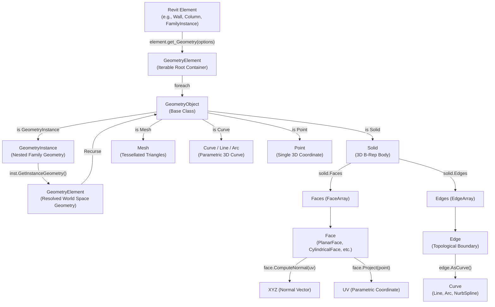
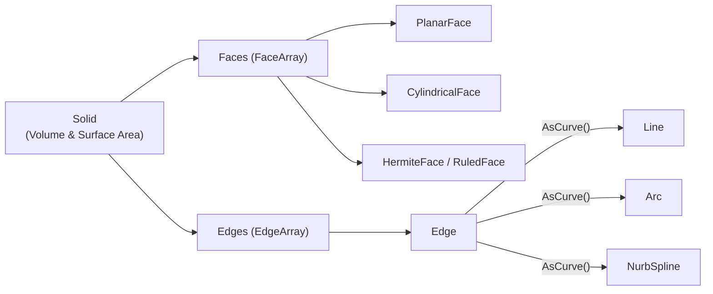
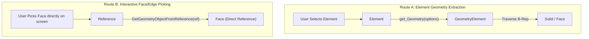
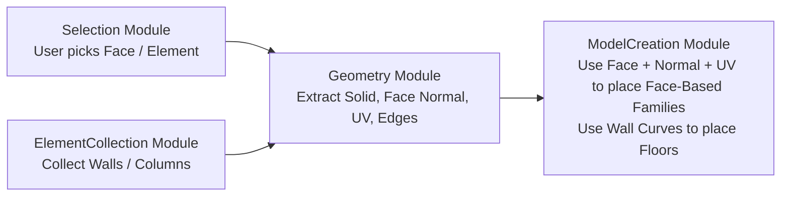

# Module 03 — Geometry

Welcome to the **Geometry** module documentation. This guide explains how to extract, navigate, and analyze 3D geometry objects in Revit using the Revit API in C#.

Rather than acting as a simple API reference, this document teaches you **how to think about Revit geometry**, how Revit structures its Boundary Representation (B-Rep) tree, the differences between geometry access strategies, and how geometry connects to Selection, Element Collection, and Model Creation.

---

## 1. How to Think About This Module

Revit elements are not raw 3D mesh files like OBJ or STL objects; they are high-level parametric building components. When Revit renders a Wall, Column, or Floor, it dynamically generates underlying geometric representations on demand.

To inspect or manipulate an element's physical form, you must traverse Revit's **Geometry Hierarchy**:



---

## 2. Geometry Hierarchy & Access Methods

### 1. `Element.get_Geometry(Options)`
The primary method for extracting geometry from an `Element`. It requires an `Options` object to configure how geometry is evaluated.

#### Options Configuration
```csharp
Options options = new Options
{
    ComputeReferences = true,          // Generates stable References on faces/edges (required for dimensioning & face-based creation)
    IncludeNonVisibleObjects = false,  // Excludes hidden reference planes and construction lines
    DetailLevel = ViewDetailLevel.Fine // Evaluates high-detail geometry (e.g., rounded pipe profiles, beam web/flanges)
};

GeometryElement geometryElement = element.get_Geometry(options);
```

---

### 2. `GeometryElement` vs `GeometryObject`

- **`GeometryElement`**: An iterable container returned by `get_Geometry()`. It contains one or more `GeometryObject` instances.
- **`GeometryObject`**: The abstract base class for all geometric entities in Revit (`Solid`, `Mesh`, `GeometryInstance`, `Curve`, `Point`).

---

### 3. The `GeometryInstance` Pattern (Critical for Loadable Families)

> [!IMPORTANT]
> When you extract geometry from a **Loadable Family** (e.g., Column, Chair, Door), `element.get_Geometry(options)` does **NOT** return `Solid` objects directly!
> Instead, it returns a `GeometryInstance`.

A `GeometryInstance` represents a shared family geometry block transformed into model space. To access the actual `Solid` objects inside a family instance, you must unwrap it using `GetInstanceGeometry()`:

```csharp
foreach (GeometryObject geomObj in geometryElement)
{
    if (geomObj is Solid solid && solid.Volume > 0)
    {
        // Direct solid (common in System Families like Walls)
        ProcessSolid(solid);
    }
    else if (geomObj is GeometryInstance geomInstance)
    {
        // Nested geometry (common in Loadable Families like Columns/Doors)
        GeometryElement instanceGeometry = geomInstance.GetInstanceGeometry();
        foreach (GeometryObject instObj in instanceGeometry)
        {
            if (instObj is Solid instSolid && instSolid.Volume > 0)
            {
                ProcessSolid(instSolid);
            }
        }
    }
}
```

---

### 4. Boundary Representation: Solid, Face, Edge & Curve

Revit uses **Boundary Representation (B-Rep)** to define 3D solids:



- **Solid**: A 3D closed body. Always filter solids by `solid.Volume > 0` to exclude zero-volume auxiliary/construction solids.
- **Face**: A topological surface bounding a solid. Subtypes include `PlanarFace`, `CylindricalFace`, `ConicalFace`, and `HermiteFace`.
- **Edge**: A topological boundary segment between two faces. Calling `edge.AsCurve()` converts the topological edge into a geometric 3D `Curve` (`Line`, `Arc`, `NurbSpline`).
- **Curve**: A 3D parametric curve possessing length, start point, and end point.

---

## 3. Interactive Selection Reference vs. Element Geometry

There are two fundamental ways to obtain geometry in Revit:



### Comparing Geometry Access Routes

| Property | Route A: `Element.get_Geometry()` | Route B: `PickObject(ObjectType.Face)` |
| :--- | :--- | :--- |
| **Input** | Whole `Element` reference | Interactive target `Reference` |
| **Returns** | `GeometryElement` container | Direct `Face` or `Edge` via `GetGeometryObjectFromReference()` |
| **Use Case** | Batch model analysis, volume calculations, automated boundary extraction | Interactive user creation (e.g., placing a face-based light fixture on a wall) |
| **Reference Data** | Must set `ComputeReferences = true` | `Reference` automatically carries `GlobalPoint` & pick data |

```csharp
// Route B Code Example (Direct Face Pick)
Reference reference = uidoc.Selection.PickObject(ObjectType.Face, "Select a face");
Element element = doc.GetElement(reference);

// Retrieve the exact Face selected by the user
GeometryObject geomObj = element.GetGeometryObjectFromReference(reference);
if (geomObj is Face face)
{
    XYZ globalPoint = reference.GlobalPoint;
    IntersectionResult projResult = face.Project(globalPoint);
    UV uv = projResult.UVPoint;
    XYZ normal = face.ComputeNormal(uv);
}
```

---

## 4. Analysis of Implemented Geometry Commands

The `Samples/Geometry/Commands/` folder contains 2 commands:

### 1. `ExploreGeometryCommand.cs`
Focuses on inspecting top-level geometry structure and handling `GeometryInstance` unwrapping:

```csharp
Options options = new Options
{
    ComputeReferences = true,
    IncludeNonVisibleObjects = false,
    DetailLevel = ViewDetailLevel.Fine
};

GeometryElement geometryElement = element.get_Geometry(options);

foreach (GeometryObject geomObj in geometryElement)
{
    // Logs top-level class types (Solid, GeometryInstance, Mesh, etc.)
    if (geomObj is GeometryInstance geomInstance)
    {
        GeometryElement instanceGeometry = geomInstance.GetInstanceGeometry();
        // Unwraps nested family instance objects
    }
}
```

---

### 2. `ExploreSolidCommand.cs`
Focuses on deep B-Rep solid traversal, non-zero volume filtering, face normal evaluation, and edge-to-curve conversion:

```csharp
private List<Solid> CollectSolids(GeometryElement geometryElement)
{
    List<Solid> solids = new List<Solid>();

    foreach (GeometryObject geomObj in geometryElement)
    {
        // 1. Filter solids with non-zero volume
        if (geomObj is Solid solid && solid.Volume > 0)
        {
            solids.Add(solid);
        }
        // 2. Recurse into GeometryInstance
        else if (geomObj is GeometryInstance geomInstance)
        {
            GeometryElement instanceGeometry = geomInstance.GetInstanceGeometry();
            solids.AddRange(CollectSolids(instanceGeometry));
        }
    }
    return solids;
}
```

#### Traversal Breakdown inside `ExploreSolidCommand`:
```csharp
// Inspect Faces
foreach (Face face in solid.Faces)
{
    XYZ normalAtOrigin = face.ComputeNormal(UV.Zero);
    double area = face.Area; // square feet
}

// Inspect Edges and convert to Curves
foreach (Edge edge in solid.Edges)
{
    Curve curve = edge.AsCurve();
    double length = curve.Length; // feet
    string curveType = curve.GetType().Name; // Line, Arc, NurbSpline
}
```

---

## 5. Geometry Terminology & Type Matrix

| Object | Class | Represents | Can Contain / Access |
| :--- | :--- | :--- | :--- |
| `GeometryElement` | `GeometryElement` | Top-level geometry container for an element | Iteration over `GeometryObject` items |
| `GeometryObject` | `GeometryObject` | Abstract base class for all geometry | Subtypes: `Solid`, `GeometryInstance`, `Mesh`, `Curve` |
| `GeometryInstance` | `GeometryInstance` | Transformed geometry block for loadable families | `GetInstanceGeometry()` $\rightarrow$ nested `GeometryElement` |
| `Solid` | `Solid` | 3D closed B-Rep solid body | `Volume`, `SurfaceArea`, `Faces`, `Edges` |
| `Face` | `Face` | Topological 2D surface of a solid | `Area`, `ComputeNormal(UV)`, `Project(XYZ)` |
| `Edge` | `Edge` | Topological boundary edge between faces | `AsCurve()` $\rightarrow$ 3D `Curve` |
| `Curve` | `Curve` | Parametric 3D line or curve | `Length`, `GetEndPoint(0)`, `GetEndPoint(1)` |
| `Reference` | `Reference` | Pointer to a specific element/face/edge | `GlobalPoint`, `ElementId`, `GetGeometryObjectFromReference()` |

---

## 6. Common Mistakes

> [!WARNING]
> Pay close attention to these common geometry traps:

1. **Assuming `element.get_Geometry()` directly contains `Solid` objects**:
   For loadable family instances, geometry is wrapped inside a `GeometryInstance`. Failing to call `GetInstanceGeometry()` results in missing all solids!
2. **Ignoring Zero-Volume Solids**:
   Revit elements often contain auxiliary solids with `Volume == 0` (e.g., cutting voids, reference volumes). Always check `solid.Volume > 0`.
3. **Forgetting `ComputeReferences = true`**:
   If you plan to use face or edge references for dimensioning or family placement, you **must** set `options.ComputeReferences = true`.
4. **Confusing `Face` with `Reference`**:
   A `Face` is an in-memory geometry object; a `Reference` is a persistent pointer to a face on a specific element instance. You need a `Reference` to create face-based families.
5. **Assuming `ComputeNormal(UV)` returns a global direction regardless of location**:
   For curved surfaces (cylinders, spheres), `ComputeNormal(UV)` returns different vectors depending on the `UV` coordinate passed.

---

## 7. How Geometry Connects to Other Modules



- **From Selection / Collection**: You pick or collect elements/references.
- **Inside Geometry**: You query `get_Geometry()`, extract `Solid`, calculate `ComputeNormal()`, or convert `Edge` to `Curve`.
- **To Model Creation**: You pass extracted `Curve` loops to `Floor.Create()` or pass `Reference` + `UV` + `Normal` to `doc.Create.NewFamilyInstance()`.

---

## 8. Key Takeaways

- Always configure `Options` with `ComputeReferences = true` and `DetailLevel = ViewDetailLevel.Fine`.
- Always handle `GeometryInstance` unwrapping recursively via `GetInstanceGeometry()`.
- Always filter solids with `solid.Volume > 0`.
- Use `edge.AsCurve()` to bridge topological edges to geometric curves.
- Direct face picking (`PickObject(ObjectType.Face)`) grants instant access to `Reference`, `GlobalPoint`, and `Face` without manually searching the solid tree.

---

## 9. Where This Leads Next

Now that you understand how to navigate and extract 3D geometry:
- Proceed to **Module 04 — Model Creation** to see how geometric curves and face normals are used to programmatically generate Walls, Floors, Columns, Face-Based Families, and Hosted Families.
