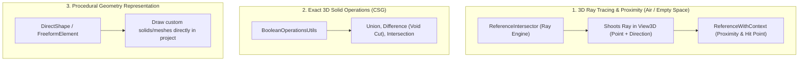
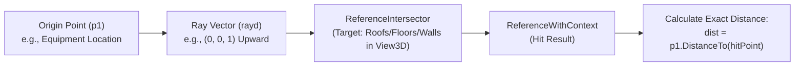

# Module 21 — Geometry Advanced

> [!IMPORTANT]
> **Implementation Note & Roadmap for Module 21:**
> When implementing the commands for this module, ensure comprehensive coverage of:
> 1. **3D Ray Casting & Proximity Analysis:** `ReferenceIntersector`, `ReferenceWithContext`, `FindReferenceTarget`, `Reference.GlobalPoint`.
> 2. **Solid Boolean Operations:** `BooleanOperationsUtils.ExecuteBooleanOperation` (Union, Difference, Intersect).
> 3. **Computational Geometry & Tessellation:** `SolidUtils`, `Face.Project()`, `Curve.Distance()`, `Mesh`, `Triangulation`.
> 4. **DirectShape Creation:** `DirectShape.CreateElement(doc, categoryId)` for in-memory procedural geometry representation.

---

## 1. Module Overview & Mental Model

While **Module 03 (Geometry)** covers foundational geometry inspection (extracting solids, faces, and curves) and **Module 15 (Filters)** handles database-wide collision queries, **Module 21 (Geometry Advanced)** focuses on **3D computational space analysis, ray casting, solid booleans, and procedural geometry**.



---

## 2. Spotlight: 3D Ray Casting with `ReferenceIntersector`

`ReferenceIntersector` is Revit's built-in 3D ray-tracing engine. It allows you to cast a mathematical ray from an origin point along a direction vector inside a `View3D` to measure distances and project points toward non-touching elements.



### Core Ray Casting Code Recipe:

```csharp
// 1. Retrieve Origin Point from Picked Element
LocationPoint locP = ele.Location as LocationPoint;
XYZ p1 = locP.Point;

// 2. Define Ray Direction (e.g., Upward along +Z axis)
XYZ rayd = new XYZ(0, 0, 1);

// 3. Build Category Filter (target only Roofs, Ceilings, or Floors)
ElementCategoryFilter roofFilter = new ElementCategoryFilter(BuiltInCategory.OST_Roofs);

// 4. Initialize ReferenceIntersector in a 3D View
View3D view3d = doc.ActiveView as View3D;
ReferenceIntersector refIntersector = new ReferenceIntersector(
    roofFilter, 
    FindReferenceTarget.Face, 
    view3d);

// 5. Shoot Ray and Find Nearest Intersecting Surface
ReferenceWithContext refContext = refIntersector.FindNearest(p1, rayd);

if (refContext != null)
{
    // Retrieve geometric Reference and intersection point
    Reference hitRef = refContext.GetReference();
    XYZ intPoint = hitRef.GlobalPoint;
    
    // Calculate exact clearance distance through air
    double distanceFeet = p1.DistanceTo(intPoint);
    double distanceMeters = distanceFeet * 0.3048;

    TaskDialog.Show("Ray Casting Result", 
        $"Distance to roof: {distanceFeet:F2} ft ({distanceMeters:F2} m)\n" +
        $"Hit Point: ({intPoint.X:F1}, {intPoint.Y:F1}, {intPoint.Z:F1})");
}
```

---

## 3. Reference-Related Classes & Types Master Catalog

The Revit API uses several classes prefixed with `Reference`. Here is their exact role and module mapping:

| Class / Enum Name | Type | Purpose & Description | Belongs To Module |
| :--- | :--- | :--- | :--- |
| **`ReferenceIntersector`** | Ray Engine | Casts 3D rays through a 3D view to find piercing intersections with geometry faces, edges, or elements. | **`21 Geometry Advanced`** |
| **`ReferenceWithContext`** | Result Wrapper | The object returned by `ReferenceIntersector`. Contains the hit `Reference`, `Proximity` (ray distance), and link instance transform. | **`21 Geometry Advanced`** |
| **`FindReferenceTarget`** | Enum | Filter options for `ReferenceIntersector` (`Face`, `Edge`, `Curve`, `Mesh`, `Element`, `All`). | **`21 Geometry Advanced`** |
| **`Reference`** | Geometric Handle | A persistent, stable reference handle pointing to an Element, Face, Edge, or Curve. Stores `ElementId` and `GlobalPoint`. | **`01 Selection`** & **`03 Geometry`** |
| **`ReferenceArray`** | Collection | An array of `Reference` objects required when creating Dimensions (`doc.Create.NewDimension`). | **`04 ModelCreation`** |
| **`ReferencePlane`** | Datum Plane | An unbounded construction plane used for family modeling and face-based family hosting. | **`04 ModelCreation`** & **`09 Families`** |
| **`ReferencePoint`** | 3D Point | Adaptive placement point used in conceptual massing and adaptive component families. | **`09 Families`** & **`22 Model Creation Advanced`** |

---

## 4. Module 15 vs. Module 21: Collision vs. Ray Tracing

| Aspect | **Module 15: Filters & Advanced Collection** | **Module 21: Geometry Advanced** |
| :--- | :--- | :--- |
| **Primary Tool** | `FilteredElementCollector` + `ElementIntersects...` | `ReferenceIntersector` + `BooleanOperationsUtils` |
| **Medium Analyzed** | Solid mass / Physical volume overlap | Empty space / Air / Line of sight / Proximity |
| **Touch Requirement** | Elements must **physically touch/collide** (or penetrate expanded clearance solid). | Elements **do NOT touch**; measures distance through air. |
| **Execution Scope** | Whole document database query | 3D View visual ray casting |
| **Key Use Cases** | Hard clash detection (Pipe vs Beam, Duct vs Wall). | Ceiling height above sprinkler, room clearance, egress line-of-sight. |

---

## 5. Planned Commands for Module 21

* [ ] `01` — **RayCastDistanceToHostCommand**: Measure vertical clearance to Roofs, Floors, or Ceilings using `ReferenceIntersector`.
* [ ] `02` — **MultiTargetRayCastCommand**: Cast rays in multiple directions (360 degrees) to detect surrounding walls.
* [ ] `03` — **SolidBooleanUnionCommand**: Combine multiple overlapping solids into a single unified solid via `BooleanOperationsUtils`.
* [ ] `04` — **SolidBooleanDifferenceCommand**: Perform programmatic void cutting between interfering geometry solids.
* [ ] `05` — **CreateDirectShapeCommand**: Generate custom procedural geometry in the project using `DirectShape.CreateElement`.
