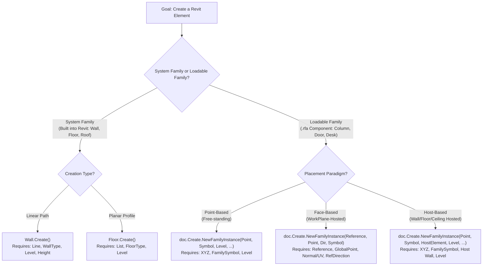
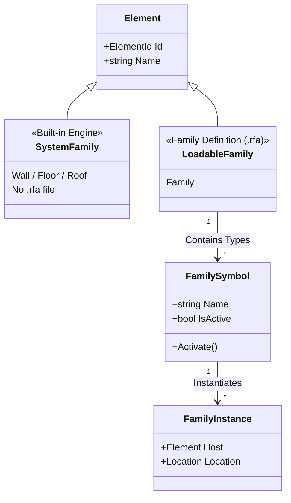
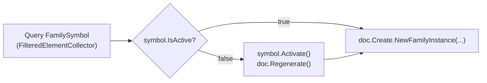
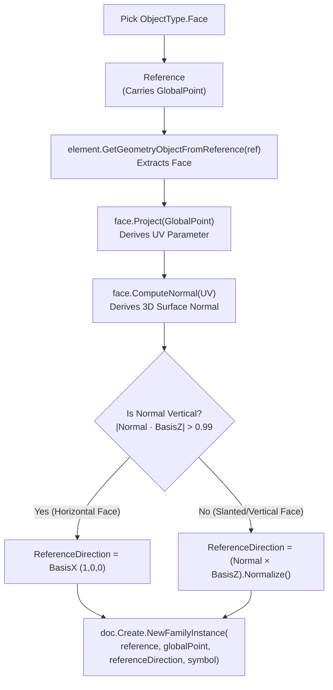
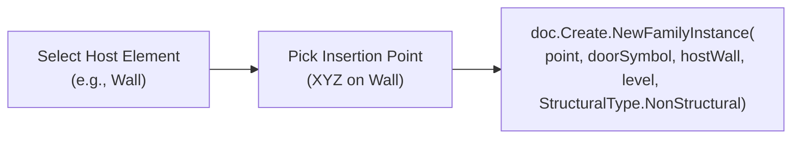
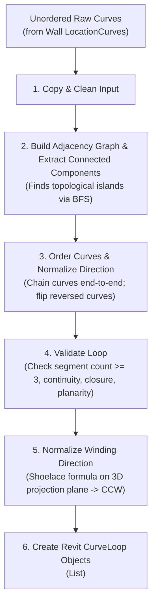
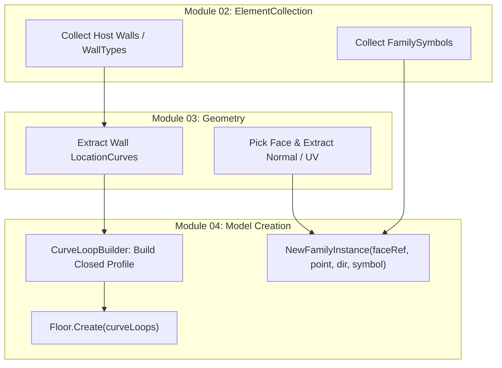

# Module 04 — Model Creation

Welcome to the **Model Creation** module documentation. This guide explains how to programmatically generate building elements in Revit using the Revit API in C#.

Rather than acting as a simple API reference, this document teaches you **how to think about element creation in Revit**, why different creation APIs exist, the fundamental distinction between System Families and Loadable Families, how vector math governs face-based placement, and how the custom `CurveLoopBuilder` algorithm handles complex boundary loops.

---

## 1. How to Think About This Module

Element creation in Revit is not uniform. You cannot create a Wall, a Floor, a Column, and a Door using the same API method because they belong to completely different **Family Paradigms**.



---

## 2. System Families vs. Loadable Families

Understanding the difference between System Families and Loadable Families is the single most important concept in Revit API creation.



### 1. System Families (`Wall.Create()`, `Floor.Create()`)
- **Definition**: Families built directly into Revit's core engine (e.g., Walls, Floors, Roofs, Ceilings, Stairs). They cannot be saved or loaded as external `.rfa` files.
- **API Mechanism**: Created using dedicated static factory methods on the element class itself (`Wall.Create()`, `Floor.Create()`).
- **Type Reference**: Uses `WallType` or `FloorType` (which derive directly from `ElementType`).

### 2. Loadable Families (`doc.Create.NewFamilyInstance()`)
- **Definition**: Component families created in the Revit Family Editor and saved as `.rfa` files (e.g., Columns, Doors, Windows, Furniture, Equipment).
- **API Mechanism**: Created using overloads of `doc.Create.NewFamilyInstance(...)`.
- **Type Reference**: Uses `FamilySymbol` (which derives from `ElementType`).

### Why `Wall.Create()` and `doc.Create.NewFamilyInstance()` Are Different

| Feature | System Families (e.g., Wall, Floor) | Loadable Families (e.g., Column, Door, Desk) |
| :--- | :--- | :--- |
| **Creation API** | `Wall.Create()`, `Floor.Create()` | `doc.Create.NewFamilyInstance(...)` |
| **Type Class** | `WallType`, `FloorType` | `FamilySymbol` |
| **Source** | Built-in Revit engine | External `.rfa` family file |
| **Symbol Activation Required?** | ❌ No (Always active) | ✅ Yes (`symbol.IsActive` check & `Activate()`) |
| **Host Requirement** | Defines its own structure | Varies (Free-standing, Face-based, Wall-hosted) |

---

## 3. The `FamilySymbol` Activation Lifecycle

Before creating an instance of a loadable family (`FamilySymbol`), you **must verify whether the symbol is active**.



> [!IMPORTANT]
> If a `FamilySymbol` has not been placed in the model yet during the current session, Revit keeps its geometric memory uninitialized. Calling `NewFamilyInstance()` on an inactive `FamilySymbol` without activating it first can throw a runtime exception or produce corrupt geometry.

```csharp
// Standard FamilySymbol Activation Pattern (Inside Transaction)
if (!familySymbol.IsActive)
{
    familySymbol.Activate();
    doc.Regenerate(); // Forces Revit database to update symbol geometry
}

// Proceed with instance creation
FamilyInstance instance = doc.Create.NewFamilyInstance(point, familySymbol, level, StructuralType.NonStructural);
```

---

## 4. The 8 Creation Patterns Demonstrated

The `Samples/ModelCreation/Commands/` folder demonstrates 8 distinct creation commands:

### Creation Pattern Summary Table

| Pattern | Command File | Target Element | Primary API Method |
| :--- | :--- | :--- | :--- |
| **1. Curve-Based (System)** | `CreateWallCommand.cs` | `Wall` | `Wall.Create(doc, line, wallTypeId, levelId, height, offset, flip, structural)` |
| **2. Point-Based Structural** | `CreateColumnCommand.cs` | `FamilyInstance` | `doc.Create.NewFamilyInstance(point, columnSymbol, level, StructuralType.Column)` |
| **3. Point-Based General** | `CreateFamilyInstanceCommand.cs` | `FamilyInstance` | `doc.Create.NewFamilyInstance(point, symbol, level, StructuralType.NonStructural)` |
| **4. Profile (2 Corners)** | `CreateFloorByRectangleCommand.cs` | `Floor` | `Floor.Create(doc, curveLoops, floorTypeId, levelId)` |
| **5. Profile (N Points)** | `CreateFloorByPickedPointsCommand.cs` | `Floor` | `Floor.Create(doc, curveLoops, floorTypeId, levelId)` |
| **6. Profile from Elements** | `CreateFloorFromWallsCommand.cs` | `Floor` | `CurveLoopBuilder.Build(curves)` $\rightarrow$ `Floor.Create(...)` |
| **7. Face-Based** | `CreateFaceBasedFamilyCommand.cs` | `FamilyInstance` | `doc.Create.NewFamilyInstance(reference, globalPoint, referenceDirection, familySymbol)` |
| **8. Host-Based** | `CreateHostedFamilyCommand.cs` | `FamilyInstance` | `doc.Create.NewFamilyInstance(point, doorSymbol, hostWall, level, StructuralType.NonStructural)` |

---

### Pattern 1: Curve-Based Creation (`CreateWallCommand.cs`)

Creates a linear system wall element between two 3D points:

```csharp
// 1. Pick start and end points
XYZ startPoint = uidoc.Selection.PickPoint("Pick wall start point");
XYZ endPoint = uidoc.Selection.PickPoint("Pick wall end point");

// 2. Build 3D Line
Line wallLine = Line.CreateBound(startPoint, endPoint);

// 3. Create Wall inside Transaction
using (Transaction tx = new Transaction(doc, "Create Wall"))
{
    tx.Start();
    Wall wall = Wall.Create(doc, wallLine, wallType.Id, level.Id, 10.0, 0.0, false, false);
    tx.Commit();
}
```

---

### Patterns 2 & 3: Point-Based Family Creation (`CreateColumnCommand.cs` & `CreateFamilyInstanceCommand.cs`)

Places a loadable family instance at a single 3D coordinate point:

```csharp
XYZ placementPoint = uidoc.Selection.PickPoint("Pick column location");

using (Transaction tx = new Transaction(doc, "Create Column"))
{
    tx.Start();
    
    // Ensure symbol activation
    if (!columnSymbol.IsActive)
    {
        columnSymbol.Activate();
        doc.Regenerate();
    }
    
    // Place Structural Column vs Non-Structural Family
    FamilyInstance column = doc.Create.NewFamilyInstance(
        placementPoint, 
        columnSymbol, 
        level, 
        StructuralType.Column);
        
    tx.Commit();
}
```

---

### Patterns 4 & 5: Profile/Sketch-Based Creation (`CreateFloorByRectangleCommand.cs` & `CreateFloorByPickedPointsCommand.cs`)

Creates planar system elements (Floors) from closed loops of curves (`CurveLoop`):

```csharp
// Build a 4-line rectangular CurveLoop
CurveLoop profile = new CurveLoop();
profile.Append(Line.CreateBound(p1, p2));
profile.Append(Line.CreateBound(p2, p3));
profile.Append(Line.CreateBound(p3, p4));
profile.Append(Line.CreateBound(p4, p1));

List<CurveLoop> curveLoops = new List<CurveLoop> { profile };

using (Transaction tx = new Transaction(doc, "Create Floor"))
{
    tx.Start();
    Floor floor = Floor.Create(doc, curveLoops, floorType.Id, level.Id);
    tx.Commit();
}
```

---

### Pattern 7: Face-Based Family Creation (`CreateFaceBasedFamilyCommand.cs`)

> [!IMPORTANT]
> Placing a face-based family requires deep vector mathematics to calculate surface normals and reference directions.



#### Detailed Math & Vector Breakdown

1. **`Reference.GlobalPoint`**: The exact 3D point in world coordinates where the user clicked on the face.
2. **`Face.Project(globalPoint)`**: Projects the 3D global point onto the face's 2D parametric surface, returning an `IntersectionResult` containing the `UV` point.
3. **`Face.ComputeNormal(uv)`**: 
   > [!CAUTION]
   > `ComputeNormal(uv)` calculates the outward unit normal vector at the specific `UV` coordinate on the face. It does **NOT** check if the face is parallel to global X/Y/Z axes!
4. **Dot Product (`normal.DotProduct(XYZ.BasisZ)`)**: Used to measure how close the face normal is to the global Z axis (vertical). If `|dotZ| > 0.99`, the face is horizontal (like a floor or roof).
5. **Cross Product (`normal.CrossProduct(XYZ.BasisZ)`)**: Used to compute a vector lying **on the face plane** that is perpendicular to both the face normal and the Z axis. This vector defines the **Reference Direction** (orientation/rotation) for placing the family instance.

```csharp
// Face-Based Creation Implementation Code
Reference faceRef = uidoc.Selection.PickObject(ObjectType.Face, "Select a face");
XYZ globalPoint = faceRef.GlobalPoint;

Element element = doc.GetElement(faceRef);
Face face = element.GetGeometryObjectFromReference(faceRef) as Face;

IntersectionResult projResult = face.Project(globalPoint);
UV uv = projResult.UVPoint;
XYZ normal = face.ComputeNormal(uv);

// Calculate orientation vector on the face
double dotZ = Math.Abs(normal.DotProduct(XYZ.BasisZ));
XYZ referenceDirection = (dotZ > 0.99) ? XYZ.BasisX : normal.CrossProduct(XYZ.BasisZ).Normalize();

using (Transaction tx = new Transaction(doc, "Create Face-Based Family"))
{
    tx.Start();
    if (!symbol.IsActive) { symbol.Activate(); doc.Regenerate(); }
    
    FamilyInstance instance = doc.Create.NewFamilyInstance(
        faceRef, 
        globalPoint, 
        referenceDirection, 
        symbol);
        
    tx.Commit();
}
```

---

### Pattern 8: Hosted Family Creation (`CreateHostedFamilyCommand.cs`)

Places a family that requires an explicit host element (e.g., a Door or Window hosted inside a Wall):



```csharp
Reference wallRef = uidoc.Selection.PickObject(ObjectType.Element, "Select host wall");
Wall hostWall = doc.GetElement(wallRef) as Wall;

XYZ insertionPoint = uidoc.Selection.PickPoint("Pick door location on wall");

using (Transaction tx = new Transaction(doc, "Create Door"))
{
    tx.Start();
    if (!doorSymbol.IsActive) { doorSymbol.Activate(); doc.Regenerate(); }
    
    FamilyInstance door = doc.Create.NewFamilyInstance(
        insertionPoint, 
        doorSymbol, 
        hostWall, 
        level, 
        StructuralType.NonStructural);
        
    tx.Commit();
}
```

---

## 5. The `CurveLoopBuilder` Algorithm (`Helpers/CurveLoopBuilder.cs`)

When creating floors from existing model elements (e.g., selecting surrounding walls in `CreateFloorFromWallsCommand.cs`), you receive an unordered, unoriented collection of raw `Curve` objects.

Revit's `Floor.Create()` requires a **validated, continuous, closed, counter-clockwise `CurveLoop`**. The custom `CurveLoopBuilder` class solves this complex topological problem using a graph-based algorithm.



### Algorithm Step Breakdown

1. **Graph-Based Connectivity & BFS Decomposition**:
   Models curve endpoints as nodes and curves as edges. Uses **Breadth-First Search (BFS)** to split disconnected wall groups into separate connected components. This allows detecting **multiple independent floor loops** automatically!
2. **Ordering & Direction Normalization**:
   Chains curves head-to-tail. If a curve points backward (`curve.GetEndPoint(1)` matches instead of `0`), it calls `curve.CreateReversed()` to flip the curve direction.
3. **Planarity & Closure Validation**:
   Verifies that the vertices lie on a single 3D plane (within $1.0 \times 10^{-6}$ tolerance) and that the end of the last curve meets the start of the first curve.
4. **3D Winding Direction Normalization (Shoelace Formula)**:
   Projects 3D curves onto their dominant coordinate plane ($XY$, $XZ$, or $YZ$) and calculates signed area using the Shoelace formula. If the area is negative (clockwise), it reverses the entire loop to ensure the required **counter-clockwise** winding.

---

## 6. Common Mistakes

> [!WARNING]
> Watch out for these critical model creation errors:

1. **Forgetting `Transaction.Start()` or `Transaction.Commit()`**:
   All model modification in Revit **must** occur inside an active `Transaction`.
2. **Forgetting `FamilySymbol.Activate()`**:
   Placing an unactivated `FamilySymbol` can crash Revit or produce unrendered elements. Always check `symbol.IsActive`.
3. **Confusing `Wall.Create()` with `NewFamilyInstance()`**:
   Trying to pass a `WallType` to `NewFamilyInstance()` or a `FamilySymbol` to `Wall.Create()`.
4. **Creating Open or Non-Planar `CurveLoop` Profiles**:
   Passing non-connecting lines or 3D twisted curves to `Floor.Create()`. Always validate loops using `CurveLoop.IsOpen()` and `CurveLoop.HasPlane()`.
5. **Degenerate Cross Product for Horizontal Faces**:
   In face-based creation, calculating `normal.CrossProduct(XYZ.BasisZ)` on a flat horizontal floor face results in `(0,0,0)` (since normal is parallel to Z). Always check `DotProduct(BasisZ)` first!
6. **Inconsistent Curve Directions in Custom Loops**:
   Appending curves to a `CurveLoop` where curve $B$ start does not match curve $A$ end.

---

## 7. Cross-Module Connections & Conceptual Pipeline

Here is how all three modules unite into a complete Revit API workflow:



---

## 8. Key Takeaways

- **System Families** (`Wall`, `Floor`) use static factory methods (`Wall.Create()`, `Floor.Create()`) and `WallType`/`FloorType`.
- **Loadable Families** (`Column`, `Door`, `Desk`) use `doc.Create.NewFamilyInstance()` and `FamilySymbol`.
- Always check `familySymbol.IsActive` and call `Activate()` + `doc.Regenerate()` inside a transaction before placing instances.
- Face-based family creation requires projecting the global point to `UV`, deriving `Face.ComputeNormal(uv)`, and using cross products to establish a planar reference direction.
- `CurveLoopBuilder` handles topological graph decomposition, curve reversal, planarity checks, and counter-clockwise winding normalization.

---

## 9. Where This Leads Next

Congratulations! You have covered the three core pillars of the Revit API:
- **ElementCollection**: Querying the database.
- **Geometry**: Analyzing 3D forms and surfaces.
- **Model Creation**: Generating new building elements.

With these foundations, you are ready to explore advanced Revit API topics such as **Parameter Manipulation**, **Transaction Groups & Sub-Transactions**, **Shared Parameters**, **Extensible Storage**, and **Custom User Interfaces (WPF / Dockable Panes)**!
