# Module 05 — Parameters

Welcome to the **Parameters Module** documentation for the Revit API. In Revit, Building Information Modeling (BIM) is fundamentally about the *Information* attached to 3D geometry. That information is represented, stored, validated, and queried through **Parameters**.

This guide is designed to teach you **how to reason about parameters in Revit API**, understand their lifecycle, master their internal storage and data schemas (`ForgeTypeId`), avoid silent data corruption bugs, and navigate the architectural boundary between **Project Documents** and **Family Documents**.

---

## 1. Parameter Module Overview

### What is a Parameter in the Revit API?
In Revit, an `Element` (such as a Wall, Window, View, or Material) is a database record. Attached to that record is a collection of key-value data containers known as `Parameter` objects.

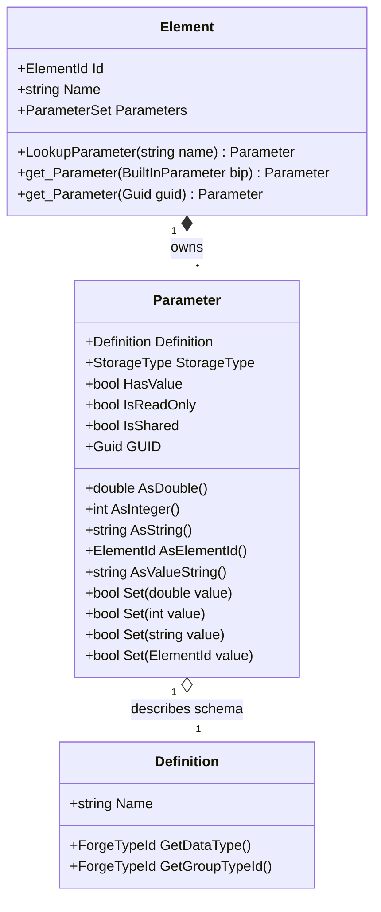

### Core Terminology & Mental Model

To master parameters, you must distinguish between these closely related concepts:

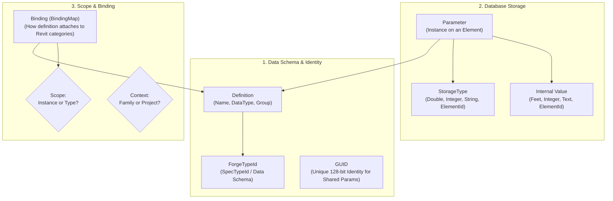

| Term | Meaning in Revit API | Example |
| :--- | :--- | :--- |
| **`Parameter`** | An individual data container instance attached to an `Element`. | Unconnected Height on Wall #12345 |
| **`Definition`** | The metadata schema describing what the parameter represents (name, data type, parameter group). | "Unconnected Height", Data Type = `SpecTypeId.Length` |
| **`StorageType`** | The raw low-level C++ database storage representation. | `StorageType.Double`, `StorageType.String` |
| **`DataType`** | The high-level semantic specification identifying the physical quantity or data schema (`ForgeTypeId`). | `SpecTypeId.Length`, `SpecTypeId.String.Text` |
| **`Value`** | The stored payload inside the parameter. | `9.842520` (Internal feet for a 3000 mm wall) |
| **`Binding`** | The rule associating a `Definition` with Revit `Category` objects in the project (`InstanceBinding` vs `TypeBinding`). | Bound to `OST_Walls` as an Instance parameter |
| **`BuiltInParameter`** | Hardcoded, native Revit parameters present across all Revit models with fixed enum IDs. | `BuiltInParameter.WALL_USER_HEIGHT_PARAM` |
| **`Project Parameter`** | A user- or project-level parameter bound across one or more categories in a specific Project Document. | "Project Phase Code" bound to all Walls and Columns |
| **`Shared Parameter`** | A globally identifiable parameter definition with a permanent GUID, defined in an external `.txt` file, usable across multiple families and projects. | "Manufacturer_Code" (GUID: `3f2504e0-...`) |
| **`Family Parameter`** | A parameter defined within a specific Family Document (`.rfa`) via `FamilyManager`, affecting only instances or types of that specific family. | "Panel_Thickness" inside a Door family |

---

## 2. Getting Parameters

Implemented in: [`GetElementParametersCommand.cs`](file:///f:/02-programming/06-%20Revit%20API/projects/RevitApiSamples/RevitApiSamples/Samples/Parameters/Commands/GetElementParametersCommand.cs)

### Accessing All Parameters on an Element
Every `Element` exposes a `Parameters` property which returns a `ParameterSet` (an enumerable collection of `Parameter` objects attached to that element).

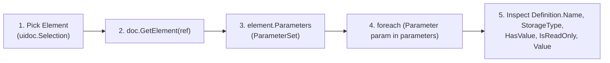

### When to Iterate `element.Parameters`
- **Diagnostic / Inspection Tools**: Building parameter explorers, model checkers, or auditing tools.
- **Export Engines**: Exporting full element data to JSON, XML, Excel, or external SQL databases.
- **Dynamic Property Grids**: Populating custom UI tables with all available parameters for user review.

```csharp
// Excerpt from GetElementParametersCommand.cs
ParameterSet parameters = element.Parameters;

foreach (Parameter parameter in parameters)
{
    string name = parameter.Definition?.Name ?? "Unnamed";
    StorageType storageType = parameter.StorageType;
    bool isReadOnly = parameter.IsReadOnly;
    bool hasValue = parameter.HasValue;
    
    // Read raw value using custom helper
    string value = ParameterValueHelper.GetParameterValue(parameter);
}
```

---

## 3. Finding a Parameter by Name

Implemented in: [`GetParameterByNameCommand.cs`](file:///f:/02-programming/06-%20Revit%20API/projects/RevitApiSamples/RevitApiSamples/Samples/Parameters/Commands/GetParameterByNameCommand.cs)

### `element.LookupParameter(string name)`
`LookupParameter` searches the element for a parameter matching the provided human-visible string name.

```csharp
// Excerpt from GetParameterByNameCommand.cs
string parameterName = "Width";
Parameter parameter = element.LookupParameter(parameterName);

if (parameter != null)
{
    string value = ParameterValueHelper.GetParameterValue(parameter);
}
```

### The Pitfalls of Name-Based Lookup

> [!WARNING]
> While `LookupParameter("Name")` is convenient for quick scripts, **relying on parameter names in production add-ins is risky and error-prone**:
> 1. **Non-Unique Names**: Multiple parameters with identical names can coexist on the same element (e.g., a BuiltIn "Comments" and a Shared Parameter named "Comments"). `LookupParameter` returns an arbitrary match!
> 2. **Language / Localization Differences**: In French Revit, "Width" is "Largeur"; in German, "Breite". A script searching for `"Width"` will fail immediately in localized Revit versions.
> 3. **Renaming**: Project parameters can be renamed by BIM managers at any time, breaking hardcoded strings.

### Lookup Strategies Compared

| Strategy | API Call | Stability | Multi-Language Safe? | Handles Duplicate Names? |
| :--- | :--- | :--- | :--- | :--- |
| **Name Lookup** | `element.LookupParameter("Width")` | ⚠️ Low | ❌ No | ❌ No (returns first match) |
| **Built-in Enum** | `element.get_Parameter(BuiltInParameter.WALL_ATTR_WIDTH_PARAM)` | 🛡️ Maximum | ✅ Yes | ✅ Yes (fixed internal enum ID) |
| **Shared GUID** | `element.get_Parameter(new Guid("..."))` | 🛡️ Maximum | ✅ Yes | ✅ Yes (universally unique 128-bit GUID) |

---

## 4. Built-in Parameters

Implemented in: [`GetBuiltInParameterCommand.cs`](file:///f:/02-programming/06-%20Revit%20API/projects/RevitApiSamples/RevitApiSamples/Samples/Parameters/Commands/GetBuiltInParameterCommand.cs)

### `element.get_Parameter(BuiltInParameter)`
When interacting with native Revit parameters (e.g., Wall Height, Mark, Comments, Area, Volume, Base Offset), always use the `BuiltInParameter` enumeration via `get_Parameter()`.

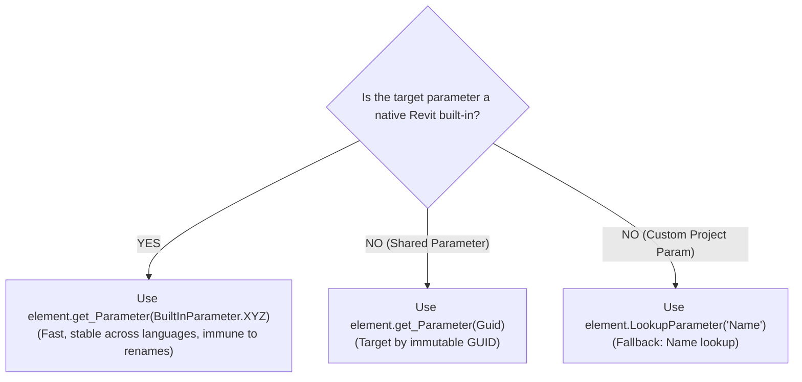

```csharp
// Excerpt from GetBuiltInParameterCommand.cs
Parameter parameter = wall.get_Parameter(BuiltInParameter.WALL_USER_HEIGHT_PARAM);

if (parameter != null)
{
    string value = ParameterValueHelper.GetParameterValue(parameter);
    // Returns internal double (feet) or formatted value string
}
```

---

## 5. Reading and Writing Parameter Values

Implemented in: [`SetParameterCommand.cs`](file:///f:/02-programming/06-%20Revit%20API/projects/RevitApiSamples/RevitApiSamples/Samples/Parameters/Commands/SetParameterCommand.cs)

### Read vs. Write Lifecycle

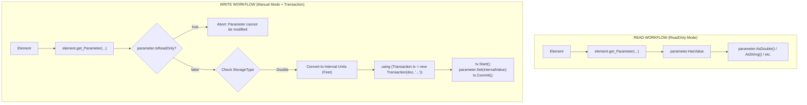

### Pre-requisites Before Calling `Parameter.Set()`
Before writing to a parameter, always verify three conditions:
1. **Null Check**: Ensure `parameter != null`.
2. **`IsReadOnly`**: If `parameter.IsReadOnly == true`, Revit will reject modifications (e.g., calculated parameters like Wall Area or family-locked formulas).
3. **`StorageType` & Units**: Ensure you pass the correct data type in Revit's **internal units** (e.g., Feet for length, Radians for angles).

```csharp
// Excerpt from SetParameterCommand.cs
Parameter heightParameter = wall.get_Parameter(BuiltInParameter.WALL_USER_HEIGHT_PARAM);

if (heightParameter == null || heightParameter.IsReadOnly)
    return Result.Failed;

if (heightParameter.StorageType != StorageType.Double)
    return Result.Failed;

// Convert user meters to internal feet
double heightInMeters = 3.0;
double heightInternal = UnitUtils.ConvertToInternalUnits(heightInMeters, UnitTypeId.Meters);

// Modification MUST be encapsulated in a Transaction
using (Transaction transaction = new Transaction(doc, "Set Wall Height"))
{
    transaction.Start();
    heightParameter.Set(heightInternal); // Writes 9.842520 ft
    transaction.Commit();
}
```

---

## 6. Storage Type

Implemented across all commands and helper: [`ParameterValueHelper.cs`](file:///f:/02-programming/06-%20Revit%20API/projects/RevitApiSamples/RevitApiSamples/Samples/Parameters/Helper/ParameterValueHelper.cs)

### The 4 Database Storage Types
In Revit's internal database, every parameter stores its value in one of 4 primitive storage formats (`StorageType` enum):

| `StorageType` | Meaning / Data Stored | Read API Method | Write API Method | Common Parameters |
| :--- | :--- | :--- | :--- | :--- |
| **`StorageType.Double`** | 64-bit floating point number (always in internal units: ft, rad, ft², ft³) | `parameter.AsDouble()` | `parameter.Set(double)` | Length, Width, Height, Area, Volume, Angle, Cost |
| **`StorageType.Integer`** | 32-bit signed integer or Boolean (0 = False/No, 1 = True/Yes), or Enum indices | `parameter.AsInteger()` | `parameter.Set(int)` | Structural (Yes/No), Phase Created, Room Number (if int), Key schedules |
| **`StorageType.String`** | Unicode text string | `parameter.AsString()` | `parameter.Set(string)` | Comments, Mark, Type Name, Manufacturer, URL |
| **`StorageType.ElementId`** | Reference to another element in the database | `parameter.AsElementId()` | `parameter.Set(ElementId)` | Base Constraint (Level), Top Constraint, Material, Phase, View Template |
| **`StorageType.None`** | Parameter is uninitialized or invalid | *N/A* | *N/A* | Corrupted or unassigned parameters |

### The Universal Reader Pattern (`ParameterValueHelper.cs`)

```csharp
// Excerpt from ParameterValueHelper.cs
public static string GetParameterValue(Parameter parameter)
{
    if (!parameter.HasValue)
        return "<No Value>";

    switch (parameter.StorageType)
    {
        case StorageType.String:
            return parameter.AsString() ?? "<null>";

        case StorageType.Integer:
            return parameter.AsInteger().ToString();

        case StorageType.Double:
            return parameter.AsDouble().ToString("F3");

        case StorageType.ElementId:
            return parameter.AsElementId().ToString();

        case StorageType.None:
            return "<None>";

        default:
            return "<Unknown>";
    }
}
```

---

## 7. `AsDouble()` vs. `AsString()` vs. `AsValueString()`

> [!CRITICAL]
> One of the most frequent sources of bugs in Revit API development is confusing these three methods:

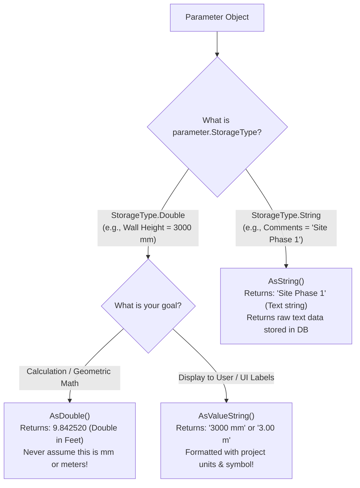

### Detailed Method Comparison

| Method | Target `StorageType` | Return Type | Unit Handling | Typical Use Case | Example on 3000mm Wall Height |
| :--- | :--- | :--- | :--- | :--- | :--- |
| **`AsDouble()`** | `StorageType.Double` | `double` | Raw **Internal Units** (Feet) | Math, geometry, engineering calculations, CAD export | `9.842519685` |
| **`AsValueString()`** | `StorageType.Double` / `Integer` | `string` | Formatted per **Project Units** | UI dialogs, WPF labels, user reports | `"3000 mm"` or `"3.00 m"` |
| **`AsString()`** | `StorageType.String` | `string` | Raw text | Reading text fields (Comments, Mark) | `null` (throws null on Double params!) |
| **`AsInteger()`** | `StorageType.Integer` | `int` | Raw integer / Boolean | Yes/No checks, enum switches | `0` or `1` |
| **`AsElementId()`** | `StorageType.ElementId` | `ElementId` | Database Id | Level lookups, material queries | `ElementId(34120)` |

### Practical Summary
- **`AsDouble()` $\rightarrow$ Math & DB Operations**: Returns internal double. Always convert via `UnitUtils.ConvertFromInternalUnits()` if user-facing units are needed.
- **`AsValueString()` $\rightarrow$ UI Display**: Returns project-formatted string complete with unit suffix and rounding.
- **`AsString()` $\rightarrow$ Text Parameters**: Only works on parameters whose `StorageType == StorageType.String`. Calling `AsString()` on a numeric parameter returns `null`!

---

## 8. Instance vs. Type Parameters

Implemented in: [`InstanceVsTypeParameterCommand.cs`](file:///f:/02-programming/06-%20Revit%20API/projects/RevitApiSamples/RevitApiSamples/Samples/Parameters/Commands/InstanceVsTypeParameterCommand.cs)

### Conceptual Model
Revit strictly separates element instances from their shared type definitions:

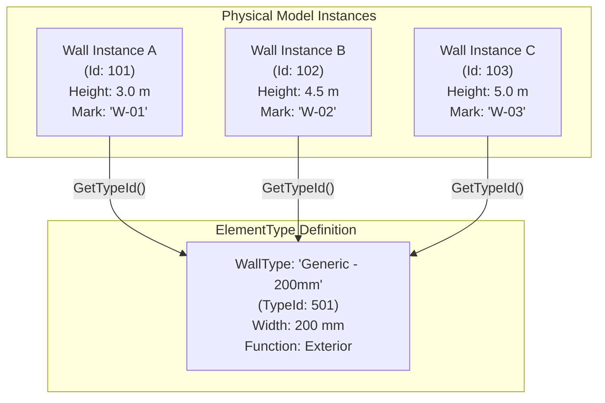

- **Instance Parameter**: Owned by a specific physical element. Modifying Wall A's height does **NOT** affect Wall B or Wall C.
- **Type Parameter**: Owned by the `ElementType` (`WallType`, `FamilySymbol`). Modifying the type's width immediately changes the width of **ALL** walls using that type across the entire project!

### Code Comparison: Accessing Instance vs. Type Parameters

```csharp
// Excerpt from InstanceVsTypeParameterCommand.cs

// 1. Read Instance Parameter from Wall
Parameter instanceParameter = wall.get_Parameter(BuiltInParameter.WALL_USER_HEIGHT_PARAM);
string instanceValue = instanceParameter.AsValueString(); // e.g., "3000 mm"

// 2. Navigate from Instance to ElementType via GetTypeId()
ElementId typeId = wall.GetTypeId();
WallType wallType = doc.GetElement(typeId) as WallType;

// 3. Read Type Parameter from WallType
Parameter typeParameter = wallType.get_Parameter(BuiltInParameter.WALL_ATTR_WIDTH_PARAM);
string typeValue = typeParameter.AsValueString(); // e.g., "200 mm"
```

---

## 9. Shared Parameters

Implemented in: [`SharedParameterCommand.cs`](file:///f:/02-programming/06-%20Revit%20API/projects/RevitApiSamples/RevitApiSamples/Samples/Parameters/Commands/SharedParameterCommand.cs)

### What is a Shared Parameter?
A **Shared Parameter** is a parameter definition stored in an external shared parameters text file (`.txt`) and identified by a **Globally Unique Identifier (GUID)**.

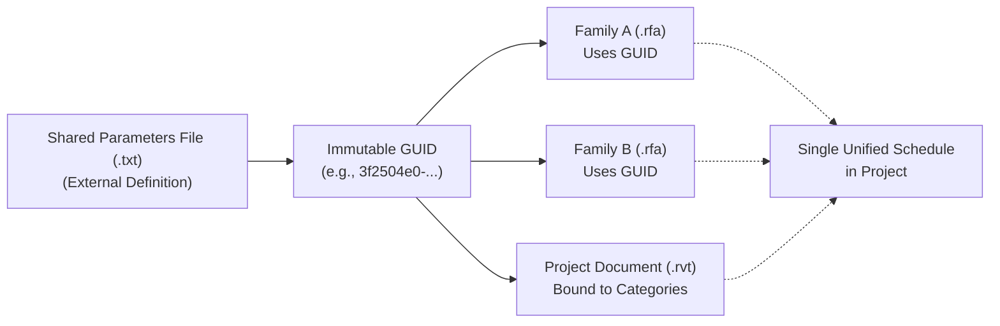

### Why GUID Matters: Identity vs. Name
In Revit, two parameters can share the exact same visible name (e.g., `"Manufacturer"`), but if they have different GUIDs, Revit treats them as completely separate, incompatible parameters.

- **Name**: User-facing label (changeable, non-unique).
- **GUID**: Immutable 128-bit unique identifier.

> [!KEY]
> For a parameter to appear in multi-category schedules or tag families across different files, it **must** be a Shared Parameter with a matching GUID.

```csharp
// Excerpt from SharedParameterCommand.cs
foreach (Parameter parameter in element.Parameters)
{
    if (!parameter.IsShared)
        continue;

    // Retrieve unique Shared Parameter GUID
    Guid guid = parameter.GUID;
    string name = parameter.Definition.Name;
    string value = ParameterValueHelper.GetParameterValue(parameter);
}
```

---

## 10. Project Parameters & Parameter Bindings

Implemented in: [`ProjectParameterBindingsCommand.cs`](file:///f:/02-programming/06-%20Revit%20API/projects/RevitApiSamples/RevitApiSamples/Samples/Parameters/Commands/ProjectParameterBindingsCommand.cs)

### How Project Parameters Attach to Categories
A **Project Parameter** does not float freely; it is bound to one or more Revit `Category` objects in the project via the document's `ParameterBindings` (`BindingMap`).

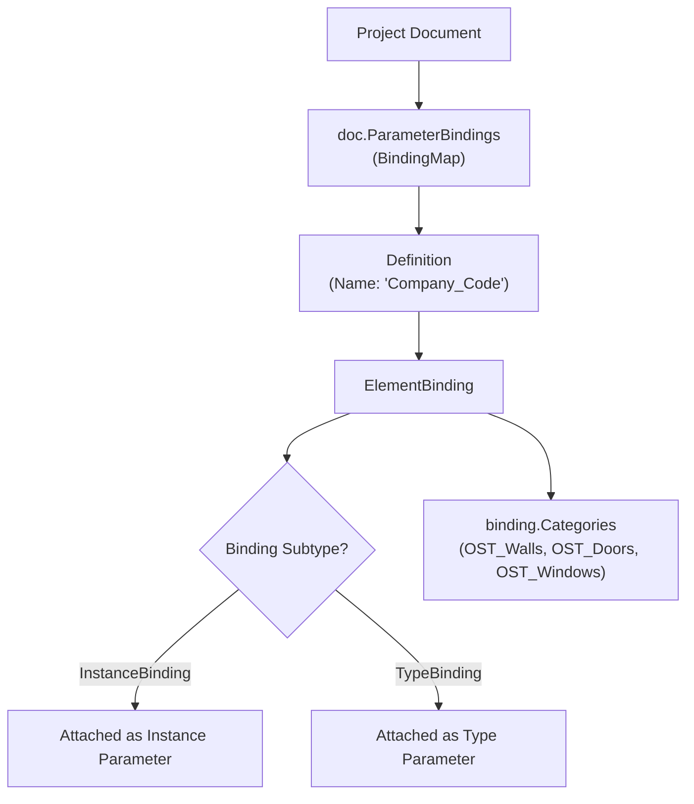

- **`InstanceBinding`**: Adds the parameter to every placed instance of the bound categories.
- **`TypeBinding`**: Adds the parameter to the `ElementType` definitions of the bound categories.

---

## 11. Why `BindingMap` Uses an Iterator

Implemented in: [`ProjectParameterBindingsCommand.cs`](file:///f:/02-programming/06-%20Revit%20API/projects/RevitApiSamples/RevitApiSamples/Samples/Parameters/Commands/ProjectParameterBindingsCommand.cs)

### The `BindingMap` Map Architecture
`doc.ParameterBindings` returns a `BindingMap`, which is a map collection mapping `Definition` (Key) to `ElementBinding` (Value). Because `BindingMap` does not implement standard .NET `IEnumerable<T>`, you must traverse it using a `DefinitionBindingMapIterator`:

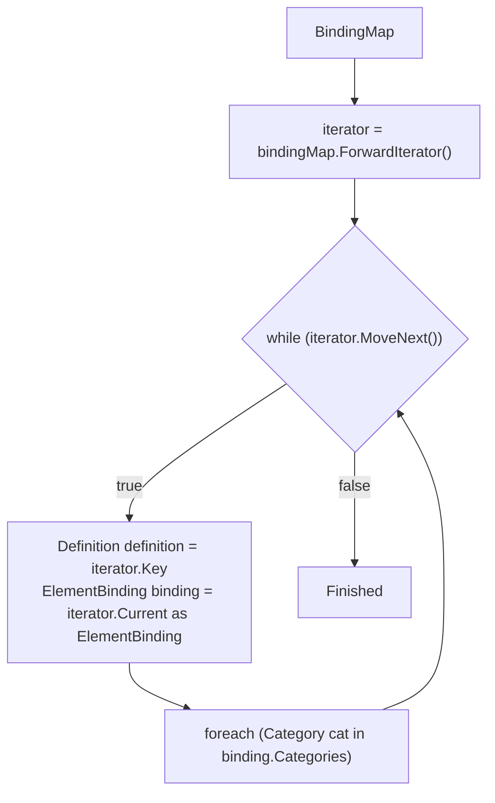

```csharp
// Excerpt from ProjectParameterBindingsCommand.cs
BindingMap bindingMap = doc.ParameterBindings;
DefinitionBindingMapIterator iterator = bindingMap.ForwardIterator();

while (iterator.MoveNext())
{
    // Key is the parameter Definition
    Definition definition = iterator.Key;

    // Current is the ElementBinding
    ElementBinding binding = iterator.Current as ElementBinding;

    if (definition == null || binding == null)
        continue;

    bool isInstance = binding is InstanceBinding;
    
    // Inspect all categories bound to this parameter
    foreach (Category category in binding.Categories)
    {
        string catName = category.Name;
    }
}
```

---

## 12. Project Parameter vs. Shared Parameter

> [!IMPORTANT]
> **Project Parameter** and **Shared Parameter** are NOT mutually exclusive concepts!

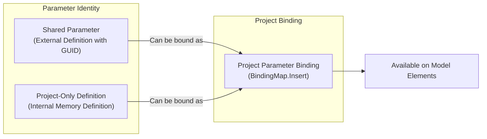

### Conceptual Distinction Table

| Dimension | Shared Parameter | Project Parameter |
| :--- | :--- | :--- |
| **Core Question Answered** | *"What is the parameter's global identity and schema?"* | *"Where and how is the parameter attached in this project?"* |
| **Storage Location** | External `.txt` file (until bound or loaded) | Project database (`.rvt`) |
| **Identity Mechanism** | 128-bit `GUID` | Parameter `Definition` + `BindingMap` |
| **Schedulable in Family?** | ✅ Yes | ❌ No (lives only in project) |
| **Taggable across files?** | ✅ Yes | ❌ No |
| **Multi-Category Binding?** | ✅ Yes (when bound to project) | ✅ Yes |

---

## 13. Family Parameters

Implemented in: [`FamilyParametersCommand.cs`](file:///f:/02-programming/06-%20Revit%20API/projects/RevitApiSamples/RevitApiSamples/Samples/Parameters/Commands/FamilyParametersCommand.cs)

### The Fundamental Architectural Boundary
You **cannot** manage or inspect Family Parameters through a Project Document's `doc.ParameterBindings`. 

- In a **Project Document**: Parameters are managed via `doc.ParameterBindings` (`BindingMap`).
- In a **Family Document**: Parameters are managed via `familyDoc.FamilyManager` (`FamilyParameter`).

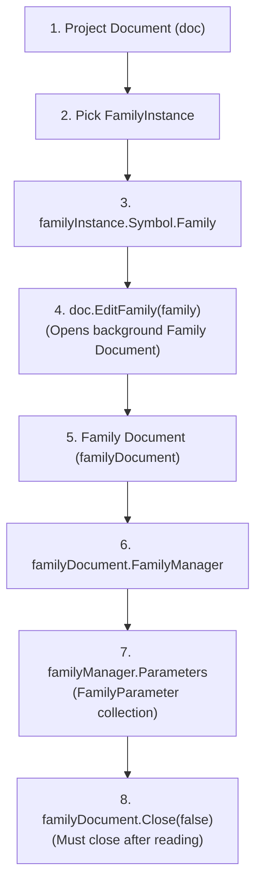

```csharp
// Excerpt from FamilyParametersCommand.cs
Family family = familyInstance.Symbol.Family;

// 1. Open Family in memory
Document familyDocument = doc.EditFamily(family);

try
{
    // 2. Access FamilyManager
    FamilyManager familyManager = familyDocument.FamilyManager;

    // 3. Inspect Family Parameters
    foreach (FamilyParameter parameter in familyManager.Parameters)
    {
        string name = parameter.Definition.Name;
        bool isInstance = parameter.IsInstance;
        StorageType storageType = parameter.StorageType;
        bool isShared = parameter.IsShared;
    }
}
finally
{
    // 4. Always close family document
    familyDocument.Close(false);
}
```

---

## 14. Project Document vs. Family Document

Understanding the dual-document architecture is essential for advanced Revit developers:

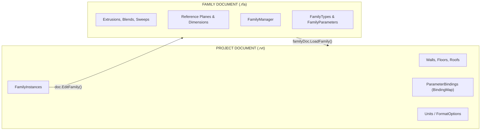

### Architectural Comparison

| Capability / API | Project Document (`.rvt`) | Family Document (`.rfa`) |
| :--- | :--- | :--- |
| **Root Document Class** | `Autodesk.Revit.DB.Document` | `Autodesk.Revit.DB.Document` (`doc.IsFamilyDocument == true`) |
| **Parameter Management API** | `doc.ParameterBindings` (`BindingMap`) | `doc.FamilyManager` |
| **Parameter Class** | `Autodesk.Revit.DB.Parameter` | `Autodesk.Revit.DB.FamilyParameter` |
| **Category Assignment** | Element-level categories (`OST_Walls`, etc.) | `doc.OwnerFamily.FamilyCategory` |
| **Adding New Parameters** | `doc.ParameterBindings.Insert(...)` | `familyManager.AddParameter(...)` |

---

## 15. Family Parameter Creation

Implemented in: [`CreateFamilyParameterCommand.cs`](file:///f:/02-programming/06-%20Revit%20API/projects/RevitApiSamples/RevitApiSamples/Samples/Parameters/Commands/CreateFamilyParameterCommand.cs)

### `FamilyManager.AddParameter(...)`
To create a parameter inside a family, you must open the family document and invoke `familyManager.AddParameter()` inside a `Transaction`.

```csharp
// Excerpt from CreateFamilyParameterCommand.cs
using (Transaction tx = new Transaction(familyDocument, "Create Family Parameter"))
{
    tx.Start();

    // AddParameter(name, groupTypeId, specTypeId, isInstance)
    FamilyParameter familyParameter = familyManager.AddParameter(
        "Company_Code",          // Parameter Name
        GroupTypeId.Data,        // Property Palette Group
        SpecTypeId.String.Text,  // Data Type (ForgeTypeId)
        true);                   // true = Instance Parameter, false = Type Parameter

    tx.Commit();
}
```

### Parameter Creation Comparison

| Feature | Family Parameter Creation | Shared Project Parameter Creation |
| :--- | :--- | :--- |
| **Target Document** | Family Document (`.rfa`) | Project Document (`.rvt`) |
| **Primary Method** | `familyManager.AddParameter(...)` | `doc.ParameterBindings.Insert(...)` |
| **Transaction Scope** | Bound to `familyDocument` | Bound to `projectDocument` |
| **Category Selection** | Automatic (applies to current family) | Requires explicit `CategorySet` |
| **External File Needed?** | ❌ No (unless creating shared family param) | ✅ Yes (Shared Parameter file `.txt`) |

---

## 16. Shared Project Parameter Creation

Implemented in: [`CreateSharedProjectParameterCommand.cs`](file:///f:/02-programming/06-%20Revit%20API/projects/RevitApiSamples/RevitApiSamples/Samples/Parameters/Commands/CreateSharedProjectParameterCommand.cs)

### Complete 6-Step Creation Pipeline

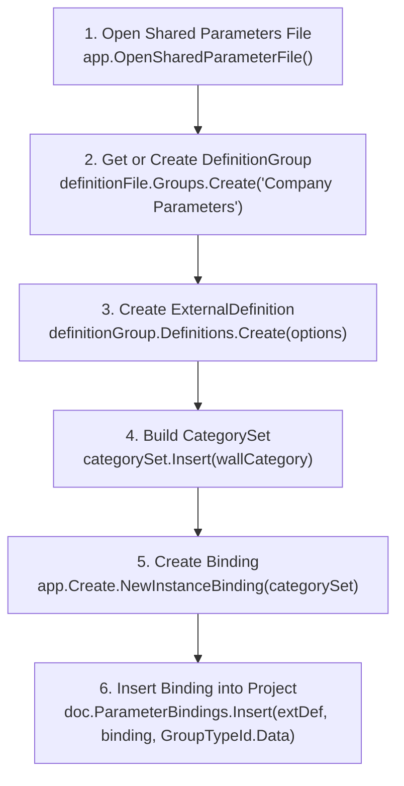

### Step-by-Step Code Walkthrough

```csharp
// Excerpt from CreateSharedProjectParameterCommand.cs

// 1. Open Shared Parameter File
DefinitionFile definitionFile = app.OpenSharedParameterFile();

// 2. Get or Create Group
DefinitionGroup definitionGroup = definitionFile.Groups.get_Item("Company Parameters") 
                               ?? definitionFile.Groups.Create("Company Parameters");

// 3. Create External Definition
ExternalDefinitionCreationOptions options = new ExternalDefinitionCreationOptions(
    "Company_Code",
    SpecTypeId.String.Text)
{
    Description = "Company project identification code.",
    UserModifiable = true
};
ExternalDefinition externalDef = definitionGroup.Definitions.Create(options) as ExternalDefinition;

// 4. Create CategorySet
Category wallCategory = Category.GetCategory(doc, BuiltInCategory.OST_Walls);
CategorySet categorySet = app.Create.NewCategorySet();
categorySet.Insert(wallCategory);

// 5. Create Instance or Type Binding
InstanceBinding binding = app.Create.NewInstanceBinding(categorySet);

// 6. Bind to Project in Transaction
using (Transaction tx = new Transaction(doc, "Create Shared Project Parameter"))
{
    tx.Start();
    bool success = doc.ParameterBindings.Insert(
        externalDef,
        binding,
        GroupTypeId.Data);
    tx.Commit();
}
```

---

## 17. The Shared Parameters File

### Architecture & File Handling
The Shared Parameters File is a tab-delimited text file managed by Revit.

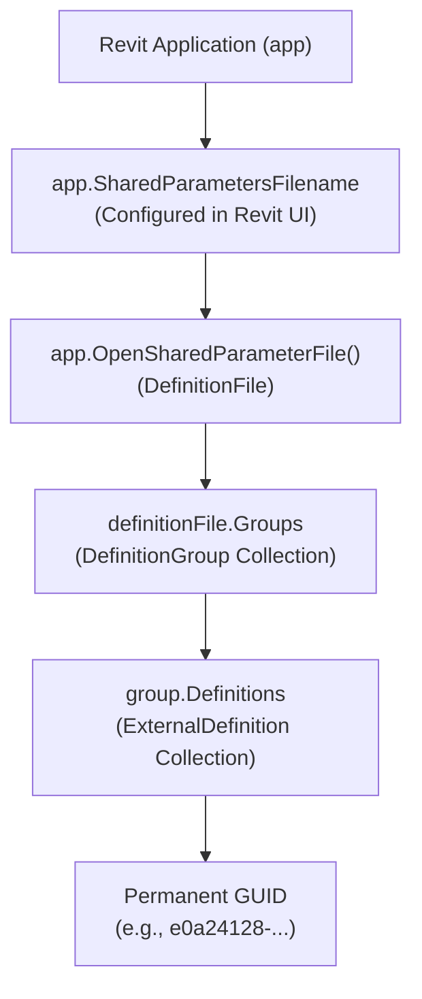

> [!CAUTION]
> **Never manually edit or construct raw Shared Parameter `.txt` files in code!**
> Always use the Revit API (`OpenSharedParameterFile()`, `Groups.Create()`, `Definitions.Create()`) to guarantee file formatting and GUID integrity.

---

## 18. Parameter Definition & Data Type Schema

Implemented in: [`ParameterDefinitionCommand.cs`](file:///f:/02-programming/06-%20Revit%20API/projects/RevitApiSamples/RevitApiSamples/Samples/Parameters/Commands/ParameterDefinitionCommand.cs)

### Definition vs. Parameter

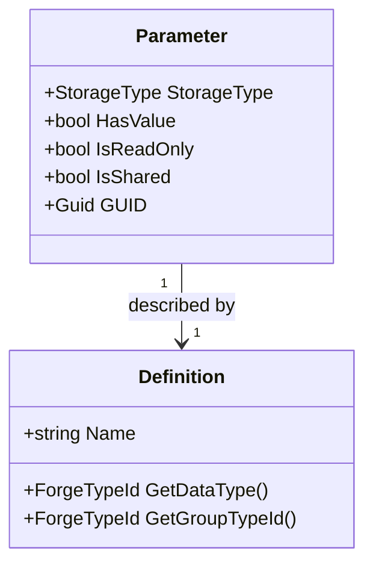

- **`Parameter`**: The runtime object holding the actual data value on an element.
- **`Definition`**: The schema describing the parameter's name, data type (`ForgeTypeId`), and UI group.

```csharp
// Excerpt from ParameterDefinitionCommand.cs
Definition definition = parameter.Definition;
string name = definition.Name;
ForgeTypeId dataType = definition.GetDataType();

bool isMeasurable = UnitUtils.IsMeasurableSpec(dataType);
```

---

## 19. Modern Schema Identifiers: `ForgeTypeId`

### `ForgeTypeId` is NOT Just a Unit ID!
In Revit 2021+, legacy enums (`ParameterType`, `UnitType`, `DisplayUnitType`) were superseded by **`ForgeTypeId`**.

`ForgeTypeId` is a universal string-based identifier representing:
1. **Specs (Data Schemas)**: `SpecTypeId.Length`, `SpecTypeId.Area`, `SpecTypeId.String.Text`
2. **Units**: `UnitTypeId.Meters`, `UnitTypeId.Feet`, `UnitTypeId.Millimeters`
3. **Parameter Groups**: `GroupTypeId.Data`, `GroupTypeId.Geometry`, `GroupTypeId.IdentityData`
4. **Symbols**: `SymbolTypeId.Meter`, `SymbolTypeId.Degree`

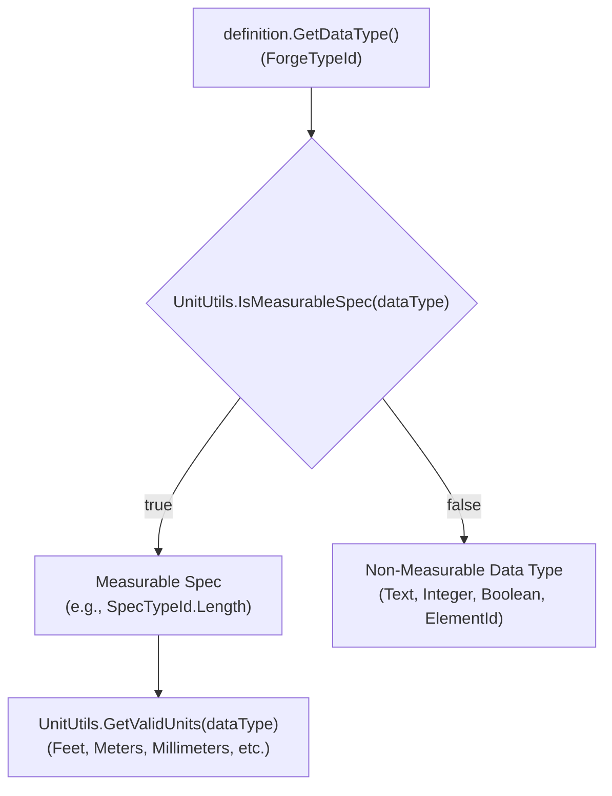

*(For a deep dive on unit conversions, see the [Units Module Guide](file:///f:/02-programming/06-%20Revit%20API/projects/RevitApiSamples/RevitApiSamples/Samples/Units/Units.md)).*

---

## 20. The Parameter Inspector

Implemented in: [`ParameterInspectorCommand.cs`](file:///f:/02-programming/06-%20Revit%20API/projects/RevitApiSamples/RevitApiSamples/Samples/Parameters/Commands/ParameterInspectorCommand.cs)

`ParameterInspectorCommand` serves as the diagnostic master tool for the Parameters module. It performs a comprehensive audit of any element selected in the model:

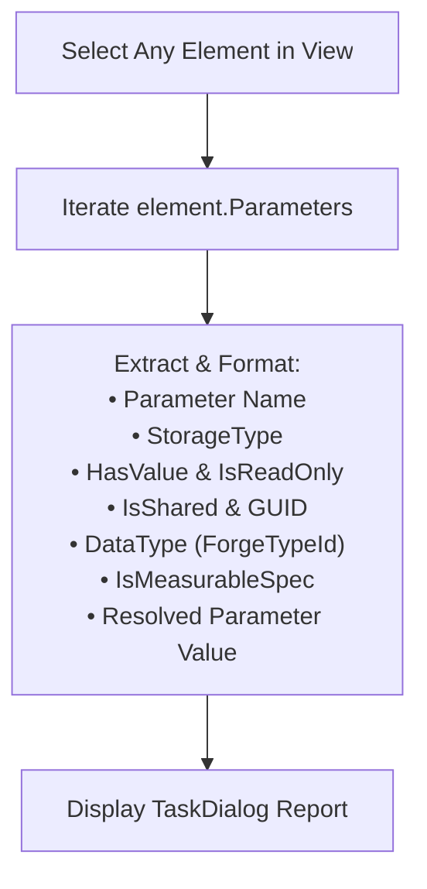

---

## 21. Parameter Creation Architecture Comparison

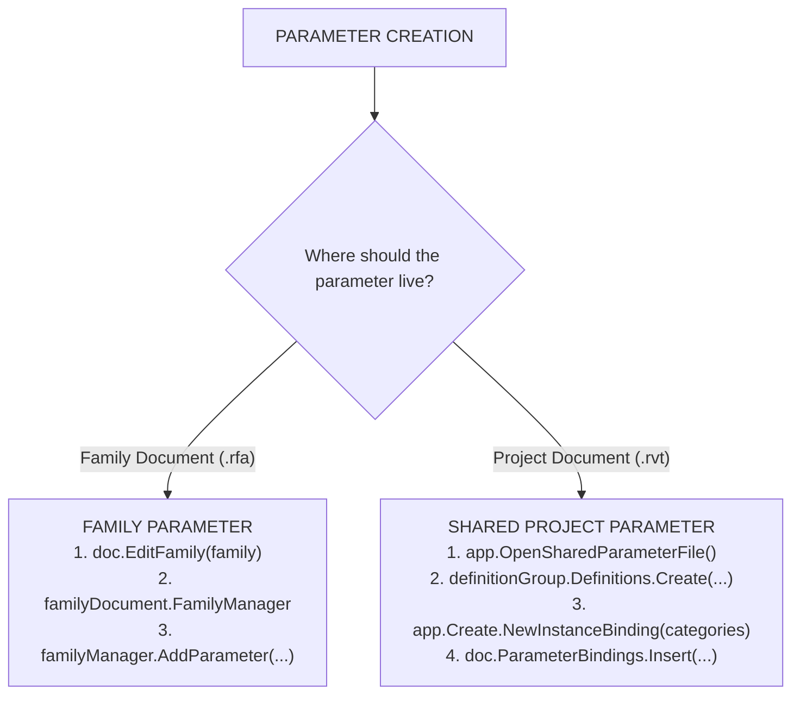

---

## 22. Practical Decision Tree: "How to Work with Parameters"

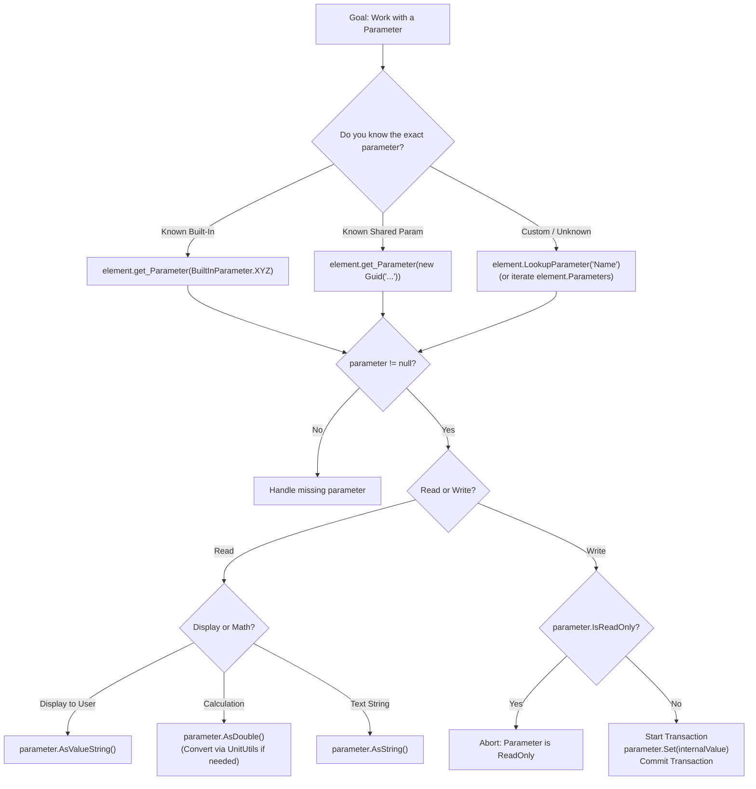

---

## 23. Common Mistakes & Best Practices

| # | Mistake | Wrong Mental Model | Correct Mental Model & API Fix |
| :--- | :--- | :--- | :--- |
| **1** | **Assuming parameter names are unique** | *"If I call `LookupParameter('Length')`, it will always get the right parameter."* | Multiple parameters can share names. Use `BuiltInParameter` or `Guid` for unambiguous identity. |
| **2** | **Assuming Shared Parameter == Project Parameter** | *"Shared and Project parameters are the same thing."* | Shared Parameters are reusable **definitions** (with GUIDs); Project Parameters are **bindings** to categories in a project. |
| **3** | **Assuming all parameters are Instance parameters** | *"I can read wall width directly from `wall.get_Parameter()`."* | Width is a **Type** parameter. Get it from `wallType.get_Parameter()`. |
| **4** | **Treating `AsDouble()` as meters or mm** | *"The project is set to metric, so `AsDouble()` returns millimeters."* | `AsDouble()` **always** returns internal units (Feet). Convert with `UnitUtils`. |
| **5** | **Using `AsString()` on numeric parameters** | *"I'll use `param.AsString()` to get the text of a length parameter."* | `AsString()` returns `null` on Double parameters! Use `AsValueString()`. |
| **6** | **Using `AsValueString()` for calculations** | *"I'll parse `param.AsValueString()` to do geometry math."* | `AsValueString()` contains localized strings (`'3000 mm'`). Use `AsDouble()`. |
| **7** | **Modifying parameters without a Transaction** | *"I can just call `parameter.Set(5.0)` anywhere."* | Revit DB modifications **must** occur inside an active `Transaction`. |
| **8** | **Modifying a read-only parameter** | *"I can force a value on Wall Area."* | Check `parameter.IsReadOnly` first. Calculated values cannot be set. |
| **9** | **Accessing Family Parameters via `ParameterBindings`** | *"I'll check `doc.ParameterBindings` to find family parameters."* | Family parameters only exist inside the `FamilyDocument.FamilyManager`. |
| **10** | **Forgetting to close `EditFamily()` documents** | *"I opened `doc.EditFamily()`, no need to close it."* | Always call `familyDoc.Close(false)` in a `finally` block to prevent memory leaks. |
| **11** | **Confusing `Definition` with `Parameter`** | *"The definition holds the height value."* | `Definition` holds schema metadata (name, type); `Parameter` holds the actual value. |
| **12** | **Treating `ForgeTypeId` as only a Unit ID** | *"ForgeTypeId only represents millimeters or meters."* | `ForgeTypeId` represents Specs, Units, Groups, and Symbols. |
| **13** | **Assuming name is Shared Parameter identity** | *"I created another Shared Parameter with the same name, so it matches."* | Identity is governed strictly by **GUID**, not name. |
| **14** | **Creating a definition without binding it** | *"I created an ExternalDefinition, so it's in the project."* | You must explicitly bind it via `doc.ParameterBindings.Insert()`. |
| **15** | **Calling `Insert()` on an existing binding** | *"I'll call `Insert()` to add another category to an existing parameter."* | `Insert()` will fail if a binding already exists. Use `ReInsert()` instead. |

---

## 24. Cross-Module Connection: Parameters & Units

The Parameters Module and [Units Module](file:///f:/02-programming/06-%20Revit%20API/projects/RevitApiSamples/RevitApiSamples/Samples/Units/Units.md) work in tandem:

```mermaid
flowchart TD
    Param["Parameter Object"] --> Def["Definition.GetDataType()"]
    Def --> ForgeTypeId["ForgeTypeId (Spec)"]
    ForgeTypeId --> CheckMeasurable{"UnitUtils.IsMeasurableSpec()"}
    CheckMeasurable -- "true" --> UnitsMod["Module 06: Units<br/>UnitUtils.GetValidUnits()"]
    
    Param --> AsDbl["Parameter.AsDouble()"]
    AsDbl --> InternalFeet["Internal Value (Feet)"]
    InternalFeet --> Convert["UnitUtils.ConvertFromInternalUnits()<br/>(Module 06: Units)"]
    Convert --> Metric["User Metric Value (Meters)"]
    
    Param --> AsValStr["Parameter.AsValueString()"]
    AsValStr --> Format["Project Units & FormatOptions<br/>(Module 06: Units)"]
    Format --> UIStr["User Formatted String ('3000 mm')"]
```

---

## 25. Complete Parameter Mental Model

```mermaid
flowchart TD
    Element["Revit Element"] --> ParamSet["Parameters (ParameterSet)"]
    ParamSet --> Param["Parameter Object"]
    
    Param --> Def["Definition"]
    Def --> DefName["Name (string)"]
    Def --> DataType["DataType (ForgeTypeId)"]
    DataType --> Spec["SpecTypeId (Length, Area, Text)"]
    
    Param --> Storage["StorageType"]
    Storage --> DoubleType["Double (Feet/Radians)"]
    Storage --> IntType["Integer (Int/Bool)"]
    Storage --> StrType["String (Text)"]
    Storage --> ElemIdType["ElementId (References)"]
    
    Param --> Flags["Flags"]
    Flags --> HasVal["HasValue (bool)"]
    Flags --> IsReadOnly["IsReadOnly (bool)"]
    Flags --> IsShared["IsShared (bool)"]
    IsShared --> GUID["GUID (128-bit)"]
    
    Param --> Origin["Origin / Scope"]
    Origin --> BuiltIn["BuiltInParameter (Native Revit)"]
    Origin --> ProjParam["Project Parameter (BindingMap -> Categories)"]
    Origin --> FamParam["Family Parameter (FamilyManager)"]
    Origin --> SharedParam["Shared Parameter (ExternalDefinition + GUID)"]
```

---

## 26. Sample Index

| # | Command File | Main Concept | Important APIs Used | Core Learning Objective |
| :--- | :--- | :--- | :--- | :--- |
| **01** | [`GetElementParametersCommand.cs`](file:///f:/02-programming/06-%20Revit%20API/projects/RevitApiSamples/RevitApiSamples/Samples/Parameters/Commands/GetElementParametersCommand.cs) | Element Parameter Enumeration | `element.Parameters`, `ParameterSet` | How to iterate all parameters on any element. |
| **02** | [`GetParameterByNameCommand.cs`](file:///f:/02-programming/06-%20Revit%20API/projects/RevitApiSamples/RevitApiSamples/Samples/Parameters/Commands/GetParameterByNameCommand.cs) | Name-Based Lookup | `element.LookupParameter(string)` | Finding parameters by visible name & understanding lookup risks. |
| **03** | [`GetBuiltInParameterCommand.cs`](file:///f:/02-programming/06-%20Revit%20API/projects/RevitApiSamples/RevitApiSamples/Samples/Parameters/Commands/GetBuiltInParameterCommand.cs) | Built-In Parameter Lookup | `element.get_Parameter(BuiltInParameter)` | Using language-safe enum IDs for native Revit parameters. |
| **04** | [`SetParameterCommand.cs`](file:///f:/02-programming/06-%20Revit%20API/projects/RevitApiSamples/RevitApiSamples/Samples/Parameters/Commands/SetParameterCommand.cs) | Modifying Parameters | `parameter.Set()`, `Transaction`, `UnitUtils` | Writing values safely with unit conversions inside transactions. |
| **05** | [`InstanceVsTypeParameterCommand.cs`](file:///f:/02-programming/06-%20Revit%20API/projects/RevitApiSamples/RevitApiSamples/Samples/Parameters/Commands/InstanceVsTypeParameterCommand.cs) | Instance vs. Type Scope | `element.GetTypeId()`, `ElementType` | Navigating from instance parameters to shared type parameters. |
| **06** | [`SharedParameterCommand.cs`](file:///f:/02-programming/06-%20Revit%20API/projects/RevitApiSamples/RevitApiSamples/Samples/Parameters/Commands/SharedParameterCommand.cs) | Shared Parameter Inspection | `parameter.IsShared`, `parameter.GUID` | Understanding permanent GUID identities in shared parameters. |
| **07** | [`ProjectParameterBindingsCommand.cs`](file:///f:/02-programming/06-%20Revit%20API/projects/RevitApiSamples/RevitApiSamples/Samples/Parameters/Commands/ProjectParameterBindingsCommand.cs) | Project Parameter Bindings | `doc.ParameterBindings`, `BindingMap`, `DefinitionBindingMapIterator` | Traversing project category bindings using iterators. |
| **08** | [`FamilyParametersCommand.cs`](file:///f:/02-programming/06-%20Revit%20API/projects/RevitApiSamples/RevitApiSamples/Samples/Parameters/Commands/FamilyParametersCommand.cs) | Family Parameter Inspection | `doc.EditFamily()`, `FamilyManager` | Crossing the document boundary to inspect parameters in families. |
| **09** | [`ParameterDefinitionCommand.cs`](file:///f:/02-programming/06-%20Revit%20API/projects/RevitApiSamples/RevitApiSamples/Samples/Parameters/Commands/ParameterDefinitionCommand.cs) | Schema & Data Types | `Definition.GetDataType()`, `ForgeTypeId`, `UnitUtils` | Inspecting data types and measurable spec capabilities. |
| **10** | [`ParameterInspectorCommand.cs`](file:///f:/02-programming/06-%20Revit%20API/projects/RevitApiSamples/RevitApiSamples/Samples/Parameters/Commands/ParameterInspectorCommand.cs) | Comprehensive Parameter Audit | Full Parameter & Definition API | Complete diagnostic inspection pattern for unknown elements. |
| **11** | [`CreateSharedProjectParameterCommand.cs`](file:///f:/02-programming/06-%20Revit%20API/projects/RevitApiSamples/RevitApiSamples/Samples/Parameters/Commands/CreateSharedProjectParameterCommand.cs) | Creating Project Parameters | `OpenSharedParameterFile()`, `NewInstanceBinding()`, `ParameterBindings.Insert()` | Full 6-step pipeline to create and bind shared project parameters. |
| **12** | [`CreateFamilyParameterCommand.cs`](file:///f:/02-programming/06-%20Revit%20API/projects/RevitApiSamples/RevitApiSamples/Samples/Parameters/Commands/CreateFamilyParameterCommand.cs) | Creating Family Parameters | `doc.EditFamily()`, `FamilyManager.AddParameter()` | Programmatically adding parameters to family documents. |
| **Helper** | [`ParameterValueHelper.cs`](file:///f:/02-programming/06-%20Revit%20API/projects/RevitApiSamples/RevitApiSamples/Samples/Parameters/Helper/ParameterValueHelper.cs) | Value Extraction Helper | `StorageType` switch pattern | Universal helper for reading parameters across storage types. |

---

## 27. Developer's Quick Reference Cheat Sheet

| Task | Recommended API Call |
| :--- | :--- |
| **Get all parameters on an element** | `ParameterSet parameters = element.Parameters;` |
| **Find parameter by name** | `Parameter param = element.LookupParameter("Width");` |
| **Get known built-in parameter** | `Parameter param = element.get_Parameter(BuiltInParameter.WALL_USER_HEIGHT_PARAM);` |
| **Get shared parameter by GUID** | `Parameter param = element.get_Parameter(new Guid("..."));` |
| **Read numeric calculation value** | `double internalVal = param.AsDouble();` |
| **Read formatted display string** | `string displayStr = param.AsValueString();` |
| **Read text parameter** | `string text = param.AsString();` |
| **Read integer / boolean** | `int intVal = param.AsInteger();` |
| **Read element reference ID** | `ElementId refId = param.AsElementId();` |
| **Write value to parameter** | `using (Transaction tx = ...) { tx.Start(); param.Set(val); tx.Commit(); }` |
| **Check if parameter is read-only** | `bool readOnly = param.IsReadOnly;` |
| **Check if parameter is shared** | `bool isShared = param.IsShared;` |
| **Get parameter GUID** | `Guid guid = param.GUID;` |
| **Get parameter data type** | `ForgeTypeId dataType = param.Definition.GetDataType();` |
| **Get element's type definition** | `ElementType type = doc.GetElement(element.GetTypeId()) as ElementType;` |
| **Get project parameter bindings** | `BindingMap map = doc.ParameterBindings;` |
| **Get FamilyManager in family doc** | `FamilyManager mgr = familyDocument.FamilyManager;` |
| **Open family doc from project** | `Document famDoc = doc.EditFamily(family);` |
| **Create parameter in family** | `familyManager.AddParameter("Name", GroupTypeId.Data, SpecTypeId.String.Text, true);` |
| **Create instance binding** | `InstanceBinding binding = app.Create.NewInstanceBinding(categorySet);` |
| **Bind parameter to project** | `doc.ParameterBindings.Insert(externalDef, binding, GroupTypeId.Data);` |
| **Get valid units for a spec** | `IList<ForgeTypeId> units = UnitUtils.GetValidUnits(dataType);` |

---

## 28. The 12-Step Progression: How to Think About Any Parameter

When working with Revit parameters, follow this disciplined mental progression:

```
 1. Find the Parameter           → element.get_Parameter(BIP / GUID) or LookupParameter
 2. Check for Null               → Verify parameter exists on this element
 3. Understand its Definition    → parameter.Definition (Name, Group)
 4. Identify its StorageType     → Double, Integer, String, or ElementId
 5. Identify its DataType        → ForgeTypeId schema (SpecTypeId.Length, etc.)
 6. Determine Instance vs. Type  → Is it on Element or on ElementType?
 7. Determine Document Context   → Project Document (.rvt) vs. Family Document (.rfa)
 8. Determine Shared Identity    → Is parameter.IsShared true? Does it have a GUID?
 9. Determine Measurement Units  → Is UnitUtils.IsMeasurableSpec(dataType) true?
10. Read Value Correctly         → AsDouble() for math, AsValueString() for UI, AsString() for text
11. Convert Units if Needed      → UnitUtils.ConvertToInternalUnits() before writing
12. Modify Safely in Transaction → Check IsReadOnly, start Transaction, call Set(), commit
```

> **The Core Takeaway**:
> *"Never start by asking which API method sets or gets a parameter. First ask: What does this parameter represent? Where does it live? Who owns it? How is it stored? Is it Instance or Type? Is it Shared? Does it have measurement units? Then choose the exact API method designed for that schema."*
