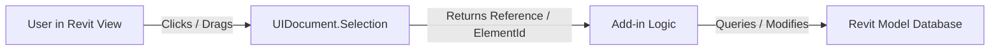
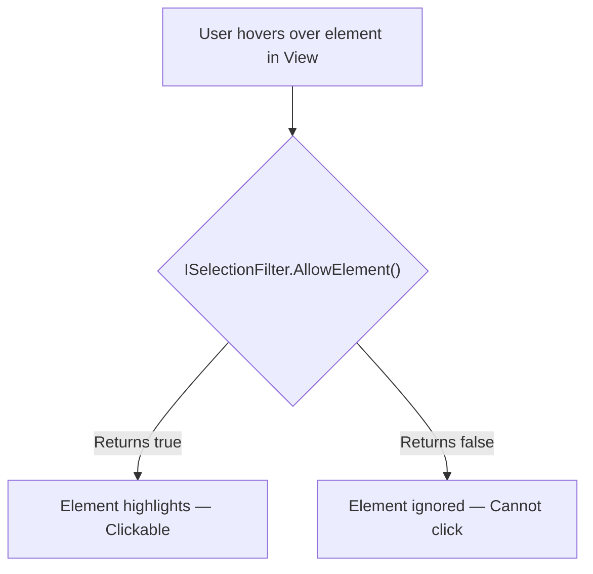
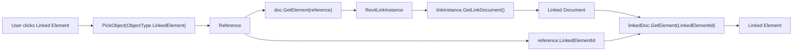
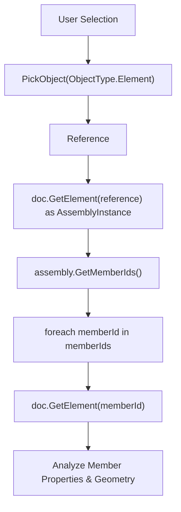
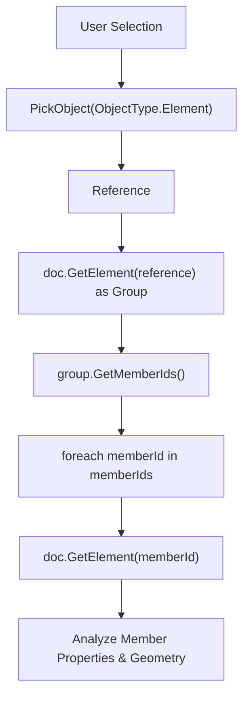
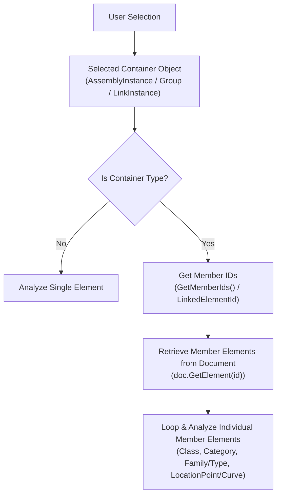
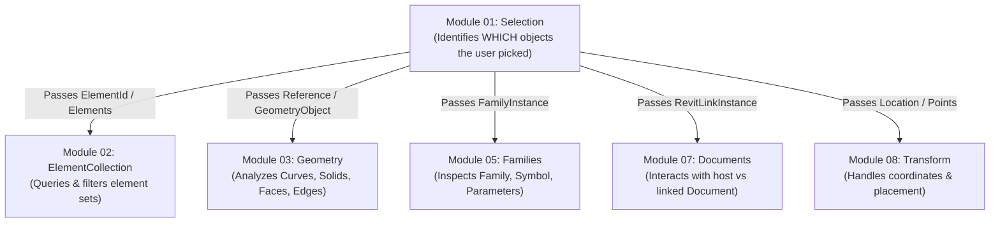
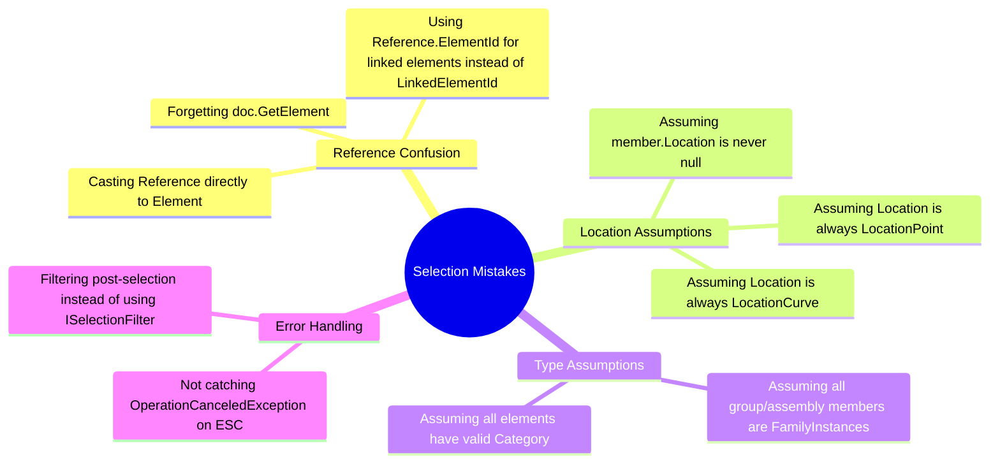
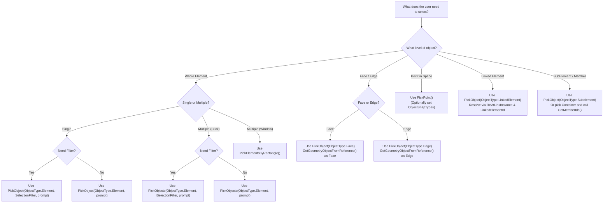

# Module 01 — Selection

## 1. Selection Mental Model

The **Selection API** in Revit serves as the bridge between user interaction in the graphical user interface (GUI) and add-in logic in the Revit API. Located in the `Autodesk.Revit.UI.Selection` namespace, selection operations are initiated through the `UIDocument.Selection` property.

### Selection as the Entry Point

In almost every interactive Revit add-in, selection is the **first step** of execution. Before an add-in can read parameters, analyze geometry, modify element properties, or construct new model elements, it must answer one fundamental question:

> *Which element or geometry in the model should be operated on?*

Selection establishes the **target context** for all downstream processing.



### Interactive vs. Non-Interactive Selection

The Revit API provides two distinct strategies for acquiring target elements:

| Selection Mode | API Mechanism | User Interaction | Primary Use Case |
|---|---|---|---|
| **Interactive Selection** | `PickObject()`, `PickObjects()`, `PickElementsByRectangle()`, `PickPoint()` | **Active** — Execution pauses while the user clicks elements or points in the active view. | When the user must visually choose specific elements, faces, edges, or points in context. |
| **Non-Interactive Selection** | `GetElementIds()`, `SetElementIds()` | **Passive** — Accesses or modifies the set of elements already highlighted in the UI before command execution. | Pre-select workflows ("Select elements first, then click button") or highlighting search results. |

> [!NOTE]
> Interactive selection is fundamentally different from programmatic queries (`FilteredElementCollector`). Interactive selection relies on user intent and visual picking, whereas `FilteredElementCollector` searches the database programmatically based on rules.

---

## 2. Basic Element Selection

Basic element selection prompts the user to select one or more whole elements in the active view.

### Single Element Selection (`PickObject`)

Selecting a single element is the simplest form of interactive selection:

- **Method**: `uiDoc.Selection.PickObject(ObjectType.Element, "Status bar prompt")`
- **Return Type**: `Reference`
- **Resolution**: Pass the returned `Reference` to `doc.GetElement(reference)` to obtain the `Element`.

```csharp
// Prompt user to pick one element
Reference reference = uiDoc.Selection.PickObject(ObjectType.Element, "Select any element");
Element element = doc.GetElement(reference);
```

### Multiple Element Selection (`PickObjects`)

When a workflow requires operating on a user-defined collection of elements:

- **Method**: `uiDoc.Selection.PickObjects(ObjectType.Element, "Status bar prompt")`
- **Return Type**: `IList<Reference>`
- **Workflow**: The user clicks elements sequentially and clicks **Finish** (or presses **Enter**) on the Options Bar.
- **Resolution**: Convert each `Reference` to an `Element` using LINQ `.Select(doc.GetElement).ToList()`.

```csharp
// Prompt user to pick multiple elements
IList<Reference> references = uiDoc.Selection.PickObjects(ObjectType.Element, "Select multiple elements");
IList<Element> selectedElements = references.Select(doc.GetElement).ToList();
```

### Rectangle Area Selection (`PickElementsByRectangle`)

For selecting large groups of elements across a region:

- **Method**: `uiDoc.Selection.PickElementsByRectangle("Status bar prompt")`
- **Return Type**: `IList<Element>` (directly)
- **Key Difference**: This is the **only** `Pick*` method that returns `Element` objects directly instead of `Reference` objects.

```csharp
// User drags a selection window in the active view
IList<Element> selectedElements = uiDoc.Selection.PickElementsByRectangle("Drag a rectangle to select elements");
```

---

## 3. Selection Object Types (`ObjectType`)

The `ObjectType` enum specifies what level of object hierarchy the user is allowed to pick.

| `ObjectType` Value | Target Level | What Is Highlighted on Hover | Returned `Reference` Points To | Sample |
|---|---|---|---|---|
| `ObjectType.Element` | Whole Element | Entire element geometry | The selected `Element` in the document | Samples 01, 02, 04, 05, 06, 14, 15 |
| `ObjectType.Face` | Geometric Face | Individual face of an element | A specific `Face` on the element geometry | Sample 08 |
| `ObjectType.Edge` | Geometric Edge | Individual edge of an element | A specific `Edge` on the element geometry | Sample 09 |
| `ObjectType.LinkedElement` | Linked Model Element | Element inside a linked Revit file | Element inside `RevitLinkInstance` | Sample 10 |
| `ObjectType.Subelement` | Sub-Element | Sub-component inside a group/assembly | Sub-element within a parent element | Sample 11 |

---

## 4. Understanding `Reference`

In the Revit API, a `Reference` is a **stable token/wrapper** that represents a selected entity in the user interface.

### Why `PickObject` Returns `Reference` Instead of `Element`

An `Element` represents a database object in a specific `Document`. However, a user click in a view can target entities that are not standalone top-level elements — such as a face, an edge, or an element embedded inside a linked file. 

The `Reference` object encapsulates:
1. The **Host Element ID** (`reference.ElementId`)
2. The **Sub-element or Geometry Token** (for faces, edges, sub-elements)
3. The **Linked Element ID** (`reference.LinkedElementId` for linked models)

### Resolving `Reference` to `Element`

To retrieve the actual `Element` from a `Reference`:

```csharp
// For host document elements
Element element = doc.GetElement(reference);
```

> [!IMPORTANT]
> A `Reference` is a light, temporary handle. Always resolve it to an `Element` via `Document.GetElement()` before attempting to access parameters, geometry, or properties.

---

## 5. `ElementId` in Selection Workflows

`ElementId` is the unique integer key identifying an element within a single Revit `Document`.

### Pre-Selection and Current Selection Set

Revit maintains an active selection set in the UI. Developers can inspect or modify this set programmatically without pausing execution for user input.

```csharp
// READ: Get currently highlighted element IDs (pre-selection)
ICollection<ElementId> selectedIds = uiDoc.Selection.GetElementIds();
List<Element> selectedElements = selectedIds.Select(id => doc.GetElement(id)).ToList();

// WRITE: Programmatically highlight specific elements in the view
ICollection<ElementId> wallIds = new FilteredElementCollector(doc)
    .OfClass(typeof(Wall))
    .WhereElementIsNotElementType()
    .Take(5)
    .Select(w => w.Id)
    .ToList();

uiDoc.Selection.SetElementIds(wallIds);
```

> [!WARNING]
> `SetElementIds()` **overwrites** the current selection set completely. It does not append to the existing selection.

---

## 6. Selecting Faces

Selecting a face allows developers to extract surface geometry for hosting elements, calculating areas, or evaluating surface normals.

### Workflow

1. Call `uiDoc.Selection.PickObject(ObjectType.Face, prompt)`.
2. Retrieve the parent element via `doc.GetElement(reference)`.
3. Extract the `GeometryObject` via `element.GetGeometryObjectFromReference(reference)`.
4. Cast the `GeometryObject` to `Face`.

```csharp
Reference reference = uiDoc.Selection.PickObject(ObjectType.Face, "Select a face");
Element element = doc.GetElement(reference);

// Extract Face geometry from reference
GeometryObject geomObj = element.GetGeometryObjectFromReference(reference);
Face face = geomObj as Face;

if (face != null)
{
    double area = face.Area; // Area in square feet
}
```

---

## 7. Selecting Edges

Selecting an edge is used for measuring linear boundaries, aligning elements, or defining path curves.

### Workflow

1. Call `uiDoc.Selection.PickObject(ObjectType.Edge, prompt)`.
2. Retrieve the parent element via `doc.GetElement(reference)`.
3. Extract the `GeometryObject` via `element.GetGeometryObjectFromReference(reference)`.
4. Cast the `GeometryObject` to `Edge`.

```csharp
Reference reference = uiDoc.Selection.PickObject(ObjectType.Edge, "Select an edge");
Element element = doc.GetElement(reference);

// Extract Edge geometry from reference
GeometryObject geomObj = element.GetGeometryObjectFromReference(reference);
Edge edge = geomObj as Edge;

if (edge != null)
{
    double length = edge.ApproximateLength; // Length in internal feet
}
```

---

## 8. Selecting Points (`PickPoint`)

`PickPoint` prompts the user to select a 3D coordinate (`XYZ`) directly in the view plane.

### Characteristics

- Returns an `XYZ` object directly — **no `Reference` object is generated**.
- Can be invoked without snapping, or with specific object snaps using `ObjectSnapTypes`.
- Requires an active work plane when used in 3D views.

```csharp
// Unsnapped point selection
XYZ point = uiDoc.Selection.PickPoint("Pick a point");

// Snapped point selection (Endpoints and Intersections)
XYZ snappedPoint = uiDoc.Selection.PickPoint(
    ObjectSnapTypes.Endpoints | ObjectSnapTypes.Intersections,
    "Pick an endpoint or intersection");
```

---

## 9. Selecting SubElements

`ObjectType.Subelement` allows users to select individual components within complex host elements such as Groups or Assemblies without exploding or opening the container.

### Workflow

```csharp
Reference reference = uiDoc.Selection.PickObject(ObjectType.Subelement, "Select a subelement");

// Parent element containing the sub-element
Element parentElement = doc.GetElement(reference);

// ElementId of the specific sub-element
ElementId subElementId = reference.ElementId;
```

---

## 10. Selection Filters (`ISelectionFilter`)

Selection filters enforce constraints at the user interface level **during hover**, preventing the user from picking invalid elements.



### Class-Based Filter (`WallSelectionFilter`)

Filters strictly by C# class type:

```csharp
public class WallSelectionFilter : ISelectionFilter
{
    public bool AllowElement(Element element)
    {
        return element is Wall;
    }

    public bool AllowReference(Reference reference, XYZ position)
    {
        return false;
    }
}
```

### Category-Based Filter (`ElementCategorySelectionFilter`)

A flexible, reusable filter taking any `BuiltInCategory`:

```csharp
public class ElementCategorySelectionFilter : ISelectionFilter
{
    private readonly BuiltInCategory _category;

    public ElementCategorySelectionFilter(BuiltInCategory category)
    {
        _category = category;
    }

    public bool AllowElement(Element element)
    {
        return element.Category?.Id == new ElementId(_category);
    }

    public bool AllowReference(Reference reference, XYZ position)
    {
        return false;
    }
}
```

### Usage with `PickObject` / `PickObjects`

```csharp
// Select a single wall
Reference wallRef = uiDoc.Selection.PickObject(
    ObjectType.Element, 
    new WallSelectionFilter(), 
    "Select a wall");

// Select multiple doors using reusable category filter
IList<Reference> doorRefs = uiDoc.Selection.PickObjects(
    ObjectType.Element, 
    new ElementCategorySelectionFilter(BuiltInCategory.OST_Doors), 
    "Select multiple doors");
```

> [!TIP]
> Category filtering (`ElementCategorySelectionFilter`) is preferred over class filtering (`WallSelectionFilter`) because a single filter class can handle any Revit category without hardcoding C# types.

---

## 11. Linked Element Selection

Selecting elements inside linked Revit models requires traversing host and linked document contexts.

### Linked Selection Flow



### Implementation

```csharp
Reference reference = uiDoc.Selection.PickObject(
    ObjectType.LinkedElement, 
    "Select an element from a Revit Link");

// 1. Get the RevitLinkInstance from the host document
RevitLinkInstance linkInstance = doc.GetElement(reference) as RevitLinkInstance;

// 2. Get the linked Document object
Document linkedDocument = linkInstance.GetLinkDocument();

// 3. Resolve the actual element inside the linked document using LinkedElementId
Element linkedElement = linkedDocument.GetElement(reference.LinkedElementId);
```

---

## 12. Selection Validation and Exception Handling

Every interactive selection method (`PickObject`, `PickObjects`, `PickPoint`, `PickElementsByRectangle`) throws `Autodesk.Revit.Exceptions.OperationCanceledException` if the user cancels by pressing **Escape** or closing the prompt.

### Mandatory Pattern

```csharp
try
{
    Reference reference = uiDoc.Selection.PickObject(ObjectType.Element, "Select an element");
    Element element = doc.GetElement(reference);
    
    if (element == null) return Result.Failed;
    
    // Command logic...
    return Result.Succeeded;
}
catch (Autodesk.Revit.Exceptions.OperationCanceledException)
{
    // User pressed ESC — clean exit without error dialog
    return Result.Cancelled;
}
catch (Exception ex)
{
    message = ex.Message;
    return Result.Failed;
}
```

---

## 13. Assembly Selection and Analysis

An **Assembly** in Revit (`AssemblyInstance`) is a container element that groups multiple building components into a single fabricated unit (e.g., precast concrete panels, structural trusses, pre-assembled MEP spools).

### Implemented Workflow (`SelectAndAnalyzeAssemblyCommand`)



### Member Information Extracted

The implemented `SelectAndAnalyzeAssemblyCommand` performs deep inspection of each member element contained within the assembly:

1. **Assembly Container Data**:
   - `Assembly Id` (`assembly.Id`)
   - `Assembly Name` (`assembly.Name`)
   - `Member Count` (`memberIds.Count`)

2. **Member Element Data**:
   - **Identity**: `Element Id`, `Class` (`member.GetType().Name`), `Category` (`member.Category?.Name`)
   - **Family & Type** (if member is `FamilyInstance`):
     - `Family` (`familyInstance.Symbol.Family.Name`)
     - `Type` (`familyInstance.Symbol.Name`)
     - `Placement` (`family.FamilyPlacementType`)
   - **Location & Spatial Data**:
     - If `member.Location is LocationPoint locPt`: Coordinates `Point (X, Y, Z)`
     - If `member.Location is LocationCurve locCrv`: `Start Point (X,Y,Z)`, `End Point (X,Y,Z)`, Normalized `Direction (X,Y,Z)`, and `Length (ft)`

---

## 14. Group Selection and Analysis

A **Group** in Revit (`Group`) is a container element used to create modular, repeating collections of elements (e.g., standard hotel room layouts, typical office workstation clusters).

### Implemented Workflow (`SelectAndAnalyzeGroupCommand`)



### Member Information Extracted

The implemented `SelectAndAnalyzeGroupCommand` extracts:

1. **Group Container Data**:
   - `Group Id` (`group.Id`)
   - `Group Name` (`group.Name`)
   - `Member Count` (`memberIds.Count`)

2. **Member Element Data**:
   - **Identity**: `Element Id`, `Class`, `Category`
   - **Family & Type** (for `FamilyInstance` members): `Family Name`, `Type Name`, `Placement Type`
   - **Location**: Evaluates `LocationPoint` (3D Point) vs `LocationCurve` (Start, End, Direction, Length)

### Assembly vs. Group Comparison

| Feature / Aspect | Assembly (`AssemblyInstance`) | Group (`Group`) |
|---|---|---|
| **Revit Purpose** | Off-site fabrication, precast assemblies, MEP spools, isolated scheduling and assembly views. | Repeating modular layout elements across floors/rooms. |
| **API Class** | `Autodesk.Revit.DB.AssemblyInstance` | `Autodesk.Revit.DB.Group` |
| **Member Retrieval** | `assembly.GetMemberIds()` | `group.GetMemberIds()` |
| **Document Ownership** | Project Document owns both assembly and member elements. | Project Document owns both group and member elements. |
| **Code Analysis Pattern** | Identical: `Selection` → `Container` → `GetMemberIds()` → `doc.GetElement()` → `Member Analysis` |

---

## 15. Architectural Pattern: Selection → Container → Members → Elements

Both Assembly and Group commands showcase a critical architectural pattern in Revit API add-in design:



### Why This Pattern Matters

1. **Decouples Selection from Granular Inspection**: The user makes a single click on a container, while the add-in automatically expands and inspects the entire sub-tree of elements.
2. **Unified Data Access**: Whether elements are standalone, in a Group, or in an Assembly, the member elements are resolved back to standard `Element` instances in the `Document`.
3. **Foundation for Downstream Modules**: This pattern connects interactive selection directly to element collection, parameter analysis, and geometric extraction.

---

## 16. Cross-Module Relationships

The `Selection` module serves as the primary entry point to other core Revit API modules:



- **Selection → ElementCollection**: Selection lets the user pick starting elements; `ElementCollection` uses `FilteredElementCollector` to search for related elements programmatically.
- **Selection → Geometry**: Selection gets `Face` or `Edge` references; `Geometry` analyzes surface equations, bounding boxes, normals, and curve evaluation.
- **Selection → Families**: Selection retrieves `FamilyInstance` members; `Families` explores types, family parameters, and placement types.
- **Selection → Documents**: Selection identifies whether an element belongs to `uiDoc.Document` or a linked `Document` via `RevitLinkInstance`.

---

## 17. Common Selection Mistakes



1. **Confusing `Reference` with `Element`**: Trying to treat a `Reference` as an `Element` directly without calling `doc.GetElement(reference)`.
2. **Misusing `Reference.ElementId` for Linked Elements**: Calling `doc.GetElement(reference.ElementId)` on a linked selection returns the `RevitLinkInstance`, not the linked element. You must use `linkedDoc.GetElement(reference.LinkedElementId)`.
3. **Assuming Every Element Has a Location**: Annotations, view settings, or internal data elements may have `member.Location == null`.
4. **Assuming `Location` Is Always `LocationPoint`**: Linear elements (walls, beams, pipes) use `LocationCurve`. Spot instances, columns, and doors use `LocationPoint`. Always check with `is` pattern matching.
5. **Assuming All Members Are `FamilyInstance`**: Groups and assemblies can contain system elements (Walls, Floors, Ceilings) which are `HostObject` / `Element` types, not `FamilyInstance`.
6. **Filtering After Selection**: Letting the user click anything and displaying an error dialog is poor UX. Always use `ISelectionFilter` to restrict picks at hover time.
7. **Ignoring `OperationCanceledException`**: Failing to catch `OperationCanceledException` causes Revit to display an unhandled exception dialog when the user hits **Esc**.

---

## 18. Practical Reasoning & Decision-Making Guide

When designing a selection workflow, follow this decision tree:



---

## 19. Command Index

All 15 commands in the `Selections` module verified against the source code repository:

| # | Command File | Class Name | Main API | What It Teaches |
|---|---|---|---|---|
| 01 | [`PickingElementCommand.cs`](Commands/PickingElementCommand.cs) | `PickingElementCommand` | `PickObject(ObjectType.Element)` | Basic single element selection and reference resolution via `doc.GetElement()`. |
| 02 | [`PickingMultipleElementCommand.cs`](Commands/PickingMultipleElementCommand.cs) | `PickingMultipleElementCommand` | `PickObjects(ObjectType.Element)` | Multi-element sequential selection returning `IList<Reference>`. |
| 03 | [`PickingRectangleCommand.cs`](Commands/PickingRectangleCommand.cs) | `PickingRectangleCommand` | `PickElementsByRectangle()` | Drag-rectangle region selection returning `IList<Element>` directly. |
| 04 | [`PickingWallCommand.cs`](Commands/PickingWallCommand.cs) | `PickingWallCommand` | `PickObject` + `WallSelectionFilter` | Class-based UI selection filtering using `ISelectionFilter` (`element is Wall`). |
| 05 | [`PickingElementByCategoryCommand.cs`](Commands/PickingElementByCategoryCommand.cs) | `PickingElementByCategoryCommand` | `PickObject` + `ElementCategorySelectionFilter` | Reusable category-based selection filtering (`BuiltInCategory.OST_Doors`). |
| 06 | [`PickingMultipleElementsByCategoryCommand.cs`](Commands/PickingMultipleElementsByCategoryCommand.cs) | `PickingMultipleElementsByCategoryCommand` | `PickObjects` + `ElementCategorySelectionFilter` | Filtered multi-element selection for specific categories. |
| 07 | [`PickingPointCommand.cs`](Commands/PickingPointCommand.cs) | `PickingPointCommand` | `PickPoint(ObjectSnapTypes)` | 3D point picking with and without object snap types (`Endpoints \| Intersections`). |
| 08 | [`PickingFaceCommand.cs`](Commands/PickingFaceCommand.cs) | `PickingFaceCommand` | `PickObject(ObjectType.Face)` | Geometric face selection and extraction using `GetGeometryObjectFromReference()`. |
| 09 | [`PickingEdgeCommand.cs`](Commands/PickingEdgeCommand.cs) | `PickingEdgeCommand` | `PickObject(ObjectType.Edge)` | Geometric edge selection and length extraction via `Edge.ApproximateLength`. |
| 10 | [`PickLinkedElement.cs`](Commands/PickLinkedElement.cs) | `PickLinkedElement` | `PickObject(ObjectType.LinkedElement)` | Cross-document selection inside linked models via `RevitLinkInstance` & `LinkedElementId`. |
| 11 | [`PickSubElementCommand.cs`](Commands/PickSubElementCommand.cs) | `PickSubElementCommand` | `PickObject(ObjectType.Subelement)` | Direct sub-element selection inside group/assembly containers. |
| 12 | [`GetCurrentSelectionCommand.cs`](Commands/GetCurrentSelectionCommand.cs) | `GetCurrentSelectionCommand` | `Selection.GetElementIds()` | Reading pre-selected elements programmatically without user prompt. |
| 13 | [`SetCurrentSelectionCommand.cs`](Commands/SetCurrentSelectionCommand.cs) | `SetCurrentSelectionCommand` | `Selection.SetElementIds()` | Setting/highlighting view selection set programmatically. |
| 14 | [`SelectAndAnalyzeAssemblyCommand.cs`](Commands/SelectAndAnalyzeAssemblyCommand.cs) | `SelectAndAnalyzeAssemblyCommand` | `AssemblyInstance.GetMemberIds()` | Assembly container selection, member breakdown, family/type & location analysis. |
| 15 | [`SelectAndAnalyzeGroupCommand.cs`](Commands/SelectAndAnalyzeGroupCommand.cs) | `SelectAndAnalyzeGroupCommand` | `Group.GetMemberIds()` | Group container selection, member breakdown, family/type & location analysis. |

---

## 20. Selection API Cheat Sheet

| API Symbol | Type | Description | Sample Usage |
|---|---|---|---|
| `UIDocument.Selection` | Property | Entry point for all selection methods in active UI document. | `var sel = uiDoc.Selection;` |
| `PickObject()` | Method | Prompts user to pick a single object matching `ObjectType` & filter. | `Reference r = sel.PickObject(ObjectType.Element, "Prompt");` |
| `PickObjects()` | Method | Prompts user to pick multiple objects sequentially. | `IList<Reference> refs = sel.PickObjects(ObjectType.Element, "Prompt");` |
| `PickElementsByRectangle()` | Method | Prompts user to drag a rectangle to select elements. | `IList<Element> elems = sel.PickElementsByRectangle("Prompt");` |
| `PickPoint()` | Method | Prompts user to click a 3D point (returns `XYZ`). | `XYZ pt = sel.PickPoint(ObjectSnapTypes.Endpoints, "Prompt");` |
| `ObjectType` | Enum | Determines pick target (`Element`, `Face`, `Edge`, `LinkedElement`, `Subelement`). | `ObjectType.Face` |
| `ObjectSnapTypes` | Flags Enum | Controls snap modes for `PickPoint` (`Endpoints`, `Intersections`, `Midpoints`, etc.). | `ObjectSnapTypes.Endpoints \| ObjectSnapTypes.Intersections` |
| `Reference` | Class | Wrapper handle pointing to a picked element or geometry item. | `Element e = doc.GetElement(reference);` |
| `LinkedElementId` | Property | `ElementId` of selected element inside a linked document. | `Element e = linkedDoc.GetElement(reference.LinkedElementId);` |
| `GetElementIds()` | Method | Returns `ElementId` collection of current UI selection. | `ICollection<ElementId> ids = sel.GetElementIds();` |
| `SetElementIds()` | Method | Overwrites current UI selection with provided `ElementId` set. | `sel.SetElementIds(ids);` |
| `ISelectionFilter` | Interface | Interface for filtering user hover/picks (`AllowElement`, `AllowReference`). | `class MyFilter : ISelectionFilter { ... }` |
| `GetMemberIds()` | Method | Retrieves member `ElementId` collection from `AssemblyInstance` or `Group`. | `ICollection<ElementId> members = assembly.GetMemberIds();` |
| `GetGeometryObjectFromReference()`| Method | Method on `Element` to convert a geometric `Reference` to `Face` or `Edge`. | `GeometryObject g = elem.GetGeometryObjectFromReference(ref);` |
| `OperationCanceledException` | Exception | Thrown when user cancels selection prompt with **Esc**. | `catch (OperationCanceledException) { return Result.Cancelled; }` |

---

## 21. Final Mental Model Checklist

Before writing any Revit API selection code, answer these 10 questions:

1. **What does the user need to select?** (Whole element, face, edge, 3D point, linked element, or sub-element?)
2. **Is it a single selection or a multi-element selection?** (`PickObject` vs `PickObjects` vs `PickElementsByRectangle`)
3. **Should invalid elements be blocked at hover time?** (Implement `ISelectionFilter` by class or category)
4. **Is the selection interactive or pre-existing?** (`PickObject` vs `GetElementIds`)
5. **What does the returned `Reference` represent?** (Host element, face/edge, or linked element?)
6. **Which `Document` owns the selected target?** (Host `doc` vs linked `linkedDoc`)
7. **Is the selected element a container?** (`AssemblyInstance` or `Group`)
8. **If it is a container, how are member elements retrieved?** (`container.GetMemberIds()`)
9. **What type of element is each member?** (`FamilyInstance` vs system `HostObject`)
10. **How is member location structured?** (`LocationPoint` vs `LocationCurve` vs `null`)
