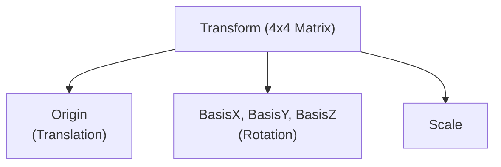
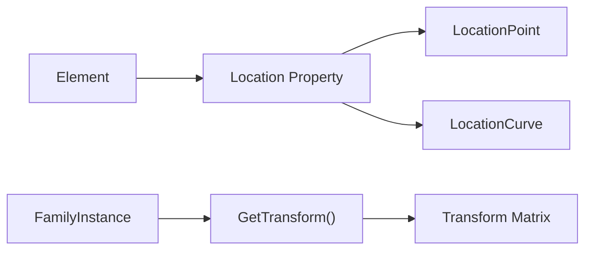
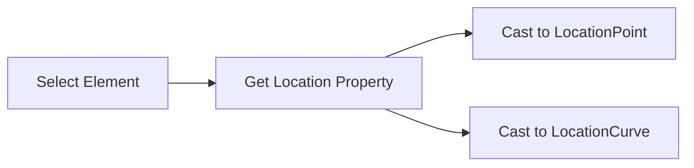
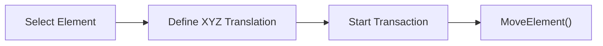
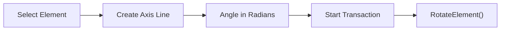
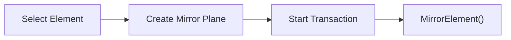
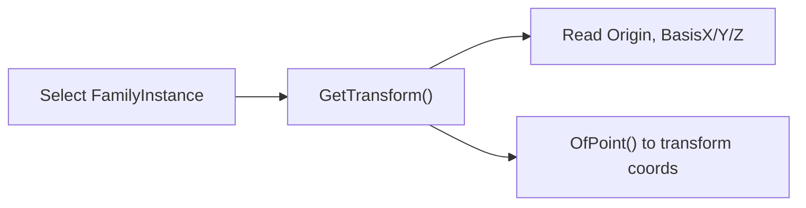
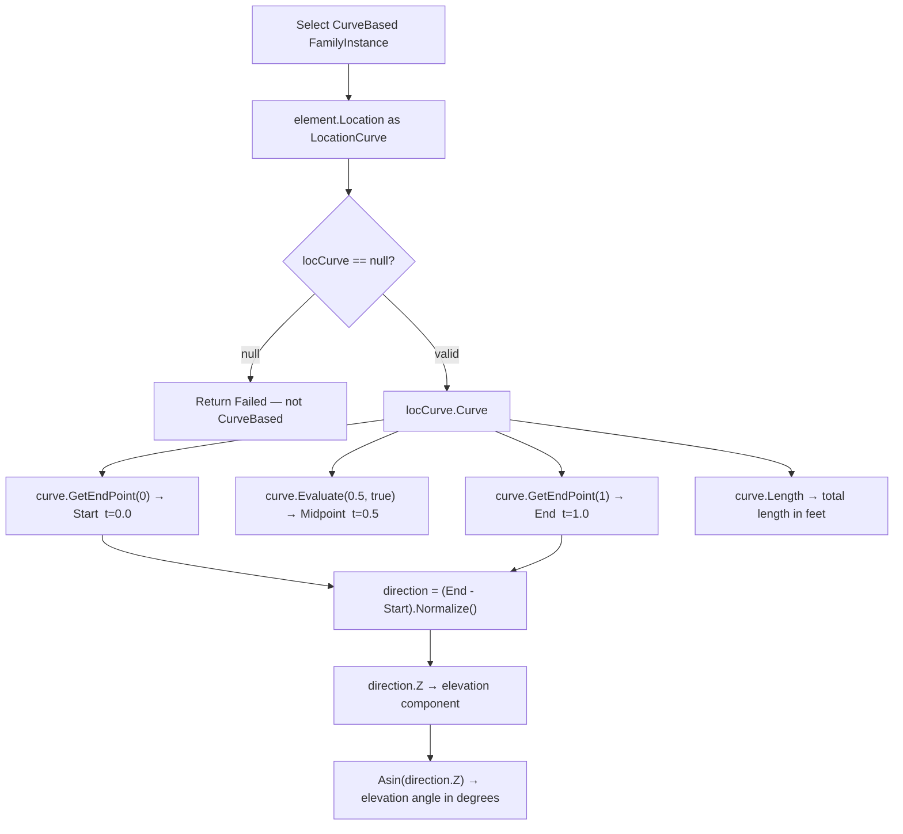
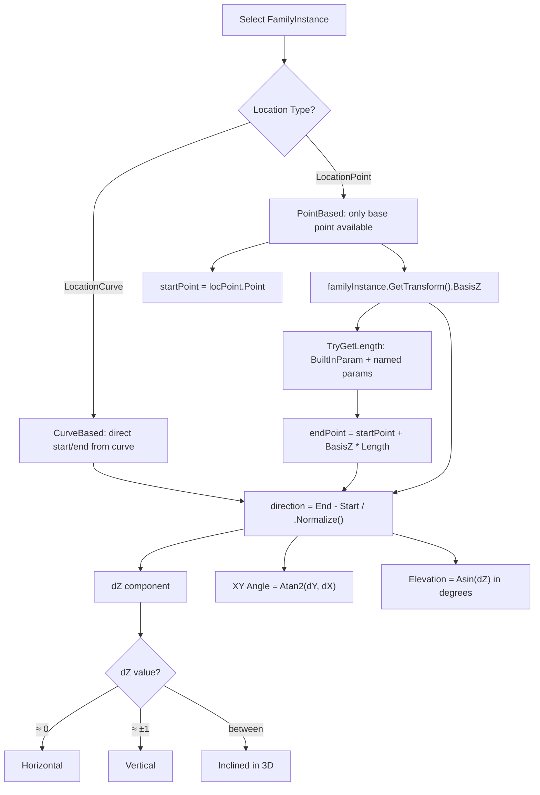

# Module 10 — Transform

## 1. Transform Mental Model

A Transform in Revit is a mathematical object that encodes three properties in one: Translation (where is the element's origin in world space), Rotation (how is the element's local coordinate system oriented), and Scale. It is represented as a 4×4 matrix. The Revit API exposes this as the `Transform` class in `Autodesk.Revit.DB`.



## 2. Location vs Transform

| Feature | Location (Point/Curve) | Transform |
| :--- | :--- | :--- |
| **Availability** | All elements | `FamilyInstance` (via `GetTransform()`) |
| **Data Provided** | XYZ point or Curve | Full 4x4 matrix |
| **Use Case** | Simple positioning | Coordinate system conversions, exact rotation/scale |



## 3. ElementTransformUtils — The Movement API

`ElementTransformUtils` is the primary API for moving, copying, rotating, and mirroring elements in a Revit project. All operations that modify the model require an active `Transaction`.

| Method | Description |
| :--- | :--- |
| `MoveElement` | Moves an element by an XYZ translation vector. |
| `CopyElement` | Copies an element to a new location. |
| `RotateElement` | Rotates an element around a given axis line. |
| `MirrorElement` | Mirrors an element in-place across a plane. |
| `MirrorElements` | Copies and mirrors elements across a plane. |

## 4. Learning Progression (Commands 01–08)

| # | Command File | Class Name | Main API | What It Teaches |
| :--- | :--- | :--- | :--- | :--- |
| 01 | [InspectLocationCommand.cs](Commands/InspectLocationCommand.cs) | `InspectLocationCommand` | `LocationPoint`, `LocationCurve` | Reading simple location data from any element. |
| 02 | [MoveElementCommand.cs](Commands/MoveElementCommand.cs) | `MoveElementCommand` | `ElementTransformUtils.MoveElement()` | Moving elements via an XYZ translation vector. |
| 03 | [CopyElementCommand.cs](Commands/CopyElementCommand.cs) | `CopyElementCommand` | `ElementTransformUtils.CopyElement()` | Copying elements and receiving new element IDs. |
| 04 | [RotateElementCommand.cs](Commands/RotateElementCommand.cs) | `RotateElementCommand` | `ElementTransformUtils.RotateElement()` | Rotating elements around an axis in radians. |
| 05 | [MirrorElementCommand.cs](Commands/MirrorElementCommand.cs) | `MirrorElementCommand` | `ElementTransformUtils.MirrorElement()` | Mirroring elements in-place over a plane. |
| 06 | [TransformGeometryCommand.cs](Commands/TransformGeometryCommand.cs) | `TransformGeometryCommand` | `GetTransform()`, `OfPoint()` | Understanding local coordinates and transform matrices. |
| 07 | [GetPointOnCurveCommand.cs](Commands/GetPointOnCurveCommand.cs) | `GetPointOnCurveCommand` | `curve.Evaluate(t, normalized)`, `GetEndPoint()` | Getting any point along a CurveBased element's curve. |
| 08 | [PointFamilyStartEndCommand.cs](Commands/PointFamilyStartEndCommand.cs) | `PointFamilyStartEndCommand` | `LocationPoint` + `GetTransform().BasisZ` + Length | Deriving Start, End, and 3D direction from a PointBased family. |

## 5. Key Workflows & API Patterns

### 1. Move Element Pattern
```csharp
XYZ translationVector = new XYZ(5, 0, 0);
using (Transaction t = new Transaction(doc, "Move"))
{
    t.Start();
    ElementTransformUtils.MoveElement(doc, element.Id, translationVector);
    t.Commit();
}
```

### 2. Copy Element Pattern
```csharp
XYZ copyOffset = new XYZ(10, 0, 0);
using (Transaction t = new Transaction(doc, "Copy"))
{
    t.Start();
    ICollection<ElementId> newIds = ElementTransformUtils.CopyElement(doc, element.Id, copyOffset);
    t.Commit();
}
```

### 3. Rotate Element Pattern
```csharp
Line axisLine = Line.CreateBound(location, location + XYZ.BasisZ);
double angleInRadians = Math.PI / 4.0;
using (Transaction t = new Transaction(doc, "Rotate"))
{
    t.Start();
    ElementTransformUtils.RotateElement(doc, element.Id, axisLine, angleInRadians);
    t.Commit();
}
```

### 4. Mirror Element Pattern
```csharp
Plane mirrorPlane = Plane.CreateByNormalAndOrigin(XYZ.BasisX, location);
using (Transaction t = new Transaction(doc, "Mirror"))
{
    t.Start();
    ElementTransformUtils.MirrorElement(doc, element.Id, mirrorPlane);
    t.Commit();
}
```

### 5. Get Point on Curve Pattern
```csharp
LocationCurve locCurve = element.Location as LocationCurve;
Curve curve = locCurve.Curve;

XYZ startPoint = curve.GetEndPoint(0);         // t = 0.0
XYZ midPoint   = curve.Evaluate(0.5, true);    // t = 0.5, normalized
XYZ endPoint   = curve.GetEndPoint(1);         // t = 1.0
XYZ direction  = (endPoint - startPoint).Normalize();

// dZ of direction = elevation/inclination component
// dZ = 0.0  → horizontal element
// dZ = 1.0  → perfectly vertical element
double elevAngleDeg = Math.Asin(direction.Z) * (180.0 / Math.PI);
double deltaZ = endPoint.Z - startPoint.Z; // total elevation rise
```

### 6. PointFamily Start / End / Direction Pattern
```csharp
// For a PointBased family (LocationPoint only):
LocationPoint locPoint = familyInstance.Location as LocationPoint;
XYZ startPoint = locPoint.Point;  // base origin

// GetTransform().BasisZ = element's 3D axis direction in world space
Transform tfm = familyInstance.GetTransform();
XYZ direction = tfm.BasisZ;  // normalized; this IS the 3D inclination direction

// Compute end point if you know the length
double length = familyInstance
    .get_Parameter(BuiltInParameter.INSTANCE_LENGTH_PARAM).AsDouble();
XYZ endPoint = startPoint + direction * length;

// Elevation analysis from direction.Z
// direction.Z == 0  → horizontal, direction.Z == 1 → vertical
double elevAngleDeg = Math.Asin(direction.Z) * (180.0 / Math.PI);
double xyAngleDeg   = Math.Atan2(direction.Y, direction.X) * (180.0 / Math.PI);
```

## 6. Per-Command Reasoning (Commands 01–06)

### Command 01: Inspect Location

This command teaches how to extract basic positioning information from an element. It shows how `Location` is the base class and must be cast to a point or curve depending on the element type.

### Command 02: Move Element

This demonstrates basic translation. It enforces the concept that moving an element requires a vector, not absolute coordinates.

### Command 03: Copy Element

Shows how copying works similarly to moving, but crucially returns the newly created element IDs, which is essential for chained operations.

### Command 04: Rotate Element

Teaches creating a rotation axis using `Line` and reinforces that the Revit API always expects angles in radians, not degrees.

### Command 05: Mirror Element

Explains how to define a 3D plane using a normal and origin, and demonstrates in-place mirroring vs. copying.

### Command 06: Transform Geometry

Moves beyond simple `ElementTransformUtils` to accessing the raw math of an element's placement in the model, demonstrating coordinate system transformation.

---

### Command 07: Get Point On Curve

**Why this command exists**: A CurveBased family (beam, inclined framing, MEP element) stores its position as a `LocationCurve`. Once you have the underlying `Curve`, `curve.Evaluate(t, normalized: true)` lets you get *any* point along it. The `t` parameter is a proportion (0.0 = start, 0.5 = midpoint, 1.0 = end). The direction vector's **dZ component** directly encodes the elevation change per unit length — making this the primary analysis tool for inclined 3D elements.



**Architectural unlock**: `curve.Evaluate(t, normalized)` is the universal point-on-curve query tool. The `direction.Z` pattern is how you programmatically detect horizontal vs. inclined vs. vertical elements — essential for structural analysis automation.

---

### Command 08: Point Family Start / End / Direction

**Why this command exists**: A PointBased FamilyInstance (OneLevelBased column, inclined structural element) only exposes a single XYZ via `LocationPoint` — its base origin. You have a point and a length, but **no end point and no direction**. The solution is `GetTransform().BasisZ` — the element's local Z axis expressed in world space. For a plumb column this is `(0,0,1)`. For an inclined element it tilts proportionally. Multiplying `BasisZ × Length` gives the end point. The `BasisZ.Z` component is the sine of the elevation angle.



**Architectural unlock**: `GetTransform().BasisZ` answers *"In which direction does this element extend in 3D world space?"* for any PointBased FamilyInstance. This is the only API path to the 3D axis direction when `LocationCurve` is not available — critical for structural, MEP, and any inclined element analysis.

---

## 7. Common Mistakes to Avoid

1. **Modifying Location without a Transaction** — all model changes require a Transaction.
2. **Using degrees instead of radians** for `RotateElement` — always use `Math.PI / 180 * degrees`.
3. **Confusing `MirrorElement` (moves) with `MirrorElements` (creates a copy)**.
4. **Forgetting `GetTransform()` is only on `FamilyInstance`** — not on `Wall`, `Floor`, etc.
5. **Passing a zero-length rotation axis `Line`** — `Line.CreateBound` with identical start/end throws an exception.
6. **Assuming `LocationPoint` gives the full 3D position** — for inclined elements you must also use `GetTransform().BasisZ` to find the direction.
7. **Using `curve.Evaluate(t, normalized: false)`** when you intended a 0–1 proportion — the non-normalized form uses raw arc-length parameter values, not proportions.

---

## 8. Transform API Cheat Sheet

| API Symbol | Description | Code Example |
| :--- | :--- | :--- |
| `Element.Location` | Gets physical location of element. | `Location loc = elem.Location;` |
| `LocationPoint` | Point-based location (doors, columns). | `XYZ pt = (loc as LocationPoint).Point;` |
| `LocationCurve` | Curve-based location (walls, beams). | `Curve c = (loc as LocationCurve).Curve;` |
| `curve.GetEndPoint(0)` | Start point of a curve (t = 0.0). | `XYZ start = curve.GetEndPoint(0);` |
| `curve.GetEndPoint(1)` | End point of a curve (t = 1.0). | `XYZ end = curve.GetEndPoint(1);` |
| `curve.Evaluate(t, true)` | Point at normalized parameter t (0.0–1.0). | `XYZ mid = curve.Evaluate(0.5, true);` |
| `curve.Length` | Total arc length of the curve in feet. | `double len = curve.Length;` |
| `MoveElement` | Translates an element by an XYZ vector. | `ElementTransformUtils.MoveElement(doc, id, vec);` |
| `CopyElement` | Copies an element, returns new IDs. | `ElementTransformUtils.CopyElement(doc, id, offset);` |
| `RotateElement` | Rotates an element around an axis (radians). | `ElementTransformUtils.RotateElement(doc, id, axis, rad);` |
| `MirrorElement` | Mirrors an element in-place across a plane. | `ElementTransformUtils.MirrorElement(doc, id, plane);` |
| `GetTransform()` | Gets the 4×4 matrix of a FamilyInstance. | `Transform t = inst.GetTransform();` |
| `Transform.BasisZ` | Element's local Z axis = 3D direction in world. | `XYZ dir = inst.GetTransform().BasisZ;` |
| `Transform.OfPoint(pt)` | Converts a local point to world coordinates. | `XYZ world = t.OfPoint(localPt);` |
| `direction.Normalize()` | Returns a unit vector from a direction. | `XYZ unit = (end - start).Normalize();` |
| `Math.Asin(dZ) → degrees` | Elevation angle from direction.Z component. | `double deg = Math.Asin(dir.Z) * 180 / Math.PI;` |
| `Math.Atan2(dY, dX) → degrees` | XY plan rotation angle from direction. | `double deg = Math.Atan2(dir.Y, dir.X) * 180 / Math.PI;` |

