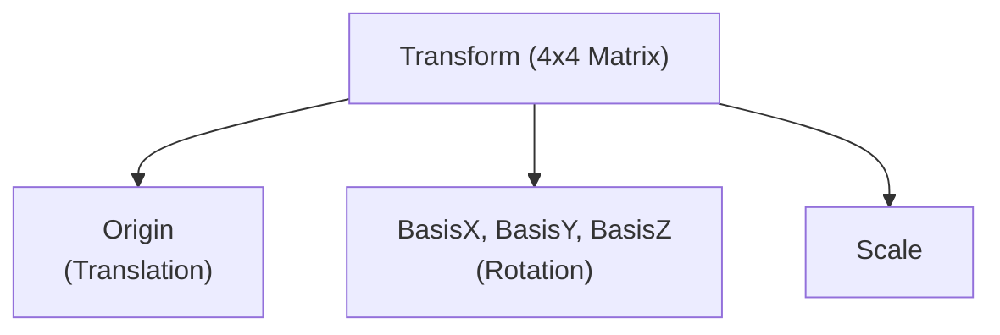
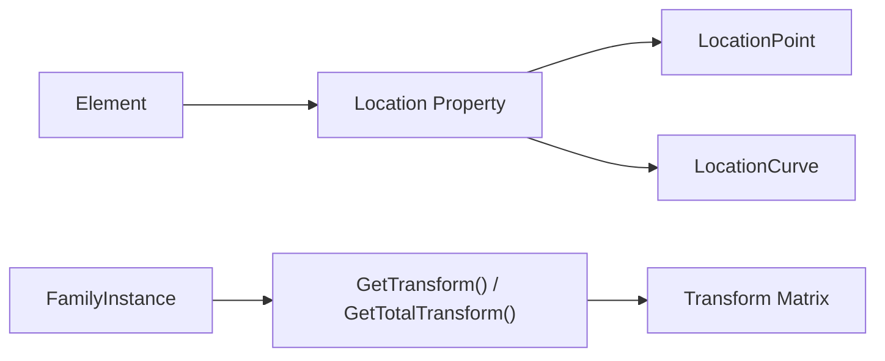
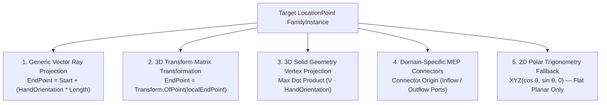
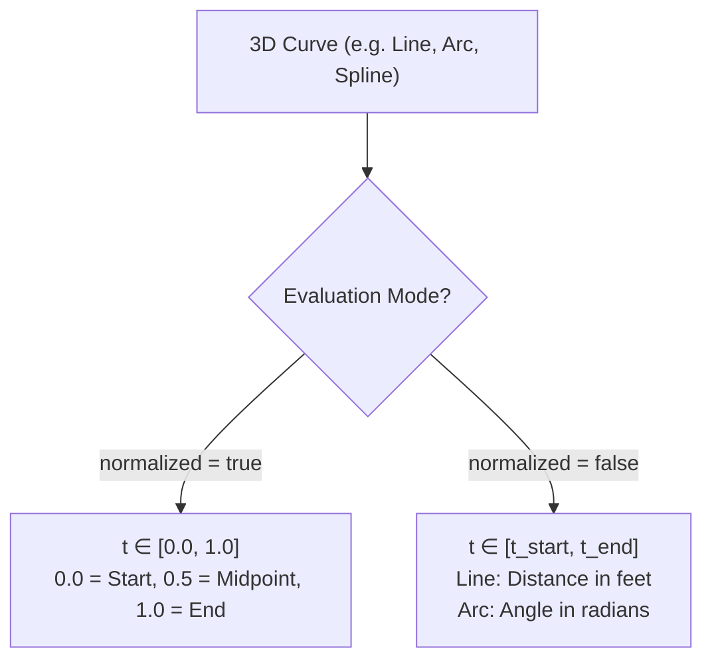
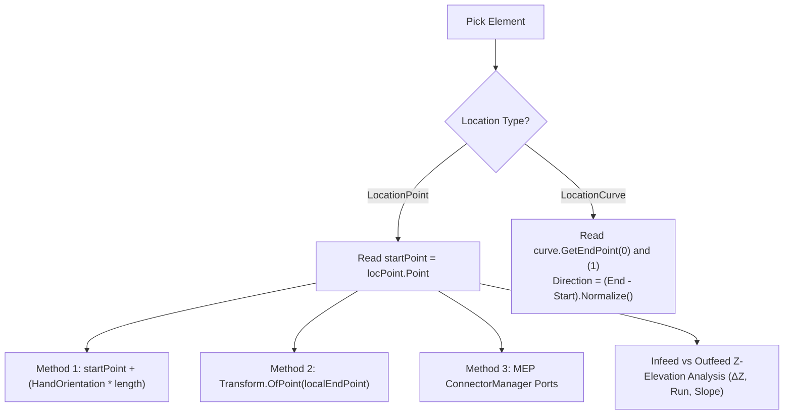
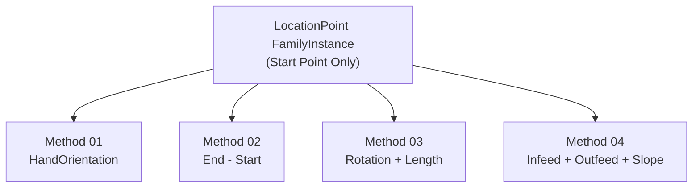

# Module 10 — Transform

## 1. Transform Mental Model

A Transform in Revit is a mathematical object that encodes three properties in one: Translation (where is the element's origin in world space), Rotation (how is the element's local coordinate system oriented), and Scale. It is represented as a 4×4 matrix. The Revit API exposes this as the `Autodesk.Revit.DB.Transform` class in `Autodesk.Revit.DB`.



---

## 2. Location vs. Transform

| Feature | Location (Point/Curve) | Transform |
| :--- | :--- | :--- |
| **Availability** | All elements | `FamilyInstance` (via `GetTransform()`), `RevitLinkInstance`, `GeometryInstance` |
| **Data Provided** | XYZ point or Curve | Full 4x4 matrix (Origin, BasisX, BasisY, BasisZ) |
| **Use Case** | Simple positioning | Coordinate system conversions, 3D tilt/slope, exact rotation |



---

## 3. ElementTransformUtils — The Movement API

`ElementTransformUtils` is the primary API for moving, copying, rotating, and mirroring elements in a Revit project. All operations that modify the model require an active `Transaction`.

| Method | Description |
| :--- | :--- |
| `MoveElement` | Moves an element by an XYZ translation vector. |
| `CopyElement` | Copies an element to a new location. |
| `RotateElement` | Rotates an element around a given axis line. |
| `MirrorElement` | Mirrors an element in-place across a plane. |
| `MirrorElements` | Copies and mirrors elements across a plane. |

---

## 4. Learning Progression (Commands 01–10)

| # | Command File | Class Name | Main API | What It Teaches |
| :--- | :--- | :--- | :--- | :--- |
| 01 | [InspectLocationCommand.cs](Commands/InspectLocationCommand.cs) | `InspectLocationCommand` | `LocationPoint`, `LocationCurve` | Reading simple location data from any element. |
| 02 | [MoveElementCommand.cs](Commands/MoveElementCommand.cs) | `MoveElementCommand` | `ElementTransformUtils.MoveElement()` | Moving elements via an XYZ translation vector. |
| 03 | [CopyElementCommand.cs](Commands/CopyElementCommand.cs) | `CopyElementCommand` | `ElementTransformUtils.CopyElement()` | Copying elements and receiving new element IDs. |
| 04 | [RotateElementCommand.cs](Commands/RotateElementCommand.cs) | `RotateElementCommand` | `ElementTransformUtils.RotateElement()` | Rotating elements around an axis in radians. |
| 05 | [MirrorElementCommand.cs](Commands/MirrorElementCommand.cs) | `MirrorElementCommand` | `ElementTransformUtils.MirrorElement()` | Mirroring elements in-place over a plane. |
| 06 | [TransformGeometryCommand.cs](Commands/TransformGeometryCommand.cs) | `TransformGeometryCommand` | `GetTransform()`, `OfPoint()` | Understanding local coordinates and transform matrices. |
| 07 | [GetPointOnCurveCommand.cs](Commands/GetPointOnCurveCommand.cs) | `GetPointOnCurveCommand` | `curve.Evaluate(t, normalized)`, `GetEndPoint()` | Getting any point along a CurveBased element's curve. |
| 08 | [PointFamilyStartEndCommand.cs](Commands/PointFamilyStartEndCommand.cs) | `PointFamilyStartEndCommand` | `LocationPoint` + `GetTransform().BasisZ` + Length | Deriving Start, End, and 3D direction from a PointBased family. |
| 09 | [DivideCurveByDistanceCommand.cs](Commands/DivideCurveByDistanceCommand.cs) | `DivideCurveByDistanceCommand` | `curve.Evaluate(d/L, true)`, `ComputeDerivatives()` | Sampling points along a curve at custom fixed distance intervals (e.g., every 3 ft on a 12 ft curve). |
| 10 | [GetLocationPointEndPointCommand.cs](Commands/GetLocationPointEndPointCommand.cs) | `GetLocationPointEndPointCommand` | `HandOrientation`, `Transform.OfPoint`, `ConnectorManager`, `Z-Elevation` | Deriving true 3D End Point, 3D Direction, Infeed/Outfeed elevations, and slope from LocationPoint families. |

---

## 5. Deep Dive: Calculating End Point & 3D Direction from `LocationPoint` Families

### The Core Problem
When an element uses a **`LocationPoint`** (a single insertion coordinate `XYZ`), Revit does **NOT** expose a built-in `.EndPoint` property. If the element represents directional machinery, equipment, conveyors, or cantilever components, how do we compute its **true 3D End Point (Outfeed)**, **3D Direction Vector**, and **Z-Elevation Slope**?

---

### The 5 Methods Ranked (Generic-First)



#### 🥇 Rank 1: Vector Ray Projection (`Start + HandOrientation * Length`) — *Most Universal for ALL Families*
* **Applies to:** **ALL Loadable Families** (Architectural, Structural, MEP, Furniture, Generic Models).
* **Concept:** `familyInstance.HandOrientation` and `FacingOrientation` are true 3D unit vectors in world space.
* **Formulas:**
  * If insertion point is at **Start (Infeed)**:
    $$P_{\text{end}} = P_{\text{start}} + (\text{HandOrientation} \times L)$$
  * If insertion point is **Centered**:
    $$P_{\text{end}} = P_{\text{center}} + \left(\text{HandOrientation} \times \frac{L}{2}\right)$$
    $$P_{\text{start}} = P_{\text{center}} - \left(\text{HandOrientation} \times \frac{L}{2}\right)$$

#### 🥈 Rank 2: 3D Transform Matrix (`Transform.OfPoint`) — *Universal Matrix Transformation*
* **Applies to:** **ALL Loadable Families**.
* **Concept:** Converts a local coordinate defined in Family Editor space $(L, 0, 0)$ into project world space:
  $$P_{\text{world}} = \text{Transform}_{\text{total}} \times P_{\text{local}}$$
* **Code:**
  ```csharp
  XYZ localEndPoint = new XYZ(length, 0, 0);
  XYZ worldEndPoint = familyInstance.GetTotalTransform().OfPoint(localEndPoint);
  ```

#### 🥉 Rank 3: 3D Solid Geometry Vertex Projection — *Universal Geometric Inspection*
* **Applies to:** **ALL 3D Solid Geometry** (parameter-independent).
* **Concept:** Traverses `GeometryInstance.GetInstanceGeometry()` and finds the vertex maximizing $(V - P_{\text{start}}) \cdot \vec{u}$.

#### 4️⃣ Rank 4: MEP Connectors (`ConnectorManager`) — *Domain-Specific for MEP*
* **Applies to:** **MEP Families ONLY** (`MEPModel != null`).
* **Concept:** Reads physical connection ports (`connector.Origin` and flow direction `connector.CoordinateSystem.BasisZ`).

#### 5️⃣ Rank 5: 2D Polar Trigonometry (`LocationPoint.Rotation`) — *Fallback (2D Flat Plane Only)*
* **Concept:** $\vec{u} = (\cos\theta, \sin\theta, 0)$.
* **Limitation:** Hardcodes $Z=0$. Fails completely on 3D slopes, tilted conveyors, or slanted work planes.

---

### Infeed vs. Outfeed Z-Level & Slope Analysis Relative to $(0,0,0)$

Every point in Revit has an absolute elevation $Z$ measured in internal feet relative to the **Revit Internal Origin $(0,0,0)$**:

```
                     Outfeed P2 (X2, Y2, Z2)
                             ▲
                            /|
                           / |
              3D Vector   /  |  ΔZ (Height Difference) = Z2 - Z1
                         /   |
                        /    |
                       /     ▼
 Infeed P1 (X1, Y1, Z1) ───────
                       Horizontal Run
```

1. **Absolute Infeed Elevation:** $Z_1 = P_{\text{infeed}}.Z$
2. **Absolute Outfeed Elevation:** $Z_2 = P_{\text{outfeed}}.Z$
3. **Vertical Rise / Fall:** $\Delta Z = Z_2 - Z_1$
4. **Horizontal Planar Run:** $\text{Run} = \sqrt{(X_2 - X_1)^2 + (Y_2 - Y_1)^2}$
5. **Slope Percentage:** $\text{Slope} = \left(\frac{\Delta Z}{\text{Run}}\right) \times 100\%$

---

### System Families vs. Loadable Families in Location Calculations

| Aspect | System Families (Walls, Floors, Beams, Pipes, Ducts) | Loadable Families (Doors, Columns, Machinery, Equipment) |
| :--- | :--- | :--- |
| **Location Type** | Predominantly `LocationCurve` (Linear elements). | Predominantly `LocationPoint` (Punctual insertion point). |
| **Start / End Point Access** | Direct API: `Curve.GetEndPoint(0)` and `Curve.GetEndPoint(1)`. | Derived via `HandOrientation * Length` or `Transform.OfPoint()`. |
| **3D Direction Vector** | `(endPoint - startPoint).Normalize()` or `Line.Direction`. | `familyInstance.HandOrientation`, `FacingOrientation`, or `Transform.BasisZ`. |
| **3D Transform Matrix** | ❌ Not exposed directly (always in project world coordinates). | ✔ Exposes `GetTransform()` and `GetTotalTransform()`. |

---

## 6. Key Workflows & API Patterns

### 1. Move Element Pattern
```csharp
XYZ translationVector = new XYZ(5, 0, 0);
using (Transaction t = new Transaction(doc, "Move"))
{
    t.Start();
    ElementTransformUtils.MoveElement(doc, element.Id, translationVector);
    t.Commit();
}
```

### 2. Copy Element Pattern
```csharp
XYZ copyOffset = new XYZ(10, 0, 0);
using (Transaction t = new Transaction(doc, "Copy"))
{
    t.Start();
    ICollection<ElementId> newIds = ElementTransformUtils.CopyElement(doc, element.Id, copyOffset);
    t.Commit();
}
```

### 3. Rotate Element Pattern
```csharp
Line axisLine = Line.CreateBound(location, location + XYZ.BasisZ);
double angleInRadians = Math.PI / 4.0;
using (Transaction t = new Transaction(doc, "Rotate"))
{
    t.Start();
    ElementTransformUtils.RotateElement(doc, element.Id, axisLine, angleInRadians);
    t.Commit();
}
```

### 4. Mirror Element Pattern
```csharp
Plane mirrorPlane = Plane.CreateByNormalAndOrigin(XYZ.BasisX, location);
using (Transaction t = new Transaction(doc, "Mirror"))
{
    t.Start();
    ElementTransformUtils.MirrorElement(doc, element.Id, mirrorPlane);
    t.Commit();
}
```

---

## 7. Deep Dive: Curve Evaluation & Sampling

### 1. `Evaluate(t, normalized: true)` vs `Evaluate(rawParam, normalized: false)`



| Aspect | Normalized Parameter (`normalized = true`) | Raw Parameter (`normalized = false`) |
| :--- | :--- | :--- |
| **Parameter Range** | Always strictly $0.0 \dots 1.0$ | Varies $[t_{\text{start}}, t_{\text{end}}]$ |
| **Line Behavior** | $t$ is the percentage of total length | $t$ is arc-length distance in feet from line origin |
| **Arc / Circle Behavior** | $t$ is fraction of total arc span $(0 \dots 1)$ | $t$ is angle $\theta$ in radians $(0 \dots 2\pi)$ |

---

### 2. Changing the Value: Sampling Every $X$ Feet (e.g. Every 3 ft on a 12 ft Curve)

```csharp
double totalLength = curve.Length; // 12.0 ft
double stepDistance = 3.0;        // 3.0 ft interval

for (double dist = 0.0; dist <= totalLength + 1e-6; dist += stepDistance)
{
    double clampedDist = Math.Min(dist, totalLength);
    double tNormalized = Math.Clamp(clampedDist / totalLength, 0.0, 1.0);
    
    XYZ point = curve.Evaluate(tNormalized, normalized: true);
    // Process point (e.g. place hanger, stiffener)
}
```

---

## 8. Command 10 — Get LocationPoint End Point & Direction

**File:** [`GetLocationPointEndPointCommand.cs`](Commands/GetLocationPointEndPointCommand.cs)



### Complete Code Recipe

```csharp
[Transaction(TransactionMode.ReadOnly)]
public class GetLocationPointEndPointCommand : IExternalCommand
{
    public Result Execute(ExternalCommandData commandData, ref string message, ElementSet elements)
    {
        var uiDoc = commandData.Application.ActiveUIDocument;
        var doc = uiDoc.Document;

        Reference pickedRef = uiDoc.Selection.PickObject(ObjectType.Element, "Select an element to calculate End Point");
        Element element = doc.GetElement(pickedRef);

        if (element is FamilyInstance familyInstance && element.Location is LocationPoint locPoint)
        {
            XYZ startPoint = locPoint.Point;
            double length = familyInstance.LookupParameter("Length")?.AsDouble() ?? 10.0;

            // 1. Universal Vector Ray Projection (HandOrientation)
            XYZ handDir = familyInstance.HandOrientation;
            XYZ endPointHand = startPoint + (handDir * length);

            // 2. 3D Transform Matrix (Transform.OfPoint)
            Autodesk.Revit.DB.Transform transform = familyInstance.GetTotalTransform();
            XYZ endPointTransform = transform.OfPoint(new XYZ(length, 0, 0));

            // 3. Elevation Analysis
            double deltaZ = endPointHand.Z - startPoint.Z;
            double horizontalRun = Math.Sqrt(Math.Pow(endPointHand.X - startPoint.X, 2) + Math.Pow(endPointHand.Y - startPoint.Y, 2));
            double slopePercent = (horizontalRun > 0.0001) ? (deltaZ / horizontalRun) * 100.0 : 0.0;

            TaskDialog.Show("End Point Result", 
                $"Start Point (Infeed) : ({startPoint.X:F2}, {startPoint.Y:F2}, {startPoint.Z:F2})\n" +
                $"End Point (Outfeed)  : ({endPointHand.X:F2}, {endPointHand.Y:F2}, {endPointHand.Z:F2})\n" +
                $"Height Delta (ΔZ)    : {deltaZ:F3} ft\n" +
                $"Calculated Slope     : {slopePercent:F1}%");
        }

        return Result.Succeeded;
    }
}
```

---

## 9. Common Mistakes to Avoid

1. **Modifying Location without a Transaction** — all model changes require a Transaction.
2. **Using degrees instead of radians** for `RotateElement` — always use `Math.PI / 180 * degrees`.
3. **Hardcoding $Z = 0$ in 2D polar formulas** — forces flat calculation and ignores 3D inclination.
4. **Forgetting `GetTransform()` is only on `FamilyInstance`** — not on `Wall`, `Floor`, etc.
5. **Assuming `LocationPoint` gives the full 3D direction** — always use `HandOrientation` or `GetTransform().BasisZ`.
6. **Calling `MEPModel.ConnectorManager` on Non-MEP Families** — causes `NullReferenceException`.

---

## 10. Transform API Cheat Sheet

| API Symbol | Description | Code Example |
| :--- | :--- | :--- |
| `Element.Location` | Gets physical location of element. | `Location loc = elem.Location;` |
| `LocationPoint` | Point-based location (doors, columns, equipment). | `XYZ pt = (loc as LocationPoint).Point;` |
| `LocationCurve` | Curve-based location (walls, beams, ducts, pipes). | `Curve c = (loc as LocationCurve).Curve;` |
| `familyInstance.HandOrientation` | Local X-axis unit vector in 3D world space. | `XYZ dir = inst.HandOrientation;` |
| `familyInstance.FacingOrientation` | Local Y-axis unit vector in 3D world space. | `XYZ dir = inst.FacingOrientation;` |
| `Transform.BasisZ` | Element's local Z-axis = 3D orientation axis in world space. | `XYZ dir = inst.GetTransform().BasisZ;` |
| `Transform.OfPoint(localPt)` | Converts a local coordinate to world coordinates. | `XYZ world = t.OfPoint(localPt);` |
| `direction.Normalize()` | Returns a 3D unit vector from two points. | `XYZ unit = (end - start).Normalize();` |


---

## 11. Deep Dive: 4 Methods to Calculate Direction and End Point

### The Challenge

For **LocationPoint-based FamilyInstances**, Revit does not expose a built-in `.EndPoint` property. To compute the true end point and direction vector, we have 4 practical methods, each with different use cases, compatibility, and limitations.



---

### Compatibility Matrix

| Method | Name | Loadable | System | LocationPoint | LocationCurve | 3D Slope Support |
| :--- | :--- | :---: | :---: | :---: | :---: | :---: |
| **01** | HandOrientation | ✓ | ✗ | - | - | ✓ |
| **02** | End - Start | ✓ | ✓ | ✗ | ✓ | ✓ |
| **03** | Rotation + Length | ✓ | ✓ | ✓ | ✗ | ✗ |
| **04** | Infeed + Outfeed + Slope | ✓ | ✓ | ✓ | ✗ | ✓ |

---

### Method 01: HandOrientation / Face Orientation

**Best For:** Loadable Family instances with direct 3D orientation data.  
**Compatibility:** ✓ **Loadable Family only** | ✗ System Family  
**Location Type:** Any (Point or Curve)

**Advantage:** Direct vector from Revit—no calculation required.

**Formula:**
$$\vec{u} = \\text{familyInstance.HandOrientation}$$
$$P_{\\text{end}} = P_{\\text{start}} + \\vec{u} \\times L$$

**Code:**
```csharp
FamilyInstance familyInstance = element as FamilyInstance;
if (familyInstance != null)
{
    XYZ handOrientation = familyInstance.HandOrientation;
    XYZ endPoint = startPoint + (handOrientation * length);
}
```

---

### Method 02: End - Start .Normalize()

**Best For:** Curve-based elements (Wall, Beam, Pipe) where start and end points are directly available.  
**Compatibility:** ✓ **Both Loadable and System Family** | ✓ LocationCurve only  
**Location Type:** Must be `LocationCurve`

**Advantage:** Works with both Loadable and System families. Uses actual curve geometry.

**Formula:**
$$P_{\\text{start}} = \\text{Curve.GetEndPoint(0)}$$
$$P_{\\text{end}} = \\text{Curve.GetEndPoint(1)}$$
$$\\vec{u} = \\frac{P_{\\text{end}} - P_{\\text{start}}}{\\|P_{\\text{end}} - P_{\\text{start}}\\|}$$

**Code:**
```csharp
LocationCurve locCurve = element.Location as LocationCurve;
if (locCurve != null)
{
    Curve curve = locCurve.Curve;
    XYZ startPoint = curve.GetEndPoint(0);
    XYZ endPoint = curve.GetEndPoint(1);
    XYZ direction = endPoint.Subtract(startPoint).Normalize();
}
```

---

### Method 03: Start + Rotation + Length

**Best For:** Generic horizontal elements with rotation in the XY plane.  
**Compatibility:** ✓ **Both Loadable and System Family** | ✓ LocationPoint only  
**Location Type:** Must be `LocationPoint`  
**Limitation:** Ignores vertical slope (hardcodes Z = 0).

**Advantage:** Generic and simple; works for both family types.

**Formula:**
$$P_{\\text{start}} = \\text{LocationPoint.Point}$$
$$\\theta = \\text{LocationPoint.Rotation}$$
$$P_{\\text{end}} = \\begin{pmatrix}x_s + L \\cos\\theta \\\\ y_s + L \\sin\\theta \\\\ z_s\\end{pmatrix}$$

**Code:**
```csharp
LocationPoint locPoint = element.Location as LocationPoint;
if (locPoint != null)
{
    XYZ startPoint = locPoint.Point;
    double rotation = locPoint.Rotation;  // in radians
    double length = 3.0;  // example
    
    double directionX = Math.Cos(rotation);
    double directionY = Math.Sin(rotation);
    
    XYZ endPoint = new XYZ(
        startPoint.X + length * directionX,
        startPoint.Y + length * directionY,
        startPoint.Z  // no slope
    );
}
```

---

### Method 04: Infeed + Outfeed + Z Direction (with Slope)

**Best For:** Elements with a measured infeed offset, outfeed distance, and vertical rise (stairs, ramps, inclined conveyors).  
**Compatibility:** ✓ **Both Loadable and System Family** | ✓ LocationPoint only  
**Location Type:** Must be `LocationPoint`

**Advantage:** Most detailed method. Correctly separates horizontal distance from vertical slope.

**Key Insight:** Infeed and Outfeed are **horizontal-only** distances. Slope is **vertical-only** and **independent**.

**Formula:**

Horizontal distance:
$$D_{\\text{horiz}} = \\text{Infeed} + L + \\text{Outfeed}$$

End point (horizontal plane):
$$P_{\\text{end,horiz}} = \\begin{pmatrix}x_s + D_{\\text{horiz}} \\cos\\theta \\\\ y_s + D_{\\text{horiz}} \\sin\\theta\\end{pmatrix}$$

End point (full 3D with slope):
$$P_{\\text{end,3D}} = \\begin{pmatrix}x_s + D_{\\text{horiz}} \\cos\\theta \\\\ y_s + D_{\\text{horiz}} \\sin\\theta \\\\ z_s + \\text{Slope}\\end{pmatrix}$$

**Code:**
```csharp
LocationPoint locPoint = element.Location as LocationPoint;
if (locPoint != null)
{
    XYZ startPoint = locPoint.Point;
    double rotation = locPoint.Rotation;  // in radians
    
    // Horizontal-only parameters
    double infeed = 0.5;
    double elementLength = 3.0;
    double outfeed = 0.5;
    double totalHorizontal = infeed + elementLength + outfeed;
    
    // Vertical-only parameter (independent!)
    double slope = 1.5;  // rise in Z direction
    
    // Calculate end point
    double directionX = Math.Cos(rotation);
    double directionY = Math.Sin(rotation);
    
    XYZ endPoint = new XYZ(
        startPoint.X + totalHorizontal * directionX,
        startPoint.Y + totalHorizontal * directionY,
        startPoint.Z + slope  // Slope is SEPARATE from horizontal distance!
    );
}
```

---

### ⚠️ Critical Pitfall: Infeed & Outfeed vs. Slope

**❌ WRONG:**
```csharp
double totalDistance = infeed + length + outfeed;
XYZ endPoint = new XYZ(
    startPoint.X + totalDistance * directionX,
    startPoint.Y + totalDistance * directionY,
    startPoint.Z + totalDistance * slope  // ❌ MULTIPLIES slope by distance!
);
// Result: If totalDistance = 4 ft and slope = 1.5 ft, Z = 4 * 1.5 = 6 ft (HUGE!)
```

**✓ CORRECT:**
```csharp
double totalHorizontalDistance = infeed + length + outfeed;
XYZ endPoint = new XYZ(
    startPoint.X + totalHorizontalDistance * directionX,
    startPoint.Y + totalHorizontalDistance * directionY,
    startPoint.Z + slope  // ✓ Slope is completely separate
);
// Result: Z = 0 + 1.5 = 1.5 ft (correct!)
```

**Why:** Infeed and Outfeed measure **horizontal distances** in the XY plane. Slope measures **vertical distance** in the Z direction. They are **independent dimensions**, not related by multiplication.

---

### Elevation and Slope Analysis from Infeed to Outfeed

Once you have both the Infeed and Outfeed points in 3D world coordinates, you can analyze slope and rise:
                Outfeed P2 (X2, Y2, Z2)
                       ▲
                      /|
                     / |  ΔZ = Z2 - Z1 (Vertical Rise)
                    /  |
                   /   |
                  /    ▼
Infeed P1 (X1, Y1, Z1) ─────────
                  Run (Horizontal)

                  
**Calculations:**
```csharp
XYZ infeedPoint = startPoint;
XYZ outfeedPoint = endPoint;

double deltaZ = outfeedPoint.Z - infeedPoint.Z;
double horizontalRun = Math.Sqrt(
    Math.Pow(outfeedPoint.X - infeedPoint.X, 2) +
    Math.Pow(outfeedPoint.Y - infeedPoint.Y, 2)
);

double slopePercent = (horizontalRun > 0.0001) 
    ? (deltaZ / horizontalRun) * 100.0 
    : 0.0;

double elevationAngle = Math.Atan2(deltaZ, horizontalRun) * (180.0 / Math.PI);
```

---

### Choosing the Right Method

| Scenario | Use Method |
| :--- | :--- |
| You have a **Loadable Family** and need the simplest approach. | **01 (HandOrientation)** |
| You have a **Wall, Beam, or Pipe** (curve-based system family). | **02 (End - Start)** |
| You have a **Door, Window, or Equipment** (point-based, no slope). | **03 (Rotation + Length)** |
| You have a **Stairs, Ramp, or Sloped Conveyor** (point-based with 3D tilt). | **04 (Infeed + Outfeed + Slope)** |

---

### Implementation Reference

**See:** `CalculateDirectionAndEndPointCommand.cs` for a complete implementation of all 4 methods with detailed reporting.

```csharp
[Transaction(TransactionMode.ReadOnly)]
public class CalculateDirectionAndEndPointCommand : IExternalCommand
{
    // Implements all 4 methods
    // Provides compatibility matrix and detailed reporting
}
```
