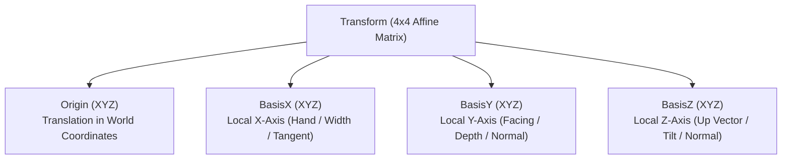
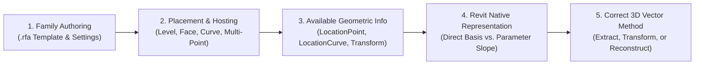
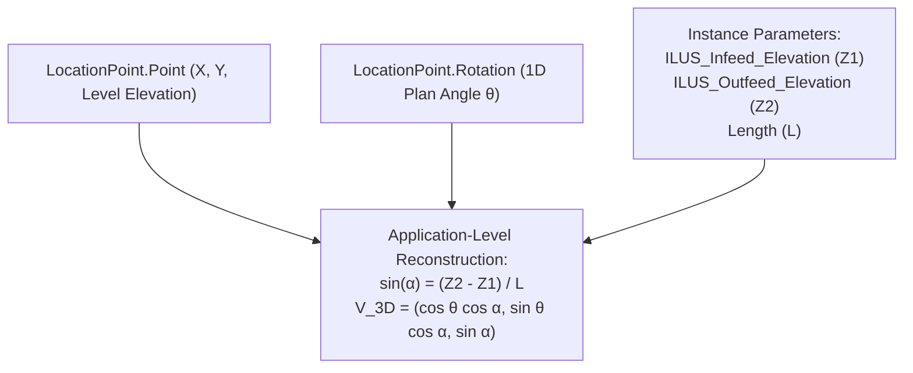
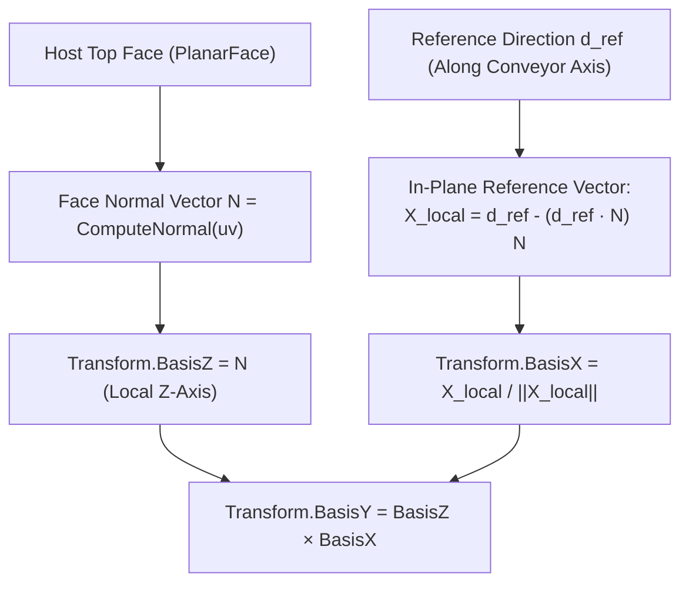
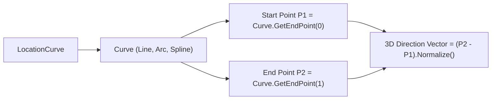
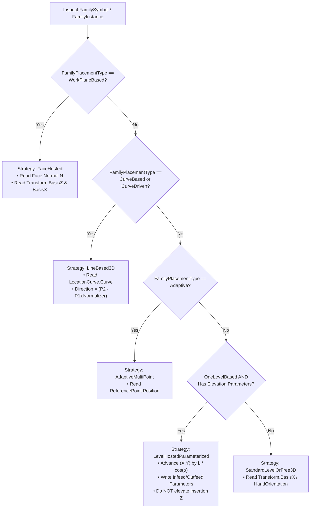

# Module 10 — Transform & 3D Spatial Vector Architecture

## 1. Transform Mental Model

A Transform in Revit is a 4×4 affine matrix representing Translation (origin in world space), Rotation (orientation of local coordinate axes: BasisX, BasisY, BasisZ), and Scale. In the Revit API, it is exposed via the [`Autodesk.Revit.DB.Transform`](file:///c:/Users/Mostafa.Badr/Downloads/00/00-%20Repos/RevitSamples/RevitApiSamples/Samples/Transform/Commands/TransformGeometryCommand.cs) class.



---

## 2. The Core Principle: Family Placement Architecture Governs 3D Vector Calculations

> [!IMPORTANT]
> **Fundamental Architectural Rule:**
> **We must calculate 3D direction vectors according to the way Revit creates, hosts, and constrains the family, rather than forcing every element into a single universal calculation.**
>
> In CAD/OpenGL/Unity, 3D orientation is purely mathematical (translation vector + quaternion/Euler rotation applied to raw vertices). In Autodesk Revit, element geometry is strictly governed by **BIM Hosting Paradigms** and internal family definition constraints (`.rfa`). 

### The 5-Stage Spatial Resolution Pipeline



---

## 3. Location vs. Transform in Revit API

| Feature | Location (`LocationPoint` / `LocationCurve`) | Transform (`GetTransform()` / `GetTotalTransform()`) |
| :--- | :--- | :--- |
| **Object Class** | Subclass of `Autodesk.Revit.DB.Location` | `Autodesk.Revit.DB.Transform` |
| **Availability** | Available on all model elements (`Element.Location`). | Available on `FamilyInstance`, `RevitLinkInstance`, `GeometryInstance`. |
| **Exposed Degrees of Freedom** | Punctual position (`Point`) or linear curve (`Curve`). `LocationPoint.Rotation` is a **1D scalar angle around a vertical axis only**. | Full 3D orthonormal basis ($\hat{X}, \hat{Y}, \hat{Z}$) and origin. |
| **3D Tilt / Incline Detection** | ❌ Cannot detect pitch or roll on Level-hosted families. | ✔ Authoritative source of true geometric tilt (`BasisZ`). |
| **System Families** | Primary position mechanism (`LocationCurve` for Walls, Pipes, Ducts). | ❌ Not exposed directly on system family instances. |

---

## 4. Master 3D Vector & Family Placement Classification Matrix

The following matrix classifies all family and placement cases in Revit, defining what geometric information is exposed and how the 3D direction vector must be calculated.

| Case # | Family & Placement Architecture | Creation API / Hosting Type | Available Geometric Information | How to Determine 3D Direction Vector | Additional Parameters / Data Required | Limitations & Constraints |
| :---: | :--- | :--- | :--- | :--- | :--- | :--- |
| **1** | **Level-Hosted Point Family**<br>(Conveyors, Box Families, Free-Standing Equipment) | `NewFamilyInstance(XYZ, symbol, Level, NonStructural)`<br>`FamilyPlacementType.OneLevelBased` | • `LocationPoint.Point`<br>• `LocationPoint.Rotation` ($\theta_{\text{plan}}$)<br>• `HandOrientation` / `FacingOrientation` ($Z=0$) | **Reconstruct via Parameterized Math:**<br>$\vec{u}_{\text{3D}} = (u_x \cos\alpha, u_y \cos\alpha, \sin\alpha)$<br>where $\sin\alpha = \frac{Z_{\text{out}} - Z_{\text{in}}}{L}$ | `Infeed_Elevation`, `Outfeed_Elevation`, `Length` (instance parameters) | `LocationPoint.Rotation` is 1D scalar about global Z; slope is **not** stored in Revit's transform matrix. Translating origin in Z + writing parameters causes **double-elevation**. |
| **2** | **Face-Hosted / Work-Plane Family**<br>(Guard Rails, Brackets, Face Mounted Fixtures) | `NewFamilyInstance(Face, XYZ, XYZ, symbol)`<br>`FamilyPlacementType.WorkPlaneBased` | • Host `Face`<br>• `Face.ComputeNormal(uv)`<br>• In-plane reference direction $\vec{d}_{\text{ref}}$<br>• `GetTransform().BasisZ` | **Direct Extraction from Transform / Face:**<br>$\hat{Z}_{\text{local}} = \vec{N}_{\text{face}}$<br>$\hat{X}_{\text{local}} = \text{proj}_{\text{face}}(\vec{d}_{\text{ref}})$<br>$\hat{Y}_{\text{local}} = \hat{Z} \times \hat{X}$ | Valid host `Face` and in-plane reference vector | Requires `Always Vertical = False` in `.rfa`. If `Always Vertical = True`, Revit forces $\text{BasisZ} = (0,0,1)$ even on a sloped face. |
| **3** | **Curve-Based Family (Linear)**<br>(Walls, Beams, Ducts, Pipes, Line-Based Loadable) | `NewFamilyInstance(Curve, symbol, Level, ...)`<br>`Wall.Create(doc, Curve, ...)`<br>`FamilyPlacementType.CurveBased` | • `LocationCurve.Curve`<br>• Start Point $P_1 = \text{Curve.GetEndPoint}(0)$<br>• End Point $P_2 = \text{Curve.GetEndPoint}(1)$ | **Direct Native Vector Subtraction:**<br>$\vec{u}_{\text{3D}} = \frac{P_2 - P_1}{\|P_2 - P_1\|}$<br>Or `Line.Direction` / `ComputeDerivatives` | None (native curve geometry) | Casting `Location` to `LocationPoint` throws `InvalidCastException`. True 3D slope is encoded directly in curve coordinates. |
| **4** | **Free 3D Spatial Component**<br>(Unhosted 3D equipment, tilted structural braces) | `NewFamilyInstance(XYZ, symbol, StructuralType)` + 3D Axis Rotation<br>`Always Vertical = False` | • `GetTransform().BasisX`<br>• `GetTransform().BasisY`<br>• `GetTransform().BasisZ`<br>• `GetTransform().Origin` | **Direct 3D Matrix Basis Read:**<br>$\vec{u}_{\text{longitudinal}} = \text{Transform.BasisX}$<br>$\vec{u}_{\text{transverse}} = \text{Transform.BasisY}$<br>$\vec{u}_{\text{normal}} = \text{Transform.BasisZ}$ | Requires 3D rotation via `ElementTransformUtils.RotateElement` | Family Editor setting `FAMILY_ALWAYS_VERTICAL` must be explicitly set to `0` (False). |
| **5** | **MEP Connected Family**<br>(Pumps, Air Handlers, Valves, Connected Machinery) | Point-based or Hosted, but equipped with `MEPModel` connectors | • `MEPModel.ConnectorManager`<br>• `Connector.Origin`<br>• `Connector.CoordinateSystem.BasisZ` | **Direct Connector Port Orientation:**<br>$\vec{u}_{\text{flow}} = \text{Connector.CoordinateSystem.BasisZ}$<br>$P_{\text{port}} = \text{Connector.Origin}$ | `MEPModel` must not be null | Connector directions represent fluid/electrical flow vectors, independent of the family insertion origin. |
| **6** | **Adaptive Multi-Point Family**<br>(Complex trusses, curved conveyors, panels) | `AdaptiveComponentInstanceUtils.CreateAdaptiveComponentInstance`<br>`FamilyPlacementType.Adaptive` | • `AdaptiveComponentInstanceUtils`<br>• Ordered `ReferencePoint` element IDs<br>• `ReferencePoint.Position` (XYZ) | **Point-to-Point Vector Reconstruction:**<br>$\vec{u}_{\text{segment}} = \frac{P_{i+1} - P_i}{\|P_{i+1} - P_i\|}$ | None (read from placement point elements) | `Location` is `null` or degenerate; cannot use `LocationPoint` or `LocationCurve`. Position is defined solely by placement points. |
| **7** | **Two-Level Structural Member**<br>(Vertical vs. Slanted Structural Columns) | `NewFamilyInstance(XYZ, symbol, baseLvl, topLvl, Column)`<br>`FamilyPlacementType.TwoLevelsBased` | • `SLANTED_COLUMN_TYPE_PARAM`<br>• Vertical: `LocationPoint`<br>• Slanted: `LocationCurve` | **Dynamic Type Check:**<br>• If Vertical: $\vec{u} = (0, 0, 1)$<br>• If Slanted: $\vec{u} = \text{LocationCurve.Curve.Direction}$ | Built-in parameter `SLANTED_COLUMN_TYPE_PARAM` | When slanted, Revit converts `Location` from `LocationPoint` to `LocationCurve` on the fly. Blind casting throws `InvalidCastException`. |

---

## 5. Detailed Breakdown of Each Placement Case

### Case 1: Level-Hosted Point Family (`OneLevelBased`)



1. **How Created/Placed:** `doc.Create.NewFamilyInstance(XYZ, symbol, level, StructuralType.NonStructural)`.
2. **Exposed Information:** `LocationPoint.Point` (X, Y on Level plane; Z is Level elevation) and `LocationPoint.Rotation` (1D scalar angle in radians about vertical Z).
3. **Retrieval vs. Reconstruction:** **Reconstruction is mandatory.** Revit's internal object model has *no field* for 3D tilt on level-hosted instances.
4. **Mathematical Formulation:**
   $$\Delta Z = Z_{\text{outfeed}} - Z_{\text{infeed}}$$
   $$\sin\alpha = \frac{\Delta Z}{L}, \quad \cos\alpha = \sqrt{1 - \sin^2\alpha}$$
   $$\vec{u}_{\text{3D}} = \left( \cos\theta_{\text{plan}} \cdot \cos\alpha, \; \sin\theta_{\text{plan}} \cdot \cos\alpha, \; \sin\alpha \right)$$
5. **Key Code Implementation:** Implemented in [`GeometryUtils.Get3DDirection`](file:///C:/Users/Mostafa.Badr/Downloads/00/00-%20Repos/RailConverter/RailConverter/Utilities/GeometryUtils.cs#L22-L72) and [`GetLocationPointEndPointCommand.cs`](file:///c:/Users/Mostafa.Badr/Downloads/00/00-%20Repos/RevitSamples/RevitApiSamples/Samples/Transform/Commands/GetLocationPointEndPointCommand.cs).

---

### Case 2: Face-Hosted / Work-Plane-Based Family (`WorkPlaneBased`)



1. **How Created/Placed:** `doc.Create.NewFamilyInstance(face, referencePoint, referenceDirection, symbol)`.
2. **Exposed Information:** The host `Face` geometry, surface normal $\vec{N}$, and `instance.GetTransform()`.
3. **Retrieval vs. Reconstruction:** **Direct Retrieval from 3D Transform Matrix.** The instance's local Z-axis ($\text{BasisZ}$) snaps directly to the host face normal $\vec{N}_{\text{face}}$.
4. **Mathematical Formulation:**
   $$\hat{Z}_{\text{local}} = \vec{N}_{\text{face}}$$
   $$\vec{X}_{\text{proj}} = \vec{d}_{\text{ref}} - (\vec{d}_{\text{ref}} \cdot \hat{Z}_{\text{local}})\hat{Z}_{\text{local}}, \quad \hat{X}_{\text{local}} = \frac{\vec{X}_{\text{proj}}}{\|\vec{X}_{\text{proj}}\|}$$
   $$\hat{Y}_{\text{local}} = \hat{Z}_{\text{local}} \times \hat{X}_{\text{local}}$$
5. **Key Code Implementation:** Implemented in [`GeometryUtils.GetGuardRailReferenceDirection`](file:///C:/Users/Mostafa.Badr/Downloads/00/00-%20Repos/RailConverter/RailConverter/Utilities/GeometryUtils.cs#L74-L101) and [`PlacementService.PlaceHostedInstance`](file:///C:/Users/Mostafa.Badr/Downloads/00/00-%20Repos/RailConverter/RailConverter/Services/PlacementService.cs#L39-L74).

---

### Case 3: Curve-Based Family (`CurveBased` / Linear System Families)



1. **How Created/Placed:** `doc.Create.NewFamilyInstance(curve, symbol, level, StructuralType)` or `Wall.Create(doc, curve, levelId, false)`.
2. **Exposed Information:** `LocationCurve.Curve`, start coordinate $P_1$, end coordinate $P_2$, `Line.Direction`.
3. **Retrieval vs. Reconstruction:** **Direct Native Vector Subtraction.** Both $P_1$ and $P_2$ already exist as true 3D spatial coordinates in world space.
4. **Mathematical Formulation:**
   $$\vec{u}_{\text{3D}} = \frac{P_2 - P_1}{\|P_2 - P_1\|}$$
   For curved paths (Arcs/Splines), tangent at parameter $t$:
   $$\vec{T}(t) = \text{Curve.ComputeDerivatives}(t, \text{normalized: true}).\text{BasisX}.\text{Normalize}()$$
5. **Key Code Implementation:** Implemented in [`DivideCurveByDistanceCommand.cs`](file:///c:/Users/Mostafa.Badr/Downloads/00/00-%20Repos/RevitSamples/RevitApiSamples/Samples/Transform/Commands/DivideCurveByDistanceCommand.cs) and [`GetPointOnCurveCommand.cs`](file:///c:/Users/Mostafa.Badr/Downloads/00/00-%20Repos/RevitSamples/RevitApiSamples/Samples/Transform/Commands/GetPointOnCurveCommand.cs).

---

### Case 4: Free 3D Spatial Component (`Always Vertical = False`)

1. **How Created/Placed:** `doc.Create.NewFamilyInstance(XYZ, symbol, StructuralType)` followed by `ElementTransformUtils.RotateElement(doc, id, axisLine, pitchAngle)`.
2. **Exposed Information:** `instance.GetTransform()` and `instance.GetTotalTransform()`.
3. **Retrieval vs. Reconstruction:** **Direct 3D Matrix Basis Read.** The 3D orientation is explicitly represented in the 4×4 affine transform.
4. **Mathematical Formulation:**
   $$\vec{u}_{\text{longitudinal}} = \text{Transform.BasisX}$$
   $$\vec{u}_{\text{transverse}} = \text{Transform.BasisY}$$
   $$\vec{u}_{\text{up}} = \text{Transform.BasisZ}$$
5. **Key Code Implementation:** Implemented in [`TransformGeometryCommand.cs`](file:///c:/Users/Mostafa.Badr/Downloads/00/00-%20Repos/RevitSamples/RevitApiSamples/Samples/Transform/Commands/TransformGeometryCommand.cs).

---

### Case 5: MEP Connected Family (`MEPModel`)

1. **How Created/Placed:** Point-based or face-hosted MEP equipment instances containing physical connection ports.
2. **Exposed Information:** `familyInstance.MEPModel.ConnectorManager.Connectors`.
3. **Retrieval vs. Reconstruction:** **Direct Connector Port Coordinate Frame.**
4. **Mathematical Formulation:**
   $$P_{\text{port}} = \text{Connector.Origin}$$
   $$\vec{u}_{\text{flow}} = \text{Connector.CoordinateSystem.BasisZ}$$
5. **Key Code Implementation:** Implemented in [`GetLocationPointEndPointCommand.cs`](file:///c:/Users/Mostafa.Badr/Downloads/00/00-%20Repos/RevitSamples/RevitApiSamples/Samples/Transform/Commands/GetLocationPointEndPointCommand.cs#L50-L70).

---

### Case 6: Adaptive Multi-Point Component (`Adaptive`)

1. **How Created/Placed:** `AdaptiveComponentInstanceUtils.CreateAdaptiveComponentInstance(doc, symbol)`.
2. **Exposed Information:** Ordered array of `ReferencePoint` element IDs.
3. **Retrieval vs. Reconstruction:** **Point-to-Point Explicit 3D Vector.** `Location` is degenerate; coordinates are read from `ReferencePoint.Position`.
4. **Mathematical Formulation:**
   $$\vec{u}_{i \to i+1} = \frac{P_{i+1} - P_i}{\|P_{i+1} - P_i\|}$$

---

### Case 7: Two-Level Structural Column (`TwoLevelsBased`)

1. **How Created/Placed:** `doc.Create.NewFamilyInstance(XYZ, symbol, baseLevel, topLevel, StructuralType.Column)`.
2. **Dynamic Behavior:**
   * If `SLANTED_COLUMN_TYPE_PARAM == CT_Vertical`: `Location` is `LocationPoint`. Orientation vector is strictly vertical $(0, 0, 1)$. Length is driven by level heights and offsets.
   * If `SLANTED_COLUMN_TYPE_PARAM == CT_EndPoint` or `CT_Angle`: Revit dynamically transforms `Location` into a `LocationCurve`. Direction must be read from `((LocationCurve)inst.Location).Curve`.

---

## 6. Critical Investigation: Why a Single "Generic `Get3DDirection`" Method is Flawed

In many codebases, developers attempt to write a single generic utility method (e.g. `Get3DDirection(planDirection, zIn, zOut, length)`) and apply it across all families. While mathematically valid for a right triangle, this approach suffers from serious architectural flaws when applied universally across Revit.

```
       Generic Vector Assumption:                      Revit Architecture Reality:
 ┌────────────────────────────────────┐         ┌───────────────────────────────────────┐
 │ 3D Vector = PlanDir + (ΔZ / L)     │   ≠     │ Level-Hosted: Z constrained to level  │
 │ (Assumes 3D Cartesian translation) │         │ Face-Hosted : Z aligned to FaceNormal │
 └────────────────────────────────────┘         │ Curve-Based : Z embedded in 3D curve  │
                                                └───────────────────────────────────────┘
```

### The 6 Fatal Assumptions of the Universal `Get3DDirection` Method

| # | Flaw / Invalid Assumption | Why It Breaks in Revit | Consequence / Failure Mode |
| :-: | :--- | :--- | :--- |
| **1** | **Assumes Infeed / Outfeed Parameters Always Exist** | Infeed/Outfeed elevation parameters are custom, application-specific conventions (e.g. `ILUS_Infeed_Elevation`). 99% of Revit families (doors, beams, ducts, equipment) do **not** have these parameters. | `NullReferenceException` or failure to resolve elevation data. |
| **2** | **Assumes Level-Based Placement Model** | If applied to a Face-Hosted family (e.g. Guard Rail on inclined top face), the generic method ignores the host face orientation and attempts to calculate a direction from global horizontal plan vectors. | Orientation mismatch; guard rails fail to align with the conveyor surface. |
| **3** | **The Double-Elevation Defect** | Level-hosted families use internal parametric geometry elevation. If code translates the insertion point by $\vec{u}_{\text{3D}} \cdot L$ (raising origin $Z$ by $\Delta Z$) AND writes `Infeed_Elevation = Z`, the family raises itself relative to an already elevated origin. | Geometry is elevated **twice** ($2 \times \Delta Z$), breaking connections. |
| **4** | **Destroys Native Revit Geometric References** | Curve-based elements (`LocationCurve`) and MEP elements (`MEPModel`) already store true 3D vectors natively. Reconstructing them via 2D plan trigonometry throws away Revit's authoritative geometric data. | Loss of curve curvature, tangent vectors, and port flow directions. |
| **5** | **Fails on Non-Planar / Rotated Work Planes** | `LocationPoint.Rotation` is a 1D scalar. For face-hosted families on tilted surfaces with `Always Vertical = False`, `Rotation` is relative to the **tilted local Z-axis**, not global Z. | Incorrect trigonometry results; vectors misaligned with actual model geometry. |
| **6** | **Produces a Vector Revit Does Not Use** | The computed 3D vector may be mathematically sound, but Revit's constraint engine does not store or use that vector for the element's position. | False sense of correctness; code operates on hypothetical coordinates rather than Revit's actual instance transform. |

---

## 7. Pre-Flight Family Strategy Selector (C# Architecture Pattern)

Use this programmatic pattern to determine the exact placement and direction extraction strategy before executing geometric operations:



```csharp
public static class FamilyPlacementInspector
{
    public static PlacementStrategy DetermineStrategy(FamilySymbol symbol)
    {
        Family family = symbol.Family;

        // 1. Work-Plane / Face-Hosted
        if (family.FamilyPlacementType == FamilyPlacementType.WorkPlaneBased)
            return PlacementStrategy.FaceHosted;

        // 2. Line-Based / Curve-Driven
        if (family.FamilyPlacementType == FamilyPlacementType.CurveBased ||
            family.FamilyPlacementType == FamilyPlacementType.CurveDrivenStructural)
            return PlacementStrategy.LineBased3D;

        // 3. Adaptive Component
        if (family.FamilyPlacementType == FamilyPlacementType.Adaptive)
            return PlacementStrategy.AdaptiveMultiPoint;

        // 4. Level-Hosted with Parametric Elevation (Conveyor Pattern)
        bool hasElevationParams = symbol.LookupParameter("ILUS_Infeed_Elevation") != null ||
                                  symbol.LookupParameter("Infeed_Elevation") != null;

        if (family.FamilyPlacementType == FamilyPlacementType.OneLevelBased && hasElevationParams)
            return PlacementStrategy.LevelHostedParameterized;

        // 5. Unconstrained 3D Component
        Parameter alwaysVertical = family.get_Parameter(BuiltInParameter.FAMILY_ALWAYS_VERTICAL);
        if (alwaysVertical != null && alwaysVertical.AsInteger() == 0)
            return PlacementStrategy.Free3DSpatial;

        return PlacementStrategy.StandardLevel2D;
    }
}

public enum PlacementStrategy
{
    LevelHostedParameterized, // Incline via parameters (Box Families)
    FaceHosted,               // Incline via Face Normal (Guard Rail Families)
    LineBased3D,              // Incline via 3D curve endpoints (Line-based struts)
    AdaptiveMultiPoint,       // Incline via explicit ReferencePoints
    Free3DSpatial,            // Incline via 3D matrix rotation
    StandardLevel2D           // Flat horizontal placement
}
```

---

## 8. Learning Progression (Commands 01–11)

| # | Command File | Class Name | Main API | What It Teaches |
| :---: | :--- | :--- | :--- | :--- |
| **01** | [`InspectLocationCommand.cs`](Commands/InspectLocationCommand.cs) | `InspectLocationCommand` | `LocationPoint`, `LocationCurve` | Inspecting location types and detecting whether element is point or curve based. |
| **02** | [`MoveElementCommand.cs`](Commands/MoveElementCommand.cs) | `MoveElementCommand` | `ElementTransformUtils.MoveElement()` | Translating elements in 3D world space via translation vectors. |
| **03** | [`CopyElementCommand.cs`](Commands/CopyElementCommand.cs) | `CopyElementCommand` | `ElementTransformUtils.CopyElement()` | Copying elements along a vector and capturing new element IDs. |
| **04** | [`RotateElementCommand.cs`](Commands/RotateElementCommand.cs) | `RotateElementCommand` | `ElementTransformUtils.RotateElement()` | Rotating elements around a 3D axis line in radians. |
| **05** | [`MirrorElementCommand.cs`](Commands/MirrorElementCommand.cs) | `MirrorElementCommand` | `ElementTransformUtils.MirrorElement()` | Mirroring elements across a 3D geometric plane. |
| **06** | [`TransformGeometryCommand.cs`](Commands/TransformGeometryCommand.cs) | `TransformGeometryCommand` | `GetTransform()`, `Transform.OfPoint()` | Transforming local family coordinates into project world coordinates. |
| **07** | [`GetPointOnCurveCommand.cs`](Commands/GetPointOnCurveCommand.cs) | `GetPointOnCurveCommand` | `curve.Evaluate()`, `GetEndPoint()` | Extracting points and tangent vectors along 3D linear curves. |
| **08** | [`PointFamilyStartEndCommand.cs`](Commands/PointFamilyStartEndCommand.cs) | `PointFamilyStartEndCommand` | `LocationPoint` + `GetTransform().BasisZ` | Deriving Start, End, and direction vectors for point-based families. |
| **09** | [`DivideCurveByDistanceCommand.cs`](Commands/DivideCurveByDistanceCommand.cs) | `DivideCurveByDistanceCommand` | `curve.Evaluate()`, `ComputeDerivatives()` | Sampling points along a 3D curve at fixed distance intervals. |
| **10** | [`GetLocationPointEndPointCommand.cs`](Commands/GetLocationPointEndPointCommand.cs) | `GetLocationPointEndPointCommand` | `HandOrientation`, `Transform.OfPoint`, `ConnectorManager` | Extracting true 3D Outfeed End Point, 3D Direction, Infeed/Outfeed elevations, and slope. |
| **11** | [`CalculateDirectionAndEndPointCommand.cs`](Commands/CalculateDirectionAndEndPointCommand.cs) | `CalculateDirectionAndEndPointCommand` | `HandOrientation`, `LocationCurve`, `Rotation`, `Infeed/Outfeed` | Comparative analysis of 4 direction extraction algorithms across element categories. |

---

## 9. Command 10 — Comprehensive 3D End Point & Direction Extraction Recipe

[`GetLocationPointEndPointCommand.cs`](Commands/GetLocationPointEndPointCommand.cs) demonstrates how to inspect a selected element, determine its placement architecture, and compute its 3D direction vector and End Point (Outfeed):

```csharp
[Transaction(TransactionMode.ReadOnly)]
public class GetLocationPointEndPointCommand : IExternalCommand
{
    public Result Execute(ExternalCommandData commandData, ref string message, ElementSet elements)
    {
        UIDocument uiDoc = commandData.Application.ActiveUIDocument;
        Document doc = uiDoc.Document;

        Reference pickedRef = uiDoc.Selection.PickObject(ObjectType.Element, "Select an element to analyze 3D direction");
        Element element = doc.GetElement(pickedRef);

        if (element is FamilyInstance familyInstance && element.Location is LocationPoint locPoint)
        {
            XYZ startPoint = locPoint.Point;
            double length = familyInstance.LookupParameter("Length")?.AsDouble() ?? 10.0;

            // Strategy A: Native 3D Transform Matrix (Authoritative for Loadable Families)
            Transform transform = familyInstance.GetTotalTransform();
            XYZ basisX = transform.BasisX; // Local Longitudinal Axis (Hand)
            XYZ basisY = transform.BasisY; // Local Transverse Axis (Facing)
            XYZ basisZ = transform.BasisZ; // Local Vertical / Surface Normal Axis

            XYZ endPointMatrix = transform.OfPoint(new XYZ(length, 0, 0));

            // Strategy B: Vector Ray via HandOrientation
            XYZ handDir = familyInstance.HandOrientation;
            XYZ endPointHand = startPoint + (handDir * length);

            // Strategy C: Infeed / Outfeed Z-Elevation Slope Analysis
            double infeedZ = familyInstance.LookupParameter("ILUS_Infeed_Elevation")?.AsDouble() ?? startPoint.Z;
            double outfeedZ = familyInstance.LookupParameter("ILUS_Outfeed_Elevation")?.AsDouble() ?? endPointHand.Z;
            double deltaZ = outfeedZ - infeedZ;

            double horizontalRun = Math.Sqrt(Math.Pow(endPointHand.X - startPoint.X, 2) + Math.Pow(endPointHand.Y - startPoint.Y, 2));
            double slopePercent = (horizontalRun > 0.0001) ? (deltaZ / horizontalRun) * 100.0 : 0.0;

            TaskDialog.Show("3D Direction Analysis",
                $"Element: {familyInstance.Symbol.Family.Name}\n" +
                $"Placement Type: {familyInstance.Symbol.Family.FamilyPlacementType}\n\n" +
                $"Start Point (Infeed) : ({startPoint.X:F2}, {startPoint.Y:F2}, {startPoint.Z:F2})\n" +
                $"End Point (Outfeed)  : ({endPointMatrix.X:F2}, {endPointMatrix.Y:F2}, {endPointMatrix.Z:F2})\n" +
                $"Transform BasisX    : ({basisX.X:F3}, {basisX.Y:F3}, {basisX.Z:F3})\n" +
                $"Transform BasisZ    : ({basisZ.X:F3}, {basisZ.Y:F3}, {basisZ.Z:F3})\n" +
                $"Height Delta (ΔZ)   : {deltaZ:F3} ft\n" +
                $"Calculated Slope    : {slopePercent:F1}%");
        }
        else if (element.Location is LocationCurve locCurve)
        {
            Curve curve = locCurve.Curve;
            XYZ p1 = curve.GetEndPoint(0);
            XYZ p2 = curve.GetEndPoint(1);
            XYZ dir3D = (p2 - p1).Normalize();

            TaskDialog.Show("Curve-Based 3D Direction",
                $"Start Point: ({p1.X:F2}, {p1.Y:F2}, {p1.Z:F2})\n" +
                $"End Point  : ({p2.X:F2}, {p2.Y:F2}, {p2.Z:F2})\n" +
                $"3D Direction Vector: ({dir3D.X:F3}, {dir3D.Y:F3}, {dir3D.Z:F3})\n" +
                $"Length: {curve.Length:F2} ft");
        }

        return Result.Succeeded;
    }
}
```

---

## 10. Summary & Best Practices

1. **Inspect `FamilyPlacementType` before attempting any vector calculation.**
2. **Never cast `Location` blindly to `LocationPoint`** — curve-based families throw exceptions, and adaptive families return invalid references.
3. **Never apply sloped 3D translation vectors to `OneLevelBased` families with elevation parameters** — this causes double-elevation defects.
4. **For Face-Hosted families, extract orientation from the host face normal ($\text{BasisZ}$) and in-plane reference vector ($\text{BasisX}$).**
5. **For Curve-Based families, extract orientation directly from `LocationCurve.Curve` endpoints.**
6. **For MEP families, extract flow direction from `Connector.CoordinateSystem.BasisZ`.**
