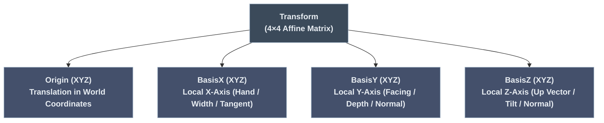
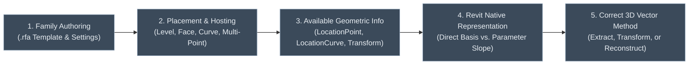
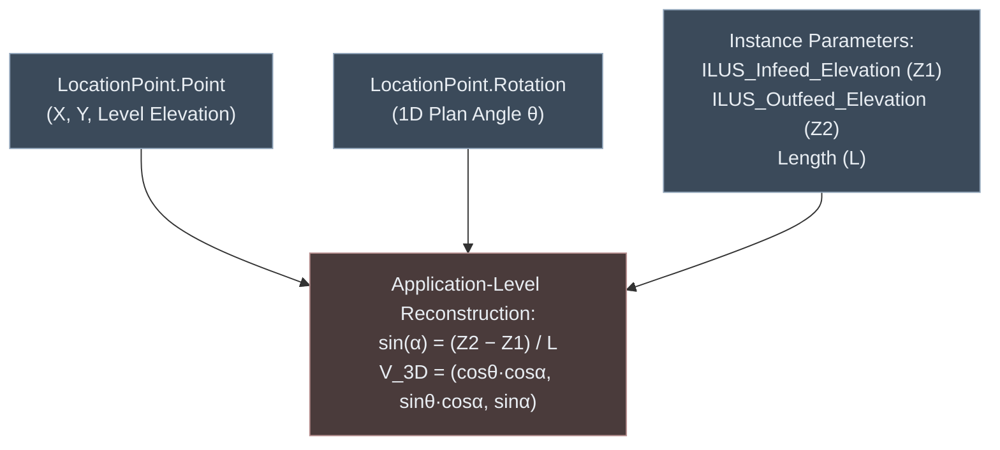
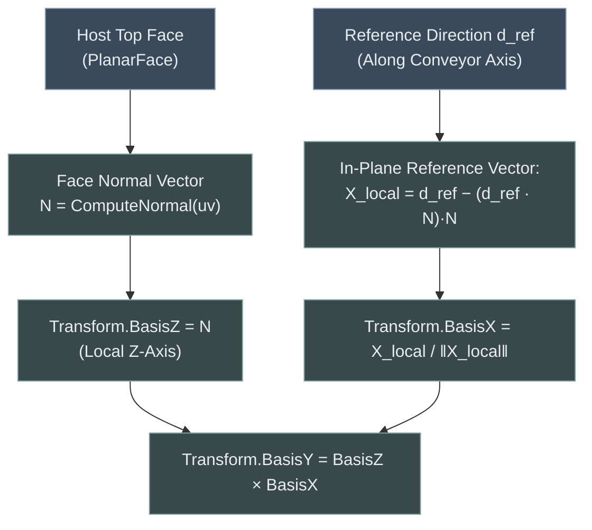
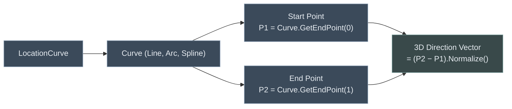
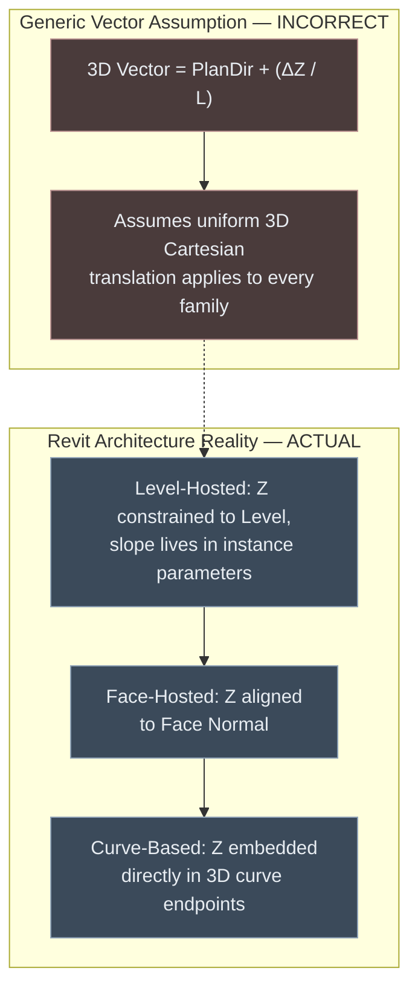
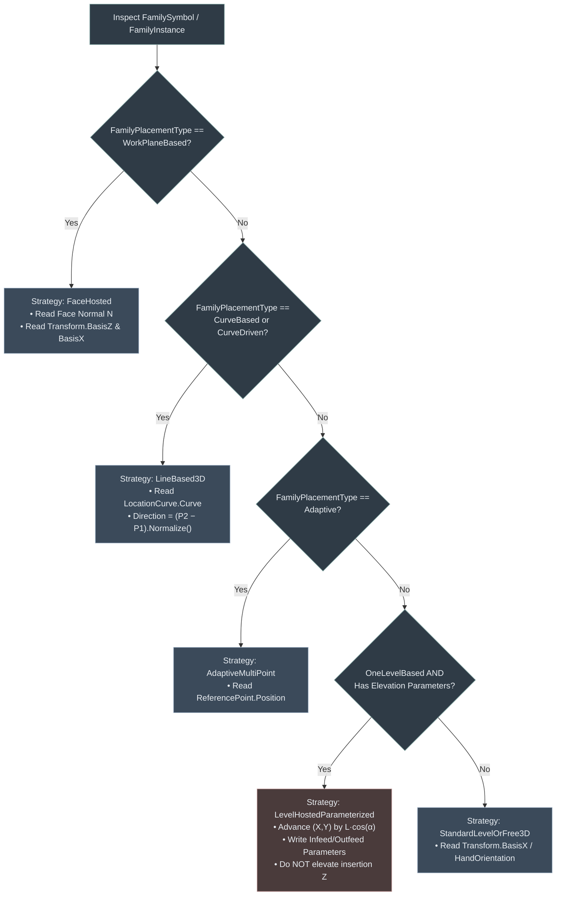

# Module 10 — Transform & 3D Spatial Vector Architecture

## 1. Transform Mental Model

A Transform in Revit is a 4×4 affine matrix representing Translation (origin in world space), Rotation (orientation of local coordinate axes: BasisX, BasisY, BasisZ), and Scale. In the Revit API, it is exposed via the [`Autodesk.Revit.DB.Transform`](file:///c:/Users/Mostafa.Badr/Downloads/00/00-%20Repos/RevitSamples/RevitApiSamples/Samples/Transform/Commands/TransformGeometryCommand.cs) class.



---

## 2. The Core Principle: Family Placement Architecture Governs 3D Vector Calculations

> [!IMPORTANT]
> **Fundamental Architectural Rule:**
> **We must calculate 3D direction vectors according to the way Revit creates, hosts, and constrains the family, rather than forcing every element into a single universal calculation.**
>
> In CAD/OpenGL/Unity, 3D orientation is purely mathematical (translation vector + quaternion/Euler rotation applied to raw vertices). In Autodesk Revit, element geometry is strictly governed by **BIM Hosting Paradigms** and internal family definition constraints (`.rfa`).

### The 5-Stage Spatial Resolution Pipeline



---

## 3. Location vs. Transform in Revit API

| Feature | Location (`LocationPoint` / `LocationCurve`) | Transform (`GetTransform()` / `GetTotalTransform()`) |
| :--- | :--- | :--- |
| **Object Class** | Subclass of `Autodesk.Revit.DB.Location` | `Autodesk.Revit.DB.Transform` |
| **Availability** | Available on all model elements (`Element.Location`). | Available on `FamilyInstance`, `RevitLinkInstance`, `GeometryInstance`. |
| **Exposed Degrees of Freedom** | Punctual position (`Point`) or linear curve (`Curve`). `LocationPoint.Rotation` is a **1D scalar angle around a vertical axis only**. | Full 3D orthonormal basis (`BasisX`, `BasisY`, `BasisZ`) and origin. |
| **3D Tilt / Incline Detection** | ❌ Cannot detect pitch or roll on Level-hosted families. | ✔ Authoritative source of true geometric tilt (`BasisZ`). |
| **System Families** | Primary position mechanism (`LocationCurve` for Walls, Pipes, Ducts). | ❌ Not exposed directly on system family instances. |

---

## 4. Master 3D Vector & Family Placement Classification Matrix

The following matrix classifies all family and placement cases in Revit, defining what geometric information is exposed and how the 3D direction vector must be calculated.

| Case # | Family & Placement Architecture | Creation API / Hosting Type | Available Geometric Information | How to Determine 3D Direction Vector | Additional Parameters / Data Required | Limitations & Constraints |
| :---: | :--- | :--- | :--- | :--- | :--- | :--- |
| **1** | **Level-Hosted Point Family**<br>(Conveyors, Box Families, Free-Standing Equipment) | `NewFamilyInstance(XYZ, symbol, Level, NonStructural)`<br>`FamilyPlacementType.OneLevelBased` | • `LocationPoint.Point`<br>• `LocationPoint.Rotation` (plan angle θ)<br>• `HandOrientation` / `FacingOrientation` (Z component = 0) | **Reconstruct via Parameterized Math** — see Section 5.1 & Section 6.1:<br>Combine plan rotation angle with slope angle derived from `(Z_out − Z_in) / Length` to construct 3D unit vector. | `Infeed_Elevation`, `Outfeed_Elevation`, `Length` (instance parameters) | `LocationPoint.Rotation` is 1D scalar about global Z; slope is **not** stored in Revit's transform matrix. Translating origin in Z + writing parameters causes **double-elevation**. |
| **2** | **Face-Hosted / Work-Plane Family**<br>(Guard Rails, Brackets, Face Mounted Fixtures) | `NewFamilyInstance(Face, XYZ, XYZ, symbol)`<br>`FamilyPlacementType.WorkPlaneBased` | • Host `Face`<br>• `Face.ComputeNormal(uv)`<br>• In-plane reference direction (`d_ref`)<br>• `GetTransform().BasisZ` | **Direct Extraction from Transform / Face** — see Section 5.2 & Section 6.2:<br>Local Z = face normal; local X = reference direction projected onto face plane; local Y = Z × X. | Valid host `Face` and in-plane reference vector | Requires `Always Vertical = False` in `.rfa`. If `Always Vertical = True`, Revit forces `BasisZ` to (0, 0, 1) even on a sloped face. |
| **3** | **Curve-Based Family (Linear)**<br>(Walls, Beams, Ducts, Pipes, Line-Based Loadable) | `NewFamilyInstance(Curve, symbol, Level, ...)`<br>`Wall.Create(doc, Curve, ...)`<br>`FamilyPlacementType.CurveBased` | • `LocationCurve.Curve`<br>• Start Point: `Curve.GetEndPoint(0)`<br>• End Point: `Curve.GetEndPoint(1)` | **Direct Native Vector Subtraction** — see Section 5.3 & Section 6.3:<br>Direction = (EndPoint − StartPoint), normalized.<br>Or `Line.Direction` / `ComputeDerivatives` | None (native curve geometry) | Casting `Location` to `LocationPoint` throws `InvalidCastException`. True 3D slope is encoded directly in curve coordinates. |
| **4** | **Free 3D Spatial Component**<br>(Unhosted 3D equipment, tilted structural braces) | `NewFamilyInstance(XYZ, symbol, StructuralType)` + 3D Axis Rotation<br>`Always Vertical = False` | • `GetTransform().BasisX`<br>• `GetTransform().BasisY`<br>• `GetTransform().BasisZ`<br>• `GetTransform().Origin` | **Direct 3D Matrix Basis Read** — see Section 5.4 & Section 6.4:<br>Longitudinal = `Transform.BasisX`<br>Transverse = `Transform.BasisY`<br>Up/Normal = `Transform.BasisZ` | Requires 3D rotation via `ElementTransformUtils.RotateElement` | Family Editor setting `FAMILY_ALWAYS_VERTICAL` must be explicitly set to `0` (False). |
| **5** | **MEP Connected Family**<br>(Pumps, Air Handlers, Valves, Connected Machinery) | Point-based or Hosted, but equipped with `MEPModel` connectors | • `MEPModel.ConnectorManager`<br>• `Connector.Origin`<br>• `Connector.CoordinateSystem.BasisZ` | **Direct Connector Port Orientation** — see Section 5.5 & Section 6.5:<br>Flow direction = `Connector.CoordinateSystem.BasisZ`<br>Port position = `Connector.Origin` | `MEPModel` must not be null | Connector directions represent fluid/electrical flow vectors, independent of the family insertion origin. |
| **6** | **Adaptive Multi-Point Family**<br>(Complex trusses, curved conveyors, panels) | `AdaptiveComponentInstanceUtils.CreateAdaptiveComponentInstance`<br>`FamilyPlacementType.Adaptive` | • `AdaptiveComponentInstanceUtils`<br>• Ordered `ReferencePoint` element IDs<br>• `ReferencePoint.Position` (XYZ) | **Point-to-Point Vector Reconstruction** — see Section 5.6 & Section 6.5:<br>Direction = (NextPoint − CurrentPoint), normalized, for each consecutive pair of `ReferencePoint.Position` values. | None (read from placement point elements) | `Location` is `null` or degenerate; cannot use `LocationPoint` or `LocationCurve`. Position is defined solely by placement points. |
| **7** | **Two-Level Structural Member**<br>(Vertical vs. Slanted Structural Columns) | `NewFamilyInstance(XYZ, symbol, baseLvl, topLvl, Column)`<br>`FamilyPlacementType.TwoLevelsBased` | • `SLANTED_COLUMN_TYPE_PARAM`<br>• Vertical: `LocationPoint`<br>• Slanted: `LocationCurve` | **Dynamic Type Check:**<br>• If Vertical: direction = (0, 0, 1)<br>• If Slanted: direction = `LocationCurve.Curve.Direction` | Built-in parameter `SLANTED_COLUMN_TYPE_PARAM` | When slanted, Revit converts `Location` from `LocationPoint` to `LocationCurve` on the fly. Blind casting throws `InvalidCastException`. |

---

## 5. Detailed Breakdown of Each Placement Case

### Case 1: Level-Hosted Point Family (`OneLevelBased`)



1. **How Created/Placed:** `doc.Create.NewFamilyInstance(XYZ, symbol, level, StructuralType.NonStructural)`.
2. **Exposed Information:** `LocationPoint.Point` (X, Y on Level plane; Z is Level elevation) and `LocationPoint.Rotation` (1D scalar angle in radians about vertical Z).
3. **Retrieval vs. Reconstruction:** **Reconstruction is mandatory.** Revit's internal object model has *no field* for 3D tilt on level-hosted instances.
4. **Mathematical Formulation:**

$$
\Delta Z = Z_{\text{outfeed}} - Z_{\text{infeed}}
$$

$$
\sin\alpha = \frac{\Delta Z}{L}, \qquad \cos\alpha = \sqrt{1 - \sin^2\alpha}
$$

$$
\vec{u}_{\text{3D}} = \left( \cos\theta_{\text{plan}} \cdot \cos\alpha,\ \sin\theta_{\text{plan}} \cdot \cos\alpha,\ \sin\alpha \right)
$$

5. **Key Code Implementation:** Implemented in [`TransformGeometryUtils.Get3DDirection`](file:///c:/Users/Mostafa.Badr/Downloads/00/00-%20Repos/RevitSamples/RevitApiSamples/Samples/Transform/Helpers/TransformGeometryUtils.cs#L125-L165) and [`GetLocationPointEndPointCommand.cs`](file:///c:/Users/Mostafa.Badr/Downloads/00/00-%20Repos/RevitSamples/RevitApiSamples/Samples/Transform/Commands/GetLocationPointEndPointCommand.cs).

---

### Case 2: Face-Hosted / Work-Plane-Based Family (`WorkPlaneBased`)



1. **How Created/Placed:** `doc.Create.NewFamilyInstance(face, referencePoint, referenceDirection, symbol)`.
2. **Exposed Information:** The host `Face` geometry, surface normal $\vec{N}$, and `instance.GetTransform()`.
3. **Retrieval vs. Reconstruction:** **Direct Retrieval from 3D Transform Matrix.** The instance's local Z-axis ($\text{BasisZ}$) snaps directly to the host face normal $\vec{N}_{\text{face}}$.
4. **Mathematical Formulation:**

$$
\hat{Z}_{\text{local}} = \vec{N}_{\text{face}}
$$

$$
\vec{X}_{\text{proj}} = \vec{d}_{\text{ref}} - (\vec{d}_{\text{ref}} \cdot \hat{Z}_{\text{local}})\,\hat{Z}_{\text{local}}, \qquad \hat{X}_{\text{local}} = \frac{\vec{X}_{\text{proj}}}{\lVert \vec{X}_{\text{proj}} \rVert}
$$

$$
\hat{Y}_{\text{local}} = \hat{Z}_{\text{local}} \times \hat{X}_{\text{local}}
$$

5. **Key Code Implementation:** Implemented in [`TransformGeometryUtils.GetGuardRailReferenceDirection`](file:///c:/Users/Mostafa.Badr/Downloads/00/00-%20Repos/RevitSamples/RevitApiSamples/Samples/Transform/Helpers/TransformGeometryUtils.cs#L235-L250) and [`TransformGeometryUtils.GetTopFace`](file:///c:/Users/Mostafa.Badr/Downloads/00/00-%20Repos/RevitSamples/RevitApiSamples/Samples/Transform/Helpers/TransformGeometryUtils.cs#L190-L230).

---

### Case 3: Curve-Based Family (`CurveBased` / Linear System Families)



1. **How Created/Placed:** `doc.Create.NewFamilyInstance(curve, symbol, level, StructuralType)` or `Wall.Create(doc, curve, levelId, false)`.
2. **Exposed Information:** `LocationCurve.Curve`, start coordinate $P_1$, end coordinate $P_2$, `Line.Direction`.
3. **Retrieval vs. Reconstruction:** **Direct Native Vector Subtraction.** Both $P_1$ and $P_2$ already exist as true 3D spatial coordinates in world space.
4. **Mathematical Formulation:**

$$
\vec{u}_{\text{3D}} = \frac{P_2 - P_1}{\lVert P_2 - P_1 \rVert}
$$

For curved paths (Arcs/Splines), tangent at parameter $t$:

$$
\vec{T}(t) = \text{Curve.ComputeDerivatives}(t,\ \text{normalized: true}).\text{BasisX}.\text{Normalize}()
$$

5. **Key Code Implementation:** Implemented in [`DivideCurveByDistanceCommand.cs`](file:///c:/Users/Mostafa.Badr/Downloads/00/00-%20Repos/RevitSamples/RevitApiSamples/Samples/Transform/Commands/DivideCurveByDistanceCommand.cs) and [`GetPointOnCurveCommand.cs`](file:///c:/Users/Mostafa.Badr/Downloads/00/00-%20Repos/RevitSamples/RevitApiSamples/Samples/Transform/Commands/GetPointOnCurveCommand.cs).

---

### Case 4: Free 3D Spatial Component (`Always Vertical = False`)

1. **How Created/Placed:** `doc.Create.NewFamilyInstance(XYZ, symbol, StructuralType)` followed by `ElementTransformUtils.RotateElement(doc, id, axisLine, pitchAngle)`.
2. **Exposed Information:** `instance.GetTransform()` and `instance.GetTotalTransform()`.
3. **Retrieval vs. Reconstruction:** **Direct 3D Matrix Basis Read.** The 3D orientation is explicitly represented in the 4×4 affine transform.
4. **Mathematical Formulation:**

$$
\vec{u}_{\text{longitudinal}} = \text{Transform.BasisX}
$$

$$
\vec{u}_{\text{transverse}} = \text{Transform.BasisY}
$$

$$
\vec{u}_{\text{up}} = \text{Transform.BasisZ}
$$

5. **Key Code Implementation:** Implemented in [`TransformGeometryCommand.cs`](file:///c:/Users/Mostafa.Badr/Downloads/00/00-%20Repos/RevitSamples/RevitApiSamples/Samples/Transform/Commands/TransformGeometryCommand.cs).

---

### Case 5: MEP Connected Family (`MEPModel`)

1. **How Created/Placed:** Point-based or face-hosted MEP equipment instances containing physical connection ports.
2. **Exposed Information:** `familyInstance.MEPModel.ConnectorManager.Connectors`.
3. **Retrieval vs. Reconstruction:** **Direct Connector Port Coordinate Frame.**
4. **Mathematical Formulation:**

$$
P_{\text{port}} = \text{Connector.Origin}
$$

$$
\vec{u}_{\text{flow}} = \text{Connector.CoordinateSystem.BasisZ}
$$

5. **Key Code Implementation:** Implemented in [`TransformGeometryUtils.GetConnectorDirections`](file:///c:/Users/Mostafa.Badr/Downloads/00/00-%20Repos/RevitSamples/RevitApiSamples/Samples/Transform/Helpers/TransformGeometryUtils.cs#L260-L280) and [`GetLocationPointEndPointCommand.cs`](file:///c:/Users/Mostafa.Badr/Downloads/00/00-%20Repos/RevitSamples/RevitApiSamples/Samples/Transform/Commands/GetLocationPointEndPointCommand.cs#L123-L138).

---

### Case 6: Adaptive Multi-Point Component (`Adaptive`)

1. **How Created/Placed:** `AdaptiveComponentInstanceUtils.CreateAdaptiveComponentInstance(doc, symbol)`.
2. **Exposed Information:** Ordered array of `ReferencePoint` element IDs.
3. **Retrieval vs. Reconstruction:** **Point-to-Point Explicit 3D Vector.** `Location` is degenerate; coordinates are read from `ReferencePoint.Position`.
4. **Mathematical Formulation:**

$$
\vec{u}_{i \to i+1} = \frac{P_{i+1} - P_i}{\lVert P_{i+1} - P_i \rVert}
$$

5. **Key Code Implementation:** Implemented in [`TransformGeometryUtils.GetAdaptivePlacementPoints`](file:///c:/Users/Mostafa.Badr/Downloads/00/00-%20Repos/RevitSamples/RevitApiSamples/Samples/Transform/Helpers/TransformGeometryUtils.cs#L282-L300).

---

### Case 7: Two-Level Structural Column (`TwoLevelsBased`)

1. **How Created/Placed:** `doc.Create.NewFamilyInstance(XYZ, symbol, baseLevel, topLevel, StructuralType.Column)`.
2. **Dynamic Behavior:**
   * If `SLANTED_COLUMN_TYPE_PARAM == CT_Vertical`: `Location` is `LocationPoint`. Orientation vector is strictly vertical $(0, 0, 1)$. Length is driven by level heights and offsets.
   * If `SLANTED_COLUMN_TYPE_PARAM == CT_EndPoint` or `CT_Angle`: Revit dynamically transforms `Location` into a `LocationCurve`. Direction must be read from `((LocationCurve)inst.Location).Curve`.

---

## 6. Side-by-Side Code Implementation Comparison Across All Placement Types

The following section contrasts the concrete C# code implementations for each of the placement paradigms, highlighting common anti-patterns vs. production BIM patterns.

### 6.1 Level-Hosted Parameterized Placement vs. The Double-Elevation Bug

```csharp
// ============================================================================
// ❌ WRONG: Applying Generic 3D Vectors to Level-Hosted Families
// ============================================================================
public void PlaceConveyor_AntiPattern(Document doc, FamilySymbol symbol, Level level, 
                                      XYZ startPoint, Point3D dir3D, double length, double zIn, double zOut)
{
    // Bug 1: Elevating insertion point Z by deltaZ
    XYZ elevatedInsertionPoint = startPoint + new XYZ(dir3D.X * length, dir3D.Y * length, dir3D.Z * length);
    
    FamilyInstance inst = doc.Create.NewFamilyInstance(
        elevatedInsertionPoint, symbol, level, StructuralType.NonStructural);
    
    // Bug 2: Setting Infeed Elevation to zIn on an ALREADY elevated instance origin
    // Result: Geometry rises twice (2 x deltaZ), detaching from adjacent equipment!
    inst.LookupParameter("ILUS_Infeed_Elevation")?.Set(zIn);
    inst.LookupParameter("ILUS_Outfeed_Elevation")?.Set(zOut);
}

// ============================================================================
// ✔ CORRECT: Horizontal Footprint + Parameterized Rise (BIM Pattern)
// ============================================================================
public FamilyInstance PlaceConveyor_ProductionPattern(Document doc, FamilySymbol symbol, Level level, 
                                                      XYZ startPoint, double planRotationAngle, 
                                                      double length, double zIn, double zOut)
{
    // Step 1: Compute true 3D direction and horizontal footprint run
    Point3D planDir = new Point3D(Math.Cos(planRotationAngle), Math.Sin(planRotationAngle), 0);
    Point3D dir3D = TransformGeometryUtils.Get3DDirection(planDir, zIn, zOut, length);
    
    // Step 2: Keep insertion Z constrained strictly to Level (or Level + Base Offset)
    XYZ levelInsertionPoint = new XYZ(startPoint.X, startPoint.Y, level.Elevation);
    
    FamilyInstance inst = doc.Create.NewFamilyInstance(
        levelInsertionPoint, symbol, level, StructuralType.NonStructural);
    
    // Step 3: Rotate instance in plan about global Z
    ElementTransformUtils.RotateElement(
        doc, inst.Id, 
        Line.CreateBound(levelInsertionPoint, levelInsertionPoint + XYZ.BasisZ), 
        planRotationAngle);
    
    // Step 4: Drive slope purely through parameters (Revit handles internal geometry rise)
    inst.LookupParameter("Length")?.Set(length);
    inst.LookupParameter("ILUS_Infeed_Elevation")?.Set(zIn);
    inst.LookupParameter("ILUS_Outfeed_Elevation")?.Set(zOut);
    
    return inst;
}
```

---

### 6.2 Face-Hosted Work-Plane Placement (Guard Rail on Sloped Top Face)

```csharp
// ============================================================================
// Placement on Inclined Host Face (Guard Rails, Brackets)
// ============================================================================
public FamilyInstance PlaceFaceHostedComponent(Document doc, FamilyInstance hostConveyor, 
                                               FamilySymbol railSymbol, double offsetAlongConveyor)
{
    // 1. Detect host top face and extract world normal
    Face topFace = TransformGeometryUtils.GetTopFace(hostConveyor, out Point3D faceOrigin, out Point3D faceNormal);
    if (topFace == null) throw new InvalidOperationException("Host conveyor has no valid planar top face.");

    // 2. Derive longitudinal travel direction from host instance
    Point3D hostDir = TransformGeometryUtils.GetFacingDirection(hostConveyor);

    // 3. Project longitudinal direction onto the sloped face plane to get in-plane reference vector
    Point3D refDir = TransformGeometryUtils.GetGuardRailReferenceDirection(hostDir, faceNormal);

    // 4. Calculate placement point on sloped face
    Point3D hostOrigin = TransformGeometryUtils.GetOrigin(hostConveyor);
    Point3D rawPlacementPoint = hostOrigin + (hostDir * offsetAlongConveyor);
    Point3D faceSnappedPoint = TransformGeometryUtils.ProjectToPlaneVertically(rawPlacementPoint, faceOrigin, faceNormal);

    // 5. Place face-hosted instance
    FamilyInstance railInstance = doc.Create.NewFamilyInstance(
        topFace, 
        TransformGeometryUtils.ToXYZ(faceSnappedPoint), 
        TransformGeometryUtils.ToXYZ(refDir), 
        railSymbol);

    return railInstance;
}
```

---

### 6.3 Line-Based 3D Curve Placement (`PlanPlacements3D`)

```csharp
// ============================================================================
// Placement of Consecutive 3D Line-Based Segments (CurveBased Families)
// ============================================================================
public List<FamilyInstance> Place3DLineBasedRun(Document doc, FamilySymbol lineBasedSymbol, Level level,
                                                Point3D infeedOrigin, Point3D planDirection,
                                                double zIn, double zOut, double totalRunLength,
                                                IReadOnlyList<double> segmentLengths)
{
    // 1. Calculate overall 3D direction vector
    Point3D dir3D = TransformGeometryUtils.Get3DDirection(planDirection, zIn, zOut, totalRunLength);

    // 2. Generate consecutive 3D endpoints (P1, P2) for each segment
    List<(Point3D P1, Point3D P2)> placements = TransformGeometryUtils.PlanPlacements3D(
        infeedOrigin, dir3D, segmentLengths);

    var createdInstances = new List<FamilyInstance>();

    // 3. Create 3D bound lines and instantiate curve-based families
    foreach (var (p1, p2) in placements)
    {
        Line curve3D = Line.CreateBound(
            TransformGeometryUtils.ToXYZ(p1), 
            TransformGeometryUtils.ToXYZ(p2));

        FamilyInstance inst = doc.Create.NewFamilyInstance(
            curve3D, lineBasedSymbol, level, StructuralType.NonStructural);

        createdInstances.Add(inst);
    }

    return createdInstances;
}
```

---

### 6.4 Free 3D Unhosted Component with 3D Axis Rotation

```csharp
// ============================================================================
// Free 3D Component Placement (Always Vertical = False)
// ============================================================================
public FamilyInstance PlaceFree3DComponent(Document doc, FamilySymbol symbol, XYZ insertionPoint, 
                                           XYZ planDirection, double pitchAngleRadians)
{
    // Precondition: FAMILY_ALWAYS_VERTICAL must be 0 in family definition
    Parameter verticalParam = symbol.Family.get_Parameter(BuiltInParameter.FAMILY_ALWAYS_VERTICAL);
    if (verticalParam != null && verticalParam.AsInteger() != 0)
    {
        throw new InvalidOperationException("Family must have 'Always Vertical' unchecked in Family Editor.");
    }

    // 1. Place instance at insertion XYZ
    FamilyInstance inst = doc.Create.NewFamilyInstance(insertionPoint, symbol, StructuralType.NonStructural);
    doc.Regenerate();

    // 2. Create rotation axis perpendicular to plan direction in horizontal plane
    XYZ rotationAxisDir = new XYZ(-planDirection.Y, planDirection.X, 0).Normalize();
    Line pitchAxis = Line.CreateBound(insertionPoint, insertionPoint + rotationAxisDir);

    // 3. Rotate element in 3D around pitch axis
    ElementTransformUtils.RotateElement(doc, inst.Id, pitchAxis, pitchAngleRadians);
    doc.Regenerate();

    // 4. Verify true 3D tilt via BasisZ
    Transform tf = inst.GetTransform();
    XYZ actualUpVector = tf.BasisZ; // Local normal now tilts in world space

    return inst;
}
```

---

### 6.5 MEP Flow Vectors & Slanted Structural Columns

```csharp
// ============================================================================
// MEP Flow Extraction vs. Slanted Column Location Curve
// ============================================================================
public static void AnalyzeSpecializedOrientations(Element element)
{
    // A. MEP Connected Equipment
    if (element is FamilyInstance fi && fi.MEPModel?.ConnectorManager != null)
    {
        foreach (Connector conn in fi.MEPModel.ConnectorManager.Connectors)
        {
            XYZ portOrigin = conn.Origin;
            XYZ flowDirection = conn.CoordinateSystem.BasisZ; // Authoritative flow vector
        }
    }

    // B. Two-Level Structural Columns (Dynamic Location Type Switching)
    if (element is FamilyInstance col && col.StructuralType == StructuralType.Column)
    {
        Parameter slantedParam = col.get_Parameter(BuiltInParameter.SLANTED_COLUMN_TYPE_PARAM);
        int slantedType = slantedParam?.AsInteger() ?? 0; // 0 = Vertical, 1 = Angle, 2 = EndPoint

        if (slantedType != 0 && col.Location is LocationCurve locCurve)
        {
            // Slanted column exposes LocationCurve
            XYZ p1 = locCurve.Curve.GetEndPoint(0);
            XYZ p2 = locCurve.Curve.GetEndPoint(1);
            XYZ columnAxis = (p2 - p1).Normalize();
        }
        else if (col.Location is LocationPoint locPoint)
        {
            // Vertical column exposes LocationPoint
            XYZ basePoint = locPoint.Point;
            XYZ verticalAxis = XYZ.BasisZ;
        }
    }
}
```

---

## 7. Master Spatial Helpers: The Complete `TransformGeometryUtils` Reference Library

The complete implementation is available directly in [`TransformGeometryUtils.cs`](file:///c:/Users/Mostafa.Badr/Downloads/00/00-%20Repos/RevitSamples/RevitApiSamples/Samples/Transform/Helpers/TransformGeometryUtils.cs):

```csharp
using System;
using System.Collections.Generic;
using System.Linq;
using Autodesk.Revit.DB;

namespace RevitApiSamples.Samples.Transform.Helpers
{
    /// <summary>
    /// Lightweight 3D point/vector struct used for pre-Revit geometric and spatial calculations.
    /// Deliberately independent of Autodesk.Revit.DB.XYZ so spatial algorithms
    /// can be unit-tested without a running Revit session.
    /// </summary>
    public readonly struct Point3D : IEquatable<Point3D>
    {
        public double X { get; }
        public double Y { get; }
        public double Z { get; }

        public static Point3D Zero => new Point3D(0, 0, 0);
        public static Point3D BasisX => new Point3D(1, 0, 0);
        public static Point3D BasisY => new Point3D(0, 1, 0);
        public static Point3D BasisZ => new Point3D(0, 0, 1);

        public Point3D(double x, double y, double z)
        {
            X = x; Y = y; Z = z;
        }

        public double Length => Math.Sqrt(X * X + Y * Y + Z * Z);
        public Point3D Normalized()
        {
            double len = Length;
            return len < 1e-9 ? Zero : new Point3D(X / len, Y / len, Z / len);
        }

        public double DotProduct(Point3D other) => X * other.X + Y * other.Y + Z * other.Z;
        public Point3D CrossProduct(Point3D other) =>
            new Point3D(Y * other.Z - Z * other.Y, Z * other.X - X * other.Z, X * other.Y - Y * other.X);

        public static Point3D operator +(Point3D a, Point3D b) => new Point3D(a.X + b.X, a.Y + b.Y, a.Z + b.Z);
        public static Point3D operator -(Point3D a, Point3D b) => new Point3D(a.X - b.X, a.Y - b.Y, a.Z - b.Z);
        public static Point3D operator *(Point3D a, double s) => new Point3D(a.X * s, a.Y * s, a.Z * s);

        public bool Equals(Point3D other) =>
            Math.Abs(X - other.X) < 1e-7 && Math.Abs(Y - other.Y) < 1e-7 && Math.Abs(Z - other.Z) < 1e-7;

        public override bool Equals(object? obj) => obj is Point3D other && Equals(other);
        public override int GetHashCode() => HashCode.Combine(X, Y, Z);
        public override string ToString() => $"({X:F3}, {Y:F3}, {Z:F3})";
    }

    /// <summary>
    /// Master spatial and geometric utility library implementing the 3D Vector & Family Placement Architecture.
    /// </summary>
    public static class TransformGeometryUtils
    {
        public static Point3D ToPoint3D(XYZ xyz) => new Point3D(xyz.X, xyz.Y, xyz.Z);
        public static XYZ ToXYZ(Point3D p) => new XYZ(p.X, p.Y, p.Z);

        public static Point3D GetFacingDirection(FamilyInstance instance)
        {
            Transform transform = instance.GetTotalTransform();
            return ToPoint3D(transform.BasisX).Normalized();
        }

        public static Point3D GetOrigin(FamilyInstance instance)
        {
            if (instance.Location is LocationPoint lp) return ToPoint3D(lp.Point);
            throw new InvalidOperationException($"Instance '{instance.Name}' missing LocationPoint.");
        }

        public static Point3D Get3DDirection(Point3D planDirection, double zIn, double zOut, double totalLength)
        {
            if (totalLength <= 1e-9) throw new ArgumentException("Total length must be positive.", nameof(totalLength));
            double horizLen = Math.Sqrt(planDirection.X * planDirection.X + planDirection.Y * planDirection.Y);
            if (horizLen < 1e-9) throw new ArgumentException("Plan direction must have non-zero horizontal component.", nameof(planDirection));

            double deltaZ = zOut - zIn;
            double sinAlpha = Math.Max(-1.0, Math.Min(1.0, deltaZ / totalLength));
            double cosAlpha = Math.Sqrt(Math.Max(0.0, 1.0 - sinAlpha * sinAlpha));

            return new Point3D((planDirection.X / horizLen) * cosAlpha, (planDirection.Y / horizLen) * cosAlpha, sinAlpha);
        }

        public static List<(Point3D P1, Point3D P2)> PlanPlacements3D(Point3D origin, Point3D dir3D, IReadOnlyList<double> segmentLengths)
        {
            var placements = new List<(Point3D P1, Point3D P2)>(segmentLengths.Count);
            double offset = 0.0;
            foreach (double len in segmentLengths)
            {
                Point3D p1 = origin + (dir3D * offset);
                Point3D p2 = p1 + (dir3D * len);
                placements.Add((p1, p2));
                offset += len;
            }
            return placements;
        }

        public static Face? GetTopFace(FamilyInstance instance, out Point3D origin, out Point3D normal)
        {
            origin = Point3D.Zero; normal = Point3D.BasisZ;
            var options = new Options { ComputeReferences = true, DetailLevel = ViewDetailLevel.Fine };
            GeometryElement? geoElement = instance.get_Geometry(options);
            if (geoElement == null) return null;

            var faces = new List<(PlanarFace Face, XYZ WorldNormal, XYZ WorldOrigin)>();
            CollectPlanarFaces(geoElement, Transform.Identity, faces);

            XYZ instanceUp = instance.GetTransform().OfVector(XYZ.BasisZ).Normalize();
            var best = faces.Where(f => f.WorldNormal.DotProduct(instanceUp) > 0.5)
                            .OrderByDescending(f => f.Face.Area)
                            .FirstOrDefault();

            if (best.Face == null) return null;
            origin = ToPoint3D(best.WorldOrigin);
            normal = ToPoint3D(best.WorldNormal);
            return best.Face;
        }

        private static void CollectPlanarFaces(GeometryElement geoElem, Transform currentTransform, List<(PlanarFace Face, XYZ WorldNormal, XYZ WorldOrigin)> faces)
        {
            foreach (GeometryObject geoObj in geoElem)
            {
                if (geoObj is Solid solid && solid.Volume > 0)
                {
                    foreach (Face face in solid.Faces)
                    {
                        if (face is PlanarFace pf)
                            faces.Add((pf, currentTransform.OfVector(pf.FaceNormal).Normalize(), currentTransform.OfPoint(pf.Origin)));
                    }
                }
                else if (geoObj is GeometryInstance geoInst)
                {
                    GeometryElement? symGeo = geoInst.GetSymbolGeometry();
                    if (symGeo != null) CollectPlanarFaces(symGeo, currentTransform.Multiply(geoInst.Transform), faces);
                }
            }
        }

        public static Point3D GetGuardRailReferenceDirection(Point3D longitudinalDirection, Point3D topFaceNormal)
        {
            Point3D horizontal = new Point3D(longitudinalDirection.X, longitudinalDirection.Y, 0);
            horizontal = horizontal.Length < 1e-9 ? Point3D.BasisX : horizontal.Normalized();
            double dot = horizontal.DotProduct(topFaceNormal);
            Point3D dir = horizontal - (topFaceNormal * dot);
            return dir.Length < 1e-9 ? horizontal : dir.Normalized();
        }

        public static Point3D ProjectToPlaneVertically(Point3D point, Point3D planeOrigin, Point3D planeNormal)
        {
            if (Math.Abs(planeNormal.Z) < 1e-9) return point;
            Point3D delta = planeOrigin - point;
            double t = delta.DotProduct(planeNormal) / planeNormal.Z;
            return new Point3D(point.X, point.Y, point.Z + t);
        }

        public static PlacementStrategy DetermineStrategy(FamilySymbol symbol)
        {
            Family family = symbol.Family;
            if (family.FamilyPlacementType == FamilyPlacementType.WorkPlaneBased) return PlacementStrategy.FaceHosted;
            if (family.FamilyPlacementType == FamilyPlacementType.CurveBased || family.FamilyPlacementType == FamilyPlacementType.CurveDrivenStructural) return PlacementStrategy.LineBased3D;
            if (family.FamilyPlacementType == FamilyPlacementType.Adaptive) return PlacementStrategy.AdaptiveMultiPoint;

            bool hasElevationParams = symbol.LookupParameter("ILUS_Infeed_Elevation") != null || symbol.LookupParameter("Infeed_Elevation") != null;
            if (family.FamilyPlacementType == FamilyPlacementType.OneLevelBased && hasElevationParams) return PlacementStrategy.LevelHostedParameterized;

            Parameter? alwaysVert = family.get_Parameter(BuiltInParameter.FAMILY_ALWAYS_VERTICAL);
            if (alwaysVert != null && alwaysVert.AsInteger() == 0) return PlacementStrategy.Free3DSpatial;

            return PlacementStrategy.StandardLevel2D;
        }
    }
}
```

---

## 8. Critical Investigation: Why a Single "Generic `Get3DDirection`" Method is Flawed

In many codebases, developers attempt to write a single generic utility method (e.g. `Get3DDirection(planDirection, zIn, zOut, length)`) and apply it across all families. While mathematically valid for a right triangle, this approach suffers from serious architectural flaws when applied universally across Revit.



### The 6 Fatal Assumptions of the Universal `Get3DDirection` Method

| # | Flaw / Invalid Assumption | Why It Breaks in Revit | Consequence / Failure Mode |
| :-: | :--- | :--- | :--- |
| **1** | **Assumes Infeed / Outfeed Parameters Always Exist** | Infeed/Outfeed elevation parameters are custom, application-specific conventions (e.g. `ILUS_Infeed_Elevation`). 99% of Revit families (doors, beams, ducts, equipment) do **not** have these parameters. | `NullReferenceException` or failure to resolve elevation data. |
| **2** | **Assumes Level-Based Placement Model** | If applied to a Face-Hosted family (e.g. Guard Rail on inclined top face), the generic method ignores the host face orientation and attempts to calculate a direction from global horizontal plan vectors. | Orientation mismatch; guard rails fail to align with the conveyor surface. |
| **3** | **The Double-Elevation Defect** | Level-hosted families use internal parametric geometry elevation. If code translates the insertion point by the 3D direction vector times length (raising origin Z by ΔZ) AND writes `Infeed_Elevation = Z`, the family raises itself relative to an already elevated origin. | Geometry is elevated **twice** (2 × ΔZ), breaking connections. |
| **4** | **Destroys Native Revit Geometric References** | Curve-based elements (`LocationCurve`) and MEP elements (`MEPModel`) already store true 3D vectors natively. Reconstructing them via 2D plan trigonometry throws away Revit's authoritative geometric data. | Loss of curve curvature, tangent vectors, and port flow directions. |
| **5** | **Fails on Non-Planar / Rotated Work Planes** | `LocationPoint.Rotation` is a 1D scalar. For face-hosted families on tilted surfaces with `Always Vertical = False`, `Rotation` is relative to the **tilted local Z-axis**, not global Z. | Incorrect trigonometry results; vectors misaligned with actual model geometry. |
| **6** | **Produces a Vector Revit Does Not Use** | The computed 3D vector may be mathematically sound, but Revit's constraint engine does not store or use that vector for the element's position. | False sense of correctness; code operates on hypothetical coordinates rather than Revit's actual instance transform. |

---

## 9. Pre-Flight Family Strategy Selector (C# Architecture Pattern)

Use this programmatic pattern to determine the exact placement and direction extraction strategy before executing geometric operations:



```csharp
public static class FamilyPlacementInspector
{
    public static PlacementStrategy DetermineStrategy(FamilySymbol symbol)
    {
        return TransformGeometryUtils.DetermineStrategy(symbol);
    }
}
```

---

## 10. Learning Progression (Commands 01–11)

| # | Command File | Class Name | Main API | What It Teaches |
| :---: | :--- | :--- | :--- | :--- |
| **01** | [`InspectLocationCommand.cs`](Commands/InspectLocationCommand.cs) | `InspectLocationCommand` | `LocationPoint`, `LocationCurve` | Inspecting location types and detecting whether element is point or curve based. |
| **02** | [`MoveElementCommand.cs`](Commands/MoveElementCommand.cs) | `MoveElementCommand` | `ElementTransformUtils.MoveElement()` | Translating elements in 3D world space via translation vectors. |
| **03** | [`CopyElementCommand.cs`](Commands/CopyElementCommand.cs) | `CopyElementCommand` | `ElementTransformUtils.CopyElement()` | Copying elements along a vector and capturing new element IDs. |
| **04** | [`RotateElementCommand.cs`](Commands/RotateElementCommand.cs) | `RotateElementCommand` | `ElementTransformUtils.RotateElement()` | Rotating elements around a 3D axis line in radians. |
| **05** | [`MirrorElementCommand.cs`](Commands/MirrorElementCommand.cs) | `MirrorElementCommand` | `ElementTransformUtils.MirrorElement()` | Mirroring elements across a 3D geometric plane. |
| **06** | [`TransformGeometryCommand.cs`](Commands/TransformGeometryCommand.cs) | `TransformGeometryCommand` | `GetTransform()`, `Transform.OfPoint()` | Transforming local family coordinates into project world coordinates. |
| **07** | [`GetPointOnCurveCommand.cs`](Commands/GetPointOnCurveCommand.cs) | `GetPointOnCurveCommand` | `curve.Evaluate()`, `GetEndPoint()` | Extracting points and tangent vectors along 3D linear curves. |
| **08** | [`PointFamilyStartEndCommand.cs`](Commands/PointFamilyStartEndCommand.cs) | `PointFamilyStartEndCommand` | `LocationPoint` + `GetTransform().BasisZ` | Deriving Start, End, and direction vectors for point-based families. |
| **09** | [`DivideCurveByDistanceCommand.cs`](Commands/DivideCurveByDistanceCommand.cs) | `DivideCurveByDistanceCommand` | `curve.Evaluate()`, `ComputeDerivatives()` | Sampling points along a 3D curve at fixed distance intervals. |
| **10** | [`GetLocationPointEndPointCommand.cs`](Commands/GetLocationPointEndPointCommand.cs) | `GetLocationPointEndPointCommand` | `HandOrientation`, `Transform.OfPoint`, `ConnectorManager` | Extracting true 3D Outfeed End Point, 3D Direction, Infeed/Outfeed elevations, and slope. |
| **11** | [`CalculateDirectionAndEndPointCommand.cs`](Commands/CalculateDirectionAndEndPointCommand.cs) | `CalculateDirectionAndEndPointCommand` | `HandOrientation`, `LocationCurve`, `Rotation`, `Infeed/Outfeed` | Comparative analysis of 4 direction extraction algorithms across element categories. |

---

## 11. Command 10 — Comprehensive 3D End Point & Direction Extraction Recipe

[`GetLocationPointEndPointCommand.cs`](Commands/GetLocationPointEndPointCommand.cs) demonstrates how to inspect a selected element, determine its placement architecture, and compute its 3D direction vector and End Point (Outfeed):

```csharp
[Transaction(TransactionMode.ReadOnly)]
public class GetLocationPointEndPointCommand : IExternalCommand
{
    public Result Execute(ExternalCommandData commandData, ref string message, ElementSet elements)
    {
        UIDocument uiDoc = commandData.Application.ActiveUIDocument;
        Document doc = uiDoc.Document;

        Reference pickedRef = uiDoc.Selection.PickObject(ObjectType.Element, "Select an element to analyze 3D direction");
        Element element = doc.GetElement(pickedRef);

        if (element is FamilyInstance familyInstance && element.Location is LocationPoint locPoint)
        {
            XYZ startPoint = locPoint.Point;
            double length = familyInstance.LookupParameter("Length")?.AsDouble() ?? 10.0;

            // Strategy A: Native 3D Transform Matrix (Authoritative for Loadable Families)
            Transform transform = familyInstance.GetTotalTransform();
            XYZ basisX = transform.BasisX; // Local Longitudinal Axis (Hand)
            XYZ basisY = transform.BasisY; // Local Transverse Axis (Facing)
            XYZ basisZ = transform.BasisZ; // Local Vertical / Surface Normal Axis

            XYZ endPointMatrix = transform.OfPoint(new XYZ(length, 0, 0));

            // Strategy B: Vector Ray via HandOrientation
            XYZ handDir = familyInstance.HandOrientation;
            XYZ endPointHand = startPoint + (handDir * length);

            // Strategy C: Infeed / Outfeed Z-Elevation Slope Analysis
            double infeedZ = familyInstance.LookupParameter("ILUS_Infeed_Elevation")?.AsDouble() ?? startPoint.Z;
            double outfeedZ = familyInstance.LookupParameter("ILUS_Outfeed_Elevation")?.AsDouble() ?? endPointHand.Z;
            double deltaZ = outfeedZ - infeedZ;

            double horizontalRun = Math.Sqrt(Math.Pow(endPointHand.X - startPoint.X, 2) + Math.Pow(endPointHand.Y - startPoint.Y, 2));
            double slopePercent = (horizontalRun > 0.0001) ? (deltaZ / horizontalRun) * 100.0 : 0.0;

            TaskDialog.Show("3D Direction Analysis",
                $"Element: {familyInstance.Symbol.Family.Name}\n" +
                $"Placement Type: {familyInstance.Symbol.Family.FamilyPlacementType}\n\n" +
                $"Start Point (Infeed) : ({startPoint.X:F2}, {startPoint.Y:F2}, {startPoint.Z:F2})\n" +
                $"End Point (Outfeed)  : ({endPointMatrix.X:F2}, {endPointMatrix.Y:F2}, {endPointMatrix.Z:F2})\n" +
                $"Transform BasisX    : ({basisX.X:F3}, {basisX.Y:F3}, {basisX.Z:F3})\n" +
                $"Transform BasisZ    : ({basisZ.X:F3}, {basisZ.Y:F3}, {basisZ.Z:F3})\n" +
                $"Height Delta (ΔZ)   : {deltaZ:F3} ft\n" +
                $"Calculated Slope    : {slopePercent:F1}%");
        }
        else if (element.Location is LocationCurve locCurve)
        {
            Curve curve = locCurve.Curve;
            XYZ p1 = curve.GetEndPoint(0);
            XYZ p2 = curve.GetEndPoint(1);
            XYZ dir3D = (p2 - p1).Normalize();

            TaskDialog.Show("Curve-Based 3D Direction",
                $"Start Point: ({p1.X:F2}, {p1.Y:F2}, {p1.Z:F2})\n" +
                $"End Point  : ({p2.X:F2}, {p2.Y:F2}, {p2.Z:F2})\n" +
                $"3D Direction Vector: ({dir3D.X:F3}, {dir3D.Y:F3}, {dir3D.Z:F3})\n" +
                $"Length: {curve.Length:F2} ft");
        }

        return Result.Succeeded;
    }
}
```

---

## 12. Summary & Best Practices

1. **Inspect `FamilyPlacementType` before attempting any vector calculation.**
2. **Never cast `Location` blindly to `LocationPoint`** — curve-based families throw exceptions, and adaptive families return invalid references.
3. **Never apply sloped 3D translation vectors to `OneLevelBased` families with elevation parameters** — this causes double-elevation defects.
4. **For Face-Hosted families, extract orientation from the host face normal (`BasisZ`) and in-plane reference vector (`BasisX`).**
5. **For Curve-Based families, extract orientation directly from `LocationCurve.Curve` endpoints.**
6. **For MEP families, extract flow direction from `Connector.CoordinateSystem.BasisZ`.**
