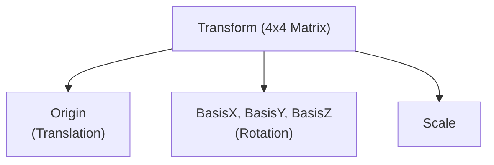
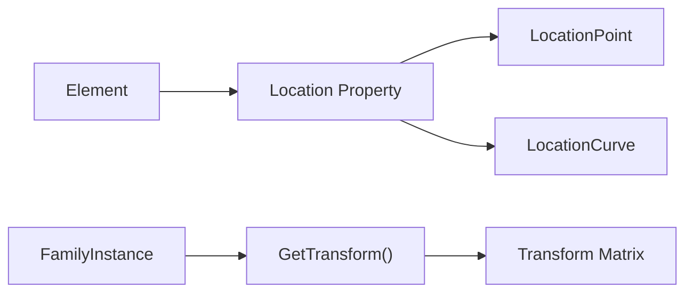
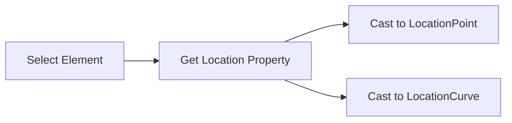
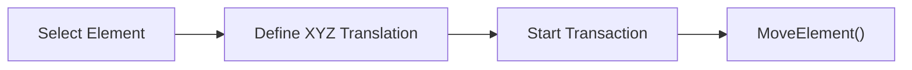
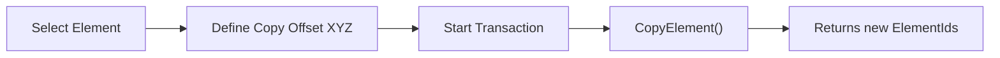
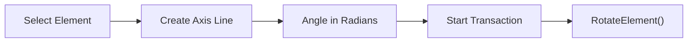
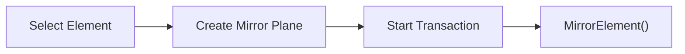
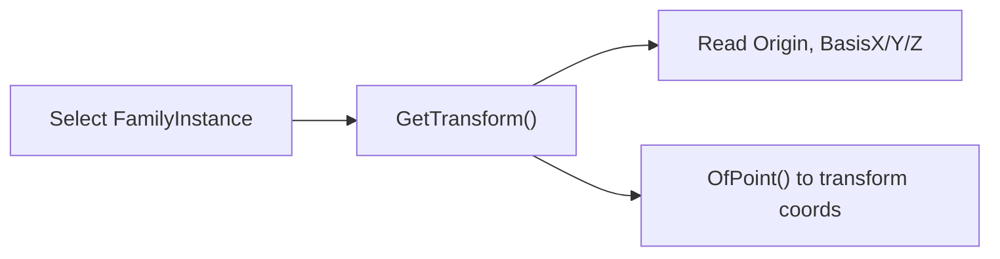

# Module 10 — Transform

## 1. Transform Mental Model

A Transform in Revit is a mathematical object that encodes three properties in one: Translation (where is the element's origin in world space), Rotation (how is the element's local coordinate system oriented), and Scale. It is represented as a 4×4 matrix. The Revit API exposes this as the `Transform` class in `Autodesk.Revit.DB`.



## 2. Location vs Transform

| Feature | Location (Point/Curve) | Transform |
| :--- | :--- | :--- |
| **Availability** | All elements | `FamilyInstance` (via `GetTransform()`) |
| **Data Provided** | XYZ point or Curve | Full 4x4 matrix |
| **Use Case** | Simple positioning | Coordinate system conversions, exact rotation/scale |



## 3. ElementTransformUtils — The Movement API

`ElementTransformUtils` is the primary API for moving, copying, rotating, and mirroring elements in a Revit project. All operations that modify the model require an active `Transaction`.

| Method | Description |
| :--- | :--- |
| `MoveElement` | Moves an element by an XYZ translation vector. |
| `CopyElement` | Copies an element to a new location. |
| `RotateElement` | Rotates an element around a given axis line. |
| `MirrorElement` | Mirrors an element in-place across a plane. |
| `MirrorElements` | Copies and mirrors elements across a plane. |

## 4. Learning Progression (Commands 01–06)

| # | Command File | Class Name | Main API | What It Teaches |
| :--- | :--- | :--- | :--- | :--- |
| 1 | [InspectLocationCommand.cs](Commands/InspectLocationCommand.cs) | `InspectLocationCommand` | `LocationPoint`, `LocationCurve` | Reading simple location data. |
| 2 | [MoveElementCommand.cs](Commands/MoveElementCommand.cs) | `MoveElementCommand` | `ElementTransformUtils.MoveElement()` | Moving elements via a translation vector. |
| 3 | [CopyElementCommand.cs](Commands/CopyElementCommand.cs) | `CopyElementCommand` | `ElementTransformUtils.CopyElement()` | Copying elements and getting new IDs. |
| 4 | [RotateElementCommand.cs](Commands/RotateElementCommand.cs) | `RotateElementCommand` | `ElementTransformUtils.RotateElement()` | Rotating elements around an axis in radians. |
| 5 | [MirrorElementCommand.cs](Commands/MirrorElementCommand.cs) | `MirrorElementCommand` | `ElementTransformUtils.MirrorElement()` | Mirroring elements in-place over a plane. |
| 6 | [TransformGeometryCommand.cs](Commands/TransformGeometryCommand.cs) | `TransformGeometryCommand` | `GetTransform()`, `OfPoint()` | Understanding local coordinates and transforms. |

## 5. Key Workflows & API Patterns

### 1. Move Element Pattern
```csharp
XYZ translationVector = new XYZ(5, 0, 0);
using (Transaction t = new Transaction(doc, "Move"))
{
    t.Start();
    ElementTransformUtils.MoveElement(doc, element.Id, translationVector);
    t.Commit();
}
```

### 2. Copy Element Pattern
```csharp
XYZ copyOffset = new XYZ(10, 0, 0);
using (Transaction t = new Transaction(doc, "Copy"))
{
    t.Start();
    ICollection<ElementId> newIds = ElementTransformUtils.CopyElement(doc, element.Id, copyOffset);
    t.Commit();
}
```

### 3. Rotate Element Pattern
```csharp
Line axisLine = Line.CreateBound(location, location + XYZ.BasisZ);
double angleInRadians = Math.PI / 4.0;
using (Transaction t = new Transaction(doc, "Rotate"))
{
    t.Start();
    ElementTransformUtils.RotateElement(doc, element.Id, axisLine, angleInRadians);
    t.Commit();
}
```

### 4. Mirror Element Pattern
```csharp
Plane mirrorPlane = Plane.CreateByNormalAndOrigin(XYZ.BasisX, location);
using (Transaction t = new Transaction(doc, "Mirror"))
{
    t.Start();
    ElementTransformUtils.MirrorElement(doc, element.Id, mirrorPlane);
    t.Commit();
}
```

## 6. Per-Command Reasoning (Commands 01–06)

### Command 01: Inspect Location

This command teaches how to extract basic positioning information from an element. It shows how `Location` is the base class and must be cast to a point or curve depending on the element type.

### Command 02: Move Element

This demonstrates basic translation. It enforces the concept that moving an element requires a vector, not absolute coordinates.

### Command 03: Copy Element

Shows how copying works similarly to moving, but crucially returns the newly created element IDs, which is essential for chained operations.

### Command 04: Rotate Element

Teaches creating a rotation axis using `Line` and reinforces that the Revit API always expects angles in radians, not degrees.

### Command 05: Mirror Element

Explains how to define a 3D plane using a normal and origin, and demonstrates in-place mirroring vs. copying.

### Command 06: Transform Geometry

Moves beyond simple `ElementTransformUtils` to accessing the raw math of an element's placement in the model, demonstrating coordinate system transformation.

## 7. Common Mistakes to Avoid

1. Modifying Location without a Transaction.
2. Using degrees instead of radians for RotateElement.
3. Confusing MirrorElement (moves) with MirrorElements (copies).
4. Forgetting that GetTransform() is only on FamilyInstance, not on all elements.
5. Passing a zero-length rotation axis Line.

## 8. Transform API Cheat Sheet

| API Symbol | Description | Code Example |
| :--- | :--- | :--- |
| `Element.Location` | Gets physical location of element. | `Location loc = elem.Location;` |
| `LocationPoint` | Point-based location (doors, columns). | `XYZ pt = (loc as LocationPoint).Point;` |
| `LocationCurve` | Curve-based location (walls, beams). | `Curve c = (loc as LocationCurve).Curve;` |
| `MoveElement` | Translates an element. | `ElementTransformUtils.MoveElement(doc, id, vec);` |
| `RotateElement` | Rotates an element around an axis. | `ElementTransformUtils.RotateElement(doc, id, axis, rad);` |
| `GetTransform()` | Gets the 4x4 matrix of an instance. | `Transform t = inst.GetTransform();` |
