# Conveyor – Transform / Geometry Case Study

**Source project:** `DaifukuRevitAddin` (solution `DaifukuRevitTool`, path `01- Project/01-DaifukuRevitTool/`) — a separate Revit add-in solution, not part of `RevitApiSamples.sln`.
**Primary source document:** `ConveyorFamilyGeometryReverseEngineering.md` (repository root of the Daifuku project). That report is the result of a full-repository forensic audit (~940 files) with exact `file:line` citations. This case study re-derives its conclusions inside the TransformModule's teaching framework and independently re-verifies the highest-impact claims directly against the current source (see "Verification method" below).
**Guard Rail source document:** §10 of this case study is additionally, and primarily, sourced from `GR_DeepDive_Final_Source_Analysis.md` (repository root of the Daifuku project) — a dedicated second-pass investigation performed directly against the live source tree specifically to resolve Guard Rail placement, segmentation, and host-selection questions the earlier general audit had left open. See §10's own header for its coverage disclosure.
**Status of this document:** Reverse-engineering / documentation only. No Conveyor production code was modified, refactored, or renamed to produce this file.

---

## 0. How to Read This Document

This is a **Project Case**, not a Generic Case. Its job is to show how one real project (Conveyor) *adapted* the generic Revit placement/geometry concepts taught in [`TransformModule.md`](../../TransformModule.md) to its own business rules. Nothing here should be copied into `TransformModule/GenericCase` verbatim — §16 and §18 draw that boundary explicitly.

The architectural relationship this document follows throughout:

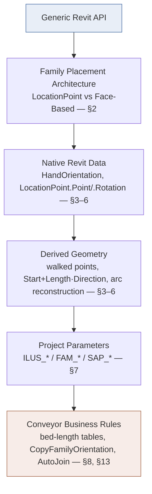

**Classification labels used throughout** (per family, per value — never assumed uniform):

| Label | Meaning |
|---|---|
| **Native** | Read directly from a Revit API property/method, unmodified |
| **Derived** | Computed mathematically/geometrically from other values already in hand |
| **Parameter-driven** | Read from a project/family parameter (`LookupParameter`) |
| **Business-specific** | Exists only because of a Conveyor project rule, not a generic Revit concept |
| **Not Applicable** | The concept has no meaningful independent existence for that case |

Labels are frequently **combined** (e.g. `Derived + Parameter-driven` for "Start + Length·Direction" where Length itself came from a parameter). No family is forced into a template it doesn't fit — see §12 for the full matrix, which intentionally does *not* look the same row-to-row.

### Verification method

The reverse-engineering report's claims were spot-checked by direct inspection of the cited files as they exist today. Every claim reused below either:
- **Confirmed from source** — I read the exact lines and they match, or
- **Strongly inferred** — consistent indirect evidence (e.g. grep confirms no counter-examples), or
- **Not verified** — reused from the report without independent re-check (scope too large to re-verify every line in one pass).

Five points were found during verification that **refine or add to** the original report (not contradictions — the original report's conclusions all held up); these are called out inline with a **"Verification note"** callout and consolidated in §20.

---

## 1. Executive Summary

- **Length** is never measured from placed geometry. It is always a parameter-arithmetic result: a direct instance parameter (`ILUS_Conveyor_OAL`), a sum of two parameters (CMB), or a total split across fixed/table-driven/search-selected segment lengths (CAR, NBLR, SC, CBC, AS35, CVB). See §3.
- **Start Point** is read from Revit natively exactly once per conversion run (`(genericInstance.Location as LocationPoint).Point`), then every subsequent segment's point is *computed* by walking forward (`location + cumulativePosition * HandOrientation`). See §4.
- **End Point** is `Start + Length·Direction` for straight/horizontal cases, a trig split (`cos`/`sin` of a slope-angle parameter) for inclines, and a polar reconstruction around an `Arc.Center` for curved (CVB) cases. It is frequently *not a stored value at all* — just an intermediate used once to place the next segment. See §5.
- **3D Direction** is overwhelmingly `FamilyInstance.HandOrientation` — Native Revit data, read directly, essentially never derived from `Curve.Direction`. See §6.
- **Rotation** has three independently-implemented, coexisting mechanisms — `FamilyHelper.CopyFamilyOrientation` (copies the *generic parent's* own rotation), `ConveyorSegment.PlaceSupps`/`PlaceGRs` (rotates a newly-placed instance about its *own* `HandOrientation × FacingOrientation` axis using an upstream business angle), and `ExternalPlaceConveyorFamily`'s interactive UI rotation. See §7.
- **Face-Based placement** is real and confirmed by the exact API overload used (`NewFamilyInstance(Face, XYZ, XYZ, FamilySymbol)`) for Guard Rails (CGR, all product lines), NBLR/CBC motors, and AS35 diverts. See §8–§10.
- **LocationCurve placement** does not occur for any live conveyor/GR/motor/connector instance. See §9.
- **CSUP (support) placement** — the original report marked this "not confirmed from inspected source." This audit resolves it: CSUP supports are placed through the same `FamilyHelper.CreateInstance` point-based factory as conveyor beds (`Logic/Models/ConveyorSegment.cs:45` → `Helpers/FamilyHelper.cs:578-592`). **Confirmed: CSUP is LocationPoint-based**, not hosted. See §10.14.
- **Guard Rail placement is not one algorithm.** A dedicated deep-dive (§10) confirms at least three independently-implemented flows converging on the same `NewFamilyInstance(Face, XYZ, XYZ, FamilySymbol)` endpoint — a shared straight-run splitter that walks *backward* from the run's outfeed tip and assigns a host bed by a separate maximum-overlap computation (§10.5), a CVB per-bed builder incapable of spanning beds (§10.10), and a set of bespoke per-geometry-case formulas (§10.12). The headline finding: for a 6 ft GR spanning a 4 ft + 2 ft two-bed run, the GR's `LocationPoint` and its chosen host bed land on **different beds** — see §10.7.

### Component Architecture & Conversion Workflow

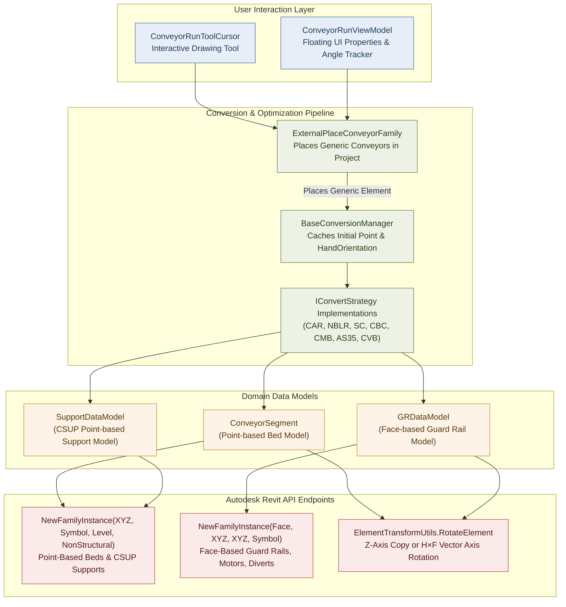

---

## 2. Family Placement Architecture

Three structurally distinct subsystems produce geometry, and they must not be conflated:

| Subsystem | Where | What it does |
|---|---|---|
| **A — Interactive placement** | `Events/ExternalPlaceConveyorFamily.cs`, `Commands/ConveyorRunToolCursor.cs`, `UI/ViewModels/ConveyorRunViewModel.cs` | Places **generic** conveyor instances one at a time while the user draws a run. Length/Rotation are often literal UI inputs; End Point = `StartPoint + HandOrientation*length` (or a trig/arc variant). |
| **B — Generic → Detailed conversion** | `Logic/ConvertStrategies/**`, `Logic/BaseConversionManager.cs`, `Utils/ConvertToDetailed/ConversionUtils.cs` | Reads one already-placed **generic** instance's `LocationPoint` once, replaces it with N **detailed** instances ("beds"), each walked forward using computed lengths and the generic instance's `HandOrientation`. This is the subsystem responsible for nearly everything in §3–§7. |
| **C — AutoJoin** | `Logic/AutoJoin/**` | Operates on two already-placed, detailed, point-based conveyors; computes a virtual intersection of their extrapolated centerlines, then trims/moves/rotates them and inserts connector families. |

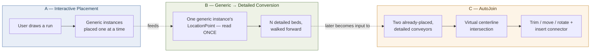

### Placement Overload Dispatch

Within Subsystem B, placement is split cleanly by API overload — **confirmed by which `NewFamilyInstance` overload is called, not by naming**:

```mermaid
flowchart TD
    Target["Target Element to Place"] --> CheckType{"Element Category / Role"}

    CheckType -->|"Conveyor Bed (CAR, CVB, NBLR, SC, CBC, CMB, AS35)<br/>OR Support (CSUP)"| PtOverload["Point-Based Overload:<br/>doc.Create.NewFamilyInstance(location, symbol, Level, NonStructural)<br/>(FamilyHelper.CreateInstance)"]
    
    CheckType -->|"Guard Rail (CGR, all lines)<br/>Motor (NBLR/CBC)<br/>Divert (AS35)"| FaceOverload["Face-Based Overload:<br/>doc.Create.NewFamilyInstance(Face, location, referenceDirection, symbol)<br/>(ConversionUtils.GetConveyorTopFace)"]
    
    CheckType -->|"LocationCurve / Linear Framing"| NoCurve["LocationCurve Overload:<br/>❌ NOT USED ANYWHERE in Live Pipeline<br/>(See §9 for dead legacy code analysis)"]

    PtOverload --> RotateBeds["Rotation Strategy:<br/>CopyFamilyOrientation (Generic Parent Z-Angle)"]
    FaceOverload --> RotateGR["Rotation Strategy:<br/>RotateElement around H × F Vector Axis"]

    classDef pt fill:#e8eef7,stroke:#4a6fa5,color:#1e3d59;
    classDef face fill:#eef2e6,stroke:#608050,color:#264018;
    classDef none fill:#faeaea,stroke:#b84d4d,color:#541b1b;
    class PtOverload,RotateBeds pt
    class FaceOverload,RotateGR face
    class NoCurve none
```

- **Point-Based:** every conveyor bed/segment across CAR, CVB, NBLR, SC, CBC, CMB, AS35 — created via `Globals.Doc.Create.NewFamilyInstance(location, symbol, StructuralType.NonStructural)` inside `FamilyHelper.CreateInstance` (`Helpers/FamilyHelper.cs:569,584`) — **Confirmed from source**.
- **Face-Based:** Guard Rails (all product lines' CGR families), NBLR/CBC motors, AS35 diverts — created via `NewFamilyInstance(Face, XYZ, XYZ, FamilySymbol)` — **Confirmed from source**, see §8, §10.
- **LocationCurve-Based:** none in the live placement/conversion pipeline — see §9.

There is **no `FamilyPlacementType` enum check anywhere in the repository** (confirmed by a fresh repo-wide grep during this audit — zero hits). Placement "type" in this codebase is purely an emergent property of which overload the code happens to call, never something the code introspects or branches on.

---

## 3. Length Analysis

Length is the value most likely to be confused with "physical geometry length" in this project. **It never is** — it is always **project-parameter arithmetic**, and the arithmetic differs completely per product line.

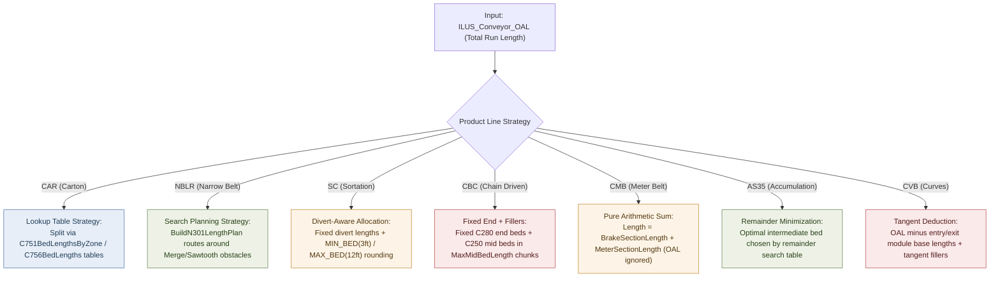

| Product line | Length source | Classification | Code evidence |
|---|---|---|---|
| CAR | `ILUS_Conveyor_OAL` split via `C751BedLengthsByZone`/`C756BedLengths` lookup tables; family-name overrides for `C757`/`C758`/`C781`/etc. | Parameter-driven + Business-specific (table split is a project rule) | `Logic/ConvertStrategies/CAR/CARStraightConverter.cs:127-189`, `CARBaseConversionManager.ApplySAPLengthParam:297-340` |
| NBLR | `ILUS_Conveyor_OAL` via `BuildN301LengthPlan` search, routes around detected Merge-Table/Sawtooth intersections | Parameter-driven + Business-specific | `NBLRStraightConverter.cs:1174-1240` |
| SC | `ILUS_Conveyor_OAL` split around fixed-length diverts; bed lengths rounded between hardcoded `MIN_BED_LENGTH`(3ft)/`MAX_BED_LENGTH`(12ft) constants | Parameter-driven + Business-specific | `SCStraightConverter.cs:244-267,482-503` |
| CBC | Fixed `C280` end beds (`FirstAndLastConveyorBedLengths`) + `C250` filler beds in `MaxMidBedLength` chunks | Parameter-driven + Business-specific | `CBCStraightConverter.cs:141-183` |
| CMB | **Pure sum**: `FAM_CMB_GENERIC_BRAKE_SECTION_LENGTH + FAM_CMB_GENERIC_METER_SECTION_LENGTH`. Comment in source explicitly notes `ILUS_Conveyor_OAL` is *not* an input. | Parameter-driven only (no table/search logic) | `CMBStraightConverter.cs:190-208` — the only pure 2-parameter-sum case in the codebase |
| AS35 | Fixed entry/terminal beds; `AS333` intermediate beds chosen by a remainder-minimizing search over a small constant table (`SelectOptimalIntermediateBed`) | Parameter-driven + Business-specific | `AS35StraightConverter.cs:162-179` |
| CVB | `ILUS_Conveyor_OAL` minus entry/exit module base lengths from `ModuleLengthsFt`/`GetDimensionFt` tables, plus tangent fillers | Parameter-driven + Business-specific | `CVBConverterHelper.CalculateTangentLength`, `CVBConstants.cs:577-589` |
| CGR / Guard Rail | Computed upstream `Length` written redundantly to `ILUS_Guardrail_Length`, `FAM_GUARDRAIL_LENGTH`, `SAP_CGR_NOMINAL_LENGTH` (string+double), `FAM_GUARDRAIL_LENGTH_LH/RH`, `FAM_GAURDRAIL_LENGTH` (typo preserved as found) — **Confirmed from source**, `Logic/Models/ConveyorSegment.cs:194-203`. The upstream `Length` itself is one of ≤10 ft segmentation-algorithm output (most product lines) or a bespoke business constant (CAR MergeTable, CVB curve entry/exit) — see §10.6/§10.12 for the full, per-flow breakdown; it is never one single formula. | Business-specific (redundant writes = family-revision compatibility, a project convention) | `ConveyorSegment.cs:187-296` |

The one place `Arc.Length`/edge-scanning is used (`CVBArcGeometryUtils.GetOuterArc`, `CARCurveConverter.GetOuterArc`) is to *identify* the longest arc edge of an **already-placed** instance's transformed solid, purely to find a reference point — **it is never written back as a conveyor's Length parameter**. Treat "Length as a business value" (what gets stored in `ILUS_Bed_Length`/`FAM_BED_LENGTH`) and "length measured from Revit geometry" (`Curve.Length`/`Arc.Length`) as two unrelated concepts in this codebase — they are never equated.

**Length is Not Applicable** as an independent concept for: AS35 diverts (face-placed, no length math at all — `AS35StraightConverter.cs:309-360`), CGR viewed as "does the GR have a Start/End/Length triad" (it has a Length parameter but no corresponding End Point — see §5, §10.1), and AutoJoin connector families (fixed by the chosen `FamilyPlacement.Radius`/type, not computed).

---

## 4. Start Point Analysis

**Native, read once per run:**
```csharp
// Utils/ConvertToDetailed/ConversionUtils.cs:296-305 (GetLocationPoint) — Confirmed from source, current line numbers match
location = (genericInstance.Location as LocationPoint)?.Point;
```
This is cached once (`BaseConversionManager.location`) and never re-read from Revit for the rest of the conversion. Every subsequent segment's point is **Derived**, not Native:

$$
\text{segment.LocationPoint} = \text{location} + \text{cumulativePosition} \times \text{HandOrientation}
$$

$$
\text{cumulativePosition} \mathrel{+}= \text{segment.Length} \quad (\text{Length is Parameter-driven — see §3})
$$

### The Walk-Forward Paradigm

```mermaid
flowchart LR
    L["P₀: Generic location<br/>(Native, read once)"] -->|offset = 0| S1["Bed 1: LocationPoint<br/>P₁ = P₀"]
    S1 -->|"+ Length₁ · HandOrientation"| S2["Bed 2: LocationPoint<br/>P₂ = P₀ + L₁ · H"]
    S2 -->|"+ Length₂ · HandOrientation"| S3["Bed 3: LocationPoint<br/>P₃ = P₀ + (L₁+L₂) · H"]
    S3 -.->|"…"| SN["Bed N: LocationPoint<br/>PN = P₀ + (Σ Lk) · H"]

    classDef anchor fill:#e8eef7,stroke:#4a6fa5,color:#1e3d59;
    classDef bed fill:#eef2e6,stroke:#608050,color:#264018;
    class L anchor
    class S1,S2,S3,SN bed
```

This walk-forward idiom is independently re-implemented (not shared code) across CAR, NBLR, SC, CBC, CMB, and AS35 converters — a **Business-specific** convention (the *pattern* of walking, not the underlying Native/Derived primitives it's built from).

**What "Start Point" is not proven to mean:** the code names this variable `location` (lowercase, generic) everywhere. It is never labeled "Infeed" in code or comments. The concept "Infeed" in this codebase names an **elevation parameter** (`ILUS_Infeed_Elevation`, a Z-only double on `ConveyorSegment.Infeet`), entirely distinct from the XYZ `LocationPoint`. Treat "the generic instance's point is the physical infeed edge" as **Strongly inferred, not Confirmed** — it's the run's start reference by construction/convention, but no in-code assertion checks it against the family's actual mesh.

**Per-family classification:**

| Case | Start Point classification |
|---|---|
| CAR/NBLR/SC/CBC/CMB/AS35/CVB straight & incline beds | Derived (native `location` + parameter-driven walk) |
| CAR curve/junction/merge/gate/pop-wheel bed itself | Native (unmodified generic point — the bed doesn't walk, only its supports/GRs do) |
| CVB curve/spur/par beds | Derived (walked, same as straight) |
| Guard Rail (any product line) | Derived + Business-specific (`dataModel.LocationPoint`, computed upstream by the parent converter's support/junction placement math, not read from Revit) |
| AS35 divert | Native (its own original `LocationPoint.Point`, captured once — divert does not walk) |
| AutoJoin connector | Derived (virtual line-intersection of two conveyors' extrapolated centerlines) |
| AutoJoin trimmed conveyor | Derived (`Location.Move(vector)` applied to the existing point) |
| Interactive placement (`ExternalPlaceConveyorFamily`) | Native (literal UI cursor point) |

Do not claim `LocationPoint.Point` is physically the conveyor infeed beyond what's stated above — that relationship is assumed by the walk-forward code, not independently verified against family geometry anywhere in source.

---

## 5. End Point Analysis

End Point is **usually not a stored value** — it is computed transiently to place the *next* segment or to close out a run, and its formula differs by geometry type.


### 1. Straight / Horizontal Runs
$$
\text{End} = \text{Start} + \text{Length} \times \text{HandOrientation}
$$
Classification: **Derived + Parameter-driven** (Length is a parameter; Direction is Native).

### 2. Inclined / Declined Runs (CAR, CBC)
$$
\text{outfeedElevation}_Z = \text{infeedValue} + \text{Length} \times \sin(\theta)
$$
$$
\text{currentLocation}_{XY} \mathrel{+}= \text{Direction} \times \big(\text{Length} \times \cos(\theta)\big)
$$

`angle` ($\theta$) is sourced from a family parameter (`FAM_SLOPE_ANGLE_OPTIMIZED`, `FAM_INCLINE_ANGLE`, `FAM_NOSE_OVER_ANGLE`, etc.) — **Derived + Parameter-driven**. No converter derives End Point from Infeed/Outfeed elevation parameters *alone*, without the Length/angle term also present — elevation parameters describe endpoints of the whole run, not a per-formula input by themselves.

### 3. Curved Runs (CVB curve/spur/par)
```csharp
// Utils/Geometry/CVBArcGeometryUtils.cs:98-123 (MovePointAlongCurve) — Confirmed from source
var curve = GetOuterArc(instance);                          // longest Arc edge of the transformed solid
var center = curve.Center;
var d = center.DistanceTo(point);                            // radial distance from arc center
var rotationAngle = AngleConstants.RAD_90 - angleRad;         // sign-flipped if FacingFlipped
var vector = VectorUtils.RotateInPlaneRadians(instance.HandOrientation, XYZ.BasisX, XYZ.BasisY, rotationAngle);
var newPoint = center + vector * d;                           // reconstructed exit point on the arc
```
This is polar reconstruction around an actual placed instance's `Arc.Center`, not a `Curve.GetEndPoint` call and not `Start + Length·Direction`. Classification: **Derived** (from Native `Arc.Center`/`HandOrientation` plus a Business-specific angle input).

### 4. Not Calculated as an Independent Value
- **Guard Rail (CGR):** no End Point field exists at all — the GR is fully defined by its Length parameter (§3) plus its (derived) placement point. Classification: **Not Applicable**.
- **AS35 divert:** face-based, single-point placement — **Not Applicable**.
- **AutoJoin connector:** single-point placement, fixed by `FamilyPlacement` type — **Not Applicable**.

AutoJoin itself computes a similar `Start + Length*Direction` line independently, purely to find intersection/join points between two already-placed conveyors (`Events/ExternalPlaceAccessoryBase.cs:154-155` `ProjectOntoLine`, `AutoJoinProductLineJoinCase.cs:153-166` `FindIntersectionPoint`) — a **virtual** line, never a placed instance's actual geometry.

---

## 6. 3D Direction Analysis

`FamilyInstance.HandOrientation` is the near-universal source, read directly — **Native**. It is read from the *driving* instance, which is context-dependent:
- During Subsystem B conversion: the **generic** instance's `HandOrientation`.
- During AutoJoin/accessory placement: the already-placed **detailed** instance's `HandOrientation`.

`FacingOrientation` plays a **different role**: it is not used as the longitudinal travel direction anywhere in the point-based bed pipeline. Its confirmed uses are:
- As one leg of the `HandOrientation.CrossProduct(FacingOrientation)` rotation-axis construction for supports and GRs (§7, §8, §10) — Native inputs, Business-specific composition.
- As a component of `MovePointAlongCurve`'s `center = startPt + (faceDir.Negate() * fixedDis)` construction (`ConversionUtils.cs:412-422`) — a different, simpler `MovePointAlongCurve` overload than the CVB one in §5 (see verification note in §20).

`Direction` is derived from vector math (rather than read as `HandOrientation` directly) in exactly two confirmed places:
1. **AutoJoin handedness tests** — `GeometryHelper`-adjacent cross-product checks used to determine mirroring.
2. **CVB curve outlet direction** — `Transform.CreateRotation(XYZ.BasisZ, finalAngle).OfVector(fi.HandOrientation)` (`Events/ExternalPlaceConveyorFamily.cs:753`) — the **only** place in the audited placement code where a `Transform` object (rather than `ElementTransformUtils.RotateElement` or manual `VectorUtils.RotateInPlaneRadians`) derives a direction vector. A near-identical duplicate exists in `UI/ViewModels/ConveyorRunViewModel.cs:2086,2104` (see §20 — this file was previously unexamined and independently reimplements the same formula).

**The important distinction:** "Revit provides an orientation vector" (`HandOrientation` — Native, generic to any Revit add-in) is not the same statement as "the Conveyor project interprets that vector as the conveyor's longitudinal travel direction" (Business-specific interpretation — nothing in the Revit API says `HandOrientation` means "the way material moves"; that's a Conveyor domain convention layered on top).

| Case | Direction classification |
|---|---|
| All point-based beds (any product line) | Native (`HandOrientation`) |
| CVB curve/spur/par exit direction | Derived (Native `HandOrientation` rotated by a Business-specific angle) |
| Guard Rail | Native (parent's `HandOrientation`, passed through as the `referenceDirection` argument to `NewFamilyInstance(Face,...)`) |
| AutoJoin connector | Derived (`Math.Atan2` on flattened `HandOrientation` — see §7) |

---

## 7. Rotation Analysis

Three independently-implemented mechanisms coexist. None uses `Math.Atan2` on a direction vector to derive a *bed's* rotation (Atan2 is used only in AutoJoin, mechanism 4 below applied to connectors, not beds).

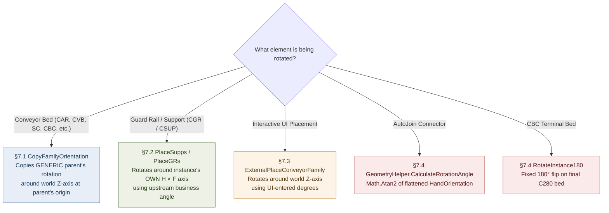

### 7.1 `FamilyHelper.CopyFamilyOrientation` — the dominant mechanism for beds

```csharp
// Helpers/FamilyHelper.cs:480-515 — Confirmed from source, read in full during this audit
LocationPoint? originalLocation = originalFamily.Location as LocationPoint;
double? rotationAngle = originalLocation?.Rotation;                 // Native — read from the GENERIC parent
XYZ rotationAxisStart = originalLocation.Point;
XYZ rotationAxisEnd = rotationAxisStart + XYZ.BasisZ;                // world Z axis
Line rotationAxis = Line.CreateBound(rotationAxisStart, rotationAxisEnd);
ElementTransformUtils.RotateElement(doc, instance.Id, rotationAxis, rotationAngle.Value);
instance.SetParameter("FAM_HAND_DIRECTION", instance.FacingFlipped ? 0 : 1);
(instance.Location as LocationPoint).Point = location;               // new position force-set AFTER rotation
```
Called from both overloads of `FamilyHelper.CreateInstance` (`:563-592`) — the shared factory used by nearly every converter. Effect: **every detailed bed in one conversion run gets the identical rotation value**, copied from the *generic parent's own* rotation, applied about a Z-axis anchored at the *parent's* point (not the new segment's own point), then the segment's computed position is force-set afterward.

Classification: **Native value (`LocationPoint.Rotation`) + Business-specific convention** (copy-once-reuse-for-every-child is a Conveyor decision, not a Revit requirement).

**Verification note:** a *second*, face-based overload of `CopyFamilyOrientation(Document, FamilyInstance, FamilyInstance, PlanarFace)` exists (`FamilyHelper.cs:516-561`), rotating about the face's normal instead of world Z and using a face-aware mirror-plane normal. A fresh grep across the whole repository during this audit found **zero call sites** for this overload — only the two `XYZ`-based overloads are ever invoked (`:572,587`). This is **dead code**, not previously called out in the source reverse-engineering report. See §20.

### 7.2 `ConveyorSegment.PlaceSupps` / `PlaceGRs` — for supports and Guard Rails

```csharp
// Logic/Models/ConveyorSegment.cs:53-58 (PlaceSupps) and :222-228 (PlaceGRs) — Confirmed from source
var H = inst.HandOrientation;          // the NEWLY PLACED instance's own orientation
var F = inst.FacingOrientation;
var l = Line.CreateBound(dataModel.LocationPoint, dataModel.LocationPoint + H.CrossProduct(F));
ElementTransformUtils.RotateElement(doc, inst.Id, l, dataModel.RotationAngle);
```

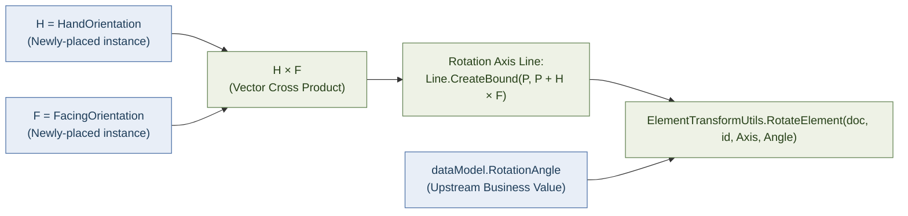

This only works because Revit assigns a default orientation to a newly-placed face-based (or point-based) instance at creation time, which is then queried immediately after `NewFamilyInstance` returns. `dataModel.RotationAngle` is an **upstream business value** — 30°/90° for junctions, a curve-angle lookup for CVB/CAR curves, `0` (skipped) otherwise.

Classification: **Business-specific** (both the axis-construction pattern and the angle value are project decisions; the only Native ingredients are `HandOrientation`/`FacingOrientation`/`CrossProduct`).

### 7.3 `ExternalPlaceConveyorFamily` — interactive placement

Rotates about `Line.CreateBound(StartPoint, StartPoint + XYZ.BasisZ)` using a caller-supplied or running-total-derived degree value from the floating-cursor UI. Classification: **Native mechanism** (`ElementTransformUtils.RotateElement` about world Z), **Business-specific input** (UI-entered degrees).

### 7.4 Special cases

- **CBC end-bed 180° flip:** `CBCStraightConverter.RotateInstance180` — a dedicated 180°-reversal for the final `C280` bed (`CBCStraightConverter.cs:214-226,262-266`). Business-specific.
- **CVB rotated variant:** rotates about the `H×F` axis using `CVBRotatedConverter.RotationAngleDegrees`/`RotatedDirection`. **Verification note — Confirmed dead/incomplete during this audit:** these two properties are declared (`CVBRotatedConverter.cs:28,30`) but a fresh grep found **no assignment site anywhere in the file** — `FAM_ROTATION_ANGLE` is therefore always written as `0` (`:329`). This is either dead code or an unfinished feature, not something to model as intentional Conveyor rotation logic.
- **AutoJoin connectors:** `GeometryHelper.CalculateRotationAngle` — `Math.Atan2(dir2D.Y, dir2D.X)` on the flattened `HandOrientation` of the first conveyor, applied via `RotateElement` about a world-Z axis at the join center (`Logic/AutoJoin/Helper/GeometryHelper.cs:45-55` — **Confirmed from source**, read in full). This is the only Atan2-based rotation derivation in the codebase, and it applies only to newly-inserted connector families, never to a bed.
- **`Utils/Geometry/CVBArcGeometryUtils.GetArcTangentRotation`** (`:149-167` — **new finding, not named in the source report**): computes a support's rotation from an arc's tangent direction (`Atan2` on a 90°-rotated radial vector, plus a 180° flip if `instance.Mirrored`). This is a second, narrower Atan2 usage, scoped to curved-segment support placement — worth knowing about if extending curve-support logic, but it does not change any conclusion above.

Do not reduce "how Conveyor rotates things" to `LocationPoint.Rotation` — it is one of at least five distinct, independently-coded mechanisms in active use.

---

## 8. Face-Based Families — General Pattern

Confirmed by the exact overload, not by naming:

```csharp
Globals.Doc.Create.NewFamilyInstance(HostPlanarFace, dataModel.LocationPoint, genericInstance.HandOrientation, dataModel.Family);
```

| Family | Host face | `XYZ` argument #1 (placement point) | `referenceDirection` |
|---|---|---|---|
| Guard Rail (CGR, any product line) | Top `PlanarFace` of the just-placed **detailed bed** (or a `CustomHostFace` override) | `dataModel.LocationPoint` — computed upstream by the parent converter | Parent generic instance's `HandOrientation` |
| NBLR / CBC motor | Top face of the **longest bed segment** | Segment midpoint | Generic instance's `HandOrientation` |
| AS35 divert | Top face of the **hosting conveyor segment** (found by `FindHostSegment`) | Divert's own original `LocationPoint.Point`, captured once | `FamilyMapping.OriginalInstance.HandOrientation` |

### Host Face Selection Pipeline

```csharp
// Utils/ConvertToDetailed/ConversionUtils.cs:59-75, GetConveyorTopFace — Confirmed from source, read in full
List<Solid> solids = instance.GetSymbolSolids(false, false);
var Faces = solids.SelectMany(s => s.Faces.Cast<Face>()).OfType<PlanarFace>();
var t = Faces.Where(f => f.FaceNormal.Z > 0.001);
var maxZ = t.Max(s => s.FaceNormal.Z);
planarFace = t.Where(f => f.FaceNormal.Z == maxZ).OrderByDescending(f => f.Area).FirstOrDefault();
```

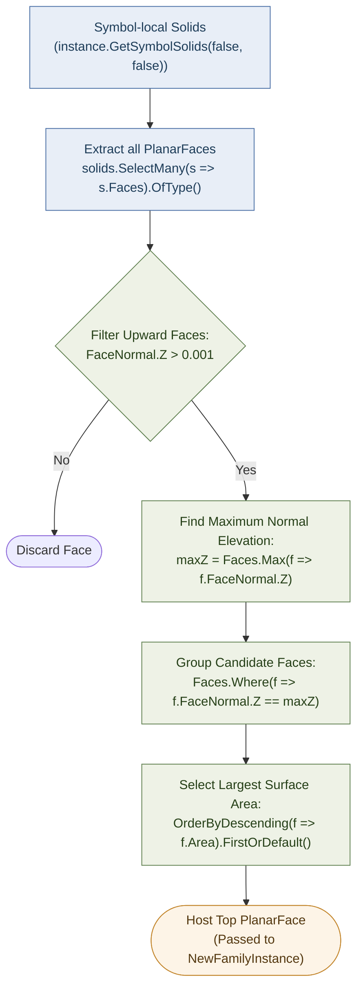

This selects the highest-Z, largest-area planar face by `FaceNormal` — a **selection** operation, not an orientation one. GR orientation comes entirely from the `referenceDirection` argument (`HandOrientation`), not from the face normal.

**Geometric caveat (Confirmed from source):** `GetSymbolSolids` calls Revit's no-argument `GetSymbolGeometry()`, returning geometry in the **symbol's local coordinate system**. `GetConveyorTopFace` does **not** apply `instance.GetTotalTransform()` before selecting the face — unlike `CVBArcGeometryUtils.GetOuterArc`, which explicitly does. There is no visible `Transform.OfPoint`/`OfVector` reconciliation step; the code relies on the returned `Face`'s `Reference` resolving correctly against the actually-placed host instance when handed to `NewFamilyInstance`. Treat "the host Face passed to GR placement is fully reconciled against the host's world transform" as **Not verified** — plausible given `GeometryOptions.ComputeReferences = true` is set (`Helpers/ExtensionMethods/ElementExtensions.cs:34`), but not something the C# code independently asserts.

**Do not treat a Face-Based family as a re-skinned Point-Based family** — there is no Start/End/Length primitive pair for it; see §5 and §10.1.

---

## 9. LocationCurve — Explicitly Not Used for Placement

**No conveyor, guard-rail, motor, or connector `FamilyInstance` in this project is created via a curve-based `NewFamilyInstance` overload.** Confirmed by direct instantiation-site inspection across CAR/CVB/NBLR/SC/CBC/CMB/AS35/AutoJoin, and by every Start/End/Length/Direction formula in AutoJoin explicitly casting to `LocationPoint` and throwing if that fails (comments in the visitor classes literally describe these as "point-based families").

Two `LocationCurve`-adjacent code paths exist in the whole repository, **neither of which is live conveyor placement**:

1. `Commands/ElevationCreatorCommand.cs:379-382` — a defensive anchor-point fallback for elevation-view tagging:
   ```csharp
   if (inst.Location is LocationPoint lp) anchor = lp.Point;
   else if (inst.Location is LocationCurve lc) anchor = lc.Curve.Evaluate(0.5, true);
   else anchor = /* bounding-box center */;
   ```
   Unrelated to conveyor geometry; only exercised if some element handed to the elevation tagger happened to be curve-based (nothing in conveyor placement produces one).

2. **Verification note — new finding, not in the source report:** `Logic/convertToDetailed.cs` (lowercase class name `convertToDetailed`, distinct from the live `IConvertStrategy.ConvertToDetailed` interface method used by the real pipeline) contains a `PlaceBed` method that calls `doc.Create.NewFamilyInstance(line, symbol, doc.ActiveView)` — a genuine curve+view-hosted (2D detail component) overload that would create a `LocationCurve`. A repo-wide grep for constructors/callers of this class (`new convertToDetailed(`, `.PlaceBed(`) found **zero references anywhere** — this file is entirely dead/unreferenced legacy code (hardcoded `C380`/`C351`/`C352`/`C353` family names that don't appear anywhere in the live product-line families). It does not change the report's conclusion — LocationCurve genuinely plays no role in live placement — but it means the LocationCurve-producing call site count in the repo is two, not one, and both are inert with respect to production geometry.

`Curve.Length`/`Arc.Length`/`GetEndPoint` hits elsewhere in the repo (elevation annotation, `.Length` on custom business DTOs unrelated to `Curve`, `CVBCurveConverter.cs` dead/commented-out blocks) are unrelated to `LocationCurve` placement — see the source report §5 for the exhaustive list; this audit did not find reason to revise it.

**Do not build a generic LocationCurve implementation for Conveyor just because the Revit API supports it — the project never uses one.**

---

## 10. Guard Rail (CGR) — Business Logic Deep Dive

**Source of truth for this section:** `GR_DeepDive_Final_Source_Analysis.md` (repository root of the Daifuku project). That report is a **second-pass investigation performed directly against the live `DaifukuRevitAddin` source tree**, superseding an earlier documentation-only GR pass. It fully opened and read `GRDataModel.cs`, `ConveyorSegment.cs`, `OneToManyConversionUtils.cs`, `StraightConverter.cs`, and `CVBGuardRailBuilder.cs`; it opened targeted, line-numbered excerpts of `ConversionUtils.cs`, `CARBaseConversionManager.cs`, `CARStraightConverter.cs`, `CARMergeTableConverter.cs`, `CARJunctionConverter.cs`, `CVBCurveConverter.cs`, `CVBRotatedConverter.cs`, `SpurParGuardRailService.cs`, `CVBSpurConverter.cs`, and `CARConstants.cs`. It **located but did not open** the internal arithmetic of `CARMergeConverter.cs`, `CARPopWheelConverter.cs`, `CARGateConverter.cs`, `CARInclinedDeclinedConverter.cs`, `CBCInclinedDeclinedConverter.cs`, `CBCStraightConverter.cs`, `SCStraightConverter.cs`, `NBLRStraightConverter.cs`, `CMBStraightConverter.cs`, `AS35StraightConverter.cs`, and the CVB skew/spur-par/bracket-service files beyond grep-confirming they call into the shared machinery traced below. Every claim in this section carries the same confidence label the source report gives it — **CONFIRMED FROM SOURCE**, **Strongly inferred**, or **NOT FOUND IN SOURCE** / **located, not opened** — and this document does not upgrade any claim beyond what that investigation actually supports.

This supersedes the "NOT PROVEN" / "not confirmed from inspected source" GR conclusions carried by earlier passes of this document (previously §10.1–§10.5 in this file); see §10.17 for exactly what changed.

### 10.1 What a Guard Rail Is, in Business Terms

A Guard Rail (family names `CGR_*`, e.g. `CGR_C2000`, `CGR_C2006`) is a **face-hosted family instance** placed on top of an already-placed, already-detailed conveyor bed. It exists to protect the sides of a conveyor run. Structurally, a GR has only **two** independent business values, not the three (Start/End/Length) that a conveyor bed has:

- **A placement point** (`LocationPoint`) and an **orientation** (a rotation angle plus a host face) — where and how it sits.
- **A length** (`Length`) — how long it is.

There is **no End Point concept for a GR at all** (§10.1 of the previous pass's §10.2 conclusion still holds, now with a fuller explanation of *why*): the GR is fully defined by its one placement point, its Length, its host face, and its rotation. Classification: **End Point — Not Applicable**, unchanged from before, but now backed by a full trace of every formula that produces `LocationPoint`/`Length` (§10.5–§10.12) rather than a partial one.

The single most important business fact this deep dive establishes, ahead of any formula: **GR placement is not one universal algorithm.** Three structurally different, independently-implemented families of logic all produce `GRDataModel` objects that converge on the same final Revit call — see §10.2.

### 10.2 GR Architecture — Three Independent Flows, Never Merged

| Flow | Who uses it | What it does | Confidence |
|---|---|---|---|
| **A — Shared straight-run splitter** | CAR Straight, CAR Skew, CAR Inclined, CBC Straight, CBC Inclined, SC Straight, NBLR Straight, CMB Straight | Splits one run's total length into ≤10 ft GR pieces (`StraightConverter.GenerateGRLenghts`), then assigns each piece a `LocationPoint` and a host bed via an independent backward walk + max-overlap sweep (`OneToManyConversionUtils.MapGRsToConveyors`) | **CONFIRMED FROM SOURCE** — full arithmetic traced, §10.5–§10.7 |
| **B — CVB per-bed builder** | CVB straight-family segments (via `CVBGuardRailBuilder.FillGRModels`) | Creates **exactly one GR per `ConveyorSegment`**, sized to that segment's own `Length`, via a forward walk from that same segment's own end point. Structurally incapable of spanning beds. | **CONFIRMED FROM SOURCE** — full arithmetic traced, §10.10 |
| **C — Bespoke / special-case builders** | CAR Junction, CAR Merge, CAR MergeTable, CAR PopWheel, CAR Gate, CVB Curve, CVB Rotated, CVB Spur, CVB SpurPar | Each is its own hand-written method producing one or a small fixed number of `GRDataModel`s via bespoke, per-case formulas (business constants, angle tables, entry/exit offsets) | **CONFIRMED FROM SOURCE** for the specific methods opened (CAR MergeTable, CAR Junction's dispatch structure, CVB Curve/Rotated/Spur entry-exit formulas — §10.12); **NOT independently verified** for every method in every file (see the coverage note above) |

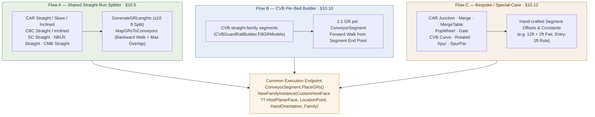

**Do not merge these into one generic algorithm** — that was the single largest risk this document previously carried, by describing GR placement loosely as "computed upstream by the parent converter" without distinguishing which upstream computation. All three flows converge only at the very last step:

```csharp
// ConveyorSegment.cs:172-179 — the shared, exclusive placement endpoint for every flow above
if (dataModel.CustomHostFace != null)
    inst = Globals.Doc.Create.NewFamilyInstance(dataModel.CustomHostFace, dataModel.LocationPoint, genericInstance.HandOrientation, dataModel.Family);
else
    inst = Globals.Doc.Create.NewFamilyInstance(HostPlanarFace, dataModel.LocationPoint, genericInstance.HandOrientation, dataModel.Family);
```

### 10.3 GRDataModel — The Business-Data Object

`GRDataModel` (`Logic/Models/GRDataModel.cs`, read in full) is the business-data object every flow above eventually populates and hands to `ConveyorSegment.PlaceGRs` for the final Revit placement call. It is a **plain mutable POCO with no constructor-enforced invariants** — every field can be set independently via object initializer, which is how nearly every call site uses it:

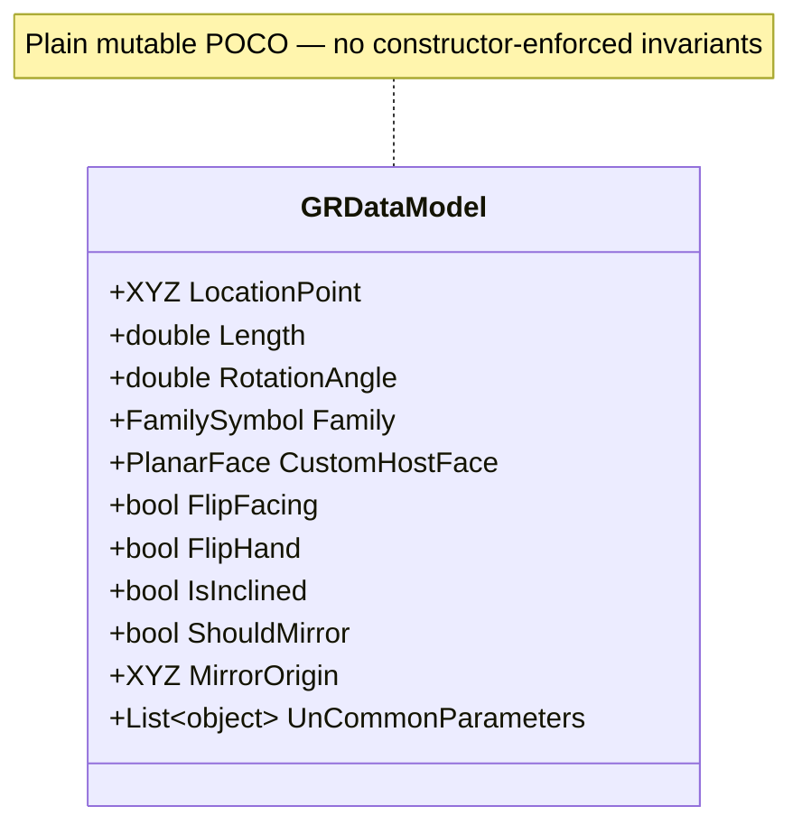

| Field | Type | Meaning |
|---|---|---|
| `LocationPoint` | `XYZ` | The GR's placement point — computed differently per flow (§10.5, §10.10, §10.12); never read from Revit natively |
| `Length` | `double` | The GR's length — a business-arithmetic result, never a measured Revit distance (§10.6) |
| `RotationAngle` | `double` | Post-creation rotation, applied about the newly-placed instance's own `H×F` axis (§10.13); `0` means "skip rotation" |
| `Family` | `FamilySymbol` | Which `CGR_*` family/type to instantiate |
| `CustomHostFace` | `PlanarFace?` | Overrides the default top-face host selection — exactly one assignment site in the whole repository (§10.8) |
| `FlipFacing` / `FlipHand` | `bool` | Mirroring/handedness flags consumed inside `PlaceGRs` |
| `IsInclined` | `bool` | Gates the one `CustomHostFace` assignment site (§10.8) — otherwise not traced further in this pass |
| `ShouldMirror` / `MirrorOrigin` | `bool` / `XYZ` | Drive a `Plane.CreateByNormalAndOrigin` + `ElementTransformUtils.MirrorElements` mirror operation inside `PlaceGRs`, unrelated to face projection (§10.9) |
| `UnCommonParameters` | `List<(string, object)>` | Extra family-parameter writes beyond the common set `PlaceGRs` always writes |

**Confirmed: a single conveyor run can, and does, produce multiple `GRDataModel`s — sometimes several assigned to the very same `ConveyorSegment`.** This was proven concretely, not inferred, in two places:
- `CARMergeTableConverter.FillGRModels` (`:59-106`) adds **two** `GRDataModel`s (12 ft and 2 ft) to one `conveyorSegment.GRDataModels` list — see §10.12.
- `CARJunctionConverter` gives a junction exactly **one** `ConveyorSegment`, but its dispatch loop can add **one `GRDataModel` per matching `CGR_C20xx` family** configured on the mapping — see §10.12.

A repo-wide search for `new GRDataModel` found **35 live construction sites across 12 files** (plus 4 confirmed-dead/commented ones). §10.18 lists the ones this pass traced to exact arithmetic.

### 10.4 Face-Based Placement — the Common Endpoint

Every flow's output is consumed by the identical call shown in §10.2 — this is what makes "Guard Rail" a Face-Based family in the placement-architecture sense of §2/§8 of this document, regardless of which of the three flows produced its `GRDataModel`. There is no LocationCurve, no separate overload, and no per-flow variation in *how* the final `NewFamilyInstance` call is shaped — only in what values feed `dataModel.LocationPoint`/`.Length`/`.CustomHostFace` going into it.

### 10.5 Shared Straight-Run GR Algorithm (Flow A) — Full Trace

This is the algorithm that governs CAR Straight/Skew/Inclined, CBC Straight/Inclined, SC Straight, NBLR Straight, and CMB Straight. **CONFIRMED FROM SOURCE**, full arithmetic:

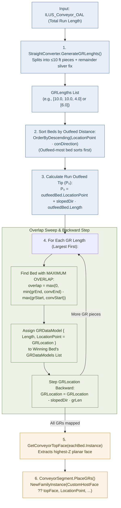

**The generic mathematical model underneath this is the familiar one used throughout this document:**

$$
P = P_0 + D \times \text{offset}
$$

But — and this is the point of this whole subsection — **the shared straight-run GR algorithm applies that formula walking BACKWARD from the outfeed tip of the whole run, not forward from an infeed start**, and it applies it *twice*, independently, for two different purposes:

```csharp
// OneToManyConversionUtils.cs:32-121, read in full — exact formula
var conDirection = genericInstance.HandOrientation;
var grLengths = GRLengths.OrderDescending().ToList();
var conveyorsDesending = Conveyors
    .OrderByDescending(c => c.Length)                                  // has NO effect — see note below
    .OrderByDescending(s => s.LocationPoint.X * conDirection.X + s.LocationPoint.Y * conDirection.Y)
    .ToList();

var con = conveyorsDesending.FirstOrDefault();          // the outfeed-most bed
var location = con.LocationPoint;
location = new XYZ(location.X, location.Y, con.Infeet);  // Z forced to that bed's own Infeet
var slopedDirection = conDirection;
if (angle != 0)
    slopedDirection = VectorUtils.RotateInPlaneRadians(conDirection, horizontalDir, XYZ.BasisZ, angle).Normalize();

XYZ GRLocation = location + slopedDirection * con.Length;   // P0 = outfeed tip of the OUTFEED-MOST bed
                                                              //    = the outfeed tip of the ENTIRE run

// for each GR length, largest first:
//   bestConveyor = the bed with MAXIMUM OVERLAP against [GRLocation-side interval] in an abstract
//                  "distance from the outfeed end" coordinate — a SEPARATE computation from GRLocation itself
conveyorsDesending[bestConveyor].GRDataModels.Add(new GRDataModel { Length = grLen, LocationPoint = GRLocation, Family = symbol });
GRLocation = GRLocation + slopedDirection.Negate() * grLen;   // step BACKWARD by this GR's own length
```

**Verified fact, not an opinion:** in C# LINQ, a fresh `.OrderByDescending(...)` on an already-ordered sequence *replaces* the prior ordering rather than refining it (that requires `.ThenByDescending`) — so the first `OrderByDescending(c => c.Length)` line above has **no effect**; `conveyorsDesending` ends up sorted purely by descending projection along `conDirection`.

**In the exact terms of the generic formula:**
- **Origin (`P0`)** = the outfeed-most bed's own `LocationPoint`, Z overridden to that bed's `Infeet`, offset by that one bed's own `Length` — i.e., the outfeed tip of the whole run.
- **Direction (`D`)** = `genericInstance.HandOrientation`, optionally rotated in-plane for an incline `angle`.
- **`LocationPoint` assigned to GR segment *i*** = the running point **before** that segment's own length is subtracted — each GR's `LocationPoint` is therefore its **far (outfeed-side) edge**, the exact opposite convention from a bed's own `Start + Length·Direction` (where `Start` is the near/infeed edge).
- **Host bed selection is a second, independent computation** — an overlap sweep in a shared abstract 1-D coordinate where position 0 is the outfeed tip and both beds and GRs are walked in the same outfeed-first order:
$$
\text{overlap} = \max\!\Big(0,\ \min(\text{grEnd}, \text{convEnd}) - \max(\text{grStart}, \text{convStart})\Big)
$$
  It does **not** test whether `GRLocation` geometrically falls inside that bed's own physical span. See §10.7 for what this means concretely.
- No horizontal/3D split, no face projection appears anywhere in this method — it is a single 3D vector walk along `slopedDirection`.

### 10.6 The 10 ft Maximum / 1 ft Minimum and How Segmentation Actually Works

**CONFIRMED FROM SOURCE, and confirmed independently declared, not shared, across the codebase:**

```
Helpers/ConstantsValues/CARConstants.cs:24                          maxGRC2000Length = 10          // "in inches = 10 ft" (comment is self-contradictory; the codebase's real unit is feet)
Logic/ConvertStrategies/CVB/Services/SpurParUtilityService.cs:16    MAX_GUARDRAIL_LENGTH = 10.0
Logic/ConvertStrategies/CVB/Services/SpurParGuardRailService.cs:20  MAX_GUARDRAIL_LENGTH = 10.0
Logic/ConvertStrategies/CVB/CVBRotatedConverter.cs:38               MAX_GUARDRAIL_LENGTH = 10.0
Logic/ConvertStrategies/CBC/CBCInclinedDeclinedConverter.cs:21      MAX_GR_PIECE_LENGTH = 10.0
```
Five independent declarations of the same `10.0` (feet). **MAX GR = 10 ft is a real, confirmed, project-wide rule — arrived at via five separately-typed constants, not one shared constant.**

The 1 ft minimum is likewise independently declared three times, and is used only where the implementation performs sliver-avoidance:
```
SpurParUtilityService.cs:21     MIN_GUARDRAIL_LENGTH = 1.0
SpurParGuardRailService.cs:25   MIN_GUARDRAIL_LENGTH = 1.0
CVBRotatedConverter.cs:39       MIN_GUARDRAIL_LENGTH = 1.0
```

**The main (live) `StraightConverter.GenerateGRLenghts` algorithm** — used by CAR/CBC/SC/NBLR — is remainder-first, greedy-max-length:

$$
\text{numFull} = \left\lfloor \frac{\text{total}}{10} \right\rfloor \qquad \text{remainder} = \text{total} \bmod 10
$$

```csharp
// StraightConverter.cs:106-130, read in full
public static List<double> GenerateGRLenghts(double conveyorsTotal)
{
    var grLengths = new List<double>();
    int numFullGRs = (int)(conveyorsTotal / maxGRC2000Length);       // numFull = floor(total / 10)
    double grRemainder = conveyorsTotal % maxGRC2000Length;          // remainder = total mod 10

    for (int i = 0; i < numFullGRs; i++) grLengths.Add(maxGRC2000Length);   // full 10 ft pieces
    if (grRemainder > 0) grLengths.Add(grRemainder);                        // + the remainder piece

    for (int i = 0; i < grLengths.Count - 1; i++)                    // sub-1-ft sliver adjustment:
        if (grLengths[i + 1] < 1)                                    // if the next piece would be < 1 ft,
        {
            grLengths[i] -= 1;                                       // borrow 1 ft from the piece before it
            grLengths[i + 1] += 1;
        }

    grLengths.Reverse();                                             // moot — MapGRsToConveyors re-sorts anyway
    return grLengths;
}
```

**A different, simpler variant — `OneToManyConversionUtils.GenerateGRLenghts` (`:16-30`) — is used only by CMB** (`CMBStraightConverter.cs:383`): the same 10 ft division/modulo, but it adds the remainder *first*, then the full-length segments, with **no** sliver-avoidance fix and no final reverse.

**Do not describe all product lines as using exactly the same segmentation algorithm — they don't.** A third, genuinely different philosophy exists for the CVB Rotated/Spur exit-GR case when a run's total length exceeds 10 ft (**CONFIRMED FROM SOURCE**, `CVBRotatedConverter.cs:1800-1816,1957-2020`):

```csharp
private int CalculateSegmentCount(double totalLength)
{
    if (totalLength <= MAX_GUARDRAIL_LENGTH) return 1;
    int segmentCount = (int)Math.Ceiling(totalLength / MAX_GUARDRAIL_LENGTH);
    double segmentLength = totalLength / segmentCount;                  // EQUAL split, not max-length-first
    while (segmentLength < MIN_GUARDRAIL_LENGTH && segmentCount > 1)
    { segmentCount--; segmentLength = totalLength / segmentCount; }
    return segmentCount;
}
```
This computes the *minimum* segment count that keeps every piece ≤10 ft, then divides the total *equally* among that count — a 22 ft run becomes three ~7.33 ft segments here, versus `[10, 10, 2]` under §10.6's `StraightConverter` algorithm for the same 22 ft input:

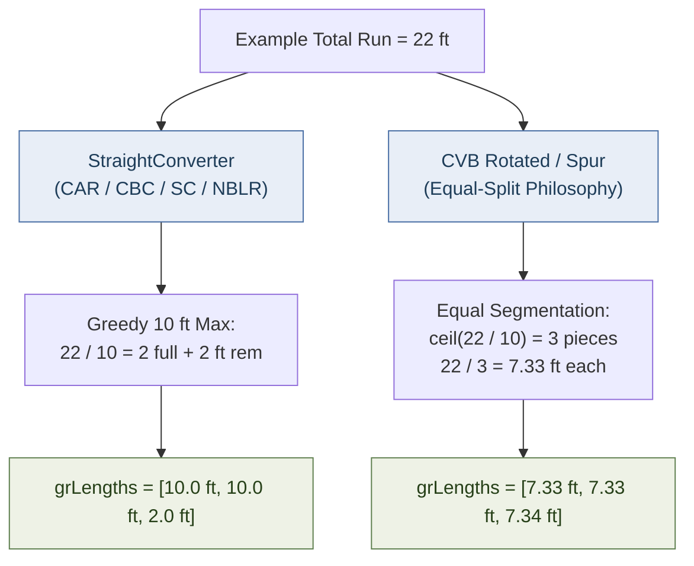

Both independently enforce the same 10 ft/1 ft bounds via independently-declared constants of the same values, but **the split arithmetic is a genuinely different, unrelated implementation, not a shared utility.**

### 10.7 The Critical 6 ft Example — "6 ft Guard Rail over 4 ft + 2 ft Beds"

This is the worked example that resolves the ambiguity every earlier pass of this document flagged as unresolved. It exercises **Flow A only** (§10.5) — Flow B (CVB, §10.10) makes this scenario structurally impossible by construction, since it never produces a GR longer than one bed's own length.

**Setup:**
```
Bed A: Length = 4 ft   (physically upstream / infeed side)
Bed B: Length = 2 ft   (physically downstream / outfeed side)
Total Conveyor OAL (ILUS_Conveyor_OAL) = 6 ft
angle = 0 (flat)
```

**Step 1 — segmentation (§10.6):**
```
GenerateGRLenghts(6):
    numFullGRs = floor(6/10) = 0
    grRemainder = 6 % 10 = 6
    grLengths = [] + [6] = [6]        (only the remainder branch fires)
    sliver-avoidance: range(0,0) → no-op (only 1 element)
    → [6]
```
**Therefore: exactly ONE `GRDataModel` is created. Its `Length` is 6 ft. It is NOT split into 4 ft + 2 ft, and it is NOT clipped to Bed A's 4 ft length** — nothing in `MapGRsToConveyors` compares `grLen` against the chosen bed's own length or reduces it (**confirmed negatively**). The 4 ft + 2 ft bed split is invisible to `GenerateGRLenghts` — it only ever sees the combined total.

**Step 2 — `MapGRsToConveyors([BedA, BedB], [6], ...)`:**
```
conveyorsDesending = [BedB, BedA]                    // BedB is downstream ⇒ larger HandOrientation projection ⇒ sorts first
GRLocation = BedB.LocationPoint + Direction × 2       // outfeed tip of BedB = outfeed tip of the whole 6 ft run

Overlap sweep (position 0 = outfeed tip, walking backward toward infeed):
  BedB span [0, 2):  overlap with GR span [0, 6) = min(6,2) − max(0,0) = 2
  BedA span [2, 6):  overlap with GR span [0, 6) = min(6,6) − max(0,2) = 4   ← larger
  → bestConveyor = BedA
```

```
        Bed A (4 ft)              Bed B (2 ft)
|------------------------|----------------|
<---------------- GR = 6 ft --------------->
                                           ^
                              GR LocationPoint = Bed B's outfeed tip

Host bed = Bed A   (4 ft overlap > Bed B's 2 ft overlap)
```

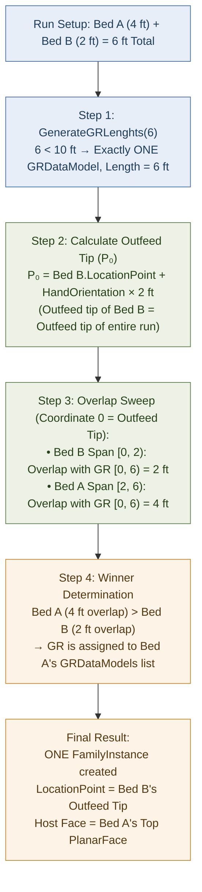

**Answering the mechanics directly:**

- **GR LocationPoint = Bed B's outfeed tip** — the very downstream end of the entire 6 ft run — computed as `BedB.LocationPoint + HandOrientation × 2`. It is **not** the infeed of the run, and it is **not anywhere within Bed A's own physical span**, even though Bed A is the bed that ends up hosting it.
- **Host selection = Bed A**, because host selection is based on **maximum overlap** with the GR's own abstract span, and Bed A's overlap (4 ft, its whole length) exceeds Bed B's overlap (2 ft, its whole length) — **not** because `LocationPoint` sits over Bed A.
- **One `FamilyInstance` is created**, not two — `grLengths` contains a single 6 ft entry, so the placement loop runs exactly once.
- **No boundary detection exists.** The overlap sweep is used only to pick a host; nothing afterward tests whether the GR's placement point crosses, touches, or respects the Bed A/Bed B boundary.
- **`CustomHostFace` is not involved** in this scenario — it is `null` unless explicitly set, and the only code path that ever sets it (§10.8) is gated on CAR C757/C758 + `CGR_C2000` + `IsInclined`, none of which apply here.

**What the source does NOT let us conclude — read this carefully:** the source confirms the business placement data (a 6 ft GR, hosted on Bed A's face, with a placement point at Bed B's far edge) and the host-assignment logic that produced it. **The source confirms this is the business intent; it does not confirm what Revit does at runtime when that insertion point lies outside the selected face's own boundary.** No code anywhere in the traced path clips, validates, or re-projects `LocationPoint` onto `HostPlanarFace`'s actual boundary before the `NewFamilyInstance(Face, XYZ, XYZ, FamilySymbol)` call (§10.9) — but whether Revit's API tolerates an out-of-bounds insertion point (using it only as a directional hint while anchoring some other way), warns, or produces a visually detached instance is **a Revit-runtime question outside what static source analysis can determine**, and this pass found no code that guards against or handles it either way. Do not claim the source proves the rendered geometry crosses the boundary in the running application — it proves only what data is handed to Revit.

One corroborating (but not generalized) data point: in the `FlipHand`/"Spur" special case (`ConveyorSegment.cs:269`), the code computes `origin = dataModel.LocationPoint − (inst.HandOrientation × dataModel.Length)` — treating `LocationPoint − HandOrientation×Length` as the GR's *other* end, meaning that family's placed geometry is expected to extend **backward** from `LocationPoint` by `Length`. Applying that same relationship to this 6 ft example would mean the placed GR spans from the run's infeed start to Bed B's outfeed tip — i.e., crossing the Bed A/Bed B boundary entirely, while hosted only on Bed A's face. This is **Strongly inferred from one confirmed special-case snippet, not proven as the general rule** for the shared-splitter path itself (§10.16, item 5).

### 10.8 Host Face — Default Selection and the `CustomHostFace` Override

**Default host face**, computed fresh for each bed, only after that bed's own detailed `FamilyInstance` exists (`CARBaseConversionManager.cs:100-176`, excerpt read in full):
```csharp
if (GetConveyorTopFace(instance, out var topFace) && conveyorSegment.GRDataModels.Any())   // 'instance' = THIS bed's own placed instance
{
    ConfigureInclinedHostFaces(conveyorSegment, instance);
    var GRs = conveyorSegment.PlaceGRs(genericInstance, topFace, guardRailHeight, guardRailHostOffset);
}
```
`GetConveyorTopFace` (`ConversionUtils.cs:59-75`, read in full):
```csharp
var Faces = solids.SelectMany(s => s.Faces.Cast<Face>()).OfType<PlanarFace>();
var t = Faces.Where(f => f.FaceNormal.Z > 0.001);            // upward-facing only
var maxZ = t.Max(s => s.FaceNormal.Z);                        // maximum Z normal
planarFace = t.Where(f => f.FaceNormal.Z == maxZ).OrderByDescending(f => f.Area).FirstOrDefault();  // largest area among those
```
Highest-Z, then largest-area, planar face of that one bed's own symbol-local solid geometry. Ten of the eleven `PlaceGRs` call sites found repo-wide follow this identical pattern (SC, NBLR, CVB straight/skew/rotated/base-manager ×2, CMB, CBC straight/inclined, CAR, AS35) — confirmed by grep context; only `CARBaseConversionManager`'s own copy was individually re-opened in full in this pass.

**Which bed's face gets used is decided upstream, not here.** §10.5/§10.7's overlap sweep already decided which `ConveyorSegment.GRDataModels` list a given GR landed in *before* this face-selection code ever runs — `GetConveyorTopFace` only ever operates on whichever bed already owns the GR, never comparing candidate beds against each other.

**`CustomHostFace` — confirmed to have exactly one assignment site in the entire repository:**
```
Logic/Models/GRDataModel.cs:49        public PlanarFace? CustomHostFace { get; set; }      (declaration)
Logic/Models/ConveyorSegment.cs:172   if (dataModel.CustomHostFace != null) { ... }         (consumption)
CARBaseConversionManager.cs:613       grModel.CustomHostFace = inclinedHost;                (the ONLY assignment)
```
```csharp
// CARBaseConversionManager.cs:593-617, read in full
private void ConfigureInclinedHostFaces(ConveyorSegment segment, FamilyInstance detailedInstance)
{
    var isC757OrC758 = segment.FamilySymbol.FamilyName.Equals(CAR_C758) || segment.FamilySymbol.FamilyName.Equals(CAR_C757);
    if (!isC757OrC758) return;
    foreach (var grModel in segment.GRDataModels)
        if (grModel.Family.FamilyName.Equals(CGR_C2000) && grModel.IsInclined)
            if (ConversionUtils.Get757ConveyorinclinedFace(detailedInstance, out var inclinedHost))
                grModel.CustomHostFace = inclinedHost;
}
```
`Get757ConveyorinclinedFace` (`ConversionUtils.cs:76-92`) picks the **largest-area planar face whose normal is NOT the maximum Z found** — i.e., specifically excluding the flat "top" face `GetConveyorTopFace` would otherwise pick, because a C757/C758 bed's true inclined surface is not its highest-Z face (likely a small flat end cap).

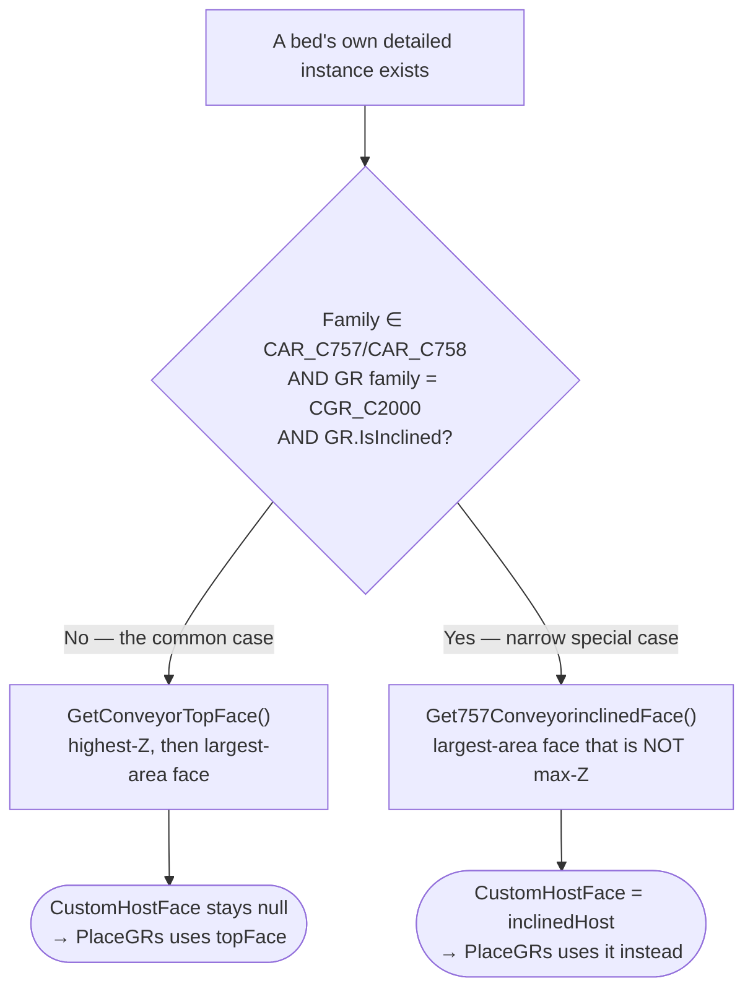

**Confirmed condition, exactly:** `segment.FamilySymbol.FamilyName ∈ {CAR_C757, CAR_C758}` **and** `grModel.Family.FamilyName == CGR_C2000` **and** `grModel.IsInclined == true`. **This is an inclined-face special case, confirmed unrelated to junctions, curves, or multi-bed GR spanning, and is confirmed NOT a general multi-bed host-selection solution** — it exists solely to pick the correct single face on a single already-identified bed.

### 10.9 Face Projection — Confirmed Absent

A targeted repo-wide search for `Face.Project`, `Plane.CreateByNormalAndOrigin` (near GR code), any vertical/Z-adjustment helper, and any intersection-with-plane logic feeding `dataModel.LocationPoint` returned **NOT FOUND IN SOURCE**. No method anywhere in the traced GR-creation or GR-placement path projects, snaps, or Z-corrects `dataModel.LocationPoint` onto its eventual host face before placement:

```csharp
// ConveyorSegment.cs:172-179 — dataModel.LocationPoint is passed through unmodified
inst = Globals.Doc.Create.NewFamilyInstance(
    dataModel.CustomHostFace ?? HostPlanarFace,
    dataModel.LocationPoint,
    genericInstance.HandOrientation,
    dataModel.Family);
```
Every `LocationPoint` traced in §10.5/§10.10/§10.12 is computed once, by vector arithmetic (`origin + direction × distance` variants), and handed to `NewFamilyInstance` exactly as computed — **do not imply the point is mathematically projected onto the host face; no such step exists.** (Two unrelated `Plane.CreateByNormalAndOrigin` uses do exist at `ConveyorSegment.cs:271,287`, but both construct a *mirror* plane for `ElementTransformUtils.MirrorElements` in the `FlipHand`/`ShouldMirror` cases — not a placement-point projection.)

### 10.10 CVB Per-Bed GR Flow (Flow B)

**CONFIRMED FROM SOURCE, full arithmetic** — `CVBGuardRailBuilder.FillGRModels` (`:24-119`, read in full):
```csharp
XYZ conDirection = genericInstance.HandOrientation;
XYZ slopedDirection = conDirection;
if (angle != 0) slopedDirection = VectorUtils.RotateInPlaneRadians(conDirection, XYZ.BasisX, XYZ.BasisZ, angle).Normalize();

for (int i = 0; i < segments.Count; i++)
{
    ConveyorSegment segment = segments[i];
    XYZ grLocation = segment.LocationPoint + conDirection * segment.Length;   // that SAME bed's own far end
    if (angle != 0) grLocation += conDirection * (Math.Sin(angle) * segment.Infeet);   // incline correction
    var gr = new GRDataModel { Length = segment.Length, LocationPoint = grLocation, ... };
    segment.GRDataModels.Add(gr);
}
```
$$
\text{GR.LocationPoint} = \text{segment.LocationPoint} + \text{HandOrientation} \times \text{segment.Length}, \qquad \text{GR.Length} = \text{segment.Length}
$$

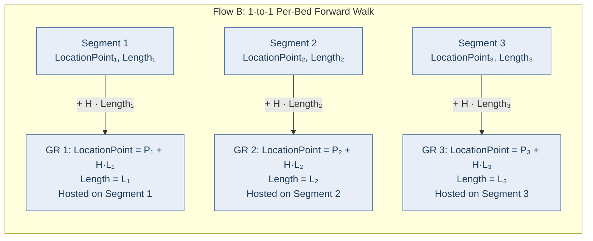

This is a **forward**, per-segment walk (contrast §10.5's backward, whole-run walk): **one GR per conveyor segment**, sized to that segment's own length, with **no cross-bed offset, no cumulative position across multiple beds, and no 10 ft/1 ft segmentation applied here at all** — this specific path never needs to split or span, by construction. (The 10 ft/1 ft constants declared in `CVBRotatedConverter`/`SpurParGuardRailService` — §10.6 — govern the *separate* CVB Rotated/Spur exit-GR cases in §10.12, not this per-bed builder.)

### 10.11 Curved GR — Arc Reconstruction Is Real, But Not Used for GR Placement

`Arc.Center`/polar reconstruction genuinely exists and is live in this codebase (`CVBSpurConverter.cs:925-1005`, `ExtractFloorSupportLocations`/`ExtractCeilingSupportLocations`, read in full):
```csharp
var outerArc = CVBArcGeometryUtils.GetOuterArc(instance);
var midPoint = outerArc.Evaluate(0.5, true);
var center = outerArc.Center;
var direction = (midPoint - center).Normalize();
var supportPoint = new XYZ(midPoint.X - offsetDistance*direction.X, midPoint.Y - offsetDistance*direction.Y, location.Z);
```
**But its confirmed live usage is exclusively for CSUP support placement**, feeding `CreateSupportModels`/`SupportDataModel` — a completely separate model type from `GRDataModel`. **CONFIRMED FROM SOURCE: this arc-center math never feeds `GRDataModel.LocationPoint`, anywhere, in `CVBCurveConverter`, `CVBSpurConverter`, `CVBSpurParConverter`, `SpurParGuardRailService`, or `CVBGuardRailBuilder`.**

`CVBCurveConverter.cs`'s `AddOuterCurvedGuardRail`/`AddInnerCurvedGuardRail` (`:504-707`, read in full) contain a large (~30-line) block of commented-out code that would have called `GetOuterArc`, `curve.Evaluate`, `curve.CreateOffset`, and read `Arc.Radius` for GR placement — genuine arc/polar geometry, evidently prototyped at some point. **This block is dead code — entirely commented out, never executed.** The **live** code in the exact same methods instead does simple linear offsets:
```csharp
if (is70)      grLocation = primaryPartLocation + (genericInstance.HandOrientation * (FamEntryLength - 1));
else if (is20) grLocation = primaryPartLocation;   // or segment.LocationPoint — no offset
else           grLocation = IsOptionOne ? location + (handDir * FamEntryLength) : segment.LocationPoint;
```
**The live curved-GR placement path uses `origin + direction × distance` linear formulas, exactly like the straight case — never the arc-based formulas that exist elsewhere in the same file as dead code.**

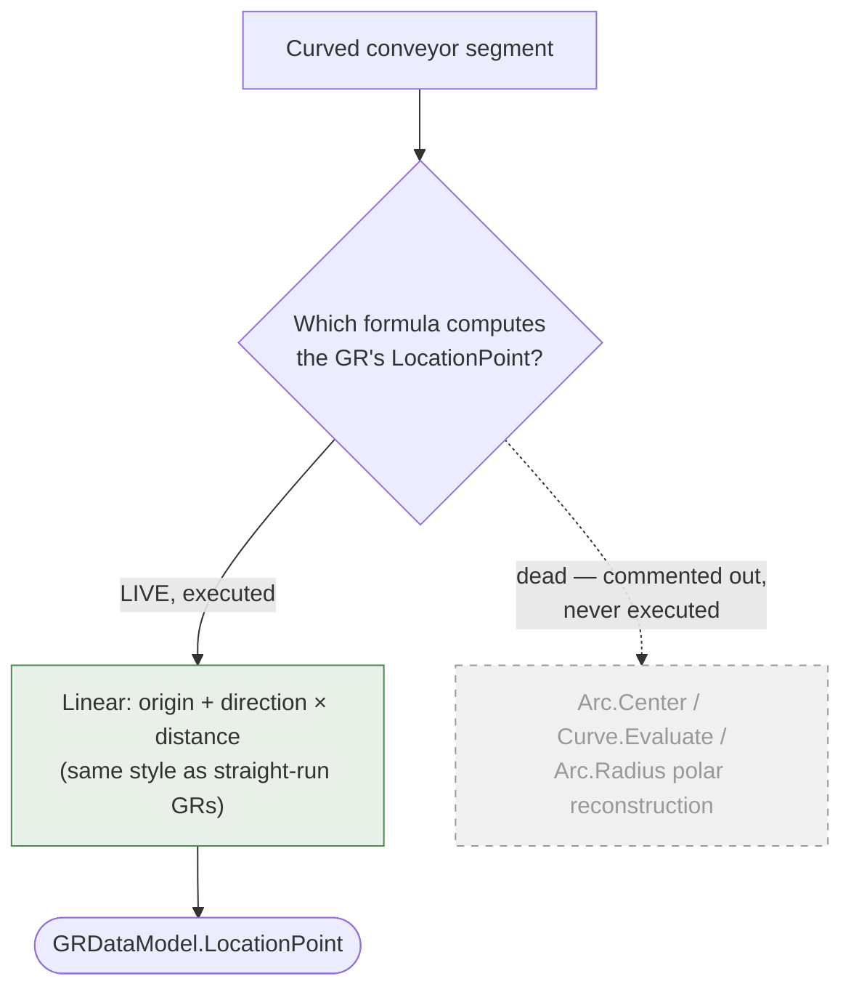

Arc-center math is real, just for CSUP supports (above), never on this GR-facing arrow.

### 10.12 Bespoke / Special-Case GR Flows (Flow C) — What Was Traced

| Case | Formula (as traced) | Confidence |
|---|---|---|
| **CAR MergeTable** (`CARMergeTableConverter.cs:59-106`, read in full) | `newLocation = location + FacingOrientation.Negate() × \|BedWidth/2 − ConveyorCenter\|`; `GR.LocationPoint = newLocation + HandOrientation × 12` (`CommonBedLength`), `GR.Length = 12`; `GR2.LocationPoint = newLocation + HandOrientation × 2` (`12 − maxGRC2000Length`), `GR2.Length = 2`. Both `GRDataModel`s are added to the **same** `ConveyorSegment`. | **CONFIRMED FROM SOURCE.** No comment explains the business rationale for the specific 12 ft / 2 ft pair — treat that as an open question (§10.16), not an inferred design intent. |
| **CAR Junction** (`CARJunctionConverter.cs:85-129`, dispatch structure read in full) | One `ConveyorSegment`; a `foreach` over configured GR families dispatches to `ProcessC2000GuardRail`/`ProcessC2006GuardRail`/`ProcessC2008GuardRail`/etc., one `GRDataModel` per matching family | Dispatch structure **CONFIRMED FROM SOURCE**; the internal arithmetic of each `ProcessCXXXXGuardRail` method is **NOT FOUND IN SOURCE in this pass — located, not opened** |
| **CVB Curve entry/exit** (`CVBCurveConverter.cs:387-502`, read in full) | `cgrLength = Math.Max(0, length − 1.0)` (hardcoded "reduce by 1 ft" business rule, explicit source comment); `LocationPoint = segment.LocationPoint + HandOrientation × cgrLength` | **CONFIRMED FROM SOURCE** |
| **CVB Curve entry/exit (Spur variants)** (`CVBSpurConverter.cs:505`, `CVBSpurParConverter.cs:446`) | `PrimaryPartLocation = location + HandOrientation × FamEntryLength` — linear, not arc-derived | **CONFIRMED FROM SOURCE** |
| **CVB Rotated exit, over 10 ft** (`CVBRotatedConverter.cs:1800-1816,1957-2020`, read in full) | Equal-split segment count (§10.6), then a **forward** cumulative walk: `grLocation = startLocation + rotatedHandDir × cumulativeDistance`; each GR gets `RotationAngle = π` (fixed 180°, not a table lookup) and `ShouldMirror = true` | **CONFIRMED FROM SOURCE** |
| **CAR Merge / PopWheel / Gate / Inclined-Declined; CBC Inclined-Declined** | Construction sites located by grep (`CARMergeConverter.cs:104,191`; `CARPopWheelConverter.cs:124,204`; `CARGateConverter.cs:59`; `CARInclinedDeclinedConverter.cs:258,287,325,337,350,362,493`; `CBCInclinedDeclinedConverter.cs:649,671,738`) | **NOT FOUND IN SOURCE in this pass — located, not opened.** Do not assume these follow either §10.5's or §10.10's formula; they are separate, un-traced methods. |

### 10.13 Rotation — Kept Strictly Separate from Position, Length, and Host Face

The rotation mechanism is confirmed **identical** across every geometry case above (straight, junction, curved) — only the angle's magnitude and the `LocationPoint` it rotates about differ per case:

```csharp
// ConveyorSegment.cs:222-228, current source — unchanged across straight/junction/curved cases
if (dataModel.RotationAngle != 0)
{
    var H = inst.HandOrientation;             // the NEWLY-PLACED GR instance's own orientation
    var F = inst.FacingOrientation;
    var axis = Line.CreateBound(dataModel.LocationPoint, dataModel.LocationPoint + H.CrossProduct(F));
    ElementTransformUtils.RotateElement(doc, inst.Id, axis, dataModel.RotationAngle);
}
```
$$
\text{axis} = H \times F \quad \text{through } \text{LocationPoint}, \qquad H = \text{HandOrientation},\ F = \text{FacingOrientation}
$$

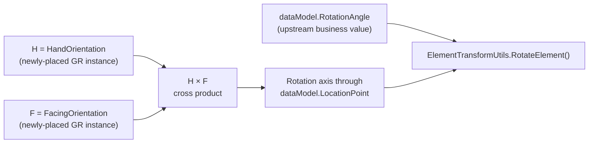

`H` and `F` are queried from the instance immediately after `NewFamilyInstance` returns, because Revit assigns a default orientation to a newly-placed face-based instance at creation time. `H.CrossProduct(F)` gives a rotation axis appropriate to wherever the host face actually landed (flat, sloped, or curved) — a fixed world-Z axis (used for beds, §7.1) would be wrong for a GR bolted to a sloped or curved face. `dataModel.RotationAngle` itself is always an **upstream business value** — a curve-angle table lookup for CVB/CAR curves, a fixed `π` (180°) for CVB Rotated split-exit GRs (§10.12), `0` (skipped) for straight runs.

**Keep these four concepts separate — the source keeps them separate, and conflating them is the easiest way to misread this system:**
- **Position** (`LocationPoint`) determines *where* the GR is created — computed by §10.5's backward walk, §10.10's forward per-bed walk, or one of §10.12's bespoke formulas.
- **Length** determines the GR's *size* — computed by §10.6's segmentation rules or a bespoke business constant.
- **HostFace** (default top face, or the one `CustomHostFace` override, §10.8) determines *which surface* the GR is hosted on — a computation that does not know or care what `LocationPoint`/`Length` are.
- **RotationAngle** determines the GR's *post-creation orientation* — applied last, about an axis derived from the instance's own orientation after it already exists.

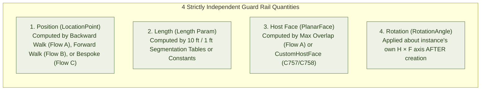

None of these four computations reads its result from another; they are four independent business decisions that happen to converge on one `NewFamilyInstance` call and one subsequent `RotateElement` call.

### 10.14 CSUP (Support) Placement — Point-Placed Like a Bed, Rotated Like a GR

Distinct from `GRDataModel`/GR placement, but sharing infrastructure worth noting here since §10.13's rotation formula is shared with it. **Confirmed from source** (`ConveyorSegment.cs:37-97`, `PlaceSupps`):
```csharp
var inst = FamilyHelper.CreateInstance(doc, dataModel.Family, dataModel.LocationPoint, level, genericInstance);
```
`FamilyHelper.CreateInstance` (`Helpers/FamilyHelper.cs:578-592`) calls the **point-based** `NewFamilyInstance(location, symbol, level, StructuralType.NonStructural)` overload, then applies `CopyFamilyOrientation` exactly as beds do (§7.1). **CSUP is LocationPoint-based, not Face-hosted** — but the per-instance `RotationAngle` for a support, when non-zero, is separately applied via the exact same `H×F` axis pattern as §10.13, immediately after creation. So CSUP is a hybrid: **point-placed like a bed, but rotated like a GR** when it needs a non-default orientation (e.g. an inclined support). Arc-center reconstruction (§10.11) feeds *some* CSUP support locations on curved segments — that is the one confirmed live use of `Arc.Center` polar math anywhere in the GR/CSUP placement code.

### 10.15 Generic Revit Concepts vs Daifuku Business Rules — GR-Specific

**Generic Revit / Geometry** (would apply to any Revit add-in placing a face-hosted family):
- `XYZ`, direction vectors, `Position = Origin + Direction × Distance` (in both forward and backward walking forms)
- Face-Based family placement: `NewFamilyInstance(Face, XYZ, XYZ, FamilySymbol)`
- `PlanarFace`, `FaceNormal` ranking by Z-component then area, to select a host face from a solid's geometry
- `HandOrientation` / `FacingOrientation`, read natively from a just-placed instance
- `HandOrientation.CrossProduct(FacingOrientation)` as a per-instance rotation axis
- `ElementTransformUtils.RotateElement` about a constructed `Line`
- `Arc.Center` / `Curve.Evaluate` polar reconstruction (a generic technique — confirmed real, just not used for GR `LocationPoint`)

**Project-specific (Daifuku business rules)** — none of these exist in the Revit API itself:
- The 10 ft maximum GR length (`maxGRC2000Length`/`MAX_GUARDRAIL_LENGTH`/`MAX_GR_PIECE_LENGTH`), independently declared five times
- The 1 ft minimum (`MIN_GUARDRAIL_LENGTH`), independently declared three times, used for sliver-avoidance
- The **backward walk from the outfeed tip** used only by the shared straight-run splitter (§10.5)
- The **maximum-overlap host-bed assignment**, computed independently of `LocationPoint` (§10.5, §10.7)
- The C757/C758 + `CGR_C2000` + `IsInclined` gating on the sole `CustomHostFace` assignment (§10.8)
- The CVB **one-GR-per-bed** rule (§10.10) — a product-line decision that CVB simply never needs cross-bed GR logic
- The **"reduce by 1 ft"** hardcoded rule for CVB curve entry/exit GRs, and the **12 ft / 2 ft pair** for CAR MergeTable GRs (§10.12) — unexplained-in-comments numeric business rules
- The equal-split segmentation philosophy specific to CVB Rotated/Spur exit GRs over 10 ft (§10.6)
- The redundant multi-parameter GR-length writes (`ILUS_Guardrail_Length`, `FAM_GUARDRAIL_LENGTH` ×2, `SAP_CGR_NOMINAL_LENGTH` written twice in two different representations, `FAM_GUARDRAIL_LENGTH_LH/RH`, `FAM_GAURDRAIL_LENGTH` typo preserved) — `ConveyorSegment.cs:194-203`
- All `CGR_*`/family-name string matching (`CGR_C2000`, `CGR_C2006`, …) driving which `ProcessCXXXXGuardRail` method runs

### 10.16 How the Pieces Fit Together

```mermaid
flowchart TD
    BL(["BUSINESS LOGIC"]) --> Len["GR Length / Segments<br/>§10.6 — 10 ft max / 1 ft min, per flow"]
    Len --> Loc["GR LocationPoint<br/>§10.5 backward walk / §10.10 forward walk / §10.12 bespoke"]
    Loc --> Host["Host Bed Selection<br/>§10.5/§10.7 max-overlap sweep, or §10.8 CustomHostFace"]
    Host --> Model["GRDataModel<br/>§10.3 — carries all of the above"]
    Model --> Rev["Revit Placement<br/>§10.9 — LocationPoint passed through, NO projection"]
    Rev --> New["NewFamilyInstance(Face, ...)<br/>§10.2/§10.4 — shared endpoint for every flow"]
    New --> Rot(["Rotation<br/>§10.13 — applied last, about the new instance's own H×F axis"])

    style BL fill:#e8eef7,stroke:#4a6fa5
    style Rot fill:#f7ece8,stroke:#a5674a
```

**Read the arrows literally — each stage is a one-way input to the next, not a two-way check:**
- **Host selection is not what calculates the GR length** — Length comes entirely from §10.6's segmentation (or a bespoke constant); the overlap sweep that picks a host never feeds back into it.
- **GR length is not what determines the host face** — `GetConveyorTopFace`/`CustomHostFace` selection (§10.8) never inspects `dataModel.Length`.
- **`LocationPoint` is not calculated from the final GR geometry** — it is computed once, upstream, from vectors and business lengths (§10.5/§10.10/§10.12), and is never re-derived from where the GR instance actually ends up after placement.

### 10.17 What Changed From Earlier Passes of This Document

Earlier passes of this section described GR placement generically as "computed upstream by the parent converter's support/junction/curve-placement math" without distinguishing *which* upstream computation, and left several points as "not confirmed from inspected source." This deep dive resolves the load-bearing ones:

| Earlier statement | Resolution |
|---|---|
| "`dataModel.LocationPoint` is computed by the parent converter's support/junction/curve-placement math" (unqualified) | **Resolved into three distinct, named flows** with fully-traced arithmetic for two of them and partial tracing for the third — §10.2, §10.5, §10.10, §10.12 |
| No worked example existed for a multi-bed GR span | **Resolved** — §10.7's 6 ft over 4 ft + 2 ft trace, with exact line-by-line arithmetic |
| Host face selection was described only generically (`GetConveyorTopFace`) | **Resolved** — confirmed the host *bed* is chosen by a separate overlap computation before `GetConveyorTopFace` ever runs on it (§10.5, §10.8) |
| Whether the Face handed to `NewFamilyInstance` is reconciled against the host's world transform | **Partially resolved** — confirmed **no** projection/reconciliation code exists anywhere in the path (§10.9); what remains open is a genuine Revit-runtime question (§10.7's closing caveat), not a source-code question |
| Arc/polar math's relationship to GR placement | **Resolved negatively** — confirmed real and live, but exclusively for CSUP supports; the one GR-facing arc attempt (`CVBCurveConverter.cs`) is confirmed dead code (§10.11) |

**Genuinely unresolved items are preserved, not manufactured as resolved** — see §10.18 below for the full list carried forward.

### 10.18 Remaining Unknowns (Genuinely Unresolved — Do Not Treat as Confirmed)

1. The internal arithmetic of `ProcessC2000GuardRail`/`ProcessC2006GuardRail`/`ProcessC2008GuardRail`/`ProcessC2010GuardRail` (`CARJunctionConverter.cs`) — located, not opened.
2. The internal arithmetic of `CARMergeConverter.cs`'s live sites (`:104,191`), `CARPopWheelConverter.cs`'s sites (`:124,204`), `CARGateConverter.cs`'s site (`:59`), `CARInclinedDeclinedConverter.cs`'s seven sites, and `CBCInclinedDeclinedConverter.cs`'s three sites — located, not opened.
3. Whether Revit's `NewFamilyInstance(Face, XYZ, XYZ, FamilySymbol)` overload tolerates, warns on, or silently mis-anchors an insertion point outside the given face's own boundary (directly relevant to §10.7) — a Revit-runtime question outside what static source analysis can answer.
4. Whether the `LocationPoint`-is-the-far-edge / geometry-extends-backward-by-`Length` relationship inferred from the `FlipHand`+"Spur" snippet (§10.7's closing note) holds generally for the shared-splitter path, or only for that one confirmed special case.
5. The business rationale for CAR MergeTable's specific `12` ft / `12 − 10 = 2` ft length pair (§10.12) — no comment or surrounding logic explains it.
6. The reason for the apparent double-write to `FAM_GUARDRAIL_LENGTH` (twice, identical value) and the write-then-overwrite of `SAP_CGR_NOMINAL_LENGTH` (string-of-inches, then raw double) at `ConveyorSegment.cs:194-203` — intentional (two distinct parameters sharing a name check) or an unremoved duplicate.

### 10.19 Source References for This Section

| Claim | File | Class/Method | Line(s) |
|---|---|---|---|
| `GRDataModel` field definitions | `Logic/Models/GRDataModel.cs` | `GRDataModel` | 10-58 |
| Shared splitter's `MapGRsToConveyors` (backward walk + overlap host selection) | `Utils/ConvertToDetailed/OneToManyConversionUtils.cs` | `MapGRsToConveyors` | 32-121 |
| Live `GenerateGRLenghts` (10 ft split, sliver fix) | `Logic/ConvertStrategies/StraightConverter.cs` | `GenerateGRLenghts` | 106-130 |
| CMB's simpler `GenerateGRLenghts` variant | `Utils/ConvertToDetailed/OneToManyConversionUtils.cs` | `GenerateGRLenghts` | 16-30 |
| `maxGRC2000Length = 10`, `CommonBedLength = 12` | `Helpers/ConstantsValues/CARConstants.cs` | (const) | 24, 23 |
| `MAX_GUARDRAIL_LENGTH`/`MIN_GUARDRAIL_LENGTH` (CVB) | `SpurParUtilityService.cs`, `SpurParGuardRailService.cs`, `CVBRotatedConverter.cs` | (const) | 16/21, 20/25, 38/39 |
| `MAX_GR_PIECE_LENGTH = 10.0` (CBC) | `Logic/ConvertStrategies/CBC/CBCInclinedDeclinedConverter.cs` | (const) | 21 |
| CVB per-bed builder (Flow B) | `Logic/ConvertStrategies/CVB/Services/CVBGuardRailBuilder.cs` | `FillGRModels` | 24-119 |
| Shared placement/rotation/parameter-write endpoint | `Logic/Models/ConveyorSegment.cs` | `PlaceGRs` | 159-295 |
| Per-bed host face resolution loop | `Logic/ConvertStrategies/CAR/CARBaseConversionManager.cs` | (per-segment loop) | 100-176 |
| `GetConveyorTopFace` / `Get757ConveyorinclinedFace` | `Utils/ConvertToDetailed/ConversionUtils.cs` | (static methods) | 59-75 / 76-92 |
| The only `CustomHostFace` assignment | `Logic/ConvertStrategies/CAR/CARBaseConversionManager.cs` | `ConfigureInclinedHostFaces` | 593-617 |
| CAR MergeTable two-GR case | `Logic/ConvertStrategies/CAR/CARMergeTableConverter.cs` | `FillGRModels` | 59-109 |
| CAR Junction one-segment/multi-GR dispatch | `Logic/ConvertStrategies/CAR/CARJunctionConverter.cs` | (`FillGRModels`-equivalent) | 85-129 |
| CVB curve entry/exit + dead arc code | `Logic/ConvertStrategies/CVB/CVBCurveConverter.cs` | `AddStraightGuardRailToEntry`/`Exit`, `AddOuterCurvedGuardRail`, `AddInnerCurvedGuardRail` | 387-502, 504-595, 597-707 |
| CVB Rotated equal-split algorithm | `Logic/ConvertStrategies/CVB/CVBRotatedConverter.cs` | `CalculateSegmentCount`, `CreateSplitExitGuardRails` | 1800-1816, 1957-2020 |
| `Arc.Center` used for CSUP supports only | `Logic/ConvertStrategies/CVB/CVBSpurConverter.cs` | `ExtractFloorSupportLocations`, `ExtractCeilingSupportLocations` | 909-966, 968-1005 |
| GR rotation mechanism (H×F axis) | `Logic/Models/ConveyorSegment.cs` | `PlaceGRs` | 222-228 |
| No face-projection code found (negative result) | repo-wide targeted search | — | — |

### 10.20 Parameters (exact names)

See the source report §4.3 for the full table (host offset, redundant length parameters, height parameters, bracket logic keyed on `SAP_CGR_APPLICATION`, bracket-location distribution, curved-GR angle parameters, LH/RH flags). Independently re-verified against `ConveyorSegment.cs:187-247` during the GR deep dive and found accurate.

---

## 11. Curved Geometry — CVB and Related

**Family placement** and **geometry extraction/reverse-engineering** are two distinct activities in this codebase and must not be conflated:

- **Placement** of a CVB curve/spur/par *bed* is still ordinary Point-Based `NewFamilyInstance` (§2) — the curve does not change how the bed itself is placed, only how its *exit point* for the *next* segment is calculated.
- **Geometry extraction** (`CVBArcGeometryUtils.GetOuterArc`) reaches into the **already-placed instance's transformed solid** to find its longest `Arc` edge — this is reverse-engineering the physical shape of a family whose curve isn't exposed through `Location` at all (because the instance is Point-Based, not LocationCurve-based).

```mermaid
flowchart TD
    subgraph Extraction ["CVBArcGeometryUtils.GetOuterArc Extraction Pipeline"]
        Sym["1. Read Symbol-Local Solids<br/>instance.GetSymbolSolids(false, false)"] --> Trans["2. Transform to World Space<br/>SolidUtils.CreateTransformed(solid, instance.GetTotalTransform())"]
        Trans --> Scan["3. Scan World Solid Edges<br/>foreach Edge in transSolid.Edges"]
        Scan --> Filter["4. Filter Arc Curves & Find Longest<br/>if (edge.AsCurve() is Arc arc && arc.Length > max)"]
        Filter --> OuterArc["5. Output: Longest Outer Arc<br/>Exposes True Arc.Center, Radius, Start/End"]
    end

    OuterArc --> Polar["MovePointAlongCurve Polar Reconstruction:<br/>Center = OuterArc.Center<br/>Exit = Center + RotateInPlane(H, θ) · Radius"]

    classDef pipe fill:#e8eef7,stroke:#4a6fa5,color:#1e3d59;
    classDef polar fill:#eef2e6,stroke:#608050,color:#264018;
    class Sym,Trans,Scan,Filter,OuterArc pipe
    class Polar polar
```

```csharp
// Utils/Geometry/CVBArcGeometryUtils.cs:25-81 (GetOuterArc) — Confirmed from source, read in full
var solids = instance.GetSymbolSolids(false, false);                              // symbol-local geometry
foreach (var maxSolid in solids)
{
    var transSolid = SolidUtils.CreateTransformed(maxSolid, instance.GetTotalTransform());  // → world space
    foreach (Edge edge in transSolid.Edges)
        if (edge.AsCurve() is Arc arc && arc.Length > maxLength) { maxLength = arc.Length; longestArc = arc; }
}
return longestArc;
```
This is the **only** documented use of `Arc.Length` for anything other than pure reporting — and even here, it's used only to *select* the longest arc among several candidate edges, never written back as a Length parameter (§3).

Once the arc is found, `MovePointAlongCurve` (§5, §7.4) reconstructs an exit point/direction by polar math around `Arc.Center` — **Derived** geometry built from **Native** (`Arc.Center`, `HandOrientation`) plus **Business-specific** (`CurveAngles`/`SpurAngles` lookup tables) inputs.

**Verification note:** a second, near-identical `MovePointAlongCurve(double angleRad, double fixedDis, XYZ startPt, FamilyInstance instance)` overload exists in `ConversionUtils.cs:412-422`. Unlike the CVB one, it does **not** call `GetOuterArc`/use an actual `Arc.Center` — it constructs a *virtual* center as `startPt + faceDir.Negate()*fixedDis` and rotates `HandOrientation` (not a radial vector) by the sloped angle. This looks like a simpler, non-CVB-specific "move point along an assumed circular path" helper (candidate use: CAR curve/junction support placement, which also needs points on a nominal arc without necessarily having a solid to extract one from) — its exact callers were not traced in this pass; treat its scope as **Not verified**.

CAR's curved cases (`CARCurveConverter.GetOuterArc`) follow the identical `GetTotalTransform` → `SolidUtils.CreateTransformed` → edge-scan pattern independently (not shared code with the CVB utility) — a second, parallel implementation of the same idea, which is itself a piece of Business-specific/project-history evidence (duplication across product lines rather than a shared utility, until `CVBArcGeometryUtils` was introduced to "centralize... to eliminate code duplication" per its own doc-comment — meaning CAR's copy predates or was never migrated to it).

---

## 12. Family Classification Matrix

This table is built from source-code evidence (§3–§11), not assumed. Combined labels (`X + Y`) are used where a value is genuinely composed of two classifications.

| Case | Placement | Length | Start Point | End Point | 3D Direction | Rotation |
|---|---|---|---|---|---|---|
| CAR straight/skew bed | Point-Based | Parameter-driven + Business-specific (table split) | Derived (walked) | Derived + Parameter-driven (not stored) | Native | Native + Business-specific (`CopyFamilyOrientation`) |
| CAR incline/decline bed | Point-Based | Parameter-driven + Business-specific | Derived (walked, `cos(angle)`) | Derived + Parameter-driven (`cos/sin(angle)`) | Native (horizontal only) | Native + Business-specific |
| CAR curve/junction/merge bed | Point-Based | Not Applicable for the bed itself (intrinsic to family) | Native (unmodified generic point) | Not Applicable for the bed; supports use Derived (`Start+Length·Direction` or arc-derived) | Native / Derived (curve case, via `GetTotalTransform`+`Arc.Center`) | Business-specific (manual `H×F` rotation for supports/GR) |
| NBLR straight bed | Point-Based | Parameter-driven + Business-specific (`BuildN301LengthPlan`) | Derived (walked; intersection-aware) | Derived + Parameter-driven | Native | Native + Business-specific |
| NBLR motor | Face-Based | Not Applicable | Derived + Business-specific (segment midpoint of longest bed) | Not Applicable | Native (parent `HandOrientation`) | Native (face-based default) |
| SC straight bed | Point-Based | Parameter-driven + Business-specific (divert-aware planner) | Derived (walked, horizontal-only) | Derived + Parameter-driven | Native | Native + Business-specific |
| CBC straight/incline bed | Point-Based | Parameter-driven + Business-specific (fixed end + filler) | Derived (walked; reversed for end `C280`) | Derived + Parameter-driven | Native (horizontal) | Native + Business-specific (+ special 180° flip) |
| CBC motor | Face-Based | Not Applicable | Derived + Business-specific (top face of longest `C250`) | Not Applicable | Native | Native (face-based default) |
| CMB bed | Point-Based | Parameter-driven (pure 2-parameter sum) | Native (single segment, unmodified `location`) | Not Applicable (single segment; support points are Derived) | Native | Native + Business-specific |
| AS35 straight bed | Point-Based | Parameter-driven + Business-specific (remainder-minimizing search) | Derived (walked) | Derived + Parameter-driven | Native | Native + Business-specific |
| AS35 divert | Face-Based | Not Applicable | Native (own captured original point) | Not Applicable | Native | Native (face-based default) |
| CVB straight/skew bed | Point-Based | Parameter-driven + Business-specific (`OAL` minus module tables) | Derived (walked) | Derived + Parameter-driven | Native | Native + Business-specific |
| CVB rotated bed | Point-Based | Parameter-driven + Business-specific | Derived (walked) | Derived + Parameter-driven | Native | Business-specific, currently **always 0** (dead fields — §7.4/§20) |
| CVB curve/spur/par bed | Point-Based | Parameter-driven + Business-specific (entry/exit + module tables) | Derived (walked) | Derived (arc-center polar reconstruction) | Native + Derived (rotated by table angle) | Business-specific (table-driven `CurveAngles`/`SpurAngles`) |
| Guard Rail (any product line) | Face-Based | Parameter-driven + Business-specific (10 ft max/1 ft min segmentation, or a bespoke constant — §10.6, §10.12) | Derived + Business-specific — **backward** walk from the outfeed tip of the whole run for the shared straight-run splitter (§10.5), a **forward** per-bed walk for CVB (§10.10), or a bespoke formula (§10.12); never Native | Not Applicable | Native (parent `HandOrientation`) | Business-specific (`H×F` axis on the newly-placed instance, upstream angle — §10.13) |
| CSUP (support) | Point-Based (§10.14) | Not modeled as a Length primitive here (height/elevation params drive it instead) | Derived + Business-specific (`dataModel.LocationPoint`, from parent) | Not Applicable | Native (via `CopyFamilyOrientation`) | Native + Business-specific (bed-style), plus `H×F` override when `RotationAngle != 0` (GR-style) |
| AutoJoin connector | N/A (existing instances) | Not Applicable (fixed `FamilyPlacement.Radius`/type) | Derived (virtual line-intersection) | Not Applicable | Derived (`Atan2` of flattened `HandOrientation`) | Derived + Business-specific (`Atan2`-derived) |
| AutoJoin trimmed conveyor | N/A (existing instance) | Parameter-driven (OAL rewritten via dot-product projection) | Derived (`.Move(vector)`) | Derived + Parameter-driven | Native (unchanged) | Not Applicable (unchanged from original placement) |
| Interactive placement, straight/skew | Point-Based | Parameter-driven (UI value written to `FAM_BED_LENGTH`/`ILUS_Conveyor_OAL`) | Native (literal UI point) | Derived + Parameter-driven | Native | Native (`RotateElement`, UI-supplied degrees) |
| Interactive placement, CVB curve | Point-Based | Parameter-driven (`EntryLength`/`ExitLength`) | Native (literal UI point) | Derived (`Transform.CreateRotation(...).OfVector` + arc-polar) | Derived (via `Transform`) | Derived (running total of entered angles) |

---

## 13. Generic Revit API vs Conveyor Business Logic

### Generic Revit API layer (would apply to any Revit add-in)

`LocationPoint` (`.Point`, `.Rotation`), `HandOrientation`, `FacingOrientation`, `FacingFlipped`, `Mirrored`, `Document.Create.NewFamilyInstance` (point overload, face overload, curve+view overload), `ElementTransformUtils.RotateElement`/`MirrorElements`/`MoveElement`/`CopyElement`, `Element.LookupParameter`, `Arc.Center`/`.Length`, `Curve.Evaluate`/`.ComputeDerivatives`, `SolidUtils.CreateTransformed`, `FamilyInstance.GetTotalTransform()`/`GetTransform()`, `PlanarFace.FaceNormal`, `Line.CreateBound`/`CreateUnbound`, `Line.Intersect`, `Location.Move(XYZ)`.

### Conveyor-specific layer (would not exist in a generic Revit add-in)

- The generic→detailed conversion pipeline itself (reading one point once, synthesizing N instances by cumulative-length walking) — the central Conveyor idiom.
- All `ILUS_*`/`FAM_*`/`SAP_*` parameter names and their per-product-line semantics.
- Bed-length lookup/cut tables (`C751BedLengthsByZone`, `ModuleLengthsFt`, `BuildN301LengthPlan`, `SelectOptimalIntermediateBed`, SC's divert-aware planner).
- Family-name string conventions and `.Contains(...)`/`.Equals(...)` branching on them (`C757`, `CGR_C2016`, `N301`, etc.).
- The `CopyFamilyOrientation` "one rotation per run, copied from the generic parent" convention.
- Guard Rail conventions: which families are face-hosted, the redundant multi-parameter length-writing pattern, bracket-number/powered-vs-passive logic keyed on `SAP_CGR_APPLICATION`.
- AutoJoin's `JoinCase`/`JoinSolution`/`FamilyPlacement` classification and connector-family catalog.
- Hand-rolled polar/vector math (`VectorUtils.RotateInPlaneRadians`, `CVBArcGeometryUtils.MovePointAlongCurve`) replacing what a native `Transform`/`Curve` API could arguably do more directly.
- The external SQLite parameter-name/range registry (`FamilyParameterDbService` and friends) — a data layer, not a Revit concept.

---

## 14. Parameter → Geometry Dependency Map

Exact literals only — nothing invented. Scope/Instance-vs-Type status noted as "Not determined from source inspection" where `LookupParameter(string)` alone cannot establish it.

```mermaid
flowchart TD
    subgraph InParams ["Input Parameters (Read from Generic / User)"]
        OAL["ILUS_Conveyor_OAL"]
        InZ["ILUS_Infeed_Elevation"]
        OutZ["ILUS_Outfeed_Elevation"]
        SlopeAng["FAM_SLOPE_ANGLE_OPTIMIZED"]
        EntryL["FAM_Entry_Length"]
        ExitL["FAM_Exit_Length"]
        CMB_Brake["FAM_CMB_GENERIC_BRAKE_SECTION_LENGTH"]
        CMB_Meter["FAM_CMB_GENERIC_METER_SECTION_LENGTH"]
    end

    subgraph GeoOps ["Geometric & Spatial Processing"]
        Splitter["Bed Length Planning & Splitting"]
        Walk["Walk-Forward Vector Addition (Start + Σ L · H)"]
        InclineTrig["Incline Decomposition (L·cos θ, L·sin θ)"]
        ArcMath["Outer Arc Extraction & Polar Stepping"]
        GR_Split["Guard Rail Splitter & Overlap Sweep"]
    end

    subgraph OutParams ["Output Parameters (Written to Detailed Instances)"]
        BedL["ILUS_Bed_Length / FAM_BED_LENGTH"]
        GRL["ILUS_Guardrail_Length / FAM_GUARDRAIL_LENGTH"]
        SAP_GRL["SAP_CGR_NOMINAL_LENGTH"]
        HandDir["FAM_HAND_DIRECTION"]
    end

    OAL --> Splitter
    CMB_Brake --> Splitter
    CMB_Meter --> Splitter
    EntryL --> ArcMath
    ExitL --> ArcMath

    Splitter --> BedL
    Splitter --> Walk
    Splitter --> GR_Split

    InZ --> InclineTrig
    OutZ --> InclineTrig
    SlopeAng --> InclineTrig
    Walk --> InclineTrig

    GR_Split --> GRL
    GR_Split --> SAP_GRL

    classDef inP fill:#e8eef7,stroke:#4a6fa5,color:#1e3d59;
    classDef geo fill:#eef2e6,stroke:#608050,color:#264018;
    classDef outP fill:#fdf4e7,stroke:#c48830,color:#543810;
    class OAL,InZ,OutZ,SlopeAng,EntryL,ExitL,CMB_Brake,CMB_Meter inP
    class Splitter,Walk,InclineTrig,ArcMath,GR_Split geo
    class BedL,GRL,SAP_GRL,HandDir outP
```

| Parameter | Family/Case | Used For | Geometry Effect | Classification |
|---|---|---|---|---|
| `ILUS_Conveyor_OAL` | CAR, NBLR, SC, AS35, CVB | Length | Total run length, split/searched into per-bed lengths | Parameter-driven |
| `ILUS_Infeed_Elevation` / `ILUS_Outfeed_Elevation` | Universal | Start/End Z | Elevation of the run's Z-axis endpoints; combined with slope-angle params for inclined End Point | Parameter-driven |
| `ILUS_Zone_Length` | CAR, NBLR | Length granularity | Bounds segment-length search/rounding | Parameter-driven |
| `ILUS_Bed_Length` / `FAM_BED_LENGTH` | All product lines | Length (written) | Written on every detailed bed via `SetCommonConveyorParameters` — the canonical "this bed's length" output, not an input | Parameter-driven (write target) |
| `FAM_SLOPE_ANGLE_OPTIMIZED` / `FAM_INCLINE_ANGLE` / `FAM_NOSE_OVER_ANGLE` | CAR, CBC | Direction/End Point | `cos`/`sin` split of Length into XY/Z components | Parameter-driven |
| `FAM_Entry_Length` / `FAM_Exit_Length` | CVB | Length | Subtracted from `ILUS_Conveyor_OAL` to find the curve's own arc length | Parameter-driven |
| `FAM_CMB_GENERIC_BRAKE_SECTION_LENGTH` / `FAM_CMB_GENERIC_METER_SECTION_LENGTH` | CMB | Length | Direct sum — the only pure-parameter-sum Length in the project | Parameter-driven |
| `FAM_Divert_QTY` / `FAM_Divert_{i}_Distance` | SC | Length planning | Positions fixed-length divert segments within the total length | Parameter-driven |
| `FAM_ROTATION_ANGLE` | CVB rotated | Rotation (written) | **Always written as 0** — backing fields never assigned (§7.4, §20) | Parameter-driven (write target), but Confirmed dead — value never varies |
| `ILUS_Guardrail_Length` / `FAM_GUARDRAIL_LENGTH` / `SAP_CGR_NOMINAL_LENGTH` / `FAM_GUARDRAIL_LENGTH_LH`/`_RH` | CGR | Length (written, redundantly) | Same computed value fanned out to multiple parameter names for family-revision compatibility | Parameter-driven (write target) |
| `SAP_CGR_APPLICATION` | CGR | Bracket selection | String-contains check (`"POWERED"`) selects `FAM_BRACKET` value — geometry-adjacent, not itself a geometric quantity | Business-specific |
| `Offset from Host` / `InstanceFreeHostOffsetParam` | CGR, CSUP | Host offset | Governs how far the GR/support stands off its host face — a placement-adjacent geometric value | Parameter-driven |

**Not determined from source inspection:** whether any of the above are Shared Parameters (GUID-backed) or ordinary Family Parameters — `LookupParameter(string)` cannot distinguish these in C#, and no `.rfa`-level or `FamilyManager` parameter dump was inspected in this audit or the source report. The authoritative registry of parameter types/scopes/ranges is an external SQLite database (`FamilyParameterDbService`, `ParameterSourceReader`), not the `.rfa` files or hardcoded C# tables — see the source report §7.12 for the full account (not independently re-verified in this pass; **Not verified**).

---

## 15. Transform Usage Audit

| Call | Where (Confirmed from source, fresh grep this audit) | Applied to | Purpose | Layer |
|---|---|---|---|---|
| `GetTransform()` | `Commands/ElevationCreatorCommand.cs:481,501,513,547,796,1038,1085` — **and nowhere else in the repository** | `FamilyInstance`/`Mullion` | Elevation-view/annotation geometry construction | Unrelated to conveyor placement |
| `GetTotalTransform()` | `CVBArcGeometryUtils.cs:62`; `ExternalPlaceConveyorFamily.cs:931`; `NBLRStraightOptimizer.cs:217,219`; `NBLRStraightConverter.cs:546,611,615`; `CVBCurveConverter.cs:318`; `AS35StraightConverter.cs:99,101,322`; `CARCurveConverter.cs:552` | `Solid` (via `SolidUtils.CreateTransformed`) for arc extraction; `.Origin` read directly elsewhere | Repositioning symbol-local geometry to world space; reading an instance's world origin for dot-product position/intersection math (NBLR component detection, AS35 divert positioning) | Generic mechanism, Conveyor-specific purpose |
| `Transform.CreateRotation(...).OfVector(...)` | `ExternalPlaceConveyorFamily.cs:753`; **also** `UI/ViewModels/ConveyorRunViewModel.cs:2086,2104` (new finding — see §20) | `HandOrientation` vector | Rotate the outlet direction of an interactively-placed CVB curve by the accumulated curve angle | Interactive placement only; never used in Subsystem B (conversion) |
| `.Inverse()` | Not found anywhere in either audit | — | — | — |
| `Transform.OfPoint()` | Not found in placement/conversion code | — | — | — |

**Why Transform is used at all:** in every genuine placement/conversion case, the purpose is identical — take a `Solid` in the family symbol's **local** coordinate system (`GetSymbolGeometry()`/`GetSymbolSolids()`) and move it to **world/instance space** via `SolidUtils.CreateTransformed(solid, instance.GetTotalTransform())`, so edge-scanning code operates on the instance's actual placed position/rotation rather than unplaced local geometry. This pattern is used to extract **points** (an arc center, consumed downstream) — it is never applied to a raw output **vector** via `.OfVector` in the conversion pipeline; vector work there is done with manual dot/cross-product math (`VectorUtils.RotateInPlaneRadians`) instead.

`GetTransform()` and `GetTotalTransform()` are used in **completely disjoint files** — no file in either audit calls both. If you are reading conveyor placement/conversion code and see `GetTransform()`, you are almost certainly looking at code that doesn't belong to the conveyor pipeline (elevation annotation).

---

## 16. What This Project Teaches the Generic TransformModule

Only Revit-API-generic patterns belong here — no `ILUS_*`/`FAM_*`/`SAP_*` names, no product-line branching, no bed-length tables.

| Reusable Generic concept | Illustrated by Conveyor as... |
|---|---|
| `LocationPoint.Point` → a placement anchor, read once | The generic instance's captured `location` |
| `HandOrientation` → a Native longitudinal/reference direction | Direction for every point-placed family in the project |
| `LocationPoint.Rotation`, copy-and-reapply via `ElementTransformUtils.RotateElement` about a Z-axis | `CopyFamilyOrientation` |
| `Start + Length·Direction` → a Derived endpoint for any point-placed, length-parameterized family | Every straight-bed End Point formula |
| Face-Based placement = host face + placement point + reference direction (`NewFamilyInstance(Face, XYZ, XYZ, FamilySymbol)`) | Guard Rail, motor, divert placement |
| Selecting a host face by normal direction + area, from symbol-local solids | `GetConveyorTopFace` |
| `SolidUtils.CreateTransformed(solid, instance.GetTotalTransform())` + edge-scanning for a specific edge type (e.g. longest `Arc`) | `CVBArcGeometryUtils.GetOuterArc` — reusable whenever a curved family's shape isn't exposed via `Location` |
| Polar reconstruction around a discovered `Arc.Center` | `MovePointAlongCurve` |
| Virtual-line intersection (`Line.CreateUnbound` + `Line.Intersect`) between two independently-oriented elements | AutoJoin's join-point calculation |
| `HandOrientation.CrossProduct(FacingOrientation)` as a rotation axis appropriate to a just-placed instance's own orientation | GR/support rotation |

**Explicitly not generalizable:** every bed-length lookup table, every `FAM_*`/`ILUS_*`/`SAP_*` name, every family-name `.Contains(...)` branch, the "one rotation per run, copied from the generic parent" convention (a Generic Case might instead want independent per-segment rotation), and the external SQLite parameter registry.

---

## 17. Project-Specific Adapter Concept

`TransformModule` (the Generic Case) teaches: what a `LocationPoint` is, what `HandOrientation`/`FacingOrientation` mean, how `Transform` and `SolidUtils.CreateTransformed` reposition geometry, how Face-Based placement's overload works, how to reconstruct geometry from a placed instance's solid when `Location` doesn't expose a curve.

This document (the Project Case) shows how **one specific project** interpreted and extended those primitives into a working business system:

```mermaid
flowchart TD
    subgraph Layer1 ["1. Generic Revit API Primitives"]
        L1A["LocationPoint / LocationCurve"]
        L1B["HandOrientation / FacingOrientation"]
        L1C["NewFamilyInstance Overloads"]
        L1D["Transform & SolidUtils"]
    end

    subgraph Layer2 ["2. Generic Spatial Geometry Concepts"]
        L2A["Vector Walk (P = P₀ + Σ L·D)"]
        L2B["Face Normal Selection (Z > 0.001)"]
        L2C["Polar Arc Center Reconstruction"]
        L2D["Virtual Line Intersections"]
    end

    subgraph Layer3 ["3. Conveyor Domain Adapter Layer"]
        L3A["Generic-to-Detailed Walk-Forward Planner"]
        L3B["CopyFamilyOrientation Convention"]
        L3C["H × F Guard Rail Rotation Axis"]
        L3D["Backward Walk & Overlap Sweep"]
    end

    subgraph Layer4 ["4. Conveyor Business Logic & Data"]
        L4A["ILUS_* / FAM_* / SAP_* Parameters"]
        L4B["Bed Length Lookup Tables (CAR, NBLR, etc.)"]
        L4C["10 ft Max / 1 ft Min GR Segmentation"]
        L4D["AutoJoin Connection Rules"]
    end

    Layer1 --> Layer2
    Layer2 --> Layer3
    Layer3 --> Layer4

    classDef l1 fill:#e8eef7,stroke:#4a6fa5,color:#1e3d59;
    classDef l2 fill:#eef2e6,stroke:#608050,color:#264018;
    classDef l3 fill:#fdf4e7,stroke:#c48830,color:#543810;
    classDef l4 fill:#faeaea,stroke:#b84d4d,color:#541b1b;
    class Layer1 l1
    class Layer2 l2
    class Layer3 l3
    class Layer4 l4
```

**Why this separation matters:** the next project (a different Daifuku product line, or an entirely different Revit domain — piping, cable tray, structural framing) will re-derive its *own* Business Logic layer on top of the *same* Generic Geometry Concepts. If Conveyor's business rules had been baked into `TransformModule` itself, every future project's documentation would have to explain which parts of TransformModule to *ignore*. Keeping the boundary explicit means TransformModule stays a stable teaching reference, and each `ProjectCases/<Project>/` folder documents one project's adapter layer without polluting the others.

---

## 18. Should a Command Be Created?

**Decision: No command was created.**

The task-specific bar for justifying a Command is that it demonstrates something "that cannot be adequately understood from the MD documentation alone." Evaluated against that bar:

- Every geometric mechanism in this document (walk-forward placement, `CopyFamilyOrientation`, `H×F` rotation, Face-Based host-face selection, arc-center polar reconstruction) is **fully traceable and quotable from static source** — there is no hidden runtime behavior that only reveals itself by running the add-in (no reflection-based dispatch, no geometry computed purely at runtime from user input in a way that couldn't be shown as a worked numeric example in Markdown).
- This audit was performed without a live Revit session or the ability to build/load the `DaifukuRevitAddin` project. Authoring a new Command inside that project, without being able to compile or run it against real Conveyor families, would risk shipping unverified code into a production add-in — a worse outcome than no command.
- The project already has an extensive `UI/Testing/Framework` test-executor layer (`ProjectInfoCenterExecutor`, `OptCtdFixtureBuilder`, `OptCtdCaseRunner`, `FamilyBrowserExecutor`) that serves adjacent inspection/testing purposes; a new ad-hoc educational command would duplicate infrastructure that already exists for a similar goal, rather than filling a real gap.
- Per the task's constraint, a Conveyor-specific command must not introduce generic abstractions into `TransformModule`/`GenericCase` — and every genuinely reusable idea here (Face-Based host-face selection, arc-center reconstruction) is already demonstrated generically by the existing `TransformModule/Commands/FamilyGeometry/FaceBasedFamilyGeometryCommand.cs` and `TransformBasedFamilyGeometryCommand.cs`. A Conveyor-specific command would mostly re-demonstrate those same mechanisms with Conveyor's naming on top, which is exactly the anti-pattern §17 warns against.

**If a command is revisited later**, the strongest candidate — should someone with a live Revit + Conveyor environment want one — would be a read-only inspector that, given a selected detailed `FamilyInstance`, prints its `LocationPoint.Point`/`.Rotation`, `HandOrientation`, `FacingOrientation`, and (if Face-Based) its host `PlanarFace.FaceNormal` plus `Offset from Host`, cross-referenced against this document's classification table. That would be additive to production behavior (pure read, no document changes) and genuinely faster than reading source for a specific instance in front of you — but it was not built here because it could not be verified end-to-end in this session.

---

## 19. Preserve Source Code — Confirmation

No Conveyor production file was modified, refactored, renamed, or behaviorally altered to produce this document. All code shown above is quoted verbatim from the existing source for citation purposes only. No command was created (§18).

---

## 20. Unknowns / Not Yet Verified

Carried forward from the source report (re-affirmed, not independently re-checked in this pass unless noted):

- **Not verified:** whether `LocationPoint.Point` is guaranteed by family geometry to sit at the physical infeed roller/edge, as opposed to some other reference plane. The walk-forward code treats it as the run's start reference by convention; nothing in source asserts this against the actual family mesh.
- **Not verified:** whether GR/CGR (or any) parameters are Shared Parameters (GUID-backed) vs. ordinary Family Parameters. `LookupParameter(string)` cannot distinguish these from C# alone.
- **Not verified:** the exact scope (`ConversionUtils.MovePointAlongCurve`'s actual callers) — found during this audit, not fully traced (§11).
- **Partially resolved by the GR deep dive (§10.9):** whether the Face object handed to `NewFamilyInstance(Face,...)` for GR placement is fully reconciled against the host instance's actual world transform. **Confirmed:** no projection/reconciliation/clipping code exists anywhere in the traced GR placement path — `dataModel.LocationPoint` is passed through exactly as computed upstream, including in the confirmed case (§10.7) where that point lies outside the chosen host face's own physical boundary. **Still genuinely open, and not answerable from source:** what Revit's `NewFamilyInstance(Face, XYZ, XYZ, FamilySymbol)` overload actually does at runtime when the insertion point lies outside the face's boundary — tolerate it, warn, or mis-anchor. That is a Revit-runtime question, not a source-code question.
- **Not verified (GR-specific, located but not opened — §10.12, §10.18):** the internal arithmetic of `CARJunctionConverter`'s `ProcessC2000GuardRail`/`ProcessC2006GuardRail`/`ProcessC2008GuardRail`/`ProcessC2010GuardRail`; the live `GRDataModel` construction sites in `CARMergeConverter.cs`, `CARPopWheelConverter.cs`, `CARGateConverter.cs`, `CARInclinedDeclinedConverter.cs`, and `CBCInclinedDeclinedConverter.cs`. These were located by repo-wide grep but their formulas were not individually traced in the GR deep dive.
- **Not verified:** the business rationale for CAR MergeTable's specific 12 ft / 2 ft guard-rail length pair (§10.12), and for the CVB curve entry/exit "reduce by 1 ft" rule (§10.11) — both are confirmed as the exact arithmetic used, but neither is explained by any comment or surrounding logic in source.
- **Not verified:** whether the "`LocationPoint` is the GR's far edge; its geometry extends backward by `Length`" relationship — confirmed explicitly for one `FlipHand`/"Spur" special case (`ConveyorSegment.cs:269`, §10.7) — generalizes to the shared straight-run splitter's output in general, or is unique to that one branch.
- **Not verified:** `Helpers/TechDataHelpers/FamilyParameterExporter.cs`/`FamilyTypesExporter.cs` and `UI/ViewModels/ConveyorRunViewModel.cs` beyond the `Transform.CreateRotation` usage newly confirmed in this pass (§6, §20) — both remain otherwise out of inspected scope.
- **Not verified:** `Helpers/ConveyorDimensions.cs` — **Confirmed during this audit** to still have no producer/consumer in the codebase (a fresh grep found only its own class declaration; `CARPopWheelConverter`'s similarly-named `TryGetConveyorDimensions` is an unrelated private method, not a user of this class). Likely genuinely dead.

**New items surfaced during this audit** (not in the source report):

- **Confirmed dead code:** `FamilyHelper.CopyFamilyOrientation(Document, FamilyInstance, FamilyInstance, PlanarFace)` (`Helpers/FamilyHelper.cs:516-561`) — a face-normal-based rotation overload with zero call sites anywhere in the repository. Only the `XYZ`-based overload (`:480-515`) is ever invoked.
- **Confirmed dead code:** `Logic/convertToDetailed.cs` (the standalone class, distinct from the live `IConvertStrategy.ConvertToDetailed` method) — entirely unreferenced legacy prototype, including a `LocationCurve`-producing `NewFamilyInstance(line, symbol, view)` call that never executes (§9).
- **Confirmed from source:** `UI/ViewModels/ConveyorRunViewModel.cs:2086,2104` independently reimplements the `Transform.CreateRotation(XYZ.BasisZ, angle).OfVector(handOrientation)` pattern from `ExternalPlaceConveyorFamily.CalculateEndPointCVBCurve`, including a fallback branch (`midDir`, half the total angle) used when no outer arc can yet be extracted (i.e., before the curve family's geometry is available to scan). This partially resolves the source report's "ConveyorRunViewModel was out of scope" unknown — the CVB-curve End Point/rotation math is duplicated (not shared), across at least two files.
- **Confirmed from source:** `CVBArcGeometryUtils.GetArcTangentRotation` (`:149-167`) — an `Atan2`-based rotation-from-tangent helper for curved-segment supports, not named in the source report's rotation inventory (§7.4).
- **Confirmed from source:** CSUP (support) placement is LocationPoint-based via the shared `FamilyHelper.CreateInstance` factory, resolving a previously-open item (§10.14).
- **Confirmed from source, via a dedicated GR deep dive (§10):** Guard Rail placement is not one algorithm but three independently-implemented flows; the shared straight-run splitter computes a GR's `LocationPoint` by walking backward from the run's outfeed tip while assigning its host bed via an unrelated maximum-overlap computation, so for a 6 ft GR over a 4 ft + 2 ft bed split the `LocationPoint` and the host bed land on different beds (§10.7). This resolves the general "computed upstream by the parent converter" phrasing used elsewhere in this document into three named, separately-traced algorithms.

Never treat any inference above as fact beyond what its label states.
