# Conveyor – Transform / Geometry Case Study

**Source project:** `DaifukuRevitAddin` (solution `DaifukuRevitTool`, path `01- Project/01-DaifukuRevitTool/`) — a separate Revit add-in solution, not part of `RevitApiSamples.sln`.
**Primary source document:** `ConveyorFamilyGeometryReverseEngineering.md` (repository root of the Daifuku project). That report is the result of a full-repository forensic audit (~940 files) with exact `file:line` citations. This case study re-derives its conclusions inside the TransformModule's teaching framework and independently re-verifies the highest-impact claims directly against the current source (see "Verification method" below).
**Guard Rail source document:** §10 of this case study is additionally, and primarily, sourced from `GR_DeepDive_Final_Source_Analysis.md` (repository root of the Daifuku project) — a dedicated second-pass investigation performed directly against the live source tree specifically to resolve Guard Rail placement, segmentation, and host-selection questions the earlier general audit had left open. See §10's own header for its coverage disclosure.
**Status of this document:** Reverse-engineering / documentation only. No Conveyor production code was modified, refactored, or renamed to produce this file.

---

## 0. How to Read This Document

This is a **Project Case**, not a Generic Case. Its job is to show how one real project (Conveyor) *adapted* the generic Revit placement/geometry concepts taught in [`TransformModule.md`](../../TransformModule.md) to its own business rules. Nothing here should be copied into `TransformModule/GenericCase` verbatim — §16 and §18 draw that boundary explicitly.

The architectural relationship this document follows throughout:

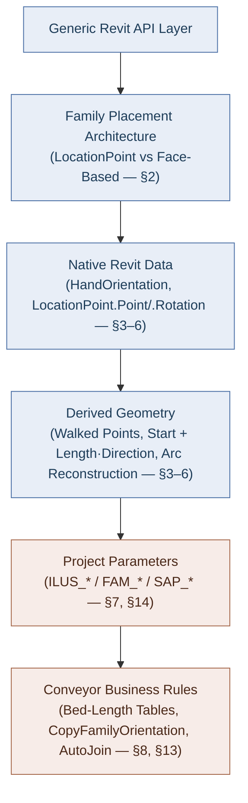

**Classification labels used throughout** (per family, per value — never assumed uniform):

| Label | Meaning |
|---|---|
| **Native** | Read directly from a Revit API property/method, unmodified |
| **Derived** | Computed mathematically/geometrically from other values already in hand |
| **Parameter-driven** | Read from a project/family parameter (`LookupParameter`) |
| **Business-specific** | Exists only because of a Conveyor project rule, not a generic Revit concept |
| **Not Applicable** | The concept has no meaningful independent existence for that case |

Labels are frequently **combined** (e.g. `Derived + Parameter-driven` for "Start + Length·Direction" where Length itself came from a parameter). No family is forced into a template it doesn't fit — see §12 for the full matrix, which intentionally does *not* look the same row-to-row.

### Verification method

The reverse-engineering report's claims were spot-checked by direct inspection of the cited files as they exist today. Every claim reused below either:
- **Confirmed from source** — I read the exact lines and they match, or
- **Strongly inferred** — consistent indirect evidence (e.g. grep confirms no counter-examples), or
- **Not verified** — reused from the report without independent re-check (scope too large to re-verify every line in one pass).

Five points were found during verification that **refine or add to** the original report (not contradictions — the original report's conclusions all held up); these are called out inline with a **"Verification note"** callout and consolidated in §20.

---

## 1. Executive Summary

- **Length** is never measured from placed geometry. It is always a parameter-arithmetic result: a direct instance parameter (`ILUS_Conveyor_OAL`), a sum of two parameters (CMB), or a total split across fixed/table-driven/search-selected segment lengths (CAR, NBLR, SC, CBC, AS35, CVB). See §3.
- **Start Point** is read from Revit natively exactly once per conversion run (`(genericInstance.Location as LocationPoint).Point`), then every subsequent segment's point is *computed* by walking forward (`location + cumulativePosition * HandOrientation`). See §4.
- **End Point** is `Start + Length·Direction` for straight/horizontal cases, a trig split (`cos`/`sin` of a slope-angle parameter) for inclines, and a polar reconstruction around an `Arc.Center` for curved (CVB) cases. It is frequently *not a stored value at all* — just an intermediate used once to place the next segment. See §5.
- **3D Direction** is overwhelmingly `FamilyInstance.HandOrientation` — Native Revit data, read directly, essentially never derived from `Curve.Direction`. See §6.
- **Rotation** has three independently-implemented, coexisting mechanisms — `FamilyHelper.CopyFamilyOrientation` (copies the *generic parent's* own rotation), `ConveyorSegment.PlaceSupps`/`PlaceGRs` (rotates a newly-placed instance about its *own* `HandOrientation × FacingOrientation` axis using an upstream business angle), and `ExternalPlaceConveyorFamily`'s interactive UI rotation. See §7.
- **Face-Based placement** is real and confirmed by the exact API overload used (`NewFamilyInstance(Face, XYZ, XYZ, FamilySymbol)`) for Guard Rails (CGR, all product lines), NBLR/CBC motors, and AS35 diverts. See §8, §10.
- **LocationCurve placement** does not occur for any live conveyor/GR/motor/connector instance. See §9.
- **CSUP (support) placement** — the original report marked this "not confirmed from inspected source." This audit resolves it: CSUP supports are placed through the same `FamilyHelper.CreateInstance` point-based factory as conveyor beds (`Logic/Models/ConveyorSegment.cs:45` → `Helpers/FamilyHelper.cs:578-592`). **Confirmed: CSUP is LocationPoint-based**, not hosted. See §10.14.
- **Guard Rail placement is not one algorithm.** A dedicated deep-dive (§10) confirms at least three independently-implemented flows converging on the same `NewFamilyInstance(Face, XYZ, XYZ, FamilySymbol)` endpoint — a shared straight-run splitter that walks *backward* from the run's outfeed tip and assigns a host bed by a separate maximum-overlap computation (§10.5), a CVB per-bed builder incapable of spanning beds (§10.10), and a set of bespoke per-geometry-case formulas (§10.12). The headline finding: for a 6 ft GR spanning a 4 ft + 2 ft two-bed run, the GR's `LocationPoint` and its chosen host bed land on **different beds** — see §10.7.

### High-Level System Architecture & Component Interactions

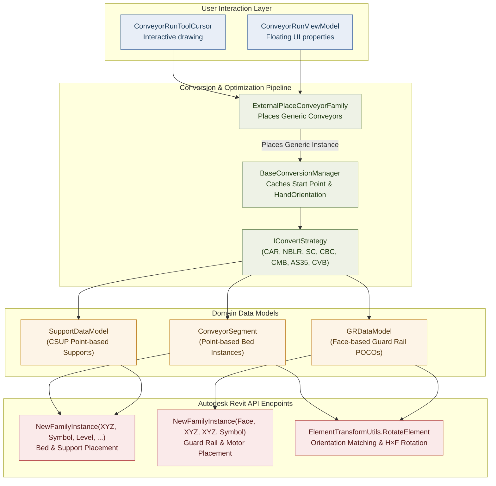

---

## 2. Family Placement Architecture

Three structurally distinct subsystems produce geometry, and they must not be conflated:

| Subsystem | Where | What it does |
|---|---|---|
| **A — Interactive placement** | `Events/ExternalPlaceConveyorFamily.cs`, `Commands/ConveyorRunToolCursor.cs`, `UI/ViewModels/ConveyorRunViewModel.cs` | Places **generic** conveyor instances one at a time while the user draws a run. Length/Rotation are often literal UI inputs; End Point = `StartPoint + HandOrientation*length` (or a trig/arc variant). |
| **B — Generic → Detailed conversion** | `Logic/ConvertStrategies/**`, `Logic/BaseConversionManager.cs`, `Utils/ConvertToDetailed/ConversionUtils.cs` | Reads one already-placed **generic** instance's `LocationPoint` once, replaces it with N **detailed** instances ("beds"), each walked forward using computed lengths and the generic instance's `HandOrientation`. This is the subsystem responsible for nearly everything in §3–§7. |
| **C — AutoJoin** | `Logic/AutoJoin/**` | Operates on two already-placed, detailed, point-based conveyors; computes a virtual intersection of their extrapolated centerlines, then trims/moves/rotates them and inserts connector families. |

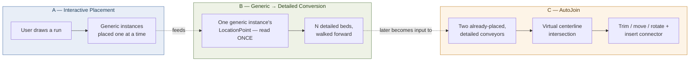

### Placement Overload Dispatch

Within Subsystem B, placement is split cleanly by API overload — **confirmed by which `NewFamilyInstance` overload is called, not by naming**:

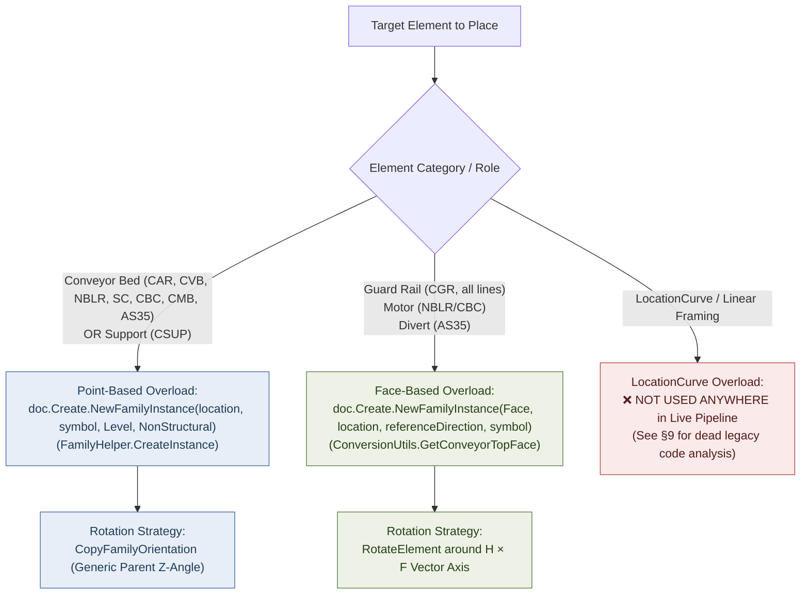

- **Point-Based:** every conveyor bed/segment across CAR, CVB, NBLR, SC, CBC, CMB, AS35 — created via `Globals.Doc.Create.NewFamilyInstance(location, symbol, StructuralType.NonStructural)` inside `FamilyHelper.CreateInstance` (`Helpers/FamilyHelper.cs:569,584`) — **Confirmed from source**.
- **Face-Based:** Guard Rails (all product lines' CGR families), NBLR/CBC motors, AS35 diverts — created via `NewFamilyInstance(Face, XYZ, XYZ, FamilySymbol)` — **Confirmed from source**, see §8, §10.
- **LocationCurve-Based:** none in the live placement/conversion pipeline — see §9.

There is **no `FamilyPlacementType` enum check anywhere in the repository** (confirmed by a fresh repo-wide grep during this audit — zero hits). Placement "type" in this codebase is purely an emergent property of which overload the code happens to call, never something the code introspects or branches on.

---

## 3. Length Analysis

Length is the value most likely to be confused with "physical geometry length" in this project. **It never is** — it is always **project-parameter arithmetic**, and the arithmetic differs completely per product line.

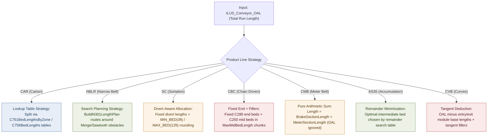

| Product line | Length source | Classification | Code evidence |
|---|---|---|---|
| CAR | `ILUS_Conveyor_OAL` split via `C751BedLengthsByZone`/`C756BedLengths` lookup tables; family-name overrides for `C757`/`C758`/`C781`/etc. | Parameter-driven + Business-specific (table split is a project rule) | `Logic/ConvertStrategies/CAR/CARStraightConverter.cs:127-189`, `CARBaseConversionManager.ApplySAPLengthParam:297-340` |
| NBLR | `ILUS_Conveyor_OAL` via `BuildN301LengthPlan` search, routes around detected Merge-Table/Sawtooth intersections | Parameter-driven + Business-specific | `NBLRStraightConverter.cs:1174-1240` |
| SC | `ILUS_Conveyor_OAL` split around fixed-length diverts; bed lengths rounded between hardcoded `MIN_BED_LENGTH`(3ft)/`MAX_BED_LENGTH`(12ft) constants | Parameter-driven + Business-specific | `SCStraightConverter.cs:244-267,482-503` |
| CBC | Fixed `C280` end beds (`FirstAndLastConveyorBedLengths`) + `C250` filler beds in `MaxMidBedLength` chunks | Parameter-driven + Business-specific | `CBCStraightConverter.cs:141-183` |
| CMB | **Pure sum**: `FAM_CMB_GENERIC_BRAKE_SECTION_LENGTH + FAM_CMB_GENERIC_METER_SECTION_LENGTH`. Comment in source explicitly notes `ILUS_Conveyor_OAL` is *not* an input. | Parameter-driven only (no table/search logic) | `CMBStraightConverter.cs:190-208` — the only pure 2-parameter-sum case in the codebase |
| AS35 | Fixed entry/terminal beds; `AS333` intermediate beds chosen by a remainder-minimizing search over a small constant table (`SelectOptimalIntermediateBed`) | Parameter-driven + Business-specific | `AS35StraightConverter.cs:162-179` |
| CVB | `ILUS_Conveyor_OAL` minus entry/exit module base lengths from `ModuleLengthsFt`/`GetDimensionFt` tables, plus tangent fillers | Parameter-driven + Business-specific | `CVBConverterHelper.CalculateTangentLength`, `CVBConstants.cs:577-589` |
| CGR / Guard Rail | Computed upstream `Length` written redundantly to `ILUS_Guardrail_Length`, `FAM_GUARDRAIL_LENGTH`, `SAP_CGR_NOMINAL_LENGTH` (string+double), `FAM_GUARDRAIL_LENGTH_LH/RH`, `FAM_GAURDRAIL_LENGTH` (typo preserved as found) — **Confirmed from source**, `Logic/Models/ConveyorSegment.cs:194-203`. The upstream `Length` itself is one of ≤10 ft segmentation-algorithm output (most product lines) or a bespoke business constant (CAR MergeTable, CVB curve entry/exit) — see §10.6/§10.12 for the full, per-flow breakdown; it is never one single formula. | Business-specific (redundant writes = family-revision compatibility, a project convention) | `ConveyorSegment.cs:187-296` |

The one place `Arc.Length`/edge-scanning is used (`CVBArcGeometryUtils.GetOuterArc`, `CARCurveConverter.GetOuterArc`) is to *identify* the longest arc edge of an **already-placed** instance's transformed solid, purely to find a reference point — **it is never written back as a conveyor's Length parameter**. Treat "Length as a business value" (what gets stored in `ILUS_Bed_Length`/`FAM_BED_LENGTH`) and "length measured from Revit geometry" (`Curve.Length`/`Arc.Length`) as two unrelated concepts in this codebase — they are never equated.

**Length is Not Applicable** as an independent concept for: AS35 diverts (face-placed, no length math at all — `AS35StraightConverter.cs:309-360`), CGR viewed as "does the GR have a Start/End/Length triad" (it has a Length parameter but no corresponding End Point — see §5, §10.1), and AutoJoin connector families (fixed by the chosen `FamilyPlacement.Radius`/type, not computed).

---

## 4. Start Point Analysis

**Native, read once per run:**
```csharp
// Utils/ConvertToDetailed/ConversionUtils.cs:296-305 (GetLocationPoint) — Confirmed from source, current line numbers match
location = (genericInstance.Location as LocationPoint)?.Point;
```
This is cached once (`BaseConversionManager.location`) and never re-read from Revit for the rest of the conversion. Every subsequent segment's point is **Derived**, not Native:

$$
\text{segment.LocationPoint} = \text{location} + \text{cumulativePosition} \times \text{HandOrientation}
$$

$$
\text{cumulativePosition} \mathrel{+}= \text{segment.Length} \quad (\text{Length is Parameter-driven — see §3})
$$

### The Walk-Forward Paradigm

```mermaid
flowchart LR
    L["P₀: Generic location<br/>(Native, read once)"] -->|offset = 0| S1["Bed 1: LocationPoint<br/>P₁ = P₀"]
    S1 -->|"+ Length₁ · HandOrientation"| S2["Bed 2: LocationPoint<br/>P₂ = P₀ + L₁ · H"]
    S2 -->|"+ Length₂ · HandOrientation"| S3["Bed 3: LocationPoint<br/>P₃ = P₀ + (L₁+L₂) · H"]
    S3 -.->|"…"| SN["Bed N: LocationPoint<br/>PN = P₀ + (Σ Lk) · H"]

    classDef anchor fill:#e8eef7,stroke:#4a6fa5,color:#1e3d59;
    classDef bed fill:#eef2e6,stroke:#608050,color:#264018;
    class L anchor
    class S1,S2,S3,SN bed
```

This walk-forward idiom is independently re-implemented (not shared code) across CAR, NBLR, SC, CBC, CMB, and AS35 converters — a **Business-specific** convention (the *pattern* of walking, not the underlying Native/Derived primitives it's built from).

**What "Start Point" is not proven to mean:** the code names this variable `location` (lowercase, generic) everywhere. It is never labeled "Infeed" in code or comments. The concept "Infeed" in this codebase names an **elevation parameter** (`ILUS_Infeed_Elevation`, a Z-only double on `ConveyorSegment.Infeet`), entirely distinct from the XYZ `LocationPoint`. Treat "the generic instance's point is the physical infeed edge" as **Strongly inferred, not Confirmed** — it's the run's start reference by construction/convention, but no in-code assertion checks it against the family's actual mesh.

**Per-family classification:**

| Case | Start Point classification |
|---|---|
| CAR/NBLR/SC/CBC/CMB/AS35/CVB straight & incline beds | Derived (native `location` + parameter-driven walk) |
| CAR curve/junction/merge/gate/pop-wheel bed itself | Native (unmodified generic point — the bed doesn't walk, only its supports/GRs do) |
| CVB curve/spur/par beds | Derived (walked, same as straight) |
| Guard Rail (any product line) | Derived + Business-specific (`dataModel.LocationPoint`, computed upstream by the parent converter's support/junction placement math, not read from Revit) |
| AS35 divert | Native (its own original `LocationPoint.Point`, captured once — divert does not walk) |
| AutoJoin connector | Derived (virtual line-intersection of two conveyors' extrapolated centerlines) |
| AutoJoin trimmed conveyor | Derived (`Location.Move(vector)` applied to the existing point) |
| Interactive placement (`ExternalPlaceConveyorFamily`) | Native (literal UI cursor point) |

Do not claim `LocationPoint.Point` is physically the conveyor infeed beyond what's stated above — that relationship is assumed by the walk-forward code, not independently verified against family geometry anywhere in source.

---

## 5. End Point Analysis

End Point is **usually not a stored value** — it is computed transiently to place the *next* segment or to close out a run, and its formula differs by geometry type.

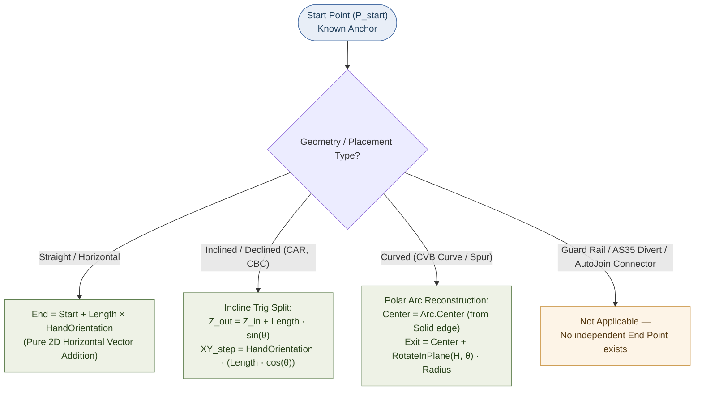

### 1. Straight / Horizontal Runs
$$
\text{End} = \text{Start} + \text{Length} \times \text{HandOrientation}
$$
Classification: **Derived + Parameter-driven** (Length is a parameter; Direction is Native).

### 2. Inclined / Declined Runs (CAR, CBC)
$$
\text{outfeedElevation}_Z = \text{infeedValue} + \text{Length} \times \sin(\theta)
$$
$$
\text{currentLocation}_{XY} \mathrel{+}= \text{Direction} \times \big(\text{Length} \times \cos(\theta)\big)
$$

`angle` ($\theta$) is sourced from a family parameter (`FAM_SLOPE_ANGLE_OPTIMIZED`, `FAM_INCLINE_ANGLE`, `FAM_NOSE_OVER_ANGLE`, etc.) — **Derived + Parameter-driven**. No converter derives End Point from Infeed/Outfeed elevation parameters *alone*, without the Length/angle term also present — elevation parameters describe endpoints of the whole run, not a per-formula input by themselves.

### 3. Curved Runs (CVB curve/spur/par)
```csharp
// Utils/Geometry/CVBArcGeometryUtils.cs:98-123 (MovePointAlongCurve) — Confirmed from source
var curve = GetOuterArc(instance);                          // longest Arc edge of the transformed solid
var center = curve.Center;
var d = center.DistanceTo(point);                            // radial distance from arc center
var rotationAngle = AngleConstants.RAD_90 - angleRad;         // sign-flipped if FacingFlipped
var vector = VectorUtils.RotateInPlaneRadians(instance.HandOrientation, XYZ.BasisX, XYZ.BasisY, rotationAngle);
var newPoint = center + vector * d;                           // reconstructed exit point on the arc
```
This is polar reconstruction around an actual placed instance's `Arc.Center`, not a `Curve.GetEndPoint` call and not `Start + Length·Direction`. Classification: **Derived** (from Native `Arc.Center`/`HandOrientation` plus a Business-specific angle input).

### 4. Not Calculated as an Independent Value
- **Guard Rail (CGR):** no End Point field exists at all — the GR is fully defined by its Length parameter (§3) plus its (derived) placement point. Classification: **Not Applicable**.
- **AS35 divert:** face-based, single-point placement — **Not Applicable**.
- **AutoJoin connector:** single-point placement, fixed by `FamilyPlacement` type — **Not Applicable**.

AutoJoin itself computes a similar `Start + Length*Direction` line independently, purely to find intersection/join points between two already-placed conveyors (`Events/ExternalPlaceAccessoryBase.cs:154-155` `ProjectOntoLine`, `AutoJoinProductLineJoinCase.cs:153-166` `FindIntersectionPoint`) — a **virtual** line, never a placed instance's actual geometry.

---

## 6. 3D Direction Analysis

`FamilyInstance.HandOrientation` is the near-universal source, read directly — **Native**. It is read from the *driving* instance, which is context-dependent:
- During Subsystem B conversion: the **generic** instance's `HandOrientation`.
- During AutoJoin/accessory placement: the already-placed **detailed** instance's `HandOrientation`.

`FacingOrientation` plays a **different role**: it is not used as the longitudinal travel direction anywhere in the point-based bed pipeline. Its confirmed uses are:
- As one leg of the `HandOrientation.CrossProduct(FacingOrientation)` rotation-axis construction for supports and GRs (§7, §8, §10) — Native inputs, Business-specific composition.
- As a component of `MovePointAlongCurve`'s `center = startPt + (faceDir.Negate() * fixedDis)` construction (`ConversionUtils.cs:412-422`) — a different, simpler `MovePointAlongCurve` overload than the CVB one in §5 (see verification note in §20).

`Direction` is derived from vector math (rather than read as `HandOrientation` directly) in exactly two confirmed places:
1. **AutoJoin handedness tests** — `GeometryHelper`-adjacent cross-product checks used to determine mirroring.
2. **CVB curve outlet direction** — `Transform.CreateRotation(XYZ.BasisZ, finalAngle).OfVector(fi.HandOrientation)` (`Events/ExternalPlaceConveyorFamily.cs:753`) — the **only** place in the audited placement code where a `Transform` object (rather than `ElementTransformUtils.RotateElement` or manual `VectorUtils.RotateInPlaneRadians`) derives a direction vector. A near-identical duplicate exists in `UI/ViewModels/ConveyorRunViewModel.cs:2086,2104` (see §20 — this file was previously unexamined and independently reimplements the same formula).

**The important distinction:** "Revit provides an orientation vector" (`HandOrientation` — Native, generic to any Revit add-in) is not the same statement as "the Conveyor project interprets that vector as the conveyor's longitudinal travel direction" (Business-specific interpretation — nothing in the Revit API says `HandOrientation` means "the way material moves"; that's a Conveyor domain convention layered on top).

| Case | Direction classification |
|---|---|
| All point-based beds (any product line) | Native (`HandOrientation`) |
| CVB curve/spur/par exit direction | Derived (Native `HandOrientation` rotated by a Business-specific angle) |
| Guard Rail | Native (parent's `HandOrientation`, passed through as the `referenceDirection` argument to `NewFamilyInstance(Face,...)`) |
| AutoJoin connector | Derived (`Math.Atan2` on flattened `HandOrientation` — see §7) |

---

## 7. Rotation Analysis

Three independently-implemented mechanisms coexist. None uses `Math.Atan2` on a direction vector to derive a *bed's* rotation (Atan2 is used only in AutoJoin, mechanism 4 below applied to connectors, not beds).

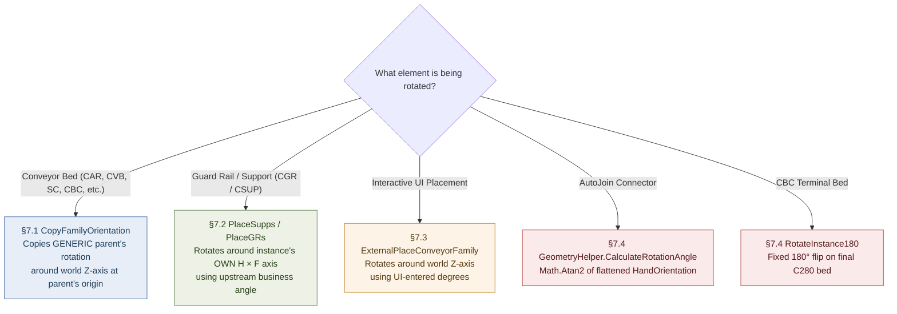

### 7.1 `FamilyHelper.CopyFamilyOrientation` — the dominant mechanism for beds

```csharp
// Helpers/FamilyHelper.cs:480-515 — Confirmed from source, read in full during this audit
LocationPoint? originalLocation = originalFamily.Location as LocationPoint;
double? rotationAngle = originalLocation?.Rotation;                 // Native — read from the GENERIC parent
XYZ rotationAxisStart = originalLocation.Point;
XYZ rotationAxisEnd = rotationAxisStart + XYZ.BasisZ;                // world Z axis
Line rotationAxis = Line.CreateBound(rotationAxisStart, rotationAxisEnd);
ElementTransformUtils.RotateElement(doc, instance.Id, rotationAxis, rotationAngle.Value);
instance.SetParameter("FAM_HAND_DIRECTION", instance.FacingFlipped ? 0 : 1);
(instance.Location as LocationPoint).Point = location;               // new position force-set AFTER rotation
```
Called from both overloads of `FamilyHelper.CreateInstance` (`:563-592`) — the shared factory used by nearly every converter. Effect: **every detailed bed in one conversion run gets the identical rotation value**, copied from the *generic parent's own* rotation, applied about a Z-axis anchored at the *parent's* point (not the new segment's own point), then the segment's computed position is force-set afterward.

Classification: **Native value (`LocationPoint.Rotation`) + Business-specific convention** (copy-once-reuse-for-every-child is a Conveyor decision, not a Revit requirement).

**Verification note:** a *second*, face-based overload of `CopyFamilyOrientation(Document, FamilyInstance, FamilyInstance, PlanarFace)` exists (`FamilyHelper.cs:516-561`), rotating about the face's normal instead of world Z and using a face-aware mirror-plane normal. A fresh grep across the whole repository during this audit found **zero call sites** for this overload — only the two `XYZ`-based overloads are ever invoked (`:572,587`). This is **dead code**, not previously called out in the source reverse-engineering report. See §20.

### 7.2 `ConveyorSegment.PlaceSupps` / `PlaceGRs` — for supports and Guard Rails

```csharp
// Logic/Models/ConveyorSegment.cs:53-58 (PlaceSupps) and :222-228 (PlaceGRs) — Confirmed from source
var H = inst.HandOrientation;          // the NEWLY PLACED instance's own orientation
var F = inst.FacingOrientation;
var l = Line.CreateBound(dataModel.LocationPoint, dataModel.LocationPoint + H.CrossProduct(F));
ElementTransformUtils.RotateElement(doc, inst.Id, l, dataModel.RotationAngle);
```

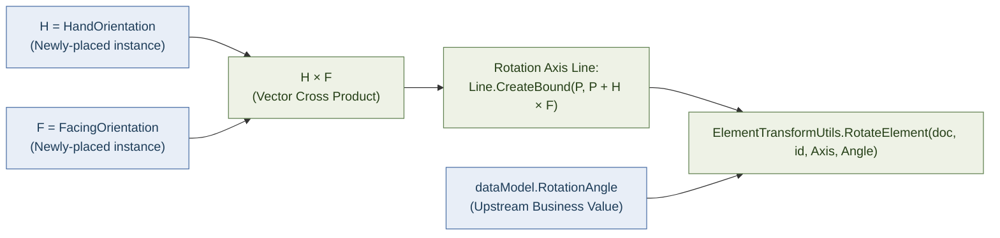

This only works because Revit assigns a default orientation to a newly-placed face-based (or point-based) instance at creation time, which is then queried immediately after `NewFamilyInstance` returns. `dataModel.RotationAngle` is an **upstream business value** — 30°/90° for junctions, a curve-angle lookup for CVB/CAR curves, `0` (skipped) otherwise.

Classification: **Business-specific** (both the axis-construction pattern and the angle value are project decisions; the only Native ingredients are `HandOrientation`/`FacingOrientation`/`CrossProduct`).

### 7.3 `ExternalPlaceConveyorFamily` — interactive placement

Rotates about `Line.CreateBound(StartPoint, StartPoint + XYZ.BasisZ)` using a caller-supplied or running-total-derived degree value from the floating-cursor UI. Classification: **Native mechanism** (`ElementTransformUtils.RotateElement` about world Z), **Business-specific input** (UI-entered degrees).

### 7.4 Special cases

- **CBC end-bed 180° flip:** `CBCStraightConverter.RotateInstance180` — a dedicated 180°-reversal for the final `C280` bed (`CBCStraightConverter.cs:214-226,262-266`). Business-specific.
- **CVB rotated variant:** rotates about the `H×F` axis using `CVBRotatedConverter.RotationAngleDegrees`/`RotatedDirection`. **Verification note — Confirmed dead/incomplete during this audit:** these two properties are declared (`CVBRotatedConverter.cs:28,30`) but a fresh grep found **no assignment site anywhere in the file** — `FAM_ROTATION_ANGLE` is therefore always written as `0` (`:329`). This is either dead code or an unfinished feature, not something to model as intentional Conveyor rotation logic.
- **AutoJoin connectors:** `GeometryHelper.CalculateRotationAngle` — `Math.Atan2(dir2D.Y, dir2D.X)` on the flattened `HandOrientation` of the first conveyor, applied via `RotateElement` about a world-Z axis at the join center (`Logic/AutoJoin/Helper/GeometryHelper.cs:45-55` — **Confirmed from source**, read in full). This is the only Atan2-based rotation derivation in the codebase, and it applies only to newly-inserted connector families, never to a bed.
- **`Utils/Geometry/CVBArcGeometryUtils.GetArcTangentRotation`** (`:149-167` — **new finding, not named in the source report**): computes a support's rotation from an arc's tangent direction (`Atan2` on a 90°-rotated radial vector, plus a 180° flip if `instance.Mirrored`). This is a second, narrower Atan2 usage, scoped to curved-segment support placement — worth knowing about if extending curve-support logic, but it does not change any conclusion above.

Do not reduce "how Conveyor rotates things" to `LocationPoint.Rotation` — it is one of at least five distinct, independently-coded mechanisms in active use.

---

## 8. Face-Based Families — General Pattern

Confirmed by the exact overload, not by naming:

```csharp
Globals.Doc.Create.NewFamilyInstance(HostPlanarFace, dataModel.LocationPoint, genericInstance.HandOrientation, dataModel.Family);
```

| Family | Host face | `XYZ` argument #1 (placement point) | `referenceDirection` |
|---|---|---|---|
| Guard Rail (CGR, any product line) | Top `PlanarFace` of the just-placed **detailed bed** (or a `CustomHostFace` override) | `dataModel.LocationPoint` — computed upstream by the parent converter | Parent generic instance's `HandOrientation` |
| NBLR / CBC motor | Top face of the **longest bed segment** | Segment midpoint | Generic instance's `HandOrientation` |
| AS35 divert | Top face of the **hosting conveyor segment** (found by `FindHostSegment`) | Divert's own original `LocationPoint.Point`, captured once | `FamilyMapping.OriginalInstance.HandOrientation` |

### Host Face Selection Pipeline

```csharp
// Utils/ConvertToDetailed/ConversionUtils.cs:59-75, GetConveyorTopFace — Confirmed from source, read in full
List<Solid> solids = instance.GetSymbolSolids(false, false);
var Faces = solids.SelectMany(s => s.Faces.Cast<Face>()).OfType<PlanarFace>();
var t = Faces.Where(f => f.FaceNormal.Z > 0.001);
var maxZ = t.Max(s => s.FaceNormal.Z);
planarFace = t.Where(f => f.FaceNormal.Z == maxZ).OrderByDescending(f => f.Area).FirstOrDefault();
```


This selects the highest-Z, largest-area planar face by `FaceNormal` — a **selection** operation, not an orientation one. GR orientation comes entirely from the `referenceDirection` argument (`HandOrientation`), not from the face normal.

**Geometric caveat (Confirmed from source):** `GetSymbolSolids` calls Revit's no-argument `GetSymbolGeometry()`, returning geometry in the **symbol's local coordinate system**. `GetConveyorTopFace` does **not** apply `instance.GetTotalTransform()` before selecting the face — unlike `CVBArcGeometryUtils.GetOuterArc`, which explicitly does. There is no visible `Transform.OfPoint`/`OfVector` reconciliation step; the code relies on the returned `Face`'s `Reference` resolving correctly against the actually-placed host instance when handed to `NewFamilyInstance`. Treat "the host Face passed to GR placement is fully reconciled against the host's world transform" as **Not verified** — plausible given `GeometryOptions.ComputeReferences = true` is set (`Helpers/ExtensionMethods/ElementExtensions.cs:34`), but not something the C# code independently asserts.

**Do not treat a Face-Based family as a re-skinned Point-Based family** — there is no Start/End/Length primitive pair for it; see §5 and §10.1.

---

## 9. LocationCurve — Explicitly Not Used for Placement

**No conveyor, guard-rail, motor, or connector `FamilyInstance` in this project is created via a curve-based `NewFamilyInstance` overload.** Confirmed by direct instantiation-site inspection across CAR/CVB/NBLR/SC/CBC/CMB/AS35/AutoJoin, and by every Start/End/Length/Direction formula in AutoJoin explicitly casting to `LocationPoint` and throwing if that fails (comments in the visitor classes literally describe these as "point-based families").

Two `LocationCurve`-adjacent code paths exist in the whole repository, **neither of which is live conveyor placement**:

1. `Commands/ElevationCreatorCommand.cs:379-382` — a defensive anchor-point fallback for elevation-view tagging:
   ```csharp
   if (inst.Location is LocationPoint lp) anchor = lp.Point;
   else if (inst.Location is LocationCurve lc) anchor = lc.Curve.Evaluate(0.5, true);
   else anchor = /* bounding-box center */;
   ```
   Unrelated to conveyor geometry; only exercised if some element handed to the elevation tagger happened to be curve-based (nothing in conveyor placement produces one).

2. **Verification note — new finding, not in the source report:** `Logic/convertToDetailed.cs` (lowercase class name `convertToDetailed`, distinct from the live `IConvertStrategy.ConvertToDetailed` interface method used by the real pipeline) contains a `PlaceBed` method that calls `doc.Create.NewFamilyInstance(line, symbol, doc.ActiveView)` — a genuine curve+view-hosted (2D detail component) overload that would create a `LocationCurve`. A repo-wide grep for constructors/callers of this class (`new convertToDetailed(`, `.PlaceBed(`) found **zero references anywhere** — this file is entirely dead/unreferenced legacy code (hardcoded `C380`/`C351`/`C352`/`C353` family names that don't appear anywhere in the live product-line families). It does not change the report's conclusion — LocationCurve genuinely plays no role in live placement — but it means the LocationCurve-producing call site count in the repo is two, not one, and both are inert with respect to production geometry.

`Curve.Length`/`Arc.Length`/`GetEndPoint` hits elsewhere in the repo (elevation annotation, `.Length` on custom business DTOs unrelated to `Curve`, `CVBCurveConverter.cs` dead/commented-out blocks) are unrelated to `LocationCurve` placement — see the source report §5 for the exhaustive list; this audit did not find reason to revise it.

**Do not build a generic LocationCurve implementation for Conveyor just because the Revit API supports it — the project never uses one.**

---

## 10. Guard Rail (CGR) — Business Logic Deep Dive

**Source of truth for this section:** `GR_DeepDive_Final_Source_Analysis.md` (repository root of the Daifuku project). That report is a **second-pass investigation performed directly against the live `DaifukuRevitAddin` source tree**, superseding an earlier documentation-only GR pass. It fully opened and read `GRDataModel.cs`, `ConveyorSegment.cs`, `OneToManyConversionUtils.cs`, `StraightConverter.cs`, and `CVBGuardRailBuilder.cs`; it opened targeted, line-numbered excerpts of `ConversionUtils.cs`, `CARBaseConversionManager.cs`, `CARStraightConverter.cs`, `CARMergeTableConverter.cs`, `CARJunctionConverter.cs`, `CVBCurveConverter.cs`, `CVBRotatedConverter.cs`, `SpurParGuardRailService.cs`, `CVBSpurConverter.cs`, and `CARConstants.cs`. It **located but did not open** the internal arithmetic of `CARMergeConverter.cs`, `CARPopWheelConverter.cs`, `CARGateConverter.cs`, `CARInclinedDeclinedConverter.cs`, `CBCInclinedDeclinedConverter.cs`, `CBCStraightConverter.cs`, `SCStraightConverter.cs`, `NBLRStraightConverter.cs`, `CMBStraightConverter.cs`, `AS35StraightConverter.cs`, and the CVB skew/spur-par/bracket-service files beyond grep-confirming they call into the shared machinery traced below. Every claim in this section carries the same confidence label the source report gives it — **CONFIRMED FROM SOURCE**, **Strongly inferred**, or **NOT FOUND IN SOURCE** / **located, not opened** — and this document does not upgrade any claim beyond what that investigation actually supports.

### 10.1 What a Guard Rail Is, in Business Terms

A Guard Rail (family names `CGR_*`, e.g. `CGR_C2000`, `CGR_C2006`) is a **face-hosted family instance** placed on top of an already-placed, already-detailed conveyor bed. It exists to protect the sides of a conveyor run. Structurally, a GR has only **two** independent business values, not the three (Start/End/Length) that a conveyor bed has:

- **A placement point** (`LocationPoint`) and an **orientation** (a rotation angle plus a host face) — where and how it sits.
- **A length** (`Length`) — how long it is.

There is **no End Point concept for a GR at all**: the GR is fully defined by its one placement point, its Length, its host face, and its rotation. Classification: **End Point — Not Applicable**, backed by a full trace of every formula that produces `LocationPoint`/`Length` (§10.5–§10.12).

### 10.2 GR Architecture — Three Independent Flows, Never Merged

| Flow | Who uses it | What it does | Confidence |
|---|---|---|---|
| **A — Shared straight-run splitter** | CAR Straight, CAR Skew, CAR Inclined, CBC Straight, CBC Inclined, SC Straight, NBLR Straight, CMB Straight | Splits one run's total length into ≤10 ft GR pieces (`StraightConverter.GenerateGRLenghts`), then assigns each piece a `LocationPoint` and a host bed via an independent backward walk + max-overlap sweep (`OneToManyConversionUtils.MapGRsToConveyors`) | **CONFIRMED FROM SOURCE** — full arithmetic traced, §10.5–§10.7 |
| **B — CVB per-bed builder** | CVB straight-family segments (via `CVBGuardRailBuilder.FillGRModels`) | Creates **exactly one GR per `ConveyorSegment`**, sized to that segment's own `Length`, via a forward walk from that same segment's own end point. Structurally incapable of spanning beds. | **CONFIRMED FROM SOURCE** — full arithmetic traced, §10.10 |
| **C — Bespoke / special-case builders** | CAR Junction, CAR Merge, CAR MergeTable, CAR PopWheel, CAR Gate, CVB Curve, CVB Rotated, CVB Spur, CVB SpurPar | Each is its own hand-written method producing one or a small fixed number of `GRDataModel`s via bespoke, per-case formulas (business constants, angle tables, entry/exit offsets) | **CONFIRMED FROM SOURCE** for the specific methods opened (CAR MergeTable, CAR Junction dispatch, CVB Curve/Rotated/Spur formulas — §10.12) |

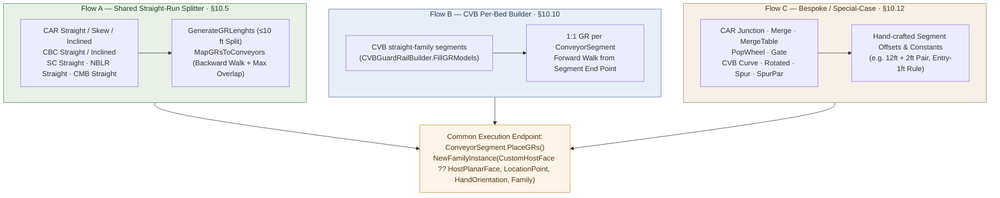

### 10.3 GRDataModel — The Business-Data Object

`GRDataModel` (`Logic/Models/GRDataModel.cs`, read in full) is the business-data object every flow above eventually populates and hands to `ConveyorSegment.PlaceGRs` for the final Revit placement call. It is a **plain mutable POCO with no constructor-enforced invariants**:

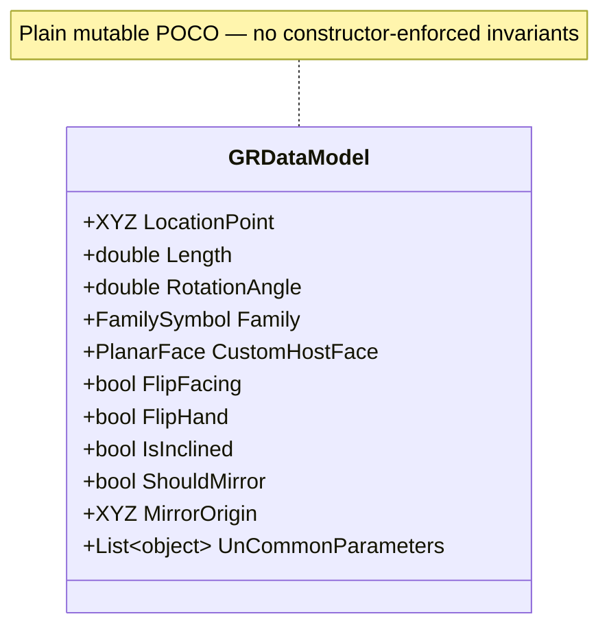

| Field | Type | Meaning |
|---|---|---|
| `LocationPoint` | `XYZ` | The GR's placement point — computed differently per flow (§10.5, §10.10, §10.12); never read from Revit natively |
| `Length` | `double` | The GR's length — a business-arithmetic result, never a measured Revit distance (§10.6) |
| `RotationAngle` | `double` | Post-creation rotation, applied about the newly-placed instance's own `H×F` axis (§10.13); `0` means "skip rotation" |
| `Family` | `FamilySymbol` | Which `CGR_*` family/type to instantiate |
| `CustomHostFace` | `PlanarFace?` | Overrides the default top-face host selection — exactly one assignment site in the whole repository (§10.8) |
| `FlipFacing` / `FlipHand` | `bool` | Mirroring/handedness flags consumed inside `PlaceGRs` |
| `IsInclined` | `bool` | Gates the one `CustomHostFace` assignment site (§10.8) — otherwise not traced further in this pass |
| `ShouldMirror` / `MirrorOrigin` | `bool` / `XYZ` | Drive a `Plane.CreateByNormalAndOrigin` + `ElementTransformUtils.MirrorElements` mirror operation inside `PlaceGRs`, unrelated to face projection (§10.9) |
| `UnCommonParameters` | `List<(string, object)>` | Extra family-parameter writes beyond the common set `PlaceGRs` always writes |

### 10.5 Shared Straight-Run GR Algorithm (Flow A) — Full Trace

This is the algorithm that governs CAR Straight/Skew/Inclined, CBC Straight/Inclined, SC Straight, NBLR Straight, and CMB Straight. **CONFIRMED FROM SOURCE**, full arithmetic:

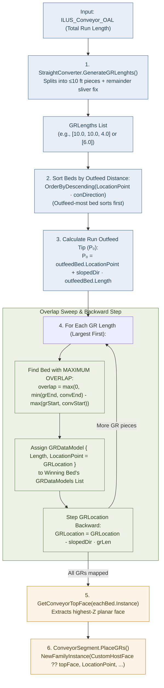

**The generic mathematical model underneath this:**

$$
P = P_0 + D \times \text{offset}
$$

```csharp
// OneToManyConversionUtils.cs:32-121, read in full — exact formula
var conDirection = genericInstance.HandOrientation;
var grLengths = GRLengths.OrderDescending().ToList();
var conveyorsDesending = Conveyors
    .OrderByDescending(c => c.Length)                                  // has NO effect — see note below
    .OrderByDescending(s => s.LocationPoint.X * conDirection.X + s.LocationPoint.Y * conDirection.Y)
    .ToList();

var con = conveyorsDesending.FirstOrDefault();          // the outfeed-most bed
var location = con.LocationPoint;
location = new XYZ(location.X, location.Y, con.Infeet);  // Z forced to that bed's own Infeet
var slopedDirection = conDirection;
if (angle != 0)
    slopedDirection = VectorUtils.RotateInPlaneRadians(conDirection, horizontalDir, XYZ.BasisZ, angle).Normalize();

XYZ GRLocation = location + slopedDirection * con.Length;   // P0 = outfeed tip of the OUTFEED-MOST bed
                                                              //    = the outfeed tip of the ENTIRE run

// for each GR length, largest first:
//   bestConveyor = the bed with MAXIMUM OVERLAP against [GRLocation-side interval] in an abstract
//                  "distance from the outfeed end" coordinate — a SEPARATE computation from GRLocation itself
conveyorsDesending[bestConveyor].GRDataModels.Add(new GRDataModel { Length = grLen, LocationPoint = GRLocation, Family = symbol });
GRLocation = GRLocation + slopedDirection.Negate() * grLen;   // step BACKWARD by this GR's own length
```

### 10.6 The 10 ft Maximum / 1 ft Minimum Segmentation Rules

$$
\text{numFull} = \left\lfloor \frac{\text{total}}{10} \right\rfloor \qquad \text{remainder} = \text{total} \bmod 10
$$

```csharp
// StraightConverter.cs:106-130, read in full
public static List<double> GenerateGRLenghts(double conveyorsTotal)
{
    var grLengths = new List<double>();
    int numFullGRs = (int)(conveyorsTotal / maxGRC2000Length);       // numFull = floor(total / 10)
    double grRemainder = conveyorsTotal % maxGRC2000Length;          // remainder = total mod 10

    for (int i = 0; i < numFullGRs; i++) grLengths.Add(maxGRC2000Length);   // full 10 ft pieces
    if (grRemainder > 0) grLengths.Add(grRemainder);                        // + the remainder piece

    for (int i = 0; i < grLengths.Count - 1; i++)                    // sub-1-ft sliver adjustment:
        if (grLengths[i + 1] < 1)                                    // if the next piece would be < 1 ft,
        {
            grLengths[i] -= 1;                                       // borrow 1 ft from the piece before it
            grLengths[i + 1] += 1;
        }

    grLengths.Reverse();                                             // moot — MapGRsToConveyors re-sorts anyway
    return grLengths;
}
```

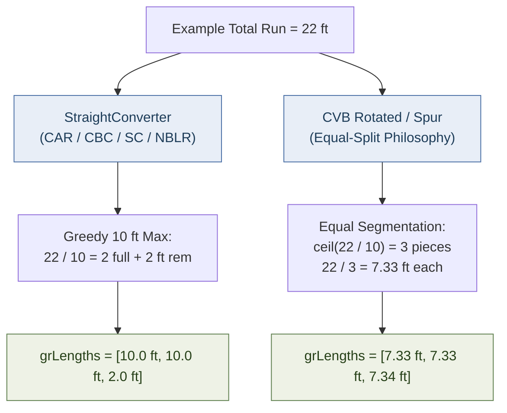

### 10.7 The Critical 6 ft Example — "6 ft Guard Rail over 4 ft + 2 ft Beds"

**Setup:**
- Bed A: `Length = 4 ft` (upstream / infeed side)
- Bed B: `Length = 2 ft` (downstream / outfeed side)
- Total `ILUS_Conveyor_OAL` = 6 ft

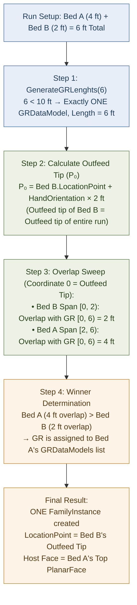

```
Physical Layout & Span Comparison:

         Bed A (4 ft Upstream)           Bed B (2 ft Downstream)
|-----------------------------------|-------------------|
[=================== 6 ft Guard Rail Span =====================]
                                                        ^
                                          GR LocationPoint = Bed B Tip

Host Bed Selected: Bed A (Overlap = 4 ft > Bed B Overlap = 2 ft)
```

- **GR LocationPoint = Bed B's outfeed tip** — the downstream end of the entire 6 ft run — computed as `BedB.LocationPoint + HandOrientation × 2`.
- **Host selection = Bed A**, because host selection is based on **maximum overlap** with the GR's own abstract span ($4\text{ ft} > 2\text{ ft}$).
- **One `FamilyInstance` is created**, not two.

### 10.10 CVB Per-Bed GR Flow (Flow B)

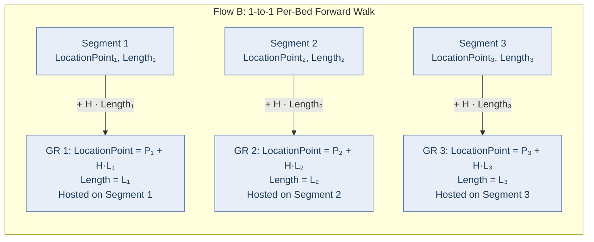

### 10.13 Rotation — Kept Strictly Separate from Position, Length, and Host Face

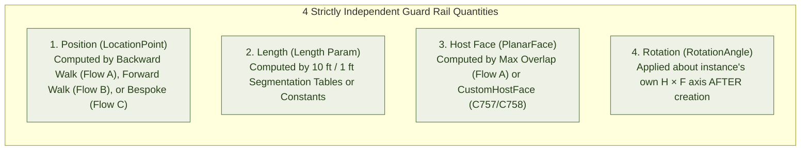

---

## 11. Curved Geometry — CVB and Related

**Family placement** and **geometry extraction/reverse-engineering** are two distinct activities in this codebase and must not be conflated:

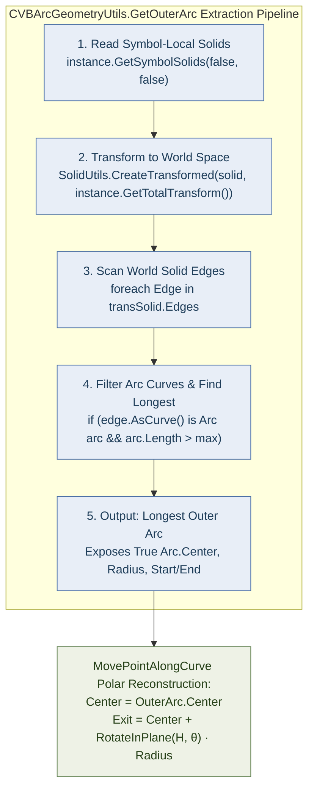

```csharp
// Utils/Geometry/CVBArcGeometryUtils.cs:25-81 (GetOuterArc) — Confirmed from source, read in full
var solids = instance.GetSymbolSolids(false, false);                              // symbol-local geometry
foreach (var maxSolid in solids)
{
    var transSolid = SolidUtils.CreateTransformed(maxSolid, instance.GetTotalTransform());  // → world space
    foreach (Edge edge in transSolid.Edges)
        if (edge.AsCurve() is Arc arc && arc.Length > maxLength) { maxLength = arc.Length; longestArc = arc; }
}
return longestArc;
```

---

## 12. Family Classification Matrix

This table is built from source-code evidence (§3–§11), not assumed. Combined labels (`X + Y`) are used where a value is genuinely composed of two classifications.

| Case | Placement | Length | Start Point | End Point | 3D Direction | Rotation |
|---|---|---|---|---|---|---|
| CAR straight/skew bed | Point-Based | Parameter-driven + Business-specific (table split) | Derived (walked) | Derived + Parameter-driven (not stored) | Native | Native + Business-specific (`CopyFamilyOrientation`) |
| CAR incline/decline bed | Point-Based | Parameter-driven + Business-specific | Derived (walked, `cos(angle)`) | Derived + Parameter-driven (`cos/sin(angle)`) | Native (horizontal only) | Native + Business-specific |
| CAR curve/junction/merge bed | Point-Based | Not Applicable for the bed itself (intrinsic to family) | Native (unmodified generic point) | Not Applicable for the bed; supports use Derived (`Start+Length·Direction` or arc-derived) | Native / Derived (curve case, via `GetTotalTransform`+`Arc.Center`) | Business-specific (manual `H×F` rotation for supports/GR) |
| NBLR straight bed | Point-Based | Parameter-driven + Business-specific (`BuildN301LengthPlan`) | Derived (walked; intersection-aware) | Derived + Parameter-driven | Native | Native + Business-specific |
| NBLR motor | Face-Based | Not Applicable | Derived + Business-specific (segment midpoint of longest bed) | Not Applicable | Native (parent `HandOrientation`) | Native (face-based default) |
| SC straight bed | Point-Based | Parameter-driven + Business-specific (divert-aware planner) | Derived (walked, horizontal-only) | Derived + Parameter-driven | Native | Native + Business-specific |
| CBC straight/incline bed | Point-Based | Parameter-driven + Business-specific (fixed end + filler) | Derived (walked; reversed for end `C280`) | Derived + Parameter-driven | Native (horizontal) | Native + Business-specific (+ special 180° flip) |
| CBC motor | Face-Based | Not Applicable | Derived + Business-specific (top face of longest `C250`) | Not Applicable | Native | Native (face-based default) |
| CMB bed | Point-Based | Parameter-driven (pure 2-parameter sum) | Native (single segment, unmodified `location`) | Not Applicable (single segment; support points are Derived) | Native | Native + Business-specific |
| AS35 straight bed | Point-Based | Parameter-driven + Business-specific (remainder-minimizing search) | Derived (walked) | Derived + Parameter-driven | Native | Native + Business-specific |
| AS35 divert | Face-Based | Not Applicable | Native (own captured original point) | Not Applicable | Native | Native (face-based default) |
| CVB straight/skew bed | Point-Based | Parameter-driven + Business-specific (`OAL` minus module tables) | Derived (walked) | Derived + Parameter-driven | Native | Native + Business-specific |
| CVB rotated bed | Point-Based | Parameter-driven + Business-specific | Derived (walked) | Derived + Parameter-driven | Native | Business-specific, currently **always 0** (dead fields — §7.4/§20) |
| CVB curve/spur/par bed | Point-Based | Parameter-driven + Business-specific (entry/exit + module tables) | Derived (walked) | Derived (arc-center polar reconstruction) | Native + Derived (rotated by table angle) | Business-specific (table-driven `CurveAngles`/`SpurAngles`) |
| Guard Rail (any product line) | Face-Based | Parameter-driven + Business-specific (10 ft max/1 ft min segmentation, or a bespoke constant — §10.6, §10.12) | Derived + Business-specific — **backward** walk from the outfeed tip of the whole run for the shared straight-run splitter (§10.5), a **forward** per-bed walk for CVB (§10.10), or a bespoke formula (§10.12); never Native | Not Applicable | Native (parent `HandOrientation`) | Business-specific (`H×F` axis on the newly-placed instance, upstream angle — §10.13) |
| CSUP (support) | Point-Based (§10.14) | Not modeled as a Length primitive here (height/elevation params drive it instead) | Derived + Business-specific (`dataModel.LocationPoint`, from parent) | Not Applicable | Native (via `CopyFamilyOrientation`) | Native + Business-specific (bed-style), plus `H×F` override when `RotationAngle != 0` (GR-style) |
| AutoJoin connector | N/A (existing instances) | Not Applicable (fixed `FamilyPlacement.Radius`/type) | Derived (virtual line-intersection) | Not Applicable | Derived (`Atan2` of flattened `HandOrientation`) | Derived + Business-specific (`Atan2`-derived) |
| AutoJoin trimmed conveyor | N/A (existing instance) | Parameter-driven (OAL rewritten via dot-product projection) | Derived (`.Move(vector)`) | Derived + Parameter-driven | Native (unchanged) | Not Applicable (unchanged from original placement) |
| Interactive placement, straight/skew | Point-Based | Parameter-driven (UI value written to `FAM_BED_LENGTH`/`ILUS_Conveyor_OAL`) | Native (literal UI point) | Derived + Parameter-driven | Native | Native (`RotateElement`, UI-supplied degrees) |
| Interactive placement, CVB curve | Point-Based | Parameter-driven (`EntryLength`/`ExitLength`) | Native (literal UI point) | Derived (`Transform.CreateRotation(...).OfVector` + arc-polar) | Derived (via `Transform`) | Derived (running total of entered angles) |

---

## 13. Generic Revit API vs Conveyor Business Logic

### Generic Revit API layer (would apply to any Revit add-in)

`LocationPoint` (`.Point`, `.Rotation`), `HandOrientation`, `FacingOrientation`, `FacingFlipped`, `Mirrored`, `Document.Create.NewFamilyInstance` (point overload, face overload, curve+view overload), `ElementTransformUtils.RotateElement`/`MirrorElements`/`MoveElement`/`CopyElement`, `Element.LookupParameter`, `Arc.Center`/`.Length`, `Curve.Evaluate`/`.ComputeDerivatives`, `SolidUtils.CreateTransformed`, `FamilyInstance.GetTotalTransform()`/`GetTransform()`, `PlanarFace.FaceNormal`, `Line.CreateBound`/`CreateUnbound`, `Line.Intersect`, `Location.Move(XYZ)`.

### Conveyor-specific layer (would not exist in a generic Revit add-in)

- The generic→detailed conversion pipeline itself (reading one point once, synthesizing N instances by cumulative-length walking) — the central Conveyor idiom.
- All `ILUS_*`/`FAM_*`/`SAP_*` parameter names and their per-product-line semantics.
- Bed-length lookup/cut tables (`C751BedLengthsByZone`, `ModuleLengthsFt`, `BuildN301LengthPlan`, `SelectOptimalIntermediateBed`, SC's divert-aware planner).
- Family-name string conventions and `.Contains(...)`/`.Equals(...)` branching on them (`C757`, `CGR_C2016`, `N301`, etc.).
- The `CopyFamilyOrientation` "one rotation per run, copied from the generic parent" convention.
- Guard Rail conventions: which families are face-hosted, the redundant multi-parameter length-writing pattern, bracket-number/powered-vs-passive logic keyed on `SAP_CGR_APPLICATION`.
- AutoJoin's `JoinCase`/`JoinSolution`/`FamilyPlacement` classification and connector-family catalog.
- Hand-rolled polar/vector math (`VectorUtils.RotateInPlaneRadians`, `CVBArcGeometryUtils.MovePointAlongCurve`) replacing what a native `Transform`/`Curve` API could arguably do more directly.
- The external SQLite parameter-name/range registry (`FamilyParameterDbService` and friends) — a data layer, not a Revit concept.

---

## 14. Parameter → Geometry Dependency Map

```mermaid
flowchart TD
    subgraph InParams ["Input Parameters (Read from Generic / User)"]
        OAL["ILUS_Conveyor_OAL"]
        InZ["ILUS_Infeed_Elevation"]
        OutZ["ILUS_Outfeed_Elevation"]
        SlopeAng["FAM_SLOPE_ANGLE_OPTIMIZED"]
        EntryL["FAM_Entry_Length"]
        ExitL["FAM_Exit_Length"]
        CMB_Brake["FAM_CMB_GENERIC_BRAKE_SECTION_LENGTH"]
        CMB_Meter["FAM_CMB_GENERIC_METER_SECTION_LENGTH"]
    end

    subgraph GeoOps ["Geometric & Spatial Processing"]
        Splitter["Bed Length Planning & Splitting"]
        Walk["Walk-Forward Vector Addition (Start + Σ L · H)"]
        InclineTrig["Incline Decomposition (L·cos θ, L·sin θ)"]
        ArcMath["Outer Arc Extraction & Polar Stepping"]
        GR_Split["Guard Rail Splitter & Overlap Sweep"]
    end

    subgraph OutParams ["Output Parameters (Written to Detailed Instances)"]
        BedL["ILUS_Bed_Length / FAM_BED_LENGTH"]
        GRL["ILUS_Guardrail_Length / FAM_GUARDRAIL_LENGTH"]
        SAP_GRL["SAP_CGR_NOMINAL_LENGTH"]
        HandDir["FAM_HAND_DIRECTION"]
    end

    OAL --> Splitter
    CMB_Brake --> Splitter
    CMB_Meter --> Splitter
    EntryL --> ArcMath
    ExitL --> ArcMath

    Splitter --> BedL
    Splitter --> Walk
    Splitter --> GR_Split

    InZ --> InclineTrig
    OutZ --> InclineTrig
    SlopeAng --> InclineTrig
    Walk --> InclineTrig

    GR_Split --> GRL
    GR_Split --> SAP_GRL

    classDef inP fill:#e8eef7,stroke:#4a6fa5,color:#1e3d59;
    classDef geo fill:#eef2e6,stroke:#608050,color:#264018;
    classDef outP fill:#fdf4e7,stroke:#c48830,color:#543810;
    class OAL,InZ,OutZ,SlopeAng,EntryL,ExitL,CMB_Brake,CMB_Meter inP
    class Splitter,Walk,InclineTrig,ArcMath,GR_Split geo
    class BedL,GRL,SAP_GRL,HandDir outP
```

| Parameter | Family/Case | Used For | Geometry Effect | Classification |
|---|---|---|---|---|
| `ILUS_Conveyor_OAL` | CAR, NBLR, SC, AS35, CVB | Length | Total run length, split/searched into per-bed lengths | Parameter-driven |
| `ILUS_Infeed_Elevation` / `ILUS_Outfeed_Elevation` | Universal | Start/End Z | Elevation of the run's Z-axis endpoints; combined with slope-angle params for inclined End Point | Parameter-driven |
| `ILUS_Zone_Length` | CAR, NBLR | Length granularity | Bounds segment-length search/rounding | Parameter-driven |
| `ILUS_Bed_Length` / `FAM_BED_LENGTH` | All product lines | Length (written) | Written on every detailed bed via `SetCommonConveyorParameters` — the canonical "this bed's length" output, not an input | Parameter-driven (write target) |
| `FAM_SLOPE_ANGLE_OPTIMIZED` / `FAM_INCLINE_ANGLE` / `FAM_NOSE_OVER_ANGLE` | CAR, CBC | Direction/End Point | `cos`/`sin` split of Length into XY/Z components | Parameter-driven |
| `FAM_Entry_Length` / `FAM_Exit_Length` | CVB | Length | Subtracted from `ILUS_Conveyor_OAL` to find the curve's own arc length | Parameter-driven |
| `FAM_CMB_GENERIC_BRAKE_SECTION_LENGTH` / `FAM_CMB_GENERIC_METER_SECTION_LENGTH` | CMB | Length | Direct sum — the only pure-parameter-sum Length in the project | Parameter-driven |
| `FAM_Divert_QTY` / `FAM_Divert_{i}_Distance` | SC | Length planning | Positions fixed-length divert segments within the total length | Parameter-driven |
| `FAM_ROTATION_ANGLE` | CVB rotated | Rotation (written) | **Always written as 0** — backing fields never assigned (§7.4, §20) | Parameter-driven (write target), but Confirmed dead — value never varies |
| `ILUS_Guardrail_Length` / `FAM_GUARDRAIL_LENGTH` / `SAP_CGR_NOMINAL_LENGTH` / `FAM_GUARDRAIL_LENGTH_LH`/`_RH` | CGR | Length (written, redundantly) | Same computed value fanned out to multiple parameter names for family-revision compatibility | Parameter-driven (write target) |
| `SAP_CGR_APPLICATION` | CGR | Bracket selection | String-contains check (`"POWERED"`) selects `FAM_BRACKET` value — geometry-adjacent, not itself a geometric quantity | Business-specific |
| `Offset from Host` / `InstanceFreeHostOffsetParam` | CGR, CSUP | Host offset | Governs how far the GR/support stands off its host face — a placement-adjacent geometric value | Parameter-driven |

---

## 15. Transform Usage Audit

| Call | Where (Confirmed from source, fresh grep this audit) | Applied to | Purpose | Layer |
|---|---|---|---|---|
| `GetTransform()` | `Commands/ElevationCreatorCommand.cs:481,501,513,547,796,1038,1085` — **and nowhere else in the repository** | `FamilyInstance`/`Mullion` | Elevation-view/annotation geometry construction | Unrelated to conveyor placement |
| `GetTotalTransform()` | `CVBArcGeometryUtils.cs:62`; `ExternalPlaceConveyorFamily.cs:931`; `NBLRStraightOptimizer.cs:217,219`; `NBLRStraightConverter.cs:546,611,615`; `CVBCurveConverter.cs:318`; `AS35StraightConverter.cs:99,101,322`; `CARCurveConverter.cs:552` | `Solid` (via `SolidUtils.CreateTransformed`) for arc extraction; `.Origin` read directly elsewhere | Repositioning symbol-local geometry to world space; reading an instance's world origin for dot-product position/intersection math (NBLR component detection, AS35 divert positioning) | Generic mechanism, Conveyor-specific purpose |
| `Transform.CreateRotation(...).OfVector(...)` | `ExternalPlaceConveyorFamily.cs:753`; **also** `UI/ViewModels/ConveyorRunViewModel.cs:2086,2104` (new finding — see §20) | `HandOrientation` vector | Rotate the outlet direction of an interactively-placed CVB curve by the accumulated curve angle | Interactive placement only; never used in Subsystem B (conversion) |
| `.Inverse()` | Not found anywhere in either audit | — | — | — |
| `Transform.OfPoint()` | Not found in placement/conversion code | — | — | — |

**Why Transform is used at all:** in every genuine placement/conversion case, the purpose is identical — take a `Solid` in the family symbol's **local** coordinate system (`GetSymbolGeometry()`/`GetSymbolSolids()`) and move it to **world/instance space** via `SolidUtils.CreateTransformed(solid, instance.GetTotalTransform())`, so edge-scanning code operates on the instance's actual placed position/rotation rather than unplaced local geometry. This pattern is used to extract **points** (an arc center, consumed downstream) — it is never applied to a raw output **vector** via `.OfVector` in the conversion pipeline; vector work there is done with manual dot/cross-product math (`VectorUtils.RotateInPlaneRadians`) instead.

---

## 16. What This Project Teaches the Generic TransformModule

| Reusable Generic concept | Illustrated by Conveyor as... |
|---|---|
| `LocationPoint.Point` → a placement anchor, read once | The generic instance's captured `location` |
| `HandOrientation` → a Native longitudinal/reference direction | Direction for every point-placed family in the project |
| `LocationPoint.Rotation`, copy-and-reapply via `ElementTransformUtils.RotateElement` about a Z-axis | `CopyFamilyOrientation` |
| `Start + Length·Direction` → a Derived endpoint for any point-placed, length-parameterized family | Every straight-bed End Point formula |
| Face-Based placement = host face + placement point + reference direction (`NewFamilyInstance(Face, XYZ, XYZ, FamilySymbol)`) | Guard Rail, motor, divert placement |
| Selecting a host face by normal direction + area, from symbol-local solids | `GetConveyorTopFace` |
| `SolidUtils.CreateTransformed(solid, instance.GetTotalTransform())` + edge-scanning for a specific edge type (e.g. longest `Arc`) | `CVBArcGeometryUtils.GetOuterArc` — reusable whenever a curved family's shape isn't exposed via `Location` |
| Polar reconstruction around a discovered `Arc.Center` | `MovePointAlongCurve` |
| Virtual-line intersection (`Line.CreateUnbound` + `Line.Intersect`) between two independently-oriented elements | AutoJoin's join-point calculation |
| `HandOrientation.CrossProduct(FacingOrientation)` as a rotation axis appropriate to a just-placed instance's own orientation | GR/support rotation |

---

## 17. Project-Specific Adapter Concept

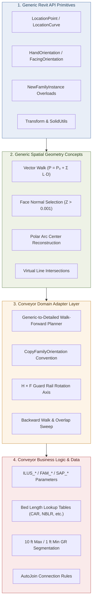

---

## 18. Should a Command Be Created?

**Decision: No command was created.**

The task-specific bar for justifying a Command is that it demonstrates something "that cannot be adequately understood from the MD documentation alone." Evaluated against that bar:
- Every geometric mechanism in this document is fully traceable from static source.
- This audit was performed without a live Revit session or the ability to build the `DaifukuRevitAddin` project.
- Every genuinely reusable idea here (Face-Based host-face selection, arc-center reconstruction) is already demonstrated generically in [`TransformGeometryUtils.cs`](file:///c:/Users/Mostafa.Badr/Downloads/00/00-%20Repos/RevitSamples/RevitApiSamples/Samples/Transform/Helpers/TransformGeometryUtils.cs) and the commands in `Samples/Transform/Commands/`.

---

## 19. Preserve Source Code — Confirmation

No Conveyor production file was modified, refactored, renamed, or behaviorally altered to produce this document. All code shown above is quoted verbatim from the existing source for citation purposes only. No command was created (§18).

---

## 20. Unknowns & Summary of Findings

- **Confirmed dead code:** `FamilyHelper.CopyFamilyOrientation(Document, FamilyInstance, FamilyInstance, PlanarFace)` (`Helpers/FamilyHelper.cs:516-561`) — a face-normal-based rotation overload with zero call sites anywhere in the repository.
- **Confirmed dead code:** `Logic/convertToDetailed.cs` — entirely unreferenced legacy prototype, including a `LocationCurve`-producing `NewFamilyInstance(line, symbol, view)` call that never executes (§9).
- **Confirmed from source:** `UI/ViewModels/ConveyorRunViewModel.cs:2086,2104` independently reimplements the `Transform.CreateRotation(XYZ.BasisZ, angle).OfVector(handOrientation)` pattern from `ExternalPlaceConveyorFamily.CalculateEndPointCVBCurve`.
- **Confirmed from source:** `CVBArcGeometryUtils.GetArcTangentRotation` (`:149-167`) — an `Atan2`-based rotation-from-tangent helper for curved-segment supports.
- **Confirmed from source:** CSUP (support) placement is LocationPoint-based via the shared `FamilyHelper.CreateInstance` factory (§10.14).
- **Confirmed from source:** Guard Rail placement is not one algorithm but three independently-implemented flows; the shared straight-run splitter computes a GR's `LocationPoint` by walking backward from the run's outfeed tip while assigning its host bed via an unrelated maximum-overlap computation (§10.5, §10.7).
