# Transform Module

> **Revit API 2025** &nbsp;|&nbsp; **Namespace:** `RevitApiSamples.Samples.TransformModule` &nbsp;|&nbsp; **Mode:** `[Transaction(TransactionMode.ReadOnly)]` &nbsp;|&nbsp; **Focus:** Coordinate Systems & Family Geometry

A comprehensive learning module for the Revit API's coordinate-system and family-placement geometry: how a `Transform` describes a local coordinate system, how an element's `Location` exposes (or fails to expose) geometric facts natively, and how a `FamilyInstance`'s real-world **Start Point**, **End Point**, **3D Direction**, **Rotation**, and **Length** are — depending on the case — read directly from the API, mathematically derived, driven by Family-specific parameters, or simply not available without more information.

> [!NOTE]
> **Source Fidelity:** This document is generated from the current contents of `TransformModule/` and reflects the code as it exists today, including its gaps, conventions, and inconsistencies. It is an exact architectural audit and learning guide, not a design spec for what the module *should* be.

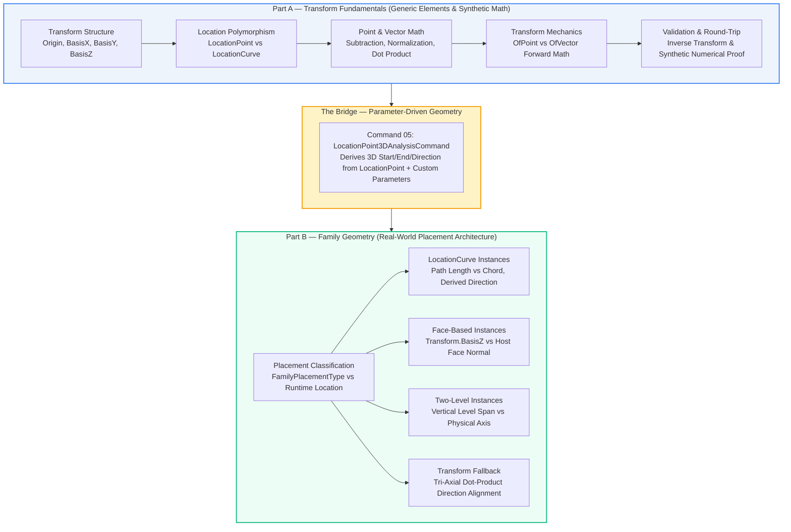

---

## 1. Why This Module Exists

Almost every non-trivial Revit API task — placing a family along a slope, orienting a fitting to a host face, reporting a structural member's true 3D length — eventually needs the same **five fundamental geometric facts** about an element:

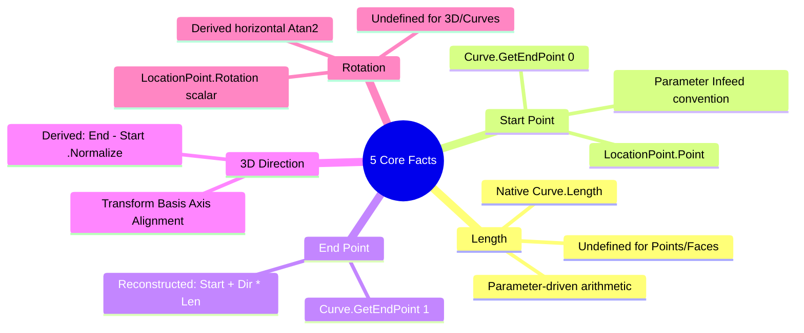

The temptation for Revit API developers is to assume these are always exposed as direct, universal element properties. **They are not.** Revit exposes geometry through several distinct and often uncoordinated mechanisms:

1. `Element.Location` (`LocationPoint` vs. `LocationCurve` polymorphism)
2. `FamilyInstance.GetTransform()` (Affine Coordinate System: Origin + Basis Vectors)
3. `FamilyInstance.Host` and `FamilyInstance.HostFace` (Hosting geometry)
4. `Family.FamilyPlacementType` (Authoring placement architecture)
5. `FamilyInstance.LookupParameter()` (Family-specific business parameters)

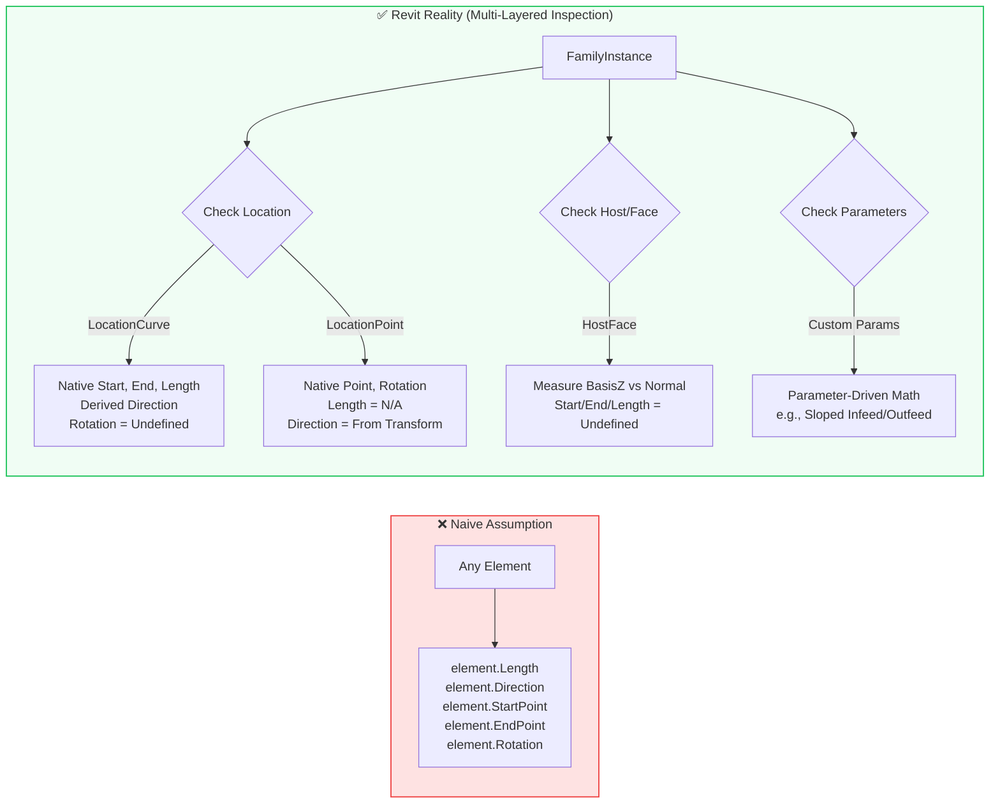

The Transform Module builds this engineering judgment in two structured stages:

- **Part A — Transform Fundamentals:** Teaches the underlying coordinate math and API vocabulary (`Transform`, `XYZ`, points vs. vectors, `Location`) using generic elements, independent of any particular Family.
- **Part B — Family Geometry:** Applies that vocabulary to real `FamilyInstance` placement architectures (point-based, curve-based, face-based, two-level-based) and repeatedly reinforces the module's central rule:

> [!IMPORTANT]
> **Part B Core Rule:**
> Do **not** assume geometry from `FamilyPlacementType`, `Transform`, or naming conventions alone. Inspect the actual runtime data, then derive **only what the evidence supports**.

Every command in this module is marked `[Transaction(TransactionMode.ReadOnly)]` — this is a pure inspection, mathematics, and reporting module. Nothing here creates, moves, or modifies model elements.

---

## 2. Conceptual Progression

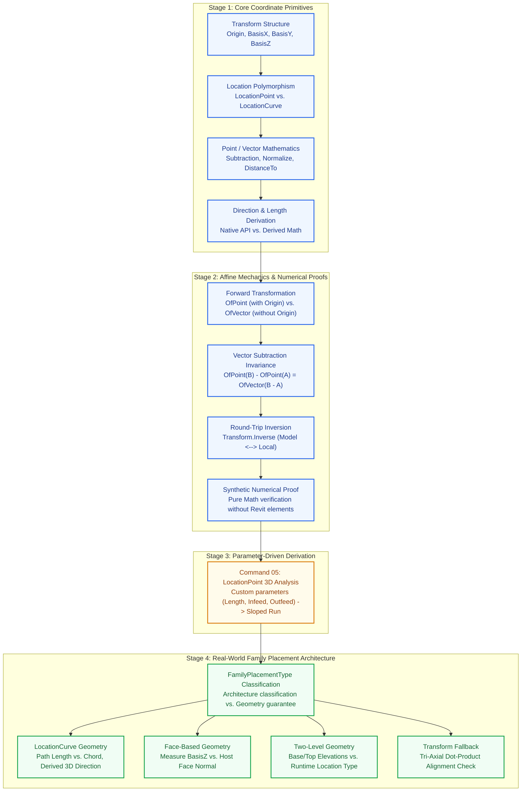

**Key Educational Divide:**
- **Part A** never touches a Family parameter and rarely relies on `FamilyPlacementType`.
- **Part B** never introduces new math — it re-applies Part A's math (`Normalize`, `DotProduct`, vector subtraction, `Transform` inspection) to the specific, messier reality of real-world family placement.

---

## 3. Command Inventory

### PART A — Transform Fundamentals
*(Folder: `Commands/Fundamentals/`, unless noted)*

| # | Class (File) | Namespace | Type | Key Mathematical & API Concept |
|:---:|---|---|:---:|---|
| **01** | `TransformInspectionCommand` | `...Fundamentals` | Inspection | `Transform` structure: `Origin`, `BasisX`, `BasisY`, `BasisZ` |
| **02** | `LocationPointVsLocationCurveCommand` | `...Fundamentals` | Polymorphism | `Location` split: `LocationPoint` vs. `LocationCurve` |
| **03** | `LocationGeometryAnalysisCommand`¹ | `...Fundamentals` | Classification | Explicitly labels value sources: `Revit` (native) vs. `Calculated` (derived) |
| **04** | `DerivedGeometryCommand` | `...Fundamentals` | Derivation | Direction vector derivation, horizontal angle ($\operatorname{atan2}$), End-Point reconstruction |
| **05** | `LocationPoint3DAnalysisCommand`² | `...FamilyGeometry` | Parameter-Driven | Derives sloped 3D Start/End/Direction from `Length`, `Infeed`, `Outfeed` parameters |
| **06** | `TransformOfPointCommand` | `...Fundamentals` | Transformation | Formalizes $\mathbf{P}_{\text{world}} = \mathbf{O} + X\mathbf{B}_x + Y\mathbf{B}_y + Z\mathbf{B}_z$ |
| **07** | `TransformOfVectorCommand` | `...Fundamentals` | Transformation | Formalizes $\vec{V}_{\text{world}} = X\mathbf{B}_x + Y\mathbf{B}_y + Z\mathbf{B}_z$ (**without** Origin) |
| **08** | `PointVsVectorTransformationCommand` | `...Fundamentals` | Proof | Proves identity: $\mathbf{T}.\text{OfPoint}(B) - \mathbf{T}.\text{OfPoint}(A) \equiv \mathbf{T}.\text{OfVector}(B - A)$ |
| **09** | `InverseTransformCommand` | `...Fundamentals` | Inversion | `Transform.Inverse` round-trip ($\text{Local} \leftrightarrow \text{Model}$) for points and vectors |
| **10** | `TransformNumericalExampleCommand` | `...Fundamentals` | Synthetic Math | Fully synthetic forward/inverse transform proof — no Revit element required |

> [!NOTE]
> **Inventory Footnotes:**
> 1. **Filename Mismatch:** File is named `PointAndVectorMathematicsCommand.cs`, but class inside is `LocationGeometryAnalysisCommand`.
> 2. **Physical Location:** Command 05 is physically stored in `Commands/FamilyGeometry/`, but its header numbers it "Command 05" in the Part A global sequence. Conceptually, it is the bridge between Part A and Part B.

---

### PART B — Family Geometry
*(Folder: `Commands/FamilyGeometry/`)*

| Part B # | Class | Placement Focus | Key Architecture & Verification Rule |
|:---:|---|---|---|
| **01** | `FamilyPlacementClassificationCommand` | Overview / Router | Classifies `FamilyPlacementType`, actual `Location`, `Host`/`HostFace`, and `Transform` |
| **02** | *(Gap — See [§11 Remaining Commands](#11-remaining-commands))* | `LocationPoint` Family | Generic `LocationPoint` family geometry counterpart to Command 03 |
| **03** | `LocationCurveFamilyGeometryCommand` | `CurveBased` | Native Start/End/Length, derived Direction, straight-line chord vs. curve length |
| **04** | `FaceBasedFamilyGeometryCommand` | `WorkPlaneBased` / Face | Measures $\mathbf{B}_z \cdot \hat{\mathbf{n}}_{\text{face}}$ angle; marks Start/End/Length as undefined |
| **05** | `TwoLevelFamilyGeometryCommand` | `TwoLevelsBased` | Separates Base/Top level elevation span from runtime `Location` (Point vs Curve) |
| **06** | `TransformBasedFamilyGeometryCommand` | Universal Fallback | Scans $\vec{D}_{\text{curve}} \cdot \mathbf{B}_i$ ($i \in \{X,Y,Z\}$) to find true physical alignment axis |

```mermaid
flowchart LR
    subgraph RepoStructure["TransformModule Directory Structure"]
        direction TB
        F_DIR["Commands/Fundamentals/"]
        G_DIR["Commands/FamilyGeometry/"]
        
        F_DIR --> C01["01 TransformInspectionCommand"]
        F_DIR --> C02["02 LocationPointVsLocationCurveCommand"]
        F_DIR --> C03["03 LocationGeometryAnalysisCommand"]
        F_DIR --> C04["04 DerivedGeometryCommand"]
        F_DIR --> C06["06 TransformOfPointCommand"]
        F_DIR --> C07["07 TransformOfVectorCommand"]
        F_DIR --> C08["08 PointVsVectorTransformationCommand"]
        F_DIR --> C09["09 InverseTransformCommand"]
        F_DIR --> C10["10 TransformNumericalExampleCommand"]
        
        G_DIR --> C05["05 LocationPoint3DAnalysisCommand (Bridge)"]
        G_DIR --> PB01["Part B 01 FamilyPlacementClassificationCommand"]
        G_DIR --> PB03["Part B 03 LocationCurveFamilyGeometryCommand"]
        G_DIR --> PB04["Part B 04 FaceBasedFamilyGeometryCommand"]
        G_DIR --> PB05["Part B 05 TwoLevelFamilyGeometryCommand"]
        G_DIR --> PB06["Part B 06 TransformBasedFamilyGeometryCommand"]
    end

    style F_DIR fill:#dbeafe,stroke:#1e40af,stroke-width:2px
    style G_DIR fill:#d1fae5,stroke:#065f46,stroke-width:2px
    style C05 fill:#fef3c7,stroke:#b45309,stroke-width:2px
```

---

## 4. Detailed Command Reference

---

### Command 01 — `TransformInspectionCommand`

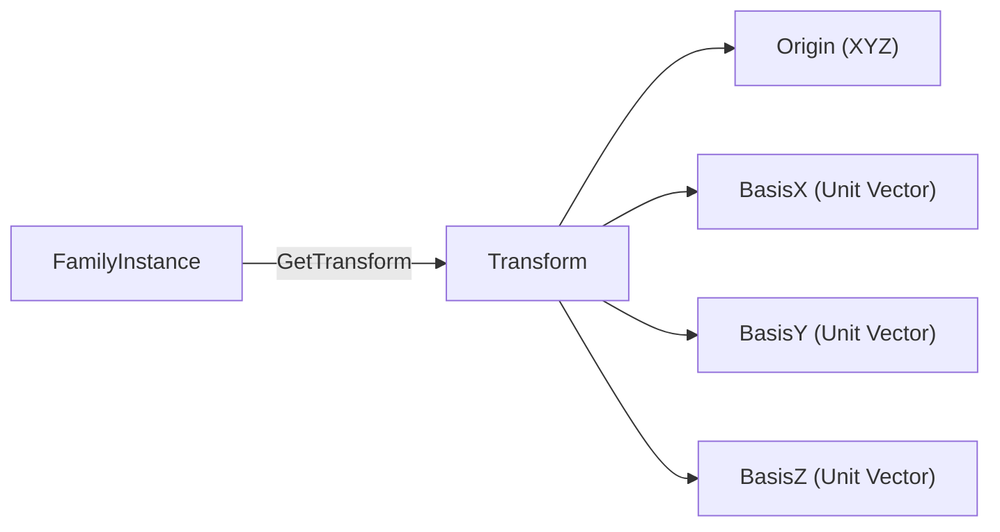

- **API Surface:** `FamilyInstance.GetTransform()`, `Transform.Origin`, `Transform.BasisX`, `Transform.BasisY`, `Transform.BasisZ`
- **Core Concept:** A `Transform` defines a local Cartesian coordinate system embedded in the global model space:
  $$\mathbf{T} = \left[ \mathbf{Origin} \;\middle|\; \mathbf{BasisX} \;\middle|\; \mathbf{BasisY} \;\middle|\; \mathbf{BasisZ} \right]$$
- **Input:** Single selected `FamilyInstance`.
- **Output:** `TaskDialog` listing Origin $(X,Y,Z)$ and the three orthogonal unit basis vectors $(\mathbf{B}_x, \mathbf{B}_y, \mathbf{B}_z)$.
- **Math Complexity:** None — pure API property read.
- **Relationship:** The foundational entry point of the module; establishes the basis vector terminology used by all subsequent commands.

---

### Command 02 — `LocationPointVsLocationCurveCommand`

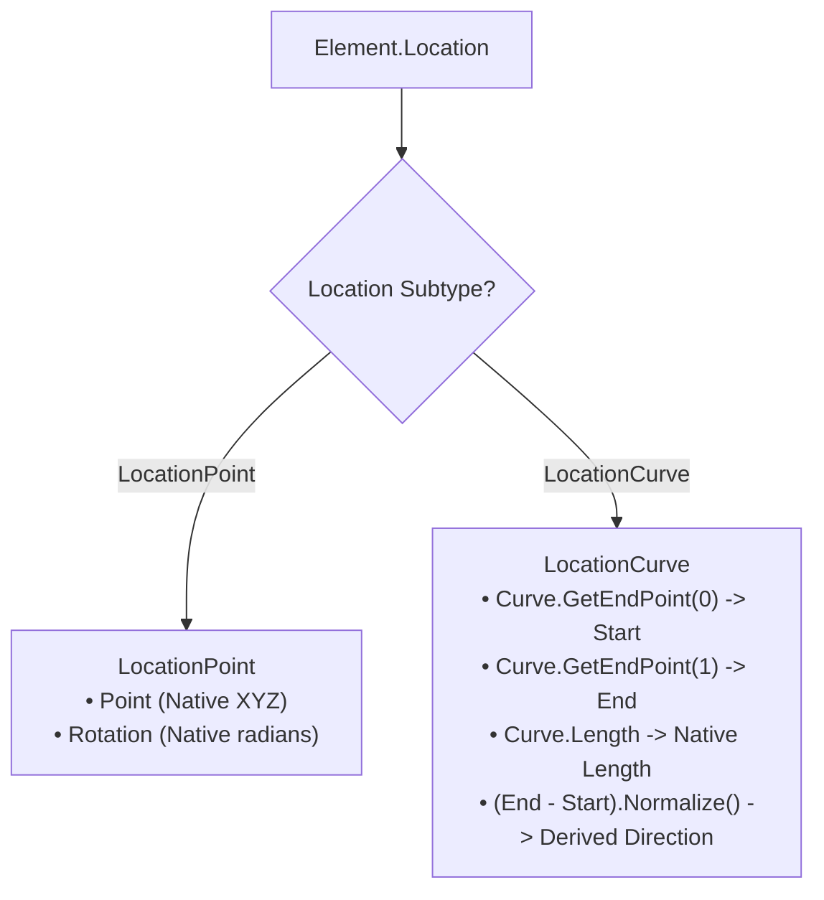

- **API Surface:** `Element.Location`, `LocationPoint.Point`, `LocationPoint.Rotation`, `LocationCurve.Curve`, `Curve.GetEndPoint(0/1)`, `Curve.Length`
- **Core Concept:** Runtime `Location` is polymorphic. A point-based element exposes an insertion point and a rotation scalar; a curve-based element exposes endpoints, length, and a continuous path.
- **Mathematical Formula:**
  $$\vec{D} = \frac{\mathbf{P}_{\text{end}} - \mathbf{P}_{\text{start}}}{\|\mathbf{P}_{\text{end}} - \mathbf{P}_{\text{start}}\|} = \operatorname{Normalize}(\mathbf{P}_1 - \mathbf{P}_0)$$
- **Input:** Any selected `Element` (not restricted to `FamilyInstance`).
- **Output:** `TaskDialog` detailing the active `Location` branch with endpoints, length, and derived direction.
- **Relationship:** Generalizes coordinate inspection to arbitrary model elements; establishes the Native vs. Derived split.

---

### Command 03 — `LocationGeometryAnalysisCommand`
*(Physical file: `PointAndVectorMathematicsCommand.cs`)*

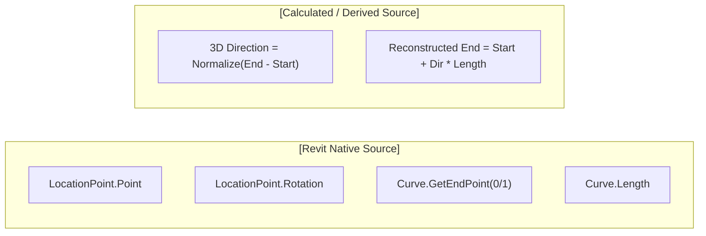

- **API Surface:** Same as Command 02 (`Element.Location`, `LocationPoint`, `LocationCurve`).
- **Core Concept:** Formalizes explicit data lineage by tagging every reported geometric value with its **Source**:
  - `[Revit]` $\rightarrow$ Values directly stored in the element's database record.
  - `[Calculated]` $\rightarrow$ Values computed via vector arithmetic.
- **Input:** Any selected `Element`.
- **Output:** `TaskDialog` containing a `SUMMARY:` classification matrix by source.
- **Relationship:** Establishes the rigor of never presenting derived numbers as native API facts.

---

### Command 04 — `DerivedGeometryCommand`

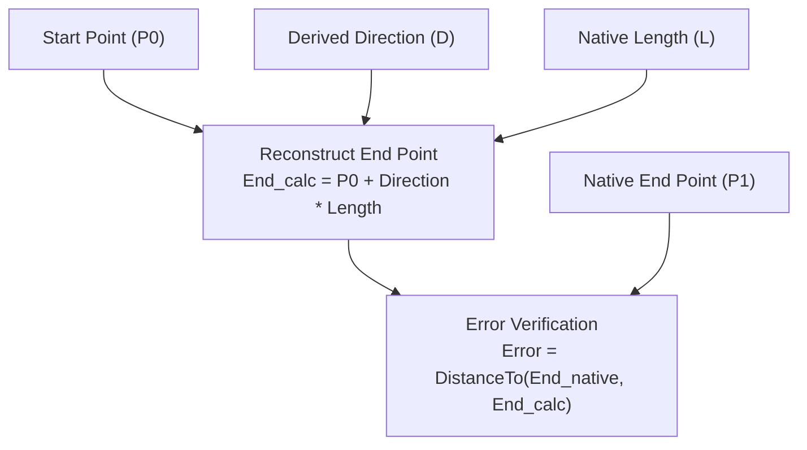

- **API Surface:** `LocationPoint`, `LocationCurve`, `FamilyInstance.GetTransform()`, `Curve.GetEndPoint`, `Curve.Length`
- **Core Concept:** Derivation and reconstruction formulas:
  $$\mathbf{P}_{\text{reconstructed}} = \mathbf{P}_{\text{start}} + \vec{D} \times L$$
  $$\theta_{\text{horizontal}} = \operatorname{atan2}(D_y, D_x) \times \frac{180^\circ}{\pi}$$
  $$\text{Reconstruction Error} = \|\mathbf{P}_{\text{native\_end}} - \mathbf{P}_{\text{reconstructed}}\| \approx 0$$
- **Input:** Any `Element`. (If `LocationPoint`, casts to `FamilyInstance` to read `Transform.BasisX` as a horizontal direction stand-in).
- **Output:** Derived 3D direction, 2D horizontal angle, reconstructed End Point, and verification error.
- **Relationship:** Introduces the calculate-and-verify round-trip pattern reused in Commands 06–10.

---

### Command 05 — `LocationPoint3DAnalysisCommand`
*(Physical location: `Commands/FamilyGeometry/`)*

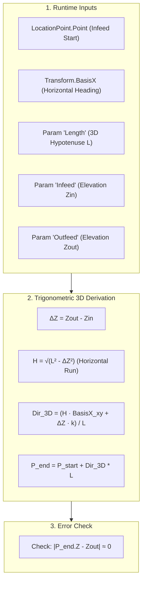

- **API Surface:** `LocationPoint.Point/Rotation`, `FamilyInstance.LookupParameter()`, `Parameter.AsDouble()`, `Transform.BasisX`
- **Core Concept:** First worked example of **Family-specific parameter geometry**. A sloped run (e.g. conveyor/chute) with only a `LocationPoint` derives full 3D geometry using custom parameter arithmetic:
  $$\Delta Z = Z_{\text{outfeed}} - Z_{\text{infeed}}$$
  $$H = \sqrt{L^2 - \Delta Z^2} \quad (\text{Horizontal Run via Pythagorean Theorem})$$
  $$\vec{D}_{3D} = \frac{H \cdot \operatorname{Normalize}(\mathbf{B}_{x,xy}) + \Delta Z \cdot \hat{\mathbf{k}}}{L}$$
  $$\mathbf{P}_{\text{end}} = \mathbf{P}_{\text{start}} + \vec{D}_{3D} \times L$$
- **Input:** `FamilyInstance` containing parameters literally named `Length`, `Infeed`, `Outfeed`.
- **Output:** Parameter values, derived Start/End points, true 3D direction vector, and elevation error check.
- **Crucial Caveat:** `LocationPoint.Point = Infeed` and `BasisX = Heading` are **Family authoring conventions**, not universal Revit rules!

---

### Command 06 — `TransformOfPointCommand`

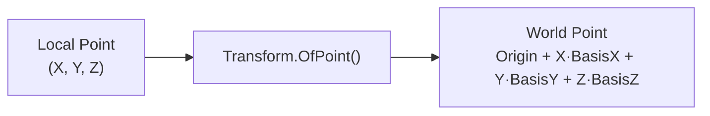

- **API Surface:** `Transform.OfPoint()`, `Transform.Origin/BasisX/BasisY/BasisZ`, `LocationPoint.Point`
- **Core Concept:** Formalizes the mathematical definition of transforming a local position point into global model space:
  $$\mathbf{P}_{\text{world}} = \mathbf{T}.\text{OfPoint}(\mathbf{P}_{\text{local}}) = \mathbf{Origin} + X \cdot \mathbf{BasisX} + Y \cdot \mathbf{BasisY} + Z \cdot \mathbf{BasisZ}$$
- **Verification Math:**
  $$\mathbf{P}_{\text{manual}} = \mathbf{O} + P_x \mathbf{B}_x + P_y \mathbf{B}_y + P_z \mathbf{B}_z$$
  $$\text{Error} = \|\mathbf{P}_{\text{world}} - \mathbf{P}_{\text{manual}}\| = 0.000000$$
- **Input:** Selected `FamilyInstance` (evaluates a hardcoded test local point $(2.0, 3.0, 0.0)$).
- **Output:** Forward transformed point, hand-calculated verification, error distance, and comparison to actual `LocationPoint`.

---

### Command 07 — `TransformOfVectorCommand`

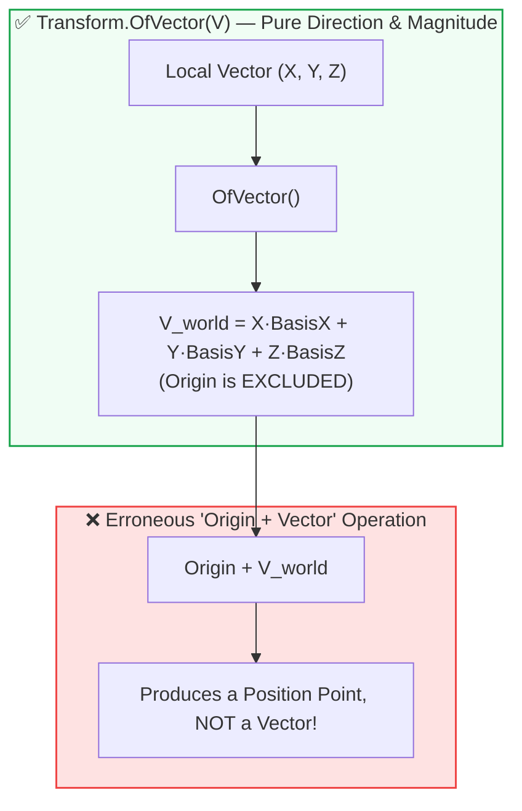

- **API Surface:** `Transform.OfVector()`
- **Core Concept:** Contrasts vector transformation with point transformation. Vectors represent pure direction and magnitude; they possess **no spatial position** and therefore **must ignore the Origin**:
  $$\vec{V}_{\text{world}} = \mathbf{T}.\text{OfVector}(\vec{V}_{\text{local}}) = X \cdot \mathbf{BasisX} + Y \cdot \mathbf{BasisY} + Z \cdot \mathbf{BasisZ}$$
- **Key Insight:** Adding `Origin` to a transformed vector results in a meaningless coordinate point in space, violating vector algebra.
- **Input:** Selected `FamilyInstance`.
- **Output:** Transformed vector, hand-calculated expansion, error verification, and intentional demonstration of the "Origin + Vector" anti-pattern.

---

### Command 08 — `PointVsVectorTransformationCommand`

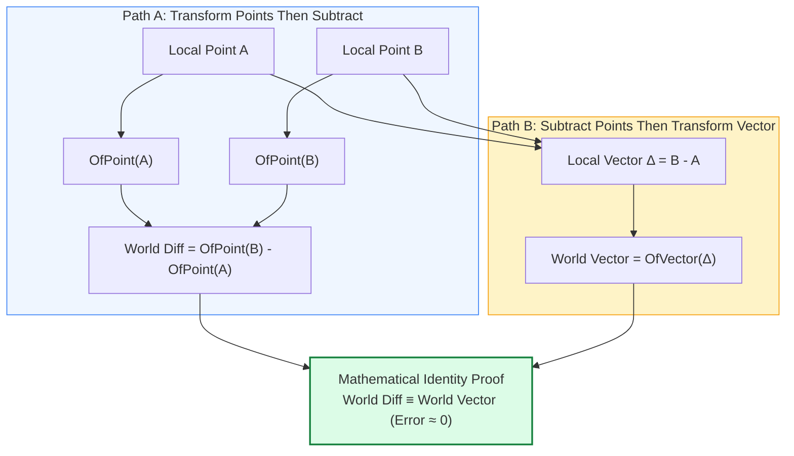

- **API Surface:** `Transform.OfPoint()`, `Transform.OfVector()`
- **Core Concept:** Proves the fundamental affine identity that the `Origin` cancels out when computing point differences:
  $$\mathbf{T}.\text{OfPoint}(\mathbf{P}_B) - \mathbf{T}.\text{OfPoint}(\mathbf{P}_A) \equiv \mathbf{T}.\text{OfVector}(\mathbf{P}_B - \mathbf{P}_A)$$
- **Mathematical Proof:**
  $$\left( \mathbf{O} + \sum_{i} B_i \mathbf{B}_i \right) - \left( \mathbf{O} + \sum_{i} A_i \mathbf{B}_i \right) = \sum_{i} (B_i - A_i)\mathbf{B}_i = \mathbf{T}.\text{OfVector}(\mathbf{P}_B - \mathbf{P}_A)$$
- **Input:** Selected `FamilyInstance` (evaluates test local points $A$ and $B$).
- **Output:** Comparison of both derivation paths showing identical world-space vectors.

---

### Command 09 — `InverseTransformCommand`

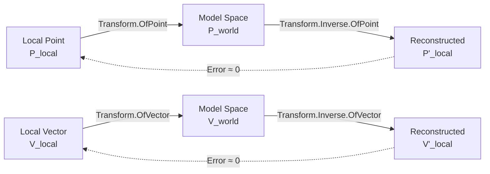

- **API Surface:** `Transform.Inverse`, `Transform.OfPoint()`, `Transform.OfVector()`
- **Core Concept:** `Transform.Inverse` performs the exact reverse mapping, converting coordinates from global Model-space back into element Local-space:
  $$\mathbf{T}^{-1} \cdot \mathbf{T} = \mathbf{I}$$
  $$\mathbf{P}'_{\text{local}} = \mathbf{T}^{-1}.\text{OfPoint}\big(\mathbf{T}.\text{OfPoint}(\mathbf{P}_{\text{local}})\big) \approx \mathbf{P}_{\text{local}}$$
- **Input:** Selected `FamilyInstance`.
- **Output:** Complete forward and reverse coordinate round-trip with residual error verification ($\|\mathbf{P}' - \mathbf{P}\| < 10^{-9}$).

---

### Command 10 — `TransformNumericalExampleCommand`

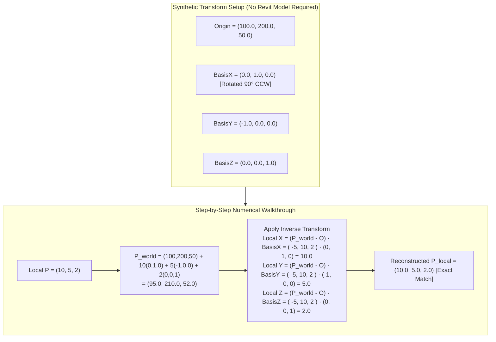

- **API Surface:** `Transform.Identity`, `Transform.OfPoint()`, `Transform.OfVector()`, `Transform.Inverse`
- **Core Concept:** Pure mathematical validation independent of Revit project files. Demonstrates the forward/inverse matrix mechanics using clean, hand-picked integer coordinates.
- **Input:** None (100% synthetic math).
- **Output:** Comprehensive `TaskDialog` detailing the step-by-step numerical proof and the "Final Mental Model".

---

### Part B — Command 01 — `FamilyPlacementClassificationCommand`

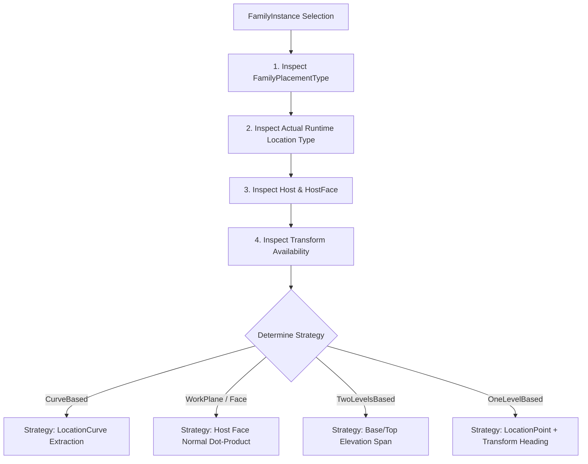

- **API Surface:** `Family.FamilyPlacementType`, `FamilyInstance.Location`, `FamilyInstance.Host`, `FamilyInstance.HostFace`, `FamilyInstance.GetTransform()`
- **Core Concept:** `FamilyPlacementType` defines authoring architecture, **not an immediate geometry guarantee**. The command classifies four independent runtime facts without attempting to compute geometry.
- **Input:** Selected `FamilyInstance`.
- **Output:** Structural classification breakdown and strategy recommendation.
- **Relationship:** The entry gate and structural roadmap for all of Part B.

---

### Part B — Command 03 — `LocationCurveFamilyGeometryCommand`

```mermaid
flowchart TD
    LC["LocationCurve"] --> C["Curve Object"]
    C --> EP0["GetEndPoint(0) -> Start Point (Native)"]
    C --> EP1["GetEndPoint(1) -> End Point (Native)"]
    C --> LEN["Curve.Length -> True Path Length (Native)"]
    
    EP0 & EP1 --> CHORD["Chord Distance = DistanceTo(Start, End)"]
    EP0 & EP1 --> DIR["Derived 3D Direction = Normalize(End - Start)"]
    
    LEN & CHORD --> CMP{"Curve is Straight Line?"}
    CMP -->|Yes (Line)| EQ["Curve.Length == Chord Distance"]
    CMP -->|No (Arc/Spline)| NEQ["Curve.Length > Chord Distance (True Arc Length)"]
```

- **API Surface:** `LocationCurve.Curve`, `Curve.GetEndPoint(0/1)`, `Curve.Length`, `FamilyInstance.GetTransform()`
- **Core Concept:** For curve-based instances, Start/End points and Length are native. Direction is derived. Rotation scalar is **explicitly undefined**.
- **Arc vs. Chord Distinction:**
  $$L_{\text{chord}} = \|\mathbf{P}_{\text{end}} - \mathbf{P}_{\text{start}}\| \le L_{\text{curve}}$$
- **Input:** `FamilyInstance` with a `LocationCurve`.
- **Output:** Endpoint coordinates, path length vs. chord distance, derived direction vector, and confirmation of undefined rotation.

---

### Part B — Command 04 — `FaceBasedFamilyGeometryCommand`

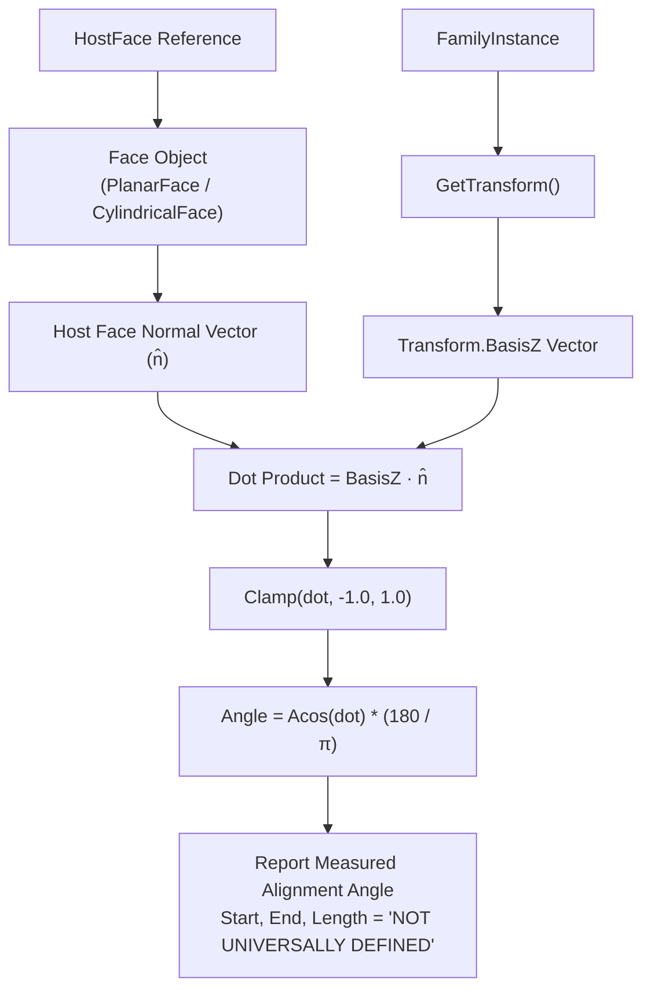

- **API Surface:** `FamilyInstance.HostFace`, `Element.GetGeometryObjectFromReference()`, `Face.ComputeNormal()`, `Transform.BasisZ`
- **Core Concept:** Face-hosted instances do not have native Start/End/Length. The spatial relationship between `Transform.BasisZ` and the host face normal $\hat{\mathbf{n}}$ is **measured**, never assumed:
  $$\text{dot} = \mathbf{B}_z \cdot \hat{\mathbf{n}}$$
  $$\theta = \arccos\big(\operatorname{clamp}(\text{dot}, -1.0, 1.0)\big) \times \frac{180^\circ}{\pi}$$
- **Input:** `FamilyInstance` hosted on a geometric face.
- **Output:** Host details, face normal vector, `BasisZ` vector, measured alignment angle, and explicit "Not Universally Defined" markers for endpoints and length.

---

### Part B — Command 05 — `TwoLevelFamilyGeometryCommand`

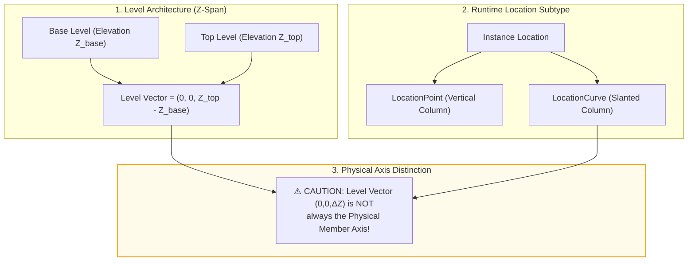

- **API Surface:** `BuiltInParameter.FAMILY_BASE_LEVEL_PARAM`, `FAMILY_TOP_LEVEL_PARAM`, `Level.Elevation`, `LocationPoint`, `LocationCurve`, `Transform`
- **Core Concept:** For `TwoLevelsBased` elements (e.g. columns), the vertical level span is an independent constraint from the actual runtime `Location`.
- **Key Warning:** The Level-to-Level vertical vector $(0, 0, Z_{\text{top}} - Z_{\text{base}})$ is **not** automatically the physical member direction for slanted members.
- **Input:** `FamilyInstance` with `FamilyPlacementType.TwoLevelsBased`.
- **Output:** Base/Top level elevations, runtime location data, and level span vector with physical orientation warnings.

---

### Part B — Command 06 — `TransformBasedFamilyGeometryCommand`

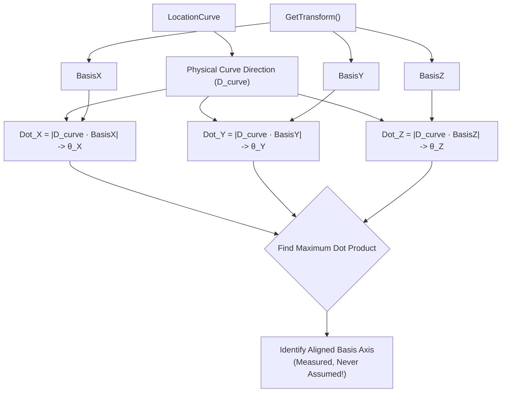

- **API Surface:** `FamilyInstance.GetTransform()`, `Transform.BasisX/BasisY/BasisZ`, `LocationCurve`, `XYZ.DotProduct`
- **Core Concept:** Universal fallback for any `FamilyInstance`. When a physical direction exists (e.g. from a `LocationCurve`), it is tested against all three Basis vectors to discover which axis represents the physical length:
  $$\text{dot}_i = \vec{D}_{\text{curve}} \cdot \mathbf{B}_i, \quad \theta_i = \arccos\big(\operatorname{clamp}(\text{dot}_i, -1.0, 1.0)\big) \quad \text{for } i \in \{X, Y, Z\}$$
  $$\text{Aligned Axis} = \arg\max_{i \in \{X,Y,Z\}} |\text{dot}_i|$$
- **Input:** Any `FamilyInstance`.
- **Output:** Basis axes listing, dot products and angles against curve direction, and identification of the aligned axis.

---

## 5. The Five Main Geometric Values

```mermaid
flowchart TD
    subgraph Values["The 5 Core Values"]
        V1["Length"]
        V2["Start Point"]
        V3["End Point"]
        V4["3D Direction"]
        V5["Rotation"]
    end

    subgraph Resolution["How They Are Resolved"]
        R_NAT["Native API Property\n(e.g., LocationPoint.Point, Curve.Length)"]
        R_DER["Derived Vector Math\n(e.g., Normalize(End - Start), Atan2)"]
        R_PAR["Parameter-Driven Math\n(e.g., Infeed/Outfeed Pythagorean H)"]
        R_UND["Explicitly Undefined / Case-Specific\n(e.g., Rotation for LocationCurve)"]
    end

    V1 --> R_NAT & R_PAR & R_UND
    V2 --> R_NAT & R_PAR
    V3 --> R_NAT & R_DER & R_PAR
    V4 --> R_DER & R_UND
    V5 --> R_NAT & R_DER & R_UND

    style Values fill:#f8fafc,stroke:#64748b,stroke-width:1.5px
    style Resolution fill:#f0fdf4,stroke:#16a34a,stroke-width:1.5px
```

| Geometric Value | Native in API? | Providing API (When Native) | Derivation Formula (When Derived) | Depends on Placement Type? | Depends on Custom Params? | Classification Summary |
|---|:---:|---|---|:---:|:---:|---|
| **Length** | **Sometimes** | `Curve.Length` (`LocationCurve`) | Reconstructed from parameter: $H = \sqrt{L^2 - \Delta Z^2}$ | Yes (only guaranteed for `CurveBased`) | Yes (when no `LocationCurve` exists) | **Case-Specific** |
| **Start Point** | **Sometimes** | `LocationPoint.Point` or `Curve.GetEndPoint(0)` | Assumed equal to parameter insertion point (e.g. Infeed convention) | Yes | Sometimes (Family authoring convention) | **Case-Specific** |
| **End Point** | **Sometimes** | `Curve.GetEndPoint(1)` | $\mathbf{P}_{\text{start}} + \vec{D} \times L$ | Yes | Yes (when derived from parameter length/slope) | **Case-Specific** |
| **3D Direction** | **Rarely** | — | $\operatorname{Normalize}(\mathbf{P}_{\text{end}} - \mathbf{P}_{\text{start}})$, or matching $\max |\mathbf{B}_i \cdot \vec{D}|$ | Yes | Sometimes | **Case-Specific** (Measured, not assumed) |
| **Rotation** | **Sometimes** | `LocationPoint.Rotation` | $\operatorname{atan2}(D_y, D_x)$ for 2D horizontal heading | Yes | No | **Case-Specific** (Undefined for 3D curves) |

> [!CAUTION]
> **Explicit Undefined Values:** The module never claims all five values exist for every element. Commands explicitly report `"Not directly available"` or `"Not universally defined"` when geometry is unsupported.

---

## 6. Location Architecture

```mermaid
classDiagram
    class Location {
        <<abstract>>
    }
    class LocationPoint {
        +XYZ Point [Native]
        +double Rotation [Native, radians]
        +GetDirection() [Derived from Transform]
    }
    class LocationCurve {
        +Curve Curve [Native]
        +XYZ GetEndPoint(0) [Native Start]
        +XYZ GetEndPoint(1) [Native End]
        +double Length [Native Path Length]
        +XYZ GetDirection() [Derived: Normalize(End - Start)]
        +double ChordDistance [Derived: DistanceTo(Start, End)]
    }

    Location <|-- LocationPoint
    Location <|-- LocationCurve
```

### The Defensive Casting Pattern

`element.Location` returns the abstract base class `Location`. Direct blind casting causes runtime `NullReferenceException` errors. Every command in this module implements safe defensive type checks:

```csharp
// Standard Defensive Pattern used across all commands
LocationPoint locationPoint = location as LocationPoint;
LocationCurve locationCurve = location as LocationCurve;

if (locationPoint != null)
{
    XYZ insertionPoint = locationPoint.Point;
    double rotationAngle = locationPoint.Rotation;
    // Process point-based geometry...
}
else if (locationCurve != null)
{
    Curve curve = locationCurve.Curve;
    XYZ startPoint = curve.GetEndPoint(0);
    XYZ endPoint = curve.GetEndPoint(1);
    double pathLength = curve.Length;
    XYZ direction = (endPoint - startPoint).Normalize();
    // Process curve-based geometry...
}
else
{
    // Explicitly handle unsupported or null runtime location types
}
```

```mermaid
flowchart LR
    subgraph StraightLine["Straight Line Curve"]
        S1["Start (0)"] ---|Curve.Length == Chord| E1["End (1)"]
    end
    subgraph ArcCurve["Curved Arc / Spline Curve"]
        S2["Start (0)"] -.->|Straight Chord Distance| E2["End (1)"]
        S2 ===|True Curve.Length (Arc Path)| E2
    end
```

- **`Curve.Length` vs. Chord Distance:** For straight lines, `Curve.Length ≈ Distance(Start, End)`. For arcs or splines, `Curve.Length` is the true integral arc length, whereas `Distance(Start, End)` is the shorter chord distance.

---

## 7. Family Placement Architecture

```mermaid
classDiagram
    class Family {
        +FamilyPlacementType PlacementType
    }
    class FamilySymbol {
        +string Name ("IPE 200", "Conveyor-Bed")
    }
    class FamilyInstance {
        +Location Location
        +Transform GetTransform()
        +Element Host
        +Reference HostFace
        +Parameter LookupParameter(name)
    }

    Family --> FamilySymbol : Defines Types
    FamilySymbol --> FamilyInstance : Instantiates
```

```mermaid
flowchart TD
    A["FamilyPlacementType\n(OneLevelBased, TwoLevelsBased, WorkPlaneBased, CurveBased, Adaptive)"]
    A -->|Describes| B["Authoring Architecture\n(How Revit allows family to be placed)"]
    B -.->|DOES NOT GUARANTEE| C["Runtime Geometry\n(Does not guarantee Length, Curve, or Face normal exists)"]

    style C fill:#fee2e2,stroke:#ef4444,stroke-width:2px
```

### The Part B Verification Discipline

```mermaid
flowchart LR
    subgraph Step1["Step 1: Inspect Runtime Evidence"]
        I1["1. FamilyPlacementType"]
        I2["2. Actual Location Subtype"]
        I3["3. Host & HostFace"]
        I4["4. Transform Axes"]
        I5["5. Instance Parameters"]
    end

    subgraph Step2["Step 2: Derive Supported Values"]
        D1["Start Point"]
        D2["End Point"]
        D3["3D Direction"]
        D4["Rotation"]
        D5["Actual Length"]
    end

    Step1 -->|Derive ONLY what evidence supports| Step2

    style Step1 fill:#eff6ff,stroke:#2563eb
    style Step2 fill:#f0fdf4,stroke:#16a34a
```

---

## 8. The Transform Concept

A `Transform` represents a 3D affine transformation matrix mapping local coordinates $(x,y,z)$ to global world coordinates $(X,Y,Z)$:

$$\mathbf{T} = \begin{bmatrix}
\mathbf{BasisX}_x & \mathbf{BasisY}_x & \mathbf{BasisZ}_x & \mathbf{Origin}_x \\
\mathbf{BasisX}_y & \mathbf{BasisY}_y & \mathbf{BasisZ}_y & \mathbf{Origin}_y \\
\mathbf{BasisX}_z & \mathbf{BasisY}_z & \mathbf{BasisZ}_z & \mathbf{Origin}_z \\
0 & 0 & 0 & 1
\end{bmatrix}$$

```mermaid
flowchart TD
    subgraph TransformComponents["Transform Structure"]
        O["Origin (XYZ)\nPosition of Local (0,0,0) in World Space"]
        BX["BasisX (XYZ)\nLocal X-Axis Direction Vector"]
        BY["BasisY (XYZ)\nLocal Y-Axis Direction Vector"]
        BZ["BasisZ (XYZ)\nLocal Z-Axis Direction Vector"]
    end

    subgraph Rule["Coordinate System vs. Business Meaning"]
        R["⚠️ RULE:\nBasisX/Y/Z tell us HOW the family is oriented in space.\nThey do NOT automatically declare WHICH axis represents the business meaning of 'Length'!"]
    end

    TransformComponents --> Rule
    style Rule fill:#fef2f2,stroke:#dc2626,stroke-width:1.5px
```

---

## 9. Mathematical Concepts Used

$$\begin{array}{rcc}
\hline
\textbf{Mathematical Concept} & \textbf{Formal Definition} & \textbf{Commands Used In} \\
\hline
\text{Vector Subtraction} & \vec{V} = \mathbf{P}_{\text{end}} - \mathbf{P}_{\text{start}} & \text{Cmd 02, 03, 04, 08, Part B 03, 05, 06} \\
\text{Vector Normalization} & \hat{\mathbf{u}} = \frac{\vec{V}}{\|\vec{V}\|} = \frac{\vec{V}}{\sqrt{V_x^2 + V_y^2 + V_z^2}} & \text{Cmd 02, 03, 04, 06, 07, 08, 09, Part B 03–06} \\
\text{Dot Product} & \vec{A} \cdot \vec{B} = A_x B_x + A_y B_y + A_z B_z = \|\vec{A}\|\|\vec{B}\|\cos\theta & \text{Part B 04, Part B 06} \\
\text{Angle Calculation} & \theta = \arccos\left(\operatorname{clamp}\left(\frac{\vec{A} \cdot \vec{B}}{\|\vec{A}\|\|\vec{B}\|}, -1, 1\right)\right) \times \frac{180^\circ}{\pi} & \text{Part B 04, Part B 06} \\
\text{Euclidean Distance} & \|\mathbf{P}_2 - \mathbf{P}_1\| = \sqrt{\sum (P_{2,i} - P_{1,i})^2} & \text{Cmd 06, 07, 08, 09, 10, Part B 03} \\
\text{Point Transformation} & \mathbf{P}_{\text{world}} = \mathbf{O} + X\mathbf{B}_x + Y\mathbf{B}_y + Z\mathbf{B}_z & \text{Cmd 06, 08, 09, 10} \\
\text{Vector Transformation} & \vec{V}_{\text{world}} = X\mathbf{B}_x + Y\mathbf{B}_y + Z\mathbf{B}_z & \text{Cmd 07, 08, 09, 10} \\
\text{Inverse Transform} & \mathbf{T}^{-1} \cdot \mathbf{T} = \mathbf{I} & \text{Cmd 09, 10} \\
\text{Numerical Clamp} & \operatorname{clamp}(v, \min, \max) = \max(\min, \min(\max, v)) & \text{Part B 04, Part B 06} \\
\text{Cross Product} & \vec{A} \times \vec{B} = \det\begin{bmatrix} \hat{\mathbf{i}} & \hat{\mathbf{j}} & \hat{\mathbf{k}} \\ A_x & A_y & A_z \\ B_x & B_y & B_z \end{bmatrix} & \textbf{Not used in current module} \\
\hline
\end{array}$$

---

## 10. Family Geometry Strategy

The complete decision tree implemented by `FamilyPlacementClassificationCommand` and realized across Part B:

```mermaid
flowchart TD
    FI[Select FamilyInstance] --> PT[Inspect FamilyPlacementType]
    PT --> RT["Inspect Actual Runtime Data\n(Do not trust placement type alone)"]
    
    RT --> LC{Has LocationCurve?}
    LC -->|Yes| LCG["Part B - Cmd 03: LocationCurve Strategy\n• Start = Curve.GetEndPoint(0)\n• End = Curve.GetEndPoint(1)\n• Length = Curve.Length\n• Direction = (End - Start).Normalize()\n• Rotation = Undefined"]
    
    LC -->|No| LP{Has LocationPoint?}
    LP -->|Yes| LPG["Part B - Cmd 02 (Gap) / Cmd 05 Bridge\n• Point = LocationPoint.Point\n• Rotation = LocationPoint.Rotation\n• Parameters needed for Length/Direction"]
    
    LP -->|No| HF{HostFace Available?}
    HF -->|Yes| FBG["Part B - Cmd 04: Face-Based Strategy\n• Measure BasisZ vs. Face Normal angle\n• Start / End / Length = Undefined"]
    
    HF -->|No| TL{TwoLevelsBased?}
    TL -->|Yes| TLG["Part B - Cmd 05: Two-Level Strategy\n• Base / Top Level Elevation Span\n• Inspect Point vs. Curve Location"]
    
    TL -->|No| TR{Transform Available?}
    TR -->|Yes| TBG["Part B - Cmd 06: Transform Fallback\n• Tri-axial dot product against curve direction\n• Find physically aligned axis"]
    
    TR -->|No| NA["No Single Native Source\n• Inspect Connectors, Adaptive Points, or Parameters"]

    LCG --> REPORT["Output Structured Geometry Report with Data Lineage"]
    LPG --> REPORT
    FBG --> REPORT
    TLG --> REPORT
    TBG --> REPORT
    NA --> REPORT

    style LCG fill:#dcfce7,stroke:#16a34a,stroke-width:1.5px
    style LPG fill:#fef3c7,stroke:#d97706,stroke-width:1.5px
    style FBG fill:#e0e7ff,stroke:#4338ca,stroke-width:1.5px
    style TLG fill:#fce7f3,stroke:#be185d,stroke-width:1.5px
    style TBG fill:#f3e8ff,stroke:#7e22ce,stroke-width:1.5px
    style NA fill:#fee2e2,stroke:#b91c1c,stroke-width:1.5px
```

---

## 11. Remaining Commands

```mermaid
flowchart LR
    subgraph CompletedCommands["Implemented Commands (15 Total)"]
        PA_ALL["Part A: Commands 01 - 10 (10 Commands)"]
        PB_DONE["Part B: Commands 01, 03, 04, 05, 06 (5 Commands)"]
    end

    subgraph IdentifiedGaps["Identified Architectural Gaps (3 Commands)"]
        G1["Part B - Command 02\nGeneric LocationPoint Family Geometry"]
        G2["Adaptive Family Geometry Command\nAdaptiveComponentInstanceUtils Inspection"]
        G3["View-Based Family Geometry Command\nView.RightDirection / UpDirection Coordinate Systems"]
    end

    CompletedCommands -.-> IdentifiedGaps

    style CompletedCommands fill:#f0fdf4,stroke:#16a34a,stroke-width:2px
    style IdentifiedGaps fill:#fff1f2,stroke:#e11d48,stroke-width:2px
```

### 1. Part B - Command 02 — Expected: `LocationPointFamilyGeometryCommand`
- **Why Needed:** Parallel generic counterpart to `LocationCurveFamilyGeometryCommand` (Part B - Cmd 03).
- **Distinction from Command 05:** Command 05 is a *custom parameter-driven* case (hardcoded `Length`/`Infeed`/`Outfeed`), not a generic point-based inspection command.
- **Status:** **Not implemented in current codebase.**

### 2. Adaptive-based Family Geometry Command
- **Why Needed:** Explicitly cited in `FamilyPlacementClassificationCommand` guidance switch (*"Inspect adaptive placement points"*).
- **Required APIs:** `AdaptiveComponentInstanceUtils.GetInstancePlacementPointElementRefIds()`.
- **Status:** **Not implemented in current codebase.**

### 3. ViewBased Family Geometry Command
- **Why Needed:** Explicitly cited in `FamilyPlacementClassificationCommand` (*"Inspect view coordinate system and instance placement"*).
- **Required APIs:** `View.RightDirection`, `View.UpDirection`, `View.ViewDirection`.
- **Status:** **Not implemented in current codebase.**

---

## 12. Observations / Potential Issues

> [!NOTE]
> The following architectural and structural observations are documented directly from codebase inspection without modifying source code:

1. **Filename vs. Class Name Mismatch:** `PointAndVectorMathematicsCommand.cs` contains the class `LocationGeometryAnalysisCommand` (Command 03).
2. **Namespace Consistency:** `Fundamentals/` commands use `RevitApiSamples.Samples.TransformModule.Commands.Fundamentals`.
3. **Command 05 Physical File Location:** `LocationPoint3DAnalysisCommand` is numbered "Command 05" in Part A's sequence but lives physically in `Commands/FamilyGeometry/`.
4. **Numbering Scheme Overlap at "05":** Global sequence Command 05 and Part B Command 05 (`TwoLevelFamilyGeometryCommand`) share the number 05 across folders.
5. **Duplicated Clamping Logic:** `TransformBasedFamilyGeometryCommand` defines a private `Clamp` method; `FaceBasedFamilyGeometryCommand` re-implements it inline as `Math.Max(-1.0, Math.Min(1.0, dot))`.
6. **Inconsistent Floating-Point Tolerances:** `1e-9` is used ad-hoc across Commands 05, Part B 03, and Part B 05; `TransformBasedFamilyGeometryCommand` defines a named `private const double Tolerance = 1e-6` (two orders of magnitude looser).
7. **Hardcoded Parameter Names in Command 05:** Relies on hardcoded string constants (`"Length"`, `"Infeed"`, `"Outfeed"`), which are specific family authoring conventions rather than Revit API standards.
8. **Inspection vs. Derivation Overlap:** Commands 02, 03, and 04 inspect the same `LocationPoint`/`LocationCurve` API surface with incremental degrees of derived detail.
9. **Absence of Cross Product ($\vec{A} \times \vec{B}$):** No command currently uses vector cross products for 3-axis orientation reconstruction.
10. **Inline Command Numbering Comments:** Inconsistent use of `// Command NN` header comments across Part A and Part B source files.

---

## 13. Transform Module Learning Roadmap

```mermaid
timeline
    title Transform Module Learning Progression
    section Phase 1 : Fundamentals
        Transform Structure : Command 01 (Origin, BasisX, BasisY, BasisZ)
        Location Polymorphism : Commands 02 & 03 (LocationPoint vs LocationCurve)
        Derivation & Angles : Command 04 (End = Start + Dir * Len, Atan2)
    section Phase 2 : Affine Math
        Transform.OfPoint : Command 06 (Origin + X·Bx + Y·By + Z·Bz)
        Transform.OfVector : Command 07 (Origin Excluded)
        Identity Proof : Command 08 (OfPoint difference = OfVector difference)
        Inverse Round-Trip : Commands 09 & 10 (Model <-> Local Inversion)
    section Phase 3 : Family Geometry
        Parameter Bridge : Command 05 (3D Sloped Conveyor Run)
        Architecture Router : Part B 01 (FamilyPlacementClassification)
        LocationCurve Geometry : Part B 03 (Path Length vs Chord)
        Face-Based Geometry : Part B 04 (BasisZ vs Normal Angle)
        Two-Level Geometry : Part B 05 (Level Span vs Physical Axis)
        Fallback Alignment : Part B 06 (Tri-Axial Dot-Product Scan)
    section Future Scope
        Missing Inspect Commands : Part B 02, Adaptive, ViewBased
        Geometry Modification : Move, Rotate, Mirror, Copy Elements
```

```mermaid
flowchart LR
    subgraph Completed["✅ Completed Learning Surface"]
        direction TB
        PA["Part A: Commands 01–10\n(Transform, Location, OfPoint, OfVector, Inverse, Synthetic Math)"]
        PB["Part B: Commands 01, 03–06\n(Classification, LocationCurve, Face-Based, Two-Level, Fallback)"]
        C05["Bridge: Command 05\n(Parameter-driven 3D Sloped Run)"]
    end

    subgraph StoppingPoint["🏁 Current Stopping Point"]
        STOP["Part B - Command 06\n(TransformBasedFamilyGeometryCommand)\nUniversal Fallback Alignment"]
    end

    subgraph FutureModule["🚀 Future Extension (Geometry Modification)"]
        MOD["Geometry Modification Module\n(Move / Rotate / Mirror / Copy Elements)\n[Requires Read-Write Transactions]"]
    end

    Completed --> StoppingPoint
    StoppingPoint -.-> FutureModule

    style Completed fill:#f0fdf4,stroke:#16a34a,stroke-width:2px
    style StoppingPoint fill:#eff6ff,stroke:#2563eb,stroke-width:2px
    style FutureModule fill:#faf5ff,stroke:#9333ea,stroke-width:2px
```
