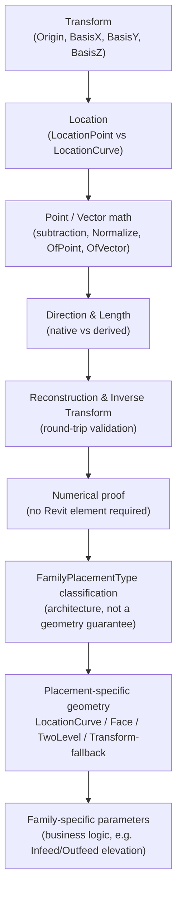
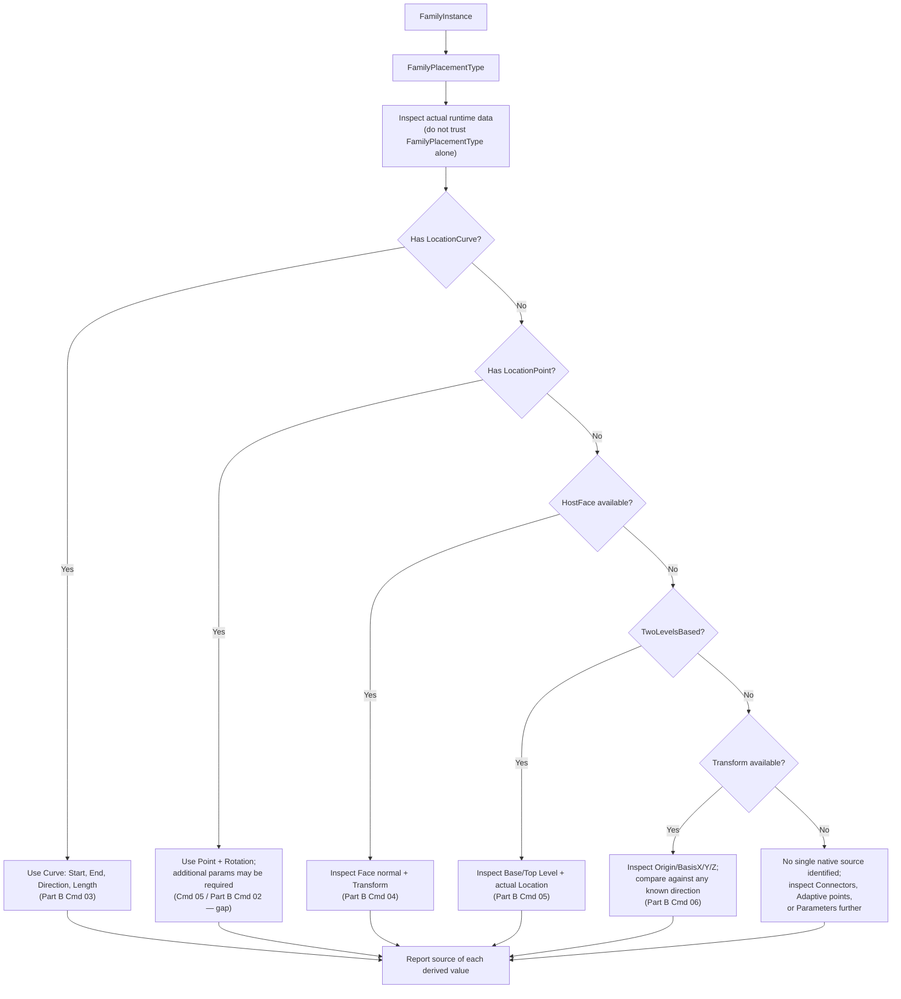
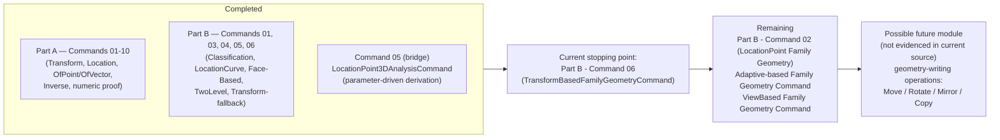

# Transform Module

A learning module for the Revit API's coordinate-system and family-placement geometry: how a `Transform` describes a local coordinate system, how an element's `Location` exposes (or fails to expose) geometric facts natively, and how a `FamilyInstance`'s real-world Start Point, End Point, 3D Direction, Rotation, and Length are — depending on the case — read directly from the API, mathematically derived, driven by Family-specific parameters, or simply not available without more information.

This document is generated from the current contents of `TransformModule/` and reflects the code as it exists today, including its gaps and inconsistencies. It is not a design spec for what the module *should* be.

---

## 1. Why This Module Exists

Almost every non-trivial Revit API task — placing a family along a slope, orienting a fitting to a host face, reporting a structural member's true 3D length — eventually needs the same five facts about an element:

1. **Length**
2. **Start Point**
3. **End Point**
4. **3D Direction**
5. **Rotation**

The temptation is to assume these are always available as simple properties. They are not. Revit exposes geometry through several unrelated mechanisms — `Location`, `Transform`, `Host`/`HostFace`, `FamilyPlacementType`, and instance `Parameter`s — and **which mechanism applies, and what it actually gives you, depends on how the specific Family was built.**

The Transform Module exists to build that judgment explicitly, in two stages:

- **Part A — Transform Fundamentals** teaches the underlying math and API vocabulary (`Transform`, `XYZ`, points vs. vectors, `Location`) using whatever element the user selects, independent of any particular Family.
- **Part B — Family Geometry** applies that vocabulary to real `FamilyInstance` placement architectures (point-based, curve-based, face-based, two-level-based) and repeatedly demonstrates the module's central rule:

> **Do not assume geometry from `FamilyPlacementType`, `Transform`, or naming conventions alone. Inspect the actual runtime data, then derive only what the evidence supports.**

Every command in the module is `[Transaction(TransactionMode.ReadOnly)]` — this is a pure inspection/reporting module. Nothing here creates, moves, or modifies model elements.

---

## 2. Conceptual Progression



Part A never touches a Family parameter and rarely relies on `FamilyPlacementType`. Part B never introduces new math — it re-applies Part A's math (`Normalize`, `DotProduct`, vector subtraction, `Transform` inspection) to the specific, messier reality of family placement.

---

## 3. Command Inventory

### PART A — Transform Fundamentals
*(folder: `Commands/Fundamentals/`, unless noted)*

| # | Class (file) | Namespace | Purpose |
|---|---|---|---|
| 01 | `TransformInspectionCommand` | `...Commands` | Introduce `Transform` structure: Origin, BasisX, BasisY, BasisZ |
| 02 | `LocationPointVsLocationCurveCommand` | `...Commands` | Introduce the `Location` → `LocationPoint` / `LocationCurve` split |
| 03 | `LocationGeometryAnalysisCommand`¹ | `...Commands` | Same split as 02, but explicitly labels each value's *source* (Revit vs. calculated) |
| 04 | `DerivedGeometryCommand`² | `...Commands.Fundamentals` | Formalizes derivation: direction, horizontal angle, End-Point reconstruction |
| 05 | `LocationPoint3DAnalysisCommand`³ | `...Commands.FamilyGeometry` | First Family-parameter-driven example: derives a sloped run's Start/End/Direction/Rotation from `Length`/`Infeed`/`Outfeed` parameters |
| 06 | `TransformOfPointCommand` | `...Commands` | Formalizes `Transform.OfPoint()`: `P_world = Origin + X·BasisX + Y·BasisY + Z·BasisZ` |
| 07 | `TransformOfVectorCommand` | `...Commands` | Formalizes `Transform.OfVector()`: same formula **without** Origin |
| 08 | `PointVsVectorTransformationCommand` | `...Commands` | Proves `OfPoint(B) - OfPoint(A) ≈ OfVector(B - A)` |
| 09 | `InverseTransformCommand` | `...Commands` | `Transform.Inverse` round-trip (Local → Model → Local) for a point and a vector |
| 10 | `TransformNumericalExampleCommand` | `...Commands` | Same forward/inverse math, fully synthetic — no Revit element required |

¹ File name is `PointAndVectorMathematicsCommand.cs`; the class inside is `LocationGeometryAnalysisCommand`. See [Observations](#12-observations--potential-issues).
² Only file in `Fundamentals/` whose namespace ends in `.Fundamentals` rather than plain `.Commands`. See [Observations](#12-observations--potential-issues).
³ Physically stored in `Commands/FamilyGeometry/`, not `Commands/Fundamentals/`, even though its header numbers it "Command 05" in the Part A sequence rather than "Part B - Command 0X". See [Observations](#12-observations--potential-issues).

### PART B — Family Geometry
*(folder: `Commands/FamilyGeometry/`)*

| Part B # | Class | Purpose |
|---|---|---|
| 01 | `FamilyPlacementClassificationCommand` | Classify `FamilyPlacementType`, actual `Location` type, `Host`/`HostFace`, and `Transform` availability — **without** calculating final geometry |
| **02** | *(gap — see [§11 Remaining Commands](#11-remaining-commands))* | |
| 03 | `LocationCurveFamilyGeometryCommand` | Full geometry from `LocationCurve`: Start/End/Length native, Direction derived, Rotation explicitly undefined |
| 04 | `FaceBasedFamilyGeometryCommand` | Face/WorkPlane-hosted instance: measures (never assumes) the relationship between `Transform.BasisZ` and the host Face normal |
| 05 | `TwoLevelFamilyGeometryCommand` | Base/Top Level elevations + whichever `Location` type is actually present (e.g. a structural column) |
| 06 | `TransformBasedFamilyGeometryCommand` | Universal fallback: compares an existing `LocationCurve` direction against all three Basis axes to find which one is physically aligned |

Command 05 (`LocationPoint3DAnalysisCommand`) sits alongside these files but is **not** part of the "Part B - Command 0X" numbering — its header labels it "Command 05" in the global Part A sequence. It is documented under Part A above, but conceptually it is the bridge between Part A's derivation math and Part B's Family-specific parameter logic.

---

## 4. Detailed Command Reference

Each entry lists: Revit API surface used, concept taught, inputs/outputs, ReadOnly/Manual, key math, and relationship to neighboring commands.

### Command 01 — `TransformInspectionCommand`
- **API:** `FamilyInstance.GetTransform()`, `Transform.Origin/BasisX/BasisY/BasisZ`
- **Concept:** A `Transform` is a local coordinate system embedded in the model (an origin + three basis vectors).
- **Input:** One selected `FamilyInstance`. **Output:** TaskDialog listing Origin/BasisX/BasisY/BasisZ.
- **Mode:** ReadOnly. **Math:** none — pure property read.
- **Relationship:** Entry point of the whole module; every later command assumes this vocabulary.

### Command 02 — `LocationPointVsLocationCurveCommand`
- **API:** `Element.Location`, `LocationPoint.Point/Rotation`, `LocationCurve.Curve`, `Curve.GetEndPoint(0/1)`, `Curve.Length`
- **Concept:** `Location` is polymorphic — an element's geometry is reported differently depending on its runtime `Location` subtype.
- **Input:** Any selected `Element` (not restricted to `FamilyInstance`). **Output:** TaskDialog with whichever branch (`LocationPoint`/`LocationCurve`) applies, including a derived Direction for curves.
- **Mode:** ReadOnly. **Math:** vector subtraction (`End - Start`), `Normalize()`.
- **Relationship:** Generalizes Command 01's coordinate vocabulary to arbitrary elements; sets up 03/04's Native-vs-Derived framing.

### Command 03 — `LocationGeometryAnalysisCommand` (file `PointAndVectorMathematicsCommand.cs`)
- **API:** Same as Command 02.
- **Concept:** Explicitly labels each reported value's **Source** (`Revit` vs. `Calculated`) — the first appearance of the Native/Derived distinction that becomes central to Part B.
- **Input:** Any `Element`. **Output:** TaskDialog with a `SUMMARY:` block classifying Point/Rotation/Direction/Length by source.
- **Mode:** ReadOnly. **Math:** vector subtraction, `Normalize()`.
- **Relationship:** Refines Command 02 into the Native/Derived framework reused throughout the module.

### Command 04 — `DerivedGeometryCommand`
- **API:** `Location`, `LocationPoint`, `LocationCurve`, `FamilyInstance.GetTransform()`, `Curve.GetEndPoint`/`Length`
- **Concept:** Derivation formulas: `End = Start + Direction × Length`; horizontal angle via `Math.Atan2(Direction.Y, Direction.X)`; using `Transform.BasisX` as a directional stand-in when only a `LocationPoint` exists.
- **Input:** Any `Element` (the `LocationPoint` branch additionally casts to `FamilyInstance` to read its `Transform`). **Output:** TaskDialog with derived Direction, horizontal angle, and a reconstructed End Point + reconstruction error.
- **Mode:** ReadOnly. **Math:** vector subtraction, `Normalize()`, `Atan2`, reconstruction (`Start + Direction*Length`), `DistanceTo` (error check).
- **Relationship:** Introduces the reconstruction/validation pattern (compute a value, then verify it against a known quantity) reused by Commands 06, 07, 09, 10, and Part B Command 05.

### Command 05 — `LocationPoint3DAnalysisCommand` *(physically in `Commands/FamilyGeometry/`)*
- **API:** `LocationPoint.Point/Rotation`, `FamilyInstance.LookupParameter`, `Parameter.AsDouble()`, `FamilyInstance.GetTransform()`, `Transform.BasisX`
- **Concept:** The first fully worked example of **Family-specific business logic**: a sloped run's Start/End/3D Direction/Rotation, derived from a `LocationPoint` plus three custom instance parameters (`Length`, `Infeed`, `Outfeed`). The file's own header is explicit that `LocationPoint.Point = Infeed/Start Point` and "`BasisX` = horizontal orientation" are **Family conventions, not Revit rules** — they will silently misbehave for a Family that defines its `LocationPoint` differently (e.g. as a center point).
- **Input:** A `FamilyInstance` with a `LocationPoint` and parameters literally named `Length`, `Infeed`, `Outfeed` (hardcoded as class constants). **Output:** TaskDialog with the three parameter values, rotation, derived Start/End points, 3D Direction, and an elevation-reconstruction error check.
- **Mode:** ReadOnly. **Math:** Pythagorean theorem `H = √(L² − ΔZ²)`, composition of horizontal + vertical direction components, `Normalize()`, reconstruction + `DistanceTo`-style elevation check.
- **Relationship:** Bridges Part A's generic derivation techniques into Part B's parameter-driven territory — conceptually it should precede `FamilyPlacementClassificationCommand`, but its file location and lack of a "Part B" numbering prefix leave that relationship implicit rather than declared. See [Observations](#12-observations--potential-issues).

### Command 06 — `TransformOfPointCommand`
- **API:** `Transform.OfPoint()`, `Transform.Origin/BasisX/BasisY/BasisZ`, `LocationPoint.Point` (as a cross-check)
- **Concept:** Formalizes the point-transformation formula: `P_world = Origin + X·BasisX + Y·BasisY + Z·BasisZ`.
- **Input:** Selected `FamilyInstance`. **Output:** TaskDialog with a hardcoded local point, `Transform.OfPoint()` result, a hand-computed result, the error between them, and the instance's actual `LocationPoint` for comparison.
- **Mode:** ReadOnly. **Math:** linear combination of basis vectors, `DistanceTo` (validation).
- **Relationship:** Formalizes what Commands 04–05 used informally; sets up Command 07's contrast.

### Command 07 — `TransformOfVectorCommand`
- **API:** `Transform.OfVector()`
- **Concept:** Contrasts `OfVector()` with `OfPoint()` — the same formula **without** the `Origin` term — and explicitly demonstrates why adding Origin to a transformed vector produces a nonsensical "position-like" quantity.
- **Input:** Selected `FamilyInstance`. **Output:** TaskDialog with vector transform, hand-computed result, error, and an intentionally-wrong "Origin + Vector" example.
- **Mode:** ReadOnly. **Math:** linear combination without Origin, vector length/`Normalize()`, `DistanceTo`.
- **Relationship:** Direct sequel to Command 06; both feed Command 08's synthesis.

### Command 08 — `PointVsVectorTransformationCommand`
- **API:** `Transform.OfPoint()`, `Transform.OfVector()`
- **Concept:** Proves the identity `Transform.OfPoint(B) − Transform.OfPoint(A) ≈ Transform.OfVector(B − A)` — i.e., that Origin cancels out of point differences.
- **Input:** Selected `FamilyInstance` (uses two hardcoded local points, A and B). **Output:** TaskDialog comparing both derivation paths and their difference.
- **Mode:** ReadOnly. **Math:** vector subtraction, `DistanceTo` comparison, `Normalize()`.
- **Relationship:** Synthesizes Commands 06 and 07; precedes Command 09's inverse-transform round trip.

### Command 09 — `InverseTransformCommand`
- **API:** `Transform.Inverse`, `Transform.OfPoint()`/`OfVector()`
- **Concept:** `Transform.Inverse` converts Model-space back to Local-space; demonstrated as a full round trip for both a point and a vector.
- **Input:** Selected `FamilyInstance`. **Output:** TaskDialog with forward/backward point and vector, plus reconstruction errors (expected ≈ 0).
- **Mode:** ReadOnly. **Math:** transform inversion (via API), `DistanceTo` error.
- **Relationship:** Builds directly on 06–08; the last element-driven Part A command before the pure-numeric closer.

### Command 10 — `TransformNumericalExampleCommand`
- **API:** `Transform.Identity`, `Transform.OfPoint()`/`OfVector()`/`Inverse` — **no Revit element selection at all.**
- **Concept:** The same OfPoint/OfVector/Inverse concepts proven with hand-picked numbers (`Origin = (100,200,50)`, `BasisX=(0,1,0)`, `BasisY=(-1,0,0)`, `BasisZ=(0,0,1)`) — a fully worked, model-independent capstone. Ends with a "Final Mental Model" diagram summarizing the whole forward/inverse flow.
- **Input:** None (hardcoded values). **Output:** TaskDialog with the full worked numeric example.
- **Mode:** ReadOnly (touches no model state; pure math). **Math:** manual point/vector transform formulas, inverse round trip, error checks.
- **Relationship:** Closes Part A. Its printed "Final Mental Model" is effectively the summary diagram for Commands 01–09 and the conceptual hand-off into Part B.

### Part B — Command 01 — `FamilyPlacementClassificationCommand`
- **API:** `Family.FamilyPlacementType`, `FamilyInstance.Location`, `FamilyInstance.Host`, `FamilyInstance.HostFace`, `FamilyInstance.GetTransform()`
- **Concept:** `FamilyPlacementType` describes *placement architecture*, not a guarantee of specific geometry. The command classifies four independent facts (placement type, actual `Location` runtime type, host info, transform availability) and recommends — but does **not** compute — a geometry-derivation strategy per placement type (`OneLevelBased`, `TwoLevelsBased`, `WorkPlaneBased`, `CurveBased`, `Adaptive`, `ViewBased`).
- **Input:** Selected `FamilyInstance`. **Output:** TaskDialog with family/placement/host/transform info and a "Part B Core Rule" checklist.
- **Mode:** ReadOnly. **Math:** none — pure inspection and classification.
- **Relationship:** Entry point of Part B. Commands 03–06 each implement one branch of this command's decision tree (see [§9](#9-family-geometry-strategy)); the `LocationPoint` branch it describes has no dedicated command (see [§11](#11-remaining-commands)).

### Part B — Command 03 — `LocationCurveFamilyGeometryCommand`
- **API:** `LocationCurve.Curve`, `Curve.GetEndPoint(0/1)`, `Curve.Length`, `FamilyInstance.GetTransform()`
- **Concept:** For `CurveBased` families, Start/End/Length come directly from the `Curve`; Direction is derived (`(End-Start).Normalize()`); Rotation is explicitly reported as **not** available as a `LocationPoint.Rotation`-style scalar. Also distinguishes `Curve.Length` (actual path length) from the Start↔End chord distance for non-straight curves.
- **Input:** `FamilyInstance` with a `LocationCurve`. **Output:** TaskDialog with curve type, Start/End, Direction, Length vs. endpoint-distance comparison, Transform axes, and a "Geometry Strategy" summary.
- **Mode:** ReadOnly. **Math:** vector subtraction + `Normalize()`, `DistanceTo` (chord), `Line` type-check.
- **Relationship:** Implements the "LocationCurve" branch of Part B - Command 01; its unbuilt sibling, the "LocationPoint" branch, is Part B - Command 02 (missing — see §11).

### Part B — Command 04 — `FaceBasedFamilyGeometryCommand`
- **API:** `FamilyInstance.HostFace`, `Element.GetGeometryObjectFromReference`, `Face.GetBoundingBox()`/`ComputeNormal()`/`Evaluate()`, `Transform.BasisX/BasisY/BasisZ`
- **Concept:** For Face/WorkPlane-hosted instances, the relationship between `Transform.BasisZ` and the host Face's normal is **measured**, never assumed — reported as a dot product and an angle. Explicitly states that Start Point, End Point, and Length are **not universally defined** for this placement type.
- **Input:** `FamilyInstance` hosted on a face. **Output:** TaskDialog with host/face info, Transform axes, BasisZ-vs-normal comparison, and explicit "not universally defined" statements for the Start/End/Length fields.
- **Mode:** ReadOnly. **Math:** `XYZ.DotProduct`, inline clamp (`Math.Max(-1.0, Math.Min(1.0, dot))`), `Math.Acos` → degrees.
- **Relationship:** The first Part B command to explicitly report a geometric value as *unavailable* rather than derive a guess — contrasts with Command 03's certainty for `LocationCurve` elements.

### Part B — Command 05 — `TwoLevelFamilyGeometryCommand`
- **API:** `BuiltInParameter.FAMILY_BASE_LEVEL_PARAM`/`FAMILY_TOP_LEVEL_PARAM`, `Level.Elevation`, `Location`/`LocationPoint`/`LocationCurve`, `FamilyInstance.GetTransform()`
- **Concept:** For `TwoLevelsBased` families (e.g. a structural column), the vertical Base/Top Level span is one independent fact and the actual runtime `Location` (which may be a `LocationPoint` *or* a `LocationCurve`) is another. The file explicitly warns that a family's structural section/type name (e.g. "IPE 200") is unrelated to its placement architecture ("TwoLevelsBased"), and that the Level-to-Level vector is **not** automatically the physical member direction (e.g. for a slanted column).
- **Input:** `FamilyInstance` with `FamilyPlacementType.TwoLevelsBased`. **Output:** TaskDialog with level info, whichever Location data is present, Transform, a "Main Geometric Values" table with explicit "Not directly available" markers, and the Level-to-Level vector with its caveat.
- **Mode:** ReadOnly. **Math:** vector subtraction (level vector), `Normalize()` (only if a `LocationCurve` is present).
- **Relationship:** Reapplies Commands 03/04's "measure, don't assume" discipline to level-based placement; demonstrates that one `FamilyPlacementType` can correspond to more than one runtime `Location` type.

### Part B — Command 06 — `TransformBasedFamilyGeometryCommand`
- **API:** `FamilyInstance.GetTransform()`, `Transform.BasisX/BasisY/BasisZ`, `LocationCurve`, `XYZ.DotProduct`
- **Concept:** The universal fallback for any `FamilyInstance`. When a `LocationCurve` is present, the actual curve direction is compared (via dot product and angle) against all three Basis axes to determine which one is physically aligned with it — rather than assuming `BasisX` is always the "length" axis. Introduces the module's only shared-looking helper, a private `Clamp(double, double, double)` method.
- **Input:** Any `FamilyInstance`. **Output:** TaskDialog with axes, curve-vs-axis dot products/angles, the closest-matching axis, and a final "Core Rule" statement.
- **Mode:** ReadOnly. **Math:** `Normalize()`, `DotProduct`, `Clamp(-1,1)`, `Math.Acos` → degrees.
- **Relationship:** Closes Part B. Where Commands 03–05 each target one specific placement architecture, Command 06 works for *any* `FamilyInstance` and generalizes the module's "coordinate-system meaning ≠ business meaning" rule to its broadest form.

---

## 5. The Five Main Geometric Values

| Value | Native? | Providing API (when native) | Derived how? (when not native) | Depends on Placement Type? | Depends on Family Parameters? | Universal or case-specific? |
|---|---|---|---|---|---|---|
| **Length** | Sometimes | `Curve.Length` (`LocationCurve`) | Reconstructed from a `Length`-named parameter (Cmd 05); Pythagorean `H=√(L²−ΔZ²)` for the horizontal component | Yes — only guaranteed native for `CurveBased`/curve-holding `TwoLevelsBased` | Yes, whenever no `LocationCurve` exists | **Case-specific** |
| **Start Point** | Sometimes | `LocationPoint.Point` or `Curve.GetEndPoint(0)` | N/A when native; otherwise assumed equal to a parameter-driven insertion point (Cmd 05's "Infeed" convention) | Yes | Sometimes — the "Point = Start" mapping is a Family convention, not an API rule (Cmd 05) | **Case-specific** |
| **End Point** | Sometimes | `Curve.GetEndPoint(1)` | `Start + Direction × Length` | Yes | Yes, when derived from Length/elevation parameters (Cmd 05) | **Case-specific** |
| **3D Direction** | Rarely | — | `(End − Start).Normalize()`, or the axis of `Transform.BasisX/Y/Z` found (by dot product) to best match a known physical direction (Part B Cmd 06) | Yes | Sometimes | **Case-specific** — which Basis axis is "the" direction is measured, never assumed |
| **Rotation** | Sometimes | `LocationPoint.Rotation` | For `LocationCurve` or general 3D orientation, no scalar equivalent exists — explicitly reported as unavailable (Part B Cmd 03, Cmd 06) or derived via `Atan2` for a horizontal projection (Cmd 04) | Yes | No | **Case-specific** — explicitly undefined for curve-based and arbitrarily-oriented instances |

**The module never claims all five values are available for every `FamilyInstance`.** Several commands (Part B 03, 04, 05, 06) explicitly print "Not directly available" / "not universally defined" rather than inventing a value — this is a deliberate, repeated pattern, not an oversight.

---

## 6. Location Architecture

```
Location
├── LocationPoint
│      ├── Point      (Revit-native, XYZ)
│      └── Rotation   (Revit-native, double, radians)
└── LocationCurve
       └── Curve
              ├── GetEndPoint(0)  → Start Point (Revit-native)
              ├── GetEndPoint(1)  → End Point   (Revit-native)
              ├── Length          → Actual Length (Revit-native)
              └── (End − Start).Normalize() → 3D Direction (derived)
```

**Why a blind cast is dangerous:** `element.Location` returns the base `Location` type. Casting it directly to `LocationPoint` or `LocationCurve` without checking (`location as LocationPoint`) risks a silent `null` and a `NullReferenceException` later — or, worse, code that only *happens* to work because it was tested on one element type. Every command in this module follows the same defensive pattern:

```csharp
LocationPoint locationPoint = location as LocationPoint;
LocationCurve locationCurve = location as LocationCurve;

if (locationPoint != null) { /* ... */ }
else if (locationCurve != null) { /* ... */ }
else { /* explicitly report an unhandled Location runtime type */ }
```

(See `LocationPointVsLocationCurveCommand`, `LocationGeometryAnalysisCommand`, `DerivedGeometryCommand`, and `FamilyPlacementClassificationCommand` for this exact structure.)

**`LocationPoint`:**
- `Point` — a single `XYZ` insertion point. Native.
- `Rotation` — a scalar angle in radians. Native.
- **Not directly available:** 3D Direction (a point has no inherent direction — it must be derived from the instance's `Transform`, as `DerivedGeometryCommand` does with `BasisX.Normalize()`), and Actual Length (not applicable — a point has no length).

**`LocationCurve`:**
- `Curve` — the underlying geometric curve. Native.
- `Curve.GetEndPoint(0)` / `GetEndPoint(1)` — Start/End points. Native.
- `Curve.Length` — the actual path length along the curve. Native.
- 3D Direction — derived as `(End − Start).Normalize()`.
- **Why `Curve.Length` is not always the endpoint distance:** for a straight `Line`, `Curve.Length ≈ Distance(Start, End)`. For any curved `Curve` (arcs, splines), `Curve.Length` is the true arc length, while `Distance(Start, End)` is only the straight-line **chord** between the endpoints — always shorter. `LocationCurveFamilyGeometryCommand` computes and displays both explicitly for this reason, and checks `curve as Line` to report which case applies.

---

## 7. Family Placement Architecture

```
Family
  └── FamilyPlacementType        (architecture — how the family CAN be placed)
FamilySymbol
  └── (the "type", e.g. "IPE 200" — unrelated to placement architecture)
FamilyInstance
  ├── Location                   (actual runtime placement — LocationPoint / LocationCurve / other)
  ├── GetTransform()             (the instance's local coordinate system)
  ├── Host / HostFace            (only meaningful for hosted placements)
  └── Parameters                 (Family-specific business data, e.g. "Length", "Infeed")
```

`FamilyPlacementType` (`OneLevelBased`, `TwoLevelsBased`, `WorkPlaneBased`, `CurveBased`, `Adaptive`, `ViewBased`, …) describes **placement architecture** — a static fact about how the Family was authored. It must **not** be interpreted as a guarantee that a specific geometric value (Length, a `LocationCurve`, a face normal) actually exists for a given instance.

`FamilyPlacementClassificationCommand` makes this the explicit "Part B Core Rule":

> First inspect: 1. `FamilyPlacementType` 2. Actual `Location` runtime type 3. Host / HostFace 4. `Transform` 5. Native geometry 6. Parameters / References
> Then derive: Start Point, End Point, Direction, Rotation, Actual Length — **in that order, and only what the evidence supports.**

`TwoLevelFamilyGeometryCommand` demonstrates the distinction concretely: it explicitly separates the *Revit API constraint* (a `TwoLevelsBased` family has Base/Top Level parameters) from a *Family-specific business convention* (that "IPE 200" describes the structural section, which has nothing to do with `TwoLevelsBased` placement, and that the Level-to-Level vertical vector is not automatically the physical member axis for a slanted member).

---

## 8. The Transform Concept

`Transform.Origin`, `.BasisX`, `.BasisY`, `.BasisZ` together describe a local (instance) coordinate system embedded in the model's global coordinate system:

- **`Origin`** — where the local coordinate system sits in model space.
- **`BasisX` / `BasisY` / `BasisZ`** — the directions of the local X/Y/Z axes, expressed in model space.

**Coordinate-system meaning vs. business meaning.** `TransformBasedFamilyGeometryCommand` states this directly:

> `BasisX`/`BasisY`/`BasisZ` tell us **how** the Family is oriented. They do NOT automatically tell us **which** axis represents the business meaning of length.

The module never asserts "`BasisX` = length direction" as a rule. Where a command needs to know which axis is physically meaningful, it **measures** the relationship instead of assuming it:

- `LocationPoint3DAnalysisCommand` (Cmd 05) uses `BasisX` as the horizontal orientation, but its own header calls this out explicitly as *"a FAMILY CONVENTION, not a universal Revit rule."*
- `FaceBasedFamilyGeometryCommand` computes the dot product/angle between `BasisZ` and the host Face's actual normal rather than assuming alignment.
- `TransformBasedFamilyGeometryCommand` computes the dot product/angle between an existing `LocationCurve` direction and **all three** basis vectors, and reports whichever one is closest — again, measured, not assumed.

---

## 9. Mathematical Concepts Used

| Concept | Used in | Why |
|---|---|---|
| **Vector subtraction** (`End − Start`) | Commands 02, 03, 04, 08, Part B 03, 05, 06 | Deriving a direction vector from two points. |
| **Normalization** (`XYZ.Normalize()`) | Commands 02, 03, 04, 06, 07, 08, 09, Part B 03, 04, 05, 06 | Converting a vector to a unit-length direction. |
| **Dot product** (`XYZ.DotProduct()`) | Part B 04 (BasisZ vs. Face normal), Part B 06 (curve direction vs. each basis axis) | Measuring alignment between two directions. |
| **Angle calculation** (`Math.Acos(dot) * 180/π`) | Part B 04, Part B 06 | Converting a dot product into a human-readable angle in degrees. |
| **Distance** (`XYZ.DistanceTo()`) | Commands 06, 07, 08, 09, 10, Part B 03 (chord vs. `Curve.Length`) | Round-trip / reconstruction error checking, and chord-length comparison. |
| **Cross product** | **Not used anywhere in the module.** | No current command needs to reconstruct a missing basis vector (e.g. `BasisY` from `BasisZ × BasisX`). A natural candidate for a future full-orientation-reconstruction command — see [§11](#11-remaining-commands). |
| **`Transform.OfPoint`** | Commands 06, 08, 09, 10 | Point transformation `Origin + X·BasisX + Y·BasisY + Z·BasisZ`. |
| **`Transform.OfVector`** | Commands 07, 08, 09, 10 | Vector transformation `X·BasisX + Y·BasisY + Z·BasisZ` (Origin excluded). |
| **`Transform.Inverse`** | Commands 09, 10 | Converting Model-space coordinates back to Local-space. |
| **Coordinate-system conversion** (Local ↔ World) | Commands 06–10 | The forward/inverse round trip that is Part A's central proof. |
| **Floating-point tolerance** | Cmd 05 (`1e-9`), Part B 03 (`1e-9`), Part B 05 (`1e-9`), Part B 06 (`Tolerance = 1e-6`, a named `private const`) | Guarding against divide-by-near-zero / meaningless-direction results. **Note:** the tolerance value is not shared — see [Observations](#12-observations--potential-issues). |
| **Clamp** | Part B 06 defines `private static double Clamp(double value, double min, double max)`, used to guard `Math.Acos` against floating-point drift outside `[-1, 1]` | Part B 04 needs the identical guard but re-implements it inline as `Math.Max(-1.0, Math.Min(1.0, dot))` rather than reusing a shared helper — see [Observations](#12-observations--potential-issues). |

---

## 10. Family Geometry Strategy

This is the decision tree `FamilyPlacementClassificationCommand` (Part B - Command 01) implements, and that Part B Commands 03–06 each cover one branch of:



This exact branch order (`LocationCurve` → `LocationPoint` → `HostFace` → `TwoLevelsBased` → `Transform` → none-found) is taken directly from `FamilyPlacementClassificationCommand`'s `geometrySource`/`geometryStrategy` decision logic.

---

## 11. Remaining Commands

The following are gaps identified by inspecting the actual `TransformModule/` filesystem — not assumptions about a hidden roadmap.

### Part B - Command 02 — expected: "LocationPoint Family Geometry Command"
- **Why needed:** Part B - Command 01 (`FamilyPlacementClassificationCommand`) explicitly recommends a `LocationPoint`-based strategy ("Use LocationPoint first: Insertion Point and Rotation") as a parallel branch to Part B - Command 03's `LocationCurve` handling. No generic command implements it.
- **Dependencies:** `LocationPoint.Point`/`Rotation`, likely `FamilyInstance.GetTransform()` for orientation, following the same "report what's native, explicitly flag what's not" pattern as Command 03.
- **Distinction from the existing `LocationPoint3DAnalysisCommand` (global Command 05):** that command already analyzes a point-based instance, but it is a *specific, parameter-driven* case (requires `Length`/`Infeed`/`Outfeed` parameters with those exact names) — not a generic `LocationPoint` counterpart to `LocationCurveFamilyGeometryCommand`.
- **Part:** B.
- **Status: Not implemented / no source evidence found** for a generic (non-parameter-dependent) version.

### Adaptive-based Family Geometry Command
- **Expected name:** e.g. `AdaptiveFamilyGeometryCommand`.
- **Why needed:** `FamilyPlacementClassificationCommand`'s placement-specific guidance explicitly names the `Adaptive` case: *"Inspect adaptive placement points. Do not rely on LocationPoint or LocationCurve."* No command in the filesystem reads adaptive component points.
- **Dependencies:** Adaptive Component APIs (e.g. `AdaptiveComponentInstanceUtils`) — not referenced anywhere in the current module.
- **Part:** B.
- **Status: Not implemented / no source evidence found.**

### ViewBased Family Geometry Command
- **Expected name:** e.g. `ViewBasedFamilyGeometryCommand`.
- **Why needed:** Also named in `FamilyPlacementClassificationCommand`'s guidance switch: *"Inspect the view coordinate system and instance placement."* No dedicated command exists.
- **Dependencies:** View coordinate system inspection (e.g. `View.RightDirection`/`UpDirection`) — not referenced anywhere in the current module.
- **Part:** B.
- **Status: Not implemented / no source evidence found.**

No other planned-but-missing commands were found in code comments, TODOs, or documentation inside `TransformModule/`. (Note: an older, unrelated `Samples/Transform/` folder with differently-named commands — `CopyElementCommand`, `MirrorElementCommand`, `MoveElementCommand`, `RotateElementCommand`, `TransformGeometryCommand`, etc. — was removed from the repository as part of this module's introduction. Those commands performed geometry *modification*, not inspection, and there is no evidence in the current `TransformModule/` source that they are intended to be reintroduced here; they are noted only for completeness, not as a remaining-commands claim.)

---

## 12. Observations / Potential Issues

These are noted without changing any source code.

1. **Filename/class name mismatch.** `Commands/Fundamentals/PointAndVectorMathematicsCommand.cs` contains a class named `LocationGeometryAnalysisCommand` (Command 03) — the filename does not describe the class it holds, which will mislead anyone locating commands by filename.
2. **Namespace inconsistency within `Fundamentals/`.** `DerivedGeometryCommand.cs` uses `RevitApiSamples.Samples.TransformModule.Commands.Fundamentals`; every other file in the same folder uses the shorter `RevitApiSamples.Samples.TransformModule.Commands`. It is the only file with a folder-matching namespace in Part A.
3. **`LocationPoint3DAnalysisCommand` is numbered outside the folder it lives in.** Its header labels it global "Command 05" (Part A's sequence), but it is physically stored under `Commands/FamilyGeometry/` with namespace `...FamilyGeometry`, alongside the "Part B - Command 0X" files. This splits Part A's command sequence across two folders and makes the Part B - Command 02 gap easy to miss on a folder listing.
4. **Two independent numbering schemes collide at "05".** The global "Command NN" sequence (01–10, used by Fundamentals) and the separate "Part B - Command NN" sequence (01, 03–06, used by FamilyGeometry) are both present in the same folder once Command 05 is included. A reader who only opens `FamilyGeometry/` could easily — but incorrectly — assume `LocationPoint3DAnalysisCommand` is "Part B - Command 02".
5. **Duplicated clamp logic.** `TransformBasedFamilyGeometryCommand` defines a private `Clamp(double, double, double)` helper specifically to guard `Math.Acos` inputs to `[-1, 1]`. `FaceBasedFamilyGeometryCommand` needs the exact same guard and re-implements it inline as `Math.Max(-1.0, Math.Min(1.0, dot))`. No shared module-level utility exists.
6. **Inconsistent floating-point tolerances.** `1e-9` is used ad hoc (not as a named constant) in `LocationPoint3DAnalysisCommand`, `LocationCurveFamilyGeometryCommand`, and `TwoLevelFamilyGeometryCommand`, while `TransformBasedFamilyGeometryCommand` defines its own named `private const double Tolerance = 1e-6` — two full orders of magnitude looser, and not shared with the other files.
7. **`LocationPoint3DAnalysisCommand`'s core assumption is a hardcoded Family convention.** The command assumes `LocationPoint.Point` represents the "Infeed/Start" point and that `Transform.BasisX` projected to the XY plane is the horizontal orientation. Both are explicitly flagged in the file's own comments as Family-specific conventions rather than API guarantees — a Family authored with a center-point convention, or using different parameter names than the hardcoded `Length`/`Infeed`/`Outfeed` constants, will either fail the parameter lookup (handled) or silently produce a geometrically wrong Start/End point (not detected at runtime).
8. **Conceptual overlap between Commands 02, 03, and 04.** `LocationPointVsLocationCurveCommand`, `LocationGeometryAnalysisCommand`, and `DerivedGeometryCommand` all inspect the same `Location`/`LocationPoint`/`LocationCurve` surface on an arbitrary selected element, with each adding progressively more derived detail over the previous one. The boundary between "inspection" (02/03) and "derivation" (04) is a matter of degree rather than a clean split.
9. **No `CrossProduct` usage anywhere in the module**, despite it being a standard tool for full 3-axis orientation reconstruction. Not a defect — no current command needs it — but a natural gap once a face-based or adaptive command needs to reconstruct a missing basis vector.
10. **Inconsistent inline command-number comments.** Only 4 of the 10 Part A commands (01, 02, 06, 07) repeat their number as a `// Command NN` comment directly above the class declaration; the rest (03, 04, 08, 09, 10) state the number only inside the header block comment. None of the Part B files use the inline form at all (header-only, but at least internally consistent within Part B).

---

## 13. Transform Module Learning Roadmap



- **Completed:** All 10 Part A commands (Transform structure → Location → point/vector math → OfPoint/OfVector → Inverse → numeric proof), and 5 of the framed 6 Part B command slots (Classification, LocationCurve, Face-Based, TwoLevel, Transform-fallback), plus the bridging parameter-driven Command 05.
- **Current stopping point:** `TransformBasedFamilyGeometryCommand` (Part B - Command 06) — the most general, placement-agnostic command in the module, serving as its current fallback/closing case.
- **Remaining:** the Part B - Command 02 gap (generic `LocationPoint` Family geometry), plus the `Adaptive` and `ViewBased` placement-type commands named in `FamilyPlacementClassificationCommand`'s guidance but not yet implemented (§11).
- **Future transition:** the module is currently read-only end to end. A logical next module would apply the same Transform/Location vocabulary to geometry *modification* (move, rotate, mirror, copy) — which is what the now-deleted `Samples/Transform/` folder previously contained before this module replaced it. There is no source evidence in `TransformModule/` that this is the confirmed plan; it is noted here only as the most obvious next step given the module's own math foundation and the repository's history.
