# Transform Module

> **Revit API 2025** &nbsp;|&nbsp; **Namespace:** `RevitApiSamples.Samples.TransformModule` &nbsp;|&nbsp; **Mode:** `[Transaction(TransactionMode.ReadOnly)]` &nbsp;|&nbsp; **Focus:** Coordinate Systems, Affine Mathematics & Family Placement Geometry

A comprehensive architectural reference and deep-dive learning guide for the Revit API's coordinate systems, spatial transformations, and family-placement geometry: how a `Transform` defines a local 3D Cartesian coordinate system, how an element's `Location` exposes (or fails to expose) native geometric properties, and how a `FamilyInstance`'s real-world **Start Point**, **End Point**, **3D Direction**, **Rotation**, and **Actual Length** are read directly from the API, mathematically derived, driven by Family-specific parameters, or classified as undefined without additional context.

> [!NOTE]
> **Source Fidelity:** This document is generated from an in-depth audit of all 15 commands in `TransformModule/` and reflects the code as it exists in the codebase today, including its design patterns, mathematical proofs, conventions, and identified architectural gaps.

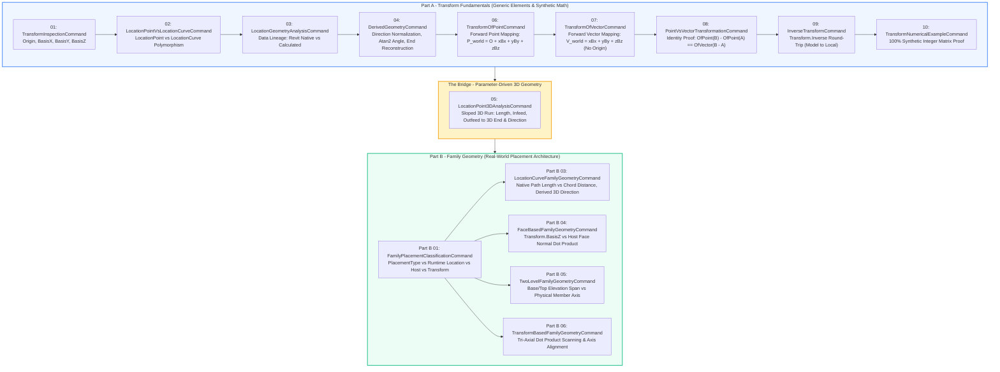

---

## 1. Why This Module Exists

Almost every non-trivial Revit API automation — routing conduit, positioning sloped conveyors, orienting face-hosted equipment, reporting structural member lengths, or placing structural connections — requires the same **five fundamental geometric facts** about an element:

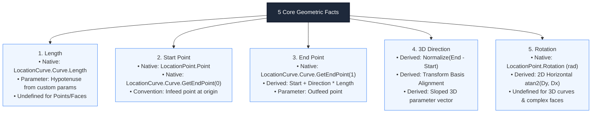

Developers new to the Revit API often assume these five properties exist as universal, top-level properties on `Element` or `FamilyInstance`. **They do not.** Revit distributes geometry across distinct, decoupled subsystems:

1. `Element.Location` (`LocationPoint` vs. `LocationCurve` polymorphism)
2. `FamilyInstance.GetTransform()` (Affine local Cartesian coordinate system: `Origin`, `BasisX`, `BasisY`, `BasisZ`)
3. `FamilyInstance.Host` and `FamilyInstance.HostFace` (Hosting element and geometric face references)
4. `Family.FamilyPlacementType` (Family authoring template architecture)
5. `FamilyInstance.LookupParameter()` (Family-specific business and geometric parameters)

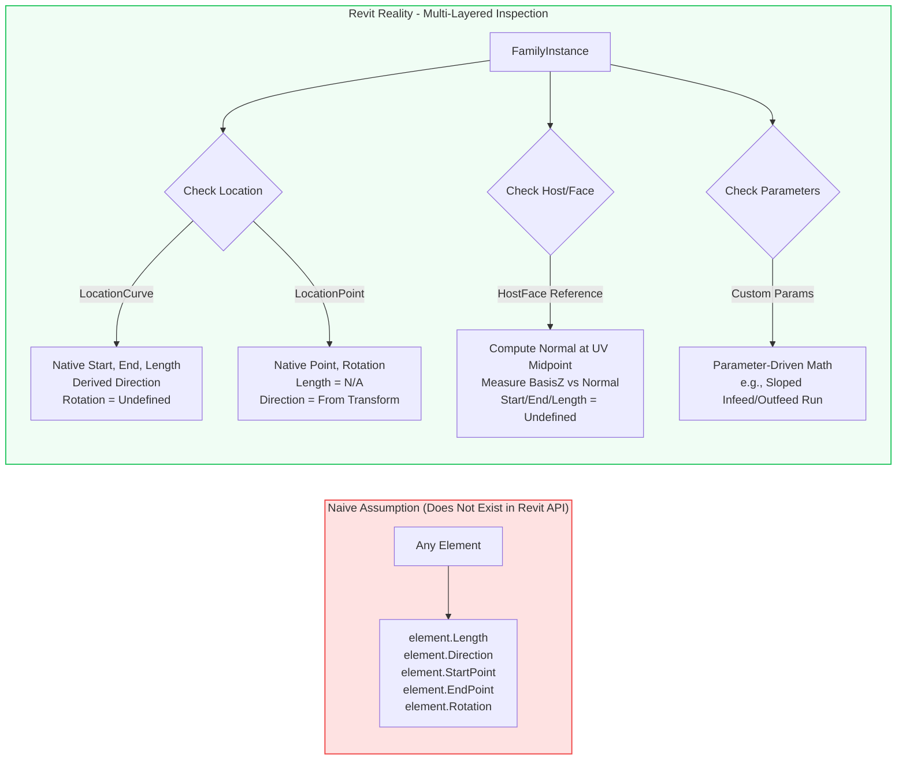

### The Module Architecture

The `TransformModule` teaches robust spatial engineering in three progressive sections:

- **Part A — Transform Fundamentals (Commands 01–04, 06–10):** Teaches affine matrix mathematics, vector algebra, coordinate frames, point vs. vector transformations, inverse round-trips, and data lineage on generic model elements and synthetic coordinate systems without touching family-specific parameters.
- **The Bridge — Parameter-Driven Geometry (Command 05):** Demonstrates how point-based instances with zero native curve geometry can derive full 3D spatial properties (Start, End, Direction, Length) by combining `LocationPoint`, `Transform.BasisX`, and family parameters (`Length`, `Infeed`, `Outfeed`).
- **Part B — Real-World Family Geometry (Part B Commands 01, 03–06):** Applies fundamental coordinate mathematics to real-world Revit family placement types (`OneLevelBased`, `TwoLevelsBased`, `WorkPlaneBased`, `CurveBased`), enforcing strict runtime inspection over authoring assumptions.

> [!IMPORTANT]
> **Part B Core Rule:**
> Never assume geometric properties based solely on `FamilyPlacementType`, `Transform`, or category naming. Always inspect the actual runtime data (`Location`, `Host`, `HostFace`, `Parameters`), and derive **only what the physical evidence supports**.

All commands in this module are decorated with `[Transaction(TransactionMode.ReadOnly)]` — they are pure inspection, mathematics, and diagnostic reporting tools that never modify the Revit document.

---

## 2. Mathematical Concepts and Formulations

The table below outlines all mathematical concepts applied throughout the module, followed by their rigorous mathematical descriptions.

| Mathematical Concept | Formal Equation / Definition | Used In Commands |
|---|---|---|
| **Vector Subtraction** | $\vec{V} = \mathbf{P}_{\text{end}} - \mathbf{P}_{\text{start}} = \begin{bmatrix} X_e - X_s \\ Y_e - Y_s \\ Z_e - Z_s \end{bmatrix}$ | Cmd 02, 03, 04, 08, Part B 03, 05, 06 |
| **Vector Magnitude / Norm** | $\|\vec{V}\| = \sqrt{V_x^2 + V_y^2 + V_z^2}$ | Cmd 02, 03, 04, 05, 07, 08, Part B 03, 05, 06 |
| **Vector Normalization** | $\hat{\mathbf{u}} = \dfrac{\vec{V}}{\|\vec{V}\|} \quad (\|\vec{V}\| > 10^{-9})$ | Cmd 02, 03, 04, 05, 06, 07, 08, 09, Part B 03–06 |
| **Dot Product** | $\vec{A} \cdot \vec{B} = A_x B_x + A_y B_y + A_z B_z = \|\vec{A}\|\|\vec{B}\|\cos\theta$ | Cmd 10, Part B 04, Part B 06 |
| **Clamped Angular Separation** | $\theta = \arccos\left(\text{clamp}\left(\dfrac{\vec{A} \cdot \vec{B}}{\|\vec{A}\|\|\vec{B}\|}, -1.0, 1.0\right)\right) \times \dfrac{180^\circ}{\pi}$ | Part B 04, Part B 06 |
| **Affine Point Transformation** | $\mathbf{P}_{\text{world}} = \mathbf{O} + X\mathbf{B}_x + Y\mathbf{B}_y + Z\mathbf{B}_z$ | Cmd 06, 08, 09, 10 |
| **Affine Vector Transformation** | $\vec{V}_{\text{world}} = X\mathbf{B}_x + Y\mathbf{B}_y + Z\mathbf{B}_z \quad (\text{Origin excluded})$ | Cmd 07, 08, 09, 10 |
| **Affine Vector Invariance Proof** | $\mathbf{T}.\text{OfPoint}(\mathbf{P}_B) - \mathbf{T}.\text{OfPoint}(\mathbf{P}_A) \equiv \mathbf{T}.\text{OfVector}(\mathbf{P}_B - \mathbf{P}_A)$ | Cmd 08 |
| **Inverse Coordinate Mapping** | $\mathbf{P}_{\text{local}} = \mathbf{T}^{-1}.\text{OfPoint}(\mathbf{P}_{\text{world}}), \quad \mathbf{T}^{-1} \mathbf{T} = \mathbf{I}$ | Cmd 09, 10 |
| **Pythagorean Spatial Decomposition** | $H = \sqrt{L^2 - \Delta Z^2}, \quad \vec{D}_{3D} = \left(\dfrac{H}{L}\right)\hat{\mathbf{u}}_{xy} + \left(\dfrac{\Delta Z}{L}\right)\hat{\mathbf{k}}$ | Cmd 05 (Bridge) |
| **2D Yaw / Horizontal Angle** | $\theta_{xy} = \text{atan2}(D_y, D_x) \times \dfrac{180^\circ}{\pi}$ | Cmd 04, Cmd 05 |
| **End Point Reconstruction** | $\mathbf{P}_{\text{reconstructed}} = \mathbf{P}_{\text{start}} + \vec{D} \times L$ | Cmd 03, 04, 05 |
| **Chord vs. Path Length** | $L_{\text{chord}} = \|\mathbf{P}_1 - \mathbf{P}_0\| \le L_{\text{curve}}$ | Part B 03 |
| **Tri-Axial Maximum Alignment** | $\text{Aligned Axis} = \arg\max_{i \in \{X,Y,Z\}} |\vec{D}_{\text{curve}} \cdot \mathbf{B}_i|$ | Part B 06 |

---

### 2.1 4x4 Homogeneous Affine Matrix Structure

In 3D Euclidean space, a Revit `Transform` is mathematically an affine transformation matrix represented in homogeneous coordinates:

$$\mathbf{T} = \begin{bmatrix}
\mathbf{B}_{x,x} & \mathbf{B}_{y,x} & \mathbf{B}_{z,x} & \mathbf{O}_x \\
\mathbf{B}_{x,y} & \mathbf{B}_{y,y} & \mathbf{B}_{z,y} & \mathbf{O}_y \\
\mathbf{B}_{x,z} & \mathbf{B}_{y,z} & \mathbf{B}_{z,z} & \mathbf{O}_z \\
0 & 0 & 0 & 1
\end{bmatrix}$$

Where:
- $\mathbf{O} = (\mathbf{O}_x, \mathbf{O}_y, \mathbf{O}_z)^T$ is `Transform.Origin` (the translation vector locating the local origin in world coordinates).
- $\mathbf{B}_x = (\mathbf{B}_{x,x}, \mathbf{B}_{x,y}, \mathbf{B}_{x,z})^T$ is `Transform.BasisX` (the local $X$-axis unit vector).
- $\mathbf{B}_y = (\mathbf{B}_{y,x}, \mathbf{B}_{y,y}, \mathbf{B}_{y,z})^T$ is `Transform.BasisY` (the local $Y$-axis unit vector).
- $\mathbf{B}_z = (\mathbf{B}_{z,x}, \mathbf{B}_{z,y}, \mathbf{B}_{z,z})^T$ is `Transform.BasisZ` (the local $Z$-axis unit vector).

For an orthogonal, non-scaled transform (standard in Revit family placement):
$$\mathbf{B}_x \cdot \mathbf{B}_y = \mathbf{B}_y \cdot \mathbf{B}_z = \mathbf{B}_z \cdot \mathbf{B}_x = 0$$
$$\|\mathbf{B}_x\| = \|\mathbf{B}_y\| = \|\mathbf{B}_z\| = 1.0$$
$$\mathbf{B}_z = \mathbf{B}_x \times \mathbf{B}_y \quad (\text{Right-handed coordinate system})$$

---

### 2.2 Point vs. Vector Homogeneous Transformation

In homogeneous coordinates, a 3D **Point** has a fourth coordinate $w = 1$, while a 3D **Vector** has $w = 0$:

$$\mathbf{P}_{\text{local}} = \begin{bmatrix} X \\ Y \\ Z \\ 1 \end{bmatrix}, \quad \vec{V}_{\text{local}} = \begin{bmatrix} X \\ Y \\ Z \\ 0 \end{bmatrix}$$

Multiplying by matrix $\mathbf{T}$:

$$\mathbf{T} \mathbf{P}_{\text{local}} = \begin{bmatrix}
\mathbf{B}_x & \mathbf{B}_y & \mathbf{B}_z & \mathbf{O} \\
0 & 0 & 0 & 1
\end{bmatrix} \begin{bmatrix} X \\ Y \\ Z \\ 1 \end{bmatrix} = \begin{bmatrix} \mathbf{O} + X\mathbf{B}_x + Y\mathbf{B}_y + Z\mathbf{B}_z \\ 1 \end{bmatrix} = \mathbf{P}_{\text{world}}$$

$$\mathbf{T} \vec{V}_{\text{local}} = \begin{bmatrix}
\mathbf{B}_x & \mathbf{B}_y & \mathbf{B}_z & \mathbf{O} \\
0 & 0 & 0 & 1
\end{bmatrix} \begin{bmatrix} X \\ Y \\ Z \\ 0 \end{bmatrix} = \begin{bmatrix} X\mathbf{B}_x + Y\mathbf{B}_y + Z\mathbf{B}_z \\ 0 \end{bmatrix} = \vec{V}_{\text{world}}$$

> [!CAUTION]
> **The Origin Anti-Pattern:**
> Adding `Origin` to a transformed vector ($\mathbf{O} + \vec{V}_{\text{world}}$) converts a directional quantity into a spatial position point, destroying vector algebra rules. Vectors describe displacement and direction; they have no location in space.

---

### 2.3 The Vector Subtraction Invariance Proof

Command 08 validates why the difference between two transformed points is identical to transforming the vector between them:

$$\mathbf{T}.\text{OfPoint}(\mathbf{P}_B) - \mathbf{T}.\text{OfPoint}(\mathbf{P}_A) = \left( \mathbf{O} + X_B\mathbf{B}_x + Y_B\mathbf{B}_y + Z_B\mathbf{B}_z \right) - \left( \mathbf{O} + X_A\mathbf{B}_x + Y_A\mathbf{B}_y + Z_A\mathbf{B}_z \right)$$
$$= (X_B - X_A)\mathbf{B}_x + (Y_B - Y_A)\mathbf{B}_y + (Z_B - Z_A)\mathbf{B}_z$$
$$= \mathbf{T}.\text{OfVector}(\mathbf{P}_B - \mathbf{P}_A)$$

Because $\mathbf{O} - \mathbf{O} = \mathbf{0}$, the translation origin cancels completely.

---

### 2.4 Inverse Transformation Matrix ($\mathbf{T}^{-1}$)

Because the upper-left $3 \times 3$ submatrix $\mathbf{R} = [\mathbf{B}_x \; \mathbf{B}_y \; \mathbf{B}_z]$ is orthogonal ($\mathbf{R}^{-1} = \mathbf{R}^T$), the inverse matrix $\mathbf{T}^{-1}$ is:

$$\mathbf{T}^{-1} = \begin{bmatrix}
\mathbf{B}_{x,x} & \mathbf{B}_{x,y} & \mathbf{B}_{x,z} & -\mathbf{B}_x \cdot \mathbf{O} \\
\mathbf{B}_{y,x} & \mathbf{B}_{y,y} & \mathbf{B}_{y,z} & -\mathbf{B}_y \cdot \mathbf{O} \\
\mathbf{B}_{z,x} & \mathbf{B}_{z,y} & \mathbf{B}_{z,z} & -\mathbf{B}_z \cdot \mathbf{O} \\
0 & 0 & 0 & 1
\end{bmatrix}$$

To transform a world point $\mathbf{P}_{\text{world}}$ back into local coordinates $\mathbf{P}_{\text{local}}$:
$$\mathbf{P}_{\text{local}} = \begin{bmatrix}
(\mathbf{P}_{\text{world}} - \mathbf{O}) \cdot \mathbf{B}_x \\
(\mathbf{P}_{\text{world}} - \mathbf{O}) \cdot \mathbf{B}_y \\
(\mathbf{P}_{\text{world}} - \mathbf{O}) \cdot \mathbf{B}_z
\end{bmatrix}$$

To transform a world vector $\vec{V}_{\text{world}}$ back into local coordinates $\vec{V}_{\text{local}}$:
$$\vec{V}_{\text{local}} = \begin{bmatrix}
\vec{V}_{\text{world}} \cdot \mathbf{B}_x \\
\vec{V}_{\text{world}} \cdot \mathbf{B}_y \\
\vec{V}_{\text{world}} \cdot \mathbf{B}_z
\end{bmatrix}$$

---

### 2.5 Clamping and Floating-Point Guarding

When computing angles from dot products, numerical inaccuracies can cause $|\vec{A} \cdot \vec{B}| > 1.0$ (e.g., $1.0000000002$). Without clamping, `Math.Acos(dot)` returns `double.NaN`:

$$\text{clamp}(v, \min, \max) = \max(\min, \min(\max, v))$$
$$\theta = \arccos\big(\text{clamp}(\hat{\mathbf{u}} \cdot \hat{\mathbf{v}}, -1.0, 1.0)\big) \times \frac{180^\circ}{\pi}$$

---

## 3. Comprehensive Command Inventory

The module contains 15 C# command classes distributed across two directories:

```mermaid
flowchart LR
    subgraph RepoStructure["TransformModule Directory Structure"]
        direction TB
        F_DIR["Commands/Fundamentals/"]
        G_DIR["Commands/FamilyGeometry/"]

        F_DIR --> C01["01: TransformInspectionCommand.cs"]
        F_DIR --> C02["02: LocationPointVsLocationCurveCommand.cs"]
        F_DIR --> C03["03: PointAndVectorMathematicsCommand.cs<br/>(LocationGeometryAnalysisCommand)"]
        F_DIR --> C04["04: DerivedGeometryCommand.cs"]
        F_DIR --> C06["06: TransformOfPointCommand.cs"]
        F_DIR --> C07["07: TransformOfVectorCommand.cs"]
        F_DIR --> C08["08: PointVsVectorTransformationCommand.cs"]
        F_DIR --> C09["09: InverseTransformCommand.cs"]
        F_DIR --> C10["10: TransformNumericalExampleCommand.cs"]

        G_DIR --> C05["05: LocationPoint3DAnalysisCommand.cs (The Bridge)"]
        G_DIR --> PB01["Part B 01: FamilyPlacementClassificationCommand.cs"]
        G_DIR --> PB03["Part B 03: LocationCurveFamilyGeometryCommand.cs"]
        G_DIR --> PB04["Part B 04: FaceBasedFamilyGeometryCommand.cs"]
        G_DIR --> PB05["Part B 05: TwoLevelFamilyGeometryCommand.cs"]
        G_DIR --> PB06["Part B 06: TransformBasedFamilyGeometryCommand.cs"]
    end

    style F_DIR fill:#dbeafe,stroke:#1e40af,stroke-width:2px
    style G_DIR fill:#d1fae5,stroke:#065f46,stroke-width:2px
    style C05 fill:#fef3c7,stroke:#b45309,stroke-width:2px
```

### Complete Inventory Table

| # | Command Class | Physical File | Namespace | Category | Primary Focus |
|:---:|---|---|---|:---:|---|
| **01** | `TransformInspectionCommand` | `TransformInspectionCommand.cs` | `...Fundamentals` | Inspection | Reads `Transform.Origin`, `BasisX`, `BasisY`, `BasisZ` from a `FamilyInstance` |
| **02** | `LocationPointVsLocationCurveCommand` | `LocationPointVsLocationCurveCommand.cs` | `...Fundamentals` | Polymorphism | Demonstrates runtime polymorphic branch between `LocationPoint` and `LocationCurve` |
| **03** | `LocationGeometryAnalysisCommand` | `PointAndVectorMathematicsCommand.cs` | `...Fundamentals` | Lineage | Formally labels value lineage: `[Revit]` native data vs. `[Calculated]` vector arithmetic |
| **04** | `DerivedGeometryCommand` | `DerivedGeometryCommand.cs` | `...Fundamentals` | Derivation | Normalizes direction, computes 2D $\text{atan2}$ angle, reconstructs End Point with error verification |
| **05** | `LocationPoint3DAnalysisCommand` | `LocationPoint3DAnalysisCommand.cs` | `...FamilyGeometry` | **Bridge** | Derives full 3D sloped run from `LocationPoint` + `Length`, `Infeed`, `Outfeed` parameters |
| **06** | `TransformOfPointCommand` | `TransformOfPointCommand.cs` | `...Fundamentals` | Affine Math | Validates $\mathbf{P}_{\text{world}} = \mathbf{O} + X\mathbf{B}_x + Y\mathbf{B}_y + Z\mathbf{B}_z$ against API `OfPoint()` |
| **07** | `TransformOfVectorCommand` | `TransformOfVectorCommand.cs` | `...Fundamentals` | Affine Math | Validates $\vec{V}_{\text{world}} = X\mathbf{B}_x + Y\mathbf{B}_y + Z\mathbf{B}_z$ (**excluding** Origin) against `OfVector()` |
| **08** | `PointVsVectorTransformationCommand` | `PointVsVectorTransformationCommand.cs` | `...Fundamentals` | Proof | Mathematically proves $\mathbf{T}.\text{OfPoint}(B) - \mathbf{T}.\text{OfPoint}(A) \equiv \mathbf{T}.\text{OfVector}(B - A)$ |
| **09** | `InverseTransformCommand` | `InverseTransformCommand.cs` | `...Fundamentals` | Inversion | Verifies round-trip precision $(\text{Local} \to \text{Model} \to \text{Local})$ using `Transform.Inverse` |
| **10** | `TransformNumericalExampleCommand` | `TransformNumericalExampleCommand.cs` | `...Fundamentals` | Synthetic | Pure mathematical verification with integer coordinates — no Revit document or elements needed |
| **B-01**| `FamilyPlacementClassificationCommand` | `FamilyPlacementClassificationCommand.cs` | `...FamilyGeometry` | Router | Classifies `FamilyPlacementType`, actual `Location`, `Host`, `HostFace`, and recommends strategy |
| **B-03**| `LocationCurveFamilyGeometryCommand` | `LocationCurveFamilyGeometryCommand.cs` | `...FamilyGeometry` | Curve-Based | Validates `Curve.Length` vs. straight chord distance; confirms rotation is undefined for curves |
| **B-04**| `FaceBasedFamilyGeometryCommand` | `FaceBasedFamilyGeometryCommand.cs` | `...FamilyGeometry` | Face-Based | Measures angle between $\mathbf{B}_z$ and face normal $\hat{\mathbf{n}}$ at UV midpoint; Start/End/Length undefined |
| **B-05**| `TwoLevelFamilyGeometryCommand` | `TwoLevelFamilyGeometryCommand.cs` | `...FamilyGeometry` | Two-Level | Inspects Base/Top level elevation span; warns that level vector $\ne$ slanted member axis |
| **B-06**| `TransformBasedFamilyGeometryCommand` | `TransformBasedFamilyGeometryCommand.cs` | `...FamilyGeometry` | Fallback | Scans tri-axial dot products $\vec{D}_{\text{curve}} \cdot \mathbf{B}_i$ to identify true physical member axis |

---

## 4. Part A — Transform Fundamentals (Deep-Dive Command Reference)

---

### Command 01 — `TransformInspectionCommand`
*(File: `Commands/Fundamentals/TransformInspectionCommand.cs`)*

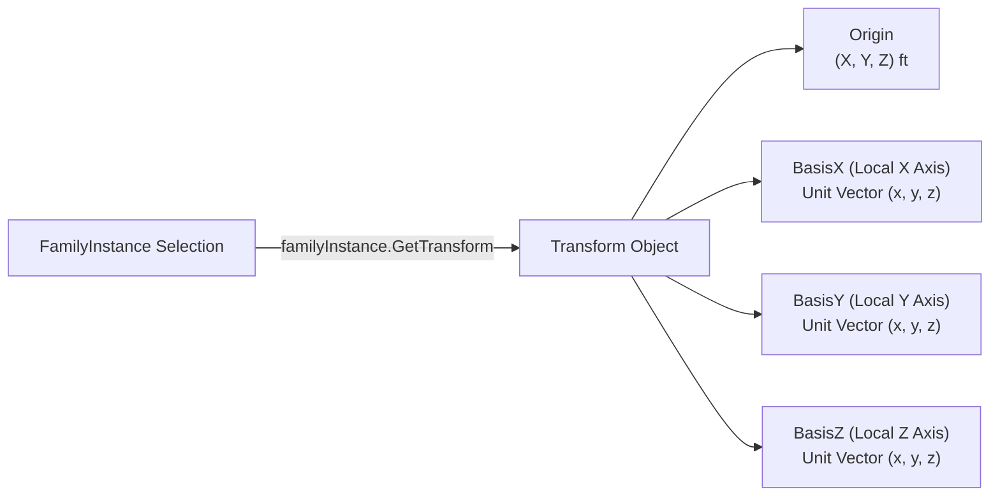

- **Execution Flow:**
  1. Prompts user to select an element via `UIDocument.Selection.PickObject(ObjectType.Element)`.
  2. Defensively casts selected `Element` to `FamilyInstance` (fails gracefully if element is not a family instance).
  3. Calls `familyInstance.GetTransform()`.
  4. Reads the four vector components: `transform.Origin`, `transform.BasisX`, `transform.BasisY`, `transform.BasisZ`.
  5. Displays all components formatted to 4 decimal places in a `TaskDialog`.
- **API Surface:**
  - `FamilyInstance.GetTransform() -> Transform`
  - `Transform.Origin -> XYZ`
  - `Transform.BasisX -> XYZ`, `Transform.BasisY -> XYZ`, `Transform.BasisZ -> XYZ`
- **Key Insight:** `Transform` establishes the local Cartesian coordinate system of an instance relative to the model world space.

---

### Command 02 — `LocationPointVsLocationCurveCommand`
*(File: `Commands/Fundamentals/LocationPointVsLocationCurveCommand.cs`)*

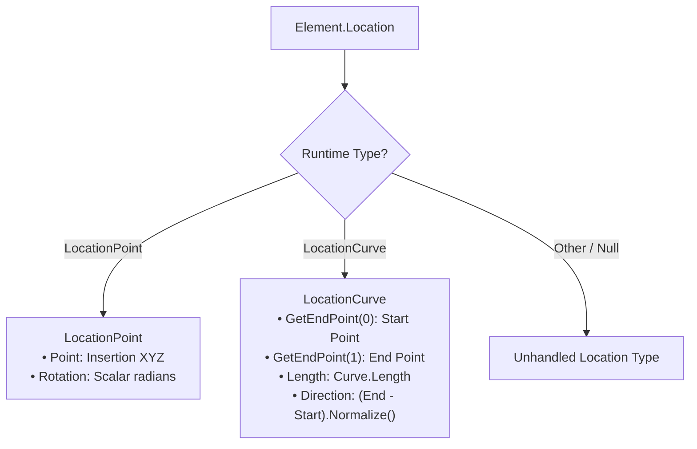

- **Execution Flow:**
  1. Selects an element and accesses `element.Location`.
  2. Performs polymorphic type checks (`as LocationPoint` vs `as LocationCurve`).
  3. **LocationPoint Branch:** Extracts `Point` and `Rotation` (converted from radians to degrees via $\text{deg} = \text{rad} \times \frac{180}{\pi}$).
  4. **LocationCurve Branch:** Extracts `Curve`, `GetEndPoint(0)`, `GetEndPoint(1)`, `Curve.Length`, and calculates derived direction $\vec{D} = \text{Normalize}(\mathbf{P}_1 - \mathbf{P}_0)$.
  5. Handles other or null location types safely.
- **Mathematical Formula:**
  $$\vec{D} = \frac{\mathbf{P}_{\text{end}} - \mathbf{P}_{\text{start}}}{\|\mathbf{P}_{\text{end}} - \mathbf{P}_{\text{start}}\|}$$

---

### Command 03 — `LocationGeometryAnalysisCommand`
*(File: `Commands/Fundamentals/PointAndVectorMathematicsCommand.cs`)*

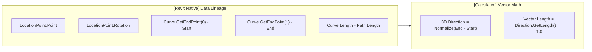

- **Core Concept — Explicit Data Lineage:**
  Commands must never mislead consumers by presenting computed numbers as native Revit API facts. This command tags every geometric output with its exact provenance:
  - `[Revit]` → Values stored directly in Revit's internal database record.
  - `[Calculated]` → Values derived through post-retrieval vector arithmetic.
- **Data Lineage Summary Matrix:**

| Geometric Property | `LocationPoint` Source | `LocationCurve` Source |
|---|---|---|
| **Start Point** | `N/A` | `[Revit]` (`Curve.GetEndPoint(0)`) |
| **End Point** | `N/A` | `[Revit]` (`Curve.GetEndPoint(1)`) |
| **Point** | `[Revit]` (`LocationPoint.Point`) | `N/A` |
| **Rotation** | `[Revit]` (`LocationPoint.Rotation`) | `Not directly available` |
| **3D Direction** | `Not directly represented` | `[Calculated]` (`(End - Start).Normalize()`) |
| **Actual Length** | `N/A` | `[Revit]` (`Curve.Length`) |

---

### Command 04 — `DerivedGeometryCommand`
*(File: `Commands/Fundamentals/DerivedGeometryCommand.cs`)*

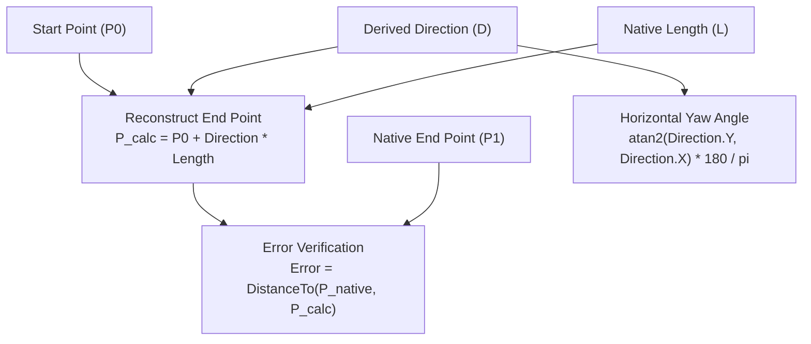

- **Mathematical Derivations:**
  1. **Direction Normalization:**
     $$\vec{V} = \mathbf{P}_1 - \mathbf{P}_0, \quad \hat{\mathbf{u}} = \frac{\vec{V}}{\|\vec{V}\|}$$
  2. **Horizontal Heading / Yaw ($\theta_{xy}$):**
     $$\theta_{xy} = \text{atan2}(\hat{u}_y, \hat{u}_x) \times \frac{180^\circ}{\pi}$$
  3. **End Point Reconstruction & Error Residual:**
     $$\mathbf{P}_{\text{reconstructed}} = \mathbf{P}_0 + \hat{\mathbf{u}} \times L$$
     $$\text{Residual Error} = \|\mathbf{P}_1 - \mathbf{P}_{\text{reconstructed}}\| \approx 0.00000000 \text{ ft}$$
- **LocationPoint Fallback:** If the selected element is a point-based `FamilyInstance`, the command derives direction from `Transform.BasisX.Normalize()` as the local heading.

---

### Command 06 — `TransformOfPointCommand`
*(File: `Commands/Fundamentals/TransformOfPointCommand.cs`)*

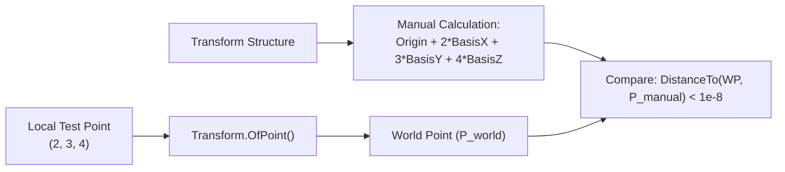

- **Mathematical Formula:**
  $$\mathbf{P}_{\text{world}} = \mathbf{T}.\text{OfPoint}(\mathbf{P}_{\text{local}}) = \mathbf{Origin} + X \cdot \mathbf{BasisX} + Y \cdot \mathbf{BasisY} + Z \cdot \mathbf{BasisZ}$$
- **Execution & Validation:**
  1. Evaluates a synthetic test local point: $\mathbf{P}_{\text{local}} = (2.0, 3.0, 4.0)$.
  2. Computes transformed point via `transform.OfPoint(localPoint)`.
  3. Manually calculates $\mathbf{P}_{\text{manual}} = \mathbf{O} + 2\mathbf{B}_x + 3\mathbf{B}_y + 4\mathbf{B}_z$.
  4. Validates $\|\mathbf{P}_{\text{world}} - \mathbf{P}_{\text{manual}}\| = 0.00000000$.
  5. Compares with actual `LocationPoint.Point` to demonstrate that `LocationPoint` represents insertion in world space, not local coordinates.

---

### Command 07 — `TransformOfVectorCommand`
*(File: `Commands/Fundamentals/TransformOfVectorCommand.cs`)*

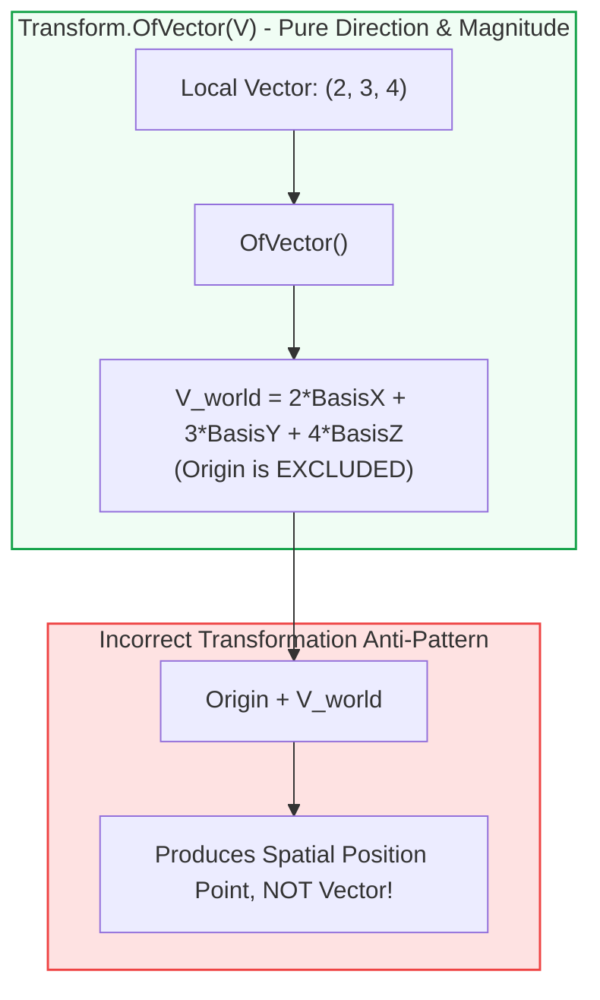

- **Mathematical Formula:**
  $$\vec{V}_{\text{world}} = \mathbf{T}.\text{OfVector}(\vec{V}_{\text{local}}) = X \cdot \mathbf{BasisX} + Y \cdot \mathbf{BasisY} + Z \cdot \mathbf{BasisZ}$$
- **Vector Invariant:** Vector transformation preserves vector magnitude:
  $$\|\vec{V}_{\text{world}}\| = \|\vec{V}_{\text{local}}\| = \sqrt{2^2 + 3^2 + 4^2} = \sqrt{29} \approx 5.385165$$
- **Intentional Anti-Pattern Proof:** The command demonstrates that computing $\mathbf{O} + \vec{V}_{\text{world}}$ shifts the vector into an arbitrary position coordinate, violating vector algebra.

---

### Command 08 — `PointVsVectorTransformationCommand`
*(File: `Commands/Fundamentals/PointVsVectorTransformationCommand.cs`)*

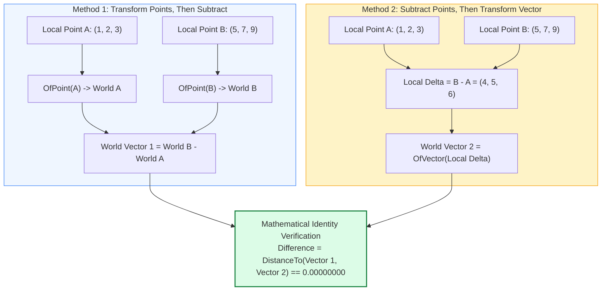

- **Mathematical Proof Verified at Runtime:**
  $$\text{Vector Difference} = \| (\mathbf{T}.\text{OfPoint}(B) - \mathbf{T}.\text{OfPoint}(A)) - \mathbf{T}.\text{OfVector}(B - A) \| = 0.00000000$$
- **Length & Direction Invariance:**
  - $\|\vec{V}_{\text{local}}\| = \|\vec{V}_{\text{world,1}}\| = \|\vec{V}_{\text{world,2}}\| = \sqrt{4^2 + 5^2 + 6^2} = \sqrt{77} \approx 8.774964$.
  - Normalized direction vectors $\hat{\mathbf{u}}_1 \equiv \hat{\mathbf{u}}_2$.

---

### Command 09 — `InverseTransformCommand`
*(File: `Commands/Fundamentals/InverseTransformCommand.cs`)*

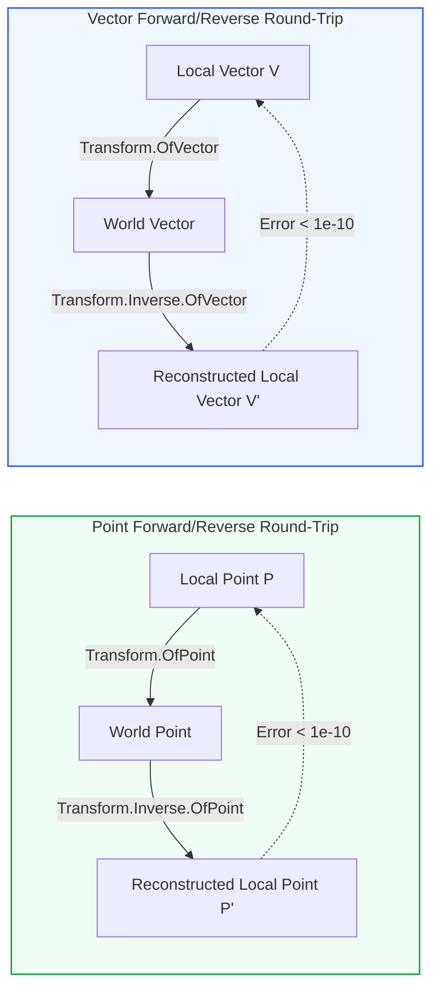

- **Mathematical Inversion Formulation:**
  $$\mathbf{T}^{-1} \cdot \mathbf{T} = \mathbf{I}$$
  $$\mathbf{P}'_{\text{local}} = \mathbf{T}^{-1}.\text{OfPoint}\big(\mathbf{T}.\text{OfPoint}(\mathbf{P}_{\text{local}})\big) = \mathbf{P}_{\text{local}}$$
  $$\vec{V}'_{\text{local}} = \mathbf{T}^{-1}.\text{OfVector}\big(\mathbf{T}.\text{OfVector}(\vec{V}_{\text{local}})\big) = \vec{V}_{\text{local}}$$
- **Validation Results:** Point residual error $\|\mathbf{P}' - \mathbf{P}\| < 10^{-10}$ ft and vector residual error $\|\vec{V}' - \vec{V}\| < 10^{-10}$ ft.

---

### Command 10 — `TransformNumericalExampleCommand`
*(File: `Commands/Fundamentals/TransformNumericalExampleCommand.cs`)*

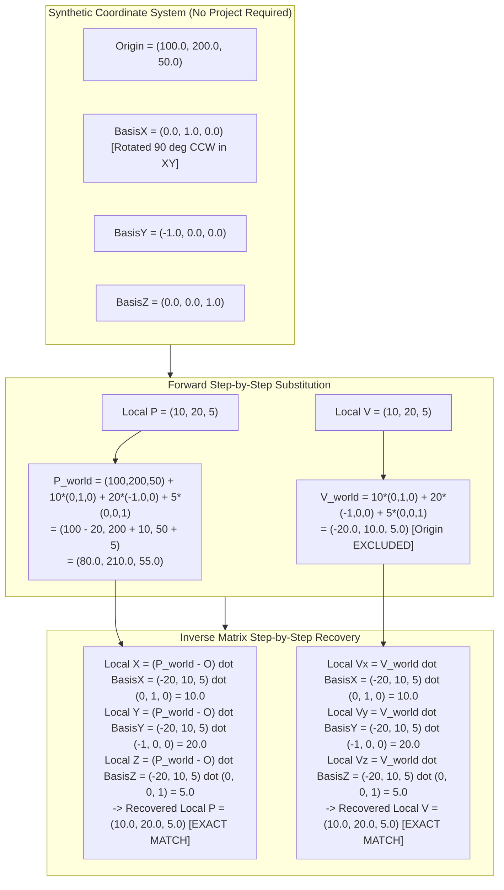

- **Core Concept:** 100% synthetic mathematical proof running without selecting any Revit elements. Demonstrates the forward and inverse transformation equations using clean integer coordinates.
- **Mental Model Summary Table:**

```
LOCAL POINT  ─── OfPoint() ───►  WORLD POINT  ─── Inverse.OfPoint() ───►  LOCAL POINT
LOCAL VECTOR ─── OfVector() ──►  WORLD VECTOR ─── Inverse.OfVector() ──►  LOCAL VECTOR
```

---

## 5. The Bridge — Parameter-Driven 3D Geometry

### Command 05 — `LocationPoint3DAnalysisCommand`
*(Physical location: `Commands/FamilyGeometry/LocationPoint3DAnalysisCommand.cs`)*

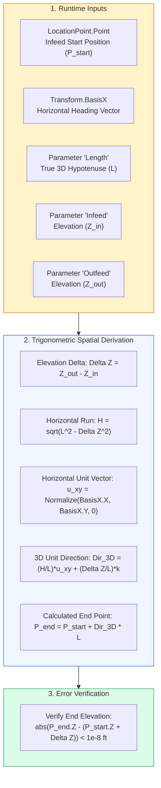

- **Engineering Context:**
  Many point-based MEP, conveyor, chute, or equipment families have only a `LocationPoint`. However, physically they represent sloped 3D runs defined by engineering parameters:
  - `Length` ($L$): True 3D member length (hypotenuse).
  - `Infeed` ($Z_{\text{in}}$): Start/infeed elevation.
  - `Outfeed` ($Z_{\text{out}}$): End/outfeed elevation.
- **Detailed Step-by-Step Mathematical Derivation:**

1. **Elevation Delta:**
   $$\Delta Z = Z_{\text{outfeed}} - Z_{\text{infeed}}$$

2. **Horizontal Projection (Pythagorean Theorem):**
   $$L^2 = H^2 + \Delta Z^2 \implies H = \sqrt{L^2 - \Delta Z^2}$$
   *(If $L^2 < \Delta Z^2$, the command rejects the geometry as physically impossible).*

3. **Horizontal Direction Normalization:**
   $$\vec{u}_{xy} = \text{Normalize}(\mathbf{B}_{x,x}, \mathbf{B}_{x,y}, 0)$$

4. **3D Direction Vector Assembly & Normalization:**
   $$\vec{D}_{3D} = \begin{bmatrix}
   u_{xy,x} \cdot \left(\dfrac{H}{L}\right) \\
   u_{xy,y} \cdot \left(\dfrac{H}{L}\right) \\
   \dfrac{\Delta Z}{L}
   \end{bmatrix}, \quad \|\vec{D}_{3D}\| = \sqrt{\left(\frac{H}{L}\right)^2 (u_x^2 + u_y^2) + \left(\frac{\Delta Z}{L}\right)^2} = \sqrt{\frac{H^2 + \Delta Z^2}{L^2}} = 1.0$$

5. **3D End Point Calculation & Elevation Verification:**
   $$\mathbf{P}_{\text{end}} = \mathbf{P}_{\text{start}} + \vec{D}_{3D} \times L$$
   $$\text{Elevation Error} = |\mathbf{P}_{\text{end},z} - (\mathbf{P}_{\text{start},z} + \Delta Z)| \approx 0.00000000 \text{ ft}$$

> [!WARNING]
> **Family Authoring Convention Dependency:**
> Command 05 depends on two family authoring conventions:
> 1. `LocationPoint.Point` represents the **Infeed Start**, not the centroid.
> 2. `Transform.BasisX` represents the **Longitudinal Heading**.
> If a family is authored with its insertion point at the center or with heading along $Y$, the calculations must be adapted accordingly.

---

## 6. Part B — Real-World Family Geometry (Deep-Dive Command Reference)

---

### Part B — Command 01 — `FamilyPlacementClassificationCommand`
*(File: `Commands/FamilyGeometry/FamilyPlacementClassificationCommand.cs`)*

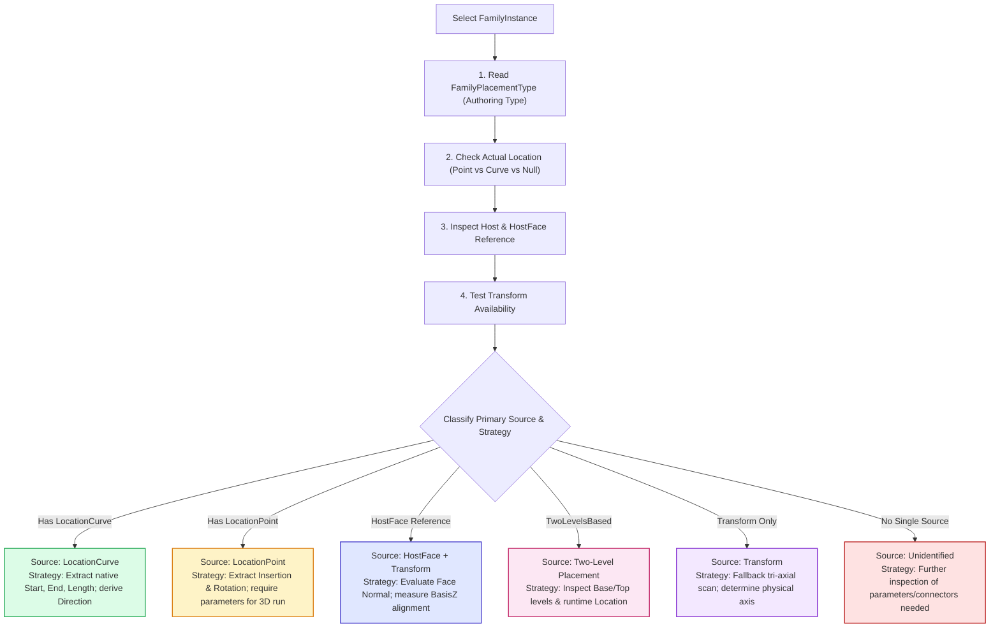

- **Execution Flow:**
  1. Inspects `Family.FamilyPlacementType`.
  2. Inspects `familyInstance.Location` (`LocationPoint` vs `LocationCurve`).
  3. Inspects `familyInstance.Host` and `familyInstance.HostFace`.
  4. Tests `familyInstance.GetTransform()`.
  5. Determines and reports the recommended geometric derivation strategy.

---

### Part B — Command 03 — `LocationCurveFamilyGeometryCommand`
*(File: `Commands/FamilyGeometry/LocationCurveFamilyGeometryCommand.cs`)*

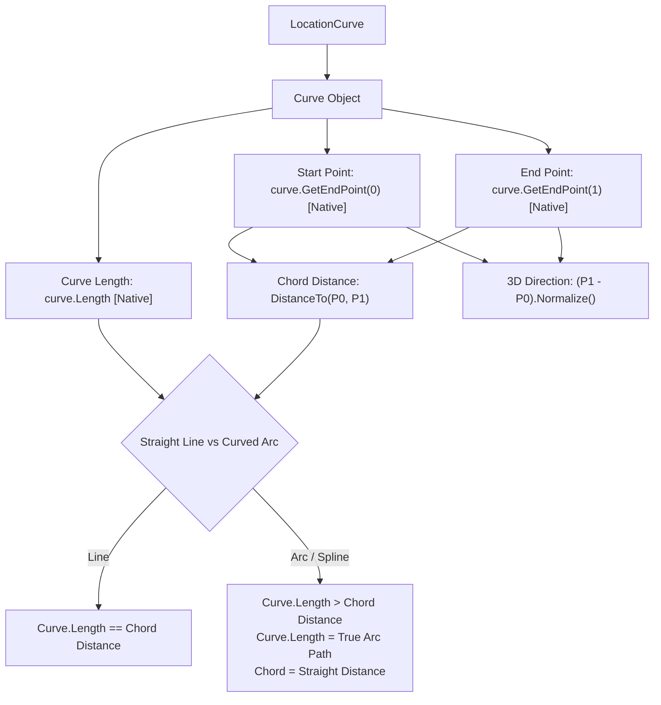

- **API Surface:** `LocationCurve.Curve`, `Curve.GetEndPoint(0/1)`, `Curve.Length`, `FamilyInstance.GetTransform()`.
- **Curve vs. Chord Distinction:**
  $$L_{\text{chord}} = \|\mathbf{P}_1 - \mathbf{P}_0\| \le L_{\text{curve}}$$
  - For a straight `Line`: $L_{\text{curve}} \approx L_{\text{chord}}$.
  - For an `Arc` or `NurbSpline`: $L_{\text{curve}} > L_{\text{chord}}$.
- **Undefined Rotation Principle:** `LocationCurve` provides no native scalar `Rotation` equivalent. The command explicitly refuses to invent a synthetic rotation angle from endpoints alone, directing orientation analysis to `Transform` basis vectors.

---

### Part B — Command 04 — `FaceBasedFamilyGeometryCommand`
*(File: `Commands/FamilyGeometry/FaceBasedFamilyGeometryCommand.cs`)*

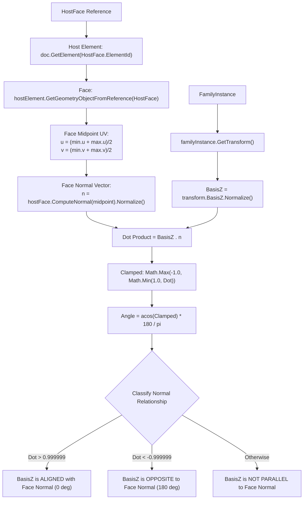

- **Execution Flow & UV Midpoint Evaluation:**
  1. Retrieves host face reference via `familyInstance.HostFace`.
  2. Resolves geometric `Face` using `hostElement.GetGeometryObjectFromReference(hostFaceReference)`.
  3. Computes UV bounding box midpoint:
     $$u_{\text{mid}} = \frac{u_{\min} + u_{\max}}{2}, \quad v_{\text{mid}} = \frac{v_{\min} + v_{\max}}{2}$$
  4. Evaluates normal vector at midpoint: $\hat{\mathbf{n}} = \text{Normalize}(\text{Face}.\text{ComputeNormal}(u_{\text{mid}}, v_{\text{mid}}))$.
  5. Computes dot product $\text{dot} = \mathbf{B}_z \cdot \hat{\mathbf{n}}$ and angular separation $\theta = \arccos(\text{clamp}(\text{dot}, -1.0, 1.0)) \times \frac{180^\circ}{\pi}$.
- **Main Geometric Values Classification:**
  - **Start Point / End Point / Length:** Reported as `"Not Universally Defined by Face Placement"`.
  - **Rotation / Direction:** Derived from `Transform.BasisX/Y/Z` relative to the face tangent plane.

---

### Part B — Command 05 — `TwoLevelFamilyGeometryCommand`
*(File: `Commands/FamilyGeometry/TwoLevelFamilyGeometryCommand.cs`)*

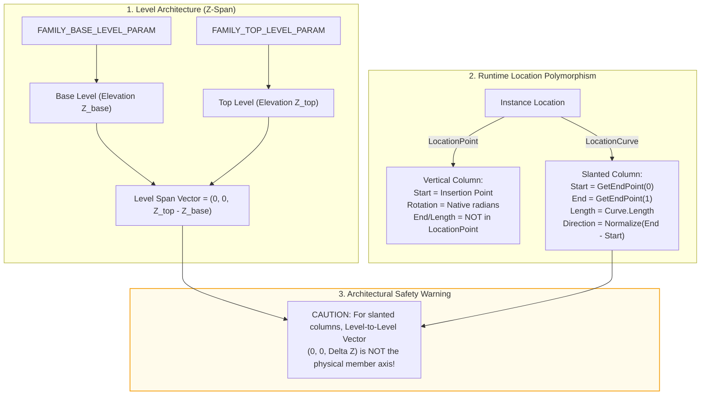

- **Execution Flow:**
  1. Validates `FamilyPlacementType == FamilyPlacementType.TwoLevelsBased`.
  2. Reads Base Level via `familyInstance.get_Parameter(BuiltInParameter.FAMILY_BASE_LEVEL_PARAM).AsElementId()`.
  3. Reads Top Level via `familyInstance.get_Parameter(BuiltInParameter.FAMILY_TOP_LEVEL_PARAM).AsElementId()`.
  4. Calculates level elevation span: $\Delta Z_{\text{levels}} = Z_{\text{top}} - Z_{\text{base}}$.
  5. Checks runtime `Location` (`LocationPoint` for standard vertical columns vs `LocationCurve` for slanted columns).
  6. Emits explicit warnings that $\Delta Z_{\text{levels}}$ does not represent physical member length for slanted columns.

---

### Part B — Command 06 — `TransformBasedFamilyGeometryCommand`
*(File: `Commands/FamilyGeometry/TransformBasedFamilyGeometryCommand.cs`)*

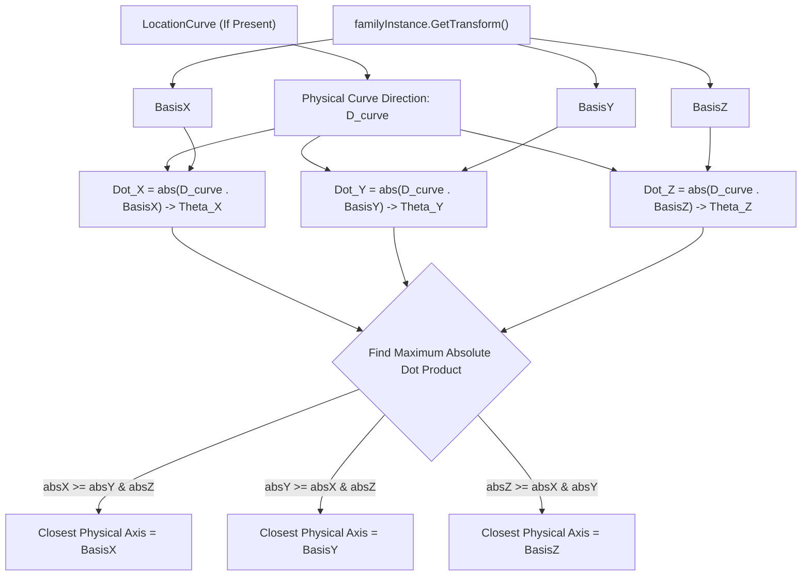

- **Engineering Problem:**
  `Transform.BasisX`, `BasisY`, `BasisZ` describe how an instance is oriented in 3D space, but the API does not declare which axis represents physical member length, width, or depth.
- **The Tri-Axial Dot Product Scanning Algorithm:**
  1. Computes physical curve direction $\vec{D}_{\text{curve}} = \text{Normalize}(\mathbf{P}_1 - \mathbf{P}_0)$ when `LocationCurve` exists.
  2. Computes projection of $\vec{D}_{\text{curve}}$ onto all three basis vectors:
     $$\text{dot}_X = \vec{D}_{\text{curve}} \cdot \mathbf{B}_x, \quad \theta_X = \arccos\big(\text{clamp}(|\text{dot}_X|, -1.0, 1.0)\big) \times \frac{180^\circ}{\pi}$$
     $$\text{dot}_Y = \vec{D}_{\text{curve}} \cdot \mathbf{B}_y, \quad \theta_Y = \arccos\big(\text{clamp}(|\text{dot}_Y|, -1.0, 1.0)\big) \times \frac{180^\circ}{\pi}$$
     $$\text{dot}_Z = \vec{D}_{\text{curve}} \cdot \mathbf{B}_z, \quad \theta_Z = \arccos\big(\text{clamp}(|\text{dot}_Z|, -1.0, 1.0)\big) \times \frac{180^\circ}{\pi}$$
  3. Identifies the physically aligned axis:
     $$\text{Aligned Axis} = \arg\max \big( |\text{dot}_X|, |\text{dot}_Y|, |\text{dot}_Z| \big)$$
- **Fallback when no curve exists:** Reports all three candidate basis axes and flags that semantic meaning must be resolved from family definition or parameters.

---

## 7. The Five Core Geometric Values Resolution Matrix

The complete architectural resolution rules across all Revit element placement types:

| Geometric Value | Native API Property | Derived Formulation | Parameter-Driven Formulation | Face / Point Fallback |
|---|---|---|---|---|
| **Length** | `LocationCurve.Curve.Length` | `N/A` | Reconstructed from parameter: $H = \sqrt{L^2 - \Delta Z^2}$ | `Not Universally Defined` |
| **Start Point** | `LocationPoint.Point`<br/>`Curve.GetEndPoint(0)` | `N/A` | Infeed parameter convention at `LocationPoint.Point` | `Not Universally Defined` (Face) |
| **End Point** | `Curve.GetEndPoint(1)` | $\mathbf{P}_{\text{start}} + \vec{D} \times L$ | $\mathbf{P}_{\text{start}} + \vec{D}_{3D} \times L$ | `Not Universally Defined` (Face/Point) |
| **3D Direction** | — | $\text{Normalize}(\mathbf{P}_1 - \mathbf{P}_0)$ | $\left(\frac{H}{L}\right)\hat{\mathbf{u}}_{xy} + \left(\frac{\Delta Z}{L}\right)\hat{\mathbf{k}}$ | Measured via $\arg\max_i \|\vec{D} \cdot \mathbf{B}_i\|$ |
| **Rotation** | `LocationPoint.Rotation` (rad) | 2D: $\text{atan2}(D_y, D_x) \times \frac{180}{\pi}$ | `LocationPoint.Rotation` | `Transform` basis vectors relative to host face |

---

## 8. Defensive Coding Patterns in the Codebase

### 8.1 Defensive Location Casting Pattern

```csharp
// Standard Defensive Pattern applied across all TransformModule commands
Location location = element.Location;
if (location == null)
{
    // Handle elements without spatial location records
    return Result.Failed;
}

LocationPoint locationPoint = location as LocationPoint;
LocationCurve locationCurve = location as LocationCurve;

if (locationPoint != null)
{
    XYZ insertionPoint = locationPoint.Point;
    double rotationRadians = locationPoint.Rotation;
    // Process point-based geometry...
}
else if (locationCurve != null)
{
    Curve curve = locationCurve.Curve;
    XYZ startPoint = curve.GetEndPoint(0);
    XYZ endPoint = curve.GetEndPoint(1);
    double pathLength = curve.Length;
    XYZ direction = (endPoint - startPoint).Normalize();
    // Process curve-based geometry...
}
else
{
    // Explicitly handle unhandled location types
}
```

### 8.2 Safe Vector Normalization & Angle Clamping Pattern

```csharp
// Guard against zero-length vectors
XYZ rawVector = endPoint - startPoint;
if (rawVector.GetLength() <= 1e-9)
{
    // Handle degenerate zero-length geometry
    return Result.Failed;
}
XYZ direction = rawVector.Normalize();

// Guard against floating-point drift in dot product before Acos
double dotProduct = direction.DotProduct(basisVector);
double clampedDot = Math.Max(-1.0, Math.Min(1.0, dotProduct));
double angleDegrees = Math.Acos(clampedDot) * 180.0 / Math.PI;
```

---

## 9. Architectural Gaps and Missing Commands

Codebase inspection reveals three architectural areas referenced in guidance but not yet implemented:

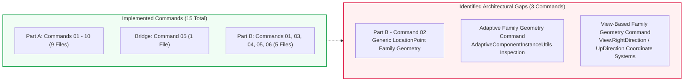

1. **Part B — Command 02 (`LocationPointFamilyGeometryCommand`):**
   - *Why Needed:* Direct counterpart to `LocationCurveFamilyGeometryCommand` (Part B - Cmd 03) for standard point-based families without custom conveyor parameters.
   - *Status:* **Missing from codebase.**
2. **Adaptive Component Geometry Command:**
   - *Why Needed:* Cited in `FamilyPlacementClassificationCommand` guidance switch (`FamilyPlacementType.Adaptive`).
   - *Required APIs:* `AdaptiveComponentInstanceUtils.GetInstancePlacementPointElementRefIds()`.
   - *Status:* **Missing from codebase.**
3. **View-Based Family Geometry Command:**
   - *Why Needed:* Cited in `FamilyPlacementClassificationCommand` guidance switch (`FamilyPlacementType.ViewBased`).
   - *Required APIs:* `View.RightDirection`, `View.UpDirection`, `View.ViewDirection`.
   - *Status:* **Missing from codebase.**

---

## 10. Codebase Audit Observations and Technical Inconsistencies

1. **Filename vs. Class Name Discrepancy:** `PointAndVectorMathematicsCommand.cs` defines the class `LocationGeometryAnalysisCommand` (Command 03).
2. **Global vs. Part B Numbering Overlap at "05":**
   - Global Sequence Command 05: `LocationPoint3DAnalysisCommand` (stored in `FamilyGeometry/`).
   - Part B Command 05: `TwoLevelFamilyGeometryCommand` (also stored in `FamilyGeometry/`).
3. **Tolerance Inconsistencies across Commands:**
   - Commands 05, Part B 03, and Part B 05 use ad-hoc inline tolerance `1e-9`.
   - Command Part B 06 defines a class constant `private const double Tolerance = 1e-6` (three orders of magnitude looser).
4. **Duplicate Clamping Implementations:**
   - `TransformBasedFamilyGeometryCommand` encapsulates a private static `Clamp(double value, double min, double max)` helper method.
   - `FaceBasedFamilyGeometryCommand` uses inline `Math.Max(-1.0, Math.Min(1.0, dot))`.
5. **Hardcoded Parameter Name Constants:** Command 05 uses literal string constants (`"Length"`, `"Infeed"`, `"Outfeed"`), making it specific to certain company family authoring standards.
6. **Absence of Vector Cross Product ($\vec{A} \times \vec{B}$):** While vector subtraction, normalization, and dot products are heavily utilized, 3D cross products are not currently implemented for coordinate frame reconstruction.

---

## 11. Transform Module Learning Progression Timeline

```mermaid
timeline
    title Transform Module Educational Progression
    section Phase 1 : Fundamentals
        Transform Structure : Command 01 - Origin, BasisX, BasisY, BasisZ
        Location Polymorphism : Commands 02 & 03 - LocationPoint vs LocationCurve
        Derivation & Heading : Command 04 - End = Start + Dir * Len, Atan2
    section Phase 2 : Affine Mechanics
        Point Transformation : Command 06 - P_world = Origin + xBx + yBy + zBz
        Vector Transformation : Command 07 - V_world = xBx + yBy + zBz (No Origin)
        Identity Invariance : Command 08 - OfPoint difference equals OfVector difference
        Inverse Round-Trip : Commands 09 & 10 - Model to Local Inversion
    section Phase 3 : Real-World Geometry
        Parameter Bridge : Command 05 - Sloped Conveyor 3D Trigonometry
        Architecture Router : Part B 01 - FamilyPlacementClassification
        Curve Geometry : Part B 03 - Native Path Length vs Straight Chord
        Face Geometry : Part B 04 - BasisZ vs Face Normal Dot Product
        Two-Level Geometry : Part B 05 - Level Span vs Slanted Member Axis
        Fallback Alignment : Part B 06 - Tri-Axial Dot Product Scanning
```
