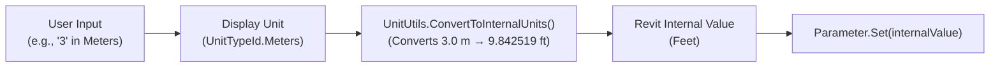
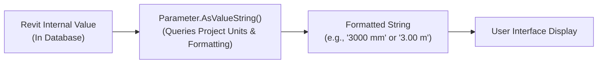
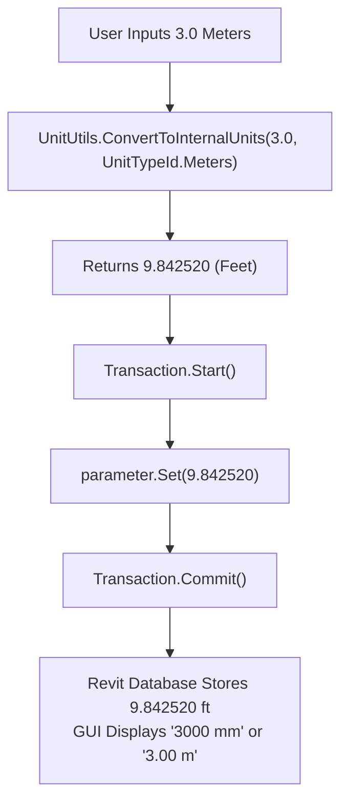
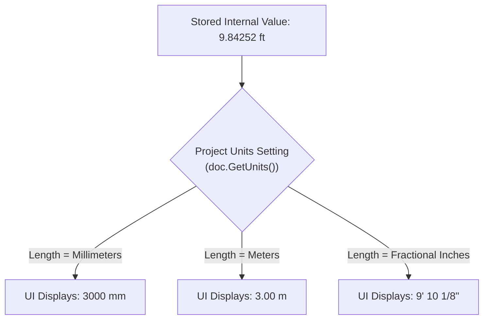
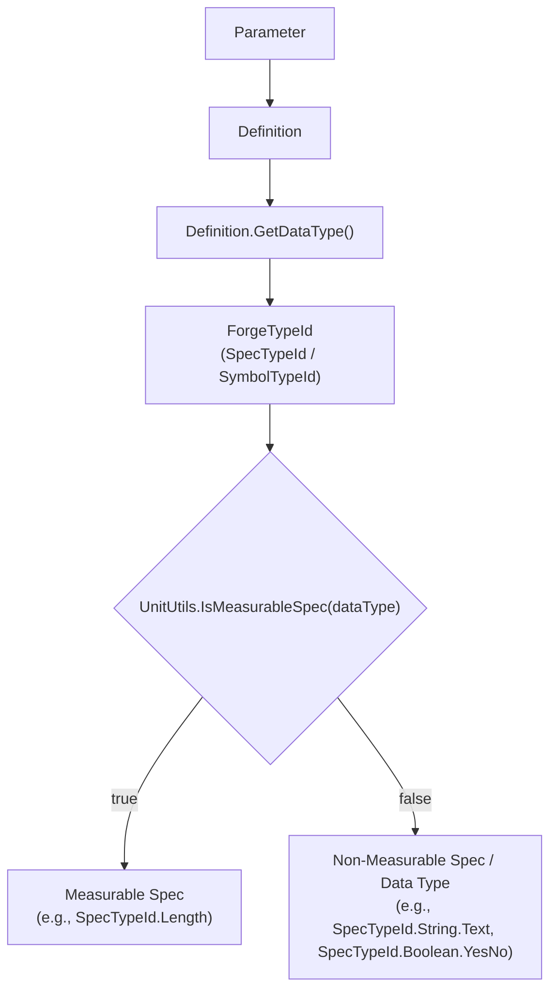
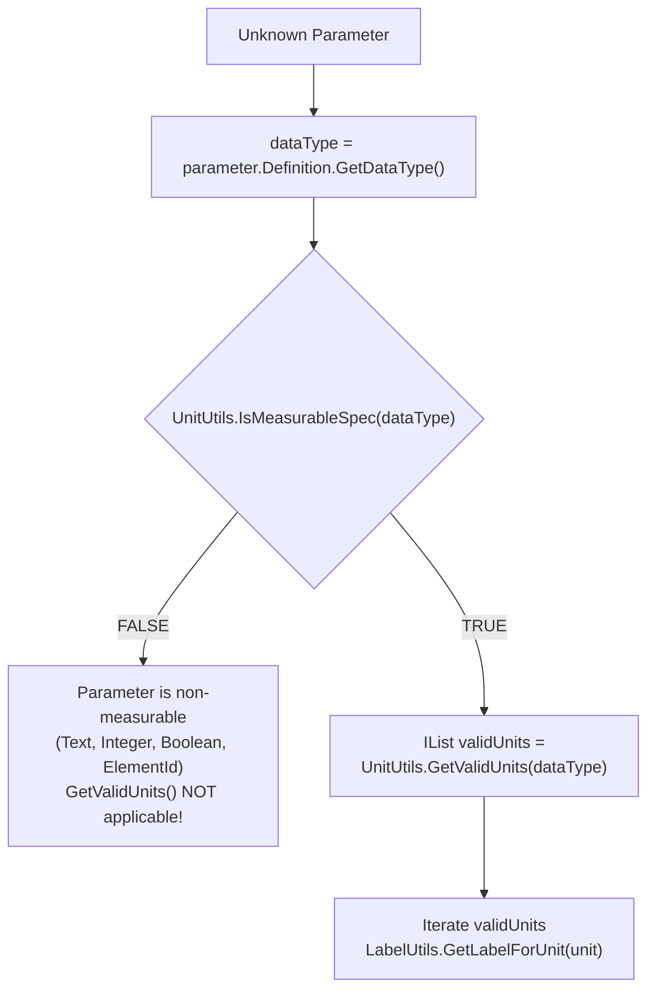
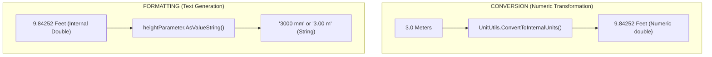
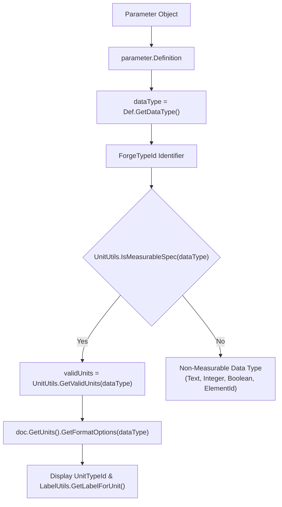
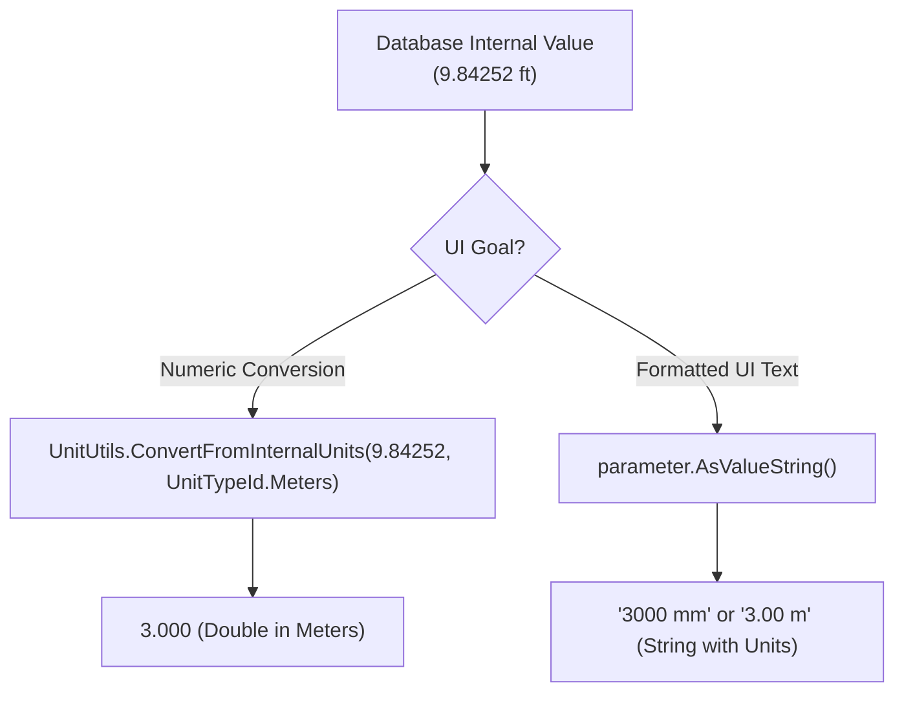
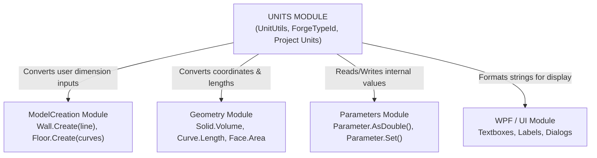

# Module 06 — Units

Welcome to the **Units Module** documentation for the Revit API. This guide explains how Revit manages units, conversions, project display formatting, parameter data types, and modern unit identifiers (`ForgeTypeId`).

Rather than serving as a basic code reference, this document teaches **how to think about units in the Revit API**, why specific conversion methods exist, how to avoid subtle data corruption bugs, and how units interact with UI, parameters, geometry, and model creation.

---

## 1. Module Overview

### The Core Problem
When writing add-ins or external applications for Revit, developers frequently encounter confusion between what a number **represents internally** and how it is **displayed to the user**.

Revit separates unit management into distinct layers:
1. **Internal Units**: Fixed unit representations used by the Revit database for all internal geometric calculations and parameter storage.
2. **Project Display Units**: Per-project settings configured by BIM managers that govern how numbers appear in the user interface (e.g., millimeters, meters, fractional inches).
3. **Unit Conversion**: Explicit mathematical transformation of values between user-facing units and internal units.
4. **Parameter Data Types / Specs**: The schema definition of *what* a parameter measures (e.g., Length, Area, Volume, Angle, Pressure).
5. **Formatting**: Textual rendering of internal numerical values into formatted strings complete with unit symbols, grouping digits, and rounding.

Understanding these concepts is essential whenever your add-in interacts with:
- **Parameters**: Reading from or writing values to `Parameter` objects.
- **Geometry**: Measuring lengths, bounding boxes, face areas, solid volumes, or placing coordinates.
- **Model Creation**: Creating walls, floors, doors, or family instances from user inputs.
- **WPF / UI**: Displaying parameter values in custom dialogs or taking numerical input from user text boxes.

### High-Level Data Flow Pipelines

#### Pipeline A: Writing User Input to Revit (User → Database)


#### Pipeline B: Reading Database Values for UI Display (Database → User)


#### Pipeline C: Direct Formatted Text Rendering (Database → UI Text)


---

## 2. Internal Units

Implemented in: [`InternalUnitsCommand.cs`](file:///f:/02-programming/06-%20Revit%20API/projects/RevitApiSamples/RevitApiSamples/Samples/Units/Commands/InternalUnitsCommand.cs)

### What Are Revit Internal Units?
Revit stores all physical quantities in a standardized set of **Internal Units** regardless of how the user has configured project units in the Revit GUI.

- **Length**: Feet ($\text{ft}$)
- **Area**: Square Feet ($\text{ft}^2$)
- **Volume**: Cubic Feet ($\text{ft}^3$)
- **Angle**: Radians ($\text{rad}$)

> [!IMPORTANT]
> The value returned by `Parameter.AsDouble()` is ALWAYS in Revit's internal units. It is NEVER in project display units (unless the project display unit happens to be feet).

### Concrete Example: The 3000 mm Wall
Suppose a user opens a project configured in Metric (Millimeters) and creates a Wall with an unconnected height of **3000 mm**.

1. The user sees **"3000 mm"** in the Properties Palette.
2. In the underlying database, Revit stores:
   $$\text{Internal Height} = 3000\text{ mm} \times \frac{1\text{ ft}}{304.8\text{ mm}} = 9.842519685\text{ ft}$$
3. Calling `heightParameter.AsDouble()` returns `9.842519685`.
4. If a developer assumes `AsDouble()` returns millimeters and passes `9.842519` to another calculation assuming it is `9.84 mm`, severe geometric errors will occur!

### Code from `InternalUnitsCommand.cs`

```csharp
// 1. Get Wall Height Parameter
Parameter heightParameter = wall.get_Parameter(BuiltInParameter.WALL_USER_HEIGHT_PARAM);

// 2. Read Internal Value (Always in Feet for Length)
double internalHeight = heightParameter.AsDouble(); // e.g., 9.842520 ft

// 3. Convert Internal Units → Meters
double heightMeters = UnitUtils.ConvertFromInternalUnits(internalHeight, UnitTypeId.Meters); // 3.000 m

// 4. Convert Internal Units → Millimeters
double heightMillimeters = UnitUtils.ConvertFromInternalUnits(internalHeight, UnitTypeId.Millimeters); // 3000.0 mm
```

---

## 3. Convert to Internal Units

Implemented in: [`ToInternalUnitsCommand.cs`](file:///f:/02-programming/06-%20Revit%20API/projects/RevitApiSamples/RevitApiSamples/Samples/Units/Commands/ToInternalUnitsCommand.cs)

### Writing Values to Revit Parameters
When taking a numerical value from a user, a UI control, or an external file (e.g., an Excel sheet specifying dimensions in meters or millimeters), you **must convert the value to internal units** before calling `Parameter.Set()`.



### WRONG vs. CORRECT Comparison

#### ❌ WRONG Approach: Passing Raw User Values Directly
```csharp
// WRONG: Assuming parameter.Set() takes meters directly!
// If the user wants a wall height of 3 meters, this sets the wall height to 3 FEET (0.9144 meters)!
double userValue = 3.0; // User meant 3 meters
heightParameter.Set(userValue); // Result in Revit: Wall is only 914.4 mm tall!
```

#### ✅ CORRECT Approach: Using `UnitUtils.ConvertToInternalUnits`
```csharp
// CORRECT: Convert user units (Meters) to Revit Internal Units (Feet) first
double userValueMeters = 3.0;

double internalValue = UnitUtils.ConvertToInternalUnits(userValueMeters, UnitTypeId.Meters);

using (Transaction transaction = new Transaction(doc, "Set Wall Height"))
{
    transaction.Start();
    heightParameter.Set(internalValue); // Passes 9.842520 ft
    transaction.Commit();
}
// Result in Revit: Wall height is correctly set to 3.000 meters (3000 mm)!
```

---

## 4. Project Units

Implemented in: [`ProjectUnitsCommand.cs`](file:///f:/02-programming/06-%20Revit%20API/projects/RevitApiSamples/RevitApiSamples/Samples/Units/Commands/ProjectUnitsCommand.cs)

### Internal Units vs. Project Units

> [!KEY]
> **Internal Units $\neq$ Project Units**
> - **Internal Units**: Fixed API system units (Feet, Sq Ft, Cu Ft, Radians). Immutable.
> - **Project Units**: Presentation settings stored in the `Document` object (`doc.GetUnits()`). They dictate how values are rendered in schedules, tags, and the Properties palette. Changing project units does **NOT** alter stored database values.

### How Display Units Affect Presentation

Imagine a wall height parameter with internal stored value $9.84252\text{ ft}$:



### Inspected Objects & Code Workflow

```csharp
// 1. Get Project Units container from Document
Units units = doc.GetUnits();

// 2. Get FormatOptions for Length spec
FormatOptions lengthFormat = units.GetFormatOptions(SpecTypeId.Length);

// 3. Obtain ForgeTypeId identifier for display unit
ForgeTypeId lengthUnitTypeId = lengthFormat.GetUnitTypeId(); // e.g., UnitTypeId.Millimeters

// 4. Get human-readable unit string (e.g., "Millimeters")
string unitLabel = LabelUtils.GetLabelForUnit(lengthUnitTypeId);
```

### Concept Comparison Table

| Concept | Meaning | Internal Example | Project Display Example |
| :--- | :--- | :--- | :--- |
| **Internal Unit** | How Revit stores the numerical value in the database | `9.84252` (Feet) | `9.84252` (Feet) |
| **Project Unit** | How the active project formats values for users | `UnitTypeId.Feet` | `UnitTypeId.Millimeters` |
| **Conversion** | Mathematical transformation between unit scales | `m` $\rightarrow$ `ft` ($3.0 \times 3.28084$) | `mm` $\rightarrow$ `m` ($3000 / 1000$) |
| **Formatting** | Textual string generation with units & rounding | `"9.842520"` | `"3000 mm"` or `"3.00 m"` |

---

## 5. Parameter Data Type & ForgeTypeId

Implemented in: [`ParameterDataTypeAndValidUnitsCommand.cs`](file:///f:/02-programming/06-%20Revit%20API/projects/RevitApiSamples/RevitApiSamples/Samples/Units/Commands/ParameterDataTypeAndValidUnitsCommand.cs)

### Parameter Schema Architecture
In Revit 2021+, the Revit API replaced legacy enums (`ParameterType`, `DisplayUnitType`, `UnitType`) with extensible **`ForgeTypeId`** identifiers.



### What is `ForgeTypeId`?
`ForgeTypeId` is **NOT just a unit ID**. It is a unified, extensible schema identifier mechanism used across Autodesk cloud APIs and Revit API to represent:
- **Specs (Disciplines / Measurement categories)**: e.g., `SpecTypeId.Length`, `SpecTypeId.Area`, `SpecTypeId.MassDensity`
- **Units**: e.g., `UnitTypeId.Feet`, `UnitTypeId.Meters`, `UnitTypeId.Millimeters`, `UnitTypeId.Pascals`
- **Symbol / Format Types**: Unit symbols, digit grouping options, rounding options

### Spec vs. Unit: The Critical Distinction
- **Spec (WHAT is measured)**: Defines the physical quantity or data schema (e.g., Length, Force, Electrical Current).
- **Unit (HOW it is expressed)**: Defines the scale of measurement for that spec (e.g., Feet vs. Meters vs. Inches).

```
Length (Spec)
  ├── Feet (Unit)
  ├── Meters (Unit)
  ├── Millimeters (Unit)
  └── Inches (Unit)

Area (Spec)
  ├── Square Feet (Unit)
  ├── Square Meters (Unit)
  └── Acres (Unit)
```

---

## 6. Get Valid Units

Implemented in: [`ParameterDataTypeAndValidUnitsCommand.cs`](file:///f:/02-programming/06-%20Revit%20API/projects/RevitApiSamples/RevitApiSamples/Samples/Units/Commands/ParameterDataTypeAndValidUnitsCommand.cs)

### Discovering Compatible Units for a Parameter

When building generic tools or UI pickers, you cannot assume every parameter supports length or area units. You must first test if the parameter's data type is a **measurable spec**, and then retrieve its valid units.



### Practical Data Type Examples

| Parameter Name | Data Type (`ForgeTypeId`) | `IsMeasurableSpec` | `GetValidUnits()` Example Output |
| :--- | :--- | :--- | :--- |
| **Comments / Mark** | `SpecTypeId.String.Text` | `false` | *N/A (Throws exception if called)* |
| **Count / Number** | `SpecTypeId.Int.Integer` | `false` | *N/A* |
| **Structural** | `SpecTypeId.Boolean.YesNo` | `false` | *N/A* |
| **Unconnected Height** | `SpecTypeId.Length` | `true` | `Feet`, `Meters`, `Millimeters`, `Inches`, `Centimeters` |
| **Area** | `SpecTypeId.Area` | `true` | `SquareFeet`, `SquareMeters`, `Acres`, `Hectares` |

### Important Distinction: Physical Meaning vs. Measurable Spec
> [!WARNING]
> Having an engineering meaning does **NOT** make a parameter a measurable spec.
> For example:
> - `Structural` (Boolean: Yes/No) has strong structural engineering meaning, but it has no units.
> - `Base Constraint` (ElementId) specifies a physical level, but has no units.
> 
> **Definition**: A **Measurable Spec** represents a physical quantity that possesses a unit of measurement (such as length, mass, angle, temperature, or pressure).

### Code Snippet from `ParameterDataTypeAndValidUnitsCommand.cs`

```csharp
ForgeTypeId dataType = parameter.Definition.GetDataType();

if (UnitUtils.IsMeasurableSpec(dataType))
{
    IList<ForgeTypeId> validUnits = UnitUtils.GetValidUnits(dataType);
    
    foreach (ForgeTypeId unit in validUnits)
    {
        string unitName = LabelUtils.GetLabelForUnit(unit);
        string typeIdString = unit.TypeId; // e.g., "autodesk.unit.unit:millimeters-1.0.0"
    }
}
else
{
    // Parameter is Text, Integer, Yes/No, ElementId, etc.
}
```

---

## 7. Formatting vs. Conversion

Implemented in: [`FormatParameterValueCommand.cs`](file:///f:/02-programming/06-%20Revit%20API/projects/RevitApiSamples/RevitApiSamples/Samples/Units/Commands/FormatParameterValueCommand.cs)

### The Fundamental Difference

Developers often confuse **Unit Conversion** with **Text Formatting**.



- **Conversion**: Changes the underlying **numerical value** and scale so it can be stored or calculated with.
- **Formatting**: Generates a **user-facing string** based on project display units and formatting rules without changing the stored value.

### Method Comparison: `AsDouble()` vs. `AsValueString()`

| Method | Return Type | Purpose | Unit Handling | Typical Use Case |
| :--- | :--- | :--- | :--- | :--- |
| **`AsDouble()`** | `double` | Returns raw internal numeric value | Internal Units (Feet, Sq Ft, Radians) | Math calculations, geometry creation, export algorithms |
| **`AsValueString()`** | `string` | Returns formatted display string | Uses Project Units & `FormatOptions` | UI popups, WPF dialog labels, report generation |

### Why `parameter.AsDouble()` is Dangerous if Misunderstood
Executing `double value = parameter.AsDouble();` returns a double like `9.842520`. 
- It does **NOT** mean "the value is 9.84 meters".
- It means "give me the raw numerical value in Revit's internal database unit (feet)".

```csharp
// Demonstration from FormatParameterValueCommand.cs
double internalValue = heightParameter.AsDouble(); // 9.842520 ft
string formattedValue = heightParameter.AsValueString(); // "3000 mm" (based on project units)
```

---

## 8. AsDouble vs AsValueString vs AsString

A common point of failure for beginners is calling the wrong `As...()` method on a `Parameter`.

### Method Comparison Matrix

```mermaid
decisionTree
    Param["Parameter Value Request"] --> StorageType{"What is the Parameter's StorageType?"}
    StorageType -- "StorageType.Double" --> Need{"What is your goal?"}
    Need -- "Math / DB Operation" --> AsDouble["AsDouble()\nReturns internal double (e.g. 9.8425)"]
    Need -- "Display to User" --> AsValueString["AsValueString()\nReturns formatted string (e.g. '3000 mm')"]
    
    StorageType -- "StorageType.String" --> AsString["AsString()\nReturns raw text (e.g. 'Comments text')"]
    StorageType -- "StorageType.Integer" --> AsInt["AsInteger()\nReturns raw int / ElementId / Enum"]
```

| Method | Target StorageType | Output Example | Behavior on Measurable Length Parameter |
| :--- | :--- | :--- | :--- |
| **`AsDouble()`** | `StorageType.Double` | `9.842519` | Returns internal numeric value (Feet). |
| **`AsValueString()`** | `StorageType.Double` / `Integer` | `"3000 mm"` | Evaluates project units & returns formatted text string. |
| **`AsString()`** | `StorageType.String` | `"Wall-Type-A"` | Returns `null` on numeric parameters! (Only works on text params). |

### Decision Guide Table

| I Need To... | Correct Method | Notes |
| :--- | :--- | :--- |
| Perform geometric math or calculations | `AsDouble()` | Value is in internal units (Feet). |
| Display a length, area, or angle to a user | `AsValueString()` | Includes project unit symbols and rounding. |
| Read text from a Comments or Mark parameter | `AsString()` | Returns string stored in parameter. |
| Write a converted metric value to Revit | `Set(internalValue)` | Use `ConvertToInternalUnits()` first. |

---

## 9. Complete Units Pipeline Diagrams

### Pipeline 1: Parameter Data Type & Unit Discovery Scheme



### Pipeline 2: User Input → Internal Value → Parameter


### Pipeline 3: Internal Value → UI Presentation



---

## 10. Real-World Decision Guide: "What Should I Use?"

Use this reference tree when writing Revit add-in code:

1. **"I need to calculate the distance between two walls or elements."**
   $\rightarrow$ Use `AsDouble()`. Coordinates and points (`XYZ`) are natively in feet.
2. **"I need to display a length parameter in a WPF text box for editing."**
   $\rightarrow$ Convert with `UnitUtils.ConvertFromInternalUnits(param.AsDouble(), displayUnit)` or display `param.AsValueString()`.
3. **"The user entered '500' in a WPF text box expecting millimeters. I need to save it."**
   $\rightarrow$ Use `double internalVal = UnitUtils.ConvertToInternalUnits(500.0, UnitTypeId.Millimeters); param.Set(internalVal);`.
4. **"I want to check what unit system the active project uses for Area."**
   $\rightarrow$ Use `doc.GetUnits().GetFormatOptions(SpecTypeId.Area).GetUnitTypeId()`.
5. **"I want to know if a parameter represents Length, Area, or Volume."**
   $\rightarrow$ Check `if (param.Definition.GetDataType() == SpecTypeId.Length)`.
6. **"I want to populate a ComboBox with all units valid for a parameter."**
   $\rightarrow$ Call `UnitUtils.GetValidUnits(param.Definition.GetDataType())` and format labels using `LabelUtils.GetLabelForUnit(unitTypeId)`.

---

## 11. Common Mistakes & Pitfalls

### Mistake 1: Assuming `AsDouble()` returns meters or project units
```csharp
// ❌ WRONG: Assuming AsDouble() returns meters because the project is in Metric
double height = wallParam.AsDouble(); 
double totalVolume = height * areaInMeters; // BUG: Multiplying feet by meters!

// ✅ CORRECT: Convert from internal units first
double heightMeters = UnitUtils.ConvertFromInternalUnits(wallParam.AsDouble(), UnitTypeId.Meters);
double totalVolume = heightMeters * areaInMeters;
```

### Mistake 2: Passing user metric values directly to `Parameter.Set()`
```csharp
// ❌ WRONG: Passing 3000 (mm) directly
param.Set(3000.0); // Sets wall height to 3000 FEET (914.4 meters)!

// ✅ CORRECT: Convert to internal units first
double internalVal = UnitUtils.ConvertToInternalUnits(3000.0, UnitTypeId.Millimeters);
param.Set(internalVal); // Sets wall height to 9.84252 feet (3000 mm)
```

### Mistake 3: Confusing Internal Units with Project Display Units
```csharp
// ❌ WRONG: Expecting doc.GetUnits() to change internal database storage
// Project units only affect display formatting, not internal storage.
```

### Mistake 4: Calling `AsString()` on numeric parameters
```csharp
// ❌ WRONG: Calling AsString() on a Length parameter
string val = lengthParam.AsString(); // Returns NULL!

// ✅ CORRECT: Use AsValueString() for numeric parameter text formatting
string val = lengthParam.AsValueString(); // Returns "3000 mm"
```

### Mistake 5: Treating `ForgeTypeId` as only a Unit identifier
```csharp
// ❌ WRONG: Assuming ForgeTypeId is only for units.
// ✅ CORRECT: ForgeTypeId represents Specs (SpecTypeId.Length), Units (UnitTypeId.Meters), and Symbol types.
```

### Mistake 6: Assuming all engineering parameters are measurable specs
```csharp
// ❌ WRONG: Calling UnitUtils.GetValidUnits() on a Structural (Yes/No) parameter
IList<ForgeTypeId> units = UnitUtils.GetValidUnits(structParam.Definition.GetDataType()); // Throws ArgumentException!

// ✅ CORRECT: Check IsMeasurableSpec first
if (UnitUtils.IsMeasurableSpec(param.Definition.GetDataType()))
{
    IList<ForgeTypeId> units = UnitUtils.GetValidUnits(param.Definition.GetDataType());
}
```

### Mistake 7: Hardcoding conversion factors manually
```csharp
// ❌ WRONG: Hardcoding magic numbers
double feet = meters * 3.28084; // Vulnerable to precision errors and hard to maintain

// ✅ CORRECT: Use UnitUtils API
double feet = UnitUtils.ConvertToInternalUnits(meters, UnitTypeId.Meters);
```

### Mistake 8: Confusing Conversion with Formatting
```csharp
// Conversion changes the numerical double. Formatting generates a display string.
```

---

## 12. Connections to Other Modules



- **Parameters Module**: Parameters store values in internal units. Every read (`AsDouble()`) or write (`Set()`) requires units awareness.
- **Geometry Module**: All geometric points (`XYZ`), curve lengths, surface areas, and solid volumes retrieved from `get_Geometry()` are strictly in Revit Internal Units ($\text{ft}, \text{ft}^2, \text{ft}^3$).
- **ModelCreation Module**: Creating elements from user-provided dimensions (e.g. wall heights or floor boundary offsets) requires converting user units to internal feet before passing them to `Wall.Create()` or `Floor.Create()`.
- **UI / WPF Module**: User entry fields accept metric or imperial text; add-ins convert inputs to internal units before execution, and convert results back for UI labels.

---

## 13. Learning Summary & Mental Model

Keep this concise mental model in mind when developing for Revit:

- **Internal Value**: Raw numerical representation stored in Revit's database (Feet, Sq Ft, Radians).
- **Spec**: *What* is being measured (Length, Area, Angle, Mass Density).
- **Unit**: *How* the quantity is expressed (Meters, Feet, Millimeters).
- **Project Units**: Per-document settings governing how values are formatted in the GUI.
- **Conversion**: Modifying the numerical scale between units (`UnitUtils.ConvertToInternalUnits`).
- **Formatting**: Converting a numerical internal value into a user-facing string (`Parameter.AsValueString()`).
- **`ForgeTypeId`**: Autodesk's modern, extensible schema identifier for Specs, Units, and Symbol types.

---

## 14. Code References in Repository

| Concept | Sample Command File |
| :--- | :--- |
| **Internal Units & `ConvertFromInternalUnits`** | [`InternalUnitsCommand.cs`](file:///f:/02-programming/06-%20Revit%20API/projects/RevitApiSamples/RevitApiSamples/Samples/Units/Commands/InternalUnitsCommand.cs) |
| **`ConvertToInternalUnits` & `Parameter.Set`** | [`ToInternalUnitsCommand.cs`](file:///f:/02-programming/06-%20Revit%20API/projects/RevitApiSamples/RevitApiSamples/Samples/Units/Commands/ToInternalUnitsCommand.cs) |
| **`doc.GetUnits()` & `FormatOptions`** | [`ProjectUnitsCommand.cs`](file:///f:/02-programming/06-%20Revit%20API/projects/RevitApiSamples/RevitApiSamples/Samples/Units/Commands/ProjectUnitsCommand.cs) |
| **`ForgeTypeId`, `IsMeasurableSpec`, `GetValidUnits`** | [`ParameterDataTypeAndValidUnitsCommand.cs`](file:///f:/02-programming/06-%20Revit%20API/projects/RevitApiSamples/RevitApiSamples/Samples/Units/Commands/ParameterDataTypeAndValidUnitsCommand.cs) |
| **Formatting & `AsValueString()` vs `AsDouble()`** | [`FormatParameterValueCommand.cs`](file:///f:/02-programming/06-%20Revit%20API/projects/RevitApiSamples/RevitApiSamples/Samples/Units/Commands/FormatParameterValueCommand.cs) |
