# Module 07 — Views

Welcome to the **Views Module** educational documentation. In Autodesk Revit, the building model is stored as a single, unified database of elements in 3D space. However, human users and BIM automated workflows interact with the building through **Views**.

This guide is designed to teach you **the Revit API mental model behind Views**: how views exist in the database, how to access and query them, how to inspect their graphic and project properties, and how to properly distinguish normal working views from **View Templates**.

---

## 1. Module Purpose & Core Mental Model

### What is a View in the Revit API?

To understand Views in the Revit API, you must understand the fundamental architecture of a Revit project:

```
Revit Document (Database)
       │
       ▼
   View (Projection & Filter)
       │
       ▼
View-Specific Representation of the Model
```

A **View** is not just a graphical window on the screen; it is a **database element** that defines:
1. **Geometric Projection**: How 3D space is projected (e.g., 2D Plan horizontal cut, 2D Section vertical slice, 3D Isometric / Perspective).
2. **Visibility Rules**: Which elements are visible, hidden, or graphically overridden.
3. **Detail & Scale Settings**: The level of detail (`Coarse`, `Medium`, `Fine`) and annotation scale (e.g., `1:100`).
4. **Coordinate Reference**: The associated level, bounding cut planes, and camera orientation.

### A View is a Revit Database Element

In the Revit API class hierarchy, `Autodesk.Revit.DB.View` inherits directly from `Autodesk.Revit.DB.Element`:

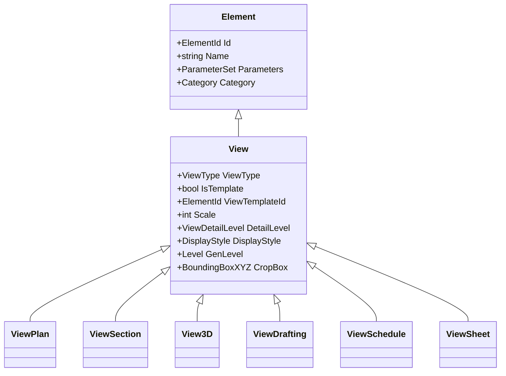

Because a `View` is an `Element`:
- It has an **`Id`** (`ElementId`) uniquely identifying it in the project.
- It has a **`Name`** (`string`) displayed in the Project Browser.
- It has standard **`Parameters`** (e.g., `VIEW_NAME`, `VIEW_SCALE`, `VIEW_DISCIPLINE`).
- It can be collected using **`FilteredElementCollector`**.
- It can be modified inside a Revit `Transaction`.

```
Element
   │
   └── View
         ├── Id (ElementId)
         ├── Name (string)
         ├── Parameters (ParameterSet)
         └── View-Specific Properties
               ├── ViewType
               ├── IsTemplate
               ├── ViewTemplateId
               ├── Scale
               ├── DetailLevel
               ├── DisplayStyle
               └── GenLevel
```

### Why Understanding Views is Critical for Automation

1. **Targeting Operations**: Many modeling actions (such as placing detail components, dimensioning, creating text notes, or collecting visible elements) require a target `View`.
2. **Batch Drawing Production**: Automated drawing generation requires filtering views, verifying their scale and detail levels, and applying view templates.
3. **View-Scoped Data Extraction**: Using `FilteredElementCollector(doc, viewId)` allows you to query only what is visible in a specific view rather than processing the entire project database.
4. **QA/QC Validation**: Automating compliance checks requires verifying that all Floor Plans have the correct scale, detail level, and assigned View Templates.

---

## 2. Current Sample Index

The following table lists the **5 educational Commands** currently implemented in the Views Module (`Samples/Views/Commands/`):

| # | Command File | Main Concept | Important APIs | What the Learner Should Understand |
| :-: | :--- | :--- | :--- | :--- |
| **01** | [`GetActiveViewCommand.cs`](file:///f:/02-programming/06-%20Revit%20API/projects/RevitApiSamples/RevitApiSamples/Samples/Views/Commands/GetActiveViewCommand.cs) | Active View Access & Inspection | `doc.ActiveView`, `View.Scale`, `View.DetailLevel`, `View.DisplayStyle` | How to retrieve the view currently open in the Revit UI and inspect its primary state. |
| **02** | [`ViewTypesCommand.cs`](file:///f:/02-programming/06-%20Revit%20API/projects/RevitApiSamples/RevitApiSamples/Samples/Views/Commands/ViewTypesCommand.cs) | View Classification vs C# Types | `view.ViewType`, `view.GetType().Name`, `Autodesk.Revit.DB.ViewType` | The difference between Revit's domain classification (`ViewType`) and C# runtime classes (`Type`). |
| **03** | [`CollectViewsCommand.cs`](file:///f:/02-programming/06-%20Revit%20API/projects/RevitApiSamples/RevitApiSamples/Samples/Views/Commands/CollectViewsCommand.cs) | Document-Wide View Collection | `FilteredElementCollector(doc).OfClass(typeof(View))` | Why Views can be collected as Elements, and why the broad collection contains both normal views and view templates. |
| **04** | [`CollectViewsByTypeCommand.cs`](file:///f:/02-programming/06-%20Revit%20API/projects/RevitApiSamples/RevitApiSamples/Samples/Views/Commands/CollectViewsByTypeCommand.cs) | Specific & Usable View Filtering | `view.ViewType == ViewType.FloorPlan`, `!view.IsTemplate` | How to filter for usable project views of a specific kind while excluding View Templates. |
| **05** | [`GetViewPropertiesCommand.cs`](file:///f:/02-programming/06-%20Revit%20API/projects/RevitApiSamples/RevitApiSamples/Samples/Views/Commands/GetViewPropertiesCommand.cs) | In-Depth View Property Inspection | `view.ViewTemplateId`, `view.GenLevel`, `doc.GetElement(...)` | How to inspect common properties, identify assigned view templates, and safely query associated levels. |

---

## 3. Command 01 — Active View

**File:** [`GetActiveViewCommand.cs`](file:///f:/02-programming/06-%20Revit%20API/projects/RevitApiSamples/RevitApiSamples/Samples/Views/Commands/GetActiveViewCommand.cs)

### Workflow

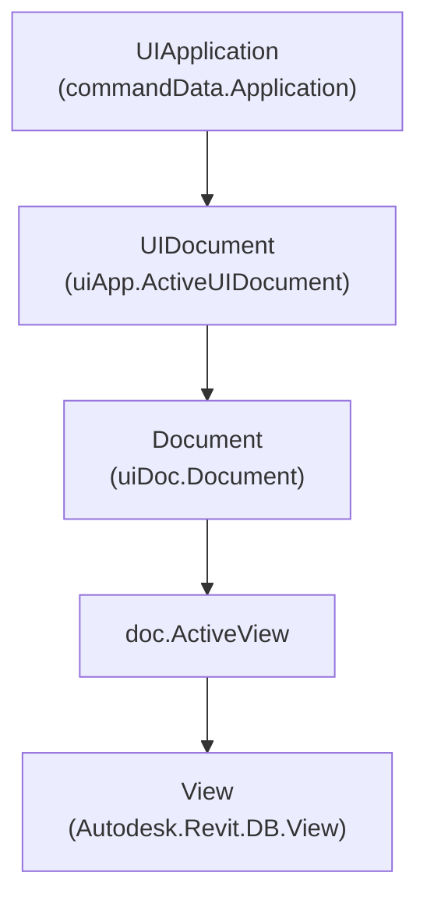

### Accessing the Active View

In the command execution, the active view is retrieved via:

```csharp
var uiApp = commandData.Application;
var uiDoc = uiApp.ActiveUIDocument;
var doc = uiDoc.Document;

// Get the view currently active in the UI
View activeView = doc.ActiveView;

if (activeView == null)
{
    TaskDialog.Show("Active View", "No active view was found.");
    return Result.Failed;
}
```

### Key Questions Answered

#### 1. What is the Active View?
The **Active View** is the specific Revit `View` that is currently open, focused, and visible to the user in the Revit drawing window when the command is invoked.

#### 2. Is it a UI object or a Revit database Element?
`doc.ActiveView` returns an instance of `Autodesk.Revit.DB.View`. Even though it represents what is currently displayed in the user interface, it is a **Revit database Element** (`Autodesk.Revit.DB.Element`). It has an `ElementId`, parameters, and permanent storage in the project `.rvt` file.

#### 3. What happens when the user changes the active Revit view?
When a user clicks on a different tab or double-clicks a view in the Project Browser, Revit switches its active UI context. The next time `doc.ActiveView` is called, it will return the newly focused `View` element from the database.

#### 4. Why is `ActiveView` accessed through `Document`?
`Document.ActiveView` represents the database element currently associated with the primary viewport of that document. While `UIDocument.ActiveView` also exists in the UI layer, `doc.ActiveView` provides direct access to the database `View` object for query and modification.

#### 5. When is `ActiveView` useful?
- When writing interactive tools where the user expects the tool to operate on "what I am looking at right now".
- When placing view-dependent 2D annotations (dimensions, text notes, detail lines).
- When passing the view ID into `FilteredElementCollector(doc, doc.ActiveView.Id)` to process only on-screen elements.

### Properties Demonstrated in Command 01

| Property | Type | Code Example | Output / Meaning |
| :--- | :--- | :--- | :--- |
| **`Name`** | `string` | `activeView.Name` | Name of the view in the Project Browser (e.g., `"Level 1"`). |
| **`Id`** | `ElementId` | `activeView.Id.IntegerValue` | Unique integer ID of the view element in the Revit database. |
| **`ViewType`** | `ViewType` | `activeView.ViewType` | Enum value (e.g., `ViewType.FloorPlan`, `ViewType.ThreeD`). |
| **`IsTemplate`** | `bool` | `activeView.IsTemplate` | `false` if it is a normal view; `true` if it is a template. |
| **`Scale`** | `int` | `$"1:{activeView.Scale}"` | Integer scale ratio (e.g., `100` for a `1:100` scale drawing). |
| **`DetailLevel`** | `ViewDetailLevel` | `activeView.DetailLevel` | Enum value (`Coarse`, `Medium`, `Fine`). |
| **`DisplayStyle`** | `DisplayStyle` | `activeView.DisplayStyle` | Enum value (`Wireframe`, `HiddenLine`, `Shading`, etc.). |

---

## 4. Command 02 — View Types

**File:** [`ViewTypesCommand.cs`](file:///f:/02-programming/06-%20Revit%20API/projects/RevitApiSamples/RevitApiSamples/Samples/Views/Commands/ViewTypesCommand.cs)

### Understanding `ViewType`

The `Autodesk.Revit.DB.ViewType` enum answers a fundamental domain question:

> **"What kind of architectural / engineering view am I dealing with?"**

Common `ViewType` values in Revit:
- `ViewType.FloorPlan` — Standard horizontal plan view looking down.
- `ViewType.CeilingPlan` — Reflected ceiling plan looking up.
- `ViewType.Section` — Vertical cutting plane through the model.
- `ViewType.Elevation` — Orthographic exterior or interior side projection.
- `ViewType.ThreeD` — 3D Axonometric, Isometric, or Perspective camera view.
- `ViewType.DraftingView` — 2D view containing purely non-model detail linework and annotations.
- `ViewType.Schedule` — Tabular data sheet querying element parameters.
- `ViewType.Legend` — Reusable 2D graphic key for symbols and materials.

```csharp
View activeView = doc.ActiveView;
ViewType viewType = activeView.ViewType;
```

### 1. View Element Taxonomy: C# Class Hierarchy vs. Revit ViewType

To fully understand how Revit organizes views, you must look at views from two complementary perspectives:

#### 🔹 Perspective A: C# Class Hierarchy (`view.GetType()`)
The .NET class inheritance tree inside `Autodesk.Revit.DB`:

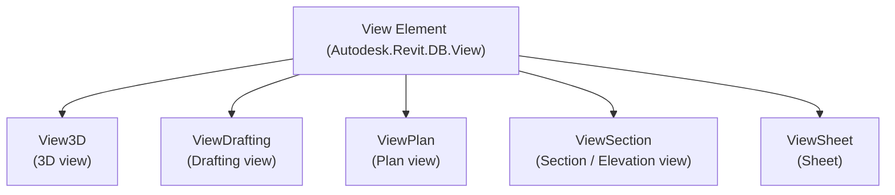

---

#### 🔹 Perspective B: Revit Domain Classification (`view.ViewType` Enum)
The functional role assigned by Revit's BIM engine:

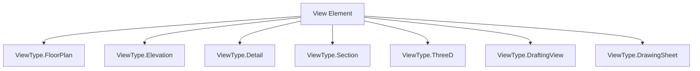

---

#### 🔹 Perspective C: Real-World Architectural Views to Revit API Mapping

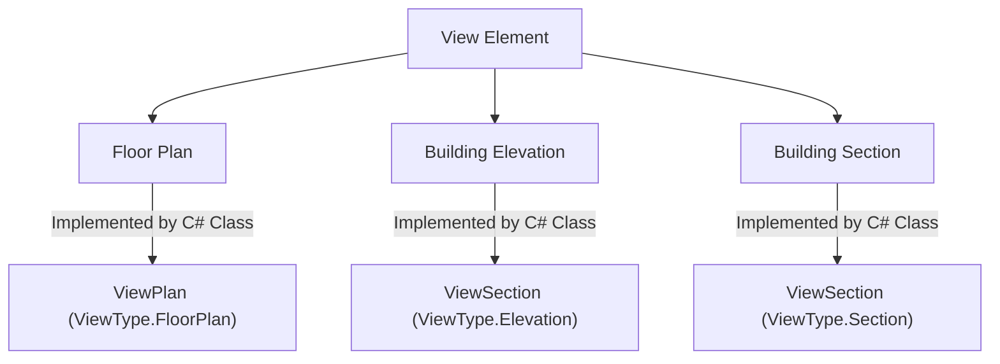

---

### 2. The Surprising Truth: Why Building Elevations are `ViewSection` in C#

> [!NOTE]
> **Why is there no `ViewElevation` class in the Revit API?**
> Mathematically, in Revit's 3D geometric engine:
> * A **Section** is a vertical cutting plane slicing through the building interior.
> * An **Elevation** is *also* a vertical cutting plane positioned outside the building looking orthogonally at the exterior facade.
> 
> Because their camera math, projection matrices, and clipping volumes are 100% identical, Autodesk implemented both under the exact same C# class: **`ViewSection`**.
> To distinguish them, you check `view.ViewType == ViewType.Elevation` vs `view.ViewType == ViewType.Section`.

---

### 3. Master Mapping Matrix: C# Classes $\leftrightarrow$ `ViewType` Enum $\leftrightarrow$ UI Views

| C# Concrete Class (`view.GetType()`) | Revit `ViewType` Enum Value (`view.ViewType`) | Real-World Revit UI View | Primary Characteristics |
| :--- | :--- | :--- | :--- |
| **`ViewPlan`** | `ViewType.FloorPlan` | **Floor Plan** | Horizontal cut plane looking down, bound to a Level (`GenLevel`). |
| **`ViewPlan`** | `ViewType.CeilingPlan` | **Reflected Ceiling Plan (RCP)** | Horizontal cut plane looking up, bound to a Level (`GenLevel`). |
| **`ViewPlan`** | `ViewType.AreaPlan` | **Area Plan** | Plan view displaying gross/rentable area boundaries. |
| **`ViewPlan`** | `ViewType.EngineeringPlan` | **Structural Plan** | Structural discipline plan view. |
| **`ViewSection`** | `ViewType.Section` | **Building Section / Wall Section** | Vertical cutting slice inside the building. |
| **`ViewSection`** | `ViewType.Elevation` | **Building Elevation / Interior Elevation** | Orthogonal side projection of facades/rooms. |
| **`ViewSection`** | `ViewType.Detail` | **Callout / Detail Section** | High-magnification cropped detail section. |
| **`View3D`** | `ViewType.ThreeD` | **3D Isometric / Perspective View** | Full 3D camera projection with eye/target points. |
| **`ViewDrafting`** | `ViewType.DraftingView` | **Drafting View** | Pure 2D canvas for standard construction details. |
| **`ViewSheet`** | `ViewType.DrawingSheet` | **Sheet (Titleblock)** | Printable documentation layout containing viewports. |
| **`ViewSchedule`** | `ViewType.Schedule` | **Schedule / Quantification** | Tabular database query report. |

---

### 4. Comparison Summary

| Concept | API Syntax | Question It Answers | Return Type | Examples |
| :--- | :--- | :--- | :--- | :--- |
| **Revit `ViewType`** | `view.ViewType` | "What functional role does this view perform in Revit?" | `Autodesk.Revit.DB.ViewType` (Enum) | `FloorPlan`, `Elevation`, `Section`, `ThreeD`, `Detail` |
| **C# Runtime Type** | `view.GetType().Name` | "What .NET class implements this object in memory?" | `System.Type` (Class) | `ViewPlan`, `ViewSection`, `View3D`, `ViewDrafting`, `ViewSheet` |

> [!WARNING]
> Do NOT attempt to check if a view is a floor plan by writing `if (view is ViewFloorPlan)` because **there is no class called `ViewFloorPlan` in the Revit API**. You must inspect `view.ViewType == ViewType.FloorPlan`.
> Similarly, there is no `ViewElevation` class; you must inspect `view is ViewSection && view.ViewType == ViewType.Elevation`.

---

## 5. Command 03 — Collect All Views

**File:** [`CollectViewsCommand.cs`](file:///f:/02-programming/06-%20Revit%20API/projects/RevitApiSamples/RevitApiSamples/Samples/Views/Commands/CollectViewsCommand.cs)

### Workflow

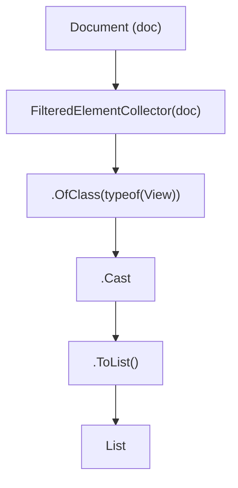

### Collecting Views from the Database

```csharp
List<View> views = new FilteredElementCollector(doc)
    .OfClass(typeof(View))
    .Cast<View>()
    .ToList();
```

### Why This Works

In the [Element Collection Module](file:///f:/02-programming/06-%20Revit%20API/projects/RevitApiSamples/RevitApiSamples/Samples/ElementCollection/ElementCollection.md), we learned that `FilteredElementCollector` queries the database by evaluating filters against database records. Because `Autodesk.Revit.DB.View` derives directly from `Autodesk.Revit.DB.Element`, passing `typeof(View)` to `.OfClass()` instructs Revit's internal database engine to return every element inheriting from `View`.

### Comparison: Collecting Model Elements vs Collecting Views

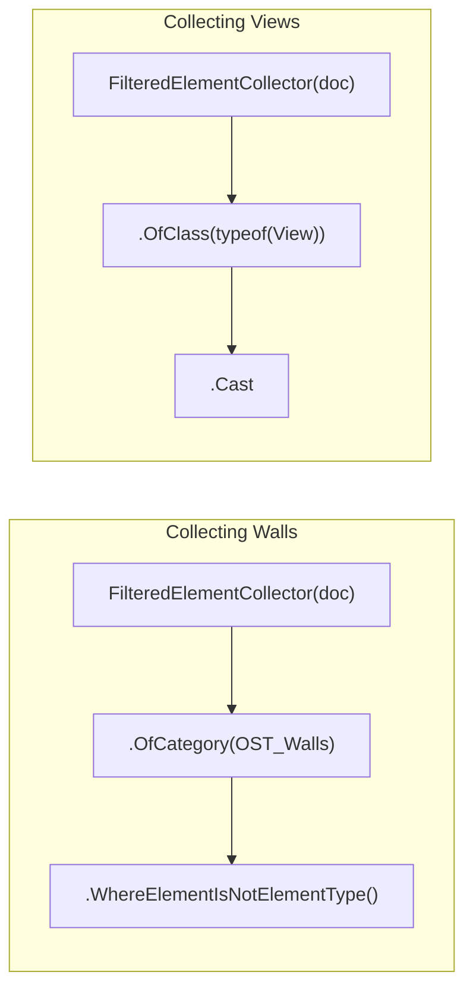

| Aspect | Model Elements (e.g., Walls) | Views |
| :--- | :--- | :--- |
| **Primary Collector Filter** | `.OfCategory(BuiltInCategory.OST_Walls)` | `.OfClass(typeof(View))` |
| **Why?** | Walls are classified by their Category in the project database. | Views encompass multiple internal categories, but all share the common C# base class `View`. |
| **Instances vs Types** | Requires `.WhereElementIsNotElementType()` to filter out `WallType`. | `.OfClass(typeof(View))` already collects view instances, but requires distinguishing **Normal Views** from **View Templates**. |

---

## 6. View Template Concept

A central concept in Revit is the **View Template**.

```
IsTemplate == false  ──►  Normal View (Interactive, Openable in UI)
IsTemplate == true   ──►  View Template (Preset Settings Definition)
```

```csharp
bool isTemplate = view.IsTemplate;
```

### What is a View Template?

A **View Template** is not a different C# class, nor is it a separate `ViewType`. 

In the Revit database, a View Template is **itself a `View` object** whose `IsTemplate` property is set to `true`. Instead of being opened in a drawing tab to display model geometry, its settings (Scale, Detail Level, Discipline, Visibility/Graphic overrides, Model/Annotation category filters) act as a **master blueprint** for other views.

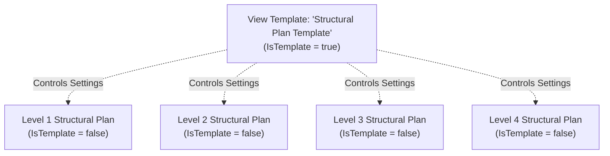

### Why View Templates are Essential in Real Projects

1. **Firm-Wide Standardization**: Ensures all structural floor plans maintain consistent line weights, hidden line settings, and scale (`1:100`).
2. **Instant Batch Updates**: Changing a graphic override in the View Template immediately updates all 50 views assigned to that template.
3. **Locking Properties**: When a parameter (e.g., Detail Level) is included in a View Template, it is locked in the assigned views to prevent unauthorized manual changes.

> [!IMPORTANT]
> **View Template is NOT a `ViewType`**:
> A View Template for a floor plan has `ViewType == ViewType.FloorPlan`. 
> A View Template for a section has `ViewType == ViewType.Section`.
> 
> Therefore:
> - `view.ViewType` answers: *"What kind of view is this?"*
> - `view.IsTemplate` answers: *"Is this view element itself acting as a template?"*

---

## 7. View Template vs View Using a Template

Understanding the difference between `view.IsTemplate` and `view.ViewTemplateId` is crucial for writing robust Revit add-ins:

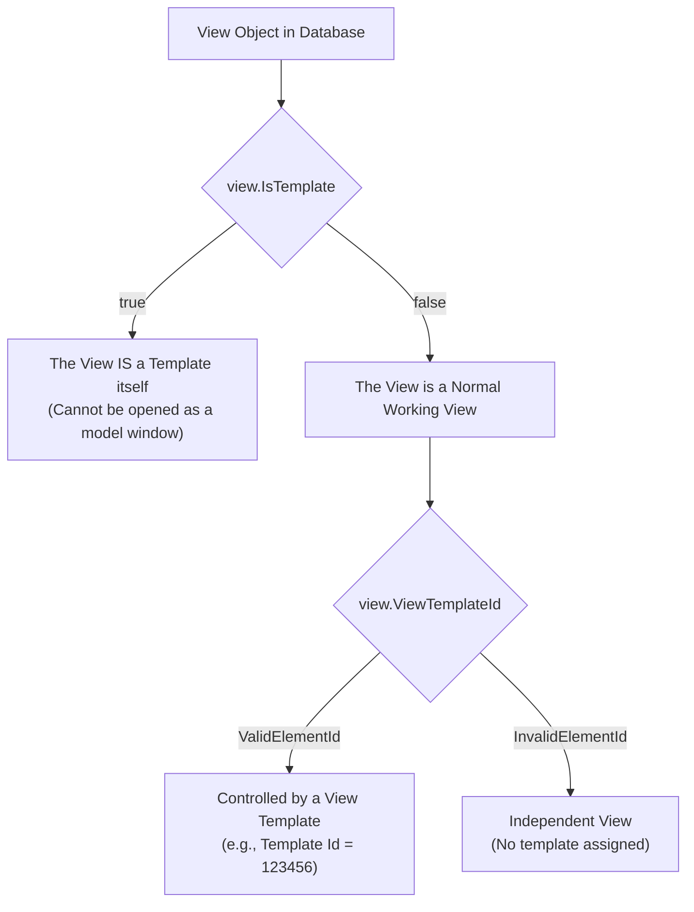

### The Two Properties Compared

```
View
├── IsTemplate
│      ├── true   ──►  Template itself
│      └── false  ──►  Normal View
│
└── ViewTemplateId
       ├── ValidElementId    ──►  Uses a Template (Properties may be locked)
       └── InvalidElementId  ──►  No Template (Properties freely editable)
```

```csharp
// 1. Is this view itself a template?
bool isTemplate = view.IsTemplate;

// 2. Does this normal view use a template?
ElementId templateId = view.ViewTemplateId;

if (templateId != ElementId.InvalidElementId)
{
    View templateView = doc.GetElement(templateId) as View;
    // The view is controlled by: templateView.Name
}
else
{
    // The view is independent and not controlled by any template
}
```

### Why This Distinction Matters When Modifying View Properties

If you write code to change a view property (such as `view.Scale = 50;` or `view.DetailLevel = ViewDetailLevel.Fine;`), the operation will throw an exception or fail silently if that view is assigned to a `ViewTemplateId` where that property is locked by the template!

To safely modify properties programmatically:
1. Check `view.ViewTemplateId`.
2. If assigned, determine whether to modify the template or temporarily unassign the template (`view.ViewTemplateId = ElementId.InvalidElementId;`).

---

## 8. Command 04 — Collect Views by Type

**File:** [`CollectViewsByTypeCommand.cs`](file:///f:/02-programming/06-%20Revit%20API/projects/RevitApiSamples/RevitApiSamples/Samples/Views/Commands/CollectViewsByTypeCommand.cs)

### Workflow

```
All Database Views (OfClass View)
       │
       ▼
Filter by ViewType (view.ViewType == ViewType.FloorPlan)
       │
       ▼
Exclude Templates (!view.IsTemplate)
       │
       ▼
Usable Floor Plan Views (Interactive Project Views)
```

### Implementation

In Command 04, we combine `ViewType` and `IsTemplate` to retrieve only the floor plans that the user can actually interact with:

```csharp
// 1. Collect all views in the document
List<View> allViews = new FilteredElementCollector(doc)
    .OfClass(typeof(View))
    .Cast<View>()
    .ToList();

// 2. Filter for usable Floor Plans (excluding View Templates)
List<View> floorPlans = allViews
    .Where(view => view.ViewType == ViewType.FloorPlan && !view.IsTemplate)
    .ToList();
```

### Why Both Conditions are Essential

If you only filter by `view.ViewType == ViewType.FloorPlan`, your list will contain:
1. Normal Floor Plans (e.g., Level 1, Level 2).
2. Floor Plan **View Templates** (e.g., "Architectural Plan Template", "Structural Framing Template").

If an add-in attempts to place a room tag, open the view in the UI, or export the view to DWG on a View Template, Revit will throw an invalid operation exception. Filtering with `!view.IsTemplate` guarantees you only process genuine, openable project views.

---

## 9. Filtering Strategy & Architecture

In `CollectViewsByTypeCommand.cs`, the code demonstrates an educational two-step filtering pattern:

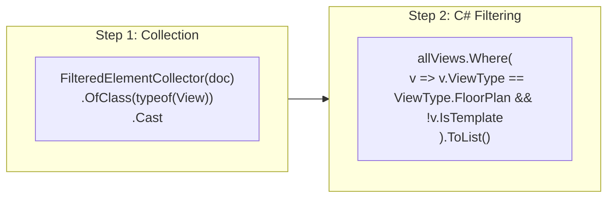

### Educational Design of This Sample

In this sample, collection and filtering are intentionally separated into two distinct steps to make the mental model clear:
1. First, retrieve the database elements of class `View`.
2. Second, inspect each object's properties in C# using LINQ.

### Native Revit Filtering vs In-Memory LINQ

As introduced in the [Element Collection Module](file:///f:/02-programming/06-%20Revit%20API/projects/RevitApiSamples/RevitApiSamples/Samples/ElementCollection/ElementCollection.md), filters can also be chained directly:

```csharp
// Chained execution
List<View> floorPlans = new FilteredElementCollector(doc)
    .OfClass(typeof(View))
    .Cast<View>()
    .Where(view => view.ViewType == ViewType.FloorPlan && !view.IsTemplate)
    .ToList();
```

> [!NOTE]
> Detailed deep-dive performance optimizations, custom slow filters, and native `ElementParameterFilter` techniques will be covered comprehensively in the upcoming dedicated Collector and Filter modules.

---

## 10. Command 05 — View Properties Inspection

**File:** [`GetViewPropertiesCommand.cs`](file:///f:/02-programming/06-%20Revit%20API/projects/RevitApiSamples/RevitApiSamples/Samples/Views/Commands/GetViewPropertiesCommand.cs)

`GetViewPropertiesCommand` provides an inspection of the fundamental properties that define any Revit View:

```csharp
View view = doc.ActiveView;

string name = view.Name;
int id = view.Id.IntegerValue;
ViewType type = view.ViewType;
bool isTemplate = view.IsTemplate;
int scale = view.Scale;
ViewDetailLevel detailLevel = view.DetailLevel;
DisplayStyle displayStyle = view.DisplayStyle;
ElementId templateId = view.ViewTemplateId;
Level level = view.GenLevel;
```

### Comprehensive Property Breakdown

| Property | Return Type | What It Represents | Why It Is Useful | Applicable to All Views? |
| :--- | :--- | :--- | :--- | :--- |
| **`Name`** | `string` | The browser title of the view. | Identifying and sorting views in user interfaces. | Yes. |
| **`Id`** | `ElementId` | Unique database identifier. | Passing to collectors, tracking changes, linking elements. | Yes. |
| **`ViewType`** | `ViewType` | Revit domain classification. | Determining which logic or creation rules apply. | Yes. |
| **`IsTemplate`** | `bool` | Whether this view is a template. | Isolating working views from graphic presets. | Yes. |
| **`Scale`** | `int` | Annotation & drawing scale denominator. | Scaling titleblocks, text, and dimensions. | Meaningful for Plans, Sections, Elevations, Drafting. Not meaningful for Schedules. |
| **`DetailLevel`** | `ViewDetailLevel` | Geometric fidelity of model elements. | Controlling visual detail (`Coarse`, `Medium`, `Fine`). | Meaningful for graphical views; not applicable to Schedules. |
| **`DisplayStyle`** | `DisplayStyle` | Rendering shading style. | Controlling visual presentation (Hidden Line, Shaded, Realistic). | Graphical views only. |
| **`ViewTemplateId`**| `ElementId` | Id of the assigned View Template. | Checking if properties are locked by a template. | Yes (`InvalidElementId` if none). |
| **`GenLevel`** | `Level` | Generating/associated Level element. | Finding the floor height, elevation, or building story. | **Plan views only** (returns `null` for 3D, Sections, Schedules). |

---

## 11. View Scale

**Property:** `view.Scale`

```csharp
// Example: Scale returns 100 for a 1:100 view
sb.AppendLine($"Scale:\n1:{view.Scale}");
```

### How View Scale Works

In Revit, `Scale` is stored as an integer representing the denominator of the scale ratio:
- `view.Scale = 100` $\longrightarrow 1:100$
- `view.Scale = 50` $\longrightarrow 1:50$
- `view.Scale = 20` $\longrightarrow 1:20$
- `view.Scale = 1` $\longrightarrow 1:1$ (Full size)

### Key Rules Regarding Scale
1. **Annotation Scaling**: When you change `view.Scale`, 3D model geometry remains unchanged in true world units (feet/meters), but annotation elements (text, tags, dimensions, symbol heads) automatically scale so they print at constant physical sheet sizes.
2. **View-Type Meaning**: Scale is meaningful for 2D plans, sections, elevations, detail views, and orthographic 3D views. Perspective 3D views and Schedules do not use an annotation scale in the same way.

---

## 12. Detail Level

**Property:** `view.DetailLevel`

```csharp
// Returns Autodesk.Revit.DB.ViewDetailLevel
sb.AppendLine($"Detail Level:\n{view.DetailLevel}");
```

### Detail Level Values

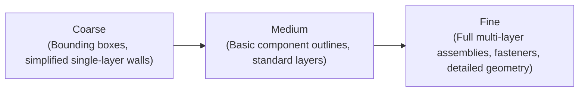

- `ViewDetailLevel.Coarse` — Simplified representation for overall master planning and small-scale drawings.
- `ViewDetailLevel.Medium` — Standard architectural/engineering representation.
- `ViewDetailLevel.Fine` — Full geometric assembly representation for high-scale construction details.

### Why Detail Level is a View Property (Not an Element Property)

A Wall family contains geometry for all three detail levels inside its definition. The wall itself does not decide how it looks; the **`View` determines how the wall is rendered**. In a `Coarse` view, the wall appears as two boundary lines with no interior layers. In a `Fine` view, the same wall displays all interior gypsum, insulation, and brick hatch patterns.

---

## 13. Display Style

**Property:** `view.DisplayStyle`

```csharp
// Returns Autodesk.Revit.DB.DisplayStyle
sb.AppendLine($"Display Style:\n{view.DisplayStyle}");
```

### What Display Style Controls

`DisplayStyle` defines the graphic shading mode of the view viewport:
- `DisplayStyle.Wireframe` — All model edges are visible; surfaces are transparent.
- `DisplayStyle.HiddenLine` — Front surfaces occlude back geometry (standard CAD/drawing style).
- `DisplayStyle.Shading` — Surfaces are filled with category material colors using simple lighting.
- `DisplayStyle.ShadingWithEdges` — Shaded surfaces with highlighted edge vectors.
- `DisplayStyle.Realistic` — Real-time material bitmap textures and appearance assets.

---

## 14. Associated Level (`GenLevel`)

**Property:** `view.GenLevel`

```csharp
// Retrieve the generating level
Level level = view.GenLevel;

sb.AppendLine($"Associated Level:\n" + $"{level?.Name ?? "None"}");
```

### Why `GenLevel` Can Be `null`

Not every View in Revit is associated with a building story or `Level`:

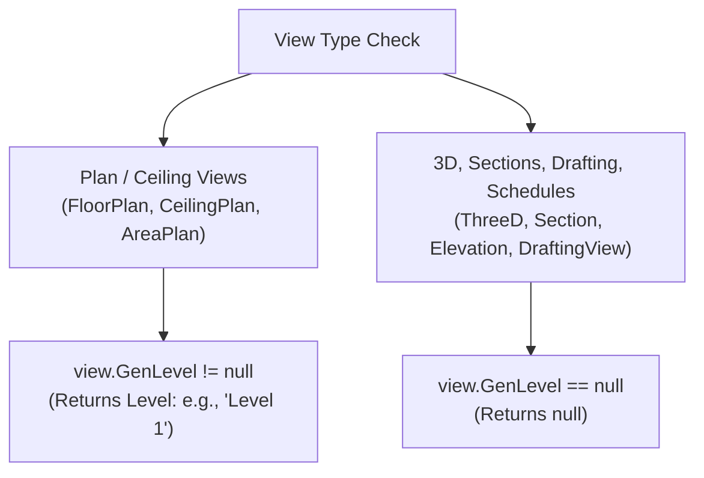

- **Plan Views (`ViewPlan`)**: A Floor Plan or Reflected Ceiling Plan is generated directly from a specific building `Level`. `view.GenLevel` returns the `Level` element.
- **3D Views (`View3D`)**: 3D views represent the entire project in space and are not bound to a single level (`GenLevel` is `null`).
- **Drafting Views (`ViewDrafting`) & Schedules (`ViewSchedule`)**: Non-spatial views have no level reference (`GenLevel` is `null`).
- **Sections & Elevations (`ViewSection`)**: Vertical cuts span multiple levels; their bounds are controlled by crop boxes, not a single generating level (`GenLevel` is typically `null`).

> [!TIP]
> Always use C# null-conditional operators (`view.GenLevel?.Name ?? "None"`) or null checks when inspecting `GenLevel` to avoid runtime `NullReferenceException` crashes.

---

## 15. View Type vs View-Specific Properties

### The Common vs Specific Mental Model

```
View Base Class (Autodesk.Revit.DB.View)
│
├── Common Properties (Guaranteed on all Views)
│   ├── Id
│   ├── Name
│   ├── ViewType
│   ├── IsTemplate
│   └── ViewTemplateId
│
└── View-Type-Specific Properties & Behaviors
    ├── ViewPlan      ──►  GenLevel, SketchPlane, ViewRange
    ├── ViewSection   ──►  CropBox, Min/Max Bounds, Origin
    ├── View3D        ──►  EyePosition, UpDirection, IsPerspective, SectionBox
    ├── ViewDrafting  ──►  2D Only (No 3D Model Elements)
    └── ViewSchedule  ──►  Definition, TableData, SchedulableFields
```

### Property Applicability Matrix

| Property | FloorPlan | Section | Elevation | ThreeD | DraftingView | Schedule |
| :--- | :---: | :---: | :---: | :---: | :---: | :---: |
| **`Id` / `Name`** | ✔ | ✔ | ✔ | ✔ | ✔ | ✔ |
| **`ViewType`** | ✔ | ✔ | ✔ | ✔ | ✔ | ✔ |
| **`IsTemplate`** | ✔ | ✔ | ✔ | ✔ | ✔ | ✔ |
| **`Scale`** | ✔ | ✔ | ✔ | ✔ | ✔ | ❌ |
| **`DetailLevel`** | ✔ | ✔ | ✔ | ✔ | ✔ | ❌ |
| **`DisplayStyle`**| ✔ | ✔ | ✔ | ✔ | ❌ | ❌ |
| **`GenLevel`** | ✔ | ❌ (`null`) | ❌ (`null`) | ❌ (`null`) | ❌ (`null`) | ❌ (`null`) |

---

## 16. Can a View Type Be Converted?

A common question among developers is:

> *"Can I convert an existing Floor Plan into a Section or 3D View by setting `view.ViewType = ViewType.Section`?"*

### The Answer: **No.**

`View.ViewType` is a **read-only property** with no setter (`get;`). You **cannot** change the type of an existing view by assigning an enum value.

```
Changing View Settings  ≠  Creating a Fundamentally Different View
(Modifying Scale/Template)    (FloorPlan ──► Section / 3D)
```

### Why Enum Conversion is Architecturally Impossible in Revit

Each Revit view type requires entirely different underlying geometric definitions and database relationships:
1. **Floor Plan $\longrightarrow$ Section**: A Section requires a cutting line, an eye direction, a depth range, and a vertical projection box. A Floor Plan does not have a section line.
2. **Floor Plan $\longrightarrow$ 3D View**: A 3D view requires a 3D camera matrix (Eye position, Forward vector, Up vector, Perspective flag).
3. **Floor Plan $\longrightarrow$ Schedule**: A Schedule is a tabular SQL-like query over element parameters, not a geometric projection.

### The Correct Approach: Dedicated Creation Methods *(Future / Not Implemented Yet)*

To get a different kind of view, you must **create a new view** using Revit's specialized static factory methods:
- To create a Plan: `ViewPlan.Create(...)` *(Future / Not Implemented Yet)*
- To create a Section: `ViewSection.CreateSection(...)` *(Future / Not Implemented Yet)*
- To create a 3D View: `View3D.CreateIsometric(...)` *(Future / Not Implemented Yet)*

---

## 17. Common Mistakes & Wrong Mental Models

### Mistake 1: Thinking a View is Only a UI Window
- ❌ **Wrong:** Assuming a View only exists when a user opens a tab on the screen.
- ✔ **Correct:** A View is a permanent database record (`Element`). It exists in the `.rvt` file whether it is open in the UI or not.
- 🛠️ **API Approach:** Use `FilteredElementCollector(doc).OfClass(typeof(View))` to query views even if they are not active.

### Mistake 2: Forgetting that View Inherits from Element
- ❌ **Wrong:** Treating Views as separate non-element objects that cannot have parameters or IDs.
- ✔ **Correct:** `View` derives from `Element`. It has an `Id`, `Category`, `Parameters`, and unique database identity.
- 🛠️ **API Approach:** Access parameters using `view.get_Parameter(...)` or `view.LookupParameter(...)`.

### Mistake 3: Confusing `ViewType` with C# Runtime `Type`
- ❌ **Wrong:** Searching for a C# class called `ViewFloorPlan` or casting `view as ViewFloorPlan`.
- ✔ **Correct:** `FloorPlan` is a `ViewType` enum value. The C# class is `ViewPlan`.
- 🛠️ **API Approach:** Check `view.ViewType == ViewType.FloorPlan`.

### Mistake 4: Assuming `ViewType` Can Be Assigned to Convert Views
- ❌ **Wrong:** Writing `view.ViewType = ViewType.ThreeD;` to turn a plan into a 3D view.
- ✔ **Correct:** `ViewType` is read-only. Different view types require different geometric setup.
- 🛠️ **API Approach:** Create new views using dedicated factory methods (`ViewPlan.Create`, `View3D.CreateIsometric`).

### Mistake 5: Assuming Every View Has an Associated Level
- ❌ **Wrong:** Writing `string levelName = view.GenLevel.Name;` without null checking.
- ✔ **Correct:** `GenLevel` is `null` for 3D views, sections, elevations, schedules, and drafting views.
- 🛠️ **API Approach:** Use null-safe code: `string levelName = view.GenLevel?.Name ?? "None";`.

### Mistake 6: Treating View Template as a Separate `ViewType`
- ❌ **Wrong:** Expecting a `ViewType.ViewTemplate` enum value.
- ✔ **Correct:** View Templates share standard `ViewType` values (e.g., `FloorPlan`, `Section`). They are identified by `view.IsTemplate == true`.
- 🛠️ **API Approach:** Inspect `view.IsTemplate`.

### Mistake 7: Confusing `IsTemplate` with `ViewTemplateId`
- ❌ **Wrong:** Checking `view.IsTemplate` to see if a normal view has a template assigned to it.
- ✔ **Correct:** `IsTemplate` tells if the view *is* a template. `ViewTemplateId` tells if a normal view *uses* a template.
- 🛠️ **API Approach:** Use `view.ViewTemplateId != ElementId.InvalidElementId` to check for assigned templates.

### Mistake 8: Assuming Every View Can Use the Same Properties
- ❌ **Wrong:** Attempting to set `view.Scale` or `view.DetailLevel` on a `ViewSchedule`.
- ✔ **Correct:** Schedules and tabular views do not support 2D/3D graphical projection properties.
- 🛠️ **API Approach:** Check `view.ViewType` or inspect whether the view is a graphical view before setting scale or detail levels.

### Mistake 9: Collecting Views Without Considering View Templates
- ❌ **Wrong:** Collecting all views of class `View` and immediately attempting to batch-export or tag elements across them.
- ✔ **Correct:** `OfClass(typeof(View))` returns View Templates alongside normal views. Operating on templates causes errors.
- 🛠️ **API Approach:** Always filter with `.Where(v => !v.IsTemplate)`.

### Mistake 10: Assuming All Collected Views are Usable Project Views
- ❌ **Wrong:** Assuming every `View` element in the database is an active drawing sheet or floor plan.
- ✔ **Correct:** Revit creates internal system views, template views, and browser organization views.
- 🛠️ **API Approach:** Filter by specific `ViewType` and `!view.IsTemplate`.

### Mistake 11: Treating a View Template as a Normal Working View
- ❌ **Wrong:** Attempting to set `doc.ActiveView = templateView;` or place model elements into a View Template.
- ✔ **Correct:** View Templates cannot be made active drawing windows. They only store settings.
- 🛠️ **API Approach:** Only assign view templates via `targetView.ViewTemplateId = templateView.Id;`.

---

## 18. Comparison with Element Collection Module

In the [Element Collection Module](file:///f:/02-programming/06-%20Revit%20API/projects/RevitApiSamples/RevitApiSamples/Samples/ElementCollection/ElementCollection.md), we established how `FilteredElementCollector` searches the database. Let us connect what we learned there with Views:

```mermaid
flowchart TD
    subgraph ElementCollectionModule["Element Collection Module"]
        FEC1["FilteredElementCollector(doc)"] --> Walls["OfCategory(OST_Walls)"]
        Walls --> InstancesOnly["WhereElementIsNotElementType()"]
        InstancesOnly --> WallList["List<Wall>"]
    end
    
    subgraph ViewsModule["Views Module"]
        FEC2["FilteredElementCollector(doc)"] --> ViewsClass["OfClass(typeof(View))"]
        ViewsClass --> FilterTemplates["Where(v => !v.IsTemplate)"]
        FilterTemplates --> FilterType["Where(v => v.ViewType == ViewType.FloorPlan)"]
        FilterType --> PlanList["List<View>"]
    end
```

### Key Takeaway
- In general element collection, you filter out **`ElementType`** (family types / system types) using `.WhereElementIsNotElementType()`.
- In view collection, you filter out **View Templates** using LINQ `!v.IsTemplate`.

---

## 19. Complete Views Mental Model

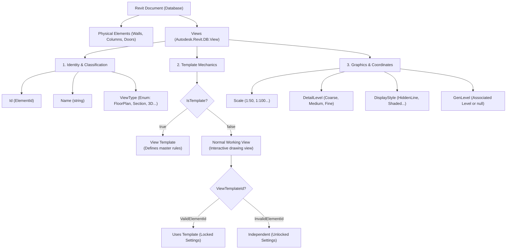

---

## 20. Learning Decision Tree

Use this decision tree when designing any Revit API automation that interacts with Views:

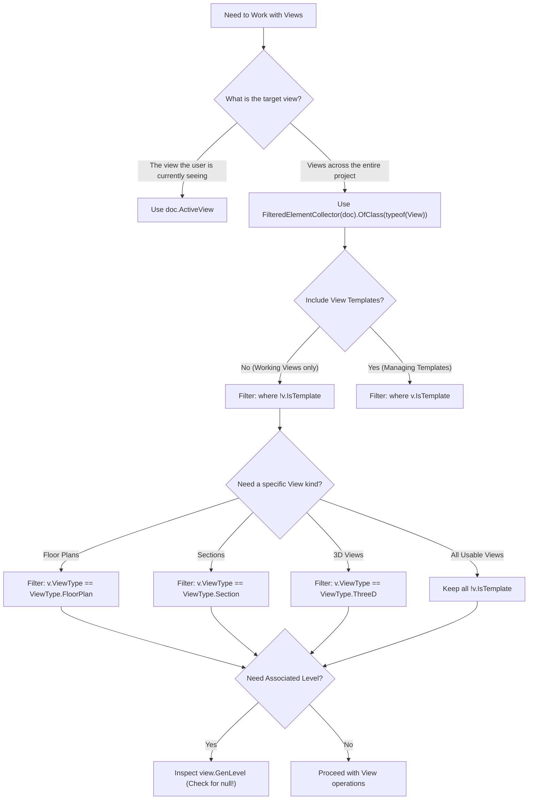

---

## 21. Practical Scenarios & Code Examples

### Scenario 1: Retrieve the Current Active Floor Plan
**Reasoning:** You want to ensure the user is currently on an active Floor Plan before running a floor-specific tool.
```csharp
View activeView = doc.ActiveView;

if (activeView == null || activeView.ViewType != ViewType.FloorPlan || activeView.IsTemplate)
{
    TaskDialog.Show("Error", "Please open a normal Floor Plan view before running this tool.");
    return Result.Failed;
}

// Proceed safely knowing activeView is a usable Floor Plan
```

---

### Scenario 2: Find All Normal Usable Floor Plans in the Project
**Reasoning:** You need to batch-process all floor plans (e.g., to create room schedules) without accidentally processing templates.
```csharp
List<View> normalFloorPlans = new FilteredElementCollector(doc)
    .OfClass(typeof(View))
    .Cast<View>()
    .Where(v => v.ViewType == ViewType.FloorPlan && !v.IsTemplate)
    .ToList();

TaskDialog.Show("Floor Plans", $"Found {normalFloorPlans.Count} usable floor plan(s).");
```

---

### Scenario 3: Find All Views Controlled by a Specific View Template
**Reasoning:** You want to find every view in the project that is currently governed by a template named `"Architectural Plan Template"`.
```csharp
// 1. Find the template
View template = new FilteredElementCollector(doc)
    .OfClass(typeof(View))
    .Cast<View>()
    .FirstOrDefault(v => v.IsTemplate && v.Name.Equals("Architectural Plan Template", StringComparison.OrdinalIgnoreCase));

if (template != null)
{
    // 2. Find all normal views using this template's Id
    List<View> dependentViews = new FilteredElementCollector(doc)
        .OfClass(typeof(View))
        .Cast<View>()
        .Where(v => !v.IsTemplate && v.ViewTemplateId == template.Id)
        .ToList();
        
    TaskDialog.Show("Template Usage", $"{dependentViews.Count} view(s) are using '{template.Name}'.");
}
```

---

### Scenario 4: Inspect View Scale and Detail Level
**Reasoning:** You want to check if a plan has a high detail level and appropriate documentation scale.
```csharp
View view = doc.ActiveView;

if (view != null && !view.IsTemplate)
{
    int scaleDenominator = view.Scale; // e.g. 100
    ViewDetailLevel detail = view.DetailLevel; // e.g. Fine
    
    TaskDialog.Show("View Settings", $"Scale: 1:{scaleDenominator}\nDetail Level: {detail}");
}
```

---

### Scenario 5: Determine Whether the Active View is a Template
**Reasoning:** You want to prevent a user from accidentally modifying template properties when a template tab is active.
```csharp
View view = doc.ActiveView;

if (view != null && view.IsTemplate)
{
    TaskDialog.Show("Warning", "The active view is a View Template, not a project drawing.");
}
```

---

## 22. Future Views Module Roadmap

> [!NOTE]
> The following topics represent advanced View capabilities in the Revit API and are **Future / Not Implemented Yet** in this sample repository. They will be introduced in subsequent modules.

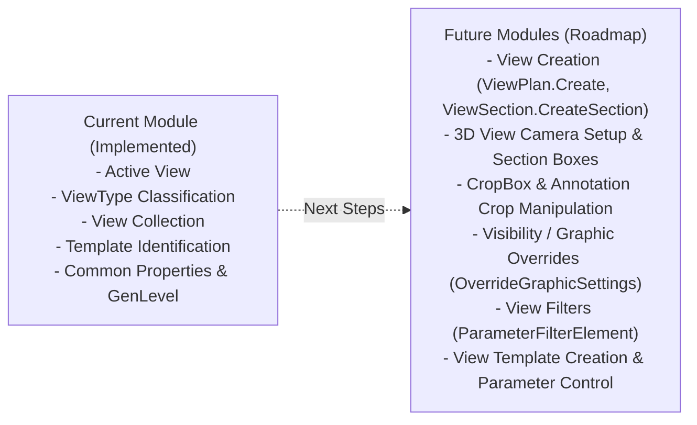

### Roadmap Concepts *(Future / Not Implemented Yet)*:
1. **View Creation**:
   - `ViewPlan.Create(doc, viewFamilyTypeId, levelId)`
   - `ViewSection.CreateSection(doc, viewFamilyTypeId, boundingBox)`
   - `View3D.CreateIsometric(doc, viewFamilyTypeId)`
2. **Crop Boxes & View Extents**:
   - `view.CropBox`, `view.CropBoxActive`, `view.CropBoxVisible`
   - Section Boxes on `View3D` (`view3D.SetSectionBox(box)`)
3. **Visibility & Graphic Overrides**:
   - `view.SetCategoryOverrides(categoryId, overrideGraphicSettings)`
   - `view.SetCategoryHidden(categoryId, hide)`
4. **View Filters**:
   - `ParameterFilterElement` and `view.AddFilter(filterId)`
5. **View Template Creation & Modification**:
   - `view.CreateViewTemplate()` and modifying locked parameter rule sets.

---

## 23. Final Cheat Sheet

| Task / Question | API / Property | Example / Syntax |
| :--- | :--- | :--- |
| **Get active view** | `Document.ActiveView` | `View active = doc.ActiveView;` |
| **Get view name** | `View.Name` | `string name = view.Name;` |
| **Get view database Id** | `View.Id` | `ElementId id = view.Id;` |
| **Get view kind / type** | `View.ViewType` | `if (view.ViewType == ViewType.FloorPlan)` |
| **Get C# runtime type** | `object.GetType()` | `string className = view.GetType().Name;` |
| **Is the view a template?** | `View.IsTemplate` | `if (view.IsTemplate)` |
| **Does the view use a template?** | `View.ViewTemplateId` | `if (view.ViewTemplateId != ElementId.InvalidElementId)` |
| **Get view scale denominator** | `View.Scale` | `int denom = view.Scale; // 100 for 1:100` |
| **Get detail level** | `View.DetailLevel` | `ViewDetailLevel detail = view.DetailLevel;` |
| **Get display style** | `View.DisplayStyle` | `DisplayStyle style = view.DisplayStyle;` |
| **Get associated Level** | `View.GenLevel` | `Level lvl = view.GenLevel; // Check null!` |
| **Collect all views & templates** | `FilteredElementCollector` | `new FilteredElementCollector(doc).OfClass(typeof(View)).Cast<View>().ToList();` |
| **Collect usable Floor Plans** | `FilteredElementCollector` + LINQ | `collector.OfClass(typeof(View)).Cast<View>().Where(v => v.ViewType == ViewType.FloorPlan && !v.IsTemplate).ToList();` |

---

## 24. Final Learning Summary

### The Conceptual Progression

```
Document
   │
   ▼
View (Database Element)
   │
   ▼
Identify ViewType (FloorPlan, Section, 3D...)
   │
   ▼
Determine Template Status (IsTemplate vs ViewTemplateId)
   │
   ▼
Collect Views (FilteredElementCollector.OfClass(typeof(View)))
   │
   ▼
Filter Views (v.ViewType == ... && !v.IsTemplate)
   │
   ▼
Inspect View Properties (Scale, DetailLevel, DisplayStyle, GenLevel)
   │
   ▼
Understand View-Specific Behavior (Plans have Levels; 3D/Sections do not)
```

### The Developer's Core Mindset

> *"I should not start by asking how to modify a View.*
>
> *I should first ask:*
> 1. **What View am I dealing with?**
> 2. **Is it the Active View (`doc.ActiveView`) or collected from the database?**
> 3. **What `ViewType` is it?**
> 4. **Is it a Template (`view.IsTemplate`)?**
> 5. **Does it use a Template (`view.ViewTemplateId`)?**
> 6. **Is it associated with a Level (`view.GenLevel`)?**
> 7. **Which properties are meaningful for this specific View type?**
>
> *Only after answering these questions do I choose the appropriate API."*
