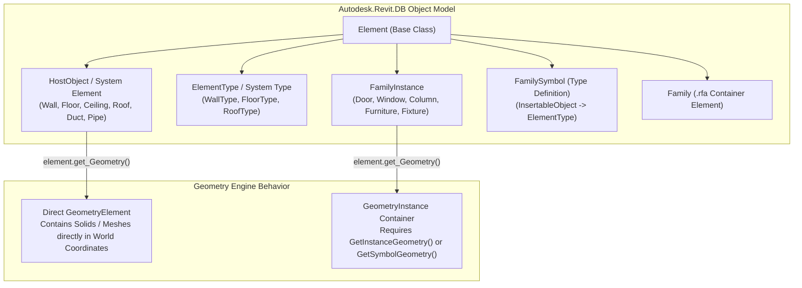
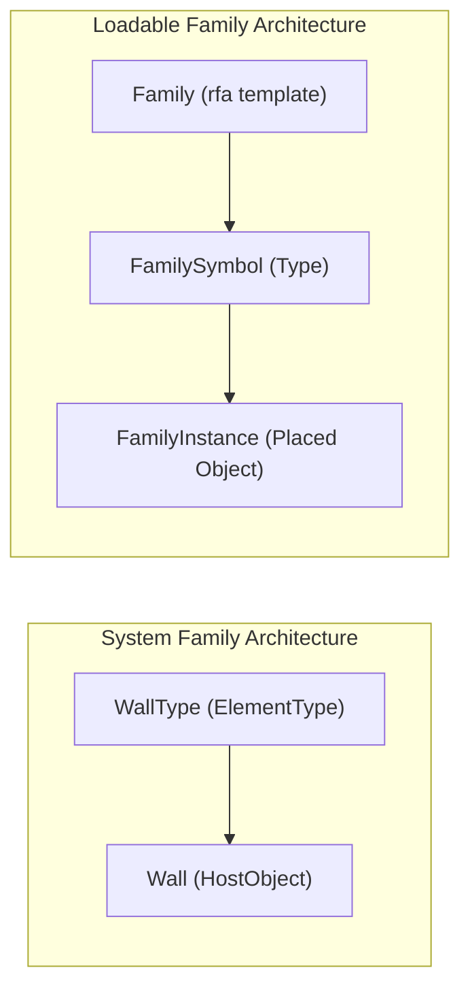
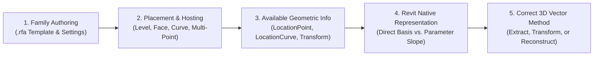
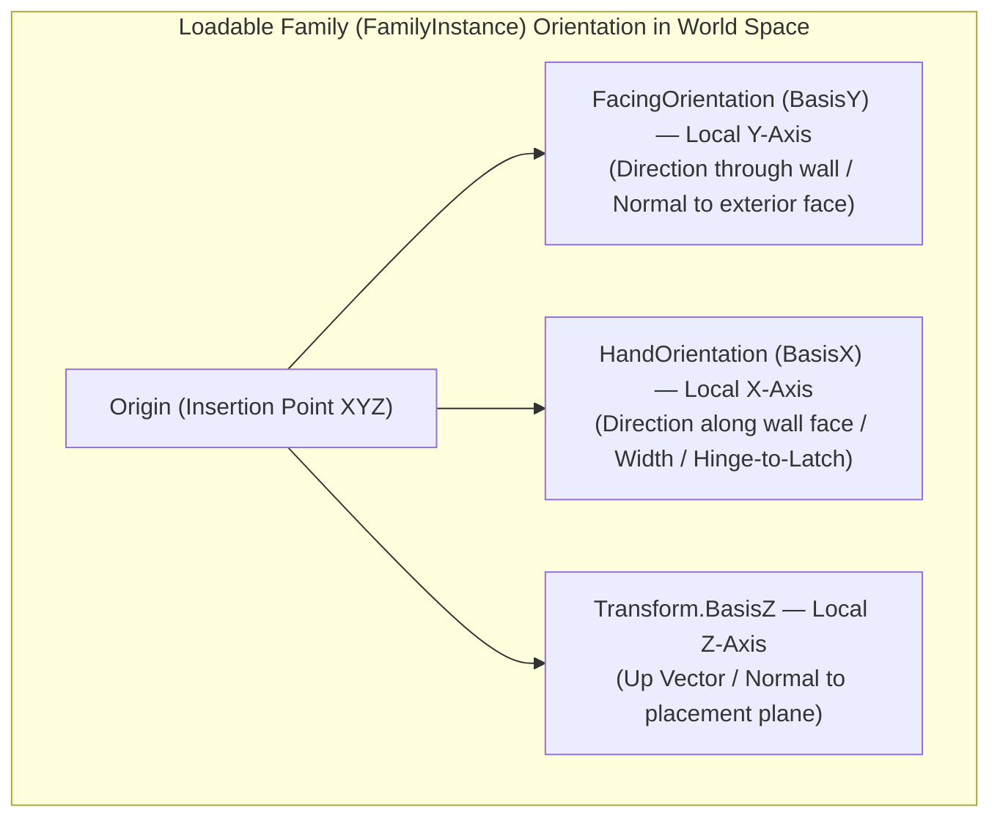

# System Families vs. Loadable Families — Revit API Master Comparison Guide

> **Target Version:** Autodesk Revit API 2025 (.NET 8)  
> **Location:** Root Repository Reference  
> **Status:** Active Reference Document — Maintained across all 24 Modules  

---

## 1. Executive Architectural Mental Model

In Autodesk Revit, all physical and analytical components are modeled as **Families**, but Revit divides them into two fundamentally different architectural paradigms: **System Families** and **Loadable (Component) Families** (with **In-Place Families** acting as a hybrid subset).

Understanding their distinct behavior at the API level is essential to writing robust, maintainable, and bug-free Revit add-ins.



---

## 2. High-Level Comparison Summary Matrix

| Characteristic | System Families | Loadable Families (Component Families) |
|---|---|---|
| **Definition Origin** | Hardcoded directly in the Revit core C++ engine schema. | Defined externally in `.rfa` template files via Family Editor. |
| **Storage & File Format** | Stored purely within `.rvt` project files or `.rte` template files. **Cannot exist as a `.rfa` file.** | Saved as standalone `.rfa` files on disk; loaded into `.rvt` projects. |
| **Instance C# Class** | Specific derived classes: `Wall`, `Floor`, `Ceiling`, `RoofBase`, `Duct`, `Pipe`, `BuildingElement`. | Unified `Autodesk.Revit.DB.FamilyInstance` class for all categories. |
| **Type C# Class** | Specific `ElementType` subclasses: `WallType`, `FloorType`, `CeilingType`, `RoofType`, `DuctType`. | `Autodesk.Revit.DB.FamilySymbol` (inherits `InsertableObject` $\to$ `ElementType`). |
| **Family Definition Class** | No `Family` element representation exists in the API. | `Autodesk.Revit.DB.Family` element represents the root family container. |
| **API Instantiation Method** | Dedicated static `Create(...)` factory methods (e.g., `Wall.Create`, `Floor.Create`). | Unified `ItemFactoryBase.NewFamilyInstance(...)` overloads on `Document.Create`. |
| **Geometry Representation** | Direct `Solid`, `Mesh`, or `Curve` objects inside `GeometryElement`. | Wrapped inside `GeometryInstance`; requires unwrapping or transform resolution. |
| **Type Creation / Editing** | Duplicated via `type.Duplicate("Name")`; structure edited via `CompoundStructure`. | Duplicated via `symbol.Duplicate("Name")` or via `FamilyManager.NewType()` in Family Doc. |
| **Parameter Architecture** | Hardcoded Built-In Parameters + Project Parameters bound via `BindingMap`. | Family Parameters (`FamilyParameter`), Shared Parameters, and formula engine. |
| **Family Editor Access** | Cannot be opened in Family Editor (`doc.EditFamily` throws exception). | Can be opened and edited programmatically via `doc.EditFamily(family)`. |
| **Transfer Mechanism** | Transfer Project Standards or `ElementTransformUtils.CopyElements`. | `doc.LoadFamily()`, `doc.LoadFamilySymbol()`, or `.rfa` file reload. |

---

## 3. Module-by-Module In-Depth Comparison (Modules 01–24)

### Module 01 — Selection
Selection filters and interactive picking behavior differ based on how Revit recognizes element inheritance and geometric boundaries.

| Aspect | System Families | Loadable Families |
|---|---|---|
| **Class Filtering (`ISelectionFilter.AllowElement`)** | Check against specific concrete types: `elem is Wall`, `elem is Floor`. | Check against `elem is FamilyInstance` + inspect `elem.Category.Id`. |
| **Reference / Geometry Picking** | Directly picks host planar faces (`HostObjectUtils.GetSideFaces`). | Picks component faces, nested references, or origin reference planes. |
| **Sub-element Selection** | Compound layers cannot be selected individually via UI pickers. | Sub-components (`instance.GetSubComponentIds()`) can be individually targeted. |

```csharp
// Selection Filter: System Family (Wall) vs Loadable Family (Doors / Windows)
public class SystemVsLoadableSelectionFilter : ISelectionFilter
{
    public bool AllowElement(Element elem)
    {
        // System Family check:
        if (elem is Wall wall) return true;

        // Loadable Family check (must verify FamilyInstance + Category):
        if (elem is FamilyInstance fi && 
            fi.Category?.BuiltInCategory == BuiltInCategory.OST_Doors)
        {
            return true;
        }
        return false;
    }

    public bool AllowReference(Reference reference, XYZ position) => true;
}
```

---

### Module 02 — Element Collection (`FilteredElementCollector`)
Querying the Revit database requires targeting different classes and collectors.

| Query Target | System Families Approach | Loadable Families Approach |
|---|---|---|
| **Collect All Instances** | `collector.OfClass(typeof(Wall)).WhereElementIsNotElementType()` | `collector.OfClass(typeof(FamilyInstance)).OfCategory(BuiltInCategory.OST_Doors)` |
| **Collect All Types (Symbols)** | `collector.OfClass(typeof(WallType))` | `collector.OfClass(typeof(FamilySymbol)).OfCategory(BuiltInCategory.OST_Doors)` |
| **Collect Family Containers** | ❌ Not applicable (no `Family` element exists). | `collector.OfClass(typeof(Family))` |
| **Filter by Family Name** | Must match `ElementType.FamilyName` or `type.Name` string parameter. | Can query `Family.Name` directly or `FamilySymbol.FamilyName`. |

```csharp
// Collecting System Types vs Loadable Types
// 1. System Family Types:
List<WallType> wallTypes = new FilteredElementCollector(doc)
    .OfClass(typeof(WallType))
    .Cast<WallType>()
    .ToList();

// 2. Loadable Family Types (FamilySymbols):
List<FamilySymbol> doorSymbols = new FilteredElementCollector(doc)
    .OfClass(typeof(FamilySymbol))
    .OfCategory(BuiltInCategory.OST_Doors)
    .Cast<FamilySymbol>()
    .ToList();
```

---

### Module 03 — Geometry Extraction & Analysis
The single most critical geometric distinction in the Revit API: **Direct Solids vs. `GeometryInstance` Wrapping**.

| Geometry Aspect | System Families | Loadable Families |
|---|---|---|
| **Root Geometry Tree** | Root `GeometryElement` directly yields `Solid`, `Mesh`, and `Curve` objects. | Root `GeometryElement` contains a `GeometryInstance` node wrapping the family geometry. |
| **Coordinate Space** | Direct solids are already in **World Coordinates (Project Space)**. | `GetSymbolGeometry()` is in **Family Local Coordinates**; `GetInstanceGeometry()` is in **World Coordinates**. |
| **Shared Geometry Optimization** | Each system family instance computes unique host geometry. | Identical instances share internal symbol geometry definitions scaled by `Transform`. |
| **Compound Layer Boundaries** | Extracted via specialized utilities: `HostObjectUtils.GetSideFaces`, `GetTopFaces`. | Extracted by traversing solid faces inside the unnested geometry instance. |

```csharp
// Geometry Extraction Comparison
public static List<Solid> ExtractSolids(Element element, Options options)
{
    List<Solid> solids = new();
    GeometryElement geomElem = element.get_Geometry(options);
    if (geomElem == null) return solids;

    foreach (GeometryObject geomObj in geomElem)
    {
        // System Families typically enter here directly:
        if (geomObj is Solid directSolid && directSolid.Volume > 1e-6)
        {
            solids.Add(directSolid);
        }
        // Loadable Families enter here (GeometryInstance):
        else if (geomObj is GeometryInstance geomInstance)
        {
            // GetInstanceGeometry() resolves coordinates into Project World Space:
            GeometryElement instanceGeom = geomInstance.GetInstanceGeometry();
            foreach (GeometryObject instObj in instanceGeom)
            {
                if (instObj is Solid instSolid && instSolid.Volume > 1e-6)
                {
                    solids.Add(instSolid);
                }
            }
        }
    }
    return solids;
}
```

---

### Module 04 — Model Creation / Instantiation
Instantiation follows completely divergent API architectures.

| Creation Feature | System Families | Loadable Families |
|---|---|---|
| **API Entry Point** | Dedicated static class methods: `Wall.Create()`, `Floor.Create()`, `Ceiling.Create()`. | Unified factory: `doc.Create.NewFamilyInstance(...)`. |
| **Prerequisites** | Boundary curves, Level ID, Type ID, structural/non-structural flags. | Active `FamilySymbol` (`symbol.IsActive` $\to$ `Activate()`), Location (XYZ / Curve / Host). |
| **Placement Varieties** | Dictated by the class signature (e.g. `Floor.Create` takes a `CurveLoop` array). | 12+ overloads supporting Point, Line, Face, Host, View, and Structural Type placements. |
| **Regeneration Requirement** | Standard `doc.Regenerate()` after commit. | **Mandatory** `doc.Regenerate()` if `symbol.Activate()` was called before placing! |

```csharp
// System Family Creation (Wall):
Wall wall = Wall.Create(
    doc, 
    Line.CreateBound(new XYZ(0, 0, 0), new XYZ(20, 0, 0)), 
    wallTypeId, 
    levelId, 
    10.0, // height in feet
    0.0,  // offset
    false, // flip
    false  // isStructural
);

// Loadable Family Creation (Door on Wall Host):
if (!doorSymbol.IsActive)
{
    doorSymbol.Activate();
    doc.Regenerate(); // Required after symbol activation!
}

FamilyInstance door = doc.Create.NewFamilyInstance(
    new XYZ(10, 0, 0),       // location
    doorSymbol,              // symbol
    wall,                    // host element
    level,                   // level
    StructuralType.NonStructural
);
```

---

### Module 05 — Parameters & Parameter Engine
How parameters are structured, bound, and evaluated.

| Parameter Feature | System Families | Loadable Families |
|---|---|---|
| **Built-in Parameter IDs** | Standardized `BuiltInParameter` enums (e.g., `WALL_USER_HEIGHT_PARAM`, `FLOOR_ATTR_THICKNESS_PARAM`). | Category-generic enums (e.g., `INSTANCE_ELEVATION_PARAM`, `DOOR_WIDTH`). |
| **Adding New Parameters** | Only possible via **Shared/Project Parameters** using `doc.ParameterBindings.Insert()`. | Can add **Family Parameters** inside Family Editor via `FamilyManager.AddParameter()`. |
| **Formula Engine** | Formulas cannot be assigned to system type/instance parameters via API. | Formulas can be assigned to `FamilyParameter` objects via `FamilyManager.SetFormula()`. |
| **Reporting Parameters** | ❌ Not supported. | Supported in Family Editor (driven by reference plane dimensions). |

---

### Module 06 — Units & Measurements
Internal storage is always imperial feet ($ft, ft^2, ft^3, rad$), but parametric mechanics differ.

| Unit Aspect | System Families | Loadable Families |
|---|---|---|
| **Layer Thickness Units** | Modifying `CompoundStructureLayer.Width` requires direct internal foot values. | Modifying family dimensions can use `UnitUtils.ConvertToInternalUnits`. |
| **Parametric Constraints** | Geometry scales automatically when `WALL_USER_HEIGHT_PARAM` or layer thickness changes. | Geometry scales based on constraints tied to Reference Planes (`ReferencePlane`). |
| **Calculated Values** | Volume and Area are computed natively by the core B-Rep engine (`get_Parameter(BuiltInParameter.HOST_VOLUME_COMPUTED)`). | Volume/Area computed from solids or explicitly modeled formulas inside the family. |

---

### Module 07 — Views & Visibility Settings
Controlling graphics, cut planes, and detail levels.

| Visibility Control | System Families | Loadable Families |
|---|---|---|
| **Detail Levels (Coarse/Med/Fine)** | Display of compound layers (e.g., brick, insulation, gypsum) switches automatically by view detail. | Controlled by `FamilyElementVisibility` assigned to individual solids/curves in the family. |
| **2D Representation in 3D Views** | Always renders full 3D solid geometry in all views. | Can display 2D **Symbolic Lines** in Plan/Elevation while hiding 3D geometry. |
| **Subcategories** | Fixed system subcategories (e.g., Common Edges, Hidden Lines). | Custom Subcategories (`Category.SubCategories`) created and assigned to distinct solids. |

---

### Module 08 — Documents & Environment
How elements relate to `.rvt` and `.rfa` project boundaries.

| Document Aspect | System Families | Loadable Families |
|---|---|---|
| **Document Existence** | Exists strictly inside `Document.IsFamilyDocument == false`. | Exists in Project Document (`FamilyInstance`) AND Family Document (`familyDoc.IsFamilyDocument == true`). |
| **Programmatic Editing** | Types modified inside the project via `CompoundStructure`. | Editable in isolated memory via `Document famDoc = doc.EditFamily(family)`. |
| **Loading / Importing** | Transferred via `Transfer Project Standards` or `CopyElements`. | Loaded into project via `doc.LoadFamily(filePath, out Family family)`. |

```csharp
// Programmatically opening and editing a Loadable Family Document:
Family family = doorInstance.Symbol.Family;
if (family.IsEditable)
{
    Document famDoc = doc.EditFamily(family);
    using (Transaction famTx = new Transaction(famDoc, "Add Parameter"))
    {
        famTx.Start();
        FamilyManager famMgr = famDoc.FamilyManager;
        famMgr.AddParameter("ManufacturerCode", GroupTypeId.Data, SpecTypeId.String.Text, false);
        famTx.Commit();
    }
    // Reload updated family back into project document:
    famDoc.LoadFamily(doc, new FamilyLoadOptionsOverride());
    famDoc.Close(false);
}
```

---

### Module 09 — Families & Types Management
Hierarchical relationships from element definition down to placed instance.



| Type Management | System Families | Loadable Families |
|---|---|---|
| **Hierarchy Depth** | 2 Levels: `ElementType` $\to$ `HostObject`. | 3 Levels: `Family` $\to$ `FamilySymbol` $\to$ `FamilyInstance`. |
| **Creating New Types** | `existingType.Duplicate("New Name")` $\to$ update `CompoundStructure`. | `symbol.Duplicate("New Name")` or `FamilyManager.NewType("New Name")`. |
| **Family Definition Deletion** | Cannot delete the core family category. | Deleting a `Family` element purges all its symbols and instances. |

---

### Module 10 — Transform & 3D Spatial Vector Architecture
How position, orientation, rotation, coordinate systems, and directional vectors are represented, constrained, and calculated across different family creation and hosting paradigms.

| Transform Feature | System Families | Loadable Families |
|---|---|---|
| **Location Property** | Typically `LocationCurve` (Walls, Pipes, Ducts) or boundary sketch (`Floor`, `Roof`). | `LocationPoint` (Punctual/Hosted), `LocationCurve` (Line-Based), or `null`/degenerate (`Adaptive`). |
| **3D Transform Matrix** | Does not expose an instance transform (geometry lives directly in project world space). | Exposes `instance.GetTransform()` and `instance.GetTotalTransform()`. |
| **Flipping & Mirroring** | Wall flip: `wall.Flip()` (flips exterior/interior normal orientation). | Multi-axis flipping: `instance.CanFlipFacing`, `instance.flipFacing()`, `instance.CanFlipHand`, `instance.flipHand()`. |
| **Mirrored State Check** | `wall.Flipped` (boolean). | `instance.Mirrored` and `instance.FacingFlipped` / `instance.HandFlipped`. |
| **Local Orientation Vectors** | Derived from curve tangent: `(line.GetEndPoint(1) - line.GetEndPoint(0)).Normalize()`. | Dedicated properties: `instance.HandOrientation` (local X) and `instance.FacingOrientation` (local Y). |

---

#### 🧭 Deep Dive: Family Creation & Placement Architecture Governs 3D Vector Calculations

> [!IMPORTANT]
> **Core Architectural Principle:**
> **We must calculate 3D direction vectors according to the way Revit creates, hosts, and constrains the family, rather than forcing every element into a single universal calculation.**
>
> In CAD/OpenGL/Unity, 3D orientation is purely mathematical (translation vector + quaternion/Euler rotation applied to raw vertices). In Autodesk Revit, element geometry is strictly governed by **BIM Hosting Paradigms** and internal family definition constraints (`.rfa`). 



---

##### 1. Master 3D Vector & Family Placement Classification Matrix

| Case # | Family & Placement Case | How It Is Created / Hosted | Available Geometric Information | How to Determine 3D Vector | Additional Data / Parameters Required | Limitations & Failure Modes |
| :---: | :--- | :--- | :--- | :--- | :--- | :--- |
| **1** | **Level-Hosted Point Family**<br>(Conveyors, Box Families, Free-Standing Equipment) | `NewFamilyInstance(XYZ, symbol, Level, NonStructural)`<br>`OneLevelBased` | • `LocationPoint.Point`<br>• `LocationPoint.Rotation` ($\theta_{\text{plan}}$)<br>• `HandOrientation` / `FacingOrientation` ($Z=0$) | **Reconstruct via Parameterized Math:**<br>$\vec{u}_{\text{3D}} = (u_x \cos\alpha, u_y \cos\alpha, \sin\alpha)$<br>where $\sin\alpha = \frac{Z_{\text{out}} - Z_{\text{in}}}{L}$ | `Infeed_Elevation`, `Outfeed_Elevation`, `Length` (instance parameters) | `LocationPoint.Rotation` is 1D scalar about global Z; slope is **not** stored in Revit's transform matrix. Translating origin in Z + writing parameters causes **double-elevation**. |
| **2** | **Face-Hosted / Work-Plane Family**<br>(Guard Rails, Brackets, Face Fixtures) | `NewFamilyInstance(Face, XYZ, XYZ, symbol)`<br>`WorkPlaneBased` | • Host `Face`<br>• `Face.ComputeNormal(uv)`<br>• In-plane reference direction $\vec{d}_{\text{ref}}$<br>• `GetTransform().BasisZ` | **Direct Extraction from Transform / Face:**<br>$\hat{Z}_{\text{local}} = \vec{N}_{\text{face}}$<br>$\hat{X}_{\text{local}} = \text{proj}_{\text{face}}(\vec{d}_{\text{ref}})$<br>$\hat{Y}_{\text{local}} = \hat{Z} \times \hat{X}$ | Valid host `Face` and in-plane reference vector | Requires `Always Vertical = False` in `.rfa`. If `Always Vertical = True`, Revit forces $\text{BasisZ} = (0,0,1)$ even on a sloped face. |
| **3** | **Curve-Based Family (Linear)**<br>(Walls, Beams, Ducts, Pipes, Line-Based Loadable) | `NewFamilyInstance(Curve, symbol, Level, ...)`<br>`Wall.Create(doc, Curve, ...)`<br>`CurveBased` | • `LocationCurve.Curve`<br>• Start Point $P_1 = \text{Curve.GetEndPoint}(0)$<br>• End Point $P_2 = \text{Curve.GetEndPoint}(1)$ | **Direct Native Vector Subtraction:**<br>$\vec{u}_{\text{3D}} = \frac{P_2 - P_1}{\|P_2 - P_1\|}$<br>Or `Line.Direction` / `ComputeDerivatives` | None (native curve geometry) | Casting `Location` to `LocationPoint` throws `InvalidCastException`. True 3D slope is encoded directly in curve coordinates. |
| **4** | **Free 3D Spatial Component**<br>(Unhosted 3D equipment, tilted structural braces) | `NewFamilyInstance(XYZ, symbol, StructuralType)` + 3D Axis Rotation<br>`Always Vertical = False` | • `GetTransform().BasisX`<br>• `GetTransform().BasisY`<br>• `GetTransform().BasisZ`<br>• `GetTransform().Origin` | **Direct 3D Matrix Basis Read:**<br>$\vec{u}_{\text{longitudinal}} = \text{Transform.BasisX}$<br>$\vec{u}_{\text{transverse}} = \text{Transform.BasisY}$<br>$\vec{u}_{\text{normal}} = \text{Transform.BasisZ}$ | Requires 3D rotation via `ElementTransformUtils.RotateElement` | Family Editor setting `FAMILY_ALWAYS_VERTICAL` must be explicitly set to `0` (False). |
| **5** | **MEP Connected Family**<br>(Pumps, Air Handlers, Valves, Connected Machinery) | Point-based or Hosted, but equipped with `MEPModel` connectors | • `MEPModel.ConnectorManager`<br>• `Connector.Origin`<br>• `Connector.CoordinateSystem.BasisZ` | **Direct Connector Port Orientation:**<br>$\vec{u}_{\text{flow}} = \text{Connector.CoordinateSystem.BasisZ}$<br>$P_{\text{port}} = \text{Connector.Origin}$ | `MEPModel` must not be null | Connector directions represent fluid/electrical flow vectors, independent of the family insertion origin. |
| **6** | **Adaptive Multi-Point Family**<br>(Complex trusses, curved conveyors, panels) | `AdaptiveComponentInstanceUtils.CreateAdaptiveComponentInstance`<br>`Adaptive` | • `AdaptiveComponentInstanceUtils`<br>• Ordered `ReferencePoint` element IDs<br>• `ReferencePoint.Position` (XYZ) | **Point-to-Point Vector Reconstruction:**<br>$\vec{u}_{\text{segment}} = \frac{P_{i+1} - P_i}{\|P_{i+1} - P_i\|}$ | None (read from placement point elements) | `Location` is `null` or degenerate; cannot use `LocationPoint` or `LocationCurve`. Position is defined solely by placement points. |
| **7** | **Two-Level Structural Member**<br>(Vertical vs. Slanted Structural Columns) | `NewFamilyInstance(XYZ, symbol, baseLvl, topLvl, Column)`<br>`TwoLevelsBased` | • `SLANTED_COLUMN_TYPE_PARAM`<br>• Vertical: `LocationPoint`<br>• Slanted: `LocationCurve` | **Dynamic Type Check:**<br>• If Vertical: $\vec{u} = (0, 0, 1)$<br>• If Slanted: $\vec{u} = \text{LocationCurve.Curve.Direction}$ | Built-in parameter `SLANTED_COLUMN_TYPE_PARAM` | When slanted, Revit converts `Location` from `LocationPoint` to `LocationCurve` on the fly. Blind casting throws `InvalidCastException`. |

---

##### 2. What is `HandOrientation` vs. 3D Orientation?



* `FamilyInstance.HandOrientation` is an **`XYZ` unit vector** that represents the **local X-axis** of a component family definition expressed in project world coordinates.
* **Architectural Origin**: In architectural terminology for doors and windows:
  * **`FacingOrientation`** (Local Y-axis): Points outward through the host wall (from interior to exterior, or facing direction).
  * **`HandOrientation`** (Local X-axis): Points along the wall face in the direction of the **door swing / hinge-to-latch ("Hand")** or component width.
* **Flipping Awareness**: If the user clicks the horizontal flip control arrow in the Revit UI (or code calls `instance.flipHand()`), Revit inverts the `HandOrientation` vector by $180^\circ$ (multiplies by $-1$), while keeping `FacingOrientation` unchanged.
* **Is `HandOrientation` Open to Use in ANY Type of Family?**
  * **System Families** (`Wall`, `Floor`, `Pipe`, `Duct`): ❌ **NO (Compile Error)** — System families do not inherit from `FamilyInstance`.
  * **Loadable Families**: ✔ **YES** — Exists on all `FamilyInstance` objects (returns local X basis vector `transform.BasisX`).

---

##### 3. Why a Single "Generic `Get3DDirection`" Method is Flawed

Attempting to write a single generic `Get3DDirection(planDirection, zIn, zOut, length)` method and applying it universally across all Revit families introduces serious architectural errors:

| # | Flaw / Invalid Assumption | Why It Breaks in Revit | Consequence / Failure Mode |
| :-: | :--- | :--- | :--- |
| **1** | **Assumes Infeed / Outfeed Parameters Always Exist** | Elevation parameters are custom application conventions (e.g. `ILUS_Infeed_Elevation`). Standard Revit families (doors, beams, ducts, equipment) do not have these parameters. | `NullReferenceException` or missing data. |
| **2** | **Assumes Level-Based Placement Model** | If applied to a Face-Hosted family (e.g. Guard Rail on an inclined face), it ignores the host face surface normal and tries to reconstruct direction from horizontal plan angles. | Guard rails fail to align with the sloped host surface. |
| **3** | **The Double-Elevation Defect** | Level-hosted families use internal parametric elevation. If code translates the insertion point by $\vec{u}_{\text{3D}} \cdot L$ (raising origin $Z$ by $\Delta Z$) AND writes `Infeed_Elevation = Z`, the family raises itself relative to an already elevated origin. | Geometry is elevated **twice** ($2 \times \Delta Z$). |
| **4** | **Destroys Native Revit Geometric References** | Curve-based elements (`LocationCurve`) and MEP elements (`MEPModel`) already store true 3D vectors natively. Reconstructing them via plan trigonometry discards Revit's authoritative geometric data. | Loss of curve curvature, tangents, and port flow directions. |
| **5** | **Fails on Non-Planar / Rotated Work Planes** | `LocationPoint.Rotation` is a 1D scalar. For face-hosted families on tilted surfaces with `Always Vertical = False`, `Rotation` is relative to the **tilted local Z-axis**, not global Z. | Trigonometric formulas produce incorrect world coordinates. |
| **6** | **Produces a Vector Revit Does Not Use** | The computed 3D vector may be mathematically sound, but Revit's constraint engine does not store or use that vector for the element's position. | False sense of correctness; code operates on hypothetical coordinates rather than Revit's actual instance transform. |

---

##### 4. Master Comparison Matrix: Direction Calculation Methods

| Aspect | Method A: `HandOrientation` / `FacingOrientation` | Method B: 3D Matrix `Transform.BasisX` | Method C: `LocationCurve.Curve.Direction` | Method D: Parameterized Reconstruction ($\vec{u}_{\text{3D}}$) |
| :--- | :--- | :--- | :--- | :--- |
| **Primary Target** | `FamilyInstance` (Loadable Families) | `FamilyInstance`, `RevitLinkInstance`, `GeometryInstance` | Linear elements (`Wall`, `Beam`, `Pipe`, `Duct`, `Line`) | Level-hosted families with elevation parameters |
| **System Families Supported?** | ❌ **NO** | ❌ **NO** | ✔ **YES** (Standard for linear system families) | ❌ **NO** |
| **Loadable Families Supported?** | ✔ **YES** | ✔ **YES** | ✔ Only if line-based loadable family | ✔ **YES** (Point families with elevation params) |
| **Tracks UI Hand/Facing Flip?** | ✔ **YES** (Inverts when `HandFlipped == true`) | ⚠️ Only if using `GetTotalTransform()` | ❌ **NO** (`wall.Flip()` flips wall normal, not endpoints) | ❌ **NO** (Must explicitly pass flipped facing) |
| **Return Value** | 3D Unit Vector (`XYZ`) | 3D Basis Vector (`XYZ`) | 3D Normalized Vector (`XYZ`) | 3D Unit Vector ($\vec{u}_{\text{3D}}$) |
| **Calculation Overhead** | ⚡ Instant property read | ⚡ Instant matrix read | ⚡ Instant vector subtraction | ⚡ Instant trigonometric calculation |
| **Best Used For** | Doors, windows, equipment where swing/facing matters. | General 3D coordinate system transforms, face-hosted instances. | Tracing wall centerlines, pipe/duct flow routing, structural spans. | Level-hosted conveyors, chutes, and inclined equipment. |

---

##### 5. Code Recipes: Calculating Direction According to Placement Architecture

```csharp
// ============================================================================
// METHOD 1: Level-Hosted Parameterized Reconstruction (Conveyors / Box Families)
// ============================================================================
public static XYZ GetLevelHosted3DDirection(FamilyInstance instance)
{
    if (instance.Location is LocationPoint locPoint)
    {
        double length = instance.LookupParameter("Length")?.AsDouble() ?? 10.0;
        double zIn = instance.LookupParameter("ILUS_Infeed_Elevation")?.AsDouble() ?? locPoint.Point.Z;
        double zOut = instance.LookupParameter("ILUS_Outfeed_Elevation")?.AsDouble() ?? locPoint.Point.Z;

        XYZ planFacing = instance.FacingOrientation; // Or instance.HandOrientation
        double horizontalLength = Math.Sqrt(planFacing.X * planFacing.X + planFacing.Y * planFacing.Y);
        double ux = planFacing.X / horizontalLength;
        double uy = planFacing.Y / horizontalLength;

        double deltaZ = zOut - zIn;
        double sinAlpha = deltaZ / length;
        double cosAlpha = Math.Sqrt(1.0 - sinAlpha * sinAlpha);

        return new XYZ(ux * cosAlpha, uy * cosAlpha, sinAlpha);
    }
    return XYZ.Zero;
}

// ============================================================================
// METHOD 2: Face-Hosted / 3D Work-Plane Families (Guard Rails / Brackets)
// ============================================================================
public static (XYZ BasisX, XYZ BasisY, XYZ BasisZ) GetFaceHosted3DBasis(FamilyInstance instance)
{
    Transform transform = instance.GetTotalTransform();
    return (transform.BasisX, transform.BasisY, transform.BasisZ);
}

// ============================================================================
// METHOD 3: Linear System Families & Line-Based Families (Walls, Ducts, Pipes)
// ============================================================================
public static XYZ GetLinearElementDirection(Element element)
{
    if (element.Location is LocationCurve locCurve)
    {
        Curve curve = locCurve.Curve;
        if (curve is Line line)
            return line.Direction; // Normalized (End - Start)
        else
            return curve.ComputeDerivatives(0.0, normalized: true).BasisX.Normalize();
    }
    return XYZ.Zero;
}

// ============================================================================
// METHOD 4: MEP Connected Equipment (Pumps, Valves, Terminals)
// ============================================================================
public static XYZ GetMEPFlowDirection(FamilyInstance instance)
{
    ConnectorSet? connectors = instance.MEPModel?.ConnectorManager?.Connectors;
    if (connectors != null)
    {
        foreach (Connector c in connectors)
        {
            if (c.Domain == Domain.DomainHvac || c.Domain == Domain.DomainPiping)
                return c.CoordinateSystem.BasisZ; // Flow direction vector
        }
    }
    return XYZ.Zero;
}
```

---

##### 6. Infeed vs. Outfeed Elevation Analysis Relative to $(0,0,0)$

Every point in Revit has an absolute elevation $Z$ measured in internal feet relative to the **Revit Internal Origin $(0,0,0)$**:

```
                     Outfeed P2 (X2, Y2, Z2)
                             ▲
                            /|
                           / |
              3D Vector   /  |  ΔZ (Height Difference) = Z2 - Z1
                         /   |
                        /    |
                       /     ▼
 Infeed P1 (X1, Y1, Z1) ───────
                       Horizontal Run
```

1. $\text{Elevation}_{\text{infeed}} = P_1.Z$
2. $\text{Elevation}_{\text{outfeed}} = P_2.Z$
3. $\text{Height Delta } \Delta Z = P_2.Z - P_1.Z$
4. $\text{Horizontal Planar Run} = \sqrt{(X_2 - X_1)^2 + (Y_2 - Y_1)^2}$
5. $\text{Slope Percentage} = \left(\frac{\Delta Z}{\text{Run}}\right) \times 100\%$

---

### Module 11 — Levels & Vertical Constraints
Vertical positioning and level association.

| Level Association | System Families | Loadable Families |
|---|---|---|
| **Level Constraints** | Multi-level bounding: `WALL_BASE_CONSTRAINT`, `WALL_HEIGHT_TYPE`, Base/Top Offsets. | Single level association: `FamilyInstance.LevelId`, `INSTANCE_FREE_HOST_OFFSET_PARAM`. |
| **Level Movement Behavior** | If level elevation changes, element height/stretch dynamically updates. | If level elevation changes, element moves vertically without changing internal geometry height. |

---

### Module 12 — Grids & Placement Alignment
Alignment and attachment to structural grids.

| Grid Mechanics | System Families | Loadable Families |
|---|---|---|
| **Curtain Grids / System Grids** | Built directly into host: `wall.CurtainGrid.AddGridLine(...)`. | ❌ Cannot have internal dynamic curtain grid systems. |
| **Grid Intersection Snapping** | Linear system elements span between grid lines. | Columns place at grid intersections: `doc.Create.NewFamilyInstance(gridIntersectionPoint, columnSymbol, ...)`. |

---

### Module 13 — Materials & Compound Layers
Assigning and querying materials across the element structure.

| Material Feature | System Families | Loadable Families |
|---|---|---|
| **Material Distribution** | Structured as layered slices via `CompoundStructureLayer.MaterialId`. | Bound to 3D solid geometry or controlled by Type/Instance Material Parameters. |
| **Split Face & Paint** | Fully supported via `doc.Paint(elementId, face, materialId)`. | Supported on exposed solid faces of `FamilyInstance`. |
| **Thermal & Structural Assets** | Compound layers contribute directly to wall thermal resistance ($R$-value, $U$-value). | Material assets assigned to family parameters. |

```csharp
// Modifying System Family Material (Compound Structure Layer) vs Loadable Family Material
// 1. System Family (WallType Layer Material):
CompoundStructure structure = wallType.GetCompoundStructure();
IList<CompoundStructureLayer> layers = structure.GetLayers();
layers[0].MaterialId = newMaterialId;
structure.SetLayers(layers);
wallType.SetCompoundStructure(structure);

// 2. Loadable Family (Parameter-based Material):
Parameter matParam = familyInstance.get_Parameter(BuiltInParameter.STRUCTURAL_MATERIAL_PARAM) 
                  ?? familyInstance.LookupParameter("Material");
if (matParam != null && !matParam.IsReadOnly)
{
    matParam.Set(newMaterialId);
}
```

---

### Module 14 — Spatial / Location & Room Calculation
How elements interact with Rooms, Spaces, and Bounding Volumes.

| Spatial Feature | System Families | Loadable Families |
|---|---|---|
| **Room Bounding Property** | Native boundary: `wall.get_Parameter(BuiltInParameter.WALL_ATTR_ROOM_BOUNDING)`. | Typically not room bounding (unless specified in family properties). |
| **Room Calculation Points** | ❌ Not applicable. | `instance.HasRoomCalculationPoint` $\to$ enables `instance.FromRoom`, `instance.ToRoom`, `instance.Room`. |
| **Space Phasing Detection** | Walls calculate boundaries per phase. | Doors/Windows track room transitions across phases using calculation points. |

```csharp
// Accessing Room Transition Data on Loadable Families (Doors/Windows):
if (familyInstance.Room != null)
{
    string currentRoom = familyInstance.Room.Name;
}
else
{
    // Check FromRoom / ToRoom for doors:
    Phase phase = doc.GetElement(familyInstance.CreatedPhaseId) as Phase;
    Room fromRoom = familyInstance.get_FromRoom(phase);
    Room toRoom = familyInstance.get_ToRoom(phase);
}
```

---

### Module 15 — Filters & Advanced Collection
Building high-performance parameter and category filters.

| Filtering Strategy | System Families | Loadable Families |
|---|---|---|
| **Slow Filter Reduction** | Filter by concrete C# class type (`typeof(Wall)`). | Filter by `FamilyInstance` + `ElementMulticategoryFilter`. |
| **Family Name Rule Filters** | Cannot use `ALL_MODEL_FAMILY_NAME` reliably on all system elements. | `ParameterFilterRuleFactory.CreateBeginsWithRule(new ElementId(BuiltInParameter.ALL_MODEL_FAMILY_NAME), "Door")`. |

---

### Module 16 — Transactions & Regeneration
Handling transactions, sub-transactions, and document regeneration.

| Transaction Topic | System Families | Loadable Families |
|---|---|---|
| **Joining Elements** | `JoinGeometryUtils.JoinGeometry(doc, wall1, wall2)`. | `JoinGeometryUtils.JoinGeometry(doc, instance1, instance2)` or void cutting. |
| **Regeneration Trigger** | Changing compound structure requires `doc.Regenerate()` to reflect new face references. | Activating a symbol (`symbol.Activate()`) **requires** `doc.Regenerate()` before placement. |
| **Editing Context** | Modified entirely within the active project transaction. | Editing family structure requires separate transactions inside the child `familyDoc`. |

---

### Module 17 — Events & Dynamic Model Update (DMU)
Using `IUpdater` and Revit application events.

| DMU Trigger | System Families | Loadable Families |
|---|---|---|
| **Geometry Change Trigger** | `ElementFilter` targeting `typeof(Wall)` on `Element.GetChangeTypeGeometry()`. | `ElementFilter` targeting `typeof(FamilyInstance)`. |
| **Type Swap Trigger** | `Element.GetChangeTypeParameter(new ElementId(BuiltInParameter.ELEM_TYPE_PARAM))`. | Triggers when `FamilyInstance.Symbol` changes. |
| **Host Movement Reaction** | System elements re-join or trim automatically. | Loadable hosted instances move automatically with host; updater receives host ID change. |

---

### Module 18 — Links & Linked Models
Cross-model workflows and coordinate transformations.

| Linking Feature | System Families | Loadable Families |
|---|---|---|
| **Copying between Models** | Must use `ElementTransformUtils.CopyElements` or Transfer Project Standards. | Can copy instances OR export/reload the underlying `.rfa` file. |
| **Host Association across Links** | System elements cannot host elements across link boundaries natively without face-based mapping. | Face-based loadable families can be placed on linked element faces using `Reference.CreateLinkReference`. |

---

### Module 19 — Worksharing & Element Checkout
Ownership and workset management in multi-user environments.

| Worksharing Aspect | System Families | Loadable Families |
|---|---|---|
| **Type Checkout Impact** | Checking out a `WallType` locks that type for all users editing walls of that type. | Checking out a `Family` locks **all symbols** under that family. |
| **Workset Assignment** | Assigned to standard user worksets. | Instance and Symbol can belong to different worksets (`FamilySymbol` belongs to Family Types workset). |

---

### Module 20 — Failure Handling & Warnings
Resolving model warnings and errors via `IFailuresPreprocessor`.

| Common Failures | System Families | Loadable Families |
|---|---|---|
| **Typical Failure IDs** | `BuiltInFailures.OverlapFailures.WallsOverlap`, `BuiltInFailures.JoinElementsFailures.CannotJoinElements`. | `BuiltInFailures.FamilyFailures.CannotCutHost`, `BuiltInFailures.FamilyFailures.InstanceFlipped`. |
| **Resolution Strategy** | Adjust curve endpoints, suppress join warnings, or delete redundant walls. | Unhost instance, recalculate host face reference, or re-orient placement point. |

---

### Module 21 — Geometry Advanced (Booleans, Voids & DirectShapes)
Solid modeling and solid-solid intersections.

| Advanced Geometry | System Families | Loadable Families |
|---|---|---|
| **Solid Booleans** | `BooleanOperationsUtils.ExecuteBooleanOperation(solid1, solid2, BooleanOperationType.Union)`. | `InstanceVoidCutUtils.AddCutBetweenSolids(doc, hostInstance, cuttingInstance)`. |
| **DirectShape Creation** | System geometry alternative: `DirectShape.CreateElement(doc, categoryId)` for fast geometry generation. | Can be imported into `.rfa` families via `FreeformElement`. |

---

### Module 22 — Advanced Model Creation (Complex & Adaptive)
Complex geometries, curved paths, and adaptive components.

| Complex Creation | System Families | Loadable Families |
|---|---|---|
| **Curved & Slanted Forms** | `Wall.CrossSection` (Slanted/Tapered Walls), `WallSweep.Create()`. | `AdaptiveComponentInstanceUtils.CreateAdaptiveComponentInstance(doc, symbol)`. |
| **Pattern & Massing** | Divided Surfaces and System Curtain Systems. | Curtain Panel by Pattern families, Adaptive Point arrays. |

---

### Module 23 — UI & WPF Integration
Presenting elements in custom user interfaces and tree views.

| UI Integration | System Families | Loadable Families |
|---|---|---|
| **Preview Thumbnails** | Generates generic category icons or dynamic rendered previews via `ElementType.GetPreviewImage()`. | Generates exact family symbol preview icons via `symbol.GetPreviewImage(new Size(128, 128))`. |
| **Tree Hierarchy** | `Category` $\to$ `WallType` $\to$ `Wall Instance`. | `Category` $\to$ `Family` $\to$ `FamilySymbol` $\to$ `FamilyInstance`. |

---

### Module 24 — Advanced API, Extensible Storage & Performance
Data storage, schema attachment, and memory optimization.

| Advanced & Performance | System Families | Loadable Families |
|---|---|---|
| **Extensible Storage (`Schema`)** | Entity attached directly to `WallType` or `Wall` instance. | Entity can be attached to `Family`, `FamilySymbol`, or `FamilyInstance`. |
| **Memory Footprint** | Low overhead per instance, but complex compound structures require continuous recalculation. | Extremely efficient instancing (geometry shared via `GeometryInstance` transforms). |
| **Purge Strategy** | Unused system types deleted via `doc.Delete(typeId)`. | Unused loadable families purged by deleting the root `Family` element. |

---

## 4. Deep-Dive Code Implementations

### A. Universal Safe Element Creation Pattern
```csharp
using Autodesk.Revit.DB;
using Autodesk.Revit.DB.Structure;

public static class ElementCreationMaster
{
    // 1. Create System Family (Wall)
    public static Wall CreateSystemWall(Document doc, Curve baseline, ElementId wallTypeId, ElementId levelId)
    {
        return Wall.Create(doc, baseline, wallTypeId, levelId, 10.0, 0.0, false, false);
    }

    // 2. Create Loadable Family (FamilyInstance) with safety activation
    public static FamilyInstance CreateLoadableComponent(Document doc, FamilySymbol symbol, XYZ location, Element host, Level level)
    {
        // Rule: Always verify and activate FamilySymbol before NewFamilyInstance
        if (!symbol.IsActive)
        {
            symbol.Activate();
            doc.Regenerate(); // Critical: Must regenerate after activation
        }

        if (host != null)
        {
            return doc.Create.NewFamilyInstance(location, symbol, host, level, StructuralType.NonStructural);
        }
        else
        {
            return doc.Create.NewFamilyInstance(location, symbol, level, StructuralType.NonStructural);
        }
    }
}
```

### B. Universal Geometry Extractor (Traversing Instances & Direct Solids)
```csharp
using System.Collections.Generic;
using Autodesk.Revit.DB;

public static class UniversalGeometryExtractor
{
    public static List<Solid> GetAllSolids(Element element, ViewDetailLevel detailLevel = ViewDetailLevel.Fine)
    {
        List<Solid> results = new();
        Options opt = new Options
        {
            DetailLevel = detailLevel,
            ComputeReferences = true,
            IncludeNonVisibleObjects = false
        };

        GeometryElement geomElem = element.get_Geometry(opt);
        if (geomElem == null) return results;

        ParseGeometry(geomElem, results);
        return results;
    }

    private static void ParseGeometry(GeometryElement geomElem, List<Solid> solidList)
    {
        foreach (GeometryObject geomObj in geomElem)
        {
            // System Family directly yields Solids:
            if (geomObj is Solid solid && solid.Volume > 1e-6)
            {
                solidList.Add(solid);
            }
            // Loadable Family yields GeometryInstance:
            else if (geomObj is GeometryInstance geomInstance)
            {
                // GetInstanceGeometry returns geometry transformed to world project coordinates
                GeometryElement instanceGeom = geomInstance.GetInstanceGeometry();
                if (instanceGeom != null)
                {
                    ParseGeometry(instanceGeom, solidList); // Recursive unwrapping for nested families
                }
            }
        }
    }
}
```

---

## 5. In-Place Families: The Hybrid Third Category

**In-Place Families** are custom components created directly within the context of a project document (`.rvt`) using the Family Editor tools without saving to an external `.rfa` file.

| Aspect | In-Place Families Behavior in the Revit API |
|---|---|
| **C# Class** | Represented as standard `FamilyInstance` objects. |
| **Identification** | `familyInstance.Symbol.Family.IsInPlace == true`. |
| **Storage** | Embedded inside the `.rvt` file. |
| **Performance Impact** | **High memory cost**: In-place families do not utilize geometry instancing efficiently. Every instance creates separate geometric copies. |
| **API Recommendation** | Avoid programmatic generation of In-Place families; prefer `DirectShape` for programmatic geometry or create external `.rfa` Loadable Families. |

---

## 6. Quick Reference Cheat Sheet

```
+---------------------------------------------------------------------------------------------------+
| Task                  | System Family Approach                 | Loadable Family Approach         |
+---------------------------------------------------------------------------------------------------+
| Check Kind            | elem is HostObject (Wall, Floor, etc.) | elem is FamilyInstance           |
| Get Type              | doc.GetElement(elem.GetTypeId())       | (elem as FamilyInstance).Symbol  |
| Get Family Container  | ❌ None (No Family element)             | symbol.Family                    |
| Create Instance       | [Class].Create(...)                    | doc.Create.NewFamilyInstance(..) |
| Extract 3D Geometry   | Read Solid directly from GeomElement   | Unwrap GeometryInstance first    |
| Edit Internal Schema  | Modify CompoundStructure               | Edit in doc.EditFamily(family)   |
| Duplicate Type        | (elemType as WallType).Duplicate(name) | (symbol as FamilySymbol).Duplicate|
| Activate Symbol       | ❌ Not needed                           | symbol.Activate() -> Regenerate()|
| Check Location        | LocationCurve or Sketch                | LocationPoint or LocationCurve   |
| Room Interaction      | Native Room Bounding parameter         | RoomCalculationPoint (From/To)   |
+---------------------------------------------------------------------------------------------------+
```

---

## 7. Extensibility & Update Protocol

When contributing new modules or expanding existing samples in this repository:

1. **Locate the Module Section:** Identify the module number (01–24) in Section 3 above.
2. **Add Comparison Rows:** Populate both the **System Families** and **Loadable Families** approaches.
3. **Include API Signatures:** Specify exact Revit API class names, properties, and methods.
4. **Provide Dual C# Snippets:** Always provide side-by-side or paired examples demonstrating how each family paradigm handles the task.
5. **Document Edge Cases:** Note any regeneration, transaction, coordinate space, or failure handling requirements.
